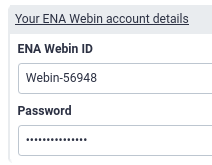

# Introduction


<!-- This is a comment. -->

Raw reads contain valuable information, such as coverage depth and quality scores, that is lost in a consensus sequence.
Submission of raw reads to public repositories allows reuse of data and reproducibility of analysis and enables discovery of minor allelic variants and intrahost variation, for example during the recent COVID-19 pandemic ().

The European Nucleotide Archive is an Open and FAIR repository of nucleotide data. As part of the International Nucleotide Sequence Database Collaboration (INSDC), ENA also indexes data from the NCBI and DDBJ . Data submitted to ENA must be accompanied by sufficient metadata. You can learn more from this [introductory slide deck](https://training.galaxyproject.org/training-material/topics/galaxy-interface/tutorials/upload-data-to-ena/slides.html) or directly from [ENA](https://ena-docs.readthedocs.io/en/latest/submit/general-guide/metadata.html).


In this tutorial we will show you how to use Galaxy's 'ENA Upload tool' to submit raw sequencing reads, consensus sequences and their associated metadata to ENA . You will learn to add your ENA Webin credentials to Galaxy, input metadata interactively or via a metadata template and submit the reads to ENA (test) server using Galaxy's 'ENA upload tool'.
Specifically, we will use one ONT sequencing file to demonstrate interactive metadata input and two sets of PE Illumina reads to demonstrate how to use the ENA metadata template. Finally, we will submit consensus sequences to ENA using 'Submit consensus sequence to ENA' tool.

Data will be submitted to ENA's test server and will not be public.

> <comment-title>Nature of the input data</comment-title>
> We will use data derived from sequencing data of bronchoalveolar lavage fluid (BALF) samples obtained from early COVID-19 patients in China as our input data.
> Human traces have been removed in [Galaxy](https://training.galaxyproject.org/training-material/topics/sequence-analysis/tutorials/human-reads-removal/tutorial.html).
>
{: .comment}


> <agenda-title></agenda-title>
>
> In this tutorial, we will cover:
>
> 1. TOC
> {:toc}
>
{: .agenda}

# Adding ENA Webin credentials to your Galaxy user information

In order to submit data to ENA, you need to have a valid Webin account. If you don't have one already you can register for one [here](https://www.ebi.ac.uk/ena/submit/sra/#registration). Webin credentials need to be included in your Galaxy user information before you can use the ENA Upload tool.

> <hands-on-title>Add Webin credentials to your Galaxy user information</hands-on-title>
>
> 1. If you have not already done so, log in to usegalaxy.eu
> 2. Navigate to *"User"* > *"Preferences"* on the top menu
>   - Click on <i class="fa fa-user" aria-hidden="true"></i> **Manage Information**
>     - Scroll down to *"Your ENA Webin account details"* and fill in your ***ENA Webin ID*** and ***Password***
>
{: .hands_on}

# Submitting raw sequence data (reads) to the ENA
## Option 1: submitting to ENA using interactive metadata generator

In this first example, you will submit one ONT sequence file using the interactive metadata forms from the ENA Upload tool. This method is only convenient for small submissions. For bulk submissions, we recommend you use the metadata template described below in Option 2.

> <hands-on-title>Data upload</hands-on-title>
>
> 1. Upload the ONT data from Zenodo via URLs
>
>    
>
>    The URL for our example data is this:
>
>    ```
>    https://zenodo.org/record/6912963/files/SRR10902284_ONT.fq.gz
>    ```
>
>
{: .hands_on}

Once the data is uploaded, we fill the metadata using  the ENA Upload tool. Interactive metadata forms are nested to fit [ENA's metadata model](https://ena-docs.readthedocs.io/en/latest/submit/general-guide/metadata.html). Briefly, you add Samples to a Study, Experiments to Samples and Runs to Experiments. The interactive metadata form does only two two [ENA Sample Checklists](https://www.ebi.ac.uk/ena/browser/checklists), the basic minimal sample metadata and the ENA virus pathogen reporting standard checklist. Switch between the basic template and the virus pathogen one under the "Does your submission contains viral samples?" question. If you wish to include additional metadata from a sample checklist, please use Option 2 below.

We recommend always submitting to the test server before submitting to the public one.
After you confirm that all the data and metadata looks ok, you can go ahead and submit to the public ENA server.


> <hands-on-title>add metadata interactively and submit a single sequence to ENA</hands-on-title>
>
> 1. :
>    - *"Action to execute"*: `Add new data`
>    - Under "Testing options":
>       - *"Submit to test ENA server?"*: `yes`
>       - *"Print the tables but do not submit the datasets"*: `no`
>    - *"Would you like to submit pregenerated table files or interactively define the input structures?"*: `Interactive generation of the study structure`
>    - *"Add .fastq.(gz.bz2) extension to the Galaxy dataset names to match the ones described in the input tables?"*: `No`
>    - *"Does your submission contains viral samples?"*: `yes`
> 2. Fill all metadata boxes and make sure that:
>    - *""*:
>    - *"Please select the type of study"*: `Whole Genome Sequencing`
>    - *"Enter the species of the sample"*: `Severe acute respiratory syndrome coronavirus 2`
>    - *"Enter the taxonomic ID corresponding to the sample species"*: `2697049`
>    - *"Host common name"*: `human`
>    - *"Host subject id"*: avoid using ID that can be use to trace samples back to patients
>    - *"Host scientific name"*: `Homo sapiens`
>    - *"Library strategy"*: `RNA-Seq`
>    - *"Select library source"*: `METAGENOMIC`
>    - *"Library selection"*: `RANDOM`
>    - *"Library layout"*: `SINGLE`
>    - *"Select the sequencing platform used"*: `Oxford Nanopore`
>    - *"Instrument model"*: `minION`
>    - *"Runs executed within this experiment"*
>      -  *"File(s) associated with this run"*: `SRR10902284_ONT.fq.gz`
>    - *"Affiliation center"*: your institution
>
{: .hands_on}

> <warning-title>Do not include personal identifiable data</warning-title>
> In some cases, some information is requested by ENA that may classify as personal or could be used to identify persons (e.g. 'host ID' for checklist ERC000033). Make sure that you do not publish any personal metadata that infringes privacy protection regulations in your jurisdiction.
{: .warning}

> <warning-title>Submit to the test server first</warning-title>
> Make sure  *"Submit to test ENA server?"*: `yes`. Otherwise your data will be submitted to the public server.
{: .warning}

Four metadata tables (Study, Sample, Experiment and Run), and a metadata ticket with submission information are generated. You can confirm a successful submission at ENA [test server](https://wwwdev.ebi.ac.uk/ena/submit/webin/) (or the [public server](https://www.ebi.ac.uk/ena/submit/sra), if you chose it).

> <tip-title>Metadata ticket</tip-title>
> Upon successful submission, a metadata ticket is generated. This contains information of the submission, including parseable metadata. Importantly, it contains Study, Sample, Run and Experiment accession numbers. The former two you will use later to link the consensus sequence to the raw data.
{: .tip}


## Option 2: submitting to ENA using a metadata template

For larger submissions, interactive metadata input can be tedious and not practical. In the second example, you will submit two sets of Illumina PE sequence files and input metadata using a template spreadsheet. This template contains all fields for ENA sample checklist *'ERC000033 - ENA virus pathogen reporting standard checklist'*. Tabular (.tsv and .xlsx) metadata templates for all sample checklist can be found in [this repository](https://github.com/ELIXIR-Belgium/ENA-metadata-templates).
For this tutorial, we provide you with a pre-filled template and encourage you to explore it.

> <hands-on-title>Upload and inspect data</hands-on-title>
>
> 1. Upload the ONT data from Zenodo via URLs:
>
>    ```
>    https://zenodo.org/record/6912963/files/SRR10903401_1.fastq.gz
>    https://zenodo.org/record/6912963/files/SRR10903401_2.fastq.gz
>    https://zenodo.org/record/6912963/files/SRR10903402_1.fastq.gz
>    https://zenodo.org/record/6912963/files/SRR10903402_2.fastq.gz
>    https://zenodo.org/record/6912963/files/metadata_template_ERC000033_mock_complete.xlsx
>    ```
> 2. Arrange the data into a paired dataset collection
>
>    
>
>    For the example datasets this means:
>    - You need to tell Galaxy about the suffix for your forward and reverse reads, respectively:
>      - set the text of *unpaired forward* to: `_1.fastq.gz`
>      - set the text of *unpaired reverse* to: `_2.fastq.gz`
>      - click: `Auto-pair`
>
>      All datasets should now be moved to the *paired section* of the dialog, and the middle column there should show that only the sample accession numbers, *i.e.* `SRR10903401` and `SRR10903402`, will be used as the pair names.
>
>    > <warning-title>Paired collection names</warning-title>
>    > It is very important that the paired collection names contain no suffix (e.g. _1, _R1, etc.) or file extensions (.fastq, .fastq.gz). The submission tool will add these at runtime and leaving them in the paired collection names will cause a mismatch with the filenames in the metadata table.
>    {: .warning }
>    - Make sure *Hide original elements* is checked to obtain a cleaned-up history after building the collection.
>    - Give your collection a name
>    - Click *Create Collection*
>
> 3. Inspect the `GTN_tutorial_mock_metadata.xlsx` (filled-in template) file by clicking on the  (eye) icon 
>
>    https://github.com/enasequence/webin-cli
>
>    > <question-title></question-title>
>    >
>    > 1. How many metadata sheets are there?
>    > 2. How is the 'Sample' section in the template different from that in the interactive metadata input?
>    >
>    > > <solution-title></solution-title>
>    > > 1. There are four metadata sheets, one per metadata object (Study, Sample, Experiment, Run)
>    > > 2. The Sample section is more extensive in the template spreadsheet, because it contains all the fields from ENA ERC000033 sample checklist, as well as all 'Recommended' and 'Optional' fields in the other sections.
>    >  {: .solution }
>    {: .question}
>
{: .hands_on}


As before, the submission is done to the test server before submitting to the public one.

> <hands-on-title>use a metadata template and submit multiple sequences to ENA</hands-on-title>
>
> 1. :
>    - *"Action to execute"*: `Add new data`
>    - Under "Testing options":
>       - *"Submit to test ENA server?"*: `yes`
>       - *"Print the tables but do not submit the datasets"*: `no`
>    - *"Would you like to submit pregenerated table files or interactively define the input structures?"*: `User generated metadata tables based on Excel templates`
>    - *"Select the metadata checklist"*: `ENA virus pathogen reporting standard checklist (ERC000033)`
>    - *"Select Excel (xlsx) file based on template"*: `metadata_template_ERC000033_mock_complete.xlsx`
>    - *"Select runs input format"*: `Input from a paired collection`
>    - *"List of paired-end runs files"*: select the collection you made above during data upload
>    - *"Affiliation center"*: your institution
>
{: .hands_on}

> <warning-title>Do not include personal identifiable data</warning-title>
> In some cases, some information is requested by ENA that may classify as personal or could be used to identify persons (e.g. 'host ID' for checklist ERC000033). Make sure that you do not publish any personal metadata that infringes privacy protection regulations in your jurisdiction.
{: .warning}

> <warning-title>Submit to the test server first</warning-title>
> Make sure  *"Submit to test ENA server?"*: `yes`. Otherwise your data will be submitted to the public server.
{: .warning}

Four metadata tables (Study, Sample, Experiment and Run), and a metadata ticket with submission information are generated. You can confirm a successful submission at ENA [test server](https://wwwdev.ebi.ac.uk/ena/submit/webin/) (or the [public server](https://www.ebi.ac.uk/ena/submit/sra), if you chose it).

> <tip-title>Metadata ticket</tip-title>
> Upon succesful submission, a metadata ticket is generated. This contains information of the submission, including parseable metadata. Importantly, it contains Study, Sample, Run and Experiment accession numbers. The former two you will use later to link the consensus sequence to the raw data.
{: .tip}

# Submitting consensus sequences to ENA

We produced consensus sequences for the Illumina data from Option 2 above following [SARS-CoV-2-PE-Illumina-WGS-variant-calling](https://workflowhub.eu/workflows/113?version=4), [SARS-CoV-2-variation-reporting](https://workflowhub.eu/workflows/109?version=5) and [COVID-19-consensus-construction](https://workflowhub.eu/workflows/138?version=4) workflows.

In this step we will submit one consensus sequence to ENA.
We will link it to the reads submitted in the first step using the accession numbers given to those submissions. Galaxy's 'ENA Upload tool' captures and stores metadata on a metadata ticket.


> <hands-on-title>submit consensus sequences to ENA</hands-on-title>
>
> 1. Upload the consensus sequence to Galaxy from Zenodo via URLs:
>    ```
>    https://zenodo.org/record/6912963/files/SRR10903401.fasta
>    ```
> 2.  Open the 'ENA submsission receipt' and find the Study and Sample accession numbers from the raw data submission.
> 3. :
>    - *"Submit to test ENA server?"*: `yes`
>    - *"Validate files and metadata but do not submit"*: `no`
>    - Fill the assembly metadata. For our assembly:
>    > - *"Assembly type"*: `Clone`
>    > - *"Assembly program"*: `BWA-MEM`
>    > - *"Molecule type"*: `genomic RNA`
>    > - *"Coverage"*: `1000`
>    > - *"Select the method to load study and sample metadata"*: `Fill in required metadata`
>    > - *"Assembly name"*: give a name to your assembly.
>    > - *"Study accession"*: `ERP139884` (you can find the Study accession number from your raw data submission metadata ticket)
>    > - *"Sample accession"*: `ERS12519941` (you can find the Sample accession number from your raw data submission metadata ticket)
>    > - *"Sequencing platform"*: `Illumina`
>    - Select the consensus sequence assembly file from your history: `SRR10903401.fasta`
>
{: .hands_on}

The output are a list of manifest (in our example one manifest) and a 'submission log'. The manifest file is the metadata required by [ENA's Webin CLI tool](https://github.com/enasequence/webin-cli). The 'submission log' can be useful to troubleshoot failed submissions.
