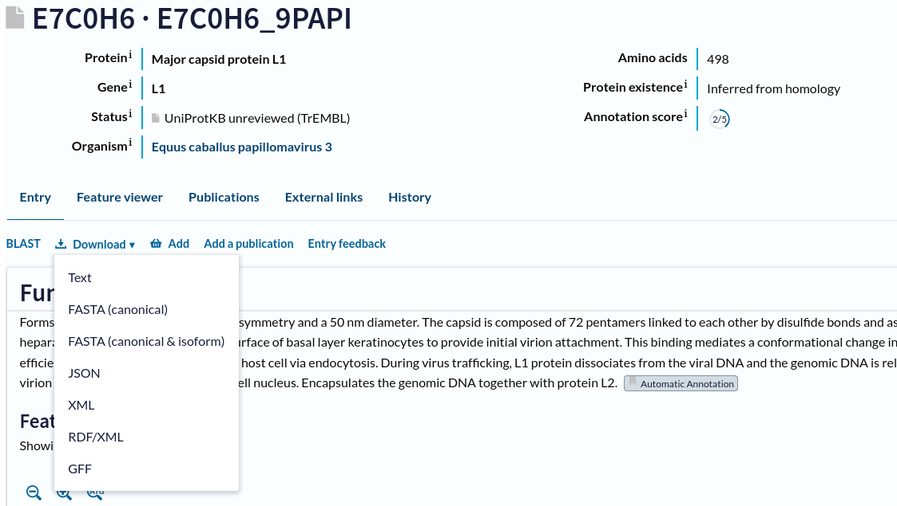
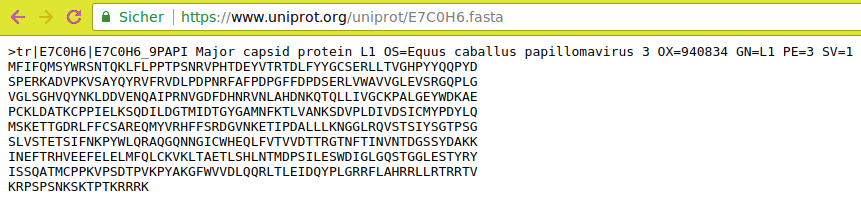

# Introduction


This builds on the previous Rule Based Uploader tutorial to cover even more advanced topics.

> ###   Audience
> This tutorial assumes a basic knowledge of using dataset collections in Galaxy but doesn't assume any particular knowledge of biology or bioinformatics. If you have not used collections with Galaxy previously, please check out the [using dataset collections]() tutorial.
{: .comment}

> <agenda-title></agenda-title>
>
> In this tutorial, we will:
>
> 1. TOC
> {:toc}
>
{: .agenda}

# Building URLs from Accession Information

In the previous examples the metadata we started with already contained URLs. In some cases such URLs will not be present in the available metadata and may need to be constructed dynamically from identifiers.

For this multiomics example, we will start with a uniprot query and build URLs from accession numbers contained within the supplied tabular data. Consider the uniprot query [https://uniprot.org/uniprot/?query=proteome:UP000052092+AND+proteomecomponent:"Genome"](https://uniprot.org/uniprot/?query=proteome:UP000052092+AND+proteomecomponent:%22Genome%22), pictured below.


In order to make this data useful for the Rule Builder, we need to turn these accessoin IDs into URLs.

> <hands-on-title>Turn Uniprot Accession IDs into URLs</hands-on-title>
>
> 1. Open [Uniprot](https://www.uniprot.org/uniprot/E7C0H6)
> 1. **Click** on one of the entries in the table (e.g. `E7C0H6`)
> 2. **Select** `Format` from the top menu
> 3. **Click** `FASTA (canonical)`
>
>    
>
> 4. Your browser will redirect to the fasta file
>
>    
>
> 5. We can deduce that the FASTA files for the other accession IDs will be available from URLs of the form `https://www.uniprot.org/uniprot/{identifier}.fasta`
> <!-- https://rest.uniprot.org/uniprotkb/search?format=fasta&includeIsoform=true&query=accession:E7C0H6  is also an option, for future editors. -->
{: .hands_on}
{:#example-3-metadata}

We will use this information to build a collection of FASTA files from our query.

> <hands-on-title>Build Collection from Uniprot Accession IDs</hands-on-title>
>
> 1. Open the Rule Builder
>    - *"Upload data as"*: `Collection(s)`
>    - *"Load tabular data from"*: `Pasted Table`
>    - **Paste** the following table:
>
>      ```
>      Entry	Entry name	Status	Protein names	Gene names	Organism	Length
>      E7C0H6	E7C0H6_9PAPI	unreviewed	Major capsid protein L1	L1	Equus caballus papillomavirus 3	498
>      E7C0H0	E7C0H0_9PAPI	unreviewed	Protein E6	E6	Equus caballus papillomavirus 3	150
>      E7C0H5	E7C0H5_9PAPI	unreviewed	Minor capsid protein L2	L2	Equus caballus papillomavirus 3	498
>      E7C0H1	E7C0H1_9PAPI	unreviewed	Protein E7		Equus caballus papillomavirus 3	93
>      E7C0H3	E7C0H3_9PAPI	unreviewed	Regulatory protein E2	E2	Equus caballus papillomavirus 3	421
>      E7C0H4	E7C0H4_9PAPI	unreviewed	Putative E4 early protein (Fragment)		Equus caballus papillomavirus 3	175
>      E7C0H2	E7C0H2_9PAPI	unreviewed	Replication protein E1 (EC 3.6.4.12) (ATP-dependent helicase E1)	E1	Equus caballus papillomavirus 3	621
>      ```
>
>    - Click `Build`
>   
>
> 2. Let's apply some initial filtering to our data:
>    - From **Filter** menu, select `First or Last N Rows`
>        - Filter the first row
>    - From **Rules** menu, select  `Remove Columns`
>        - Remove columns B, C, E, F, and G.
>    - From **Rules** menu, select  `Add / Modify Column Definitions`
>        - Click `Add Definition`, `Info`, Column `B`
>
>          This is a block of text that will appear in the history panel when the dataset is expanded.
>    
>
>    These datasets appear in a seemingly random order, it will be easier to manage things in the history panel if we sort this data first.
>    
>
> 3. From **Rules** menu, select `Sort`
>     - *"From Column"*: `A`
>
>    Next is the key step, we will build a URL from the pattern we described above using the accession ID in column A.
>
> 4. From **Column** menu, select `Using a Regular Expression`
>    - *"From Column"*: `A`
>    - Select `Create column from expression replacement`
>    - *"Regular Expression"*: `.*`
>    - *"Replacement Expression"*: `https://www.uniprot.org/uniprot/\0.fasta`
>    - Click `Apply`
>
>      
>
>    > <comment-title>Regular expression explained</comment-title>
>    > In this regular expression, `.*` will capture the entire accession ID.
>    >
>    > In the replacement expression, `https://www.uniprot.org/uniprot/\0.fasta`, the `\0` will be replaced by the captured
>    > regular expression (the accession ID) in the resulting column values.
>    {: .comment}
>
>    The new column C with the URL we built should appear as shown below.
>    
>
>    Finally, let us set our column definitions:
>
> 5. From **Rules** menu, select `Add / Modify Column Definitions`
>     - `Add Definition`, `List Identifier(s)`, Select Column `A`
>     - `Add Definition`, `URL`, Column `C`
>
> 6. Finalize the collection:
>     - *"Name"*: for example `UP000052092`
>     - *"Type"*: `fasta`
>     - Click `Build`
>    
>
>    > <comment-title>JSON Rule Definitions</comment-title>
>    > This example is ready to go, but before clicking "Build" it may be interesting to check out the rules Galaxy is following to clean and import your data. Click the little Wrench icon at the top of the list of rules. The result is a bunch of JavaScript object notation (JSON) text that you should never need to worry about but that you can build or modify by hand if you find it useful. We will use it the next example to quickly restore the list builder back to this state.
>    >
>    > 
>    >
>    > This could additionally be copied and pasted if you need to do the same set of operations on multiple metadata inputs that are similarly formatted.
>    {: .comment}
> 7. Click `Upload` and wait for your list of FASTA files to appear.
{: .hands_on}


# Building Matched Collections

This example will demonstrate creating multiple collections at the same time. We will use the same metadata generated from UniProt as the last example but we will build two collections with matching list identifiers - one collection of FASTA files and one collection of GFF files. This will also demonstrate reading the collection name and the target datatype from the metadata itself - important techniques if generating multiple collections with different names and datatypes.

For this example we will re-use the metadata from the [previous example](#example-3-metadata).

> <hands-on-title>Build a matched collection</hands-on-title>
>
> 1. **Open** the Rule Builder
>    - *"Upload data as"*: `Collection(s)`
>    - *"Load tabular data from"*: `Pasted Table`
>    - Paste the table from the previous exercise:
>
>      ```
>      Entry	Entry name	Status	Protein names	Gene names	Organism	Length
>      E7C0H6	E7C0H6_9PAPI	unreviewed	Major capsid protein L1	L1	Equus caballus papillomavirus 3	498
>      E7C0H0	E7C0H0_9PAPI	unreviewed	Protein E6	E6	Equus caballus papillomavirus 3	150
>      E7C0H5	E7C0H5_9PAPI	unreviewed	Minor capsid protein L2	L2	Equus caballus papillomavirus 3	498
>      E7C0H1	E7C0H1_9PAPI	unreviewed	Protein E7		Equus caballus papillomavirus 3	93
>      E7C0H3	E7C0H3_9PAPI	unreviewed	Regulatory protein E2	E2	Equus caballus papillomavirus 3	421
>      E7C0H4	E7C0H4_9PAPI	unreviewed	Putative E4 early protein (Fragment)		Equus caballus papillomavirus 3	175
>      E7C0H2	E7C0H2_9PAPI	unreviewed	Replication protein E1 (EC 3.6.4.12) (ATP-dependent helicase E1)	E1	Equus caballus papillomavirus 3	621
>      ```
>
> 2. Instead of manually creating the rules this time, we will import an existing set of rules. The easiest way to do this is to click the history icon . Clicking this will drop down a list of the 10 most recent rule sets you've used. Select the most recent one to reuse the rules from the last exercise.
>
>    You should now see the rules you created in the last example.
>    
>
>    > <comment-title>JSON Editor</comment-title>
>    >
>    > Another way to do this is to open the JSON Editor, by clicking the wrench icon  to the left of the history icon.  This will open up the JSON that gets created as you modify rules.  You can copy and paste JSON here or modify it directly. When you're working in this way, be sure to write good JSON (closing brackets, fields that make sense, etc.), otherwise you will get an error.
>    {: .comment}
>
>    If you don't see the rule set we used in the last  exercise anymore, here is the JSON that you can paste directly into the JSON Editor:
>
>    ```json
>    {"rules":[{"type":"add_filter_count","count":"1","which":"first","invert":false},{"type":"remove_columns","target_columns":[1,2,4,5,6]},{"type":"sort","target_column":0,"numeric":false},{"type":"add_column_regex","target_column":0,"expression":".*","replacement":"http://www.uniprot.org/uniprot/\\0.fasta"}],"mapping":[{"type":"info","columns":[1]},{"type":"list_identifiers","columns":[0],"editing":false},{"type":"url","columns":[2]}],"extension":"csfasta"}
>    ```
>
>    This next part may seem a bit silly at first but we are going to add some columns with fixed values into the builder. When we split up the columns at a later step this will make sense.
>
> 3. From **Column** menu, select  `Fixed Value`
>
>    - *"Value"*: `fasta`
>    - Click `Apply`
>
>    This value will eventually be used for the datatype of the file.
>
> 4. **Repeat** this process with:
>
>    - *"Value"*:`UP000052092 FASTA`
>
>    Next we will repeat the process of adding URL, name, and datatype columns but for GFF files.
>
> 5. From **Column**, select `Using a Regular Expression`
>
>    - *"From Column"*: `A`
>    - Select `Create column from expression replacement`
>    - *"Regular Expression"*: `.*`
>    - *"Replacement Expression"*: `https://www.uniprot.org/uniprot/\0.gff`.
>
> 
>
>    Next we will add two more columns
> 6. From **Column** menu, select  `Fixed Value`
>     - *"Value"*: `gff3`
>     - Click `Apply`
>
>    This value will eventually be used for the datatype of the file.
>
> 7. **Repeat** this process with:
>     - *"Value"*: `UP000052092 GFF3`
>
>    Your very large list of rules should now look like the following screenshot.
>    
>
>    Notice we have two URLs, two collection names, and two datatype extensions for each accession ID we started with. Like in the example where we split the columns, here we will split these up to describe multiple collections.
> 7. From **Rules** menu, select  `Split Columns`
>    - *"Odd Row Column(s)"*: `C`, `D`, and `E` (the fasta columns)
>    - *"Even Row Column(s)"*: `F`, `G`, and `H` (the gff3 columns)
>
>    This will take the row consisting of the columns `ABCDEFGH` and build two rows, one with `ABCDEF` and the other with `ABFGH`
>    
>
> 8. Click `Apply` and you should be returned the list of rules.
>    
>
>    Finally, we need to add some more column definitions for these new columns we just created:
>
> 9. From **Rules** menu, select `Add / Modify Column Definitions`
>     - `Add Definition`, `List Identifier`, Column `A`
>     - `Add Definition`, `Info`, Column `B`
>     - `Add Definition`, `URL`, Column `C`
>     - `Add Definition`, `Type`, Column `D`
>     - `Add Definition`, `Collection Name`, Column `E`
>
>    Notice when these values are being generated from the metadata the option to specify them manually from the **type** and **collection name** boxes from the bottom of the form disappear.
>    
>
> 10. Click `Upload`
>
>     Galaxy should make two collections - one containing FASTA files and one containing GFF3 files.
>
{: .hands_on}


# Building Nested Lists

In this example, we will be building a nested list using data from [SRA](https://www.ncbi.nlm.nih.gov/sra). This is a more sophisticated structure for organizing datasets in Galaxy. In the above examples we organized datasets into simple lists with a single "list identifier" describing the files in the collection. Galaxy allows lists to be organized into nested lists - where each level of the list has an identifier.

If two such identifiers are present, this is a list of lists (called ``list:list`` in the workflow editor). In such a structure the outer identifiers (or first level of identifiers) may describe sample names and the inner identifiers (or second level) may describe replicates. Alternative the outer identifiers may describe conditions and the inner identifiers may describe individual samples. The structure of such collections should ideally be dictated by the study design.

If certain parts of your analysis require benefit from datasets being nested this way while other parts require feeding you data to a Galaxy tool all together without such a structure, then it is probably best to go ahead and build nested lists at the start of your analysis and then use the "Flatten Collection" tool on the resulting collection or a derivative collection to get the flat structure needed by certain tools in certain parts of your analysis.

For this example, we will describe analyzing the metadata of the [SRA project PRJNA355367](https://www.ncbi.nlm.nih.gov/sra?term=PRJNA355367&cmd=DetailsSearch). Unlike the other examples, these SRA files are relatively large and not ideal for training purposes. So we've pre-downloaded the project metadata and replaced all the links with simple text files that should download really quickly - the [result is here](./PRJNA355367.tsv).

So use either the SRA exporter tool or download the CSV file with fake URLs. If you download the data from the SRA exporter tool, select only the first 12 columns from the data (up to the column labeled "Library Name") and copy the resulting data to your clipboard.


> <hands-on-title>Building Nested Lists</hands-on-title>
>
> 1. Open the Rule Builder
>    - *"Upload data as"*: `Collection(s)`
>    - *"Load tabular data from"*: `Pasted Table`
>    - Paste the table
>
>    > <solution-title>Show Table</solution-title>
>    >
>    > Below is the table with pre-downloaded example data mentioned above:
>    >
>    > ```
>    > Run	ReleaseDate	LoadDate	spots	bases	spots_with_mates	avgLength	size_MB	AssemblyName	download_path	Experiment	LibraryName
>    > SRR5363633	2017-03-21 11:40:07	2017-03-21 11:29:13	9942851	1993124486	9791175	200	809	assembly	https://raw.githubusercontent.com/jmchilton/galaxy-examples/master/sra_PRJNA355367/SRR5363633	SRX2659078	wtPA14
>    > SRR5363634	2017-03-21 13:19:08	2017-03-21 13:17:11	1158307	232298840	1141697	200	81	assembly	https://raw.githubusercontent.com/jmchilton/galaxy-examples/master/sra_PRJNA355367/SRR5363634	SRX2659079	con10
>    > SRR5363635	2017-03-21 13:19:08	2017-03-21 13:16:39	1270067	254490549	1249658	200	89	assembly	https://raw.githubusercontent.com/jmchilton/galaxy-examples/master/sra_PRJNA355367/SRR5363635	SRX2659080	con9
>    > SRR5363636	2017-03-21 13:19:08	2017-03-21 13:16:56	1023725	205709452	1013013	200	74	assembly	https://raw.githubusercontent.com/jmchilton/galaxy-examples/master/sra_PRJNA355367/SRR5363636	SRX2659081	con8
>    > SRR5363637	2017-03-21 11:37:06	2017-03-21 11:28:00	3179821	638410351	3141113	200	216	assembly	https://raw.githubusercontent.com/jmchilton/galaxy-examples/master/sra_PRJNA355367/SRR5363637	SRX2659082	con7
>    > SRR5363638	2017-03-21 12:53:08	2017-03-21 12:04:58	3359498	675138344	3325080	200	288	assembly	https://raw.githubusercontent.com/jmchilton/galaxy-examples/master/sra_PRJNA355367/SRR5363638	SRX2659083	con6
>    > SRR5363639	2017-03-21 13:19:08	2017-03-21 13:17:25	2074389	416191247	2046343	200	145	assembly	https://raw.githubusercontent.com/jmchilton/galaxy-examples/master/sra_PRJNA355367/SRR5363639	SRX2659084	con5
>    > SRR5363640	2017-03-21 13:19:08	2017-03-21 13:17:46	2692438	540402576	2658118	200	187	assembly	https://raw.githubusercontent.com/jmchilton/galaxy-examples/master/sra_PRJNA355367/SRR5363640	SRX2659085	con4
>    > SRR5363641	2017-03-21 13:19:08	2017-03-21 13:17:14	2271913	456015568	2243122	200	161	assembly	https://raw.githubusercontent.com/jmchilton/galaxy-examples/master/sra_PRJNA355367/SRR5363641	SRX2659086	con3
>    > SRR5363642	2017-03-21 13:19:08	2017-03-21 13:16:58	2164949	434399488	2136063	200	151	assembly	https://raw.githubusercontent.com/jmchilton/galaxy-examples/master/sra_PRJNA355367/SRR5363642	SRX2659087	con2
>    > SRR5363643	2017-03-21 11:37:06	2017-03-21 11:27:34	1999861	401313700	1973567	200	140	assembly	https://raw.githubusercontent.com/jmchilton/galaxy-examples/master/sra_PRJNA355367/SRR5363643	SRX2659088	con1
>    > SRR5363644	2017-03-21 11:44:06	2017-03-21 11:36:06	13473203	2704705108	13306228	200	1076	assembly	https://raw.githubusercontent.com/jmchilton/galaxy-examples/master/sra_PRJNA355367/SRR5363644	SRX2659089	str10
>    > SRR5363645	2017-03-21 11:37:06	2017-03-21 11:27:24	1801962	362038363	1782599	200	130	assembly	https://raw.githubusercontent.com/jmchilton/galaxy-examples/master/sra_PRJNA355367/SRR5363645	SRX2659090	str9
>    > SRR5363646	2017-03-21 11:36:06	2017-03-21 11:26:22	39113	7861711	39106	200	4	assembly	https://raw.githubusercontent.com/jmchilton/galaxy-examples/master/sra_PRJNA355367/SRR5363646	SRX2659091	str8
>    > SRR5363647	2017-03-21 11:36:06	2017-03-21 11:26:43	1255569	252289127	1242359	200	90	assembly	https://raw.githubusercontent.com/jmchilton/galaxy-examples/master/sra_PRJNA355367/SRR5363647	SRX2659092	str7
>    > SRR5363648	2017-03-21 11:36:06	2017-03-21 11:26:42	903374	181362535	892308	200	64	assembly	https://raw.githubusercontent.com/jmchilton/galaxy-examples/master/sra_PRJNA355367/SRR5363648	SRX2659093	str6
>    > SRR5363649	2017-03-21 11:37:06	2017-03-21 11:27:05	2059145	413598822	2035919	200	140	assembly	https://raw.githubusercontent.com/jmchilton/galaxy-examples/master/sra_PRJNA355367/SRR5363649	SRX2659094	str5
>    > SRR5363650	2017-03-21 11:37:06	2017-03-21 11:27:37	1685689	338152407	1662375	200	119	assembly	https://raw.githubusercontent.com/jmchilton/galaxy-examples/master/sra_PRJNA355367/SRR5363650	SRX2659095	str4
>    > SRR5363651	2017-03-21 11:36:06	2017-03-21 11:26:51	698470	140689157	694502	201	48	assembly	https://raw.githubusercontent.com/jmchilton/galaxy-examples/master/sra_PRJNA355367/SRR5363651	SRX2659096	str3
>    > SRR5363652	2017-03-21 11:37:06	2017-03-21 11:27:53	755393	152119594	750753	201	52	assembly	https://raw.githubusercontent.com/jmchilton/galaxy-examples/master/sra_PRJNA355367/SRR5363652	SRX2659097	str2
>    > SRR5363653	2017-03-21 11:37:06	2017-03-21 11:27:41	1651613	331529685	1630882	200	119	assembly	https://raw.githubusercontent.com/jmchilton/galaxy-examples/master/sra_PRJNA355367/SRR5363653	SRX2659098	str1
>    > SRR5363654	2017-03-21 11:37:06	2017-03-21 11:27:37	1693765	340003252	1672625	200	118	assembly	https://raw.githubusercontent.com/jmchilton/galaxy-examples/master/sra_PRJNA355367/SRR5363654	SRX2659099	gen10
>    > SRR5363655	2017-03-21 11:37:06	2017-03-21 11:28:30	2173449	436124391	2144642	200	153	assembly	https://raw.githubusercontent.com/jmchilton/galaxy-examples/master/sra_PRJNA355367/SRR5363655	SRX2659100	gen9
>    > SRR5363656	2017-03-21 11:43:06	2017-03-21 11:33:05	9625215	1933561588	9519090	200	778	assembly	https://raw.githubusercontent.com/jmchilton/galaxy-examples/master/sra_PRJNA355367/SRR5363656	SRX2659101	gen8
>    > SRR5363657	2017-03-21 11:37:06	2017-03-21 11:27:38	1106350	222126014	1092932	200	79	assembly	https://raw.githubusercontent.com/jmchilton/galaxy-examples/master/sra_PRJNA355367/SRR5363657	SRX2659102	gen7
>    > SRR5363658	2017-03-21 11:37:07	2017-03-21 11:27:07	565475	113765064	560920	201	42	assembly	https://raw.githubusercontent.com/jmchilton/galaxy-examples/master/sra_PRJNA355367/SRR5363658	SRX2659103	gen6
>    > SRR5363659	2017-03-21 11:37:07	2017-03-21 11:28:20	1320926	265553033	1308329	201	96	assembly	https://raw.githubusercontent.com/jmchilton/galaxy-examples/master/sra_PRJNA355367/SRR5363659	SRX2659104	gen5
>    > SRR5363660	2017-03-21 11:37:07	2017-03-21 11:28:18	949047	190786413	939940	201	70	assembly	https://raw.githubusercontent.com/jmchilton/galaxy-examples/master/sra_PRJNA355367/SRR5363660	SRX2659105	gen4
>    > SRR5363661	2017-03-21 11:39:07	2017-03-21 11:29:11	1609659	323469152	1593027	200	116	assembly	https://raw.githubusercontent.com/jmchilton/galaxy-examples/master/sra_PRJNA355367/SRR5363661	SRX2659106	gen3
>    > SRR5363662	2017-03-21 11:37:07	2017-03-21 11:28:20	1244105	249942443	1230587	200	90	assembly	https://raw.githubusercontent.com/jmchilton/galaxy-examples/master/sra_PRJNA355367/SRR5363662	SRX2659107	gen2
>    > SRR5363663	2017-03-21 11:44:06	2017-03-21 11:34:00	13546763	2714292352	13327595	200	1112	assembly	https://raw.githubusercontent.com/jmchilton/galaxy-examples/master/sra_PRJNA355367/SRR5363663	SRX2659108	gen1
>    > SRR5363664	2017-03-21 11:37:07	2017-03-21 11:28:35	1995417	400617217	1971115	200	140	assembly	https://raw.githubusercontent.com/jmchilton/galaxy-examples/master/sra_PRJNA355367/SRR5363664	SRX2659109	pit9
>    > SRR5363665	2017-03-21 11:39:07	2017-03-21 11:29:18	2098280	421450493	2074524	200	146	assembly	https://raw.githubusercontent.com/jmchilton/galaxy-examples/master/sra_PRJNA355367/SRR5363665	SRX2659110	pit10
>    > SRR5363666	2017-03-21 11:39:07	2017-03-21 11:28:56	1624164	326200210	1605561	200	115	assembly	https://raw.githubusercontent.com/jmchilton/galaxy-examples/master/sra_PRJNA355367/SRR5363666	SRX2659111	pit8
>    > SRR5363667	2017-03-21 11:39:07	2017-03-21 11:28:56	1765896	355178220	1750742	201	122	assembly	https://raw.githubusercontent.com/jmchilton/galaxy-examples/master/sra_PRJNA355367/SRR5363667	SRX2659112	pit7
>    > SRR5363668	2017-03-21 11:39:07	2017-03-21 11:29:36	834144	167643900	825708	200	59	assembly	https://raw.githubusercontent.com/jmchilton/galaxy-examples/master/sra_PRJNA355367/SRR5363668	SRX2659113	pit6
>    > SRR5363669	2017-03-21 11:42:06	2017-03-21 11:31:07	9524989	1913263017	9418320	200	780	assembly	https://raw.githubusercontent.com/jmchilton/galaxy-examples/master/sra_PRJNA355367/SRR5363669	SRX2659114	pit5
>    > SRR5363670	2017-03-21 11:39:07	2017-03-21 11:28:48	1196456	240479817	1184548	200	84	assembly	https://raw.githubusercontent.com/jmchilton/galaxy-examples/master/sra_PRJNA355367/SRR5363670	SRX2659115	pit4
>    > SRR5363671	2017-03-21 11:39:07	2017-03-21 11:29:21	1703068	341745049	1680568	200	119	assembly	https://raw.githubusercontent.com/jmchilton/galaxy-examples/master/sra_PRJNA355367/SRR5363671	SRX2659116	pit3
>    > SRR5363672	2017-03-21 11:40:07	2017-03-21 11:29:21	1752519	352259586	1735224	201	122	assembly	https://raw.githubusercontent.com/jmchilton/galaxy-examples/master/sra_PRJNA355367/SRR5363672	SRX2659117	pit2
>    > SRR5363673	2017-03-21 11:37:07	2017-03-21 11:28:40	1702102	341794907	1682027	200	121	assembly	https://raw.githubusercontent.com/jmchilton/galaxy-examples/master/sra_PRJNA355367/SRR5363673	SRX2659118	pit1
>    > SRR5363674	2017-03-21 11:37:07	2017-03-21 11:28:41	2186337	438861929	2158858	200	155	assembly	https://raw.githubusercontent.com/jmchilton/galaxy-examples/master/sra_PRJNA355367/SRR5363674	SRX2659119	car10
>    > SRR5363675	2017-03-21 11:37:07	2017-03-21 11:28:37	1806341	362679360	1784566	200	128	assembly	https://raw.githubusercontent.com/jmchilton/galaxy-examples/master/sra_PRJNA355367/SRR5363675	SRX2659120	car9
>    > SRR5363676	2017-03-21 11:37:07	2017-03-21 11:28:29	1492644	299621613	1473926	200	106	assembly	https://raw.githubusercontent.com/jmchilton/galaxy-examples/master/sra_PRJNA355367/SRR5363676	SRX2659121	car8
>    > SRR5363677	2017-03-21 11:40:07	2017-03-21 11:29:02	2139706	429729175	2115063	200	151	assembly	https://raw.githubusercontent.com/jmchilton/galaxy-examples/master/sra_PRJNA355367/SRR5363677	SRX2659122	car7
>    > SRR5363678	2017-03-21 11:40:07	2017-03-21 11:29:13	1787521	358790286	1764881	200	124	assembly	https://raw.githubusercontent.com/jmchilton/galaxy-examples/master/sra_PRJNA355367/SRR5363678	SRX2659123	car6
>    > SRR5363679	2017-03-21 11:38:06	2017-03-21 11:28:48	1500378	300767719	1477539	200	106	assembly	https://raw.githubusercontent.com/jmchilton/galaxy-examples/master/sra_PRJNA355367/SRR5363679	SRX2659124	car5
>    > SRR5363680	2017-03-21 11:38:06	2017-03-21 11:28:54	879242	176495860	868255	200	63	assembly	https://raw.githubusercontent.com/jmchilton/galaxy-examples/master/sra_PRJNA355367/SRR5363680	SRX2659125	car4
>    > SRR5363681	2017-03-21 11:40:07	2017-03-21 11:30:02	1852256	371663665	1827605	200	130	assembly	https://raw.githubusercontent.com/jmchilton/galaxy-examples/master/sra_PRJNA355367/SRR5363681	SRX2659126	car3
>    > SRR5363682	2017-03-21 11:40:07	2017-03-21 11:29:40	996680	199979148	983324	200	72	assembly	https://raw.githubusercontent.com/jmchilton/galaxy-examples/master/sra_PRJNA355367/SRR5363682	SRX2659127	car2
>    > SRR5363683	2017-03-21 11:40:07	2017-03-21 11:29:49	1089078	218680766	1076092	200	79	assembly	https://raw.githubusercontent.com/jmchilton/galaxy-examples/master/sra_PRJNA355367/SRR5363683	SRX2659128	car1
>    > SRR5363684	2017-03-21 11:40:07	2017-03-21 11:29:57	1682993	337921519	1662784	200	118	assembly	https://raw.githubusercontent.com/jmchilton/galaxy-examples/master/sra_PRJNA355367/SRR5363684	SRX2659129	cef10
>    > SRR5363685	2017-03-21 11:40:07	2017-03-21 11:29:46	1274849	255689623	1256747	200	92	assembly	https://raw.githubusercontent.com/jmchilton/galaxy-examples/master/sra_PRJNA355367/SRR5363685	SRX2659130	cef9
>    > SRR5363686	2017-03-21 11:40:07	2017-03-21 11:29:22	1218188	244568636	1203299	200	87	assembly	https://raw.githubusercontent.com/jmchilton/galaxy-examples/master/sra_PRJNA355367/SRR5363686	SRX2659131	cef8
>    > SRR5363687	2017-03-21 11:40:07	2017-03-21 11:30:06	2027741	406979584	2001785	200	142	assembly	https://raw.githubusercontent.com/jmchilton/galaxy-examples/master/sra_PRJNA355367/SRR5363687	SRX2659132	cef7
>    > SRR5363688	2017-03-21 11:40:07	2017-03-21 11:29:38	998237	200918449	991068	201	72	assembly	https://raw.githubusercontent.com/jmchilton/galaxy-examples/master/sra_PRJNA355367/SRR5363688	SRX2659133	cef6
>    > SRR5363689	2017-03-21 11:40:07	2017-03-21 11:29:26	518920	104507529	515814	201	41	assembly	https://raw.githubusercontent.com/jmchilton/galaxy-examples/master/sra_PRJNA355367/SRR5363689	SRX2659134	cef5
>    > SRR5363690	2017-03-21 11:44:06	2017-03-21 11:33:47	11530820	2311357478	11354074	200	982	assembly	https://raw.githubusercontent.com/jmchilton/galaxy-examples/master/sra_PRJNA355367/SRR5363690	SRX2659135	cef4
>    > SRR5363691	2017-03-21 11:40:07	2017-03-21 11:29:41	516125	103920037	512793	201	41	assembly	https://raw.githubusercontent.com/jmchilton/galaxy-examples/master/sra_PRJNA355367/SRR5363691	SRX2659136	cef3
>    > SRR5363692	2017-03-21 11:40:07	2017-03-21 11:30:11	890572	179326220	884948	201	65	assembly	https://raw.githubusercontent.com/jmchilton/galaxy-examples/master/sra_PRJNA355367/SRR5363692	SRX2659137	cef2
>    > SRR5363693	2017-03-21 11:40:07	2017-03-21 11:30:04	978135	196865238	971039	201	74	assembly	https://raw.githubusercontent.com/jmchilton/galaxy-examples/master/sra_PRJNA355367/SRR5363693	SRX2659138	cef1
>    > SRR5363694	2017-03-21 11:40:07	2017-03-21 11:29:57	1959249	393031721	1932180	200	138	assembly	https://raw.githubusercontent.com/jmchilton/galaxy-examples/master/sra_PRJNA355367/SRR5363694	SRX2659139	imi2
>    > SRR5363695	2017-03-21 11:40:07	2017-03-21 11:29:43	1074984	215595123	1059636	200	76	assembly	https://raw.githubusercontent.com/jmchilton/galaxy-examples/master/sra_PRJNA355367/SRR5363695	SRX2659140	imi1
>    > SRR5363696	2017-03-21 11:41:07	2017-03-21 11:29:48	1288979	258545055	1270889	200	92	assembly	https://raw.githubusercontent.com/jmchilton/galaxy-examples/master/sra_PRJNA355367/SRR5363696	SRX2659141	dor10
>    > SRR5363697	2017-03-21 11:42:06	2017-03-21 11:31:06	2908416	583478795	2868638	200	200	assembly	https://raw.githubusercontent.com/jmchilton/galaxy-examples/master/sra_PRJNA355367/SRR5363697	SRX2659142	dor9
>    > SRR5363698	2017-03-21 11:49:07	2017-03-21 11:37:59	15442120	3097410993	15225523	200	1224	assembly	https://raw.githubusercontent.com/jmchilton/galaxy-examples/master/sra_PRJNA355367/SRR5363698	SRX2659143	dor8
>    > SRR5363699	2017-03-21 11:40:07	2017-03-21 11:30:00	1718167	344971206	1697410	200	123	assembly	https://raw.githubusercontent.com/jmchilton/galaxy-examples/master/sra_PRJNA355367/SRR5363699	SRX2659144	dor7
>    > SRR5363700	2017-03-21 11:41:07	2017-03-21 11:29:57	1739828	349655178	1722126	200	125	assembly	https://raw.githubusercontent.com/jmchilton/galaxy-examples/master/sra_PRJNA355367/SRR5363700	SRX2659145	dor6
>    > SRR5363701	2017-03-21 11:45:06	2017-03-21 11:35:22	18584730	3732962863	18375556	200	1453	assembly	https://raw.githubusercontent.com/jmchilton/galaxy-examples/master/sra_PRJNA355367/SRR5363701	SRX2659146	dor5
>    > SRR5363702	2017-03-21 11:44:06	2017-03-21 11:35:13	12158676	2438787680	11987886	200	981	assembly	https://raw.githubusercontent.com/jmchilton/galaxy-examples/master/sra_PRJNA355367/SRR5363702	SRX2659147	dor4
>    > SRR5363703	2017-03-21 11:44:06	2017-03-21 11:34:44	11391713	2283748728	11219804	200	916	assembly	https://raw.githubusercontent.com/jmchilton/galaxy-examples/master/sra_PRJNA355367/SRR5363703	SRX2659148	dor3
>    > SRR5363704	2017-03-21 11:42:06	2017-03-21 11:32:45	6155766	1236497552	6086854	200	513	assembly	https://raw.githubusercontent.com/jmchilton/galaxy-examples/master/sra_PRJNA355367/SRR5363704	SRX2659149	dor2
>    > SRR5363705	2017-03-21 11:41:07	2017-03-21 11:30:25	1002355	201209957	989835	200	72	assembly	https://raw.githubusercontent.com/jmchilton/galaxy-examples/master/sra_PRJNA355367/SRR5363705	SRX2659150	dor1
>    > SRR5363706	2017-03-21 11:41:07	2017-03-21 11:30:25	752409	151419028	746795	201	59	assembly	https://raw.githubusercontent.com/jmchilton/galaxy-examples/master/sra_PRJNA355367/SRR5363706	SRX2659151	cip10
>    > SRR5363707	2017-03-21 11:44:06	2017-03-21 11:33:49	10594069	2127067244	10466132	200	870	assembly	https://raw.githubusercontent.com/jmchilton/galaxy-examples/master/sra_PRJNA355367/SRR5363707	SRX2659152	cip9
>    > SRR5363708	2017-03-21 11:41:07	2017-03-21 11:30:31	1431059	287670501	1417182	201	105	assembly	https://raw.githubusercontent.com/jmchilton/galaxy-examples/master/sra_PRJNA355367/SRR5363708	SRX2659153	cip8
>    > SRR5363709	2017-03-21 11:41:07	2017-03-21 11:30:41	1208297	242791534	1195595	200	88	assembly	https://raw.githubusercontent.com/jmchilton/galaxy-examples/master/sra_PRJNA355367/SRR5363709	SRX2659154	cip7
>    > SRR5363710	2017-03-21 11:41:07	2017-03-21 11:30:35	1370364	275356971	1355960	200	100	assembly	https://raw.githubusercontent.com/jmchilton/galaxy-examples/master/sra_PRJNA355367/SRR5363710	SRX2659155	cip6
>    > SRR5363711	2017-03-21 11:42:06	2017-03-21 11:31:24	1593545	320335049	1578109	201	116	assembly	https://raw.githubusercontent.com/jmchilton/galaxy-examples/master/sra_PRJNA355367/SRR5363711	SRX2659156	cip5
>    > SRR5363712	2017-03-21 11:41:07	2017-03-21 11:31:00	1332160	267714312	1318490	200	99	assembly	https://raw.githubusercontent.com/jmchilton/galaxy-examples/master/sra_PRJNA355367/SRR5363712	SRX2659157	cip4
>    > SRR5363713	2017-03-21 11:42:06	2017-03-21 11:31:02	1893119	379943269	1868718	200	134	assembly	https://raw.githubusercontent.com/jmchilton/galaxy-examples/master/sra_PRJNA355367/SRR5363713	SRX2659158	cip3
>    > SRR5363714	2017-03-21 11:42:06	2017-03-21 11:31:01	1839276	369651139	1820660	200	129	assembly	https://raw.githubusercontent.com/jmchilton/galaxy-examples/master/sra_PRJNA355367/SRR5363714	SRX2659159	cip2
>    > SRR5363715	2017-03-21 11:26:06	2017-03-21 10:59:33	712060	142833136	702138	200	51	assembly	https://raw.githubusercontent.com/jmchilton/galaxy-examples/master/sra_PRJNA355367/SRR5363715	SRX2659160	cip1
>    > ```
>    {: .solution}
>
>    
>
>    The resulting table should look something like the following:
>    
>
>    Navigate to the end of the table and notice that column J is the URL target we are hoping to download for each file.
>
> 2. As in the previous exercises, please:
>     - Set this `Column definition` for the URL target
>     - Strip the header row
>
>       > <solution-title></solution-title>
>       > From **Filter** menu, select `First or Last N Rows`
>       >   - Filter first Row
>       >
>       >  From **Rules** menu, select  `Add / Modify Column Definitions`
>       >   - `Add Definition`, `URL`, Column `J`.
>       >   
>       {: .solution}
>
>    For the analysis we wish to do, we want to group these files based on the type indicated in column `L` (LibraryName) shown below.
>    The source data though adds numbers to the library type to generate the `LibraryName`, so we need to strip those out to use the type
>    as an identifier for grouping the datasets. To do this, use the regex column adder rule again.
>
> 3. From **Column** menu, select `Using a Regular Expression`
>     - *"From Column"*: `L`
>     - Select `Create columns matching expression groups`
>     - *"Regular Expression"*: `([^\d]+)\d+`.
>     - *"Number of Groups"*: `1`
>
>    The result looks like:
>    
>
>    > <comment-title>Regular expression explained</comment-title>
>    > In this regular expression, `\d` means any digit, so `[^...]` means match anything that is not inside the brackets.
>    > So together `[^\d]+` means match one or more, non digits at the start of the column and the `()` around that means capture
>    > them into a group. We've add `\d+` at the end of the expression but it isn't grouped so we are effectively ignoring the
>    > digits at the end as we had hoped.
>    {: .comment}
>
>    Now we have two columns we need to assign list identifiers for, the new column `M` for the first, outer identifier and the
>    first column `A` for the inner, second identifier.
>
> 4. From **Rules** menu, select `Add / Modify Column Definitions`
>     - `Add Definition`, `List Identifier(s)`, Column `M`
>     - Click on `... Assign Another Column`
>     - Select column `A`
>
>        > <comment-title>Re-ordering columns</comment-title>
>        > If you make a mistake in the order you select columns in you can simple use the up and down arrows to re-arrange the list
>        {: .comment}
>
>    The result should look something like this:
>    
>
> 5. Click `Apply` to return to the rule preview screen and notice there are two column listed for the list identifier definition
>   
>
> 6. Finalize your collection:
>    - *"Type"*: `txt`
>    - Name your Collection
>    - Click `Upload`
>
>    Note: set *"Type"* to `sra` if you used real data from SRA instead of the table from exercise.
>   
>
{: .hands_on}

# Apply Rules to Existing Collections

To start this example, we will first upload a simple, flat collection of data. The data files we will use
will be the same as those used by the [DESeq2 Vignette](https://bioconductor.org/packages/devel/bioc/vignettes/DESeq2/inst/doc/DESeq2.html)
from the [Pasilla Bioconductor Package](https://bioconductor.org/packages/release/data/experiment/html/pasilla.html).

> <hands-on-title>Applying Rules to Existing Collections</hands-on-title>
>
> 1. Open the Rule Builder
>    - *"Upload data as"*: `Collection(s)`
>    - *"Load tabular data from"*: `Pasted Table`
>    - Paste the following table:
>
>    ```
>    https://raw.githubusercontent.com/jmchilton/galaxy/apply_rules_tutorials/test-data/rules/treated1fb.txt treated_single_1
>    https://raw.githubusercontent.com/jmchilton/galaxy/apply_rules_tutorials/test-data/rules/treated2fb.txt treated_paired_2
>    https://raw.githubusercontent.com/jmchilton/galaxy/apply_rules_tutorials/test-data/rules/treated3fb.txt treated_paired_3
>    https://raw.githubusercontent.com/jmchilton/galaxy/apply_rules_tutorials/test-data/rules/untreated1fb.txt untreated_single_4
>    https://raw.githubusercontent.com/jmchilton/galaxy/apply_rules_tutorials/test-data/rules/untreated2fb.txt untreated_single_5
>    https://raw.githubusercontent.com/jmchilton/galaxy/apply_rules_tutorials/test-data/rules/untreated3fb.txt untreated_paired_6
>    https://raw.githubusercontent.com/jmchilton/galaxy/apply_rules_tutorials/test-data/rules/untreated4fb.txt untreated_paired_7
>    ```
>
>    Next, we set up the column types:
>
> 2. From **Rules** menu, select  `Add / Modify Column Definitions`
>    - `Add Definition`, `URL`, column `A`
>    - `Add Definition`, `List Identifier(s)`, column `B`
>    
>
> 3. Finalize the collection:
>    - *"Type"*: `txt`
>    - Give the collection a name.
>    - Click `Build`
>    
>
>    The first thing we will do to this new collection is add some levels or depth to its structure.
>    Lets assume we want to group it into "treated" and "untreated" lists and "paired" and "single"
>    sublists below that. We can do this with the `Apply Rules` collection operation tool, which will
>    likely be under the `Collection Operations` tool menu in your Galaxy interface.
>
> 4. Open the **Apply Rules** tool
>
>    The very simple interface should look something like this:
>    
>
>    This interface simply lets one pick a collection to operate on and then launch the rule builder
>    window to work to describe and preview manipulating the metadata of that collection.
>
> 5. **Apply Rules**  with the following parameters:
>    - *"Input Collection"*: the collection we just uploaded
>    - Click the `Edit` button
>    
>
>    When a flat collection is used with this tool, the rule builder will initialize a default rule to pull
>    the list identifier out for each item of the collection as shown above. Next we will use regular expressions
>    to build two new columns, these columns will group the datasets into "treated" and "untreated" sublists and
>    then "single" and "paired" sublists of that. This rule is found under the `Column` menu.
>
>    We'll transform column A into some more useful columns
>
> 6. From **Column**, select `Using a Regular Expression`
>    - *"Column"*: `A`
>    - Select `Create columns matching expression groups`
>    - *"Regular Expression"*: `(.*)_(.*)_.*`
>    - *"Number of Groups"*: `2`
>
>    > <comment-title>Regular expression explained</comment-title>
>    >  Here ``.*`` means match any number of any character - so basically match anything.
>    >  The parentheses around ``.*`` means form a "group" from whatever is matched.
>    >  The ``_`` describes the literal ``_`` values in the identifier we are matching. The result is that
>    > everything before the first ``_`` will be matched as the first group and everything between the ``_``
>    > characters will be matched as the second group. Click to apply this rule and two new columns should be created.
>    >
>    > We have defined two matching groups (the `(.*)` in the regex), so the number of groups is set to `2`
>    {: .comment}
>
> 7. From  **Rules**, select `Add / Modify Column Definitions`
>    - `Add Definition`, `List Identifier(s)`, Column `B`
>    - `Assign another column`, column `C`
>    - `Assign another column`, column `A`
>    - Click `Save`
>
>    
>
>    The resulting collection should have two new levels of depth for "untreated" vs "treated" and "paired" vs "single" as shown below:
>    
>
>    Placing the "single" and "paired" sublists inside the "treated" and "untreated" lists was a bit arbitrary and depending on the
>    workflow these may need to be inverted at different parts of an analysis. The `Apply Rules` tool can be used to invert these levels
>    if that is needed.
>
> 8. **Apply Rules**  with the following parameters:
>    - *"Input Collection"*: the new nested list we created in the previous step
>    - Click "Edit".
>
>     
>
>    Notice when loading a nested collection into the rule builder, there is a column for each layer of the list for each element.
>    One can pretty easily invert the outer two layers of the list by simply assigning the list identifiers in a new order. So select to assign "List Identifiers" and this time assign them to columns "B", "A", and "C" - in that order.
>
> 9. From **Rules**, select `Add / Modify Column Definitions`
>    - `Add Definition`, `List Identifier(s)`, Column `B`
>    - `Assign another column`, Column `A`
>    - `Assign another column`, Column `C`
>    - Click `Save`
>
>    
>
>    The resulting collection should be inverted.
>
>    
>
>    In addition to structural re-organizations of a collection, the `Apply Rules` tool can be used to
>    filter elements out of the collection.
>
> 10. **Apply Rules**  with the following parameters:
>     - *"Input Collection"*: the original flat list created
>     - Click `Edit`
>     - From **Filter** menu, select `Using a Regular Expression`
>       - *"From Column"*: `A`
>       - *"Regular Expression"*: `.*_single_.*`
>     - From **Rules** menu, select `Add / Modify Column Definitions`
>       - `Add Definition`, `List Identifier(s)`, Column `A`
>
>     
>
>     The resulting collection should be a filtered version of the original list.
>
>     
>
>     Structural re-organizations of collections can also be combined with filtering. To demonstrate this, reopen the original flat list created for this example again in the rule builder of the `Apply Rules` tool. Use the same regular expression as last time to filter the result but also add a column for "treated" and "untreated" list identifiers.
>
> 11. **Apply Rules**  with the following parameters:
>     - From **Filter** menu, select `Using a Regular Expression`
>       - *"From Column"*: `A`
>       - *"Regular Expression"*: `.*_single_.*`
>     - From **Column** menu, select `Using a Regular Expression`
>       - *"From Column"*: `A`
>       - Select `Create columns matching expression groups`
>       - *"Regular Expression"*:  `(.*)_single_.*`
>       - *"Number of Groups"*: `1`
>     - From **Rules** menu, select  `Add / Modify Column Definitions`
>       - `Add Definition`, `List Identifier(s)`. Column `B`
>       - `Assign another column`, Column `A`
>
>     
>
>     The resulting collection should be a filtered to only include the "single" data and broken into "treated" and "untreated" sublists.
>
>     
{: .hands_on}
