# Introduction


Through a series of examples, this tutorial aims to familiarize the reader with building Galaxy collections from tabular data containing URLs, sample sheets, list of accessions or identifiers, etc..

> ###   Audience
> This tutorial assumes a basic knowledge of using dataset collections in Galaxy but doesn't assume any particular knowledge of biology or bioinformatics. If you have not used collections with Galaxy previously, please check out the [using dataset collections]() tutorial.
{: .comment}

> <agenda-title></agenda-title>
>
> In this tutorial, we will:
>
> 1. TOC
> {:toc}
>
{: .agenda}

# Uploading Datasets with Rules


This approach could be used to manipulate lists of uploads coming from many different formats, but we will start with a tabular description of files for a study from the [European Nucleotide Archive](https://www.ebi.ac.uk/ena). We will be using the data from a study of [16s ribosomal RNA](https://www.ebi.ac.uk/ena/data/view/PRJDA60709).

> <hands-on-title>Downloading Data from ENA</hands-on-title>
> To start, navigate to the above study and click the option to "Select columns". Here we will narrow the set of columns we consider to just a few relevant to uploading these files to Galaxy.
>
> Select only:
>
> - Study accession
> - Experiment accession
> - FASTQ files (FTP)
> - Sample accession
>
> The table should look like:
>
> Study accession | Sample accession | Experiment accession | FASTQ files (FTP)
> --------------- | ---------------- | -------------------- | -----------------
> PRJDA60709      | SAMD00016379     | DRX000475            | File 1
> PRJDA60709      | SAMD00016383     | DRX000476            | File 1
> PRJDA60709      | SAMD00016380     | DRX000477            | File 1
> PRJDA60709      | SAMD00016378     | DRX000478            | File 1
> PRJDA60709      | SAMD00016381     | DRX000479            | File 1
> PRJDA60709      | SAMD00016382     | DRX000480            | File 1
>
> Download the resulting tabular data describing the files by clicking the "TEXT" link at the top of the page. Alternatively, the resulting sample sheet can be downloaded directly [here](https://www.ebi.ac.uk/ena/data/warehouse/filereport?accession=PRJDA60709&result=read_run&fields=study_accession,sample_accession,experiment_accession,fastq_ftp&download=true). The number and size of the files for this example are relatively small for sequencing data but larger files and larger numbers of files should work as well - Galaxy will just need more time to download and process the files.
{: .hands_on}

Unfortunately the ENA ftp server is not operational at this moment,
so we have to use a backup from zenodo.
You can select all the data below and copy them to your clipboard.

```
study_accession	sample_accession	experiment_accession	fastq_ftp
PRJDA60709	SAMD00016379	DRX000475	https://zenodo.org/api/files/c07c0fbd-c578-4c8c-989d-5181f8824773/DRR000770.fastqsanger.gz
PRJDA60709	SAMD00016383	DRX000476	https://zenodo.org/api/files/c07c0fbd-c578-4c8c-989d-5181f8824773/DRR000771.fastqsanger.gz
PRJDA60709	SAMD00016380	DRX000477	https://zenodo.org/api/files/c07c0fbd-c578-4c8c-989d-5181f8824773/DRR000772.fastqsanger.gz
PRJDA60709	SAMD00016378	DRX000478	https://zenodo.org/api/files/c07c0fbd-c578-4c8c-989d-5181f8824773/DRR000773.fastqsanger.gz
PRJDA60709	SAMD00016381	DRX000479	https://zenodo.org/api/files/c07c0fbd-c578-4c8c-989d-5181f8824773/DRR000774.fastqsanger.gz
PRJDA60709	SAMD00016382	DRX000480	https://zenodo.org/api/files/c07c0fbd-c578-4c8c-989d-5181f8824773/DRR000775.fastqsanger.gz
```
{:#example-1-metadata}

> <hands-on-title>Accessing the Rule Based Uploader</hands-on-title>
>
> 1. **Click** the upload icon toward the top left corner.
>
>    By default the familiar simple upload dialog should appear. This dialog has more advanced options as different tabs across the top of this dialog though.
>
> 2. **Click** `Rule-based` as shown below.
>
>    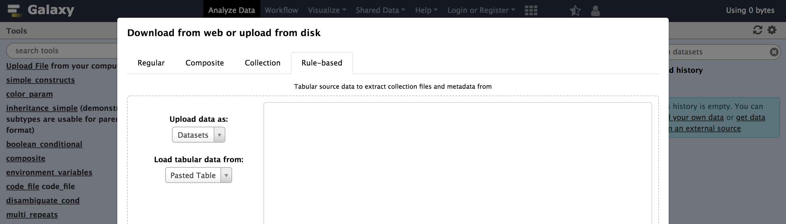
>    As you can see in this dialog, data can be selected from a history dataset or pasted in directly. If Galaxy is configured to allow FTP uploads, the contents of your FTP directory may be loaded directly as well.
>
> 3. **Paste** your tabular data right into the textbox on this page as shown below
>     - **Click** the `Build` button.
>
>    ```
>    study_accession	sample_accession	experiment_accession	fastq_ftp
>    PRJDA60709	SAMD00016379	DRX000475	https://zenodo.org/api/files/c07c0fbd-c578-4c8c-989d-5181f8824773/DRR000770.fastqsanger.gz
>    PRJDA60709	SAMD00016383	DRX000476	https://zenodo.org/api/files/c07c0fbd-c578-4c8c-989d-5181f8824773/DRR000771.fastqsanger.gz
>    PRJDA60709	SAMD00016380	DRX000477	https://zenodo.org/api/files/c07c0fbd-c578-4c8c-989d-5181f8824773/DRR000772.fastqsanger.gz
>    PRJDA60709	SAMD00016378	DRX000478	https://zenodo.org/api/files/c07c0fbd-c578-4c8c-989d-5181f8824773/DRR000773.fastqsanger.gz
>    PRJDA60709	SAMD00016381	DRX000479	https://zenodo.org/api/files/c07c0fbd-c578-4c8c-989d-5181f8824773/DRR000774.fastqsanger.gz
>    PRJDA60709	SAMD00016382	DRX000480	https://zenodo.org/api/files/c07c0fbd-c578-4c8c-989d-5181f8824773/DRR000775.fastqsanger.gz
>    ```
>
>    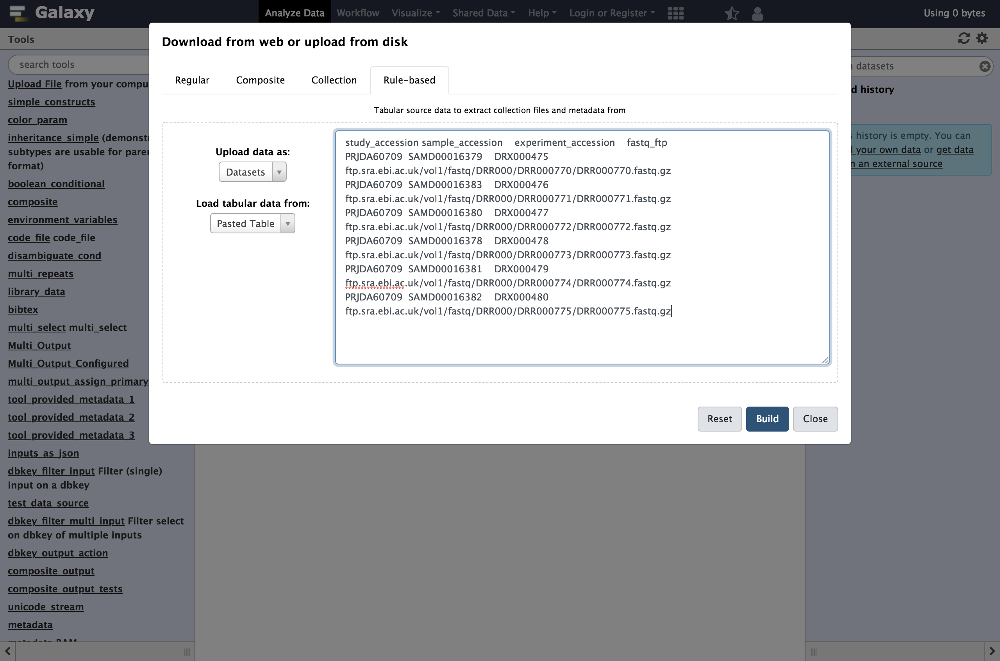
>
> 4. **Examine** the  the `rules editor` which now pops up.
>
>    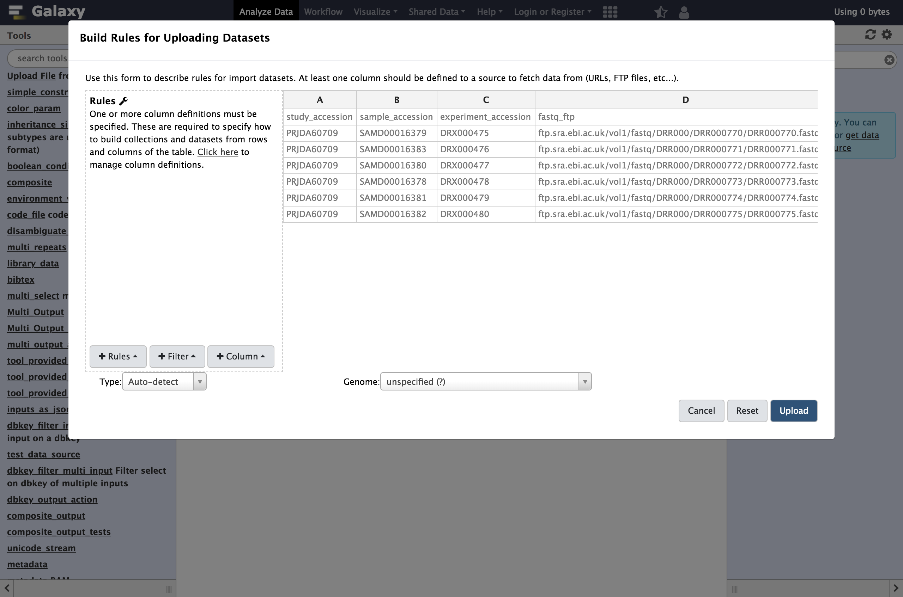
>
{: .hands_on}

At first glance, this may be feel like Excel or another spreadsheet program and you may feel the urge to start editing cells but we strongly encourage defining rules for manipulating the data instead. There are a few reasons for this:

* **Manually modifying this metadata is not reproducible** - we will not belabor the point here but check out [Why not use excel for this?]() for more context. Building up rules for modifying this metadata will allow Galaxy to track and report your manipulations (providing traceability) and apply them to new sets of files (providing reproducibility).
* **Manually modifying this metadata is error prone** - we believe defining rules and treating the metadata in a systematic way minimizes the possibility to manual errors. These errors can be very hard to detect for large sets of data.
* **Manually modifying data is not scalable** - this rule-based technique potentially scales to importing tens of thousands of datasets.

So rather than modifying the data, we will define rules for manipulating it and setting up "column definitions" that tell Galaxy how to use the metadata during upload or collection creation.

In order to get these files into Galaxy, we will want to do a few things:
* Strip that header out of the data (it doesn't contain a URL Galaxy can download).
* Define column `C` as the dataset name.
* Define column `D` as the dataset URL (this is the location Galaxy can download the data from).
* Tell Galaxy to treat these files as `fastqsanger.gz` files.

> <hands-on-title>Using Tabular Inputs to the Rule Builder</hands-on-title>
>
> We will start by stripping that header out of the table. We call rules that strip rows out the table `Filter rules` in this dialog.
>
> 1. From **Filter** menu select `First or Last N Rows`
>    - *"Filter which rows?"*: `first`
>    - *"Filter how many rows?"*: `1`
>    - Click `Apply`
>    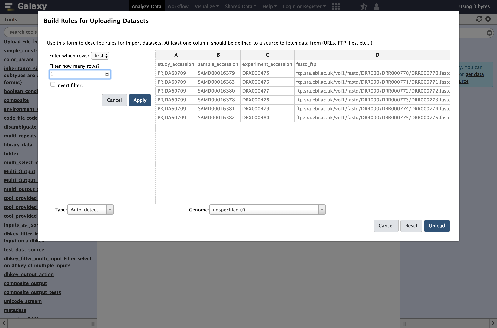
>
>    Next we will define these columns for Galaxy.
>
> 2. From **Rules** menu select `Add / Modify Column Definitions`
>     - Click `Add Definition` button and select `Name`
>       - *"Name"*: `C`
>     - Repeat this again and select `URL` instead.
>       - *"URL"*: `D`
>
>    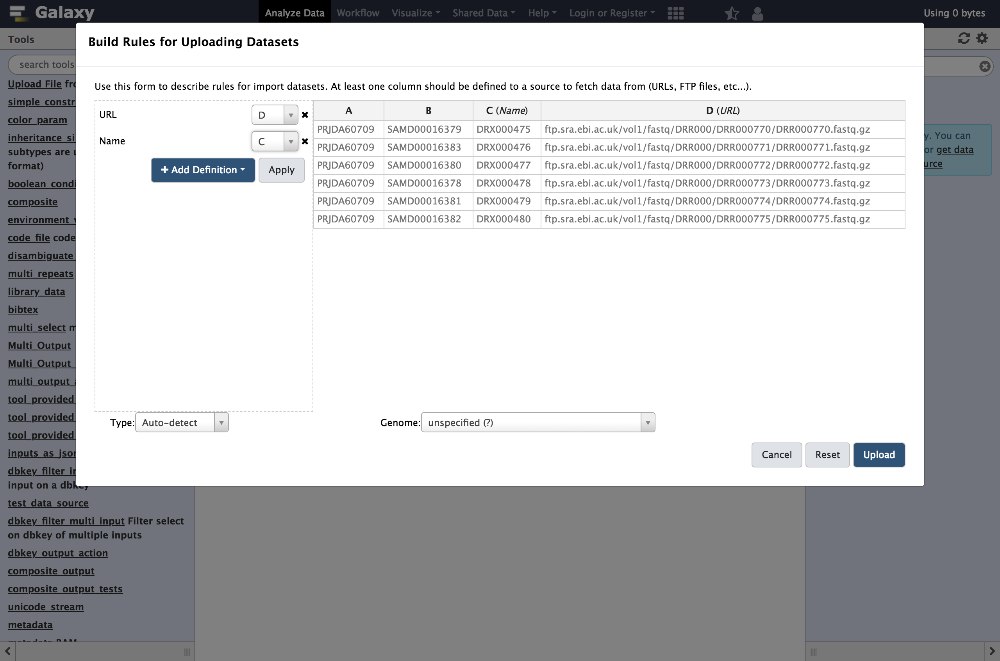
>
> 3. **Click** `Apply`, and you should see your new column definitions listed as in the following screenshot.
>    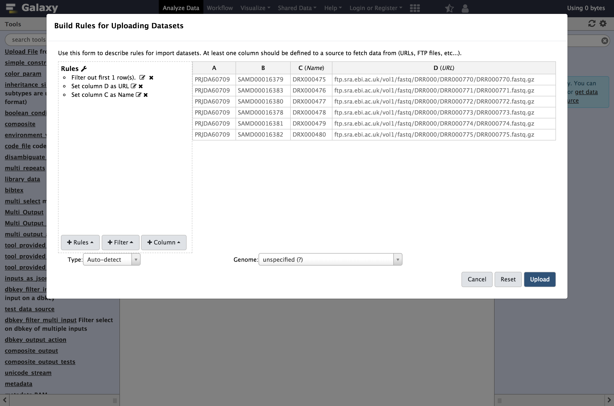
>
>    You are now ready to start the upload
>
> 4. **Click** the `Upload` button
>
>    After some time, the result in this case will be six datasets in your history. The next example will show to use the rule builder to create a collection.
{: .hands_on}

# Creating a Simple Dataset List

This example will demonstrate using such history datasets as the source for collection uploads - this can be handy when you'd like to apply existing Galaxy tabular manipulation tools to the metadata before processing for instance.

> <hands-on-title>Creating a Simple Dataset List</hands-on-title>
>
> > <tip-title>Create a new history</tip-title>
> > Before we start uploading, it may be a good idea to create a new history for this example to keep things simple and match the following screenshots.
> {: .tip}
>
> For our second example, we will use the same initial metadata, but instead uploaded as a file to Galaxy. This is a relatively common use case wherein you, through some filtering and querying in Galaxy, build a list of accession numbers or other sample identifiers, and then want to fetch the associated datasets to begin working with them.
>
> > <comment-title>Loading Metadata from a History Element</comment-title>
> > In addition to directly pasting data into the Rule Based Uploader, you can also load the metadata from a dataset in your Galaxy History, or from a file in your FTP directory if the admin has enabled FTP upload
> {: .comment}
>
> 1. **Upload** the metadata from the [first example](#example-1-metadata) to your Galaxy, as a normal paste upload:
>
>    ```
>    study_accession	sample_accession	experiment_accession	fastq_ftp
>    PRJDA60709	SAMD00016379	DRX000475	https://zenodo.org/api/files/c07c0fbd-c578-4c8c-989d-5181f8824773/DRR000770.fastqsanger.gz
>    PRJDA60709	SAMD00016383	DRX000476	https://zenodo.org/api/files/c07c0fbd-c578-4c8c-989d-5181f8824773/DRR000771.fastqsanger.gz
>    PRJDA60709	SAMD00016380	DRX000477	https://zenodo.org/api/files/c07c0fbd-c578-4c8c-989d-5181f8824773/DRR000772.fastqsanger.gz
>    PRJDA60709	SAMD00016378	DRX000478	https://zenodo.org/api/files/c07c0fbd-c578-4c8c-989d-5181f8824773/DRR000773.fastqsanger.gz
>    PRJDA60709	SAMD00016381	DRX000479	https://zenodo.org/api/files/c07c0fbd-c578-4c8c-989d-5181f8824773/DRR000774.fastqsanger.gz
>    PRJDA60709	SAMD00016382	DRX000480	https://zenodo.org/api/files/c07c0fbd-c578-4c8c-989d-5181f8824773/DRR000775.fastqsanger.gz
>    ```
>
> 2. **Open** the `Rule-based` upload tab again, but this time:
>    - *"Upload data as"*: `Collection(s)`
>    - *"Load tabular data from"*: `a History Dataset`
>    - *"Select dataset to load"*: the dataset you just uploaded
>
>    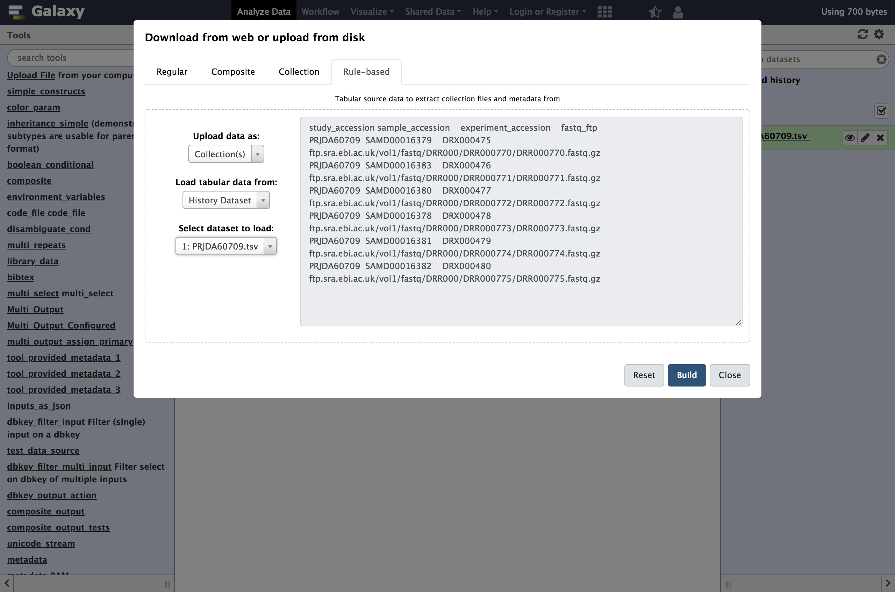
>
>    > <tip-title>Don't see your dataset?</tip-title>
>    > If you don't see your dataset, refresh your page and try again.
>    {: .tip}
>
> 3. **Click** `Build` to bring up the rule builder.
>    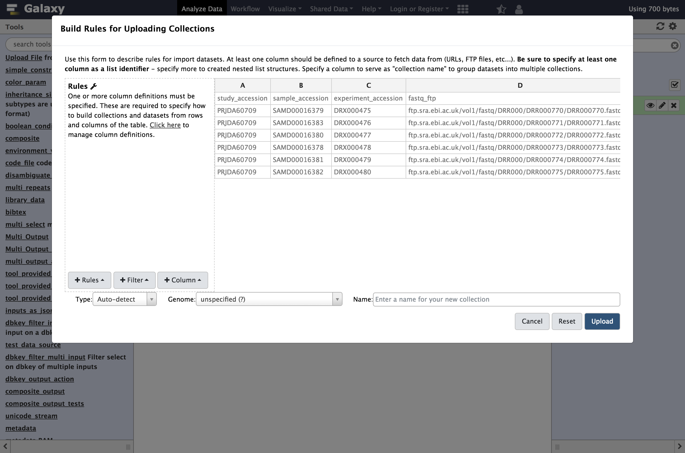
> 4. **Repeat** the steps from last time, except define column `C` as a `List Identifier` instead of Name:
>    - From **Filter** menu select `First or Last N Rows`
>        - *"Filter which rows?"*: `first`
>        - *"Filter how many rows?"*: `1`
>    - From **Rules** menu, select `Add / Modify Column Definitions`
>        - `Add Definition`, `URL`, Select Column `D`
>        - `Add Definition`, `List Identifier(s)`, Column `C`
>    - *"Type"*: `fastqsanger.gz`
>
>    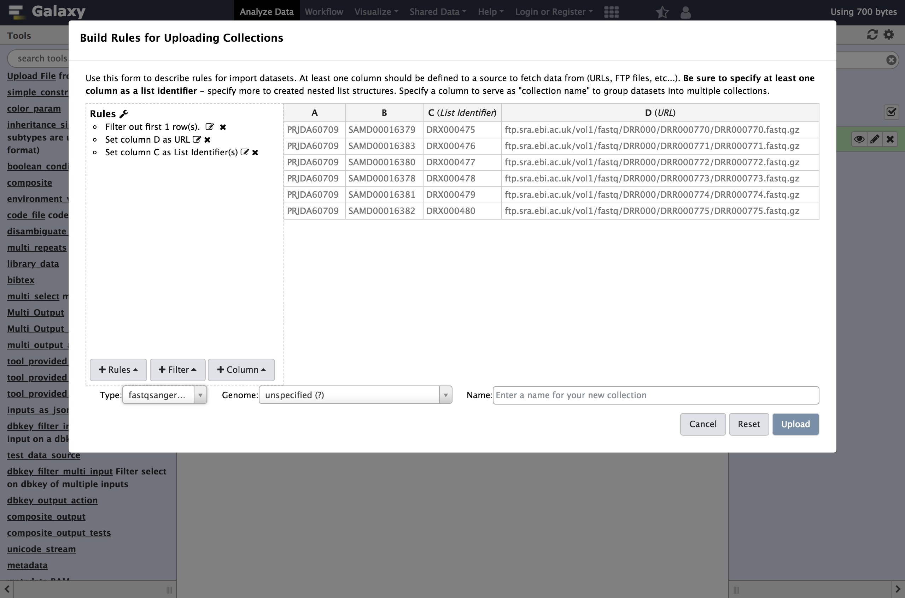
>
>    Rather than assigning column `C` as `Name`, in this example we assigned it as a `List Identifier`. This is the description of the element in the resulting dataset collection. This identifier is preserved in mapped outputs as you map tools over collections and is useful for tracking sample names, replicate numbers, conditions, etc..
>
> 5. **Enter** a name for our collection, for example the ENA study identifier as shown below, `PRJDA60709`.
>    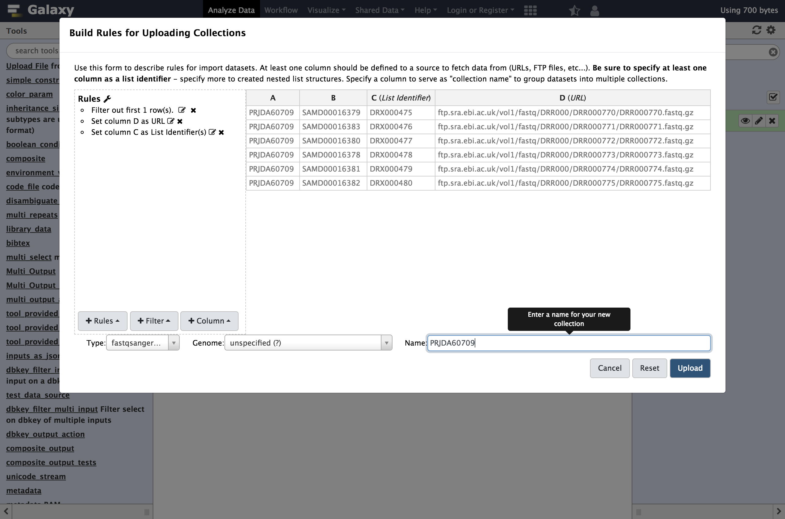
> 6. **Click** `Upload`
>
>    This time a single new entry will appear in your history panel corresponding to all the files gathered together in a simple list named **PRJDA60709**.
{: .hands_on}


# Creating a List of Dataset Pairs

For this next example we will again use ENA data, this time corresponding to the study [PRJDB3920](https://www.ebi.ac.uk/ena/data/view/PRJDB3920) instead.

> <hands-on-title>Creating a List of Dataset Pairs</hands-on-title>
>
> 1. **Open** the Rule Builder
>
> 2. **Open** the `Rule-based` upload tab again, but this time:
>    - *"Upload data as"*: Collection(s)
>    - *"Load tabular data from"*: a `Pasted Table`
>    - **Paste** the following table
>
>      ```
>      study_accession	sample_accession	experiment_accession	fastq_ftp
>      PRJDB3920	SAMD00034150	DRX036147	https://zenodo.org/api/files/0c8d6a74-23dd-4d36-a32d-950eb038dacc/DRX036147_1.fastq.gz;https://zenodo.org/api/files/0c8d6a74-23dd-4d36-a32d-950eb038dacc/DRX036147_2.fastq.gz
>      PRJDB3920	SAMD00034150	DRX036148	https://zenodo.org/api/files/0c8d6a74-23dd-4d36-a32d-950eb038dacc/DRX036148_1.fastq.gz;https://zenodo.org/api/files/0c8d6a74-23dd-4d36-a32d-950eb038dacc/DRX036148_2.fastq.gz
>      PRJDB3920	SAMD00034150	DRX036149	https://zenodo.org/api/files/0c8d6a74-23dd-4d36-a32d-950eb038dacc/DRX036149_1.fastq.gz;https://zenodo.org/api/files/0c8d6a74-23dd-4d36-a32d-950eb038dacc/DRX036149_2.fastq.gz
>      PRJDB3920	SAMD00034150	DRX036150	https://zenodo.org/api/files/0c8d6a74-23dd-4d36-a32d-950eb038dacc/DRX036150_1.fastq.gz;https://zenodo.org/api/files/0c8d6a74-23dd-4d36-a32d-950eb038dacc/DRX036150_2.fastq.gz
>      PRJDB3920	SAMD00034150	DRX036151	https://zenodo.org/api/files/0c8d6a74-23dd-4d36-a32d-950eb038dacc/DRX036151_1.fastq.gz;https://zenodo.org/api/files/0c8d6a74-23dd-4d36-a32d-950eb038dacc/DRX036151_2.fastq.gz
>      PRJDB3920	SAMD00034153	DRX036152	https://zenodo.org/api/files/0c8d6a74-23dd-4d36-a32d-950eb038dacc/DRX036152_1.fastq.gz;https://zenodo.org/api/files/0c8d6a74-23dd-4d36-a32d-950eb038dacc/DRX036152_2.fastq.gz
>      PRJDB3920	SAMD00034152	DRX036164	https://zenodo.org/api/files/0c8d6a74-23dd-4d36-a32d-950eb038dacc/DRX036164_1.fastq.gz;https://zenodo.org/api/files/0c8d6a74-23dd-4d36-a32d-950eb038dacc/DRX036164_2.fastq.gz
>      ```
>
>
> 3. **Click** `Build` and proceed to the rule builder.
>    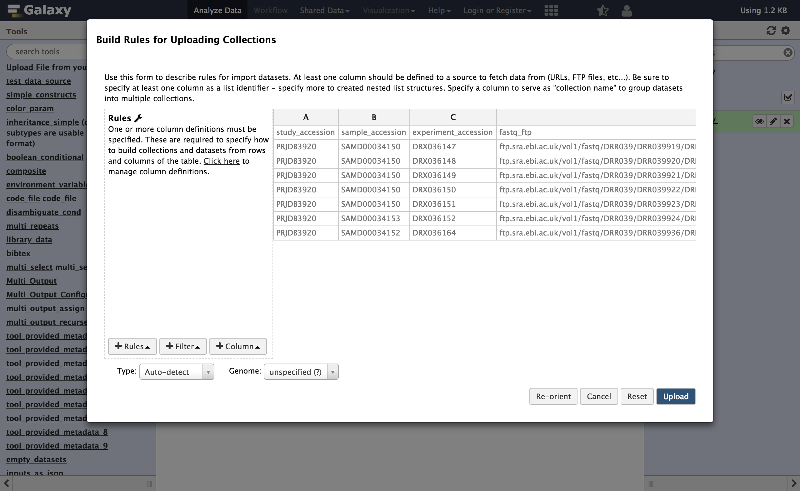
>
> 4. **Repeat** the last example with:
>    - From **Filter** menu select `First or Last N Rows`
>        - *"Filter which rows?"*: `first`
>        - *"Filter how many rows?"*: `1`
>    - From **Rules** menu, select `Add / Modify Column Definitions`
>        - `Add Definition`, `List Identifier(s)`, Column `C`
>    - *"Type"*: `fastqsanger.gz`
>
>    In this dataset, column `D` contains two URLs, separated by a semicolon `;`. So we cannot define that column as the URL directly, we will need to split it into two columns first.
>    We will build a regular expression that captures two "groups" from this column with two URLs - one group for everything before the `;` and one group for everything after.
> 5. From **Column**, select `Using a Regular Expression`
>    - *"From Column"*: `D`
>    - Select `Create columns matching expression groups`
>    - *"Regular Expression"*: `(.*);(.*)`
>    - *"Number of Groups"*: `2`
>    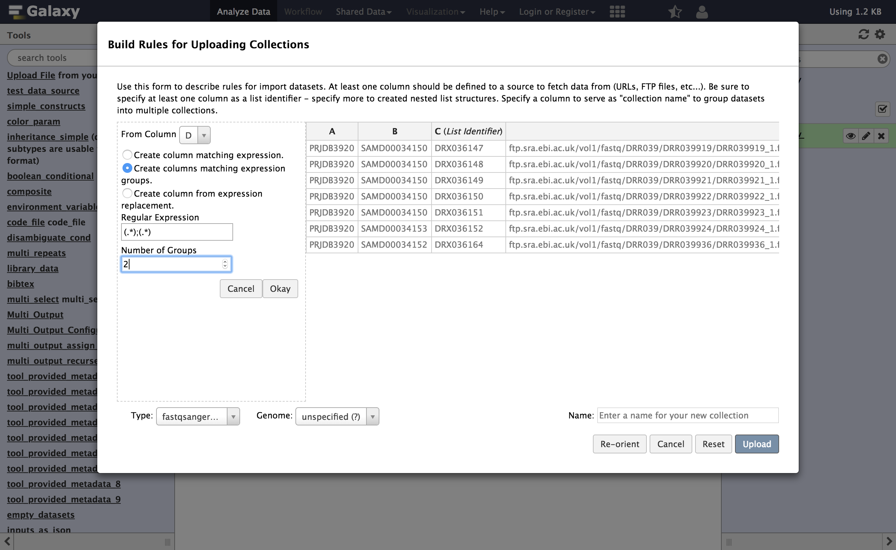
>
>    > <comment-title>Regular expression explained</comment-title>
>    > Here `.*` means match any number of any character - so basically match anything.
>    > The parentheses around `.*` means form a "group" from whatever is matched. The `;` will match with the actual `;` in the target cells.
>    > In his example we have two such matching groups.
>    {: .comment}
>
> 6. Click **Apply** to apply the regular expression to the metadata table
>
>    Column `D` is no longer needed, so we can remove it:
> 7. From **Rules** select `Remove Column(s)`
>     - *"From Column"*: `D`
>    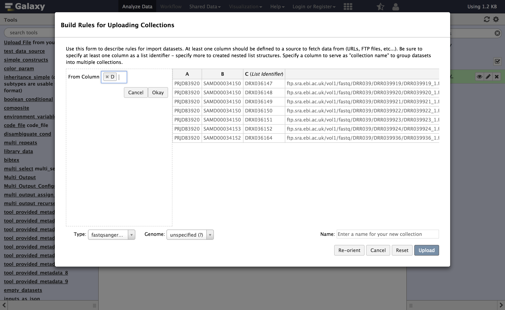
>
>    We now have two columns containing URLs - but we can only have one URL per row. So we will split each row into two (one for the forward reads and one for the reverse):
> 8. From **Rules** select `Split Column(s)`
>    - *"Odd Row Column(s)"*: `D`
>    - *"Even Row Column(s)"*: `E`
>    - Click `Apply`
>
>    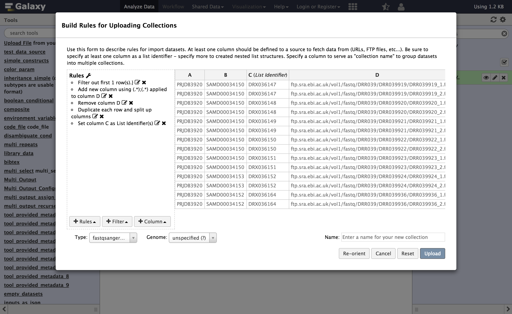
>    For every row before the transformation with columns `ABCDE`, this will produce two rows, `ABCD` and `ABCE`. Thus you will have twice as many rows as before.
>    <br><br>
>    Now we need to inform Galaxy which of these rows are "forward" reads and which are "reverse" reads. We will do this by adding a new column again using a regular expression. Here we will match on the `_1` or `_2` in the filename at the end of the URLs.
> 9. From **Column**, select `Using a Regular Expression`
>     - *"Column"*: `D`
>     - Select `Create columns matching expression groups`
>     - *"Regular Expression"*: `.*_(\d).fastq.gz`
>     - *"Number of groups"*: `1`
>    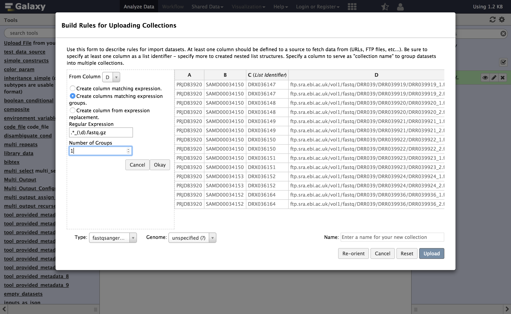
>
>    > <comment-title>Regular expression explained</comment-title>
>    > Here `\d` means match any digit. This regular expression will use a capturing group to select only the `1` or `2` part of the URL that appears before the extension.
>    > In his example we have one matching groups ( contained in the parentheses )
>    {: .comment}
>
>    At this point, you can swap the last two columns to bring this new paired indicator column toward the beginning of the table. This is not necessary but it makes the screenshots more informative.
> 1. From **Rule** select `Swap Columns`
>     - *"Swap Column"*: `D`
>     - *"With Column"*: `E`
>
> 1. **Open** the column definitions back up (**Rules** Menu, `Add / Modify Column Definitions`)
>    - *"paired-end indicator"*: column `D`
>    - *"URL"*: column `E`
>
>    > <comment-title>Paired Indicator Column Definition</comment-title>
>    > The column selector for paired indicator is a bit less obvious and a bit more picky than the other ones we have used. The row value of the paired indicator column must be one of the following to indicate "forward" or "reverse" reads.
>    >
>    > Column  | Acceptable Indicators
>    > ------  | ---------------------
>    > Forward | `1`, `R1`, `forward`, `f`, or `F`
>    > Reverse | `2`, `R2`, `reverse`, `r`, or `R`
>    {: .comment}
>
> 12. **Supply** a name for your collection and click **Upload**
> 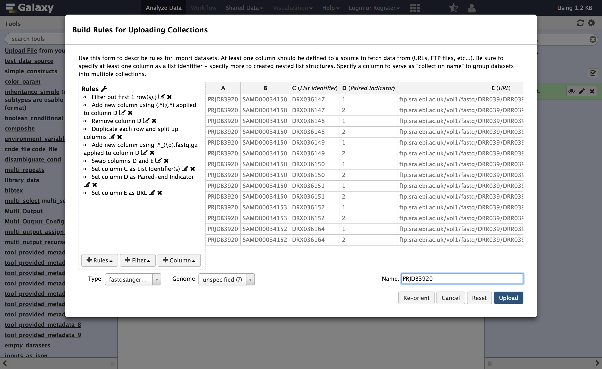
>
{: .hands_on}
