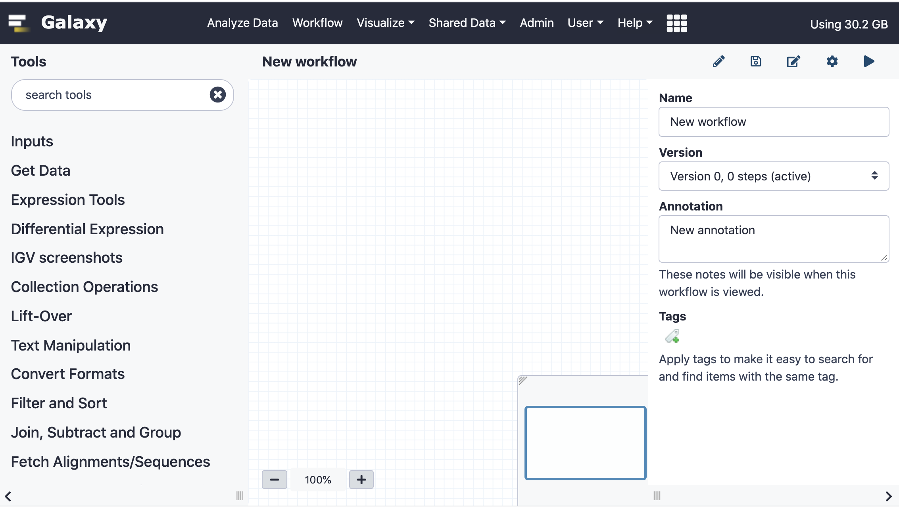

# Introduction
{:.no_toc}


Workflows are a powerful feature in Galaxy that allow you to link multiple steps of complex analysis.
In this tutorial we will demonstrate how to use the Workflow Editor to construct multiple variants of a simple workflow. Note that these workflows are meant to illustrate different concepts. Not all workflows require using all of the features described below, but we hope this tutorial will inspire you to make your analysis tasks more efficient.

> ###  Tip: Create workflows from existing histories
>  Workflows can be extracted from existing histories. You can find a tutorial for this [here]({{ site.baseurl }}/topics/galaxy-interface/tutorials/history-to-workflow/tutorial.html)
>
{: .tip}

> ### Agenda
>
> In this tutorial, we will cover:
>
> 1. TOC
> {:toc}
>
{: .agenda}

## Workflow steps

Workflows logically connect a collection of steps. Possible step types are
currently workflow inputs, tools, and workflows.


## Creating a new workflow

> ###  Hands-on: Create a new workflow
>
> - Click on **Workflow** in the top panel of the Galaxy page
> - On the top right you will see 2 buttons: **Create** and **Import**
> - To create a new workflow click on **Create**
> - Enter a Name and Annotation for your workflow and click **Save**
> - The Workflow Editor will open with a new, empty workflow loaded
> 
{: .hands_on}

On the left hand side of the Editor you see the available tools in the tool
panel. The center panel (or "canvas") holds the workflow layout. Steps will
appear in the center panel. On the right you see the attributes of the
workflow, such as name, version, annotation and tags. Depending on the context
the contents of the right panel will change, but you can always return to these
attributes by clicking on the **Edit Attributes** button (the Pencil icon on
the upper right). If there is no Pencil icon you can find the **Edit Attributes**
button under the the Workflow options button (a wheel icon) on the top right of
the editor.

We will start by creating a very simple workflow with just 2 tools, and then
add more advanced features.

> ###  Hands-on: Insert a dataset input
>
> 1. Expand the "Inputs" section in the tool panel and click on "Input dataset" to create a new dataset input
> 2. Click on the new input dataset in the center panel. Set the following parameter on the right side:
>    - *Label*: `A simple text input dataset`
>
>   > ###  Optional Input Datasets & Formats
>   > Tools may have optional dataset inputs. If your workflow should use
>   > optional datasets, you can set **Optional** to `Yes`. Doing this allows you
>   > to connect such an input only to Tool inputs that are optional. You can
>   > also restrict the format of an input dataset or input dataset collection.
>   > This serves as documentation and prevents selection of incompatible datasets.
>   {: .comment}
>
{: .hands_on}
> ###  Comment: Input modules
> There are 3 input types, "Input dataset", "Input dataset
> collection" and "Simple inputs used for workflow logic". Insert an input
> dataset or dataset collection for each possible input to your workflow.
> "Simple inputs used for workflow logic" allow the definition of parameters that
> users can or should change when running your workflow. Please check out the
> [Using Workflow Parameters tutorial]({{ site.baseurl}}/topics/galaxy-interface/tutorials/workflow-parameters/tutorial.html)
> for a detailed description of how to use these.
{: .comment}

We're now ready to add a first tool and connect it to our input dataset.

> ###  Hands-on: Add **tac reverse a file (reverse cat)**  to your workflow
>
> 1. Find **tac reverse a file (reverse cat)**  in the tool panel and click on it
> 2. A new box labeled **tac**  will appear in the center panel
> 3. Click on **tac** in the center panel and see the tool parameters on the right side
> 4. We will keep the default tool settings and only give the step a label
>    - *Label*: `Reverse dataset`
>
> 5. Click on the round blue symbol of the input dataset and drag the connection to the highlighted round green tool input
> 
>
{: .hands_on}

> ###  Tip: Workflow connections
> Connections can be made by clicking on an output terminal and dragging the
> cursor to an input terminal. Input terminals that are compatible with the
> current output are highlighted in green, while input terminals that can't
> be connected are highlighted in Orange. When dragging an incompatible output
> over an input a small textbox appears mentioning the reason why a connection
> cannot be made. A valid connection can be made if the format of an output is
> allowed as input. A simple text file output for instance cannot be used when
> the input requires a binary format. If a dataset collection is required as
> input but the output of a node is a single dataset you will see the message
> "Cannot attach a data output to a collection input". If an output of a step
> is connected to another input one cannot change the input dataset to a
> dataset collection. In order to connect inputs in such a case, all outputs of
> the step must be disconnected. Connections can be removed by hovering over an
> input terminal and clicking.
{: .comment}
> ###  Comment: Steps can be labeled
> The default label is the tool name, but it is often useful to label a step with
> what it does, especially if a tool is used multiple times in a workflow. A
> click on a step will open the step's settings on the right side. Any label
> will immediately appear in the center panel as well.
{: .comment}

This is great, but while a single tool in a workflow might be handy (for
instance if there are many parameters to be set), let's add another tool that
works on the output of **tac reverse a file (reverse cat)**  for
an authentic workflow experience. From now on we'll contract steps 1 to 4 and
just mention the tool and parameters to insert, since the procedure is always
the same.

> ###  Hands-on: Add **Select first lines from a dataset**  to your workflow
>
> 1. **Select first lines from a dataset** 
>    - *Label*: `Select first lines`
>    - *Select first*: `1`
> 2. Connect the output of the **Reverse dataset** step to the input
> 3. Save  your workflow using the save button on the top right
{: .hands_on}

We now have a very simple workflow that will reverse the contents of a file and
then output the first line of the resulting dataset. Now we're ready to upload
a test dataset and run our workflow.

> ###  Hands-on: Running the workflow
>
> 1. Return to the analysis are by clicking the Home button  (or *Analyze Data* on older versions of Galaxy) on the top
> 2. Upload a dataset using "Paste/Fetch data" with the contents
>
>    ```
>    A
>    B
>    C
>    D
>    E
>    F
>    ```
> 3. Run your workflow
>
>    
>
{: .hands_on}

The outputs of the workflow will now appear in your history.
In addition to our input file we will see 2 new datasets: `2: tac on data 1`
which contains the reversed dataset and `3: Select first on data 2` which just
contains the line `F`.

This is fine, but if we want to process many datasets at once the naming of
input datasets in the history will be difficult to follow.  Luckily we can use
dataset collections as inputs, which will maintain element identifiers across
all steps of an analysis. We can also add colorful tags that can help us identify
groups of datasets and we can label and rename outputs.

## Editing our simple workflow

We will now add tags to step outputs and label one of the 2 output datasets.

> ###  Comment: Configuring Outputs
> Open a step and scroll to the "Configure Output:" section on the right side of
> the editor. Here you can set a Label. Outputs with a label can be used as
> outputs in a subworkflow. You will also be able to set an output name for the
> dataset and to add or remove tags. You can also force a datatype. Note that
> setting a datatype does not change the content, so use this only if the
> file content fits the datatype you are going to select. This can be used
> to change a text output to tabular or gff/bed for instance.
{: .comment}

> ###  Hands-on: Editing our simple workflow
>
> 1. Open our simple workflow in the Workflow Editor
> 2. Remove the input dataset called `A simple text input dataset` using the white  icon
> 3. Add an input dataset collection and label it
>    - *Label*: `A text dataset collection`
> 4. Disconnect the exisiting connections and reconnect
> 5. Select the `Reverse dataset` step and under `Configure Output: outfile` set
>    - *Add Tags*: `name:reverse`
> 6. Select the `Select first lines` step and under `Configure Output: outfile` set
>    - *Add Tags*: `name:first`
>    - *Label*: `Last lines`
>    - *Rename dataset*: `Renamed datasets`
> 7. Save  your workflow using the save button on the top right
{: .hands_on}

> ###  Hands-on: Running the workflow
>
> 1. Return to the analysis page by clicking the Home button  (or *Analyze Data* on older versions of Galaxy) on the top
> 2. Create a dataset collection from the first 2 files in your history
>
>    
>
> 3. Run your workflow using the newly created collection input
>
>    
>
{: .hands_on}

You will now see only 1 new dataset collection, `Renamed datasets`, in your
history.  This is because we have labeled only the last step in the workflow.
This collection has 2 name tags, `reverse` and `first`. The other output collection
is hidden in the history but can be seen by clicking on `hidden` in your history.

We will now use this workflow and embed it in a new workflow.

## Embedding a workflow within a workflow

Another step type is the `subworkflow`. We can use this to include a section of
a workflow that is repeated within a workflow or a workflow that contains steps
that are useful in more than one workflow, so that we don't have to maintain
and update closely related workflows.

Here we will include our workflow twice within a new workflow and then paste the contents
of each workflow together.

> ###  Hands-on: Embedding a workflow
>
> 1. Create a new, empty workflow
> 2. Insert a dataset collection input
> 3. On the left side scroll down until you see the `Workflows` section
> 4. Insert the previously created workflow by clicking on the workflow name
> 5. Label the new workflow step:
>     - *Label*: `First workflow`
> 6. Repeat steps 4 and 5, but change the Label
>    - *Label*: `Second workflow`
> 7. Insert **Paste two files side by side** 
> 8. Connect the 2 workflow outputs to the **Paste two files side by side**  input
> 9. Save  your workflow using the save button on the top right
>
>    
>
{: .hands_on}

This is a very contrived example, but this technique can be used to separate
re-useable steps in real world scenarios.

> ###  Comment: Workflow versions
> Every time a workflow is saved a new version is created, so that you can go
> back and forth between new and old versions of a workflow. Click on the pencil
> symbol to bring up the workflow attributes. You can freely select different
> versions. You can change an old version of a workflow, and when you save it it
> will become the newest version.
{: .comment}

> ###  Comment: Importing workflows
>
> Workflows can be imported via URL, through `Shared Data -> Workflows` or
> from a local file on your computer.
{: .comment}

> ###  Comment: Managing tool versions
>
> Versions of a tool in a workflow can be changed by clicking on a tool step in
> the center panel and on the right side clicking on `Select another tool
> version`.
{: .comment}

# Conclusion
{:.no_toc}

You now know the ins and outs of Workflows in Galaxy and should be able to
make your analyses more efficient and less manual!
