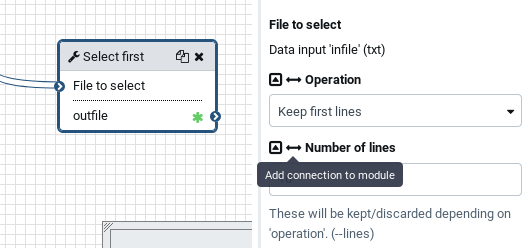
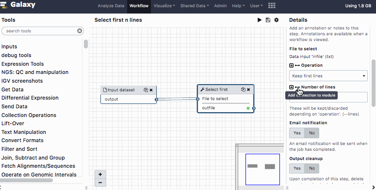

# Introduction


Workflows are a powerful feature in Galaxy that allow you to chain multiple steps of an analysis together.
To make a workflow reusable with slightly different settings you can define and use workflow parameters.

> <agenda-title></agenda-title>
>
> In this tutorial, we will cover:
>
> 1. TOC
> {:toc}
>
{: .agenda}

# Add workflow parameters to a workflow

We will import a simple workflow and then demonstrate how workflow parameters
can be added.

> <hands-on-title>Import integer workflow</hands-on-title>
>
> 1. Click on Workflow in the top menu
> 2. Click on the  import workflow button on the right
> 3. Enter the following URL into the "Archived Workflow" URL box
>
>    ```
>    https://raw.githubusercontent.com/galaxyproject/training-material/master/topics/galaxy-interface/tutorials/workflow-parameters/workflows/cut_n_lines.ga
>    ```
>
> 4. Click on import workflow
{: .hands_on}


# Add an integer workflow parameter

This workflow takes an input dataset and outputs the first 10 lines of that input dataset.
The number of lines that should be output can be set using the `Number of lines` parameter
of the select first tool.

Instead of selecting a specific number of lines we can choose to insert a workflow parameter
that allows the user to set this parameter when running the workflow.



> <hands-on-title>Updating the Workflow</hands-on-title>
>
> 1. Upload a dataset using "Paste/Fetch data" with the contents:
>
>    ```
>    E. coli (O19:H34. Extracellular pathogenic)
>    E. coli (O7:K1. Extracellular pathogenic)
>    E. coli 536
>    E. coli APEC O1 (O1:K12:H7. APEC
>    E. coli CFT083 (O6:K2:H1. UPEC)
>    E. coli E2348/69 (O127:H6. Enteropathogenic)
>    E. coli EC4115 (O157:H7 EHEC)
>    E. coli ED1a O81 (Commensal)
>    E. coli EDL933 (O157:H7 EHEC)
>    E. coli F11
>    E. coli S88 (O45:K1. Extracellular pathogenic)
>    E. coli SE15 (O150:H5. Commensal)
>    E. coli Sakai (O157:H7 EHEC)
>    E. coli TW14359 (O157:H7 EHEC)
>    E. coli UMN026 (O17:K52:H18. Extracellular pathogenic)
>    E. coli UTI89 O18:K1:H7. UPEC)
>    ```
>
> 2. Open the **workflow editor**
>
>    
>
> 3. Click the **Select first**  tool in your workflow
> 4. Find the **Number of lines** parameter in the right hand panel.
> 5. Click on the workflow connection button  to convert the Number of lines parameter into a workflow parameter connection
>
>    You will see that a new input with the text `Number of lines` has appeared on the **Select first** tool in the editor.
>
> 6. Add a **Simple inputs used for workflow logic**, found under the Inputs section of your toolbox
> 7. If you click on the Input parameter box in the editor you will see in the `Details panel` that the **Parameter type** is set to `Text`. If you try to connect this parameter to the "Number of lines" parameter you will see that the noodle turns orange and that you cannot create a connection.
>
> 8. Click on Input parameter, and change the **Parameter type** to **Integer**
>
> 9. Connect *"output"* from Input parameter  to the *"Number of lines"* input of the Select first .
>
> 10. Save  your workflow
>
> 11. Run your workflow
>
>     
>
>    Notice the new input that can be changed before the workflow is run
{: .hands_on }




> <tip-title>Parameter Reuse</tip-title>
>
> You can connect a parameter to multiple steps or to multiple parameters within a step, everywhere you need to use it.
{: .tip}

# Create a text parameter from multiple parameters

It is often necessary to create a text parameter that is flanked by additional text.
Take for instance a regular expression that finds `foo` in a string and replaces it
with `foobar` as in `s/(foo)/\1bar/`.
The Galaxy tool ``Regex Find And Replace`` can be used to tune such a regular expression. The find part of the regex (`s/(foo)/`) can be defined in the `Find regex` parameter and the replacement part can be entered in the `Replacement` parameter.
If we want to make the `foo` part of the regular expression configurable we can
compose this text parameter using the `Compose text parameter value` tool.

> <hands-on-title>Compose a text parameter</hands-on-title>
> 1. Create a new workflow
>
>    
>
> 1. Add an Inputs → **Input Dataset** to the workflow
> 2. Add an Inputs → **Simple inputs used for workflow logic** to the workflow
>    -  *"Parameter type"*: `Text`
> 3. Add **Compose text parameter value**  to the workflow
>     - Add two more "Components" using the "Insert components" button in the workflow editor tool form on the right of the screen. You will need three "Component" blocks in total.
>     - In the first component:
>       - *"Enter text that should be part of the computed value"*: `(`
>     - In the second component:
>       - *"Enter text that should be part of the computed value"*: Leave empty and click "Add connection to module" 
>       - Connect the output of the **Input parameter**  to this new input
>     - In the third component:
>       - *"Enter text that should be part of the computed value"*: `)`
>
> 4. Add the **Regex Find And Replace**  to the workflow
>     - Click on `Insert Check`
>     - *"Find Regex"*: Click "Add connection to module" 
>     - *"Replacement"*: `\1bar`
>     - Connect the output of the **Compose text parameter value**  to the *"Find Regex"* parameter of **Regex Find And Replace** .
>     - Connect the output of the **Input dataset**  to the *"Select lines from"* input of the **Regex Find And Replace** .
>
> 5. **Save**  your workflow
{: .hands_on}

You've now built a workflow with a parameterised input! It's time to test it out.

> <hands-on-title>Running the workflow</hands-on-title>
>
> 1. Upload a dataset using "Paste/Fetch data" with the contents `wunder`
>
> 2. Run your workflow with the following parameters
>
>    - *"Input parameter"*: `wunder`
>
>      This is the value that will be looked for in your input dataset.
>
>    
>
> 3. Examine the outputs
{: .hands_on }

You should see two new datasets in your history. The first dataset has the data type `expression.json` and contains the composed parameter value `(wunder)`, the second dataset will contain the output of the **Regex Find And Replace**  step. A click on the information  button will show the parameters for the tool. You will see that the *"Find Regex"* parameter will contain the values that you entered in the workflow run form. If you look at the dataset content you will see it is `wunderbar`.

# Read a parameter from a dataset

Often times it is necessary to calculate a parameter in one step of a workflow and then to use it in another step of the same workflow. This can be accomplished by reading the parameter from a dataset (As long as it is a text, integer, float, boolean or color parameter).
In this example we will construct a workflow where we calculate the sum of all values in a dataset and then divide the values in this dataset by the sum calculated in the previous step.

> <hands-on-title>Construct Workflow with Parameters read from a dataset</hands-on-title>
>
> 1. Create a new workflow
> 1. Add an **Input dataset** 
> 2. Add **Datamash** (operations on tabular data)  to the workflow
>     -  *"Input tabular dataset"*: Connect the noodle from the output of the **Input dataset**  to this input
>     -  **Operation to perform in each group**
>       -  *"Type"*: `sum`
>       -  *"On column"*: `1`
> 3. Add **Parse parameter value**  to the workflow
>     - *"Select type of parameter to parse"*: integer
>     -  *"Input file containing parameter to parse out of"*: Connect the **Datamash**  output to this input
> 4.  Add **Compose text parameter value**  to the workflow
>     - In the first repeat:
>       -  *"Choose the type of parameter for this field"*: Text Parameter
>       -  *"Enter text that should be part of the computed value"*: `c1/`
>     - Click Insert Repeat
>     - In the second repeat:
>       -  *"Choose the type of parameter for this field"*: Integer Parameter
>       - *"Enter integer that should be part of the computed value"*: Click on `Add connection to module` 
>       -  *"Input"*: Connect the output of the **Parse parameter value** 
> 5. Add **Compute an expression on every row**  to the workflow
>     - *"Add expression as a new column to"*: click on `Add connection to module`, then connect the output of **Compose text parameter value** 
>     - *"as a new column to"*: Select the output of the **Input dataset** 
{: .hands_on}

With this you're ready to run the workflow!

> <hands-on-title>Running the workflow</hands-on-title>
>
> 1. Upload a dataset using "Paste/Fetch data" with the contents, and set the filetype manually to "tabular" during upload
>
>    ```
>    16378
>    16014
>    2831
>    5702
>    149
>    24383
>    12220
>    4488
>    11500
>    24724
>    ```
>
> 2. Run your workflow with the following parameters
>
>    - *"Input dataset"*: the table you have just uploaded
>
>    
>
> 3. Examine the outputs
{: .hands_on }

This workflow will produce a new dataset, where the last column will be the
result of dividing the value in the first column by the sum of all values in
the first column.


> <tip-title>You can try many different parameter values at once</tip-title>
>
> * Often times you need to try a couple of different parameter values and pick the best one.
>   You can create or compute a dataset for each parameter you would like to try and run the
>   `Parse parameter value` tool on it, running all downstream tools once for each parameter.
{: .tip}

# Conclusion


Galaxy Workflows chain together different steps of an analysis. To make your workflows
more useful to your colleagues you can add workflow parameters. Sometimes a parameter is not
known in advance, but can be calculated as part of the workflow. Now you know how to read these
parameters from datasets!
