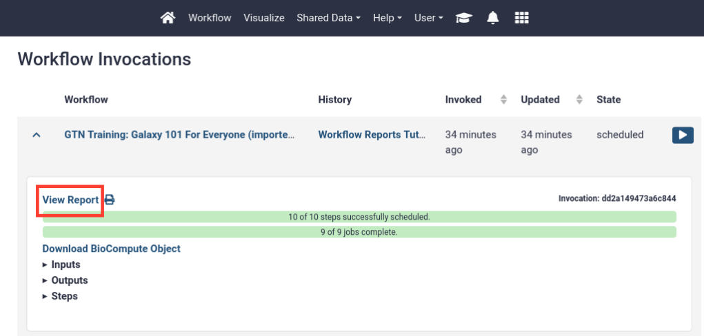

# Introduction


Workflows are a powerful Galaxy feature that allows you to scale up your analysis by performing an end-to-end analysis with a single click of a button. In order to aid interpretation of workflow results, *workflow reports* may be configured to combine and display the most important analysis results in a single, customizable view.

This is especially useful if you are configuring a Galaxy workflow to share with others. Not everybody is familiar with Galaxy, and having all the important results shown on a single page can be very useful.

This tutorial will guide you through the steps of defining such a report for your workflow, and how to view workflow reports after running the workflow.

> <agenda-title></agenda-title>
>
> In this tutorial, we will cover:
>
> 1. TOC
> {:toc}
>
{: .agenda}

# Import an example workflow

For this tutorial, we will use the workflow from the [Galaxy 101 for everyone tutorial](). If you have not done this tutorial yet, the only thing you need to know is that this is a workflow that takes as input a table of data about different species of iris plants, this table is subsequently sorted and filtered, and some plots are made. The specifics of the workflow are not important for this tutorial, only that it outputs a number of different kinds of outputs (images, tables, etc).

We will start by importing this workflow into your Galaxy account:

> <hands-on-title>Import the workflow</hands-on-title>
>
> 1. **Import the workflow** into Galaxy
>    - Copy the URL (e.g. via right-click) of [this workflow]({{ site.baseurl }}{{ page.dir }}workflows/galaxy-101-everyone.ga) or download it to your computer.
>    - Import the workflow into Galaxy
>
>    
>
{: .hands_on}


# Run the workflow and view the default report

Galaxy will produce a default report for any workflow. This default report shows the workflow inputs, outputs, and a description of the workflow on a single web page. You will usually want to customize this report yourself, but it provides a good starting point.

Let's run the workflow and view the default report.


> <hands-on-title>Run the workflow</hands-on-title>
>
> 1.  the file `iris.csv` via link
>
>    ```
>    https://zenodo.org/record/1319069/files/iris.csv
>    ```
>
>    
>
> 2. Run **GTN Training: Galaxy 101 For Everyone**  using the following parameters:
>    - *"Send results to a new history"*: `No`
>    -  *"1: Iris Dataset""*: the `iris.csv` file we just uploaded
>
>    
>
> 3. **View the workflow outputs**  once the workflow has completed
>    - The workflow produces several text and tabular outputs, and two plot (image) outputs
>
{: .hands_on}

After the workflow has completed, we can access the workflow report. The report does not appear in your history, but can be accessed from the **User -> Workflow Invocations** menu on the top bar. An invocation of a workflow means one run (execution) of the workflow.


> <hands-on-title>View the default workflow report</hands-on-title>
>
> 1. In the top menu bar, go to **User -> Workflow Invocations**
>
> 2. Our latest workflow run should be listed at the top.
>    - Click on it to expand it:
>
>    
>
> 3. Click **View Report** in the expanded view of the workflow invocation.
>
> 4. You should see a page like this. It contains:
>    - The input file
>    - The (text-based) output files
>    - A summary of the workflow itself
>
>    
>
{: .hands_on}


# Customize the workflow report

This is a great start, but we might want to customize this report to fit our needs.


> <hands-on-title>Open the workflow report editor</hands-on-title>
>
> 1. Open the workflow in the **workflow editor**
>
>    
>
> 2. Click on **Edit Report**  in the top-right of the screen
>    
>
> 3. You should see something like the image below, you will find
>    - Text editor in the center, with the default report specified in [Markdown format](https://www.markdownguide.org/getting-started/)
>    - A list of components that can be added to the report in the left-hand panel
>
>    
> 4. Scroll down the report and look at all the components
>    - notice that there is no plot image output shown, even though we know that was created, we will add this to the report later.
>
> 5. To **edit this report**, we can edit the markdown directly. For example, let's
>     - change the title of the report to `# Iris Analysis`
>     - add a line of introduction text for whoever will read the report, something like:
>
>        <pre class="highlight"><code> <del># Workflow Execution Report </del>
>        # Iris analysis
>        Below are the results for the Iris analysis workflow.</code></pre>
>
>    > <tip-title>Markdown format</tip-title>
>    >
>    > The report is specified in [Markdown format](https://www.markdownguide.org/getting-started/), this is a simple markup language that is commonly used.
>    > Some basics of the Markdown syntax can be found in [this cheatsheet](https://www.markdownguide.org/cheat-sheet/)
>    {: .tip}
>
> 6. Let's play around with some components we can add via the left-hand panel
>    - Under the **Miscellaneous** section in the left-hand menu, select
>      - "**Galaxy version** as text" and
>      - "**Current Time** as text"
>    - You will see bits of Markdown are added to your report
>    - You can add some text around these parts as well
>    - Make sure the beginning of your report looks something like this:
>
>      ````markdown
>      # Iris Analysis
>      Below are the results for the Iris analysis workflow.
>
>      This workflow was run on:
>
>      ```galaxy
>      generate_time()
>      ```
>
>      With Galaxy version:
>
>      ```galaxy
>      generate_galaxy_version()
>      ```
>      ````
>
> 7. Let's try to add the missing plot outputs as well:
>    - On the left-hand panel, under the **History** section, choose **Image**
>    - You should see a list of outputs to insert into the report:
>      
>    - Hmmm, no obvious options to insert the plot outputs. We will need to **label the outputs** in our workflow first, before we can use them here.
>
> 8. But before we do that, let's save our changes and run the workflow again to view their effects.
>    - Click on  (**Return to Workflow**) in the top-right of the screen.
>      
>    - Click on  (**Save Workflow**) to save our changes to the report.
>      
>
> 9. **Run the workflow** again
>    - Select `iris.csv` as the input
>
>    
>
> 10. **View the new workflow report**, you should see your changes, something like:
>
>     
>
>     
>
> In the next section, we will add labels to our workflow outputs to more easily add them to our workflow report
>
{: .hands_on}


## Add labels to workflow outputs

As you saw in the previous step, we might need to edit the workflow to add labels outputs so we can easily distinguish between the outputs when adding them to the report. This is especially useful for large workflows with many outputs.

> <hands-on-title>Add output labels to the workflow</hands-on-title>
>
> 1. Open the workflow in the **workflow editor**
>
>    
>
> 2. Click on one of the **Scatterplot**  boxes
>    - On the right-hand panel, you should see the settings for the tool
>    - Scroll to the bottom and find the **Configure Output: ..** sections
>    - From the box we can see that output1 (the first) is a `png` output, and output2 is a `pdf` output of the plot.
>    - Let's use the png output for our report.
>    - Also take note of the plot title, since we have 2 runs of the scatterplot tool in this workflow. One plot is about the petals of the iris, and one about the sepals (in this screenshot it is the sepal plot)
>
>    
>
> 3. **Add an output label** for the `png` output
>    - Click on "Configure output: output1"
>    - Add a descriptive label (e.g. "Sepal plot (PNG)")
>    - Notice that the label on the box changs as well
>    
>
> 4. Repeat this process and **add an output label** for the other plot as well
>    - Label it something like "Petal plot (PNG)"
>
> 5. Click on the **Unique**  toolbox
>    - This tool gives a list of all the unique Iris species found in the dataset
>    - Let's add this to our report as well
>    - **Add a label** to this output (e.g. "Iris Species")
>
> 6. **Save**  the workflow (**Important!**)
>
{: .hands_on}


Now that we have added our output labels, let's go back to our report editor and add these outputs


> <hands-on-title>Open the workflow report editor</hands-on-title>
>
> 1. Open the workflow in the **workflow editor** (if not already open)
>
>    
>
> 2. Click on **Edit Report**  in the top-right of the screen
>    - You should see the report with the changes you made earlier
>
> 3. Add the plots and the unique species list outputs to the report
>    - Use "Images" in the left-hand panel for the plot outputs
>    - Use "Dataset" for the unique species list
>    - You should see more options now after the labels we added to the workflow outputs ("Sepal Plot (PNG)", "Petal Plot (PNG)", and "Iris Species")
>
>      
>
> 4. Add some text and/or headers before each included output
>    - Play around here, add other component you think look interesting and see what happens!
>    - The final result may look something like this:
>
>      ````
>      # Results
>
>      ## Species detected
>
>      ```galaxy
>      history_dataset_display(output="Iris Species")
>      ```
>
>      ## Sepal plot
>
>      ```galaxy
>      history_dataset_as_image(output="Sepal Plot (PNG)")
>      ```
>
>      ## Petal Plot
>
>      ```galaxy
>      history_dataset_as_image(output="Petal Plot (PNG)")
>      ```
>      ````
> 5. **Exit**  the report editor
>
> 6. **Save**  the workflow
>
> 7. **Run the workflow** once more
>    - Use `iris.csv` as input again
>
> 8. View the workflow report
>
>    
>
> 9. It should look something like:
>
>    
>
{: .hands_on}


Well done! You have created a customized workflow report with text and workflow outputs. There are a lot more options to explore, for example you can also include:
  - links to datasets for easy downloading
  - index files (e.g. for BAM or VCF files)
  - visualisations
  - job metrics
  - peeks into dataset (useful for large files that cannot be included in their entirety in the report)
  - ..and more!


# Share or publish your workflow report

If you share this workflow with others, they will get the same report every time they run the workflow.

If you would like to share the workflow report of a specific run, you can do so by creating a Galaxy *page* for it. This page can then be shared (either via link or with specific users), or published for all to see under **Shared Data -> Pages** in the top menu.


> <hands-on-title>Share the workflow report as a Galaxy page</hands-on-title>
>
> 1. Open the workflow report
>
>    
>
> 2. Click on **Edit Markdown**  button at the top right (next to **"Galaxy Report"**)
>    - Here you can edit the title and the report itself, if desired
>
>      
>
>    - Click **Save** 
>
> 3. You will see your list of Galaxy pages.
>    - Note: this list is always accessible via top menu, **User** -> **Pages**
>
>      
>
> 4. Click on the dropdown icon  next to the page title
>    - Select **"Share or Publish"**
>    - Here you can make the page public or share with individual users
>    - If you make the page public, anybody will be able to see it under **Shared Data -> Pages** from the top menu bar
>
{: .hands_on}

Great work! You have viewed, customized and shared a workflow report. This makes it easy to view the most important results of a workflow in a single view. Here is an example of a final workflow from this tutorial
