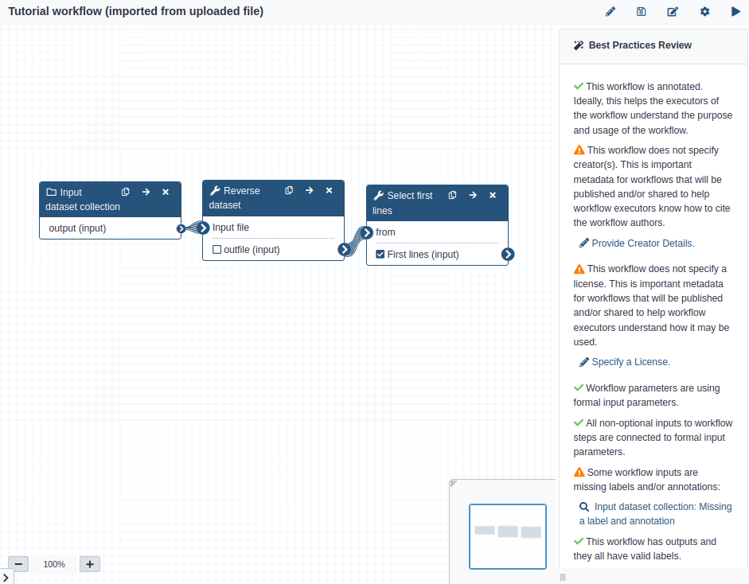

<!-- 

Topics to cover:
* Best practices panel
* copying steps
* PJAs
* adding license/user metadata
* how to resolve issues like converting a workflow to a collection type
* updating steps
 -->

# Introduction
{:.no_toc}


Galaxy workflows combine multiple tools into a single analysis pipeline which can be executed with a single click, as if they were single tools. This tutorial discusses some more advanced features of the Galaxy workflow system, assuming you already have some basic knowledge of how to build workflows in Galaxy (e.g. by following the [Creating, Editing and Importing Galaxy Workflows]({{ site.baseurl }}/topics/galaxy-interface/tutorials/workflow-editor/tutorial.html)).

We will start from the workflow created in that tutorial. You can either follow that tutorial to create the workflow, or import it as described below.

## Importing a Galaxy workflow

> ###  Hands-on: Import a workflow
>
> - Click on **Workflow** in the top panel of the Galaxy page
> - On the top right you will see 2 buttons: **Create** and **Import**.
> - To import an existing workflow, click on **Import**.
> - Copy and paste the following URL into the `Archived Workflow URL` box:
> ```
> https://raw.githubusercontent.com/galaxyproject/training-material/main/topics/galaxy-interface/tutorials/workflow-editor/workflows/main_workflow.ga
> ```
> 
> - Click on **Import Workflow**. The new workflow will appear in your list of workflows when you click on the **Workflow** tab.
{: .hands_on}

> ### Agenda
>
> In this tutorial, we will cover:
>
> 1. TOC
> {:toc}
>
{: .agenda}

# Workflow best practices

Galaxy recommends certain best practices are followed when defining a new workflow - for example, annotating a workflow with a description, a list of authors and a license. The best practices can be reviewed in the workflow editor via the 'Best Practices Review' panel.

> ###  Hands-on: Import a workflow
>
> - Open the workflow in the workflow editor.
> - Click the **Workflow Options** button on the top right of the window, represented by a wheel  button. In the dropdown menu, select ** Best Practices**.
> - The ** Best Practices Review** panel will appear on the right side of the window. Guidelines which are met are made with a  tick; those which are not met are marked with a  warning icon.
> 
> - Click on ** Specify a License**. In the new panel which appears, click **Specify a license for this workflow.**. Select **MIT License** from the dropdown menu and click on the ** Save License** icon.
> - Return to the best practices panel via the **Workflow Options** button. You should see that the license warning has been replaced with the sentence `This workflow defines a license.`
> - Repeat the process with the remaining errors until the workflow fulfils all best practices requirements.
{: .hands_on}

We highly recommend that you check these best practices as a matter of routine when developing workflows. Some of them may have a serious impact on the functionality of the workflows, if not met. For example, unlabelled workflow outputs will not be downloaded if you try to [automate your workflow using Planemo]({{ site.baseurl }}/topics/galaxy-interface/tutorials/workflow-automation/tutorial.html)).


> ###  Comment: Linting via the command line
> If you are developing workflows using a combination of the graphical interface and the command line, you might want to run the best practices checks using [Planemo](https://planemo.readthedocs.io/). Use the `workflow_lint` subcommand:
> ```
> planemo workflow_lint workflow.ga
> ```
> This will run the same checks as the best practices panel in the graphical interface and return a list of warnings and errors to the user. 
{: .comment}


# General tips and tricks

Here we cover some simple tips which make life dealing with workflows easier.

## Automatic tool layout

One you have developed a complex workflow, it might look rather messy. Galaxy provides an **Auto Layout** feature that automatically arranges tools in an aesthetically pleasing manner.

> ###  Hands-on: Automatically arrange steps
> - In the top right of your screen, below Galaxy's main toolbar, you should see a workflow toolbar containing several icons; click on .
> - In the dropdown menu that appears, click on ** Auto Layout**.
{: .hands_on}

## Copying steps

> ###  Hands-on: Copy a step
>
>We will duplicate the `Reverse dataset` step in the workflow.
> - On the top right of the box representing the `Reverse dataset` step in the workflow you should see a  button with the mouseover text `Duplicate`. 
> - A new box will appear, representing a new instance of the tool. Connect the output of `Select first lines` to the input of this new workflow step.
{: .hands_on}

Copying the step preserves all the parameter values already selected and so can be more convenient than selecting the tool again from the tool menu. 


## Adding post-job actions (PJAs) to a tool step

If you follow an analysis (for example, a GTN tutorial) step by step, you might do a number of intermediate steps between running tools. These might include renaming a dataset, changing a datatype before applying a new tool, or adding dataset tags.

These tasks, which are not performed by tools and do not require running a Galaxy job, are performed in Galaxy workflows by means of post-job actions (PJAs).

> ###  Hands-on: Changing datatype and tagging a workflow step output
>
> - Click on the `Select first lines` tool. Scroll down in the right-hand panel to the section `Configure Output 'out_file1'` and click on the  icon to expand the section if necessary.
> - Under `Change datatype`, select `tabular`.
{: .hands_on}


# Conclusion
{:.no_toc}

You now know some more advanced features of Galaxy which should help you to speed up the process of developing high-quality workflows.
