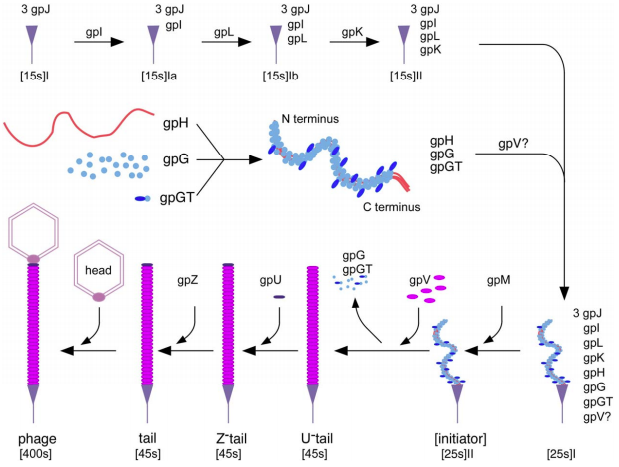
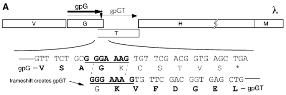
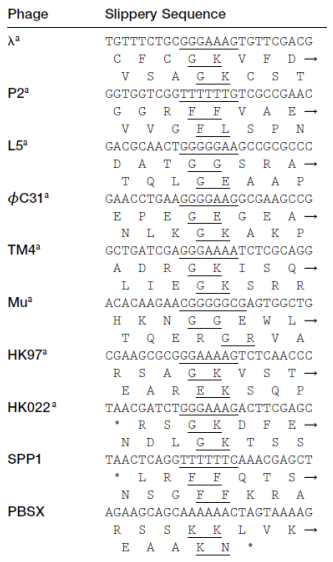

# A Brief Preamble

Often times, phage genomes contain overlapping gene features (E.G.: tape measure protein chaperones, occasionally spanning genes). Unfortunately, Apollo is not built to properly deal with these occurrences of overlapping gene features. However, here the [CPT](https://cpt.tamu.edu) offers a solution to allow temporary annotation that can be manually corrected (or, corrected in another program like Artemis) after the export of genome annotations from Apollo. This procedure will be necessary to properly annotate tape measure proteins (heretofore TMPs) for the two families within Caudovirales that have TMPs, Siphoviridae and Myoviridae.  

> ### Agenda
>
> * Background: Tape Measure Protein Chaperones and Frameshifts
> 
>
{: .agenda}

# Background: Tape Measure Protein Chaperones and Frameshifts

Siphoviridae and Myoviridae are the two known families within the order Caudovirales that are double-stranded DNA bacteriophages with TMPs being a featured part of their structure and genome; Podoviridae is a family within Caudovirales as well, but they **do not** have TMPs. Within the unique tail structure of siphophages and myophages lies the tape measure protein - a long, unfolded protein that determines the length of the phage tail. Upon page adsorption to the host cell, the TMP is injected out of the phage and into the cell; it creates a hole in the host cell membrane and allows the phage genome information to enter.

As part of phage progeny assembly within host cells, the TMP must refrain from folding in order to be properly packaged within the tail during this assembly process. TMP chaperones bind to majority of the unfolded TMP in order to prevent it from folding until the receptor-binding protein and tail cone have been separately assembled for attachment to the C-terminus of the TMP, and tail tube subunit protein has accumulated to begin coating the unfolded TMP in place of the chaperones. To offer an example, the image below details the assembly process of lambda page’s tail.

Lambda’s TMP is gpH, with the TMP chaperones being gpG and gpGT. It is shown that gpG and gpGT bind to the unfolded TMP in order to prevent it from folding until other tail proteins have been translated/assembled in such a quantity that the tail is ready to be fully assembled. As the tail protein gpV is added, gpG and gpGT leave. Given what is known at the moment, in the polyprotein GT is the only time that the T subunit is seen throughout the lambda lifecycle. This is because of a *programmed translational frameshift* found in the overlapping regions between the two TMP chaperone genes within the genome.

In the above image, the section of lambda’s genome containing the code for the TMP, H ,and TMP chaperones, G and GT, is shown. Bolded in the magnified triplet codons is a **slippery sequence**; this is characteristic of many TMP chaperones, and appears to be a conserved feature in many (*but not all*) tailed bacteriophages. A **slippery sequence** allows a ribosome to shift into a different reading frame at a low frequency; in most cases, the ribosome ‘slips’ backward a single nucleotide before continuing to translate the sequence. These slippery sequences tend to follow the canonical motif of **XXXYYYZ**. Below is an image describing the known slippery sequences of other phages.

> ###  A Relevant Reading
> This image above was pulled from this paper: [Xu J, Hendrix RW, Duda RL. 2004. Conserved translational frameshift in dsDNA bacteriophage tail assembly genes. Mol Cell 16:11–21.](https://www.sciencedirect.com/science/article/pii/S1097276504005398?via%3Dihub) This article contains greater detail about these programmed translational frameshifts, as well as offers examples of frameshifts that are slightly different than the -1 programmed translational frameshifts that are being heavily described in this tutorial.
{: .comment}

