<!-- IN REQUIREMENTS, PUT STRUCTURAL AND FUNCTIONAL ANNOTATION WORKFLOW TUTORIALS. -->

> ### Agenda
>
> 1. Prerequisites
> 2. Making an Annotation
> 3. Making the Best Prediction
>
{: .agenda}

# Prerequisites

Before beginning annotation within Galaxy ([CPT Public Galaxy](https://cpt.tamu.edu/galaxy-pub), [CPT TAMU Galaxy](https://cpt.tamu.edu/galaxy)), it is necessary that there is a genome loaded into Apollo. Additionally, the structural annotation *must* be complete, and the functional annotation workflow has **already been run**. The functional annotation workflow opens up the necessary evidence tracks for annotation.

<!-- LINK STRUCTURAL AND FUNCTIONAL ANNOTATION TUTORIALS UPON COMPLETION. -->

# Making an Annotation

Generally, the annotation process is a synthesis between the understanding of phage genomics and the available evidence tracks. The [Center for Phage Technology](https://cpt.tamu.edu) encourages **phage** annotators on the CPT’s Apollo instance to follow some specific conventions (Field -> *Recommended Input*):

> * Name -> *Gene name* (Could be something like **terminase small subunit** or **hypothetical protein**.)
> * Symbol -> *Do not use.*
> * Description -> *Do not use.*
> * DBXRefs -> *Only use if the annotator is experienced; please ensure formatting is correct.*
> * Attributes -> *Do not use.*
> * PubMed IDs -> *Do not use.*
> * Gene Ontology IDs -> *Do not use.*
> * Comments -> *Apply any free-text comments here.* (Could be something like **the e-value(s)** between the annotated gene and homologs or notes to one’s self.)

> ###  Note that…
> Calling genes is [covered in another tutorial](LINK TO TUTORIAL)
{: .tip}

To annotate a gene that has been called, right click on the gene in the pale yellow  User-Created Annotations track, and select “Edit information (alt-click).”

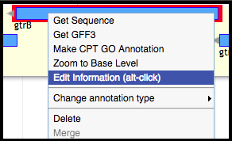

A screen will appear with different fields for information about the gene.

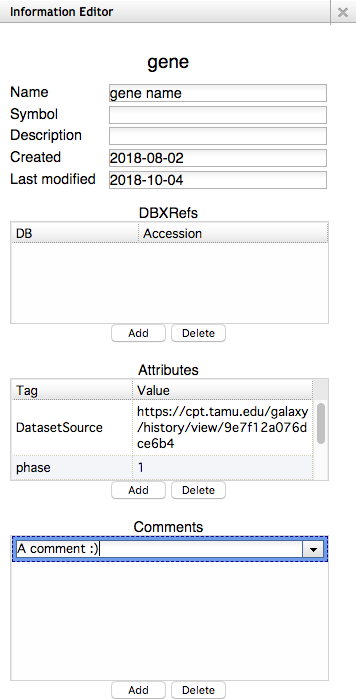

Reference the list above to see how the [CPT](https://cpt.tamu.edu) would prefer to have genes annotated.

> ###  Naming Guidelines
> It is imperative to follow suit with the [UniProt](file:///Users/cptaggies/Downloads/International_Protein_Nomenclature_Guidelines%20(1).pdf) and [NCBI](https://www.ncbi.nlm.nih.gov/genome/doc/internatprot_nomenguide/) international naming conventions. It allows for standardization and consistency in naming proteins, subsequently aiding data retrieval and improving communication.
{: .comment}

> ###  Ensuring Changes in Gene Information are Saved
> There are occasional small bumps on the road when annotating in Apollo, many of which occur when altering the information of a gene. There are some ways to be aware and subsequently fix this. For example, the information being shown is that of the gene highlighted in red; this is a gene in the phage P22 genome. The name has been changed from “gene name” (as is seen in the User-Created Annotations track in the background) to “gtrB” in the Information Editor window. There has been no other action outside of typing in “gtrB.”
>
> 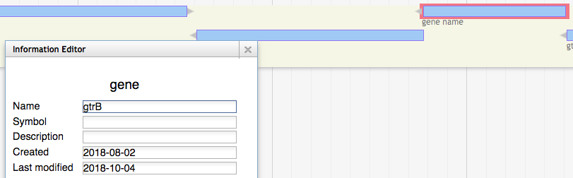
>
> Clicking anywhere outside of the “Name” field (or the most recently adjusted field) OR hitting tab on the keyboard should yield the change and automatically save it. If it has successfully being done, the change will be immediately noticeable in the User-Created Annotations track.
>
> 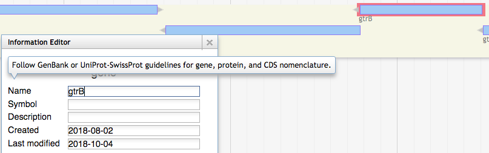
>
> If the changes are not being saved, refresh the page and try again. If this continues to happen, try opening Galaxy ([CPT Public Galaxy](https://cpt.tamu.edu/galaxy-pub), [CPT TAMU Galaxy](https://cpt.tamu.edu/galaxy)) in an incognito window.
{: .tip}

<!-- LINK TUTORIAL UPON COMPLETION -->

# Making the Best Prediction

The [Center for Phage Technology](https://cpt.tamu.edu/) integrates as many data sources as is feasible. Please contact the [CPT](https://cpt.tamu.edu) IT staff (cpt@tamu.edu) if there is another data source needed that is not appearing not currently available in Apollo, and the [CPT](https://cpt.tamu.edu) can work on adding that to the Phage Annotation Pipeline (PAP).

Many of the protein prediction tracks yield multiple homologs for the same gene. To learn more about each homolog, hover over the homolog to be investigated, right-click on it, and select “View details.”

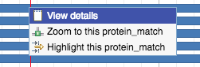

A screen will pop up, containing many details about the homolog.

### Gene Calls

The [CPT’s](https://cpt.tamu.edu) PAP integrates gene calls from numerous sources, specifically *MetaGeneAnnotator* and *Glimmer3*. These gene callers are generally very accurate; however, should they fail to find a gene, *SixPack* is a reliable gene caller.

> ###  Note that…
> Gene calling is part of structurally annotating a genome in Apollo. For more information on structural annotation and gene calling, please look at [these] [tutorials].
> <!-- LINK TUTORIALS UPON COMPLETION -->
{: .tip}

### BLAST

##### 1. NT (Nucleotide) database

Megablast is run against a copy of NCBI’s NT database. Hovering over a hit segment will show where in the target genome the region aligns.

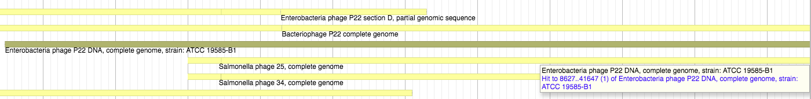

##### 2. NR (non-redundant) protein database

BLASTp is run against three database:

> * [CPT’s](https://cpt.tamu.edu) Canonical Phage database
> * TrEMBL
> * SwissProt
> * nr

These databases can offer insight into possible names and functionalities for proteins. An example from TrEMBL can be seen below.

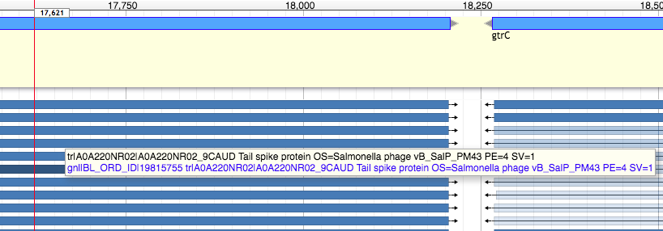

### Phage Analyses

The [CPT](https://cpt.tamu.edu) has developed a number of phage analysis tools for aid in *phage specific* annotation. These are supplementary bits of information which can inform and analyze, but must be looked at critically. Many of these tools intentionally yield many possible options, unfortunately yielding high false positive rates.

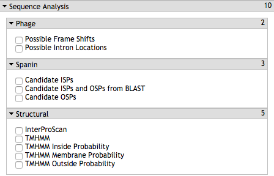

##### 1. Candidate ISPs/OSPs

Candidate ISps and OSPs are the [CPT’s](https://cpt.tamu.edu) attempts to determine possible phage i-spanin and o-spanin (respectively) component locations.

> ###  Note that…
> These tracks will feature a *huge* number of false positives. Be sure that the data occurs somewhere around the phage’s lysis cluster (where appropriate). Additionally, know what to look for in a lipobox in these potential spanin genes.
{: .tip}

The ISP track naïvely searches the genome for every possible CDS, and then analyzes them with TMHMM. This happens in the case of a mis-called i-spanin or entirely missed i-spanin. The OSP track searches through every possible CDS which contains a lipobox as defined by the [CPT’s](https://cpt.tamu.edu). *Both* of these datasets are filtered for proximity. Co-incidence of a possible ISP gene and a possible OSP gene is a good sign, but the genomic context information will need to be taken into account in order to complete the functionality interference.

##### 2. Possible Introns Locations

This track analyzes BLASTp against NR data for locations where two or more called, disjointed CDSs match separate locations on the same target protein. Below is an example alignment from phage K.

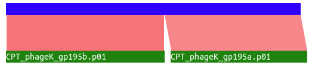

Both 195a and 195b align to distinct regions of the same protein, based on BLAST data. It can be theorized that these are actually *one* protein with *one* intron and *two* exons; however, **this evidence should not be taken as 100% correct**. Similar results may happen for other reasons, such as separation of domains from a single protein due to evolution, sequencing errors, and a myriad of other possibilities.

##### 3. Possible Frameshifts

Like the Possible Intron Locations track, the Possible Frameshifts track is very optimistic in what it considers a possible frameshift; it is searching for frameshift that may indicate phage tape measure protein chaperones. It searches for an XXXYYYZ nucleotide pattern (allowing for some wobble) wherein a frameshift would **not** change both codons. This is based on evidence shown in [this research paper.](https://www.sciencedirect.com/science/article/pii/S1097276504005398?via%3Dihub)

### Sequence Analyses

These analyses are other sequence or structural predictions. Some functions can be found underneath the Structural Annotation portion of the evidence tracks column.

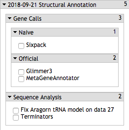

The rest of these functions can be found underneath the Functional Annotation portion of the evidence tracks column.

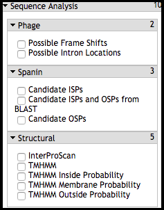

#### 1. InterProScan

InterProScan is an extremely useful domain finder. It is hosted by [EMBL-EBI](https://www.ebi.ac.uk/)(European Molecular Biology Laboratory - European Bioinformatics Institute) and integrated into [UniProt](https://www.uniprot.org/) (a freely accessible database of protein sequence and functional information, of which many entries are derived from genome sequencing projects); InterProScan searches a protein sequence against the member databases and detects similarity to conserved domains. It integrates 14 other conserved domain databases to assign a single [InterPro](https://www.ebi.ac.uk/interpro/) ID to related domains. Hits from InterProScan predict protein function based on conserved domains (**beware of domain swapping!**)

##### 2. TMHMM (Transmembrane hidden Markov model)

Here, TMHMM is run over the genome to pick out genes that contain likely transmembrane domains (TMDs). TMHMM data is used in a number of other tracks and analyses as well.

There are three variations of the TMHMM track - *Inside Probability, Membrane Probability,* and *Outside Probability.* The Membrane Probability track yields the actual scores from the TMHMM track plotted to the genome. The Inside Probability track shows the probability of a region of a protein being within the cytoplasm. The Outside Probability show the probability of a region of a protein being within the periplasm, or being extracellular.

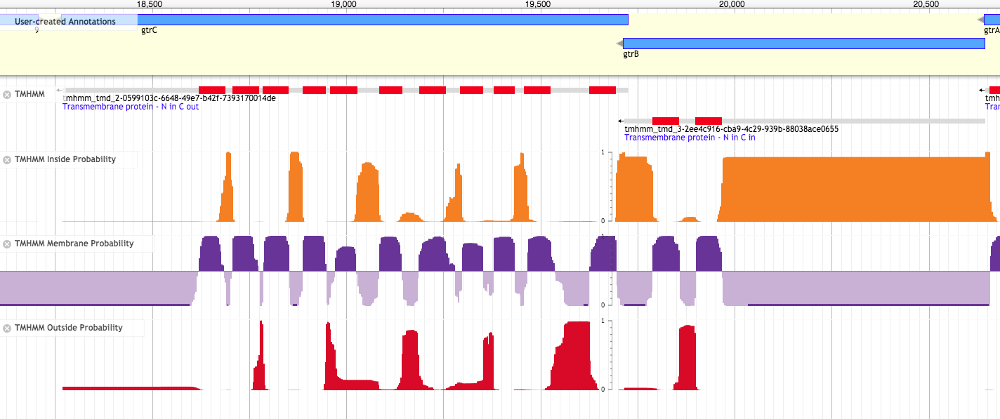

##### 3. Terminators

Terminators are produced from TransTermHP.

> ###  Note that…
> This track can be found underneath the “Sequence Analysis” section of the Structural Annotation portion all of the tracks.
>
> 
>
{: .tip}

##### 4. tRNA and tmRNA

[ARAGORN](https://www.ncbi.nlm.nih.gov/pubmed/14704338) provides the [CPT](https://cpt.tamu.edu) with quality tRNA annotations. An annotator should feel comfortable annotating tRNA and tmRNA in Apollo using this track. Recall that tRNA are not likely to be embedded within genes.

> ###  Note that…
> This track can be found underneath the “Sequence Analysis” section of the Structural Annotation portion all of the tracks.
>
> 
>
{: .tip}