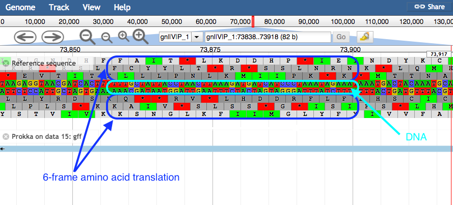

# Introduction


In this section we will use a software tool called Prokka to annotate a draft genome sequence. Prokka is a “wrapper”; it collects together several pieces of software (from various authors), and so avoids “re-inventing the wheel”.

Prokka finds and annotates features (both protein coding regions and RNA genes, i.e. tRNA, rRNA) present on on a sequence. Note, Prokka uses a two-step process for the annotation of protein coding regions: first, protein coding regions on the genome are identified using [Prodigal](https://www.ncbi.nlm.nih.gov/pmc/articles/PMC2848648/); second, the *function* of the encoded protein is predicted by similarity to proteins in one of many protein or protein domain databases. Prokka is a software tool that can be used to annotate bacterial, archaeal and viral genomes quickly, generating standard output files in GenBank, EMBL and gff formats. More information about Prokka can be found [here](https://github.com/tseemann/prokka).

> <agenda-title></agenda-title>
>
> In this tutorial, we will deal with:
>
> 1. TOC
> {:toc}
>
{: .agenda}

## Import the data

Prokka requires assembled contigs.

> <hands-on-title>Obtaining our data</hands-on-title>
>
> 1. Make sure you have an empty analysis history. Give it a name.
>
>    
>
> 2. Import the following files from [Zenodo](https://doi.org/10.5281/zenodo.1156405) or from the shared data library
>
>    ```
>    https://zenodo.org/record/1156405/files/contigs.fasta
>    ```
>
>    
>    
>
{: .hands_on}

## Annotate the genome

Now we will run the tool called Prokka.

> <hands-on-title>Annotate genome</hands-on-title>
>
> 1.  with the following parameters (leave everything else unchanged)
>    -  *"contigs to annotate"*: `contigs.fasta`
{: .hands_on}

## Examine the output

Once Prokka has finished, examine each of its output files.

- The GFF and GBK files contain all of the information about the features annotated (in different formats.)
- The .txt file contains a summary of the number of features annotated.
- The .faa file contains the protein sequences of the genes annotated.
- The .ffn file contains the nucleotide sequences of the genes annotated.


## View annotated features in JBrowse

Now that we have annotated the draft genome sequence, we would like to view the sequence in the JBrowse genome viewer. First, we have to make a JBrowse file. Then, we can view it within Galaxy.

> <hands-on-title>Visualize the annotation</hands-on-title>
>
> 1.  with the following parameters
>    - *"Reference genome to display"*: `Use a genome from history`
>       -  *"Select the reference genome"*: `fna` output of 
>
>       This sequence will be the reference against which annotations are displayed
>
>    - *"Produce Standalone Instance"*: `Yes`
>    - *"Genetic Code"*: `11: The Bacterial, Archaeal and Plant Plastid Code`
>    - Click on `Insert Track Group`
>
>      We will now set up one track - each track is a dataset displayed underneath the reference sequence (which is displayed as nucleotides in FASTA format).
>      We will choose to display the annotations (the Prokka.gff file).
>
>      - In **1: Track Group**
>           - *"Track Category"*: `gene annotations`
>           - Click on `Insert Annotation Track` and fill it with:
>               - *"Track Type"*: `GFF/GFF3/BED Features`
>               -  *"GFF/GFF3/BED Track Data"*: `gff` output of 
>
>    A new file will be created in your history, this contains the JBrowse interactive visualisation. We will now view its contents and play with it
>
> 2. Inspect the `JBrowse on data XX and data XX - Complete` file by clicking on the  (eye) icon
>
>    The JBrowse window will appear in the centre Galaxy panel.
>
> 3. Display all the tracks and practice maneuvering around
>    1. Click on the tick boxes on the left to display the tracks
>    2. Select contig 1 in the drop down box. You can only see one contig displayed at a time.
>    1. Zoom by clicking on the `plus` and `minus` buttons.
>    1. JBrowse displays the sequence and a 6-frame amino acid translation.
>    1. Right click on a gene/feature annotation (the bars on the annotation track), then select View Details to see more information.
>      - gene name
>      - product name
>      - you can download the FASTA sequence by clicking on the disk icon
> 
{: .hands_on}

## What's Next

After automatic annotation of prokaryotic genome, if inspection of predicted genes with JBrowse introduced mistakes, e.g. wrong exon/intron limits, splitted genes, or merged genes -- or simply if you wish to rename genes or provide additional functional (e.g., Gene Ontology) data, setting up a manual curation project using [Apollo](http://genomearchitect.org/) helps a lot to manually fix these errors.

The [Apollo training]() should provide additional guidance.
