> <warning-title>Only works on UseGalaxy.eu</warning-title>
> Currently this tutorial requires an Apollo server to be deployed by the administrator. This will currently only work on UseGalaxy.eu, hopefully this list will expand in the future.
{: .warning}

# Introduction


After automatically annotating your genome using [Funannotate](../funannotate/tutorial.html) or [Maker](../annotation-with-maker/tutorial.html) for example, it is important to visualize your results so you can understand what your organism looks like, and then to manually refine these annotations along with any additional data you might have. This process is most often done as part of a group, smaller organisms may be annotated individually though.

[Apollo](https://github.com/gmod/apollo)  provides a platform to do this. It is a web-based, collaborative genome annotation editor. Think of it as "Google Docs" for genome annotation, multiple users can work together simultaneously to curate evidences and annotate a genome.

This demo is inspired by the [Apollo User's Guide](https://genomearchitect.readthedocs.io/en/latest/UsersGuide.html), which provides additional guidance.

> <comment-title>Ask your instructor!</comment-title>
> This tutorial shows you how to use Galaxy to set up a genome curation project by loading a new organism in Apollo. If you only want to focus on the usage of Apollo, your instructor might already have created for you an organism in Apollo. In this case select the `Use a pre-created organism` option below (you will skip a few steps in Galaxy), and select the organism prepared for you by your instructor.
>
> If you're doing this tutorial on your own, or if the instructor has not set up a specific Apollo organism for you, select `Create your own organism`.
{: .comment}



> <agenda-title></agenda-title>
>
> In this tutorial, we will cover:
>
> 1. TOC
> {:toc}
>
{: .agenda}

# Preparing for Apollo

<div class="Create-your-own-organism" markdown="1">

## Data upload


To annotate a genome using Apollo, we need the reference genome sequence in FASTA format, and any evidence tracks we want to refine into our annotations. "Evidence tracks" can be any data like:

- A set of prior gene predictions or other genomic feature predictions
- The output of a bioinformatics analysis like BLAST or InterProScan
- Sequencing reads from RNA-Seq or another HTS analysis
- If you are not doing a *de novo* annotation, then a previous released {OGS}.

In this tutorial we use the same data as in the [Funannotate](../funannotate/tutorial.html) tutorial: the genome sequence, the annotation produced by **Funannotate** , and the mapping of RNA-Seq data along the genome using **RNA star** . We will visualise this data and use it to make some manual annotations in order to familiarise you with the process.

> <comment-title>Real Data: Unreal Circumstances</comment-title>
> While the data for this tutorial is sourced from publicly available databases, and is all related to different experiments on *Mucor mucedo*, this is not necessarily the data *you* might use to annotate your genomes. You probably know best what data you should be using in your own circumstances, for the specific features on which you are focused.
{: .comment}

### Get data


> <hands-on-title>Data upload</hands-on-title>
>
> 1. Create a new history for this tutorial
>
>    
>
> 2. Import the files from [Zenodo]({{ page.zenodo_link }}) or from
>    the shared data library (`GTN - Material` -> `{{ page.topic_name }}`
>     -> `{{ page.title }}`):
>
>    ```
>    https://zenodo.org/api/files/042ff43f-cd53-45ec-90cf-781fe53e3771/genome.fasta
>    https://zenodo.org/api/files/042ff43f-cd53-45ec-90cf-781fe53e3771/annotation.gff3
>    https://zenodo.org/api/files/042ff43f-cd53-45ec-90cf-781fe53e3771/rnaseq.bam
>    ```
>
>    
>    
>
{: .hands_on}

## Using Apollo for Annotation


Refining genome annotations happens in multiple steps:

- Create a JBrowse instance from the reference genome FASTA file and evidence tracks
- Import this data into Apollo
- Refine the annotations
- Export the refined genome annotations

In this tutorial we will focus more on the practical portions than the theoretical part of genome annotation, that are covered in other tutorials. When you've completed this tutorial you should be comfortable manipulating genomic data in Galaxy and Apollo.

> <details-title>Why bother?</details-title>
>
> Automated annotation programs continue to improve, however a simple score may not provide evidence necessary to confirm an accurate prediction.
> Therefore, it is necessary to both visually inspect the results and manually fix any issues with the predictions.
>
> Additionally, many times assemblies are less than perfect or read depth and quality may be insufficient, leading to imperfect automatic annotation.
{: .details}

### Build the JBrowse Instance

Let's begin by building a JBrowse instance with all the data we have for this genome.

> <hands-on-title>Hands-on</hands-on-title>
>
> 1.  with the following parameters:
>    - *"Reference genome to display"*: `Use a genome from history`
>        -  *"Select the reference genome"*: `genome.fasta` (Input dataset)
>    - In *"Track Group"*:
>        -  *"Insert Track Group"*
>            - *"Track Category"*: `Annotation`
>            - In *"Annotation Track"*:
>                -  *"Insert Annotation Track"*
>                    - *"Track Type"*: `GFF/GFF3/BED Features`
>                        -  *"GFF/GFF3/BED Track Data"*: `annotation.gff3` (Input dataset)
>        -  *"Insert Track Group"*
>            - *"Track Category"*: `RNA-Seq`
>            - In *"Annotation Track"*:
>                -  *"Insert Annotation Track"*
>                    - *"Track Type"*: `BAM Pileups`
>                        -  *"BAM Track Data"*: `rnaseq.bam` (Input dataset)
>                        - *"Autogenerate SNP Track"*: `yes`
>
>    > <comment-title>JBrowse is highly configurable</comment-title>
>    >
>    > JBrowse is highly configurable, we have set a very basic configuration but there are many more advanced features available to you, if you need them. You can choose precisely how data is displayed, and even what menu options are available when users click on features. If your features have some external identifiers like an NCBI Gene ID, you can even configure JBrowse that when the user clicks on the feature, it should show the gene page for that feature in a new tab. These sort of features are incredibly helpful for building very rich experiences.
>    >
>    > A static genome browser like this (just JBrowse, not in Apollo) is very useful for summarising results of a genomics workflow, where the next step is simply interpretation and not annotation. Have a look at the [JBrowse tutorial]() for more information.
>    >
>    > Currently we have built a standalone genome browser (data + the html page and user interface and javascript), but it's possible to just compile the data directory if you intend to send this data to Apollo, and don't need to view the static data in Galaxy.
>    {: .comment}
{: .hands_on}

This tool will take some time to run dependent on data size. All of the inputs need to be pre-processed by JBrowse into a form that it can render and visualise easily. Once this is complete, you can click on the  eyeball to view the JBrowse instance. This is a static view into the data, JBrowse does not let you make any annotations or save any changes. We will convert it into a dynamic view where we can make persistent annotations and share these with our colleagues.

### Sending data to Apollo

Now that we have a good looking static JBrowse instance, it is time to load it into Apollo to turn it into a dynamic view where you can make modifications to the genes.

> <hands-on-title>Import to Apollo</hands-on-title>
>
> 1.  with the following parameters:
>    -  *"JBrowse HTML Output"*: output of **JBrowse** 
>    - *"Organism Common Name Source"*: `Direct Entry`
>        - *"Organism Common Name"*: `Mucor mucedo`
>    - *"Genus"*: `Mucor`
>    - *"Species"*: `mucedo`
>
> 2.  with the following parameters:
>    -  *"Apollo Organism Listing"*: output of **Create or Update Organism** 
>
> 3. View  the output of the Annotate tool, when it is ready.
>
{: .hands_on}

Viewing the output will open a view into Apollo in the main panel. Here you can interact with your genome and make annotations. This "Annotate" output is a quick link to that specific genome, and while Apollo allows you to manage and annotate multiple genomes, this dataset will always take you back to that specific genome. You can additionally access the Apollo server outside of Galaxy. While the URL will be different for each Galaxy server that supports Apollo, UseGalaxy.eu's Apollo server is available at [https://usegalaxy.eu/apollo](https://usegalaxy.eu/apollo).

</div>
<div class="Use-a-precreated-organism" markdown="1">

While the URL will be different for each Galaxy server that supports Apollo, to access UseGalaxy.eu's Apollo server:

- First login on [https://usegalaxy.eu](https://usegalaxy.eu)
- Then go to [https://usegalaxy.eu/apollo](https://usegalaxy.eu/apollo).

It is important to first login on [https://usegalaxy.eu](https://usegalaxy.eu) before connecting to Apollo as it will set up everything to make Apollo recognize your user account.

Your instructor should give you the name of the organism you will work on, you need to select it in the drop down box at the top of the right panel of Apollo. If multiple users are using the same organism, you will experiment the true collaborative aspect of Apollo: all the actions performed on the gene models by anyone will be seen by everyone instantly.
</div>
# Apollo
<div class="Create-your-own-organism" markdown="1">

, and the Annotator Panel (right). The annotation window is the main view into our genome and here we will see evidence, reconcile it, and make our annotations. The right panel allows us to show or hide individual evidence tracks, switch between organisms, and navigate around the genome.")

</div>
<div class="Use-a-precreated-organism" markdown="1">

, and the Annotator Panel (right). The annotation window is the main view into our genome and here we will see evidence, reconcile it, and make our annotations. The right panel allows us to show or hide individual evidence tracks, switch between organisms, and navigate around the genome.")

> <details-title>Organism naming</details-title>
>
> At the top of the right panel, you can switch from one organism to another. Depending on the server you are using, the organism names can be suffixed with `gx[number]` or an email address: this is to avoid possible confusion between organisms with the same name created by multiple users.
{: .details}

</div>

From the Apollo user manual:

> The major steps of manual annotation using Apollo can be summarized as follows:
>
> 1. Locate a chromosomal region of interest.
> 2. Determine whether a feature in an existing evidence track provides a reasonable gene model to start annotating.
> 3. Drag the selected feature to the ‘User Annotation’ area, creating an initial gene model.
> 4. Use editing functions to edit the gene model if necessary.
> 5. Check your edited gene model for consistency with existing homologs by exporting the FASTA formatted sequence and searching a protein sequence database, such as UniProt or the NCBI Non Redundant (NR) database, and by conducting preliminary functional assignments using the Gene Ontology (GO) database.
>
{: .quote}

The first four steps are generally the process of structural annotation (the process of identifying the correct gene model), and the last includes functional annotation (the process of assigning a putative function to a gene in your annotations).

## Evidence tracks

Let's start by looking at the tracks available to us, and then turning on the annotation track so we can start exploring our data.

> <hands-on-title>Visualize the annotation</hands-on-title>
>
> 1. In the right hand panel at the top click on **Tracks** to open the track listing
>
>    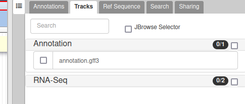
>
> 2. In the **Annotation** group, select the `annotation.gff3` track.
>
>    You can either activate tracks in bulk, by clicking on the checkbox to the right of the group name ("Annotation"), or by clicking on the group name to expand the section, and then selecting individual tracks.
>
> 3. Zoom to a region of the genome.
>
>    1. In the left hand Annotation Window, at the top navigation bar you will find a textbox which shows the current location on the genome.
>    2. Edit this and enter `scaffold_1:3000..12000`
>    3. Press *Go* or use <kbd>Enter</kbd> on your keyboard.
>
>    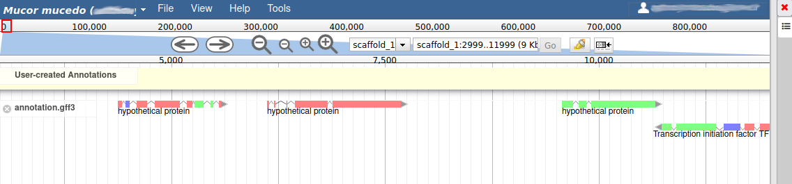
>
{: .hands_on}

> <comment-title>Track names</comment-title>
> Apollo uses the dataset names from your Galaxy history to name the tracks in the track list.
{: .comment}

We can now see an evidence track: `annotation.gff3` is the output of the [Funannotate tutorial](../funannotate/tutorial.html). In a *de novo* annotation project, we probably will only have the outputs of various gene callers, and potentially some expression evidence like RNA-Seq.

For this organism, we only have one track in the **Annotation** group, but an organism can have multiple annotations coming from different sources.

## Adding new genes

With the selected track, if you look along the genome, you will see many genes that were predicted by Funannotate. Each of them as a name assigned by Funannotate based on automatic functional annotation. If you right click on gene, an select `View details`, you can get access to detailed information on the predicted gene, including its unique name (e.g. `FUN_000002`), functional annotation (e.g. `InterPro:IPR006594`, `GO:0005515`) or the coding sequence (CDS).

> <details-title>Gene colors</details-title>
> Each gene color corresponds to an open reading frame on the genome. This allows to quickly see if two genes that are very close are on the same open reading frame, which could mean that they can be merged into a single gene, if other evidences support this.
{: .details}

What we want now is first to check that the structure of the genes predicted by Funannotate are in good shape. To do this, we will display an additional evidence tracks.

> <hands-on-title>Display RNA-Seq track</hands-on-title>
>
> 1. In the right hand panel at the top click on **Tracks** to open the track listing
>
> 2. In the **RNA-Seq** group, select the `rnaseq.bam - SNPs/Coverage` track and then the `rnaseq.bam` track.
>
{: .hands_on}

These new tracks represent the result of aligning RNA-Seq reads along the genome, with two different representation. It should look like that:

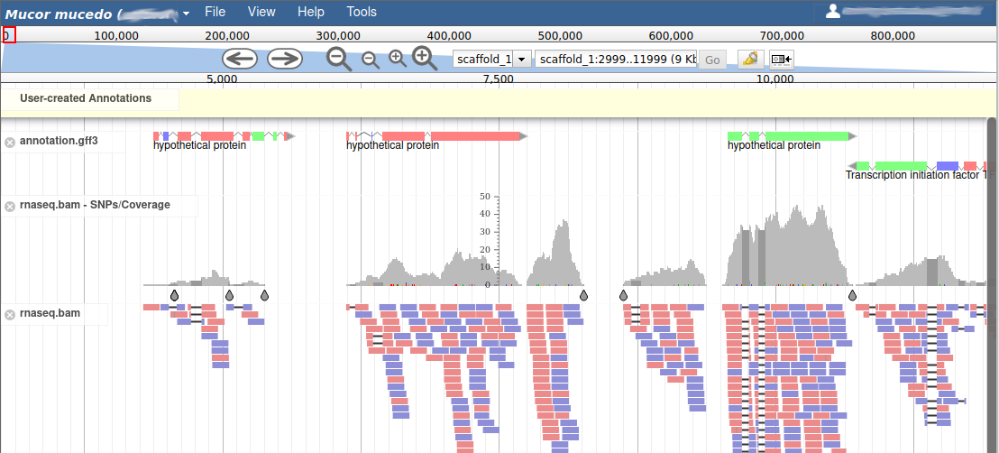

The first track (`rnaseq.bam - SNPs/Coverage`) is a coverage xy-plot, representing the number of reads aligned on the genome at each position. The little coloured teardrops represent positions where mismatches where found between some reads and the reference sequence (SNPs or sequenceing errors). Light grey regions corresponding to portions of the genomes where RNASeq were mapped, and darker grey regions corresponding to introns (= regions were some reads were found to match both the end of an exon, and the start of the next one).

The second track (`rnaseq.bam`) represent the alignment of each individual RNA-Seq read. Red reads were aligned in the forward strand, and blue ones in the reverse strand.

Let's suppose you want to improve the annotation of one of the gene. To do it, you can either click on one of its intron and drag and drop it to the User-created Annotations track (yellow background, at the top), or if you prefer, right click on one of its intron and select **Create new annotation** > **gene**. It should appear shortly in the **User-created Annotation** track.

<div class="Use-a-precreated-organism" markdown="1">
> <warning-title>Working with others</warning-title>
> Maybe you're not doing this tutorial alone, if you see that other people have started working on this region of the genome, it is best to move to a different region to avoid disturbing them by modifying the same genes at the same time.
{: .warning}
</div>

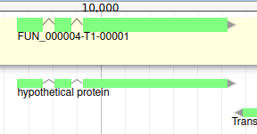

You can also see that it appears now in the list of genes in the right panel, at the gene and the mRNA level (as a gene can have multiple isoforms).

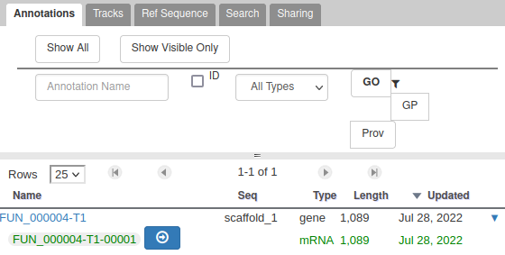

The **User-created Annotation** track is where you can make modifications to genes, like changing their coordinates, or their name and functional annotation. If you right click on a gene in this track, you will see all the possibilities offered by apollo.

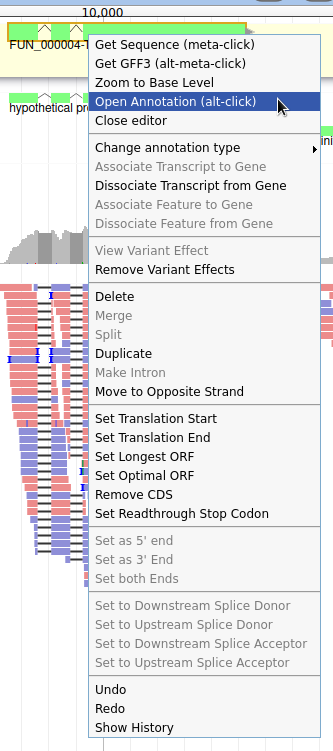

Currently, the gene we added has a meaningless name. Let's improve that: right click on the gene, and click on **Open Annotation (alt-click)**.

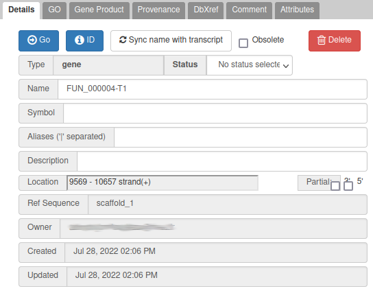

One way to give a better name is to find a similarity with genes of another species: if you right click on the gene, you can get the protein sequence by clicking on **Get Sequence**, and then compare it with a sequence database with Blast for example (using Galaxy, or the [NCBI blast form](https://blast.ncbi.nlm.nih.gov/Blast.cgi) for example).

In this case, the blast result suggests that this name is similar to `alpha/beta-hydrolase` genes in other fungi species. This is not a very strong evidence, but for this exercise, let's use this as a name: write `alpha/beta-hydrolase` in the **Name** field (type it manually and select it from the drop down list).

> <details-title>Naming genes</details-title>
>
> Giving a proper name to a gene is not always easy. Should it include "Putative" or not? What if multiple names can apply? Should it be lowercase or uppercase?
> The important thing is to always use the same naming rules when working on a full annotation, and to agree on these rules with other collaborators.
> Usually, big annotation consortiums have naming guidelines that you are supposed to follow.
{: .details}

We have just edited the gene name, but Apollo allows to edit information at the mRNA level too. Click on the **Sync name with transcript** button to copy the gene name to the mRNA name. It should now display in the **User-created Annotation** track. To check what you can edit at the mRNA level, just click on the corresponding mRNA in the list above:

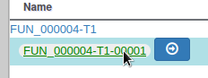

You should see `alpha/beta-hydrolase` in the **Name** field.

> <comment-title>Saving your work</comment-title>
>
> You do not need to do anything specific to *Save* your work in Apollo. Just like Google Docs, each modification is immediately saved, and any other user working on the same genome will instantly see the changes you make.
{: .comment}

## Editing a gene structure

Apollo allows to edit the whole structure of a gene. If you zoom to the 5' end of the gene, you will notice two things:

- a few RNA-Seq reads were mapped a little before the 5' limit of our gene
- there is another potential start codon a few bases after the one that was predicted by Funannotate

Let's modify the 5' of the gene to add a 5' untranslated region. Although we don't have enough evidences to be sure that the start codon should be changed, for this exercise will we do it too. To do it, all you need to do is click on the 5' limit of the gene and drag it to the desired position. You will notice that the structure of the gene will be shortly changed. Changing the start codon can be done by right clicking on the new position and clicking on "Set Translation Start"


The new white region corresponds to the newly create 5' untranslated region.

This kind of modifications is very common when using Apollo, and you can perform it at the gene level, and at the exon/intron level (an exclaim mark appears when Apollo detects that an exon/intron junction doesn't match with the cannonical acceptor/donor sequences).

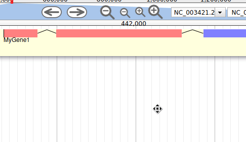

To guide you doing these changes, you should look at all the tracks available for the genome you study. RNA-Seq track are very helpful to determine the limits of coding sequences on the genome. Other tracks can be helpful, like alignements of transcripts or proteins from closely related species (or even big databanks like Swissprot or NR).

## Working with isoforms

In the eukaryote world, with the process of alternative splicing, multiple mRNA sequences (isoforms) can be generated for a single gene, based on the use of various splice site combinations. This process has a complex regulation mechanism allowing to express or not each isoform depending on multiple conditions (tissue, developmental stage, environmental conditions, ...).

Often automatic annotation softwares produce gene models composed of many exons, but does not give the detail of the sequence of each potential isoforms. However, in some cases, the RNA-Seq data and the scientific knowledge on specific gene families can be used to annotate each isoform of a gene.

Apollo allows to do that: just duplicate an existing gene model at the same position. Each copy will be considered as an isoform of the same gene. You can then make all the modifications you want to each one independently.

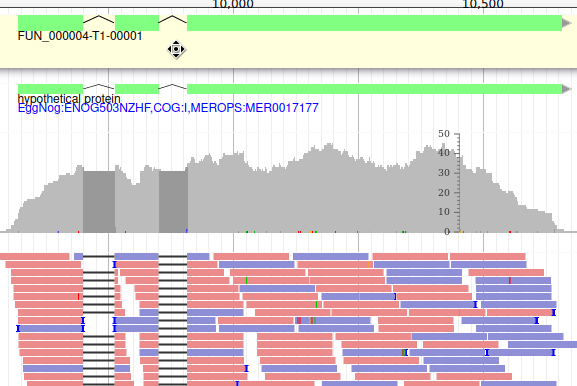

The isoforms will appear in the gene list, under their common gene.

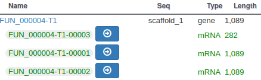

As isoforms regulation depends heavily on multiple conditions (tissue, developmental stage, environmental conditions, ...), it is important when annotating a new genome to have access to a lot of RNA-Seq data sequenced in multiple conditions and from different tissues.

## Viewing and reverting changes

Everything you do in Apollo is tracked in a database. If you right click on the gene, and select **Show History**, you have access to the full list of all the actions that were performed on it.


When you click on one of the steps, you can see below the list a preview of how the gene looked at the time. And you can revert to a specific version of the gene by clicking on the arrow button on the right.

## Adding more functional annotation

Sometimes you'll want to modify a gene that was predicted by FunAnnotate, just to add functional annotation to it, like Gene Ontology terms, of references to external databases (UniProt, InterPro, ...). This can be done using Apollo, have a look at the [Apollo tutorial for prokaryotes]() for more details.

# Exporting and collaborating

<div class="Create-your-own-organism" markdown="1">

</div>
<div class="Use-a-precreated-organism" markdown="1">
It is of course possible to export all your annotation from Apollo in standard formats, directly from its interface (`Ref Sequence` tab), or from Galaxy. If you create your own organism in Apollo, you can choose to make it open to the public, or to restrict it to only your collaborators.

Click on **Create your own organism** at the beginning to learn more.

</div>

# Conclusion


Congratulations, you finished this tutorial! By using Apollo and JBrowse, you learned how to manually refine predicted annotations<span class="Create-your-own-organism"> and export them to Galaxy for future analyses. You also learn how to give access to your project at any other researcher, making it a real collaborative solution</span><span class="Use-a-precreated-organism">. Although you use a pre-created organism, remember that you can use Galaxy to add your own organism to Apollo, and give access to your project at any other researcher, making it a real collaborative solution</span>.

A [similar tutorial for prokaryote genomes]() exists, using different types of evidence tracks, feel free to have a look at it to learn more.

When refinement is sufficient an updated or new version of the annotation may be exported as GFF3 as well as published as a new JBrowse directory for inspection.

# What's next?

After generating your refined annotation, you'll want to merge it back into the official gene sets. A future tutorial will show you how to do it within Galaxy.

If a *de novo* set, you can export it as GFF3 and load it into a tool like [Tripal](http://tripal.info) to provide visualization.
