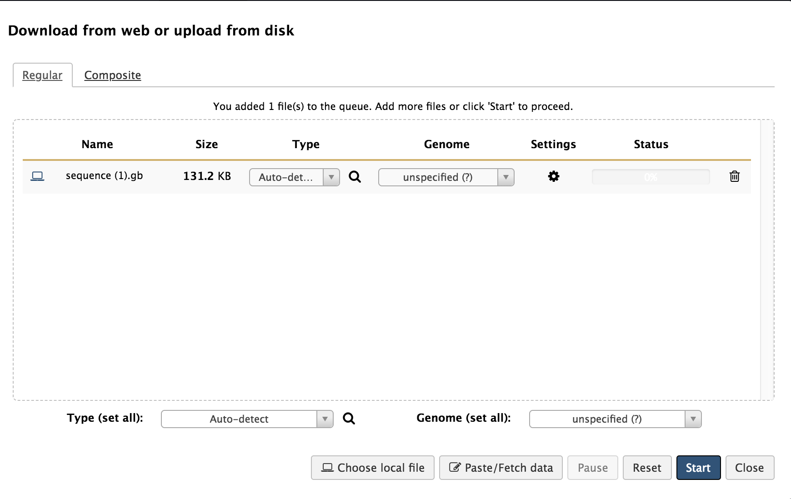

# Introduction
{:.no_toc}

<!-- These are notes for myself. This is ONLY in markdown. -->

GenBank allows previously uploaded genomes to be downloaded onto your local device. These genomes can then be uploaded into Apollo for annotation and editing. Here, the genome of phage P22 will be used as an example.

> ### Agenda
>
> In this tutorial, we will explore the path of a genome file:
>
> 1. From GenBank to Local Device
> 
> 2. From Local Device to Galaxy
>
> 3. Preparing for Annotation in Apollo
>
{: .agenda}

# From GenBank to Local Device

The NIH genetic sequence database, GenBank, is an open access collection of annotated, publicly available nucleotide sequences and protein translations.

<!-- Here, it may be helpful to link the Genome Annotation tutorial within Galaxy GitHub. -—>

<!--
 will render the hands_on icon as specified in
_config.yml in the root of this repository.
-->

<!-- Better separation of what belongs in steps vs. what belongs in tip/comment box. -->

1. Access [the NCBI website.](https://www.ncbi.nlm.nih.gov “NCBI Homepage”)

2. Using specific key words, search for your desired genome in the search box at the top of the page.

3. Look through the results for hits that appear to align with your search. Most likely, there are multiple hits for the same organism. It is important that the file contains the whole genome, and is the most recently updated version of that genome.

> ###  Tip: Searching
> * Adjust the drop-down menu to the left of the search bar to ‘Nucleotide.’ This will narrow your results to genome, gene, and transcript sequence data from databases including GenBank \\
> * If your search yields many seemingly unrelated results, consider using the ‘Advanced Search’ option to further refine results.
{: .tip}

> ###  Hands-on: Genome download
> * When you’ve found the optimal genome file, click on the ‘Send to:’ drop down menu towards the top right of the page.
> * Once the download parameters have been set, click ‘Create file,’ and the genome file will be downloaded to your computer.
>  
>
>    > ####  More details on the ....
>    >
>    > Add more details in Markdown. By default the box is collapsed. And is expanded when clicked
>    >
>    {: .details}
{: .hands_on}

# From Local Device to Galaxy

Now that the genome has been downloaded in the proper format, it is ready to be transferred to Apollo.

> ###  Hands-on: Genome loading into Galaxy
>
> 1. Open [Galaxy](https://cpt.tamu.edu/galaxy-pub “Galaxy”) and log in.
> 2. On the right side of the web page is the History column. In the top right corner of the History column are three symbols.
>    > * If you already have an active history open, click on the gear symbol. Click on ‘Create new history.’
>    > * If you do not have an active history, move on to step 3.
> 
>    > 
> 
<!-- Weird formatting of pictures -->
> 3. Once you have an empty, new history ready, click on the ‘load your own data’ option in the blue box in the empty history. An empty, white box should appear on your screen. 
> 
>  
> 
> 
>
> 4. You can drag the downloaded genome file into the box, or search files on your local device by clicking ‘Choose local file’ and locating the downloaded genome on your local device.
> 5. Click ‘Start’ to begin loading the GenBank genome file into Galaxy. Upon completion of this loading, there should be a green box now in your History column that says, “1: sequence.gb.”
>    > * If you click on the eye symbol of this step, it will open up the contents of that step. Because it is the full GenBank file, it should resemble what was on the NCBI webpage for that genome when you downloaded it.
{: .hands_on}

# Preparing Genome for Annotation in Apollo

You have successfully downloaded a genome from NCBI GenBank, and placed said genome in Apollo. The next step is loading the full GenBank file into Apollo so that the genome may be annotated/edited. To do this, you will need to import and run a workflow.

1. At the top of the Galaxy/Apollo page, click on the “Shared Data” drop-down menu. Select “workflows,” and you will be brought to a new page containing workflows that execute different functions within Apollo. 

2. Find “Load GenBank (.gb, .gbk) into Apollo (v#)” where ‘#’ is the number indicating the most recent version of this workflow. Click on the drop-down menu on that workflow, and select “Import.”

3. A green box will appear on the next page, confirming that the workflow was imported. Click on the “… start using this workflow …” link to be taken to a page containing the list of imported workflows.

4. Find the “Load GenBank (.gb, .gbk) into Apollo (v#)” workflow in that list; it should be the first, as it was the most recent. Click on the drop down menu fir that workflow, and select “Run.” 

5. You will be brought to a page with several numbered parameters. Some of these must be adjusted for the workflow to run properly.
> * For “1: Input GenBank File,” check that the GenBank sequence (“1: sequence.gb) is selected. If not, click the drop-down menu and select it.
> * For “5: Create or Update Organism,” type in the organism’s common name.
![](../../images/apollo-upload-existing-tutorial-screenshots/8 Settings For Workflow

6. Review the adjusted workflow parameters to ensure everything is correct. Click “Run workflow” at either the top or bottom of the page. You will then see a green box with a message indicating the successful invocation of the workflow.

7. Steps 2-13 will appear in the history panel. Wait until all the steps turn green. Note that step “13: Annotate on data 11,” may complete before step “12: Process and Error Log.” Step 12 is loading the gene products into Apollo, and that will take time.

# Conclusion
{:.no_toc}

Once step 12 has completed it’s function and has turned green, clicking on the eye symbol  on step 13 will direct you to the genome formatted for Apollo. From there, you are ready to annotate!
