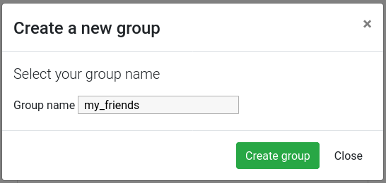
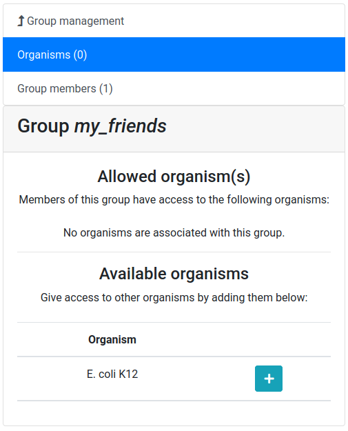
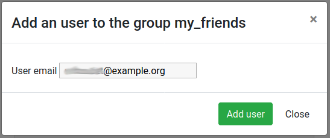


  

  


## Exporting annotation
{:.no_toc}

You can continue improving annotation whenever you want, the Apollo server will keep your changes in a safe place for future use. However at some point you will want to export your work to perform other analyses base on it. This can be done from Galaxy:

> <hands-on-title>Export data to Galaxy</hands-on-title>
>
> 1.  with the following parameters:
>    - *"Organism Common Name Source"*: `Direct Entry`
>        - *"Organism Common Name"*: `{{ organism }}`
>
{: .hands_on}

This tool will create new datasets in your history:

* the whole content of the **User-created Annotation** track, in GFF3 format
* the cDNA sequence of all the genes from this same track
* the CDS sequence of all the genes from this same track
* the peptide sequences of all the genes from this same track
* sequence alterations

You can then do any other analysis using normal Galaxy tools.

If you prefer, the same data can be downloaded directly from the Apollo right panel, in the **Ref Sequence** tab.

Note that if you have inserted some sequence alterations, the fasta sequences will take them into account.

## Collaborating with other annotators
{:.no_toc}

As explained at the beginning of this tutorial, Apollo is a collaborative annotation tool, which means you can work with other people from anywhere in the world. By default the organisms you create in Apollo are only accessible by yourself. But you can easily open the access to other people by creating a group of users on Apollo, and then allowing this group to access one or several of your organisms. This works for users having an account on the same Galaxy  (most probably usegalaxy.eu).

Click on the **Sharing** tab in the Apollo right panel.


> <comment-title>Screenshots</comment-title>
> The following screenshots mention `E. coli K12`, but it works exactly the same for our eukaryote organism `Mucor mucedo`.
{: .comment}


You should see a screen like this:

It means that you are currently not in any group, and that, as its creator, you have the right to share access to one organism: `{{ organism }}`.

> <hands-on-title>Create a user group</hands-on-title>
>
> 1. Click on the **Group management** tab
>
> 2. Click on the **New** button
>
> 3. Give a name to your new group, and then click on the **Create group** button
>
> 
>
{: .hands_on}

Now you should see a screen like this:

Let's add a colleague to our newly created group.

> <hands-on-title>Adding a user in the group</hands-on-title>
>
> 1. Click on the **Group members** tab
>
> 2. Click on the **Add user** button
>
> 3. Enter the email address of a user you want to work with (the one used to register on the same Galaxy server)
>
> 4. Click on the **Add user** button
>
> 
>
{: .hands_on}

And now allow the user group to access our `{{ organism }}` organism.

> <hands-on-title>Giving access to an organism</hands-on-title>
>
> 1. Click on the **Organisms** tab (if not already selected)
>
> 2. Click on the **+** button next to the `{{ organism }}` organism
>
> 3. Confirm that you want to give access
>
{: .hands_on}

Now the other user should be able to access your organism, and make any modifications to the annotation (creating genes, structural changes, functional annotation, ...). In each gene history, Apollo keeps track of which user performed which operation, so you will always be able to know who did what on the annotation, and blame or credit them. Of course, using the same **Sharing** tab, you can stop at any time sharing an organism to a whole group or a specific users in a few clicks.
