> <warning-title>Only works on UseGalaxy.eu</warning-title>
> Currently this tutorial requires an Apollo server to be deployed by the administrator. This will currently only work on UseGalaxy.eu, hopefully this list will expand in the future.
{: .warning}

# Introduction


After automatically annotating your genome using [Prokka](../annotation-with-prokka/tutorial.html) for example, it is important to visualize your results so you can understand what your organism looks like, and then to manually refine these annotations along with any additional data you might have. This process is most often done as part of a group, smaller organisms may be annotated individually though.

[Apollo](https://github.com/gmod/apollo)  provides a platform to do this. It is a web-based, collaborative genome annotation editor. Think of it as "Google Docs" for genome annotation, multiple users can work together simultaneously to curate evidences and annotate a genome.

This demo is inspired by the [Apollo User's Guide](https://genomearchitect.readthedocs.io/en/latest/UsersGuide.html), which provides additional guidance.

> <agenda-title></agenda-title>
>
> In this tutorial, we will cover:
>
> 1. TOC
> {:toc}
>
{: .agenda}

# Data upload

To annotate a genome using Apollo, we need the reference genome sequence in FASTA format, and any evidence tracks we want to refine into our annotations. "Evidence tracks" can be any data like:

- A set of prior gene predictions or other genomic feature predictions
- The output of a bioinformatics analysis like BLAST or InterProScan
- Sequencing reads from RNA-Seq or another HTS analysis
- If you are not doing a *de novo* annotation, then a previous released {OGS}

In this tutorial we have obtained some data from NCBI related to [*Escherichia coli K12 str. MG1655*](https://ecoliwiki.org/colipedia/index.php/Category:Strain:MG1655), and we will visualise this data and use it to make some annotations in order to familiarise you with the process.

> <comment-title>Real Data: Unreal Circumstances</comment-title>
> While the data for this tutorial is sourced from publicly available databases, and is all related to different experiments on *E. coli K12*, this is not necessarily the data *you* might use to annotate your genomes. You probably know best what data you should be using in your own circumstances, for the specific features on which you are focused.
{: .comment}

## Get data

<!-- Data for E.coli from https://usegalaxy.eu/u/helena-rasche/h/e-coli-k-12-apollo -->
<!-- other datasets available: -->
<!-- Apis mellifera: https://zenodo.org/record/3270822 (based on https://hymenoptera.elsiklab.missouri.edu/beebase/download_sequences probably) -->
<!-- Schizosaccharomyces pombe: https://usegalaxy.eu/u/abretaud/h/apollo-eukaryote-data -->

> <hands-on-title>Data upload</hands-on-title>
>
> 0. Create a new history and give it a good name
>
>    
>    
>
> 1. Click the upload icon 
>
> 2. Switch to the "Rule-based" tab
>
> 3. Copy & Paste the following table into the Rule-based uploader textbox:
>
>    ```
>    https://zenodo.org/api/files/6080d6d6-68ec-4ade-afef-bbd83f9b5e2b/augustus.gff3	Augustus	gff3
>    https://zenodo.org/api/files/6080d6d6-68ec-4ade-afef-bbd83f9b5e2b/blastp_vs_swissprot_2018-01-22.blastxml	Blastp vs swissprot	blastxml
>    https://zenodo.org/api/files/6080d6d6-68ec-4ade-afef-bbd83f9b5e2b/BWA-MEM_K12_Coverage.bigwig	BWA-MEM K12 Coverage	bigwig
>    https://zenodo.org/api/files/6080d6d6-68ec-4ade-afef-bbd83f9b5e2b/BWA-MEM_K12_Mapping.bam	BWA-MEM K12 Mapping	bam
>    https://zenodo.org/api/files/6080d6d6-68ec-4ade-afef-bbd83f9b5e2b/BWA-MEM_O104_Coverage.bigwig	BWA-MEM O104 Coverage	bigwig
>    https://zenodo.org/api/files/6080d6d6-68ec-4ade-afef-bbd83f9b5e2b/BWA-MEM_O104_Mapping.bam	BWA-MEM O104 Mapping	bam
>    https://zenodo.org/api/files/6080d6d6-68ec-4ade-afef-bbd83f9b5e2b/E._coli_str_K-12_substr_MG1655_100kb_subset.fasta	Genome	fasta
>    https://zenodo.org/api/files/6080d6d6-68ec-4ade-afef-bbd83f9b5e2b/K12_Variants.vcf	K12 Variants	vcf
>    https://zenodo.org/api/files/6080d6d6-68ec-4ade-afef-bbd83f9b5e2b/NCBI_AnnotWriter_Genes.gff3	NCBI AnnotWriter Genes	gff3
>    https://zenodo.org/api/files/6080d6d6-68ec-4ade-afef-bbd83f9b5e2b/O104_H4_LASTZ_Alignment.bed	O104 H4 LASTZ Alignment	bed
>    https://zenodo.org/api/files/6080d6d6-68ec-4ade-afef-bbd83f9b5e2b/O104_Variants.vcf	O104 Variants	vcf
>    https://zenodo.org/api/files/6080d6d6-68ec-4ade-afef-bbd83f9b5e2b/TopHat_SRR1927169_rep1.bam	TopHat SRR1927169 rep1	bam
>    https://zenodo.org/api/files/6080d6d6-68ec-4ade-afef-bbd83f9b5e2b/TopHat_SRR1927169_rep1_Coverage.bigwig	TopHat SRR1927169 rep1 Coverage	bigwig
>    https://zenodo.org/api/files/6080d6d6-68ec-4ade-afef-bbd83f9b5e2b/TopHat_SRR1927170_rep2.bam	TopHat SRR1927170 rep2	bam
>    https://zenodo.org/api/files/6080d6d6-68ec-4ade-afef-bbd83f9b5e2b/TopHat_SRR1927170_rep2_Coverage.bigwig	TopHat SRR1927170 rep2 Coverage	bigwig
>    ```
> 4. Click **Build**
>
> 5. From **Rules** menu select `Add / Modify Column Definitions`
>
>    - Click `Add Definition` button and select `URL`
>      - *"URL"*: `A`
>    - Repeat this again and select `Name` instead.
>      - *"Name"*: `B`
>    - Repeat this again and select `Type` instead.
>      - *"Type"*: `C`
>    - Click `Apply`
>
> 7. Click **Upload**
>
{: .hands_on}

# Using Apollo for Annotation

Refining genome annotations happens in multiple steps:

- Create a JBrowse instance from the reference genome FASTA file and evidence tracks
- Import this data into Apollo
- Refine the annotations
- Export the refined genome annotations

In this tutorial we will focus more on the practical portions than the theoretical part of genome annotation, that are covered in other tutorials. When you've completed this tutorial you should be comfortable manipulating genomic data in Galaxy and Apollo.

> <details-title>Why bother?</details-title>
>
> Automated annotation programs continue to improve, however a simple score may not provide evidence necessary to confirm an accurate prediction.
> Therefore, it is necessary to both visually inspect the results and manually fix any issues with the predictions.
>
> Additionally, many times assemblies are less than perfect or read depth and quality may be insufficient, leading to imperfect automatic annotation.
{: .details}

## Build the JBrowse Instance

Let's begin by building a JBrowse instance with all the data we have for this genome.

> <comment-title>Reduced data</comment-title>
>
> To reduce the size of the data, in this tutorial we will only work on a portion of the *Escherichia coli K12 str. MG1655* genome.
{: .comment}

> <hands-on-title>Hands-on</hands-on-title>
>
> 1.  with the following parameters:
>    - *"Reference genome to display"*: `Use a genome from history`
>        -  *"Select the reference genome"*: Select the `Genome` fasta file
>    - *"Genetic Code"*: `11. The Bacterial, Archael and Plant Plastid Code`
>    - In *"Track Group"*:
>        -  *"Insert Track Group"*
>            - *"Track Category"*: `Gene Calls`
>            - In *"Annotation Track"*:
>                -  *"Insert Annotation Track"*
>                    - *"Track Type"*: `GFF/GFF3/BED Features`
>                        -  *"GFF/GFF3/BED Track Data"*: `Augustus` and `NCBI AnnotWriter Genes`
>                        - In *"JBrowse Styling Options [Advanced]"*
>                            - *"JBrowse style.className"*: `transcript-CDS`
>        -  *"Insert Track Group"*
>            - *"Track Category"*: `Sequencing`
>            - In *"Annotation Track"*:
>                -  *"Insert Annotation Track"*
>                    - *"Track Type"*: `BAM Pileups`
>                        -  *"BAM Track Data"*: Both BWA-MEM Mappings
>                -  *"Insert Annotation Track"*
>                    - *"Track Type"*: `BigWig XY`
>                        -  *"BAM Track Data"*: Both of the BWA-MEM Coverage files (**not** the `(as bigwig)` files)
>                        - *"Use XYPlot"*: `Yes`
>                        - *"Show Variance Band"*: `Yes`
>        -  *"Insert Track Group"*
>            - *"Track Category"*: `RNA-Seq`
>            - In *"Annotation Track"*:
>                -  *"Insert Annotation Track"*
>                    - *"Track Type"*: `BAM Pileups`
>                        -  *"BAM Track Data"*: Both TopHat Mappings
>                -  *"Insert Annotation Track"*
>                    - *"Track Type"*: `BigWig XY`
>                        -  *"BAM Track Data"*: Both of the `TopHat ... Coverage` files (**not** the `(as bigwig)` files)
>                        - *"Use XYPlot"*: `Yes`
>                        - *"Show Variance Band"*: `Yes`
>        -  *"Insert Track Group"*
>            - *"Track Category"*: `Variation`
>            - In *"Annotation Track"*:
>                -  *"Insert Annotation Track"*
>                    - *"Track Type"*: `VCF SNPs`
>                        -  *"SNP Track Data"*: Both Variants files
>        -  *"Insert Track Group"*
>            - *"Track Category"*: `Similarity`
>            - In *"Annotation Track"*:
>                -  *"Insert Annotation Track"*
>                    - *"Track Type"*: `GFF/GFF3/BED Features`
>                        -  *"GFF/GFF3/BED Track Data"*: `O104:H4 LASTZ Alignments`
>                -  *"Insert Annotation Track"*
>                    - *"Track Type"*: `Blast XML`
>                        -  *"Blast XML Track Data"*: The `blastp` results from swissprot (`Blastp vs swissprot`)
>                        -  *"Features used in Blast Search"*: The `NCBI AnnotWriter Genes` file
>                        - *"Minimum Gap Size"*: `3`
>                        - *"Is this a protein blast search?"*: `Yes`
>
>    > <comment-title>JBrowse is highly configurable</comment-title>
>    >
>    > JBrowse is highly configurable, we have set a very basic configuration but there are many more advanced features available to you, if you need them. You can choose precisely how data is displayed, and even what menu options are available when users click on features. If your features have some external identifiers like an NCBI Gene ID, you can even configure JBrowse that when the user clicks on the feature, it should show the gene page for that feature in a new tab. These sort of features are incredibly helpful for building very rich experiences.
>    >
>    > A static genome browser like this (just JBrowse, not in Apollo) is very useful for summarising results of a genomics workflow, where the next step is simply interpretation and not annotation. Have a look at the [JBrowse tutorial]() for more information.
>    >
>    > Currently we have built a standalone genome browser (data + the html page and user interface and javascript), but it's possible to just compile the data directory if you intend to send this data to Apollo, and don't need to view the static data in Galaxy.
>    {: .comment}
{: .hands_on}

This tool will take some time to run dependent on data size. All of the inputs need to be pre-processed by JBrowse into a form that it can render and visualise easily. Once this is complete, you can click on the  eyeball to view the JBrowse instance. This is a static view into the data, JBrowse does not let you make any annotations or save any changes. We will convert it into a dynamic view where we can make persistent annotations and share these with our colleagues.

## Sending data to Apollo

Now that we have a good looking static JBrowse instance, it is time to load it into Apollo to turn it into a dynamic view where you can make modifications to the genes.

> <hands-on-title>Import to Apollo</hands-on-title>
>
> 1.  with the following parameters:
>    -  *"JBrowse HTML Output"*: output of **JBrowse** 
>    - *"Organism Common Name Source"*: `Direct Entry`
>        - *"Organism Common Name"*: `E. coli K12`
>    - *"Genus"*: `Escherichia`
>    - *"Species"*: `coli`
>
> 2.  with the following parameters:
>    -  *"Apollo Organism Listing"*: output of **Create or Update Organism** 
>
> 3. View  the output of the Annotate tool, when it is ready.
>
{: .hands_on}

Viewing the output will open a view into Apollo in the main panel. Here you can interact with your genome and make annotations. This "Annotate" output is a quick link to that specific genome, and while Apollo allows you to manage and annotate multiple genomes, this dataset will always take you back to that specific genome. You can additionally access the Apollo server outside of Galaxy. While the URL will be different for each Galaxy server that supports Apollo, UseGalaxy.eu's Apollo server is available at [https://usegalaxy.eu/apollo](https://usegalaxy.eu/apollo).


# Apollo


, and the Annotator Panel (right). The annotation window is the main view into our genome and here we will see evidence, reconcile it, and make our annotations. The right panel allows us to show or hide individual evidence tracks, switch between organisms, and navigate around the genome.")

From the Apollo user manual:

> The major steps of manual annotation using Apollo can be summarized as follows:
>
> 1. Locate a chromosomal region of interest.
> 2. Determine whether a feature in an existing evidence track provides a reasonable gene model to start annotating.
> 3. Drag the selected feature to the ‘User Annotation’ area, creating an initial gene model.
> 4. Use editing functions to edit the gene model if necessary.
> 5. Check your edited gene model for consistency with existing homologs by exporting the FASTA formatted sequence and searching a protein sequence database, such as UniProt or the NCBI Non Redundant (NR) database, and by conducting preliminary functional assignments using the Gene Ontology (GO) database.
>
{: .quote}

The first four steps are generally the process of structural annotation (the process of identifying the correct gene model), and the last includes functional annotation (the process of assigning a putative function to a gene in your annotations).

## Evidence tracks

Let's start by looking at the tracks available to us, and then turning on the gene call tracks so we can start exploring our data.

> <hands-on-title>Visualize the Gene Calls</hands-on-title>
>
> 1. In the right hand panel at the top click on **Tracks** to open the track listing
>
>    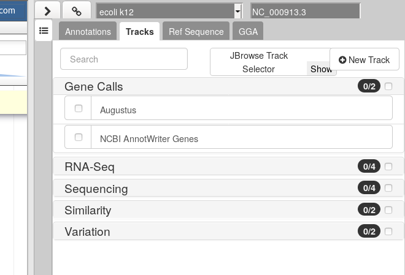
>
> 2. In the **Gene Calls** group, select the `Augustus` track.
>
>    You can either activate tracks in bulk, by clicking on the checkbox to the right of the group name ("Gene Calls"), or by clicking on the group name to expand the section, and then selecting individual tracks.
>
> 3. Zoom to the first 10kb of the genome.
>
>    1. In the left hand Annotation Window, at the top navigation bar you will find a textbox which shows the current location on the genome.
>    2. Edit this and enter `1..10000`
>    3. Press *Go* or use <kbd>Enter</kbd> on your keyboard.
>
>    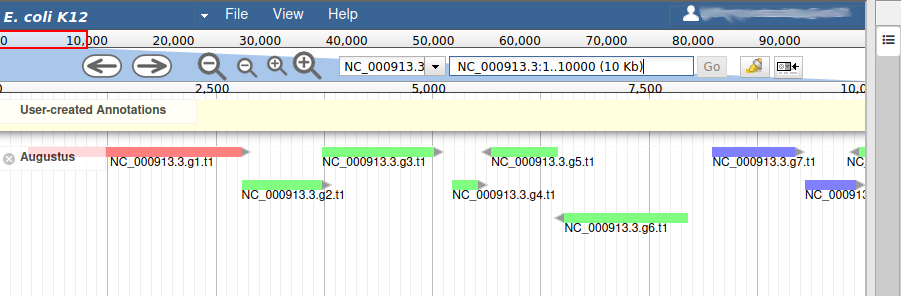
>
{: .hands_on}

We can now see an evidence track: `Augustus` is the output of [AUGUSTUS](https://github.com/Gaius-Augustus/Augustus) . In a *de novo* annotation project, we probably will only have the outputs of various gene callers, and potentially some expression evidence like RNA-Seq.

We will use the other track in the **Gene Calls** group later in this tutorial, leave it unchecked for now.

## Adding new genes

With the selected track, if you look along the genome, you will see many genes that were predicted by Augustus. Each of them as an unique name assigned by Augustus (e.g. `NC_000913.3.g7.t1`, which means `the 7th gene on the NC_000913.3 chromosome`). If you right click on gene, an select `View details`, you can get access to the coding sequence (CDS).

> <details-title>Gene colors</details-title>
> Each gene color corresponds to an open reading frame on the genome. This allows to quickly see if two genes that are very close are on the same open reading frame, which could mean that they can be merged into a single gene, if other evidences support this.
{: .details}

What we want now is first to check that the structure of the genes predicted by Augustus are in good shape. To do this, we will display an additional evidence tracks.

> <hands-on-title>Display blastp vs swissport track</hands-on-title>
>
> 1. In the right hand panel at the top click on **Tracks** to open the track listing
>
> 2. In the **Similarity** group, select the `Blastp vs swissprot` track.
>
{: .hands_on}

This new track represents the result of aligning sequences from the Swissprot databank along the genome, using Blastp. It should look like that:


Each red box is the alignment of a protein from Swissprot on the genome. You can get more information on the aligned sequence by passing your mouse over the alignement, or clicking on it.

Most of the genes predicted by Augustus look very similar to aligned Swissprot sequences, with the coordinates. Note that our example is an ideal situation that you will probably not see on other genomes: as E. coli is a very studied and well annotated genome, which means Swissprot contains many high quality sequences that can be aligned perfectly by Blastp.

If you look at the region `55000..63000` you will notice however that 2 sequences were aligned on the genome, but Augustus didn't predict any corresponding genes.

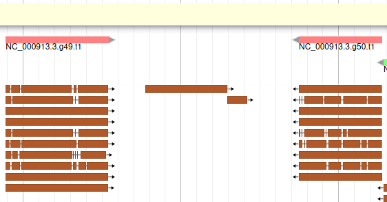

The blastp alignment looks solid, and the sequences seem to correspond to real proteins references in the litterature. We want to add them to our final annotation, to do it, right click on each gene, and select **Create new annotation** > **gene**. They should appear shortly in the **User-created Annotation** track (yellow background, at the top).

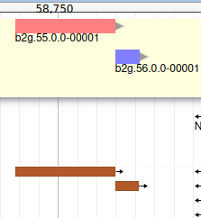

You can also see that they appear now in the list of genes in the right panel, at the gene and the mRNA level (as a gene can have multiple isoforms, in particular for eukaryotes).

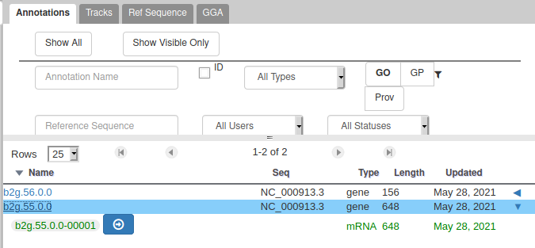

The **User-created Annotation** track is where you can make modifications to genes, like changing their coordinates, or their name and functional annotation. If you right click on a gene in this track, you will see all the possibilities offered by apollo.

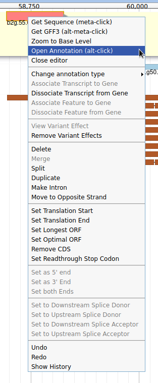

Currently, the two genes we added have meaningless names. Let's improve that: right click on the leftmost gene, and click on **Open Annotation (alt-click)**.

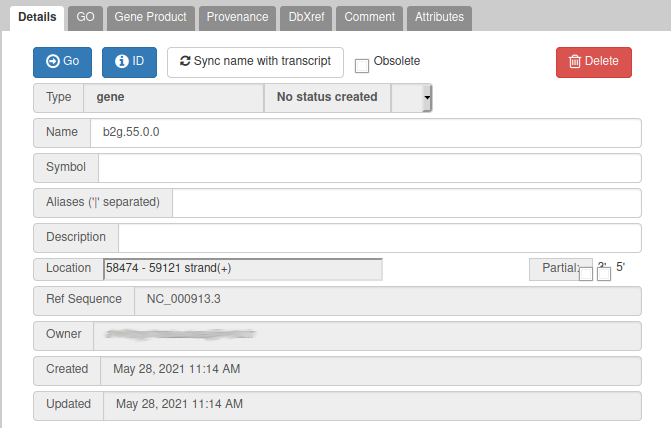

From the blast results, we know that this gene is similar to a Swissprot protein, named `Putative uncharacterized protein YabP`. Let's write this in the **Name** field (type it manually and select it from the drop down list), and `YabP` in the **Symbol** field.

> <details-title>Naming genes</details-title>
>
> Giving a proper name to a gene is not always easy. Should it include "Putative" or not? What if multiple names can apply? Should it be lowercase or uppercase?
> The important thing is to always use the same naming rules when working on a full annotation, and to agree on these rules with other collaborators.
> Usually, big annotation consortiums have naming guidelines that you are supposed to follow.
{: .details}

We have just edited the gene name, but Apollo allows to edit information at the mRNA level. Click on the **Sync name with transcript** button to copy the gene name to the mRNA name. It should now display in the **User-created Annotation** track. To check what you can edit at the mRNA level, just click on the corresponding mRNA in the list above:

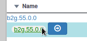

You should see `Putative uncharacterized protein YabP` in the **Name** field.

You can do the same for the other gene you created, which is similar to `Uncharacterized protein YabQ` according to Blastp vs Swissprot.

> <comment-title>Saving your work</comment-title>
>
> You do not need to do anything specific to *Save* your work in Apollo. Just like Google Docs, each modification is immediately saved, and any other user working on the same genome will instantly see the changes you make.
{: .comment}

## Editing a gene structure

Apollo allows to edit the whole structure of a gene. If you zoom to the 5' end of `YabP`, you will notice, that a few nucleotides after the start codon, there is another one. Let's change the start of `YabP` to this alternate start codon (even if the blast result suggests that we shouldn't do it, it's an exercise!). To do it, all you need to do is click on the 5' limit of the gene and drag it to the desired position. You will notice that the structure of the gene will be shortly changed.

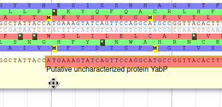

This kind of modifications is very common when using Apollo, and you can perform it at the gene level, or (for eukaryotes) at the exon/intron level. To guide you doing these changes, you should look at all the tracks available for the genome you study. RNA-Seq track are very helpful to determine the limits of coding sequences on the genome, you can find 2 RNA-Seq libraries in the track list, they were aligned on the genome using TopHat. Other tracks can be helpful, like alignements of transcripts or proteins from closely related species (or even big databanks like Swissprot or NR).

## Viewing and reverting changes

Everything you do in Apollo is tracked in a database. If you right click on the `YabP` gene, and select **Show History**, you have access to the full list of all the actions that were performed on it.

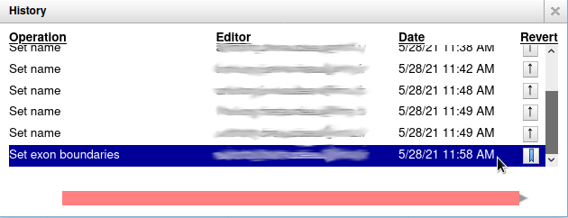

When you click on one of the steps, you can see below the list a preview of how the gene looked at the time. And you can revert to a specific version of the gene by clicking on the arrow button on the right.

## Adding more functional annotation

Sometimes you'll want to modify a gene that was predicted by Augustus, just to add functional annotation to it. Navigate to position `3000..5700`, you will see an Augustus gene named **NC_000913.3.g3.t1**. At the same position, there are a few Blastp hits with high scores that correspond to `Threonine synthase`, meaning that the gene found by Augustus is probably an homolog. Let's add this Augustus gene to the **User-created Annotation** track: just drag and drop it there. Now, modify the Name (`Threonine synthase`) and Symbol (`TS`), just as we did earlier, for the gene and mRNA.

If you look at the details of the blast hits, you will notice an identifier looking like that: `gi|11387170|sp|P57289.1|`. In this identifier, `P57289` is the id of an [UniProt record](https://www.uniprot.org/uniprot/P57289). Navigate to this UniProt page and you'll find a lot more details about the protein which was found to be very similar to the gene we are currently annotating. In particular, you can see that 3 [Gene Ontology (GO)](http://www.geneontology.org/) terms are associated with it, in the **GO - Molecular function** and **GO - Biological process** sections. Let's add these terms to our gene with Apollo.


> <comment-title>Gene Ontology (GO) Consortium</comment-title>
>
> The [Gene Ontology Consortium](http://www.geneontology.org/) provides with its Ontology a framework for the model of biology.
> The GO defines concepts/classes used to describe gene function, and relationships between these concepts. It classifies functions along three aspects:
>
>
> molecular function
> :  molecular activities of gene products
>
> cellular component
> :  where gene products are active
>
> biological process
> :  pathways and larger processes made up of the activities of multiple gene products.
>
> [more information](http://geneontology.org/page/ontology-documentation) can be found in the GO website.
>
{: .comment}

With the gene selected, click on the **GO** panel, then click on the **New** button. We will then follow the [GO annotation guidelines](http://geneontology.org/docs/go-annotations/), filling the form like this.

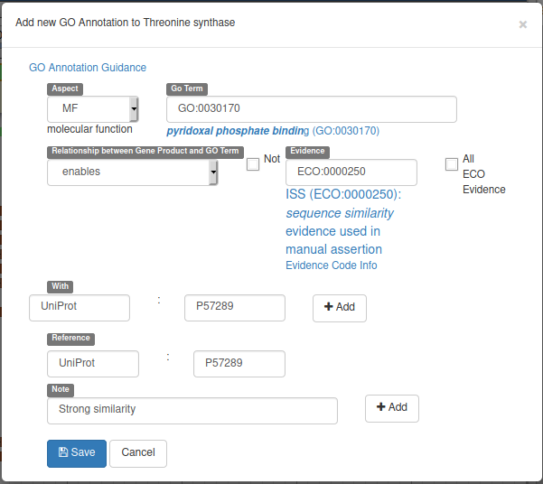

This form means that our gene will be tagged with the **Go Term** `GO:0030170` (select it in the drop down list while typing `pyridoxal phosphate binding`) from the Molecular Function GO branch (`MF` in **Aspect**). This gene `enables` this `pyridoxal phosphate binding` activity, and we declare it based on the evidence code `ECO:0000250` which means `sequence similarity evidence used in manual assertion` (exactly what we are doing). This similarity is **With** the `UniProt:P57289` record, and we add a **Reference** to this record (we could add a pubmed id to reference a published result for example). Finally we add a **Note** saying that there's a strong similarity.

Before saving, don't forget to click on the two **Add** buttons to save the **With** and **Note** fields.

You can now do the same for the two other GO terms found on the UniProt page: `threonine synthase activity` and `threonine biosynthetic process`. Adding these terms this way allows to save the information in a computing-friendly way, which means other bioinformatics tools will be able to use make this information automatically.

Other tabs are available in the annotation panel, allowing to add **Comments**, external database references (**DbXref**) or **Attributes* to genes, to record more infortmation about them.

## Comparing with the official annotation

In this tutorial we are lucky as we are studying a very well known reference organism. It means we have a [very good quality reference annotation](https://www.ncbi.nlm.nih.gov/Taxonomy/Browser/wwwtax.cgi?mode=Info&id=511145&lvl=3&lin=f&keep=1&srchmode=1&unlock) provided by NCBI. You can display it in Apollo by enabling the corresponding track:

> <hands-on-title>Display NCBI annotation track</hands-on-title>
>
> 1. In the right hand panel at the top click on **Tracks** to open the track listing
>
> 2. In the **Gene Calls** group, select the `NCBI AnnotWriter Genes` track.
>
{: .hands_on}

Now navigate along the genome, and notice the differences between the Augustus annotation, the changes you made in the **User-created Annotation** track, and the reference annotation. This illustrates what happens in real life: you start with an automatic annotation which is not perfect, and using Apollo you improve it and add functional annotation, which allows in the end to release a better annotation to the community.

## Sequence alterations

Until now we have supposed that the quality of the genome sequence is perfect. But you might work on othr genomes where the sequence contains errors (substitutions, insertions, deletions) due to assembly problems for example. In this case, automatic annotation programs will have difficulties producing good looking gene models: there can be frame shifts within genes, or broken start/stop codons which are not detected. In this case, Apollo allows to edit the genome sequence itself.

Navigate to position `42500..44500`, and show the `K12 Variants` track from the `Variation` track group. This track shows variants that were detected in this genome sequence after resequencing it. Drag the `NC_000913.3.g36.t1` gene to the **User-created Annotation** track. Now we will register in Apollo the SNP that was detected on position `43988` (C->T): zoom to this position until you see the 6 open reading frame and the sequence. Then right click on the `C` nucleotide and select **Create Genomic Substitution**.

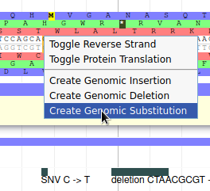

Fill the form like this, and the SNP will be saved:

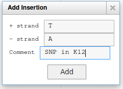

You can add other types of alterations like insertions or deletions.

Once you have added some alterations, Apollo will automatically display the effect it has on the overlapping genes.

# Exporting and collaborating



# Conclusion


Congratulations, you finished this tutorial! By using Apollo and JBrowse, you learned how to manually refine predicted annotations and export them to Galaxy for future analyses. You also learn how to give access to your project at any other researcher, making it a real collaborative solution.

A [similar tutorial for eukaryote genomes]() exists, using different types of evidence tracks, feel free to have a look at it to learn more.

When refinement is sufficient an updated or new version of the annotation may be exported as GFF3 as well as published as a new JBrowse directory for inspection.

# What's next?

After generating your refined annotation, you'll want to merge it back into the official gene sets. A future tutorial will show you how to do it within Galaxy.

If a *de novo* set, you can export it as GFF3 and load it into a tool like [Tripal](http://tripal.info) to provide visualization.
