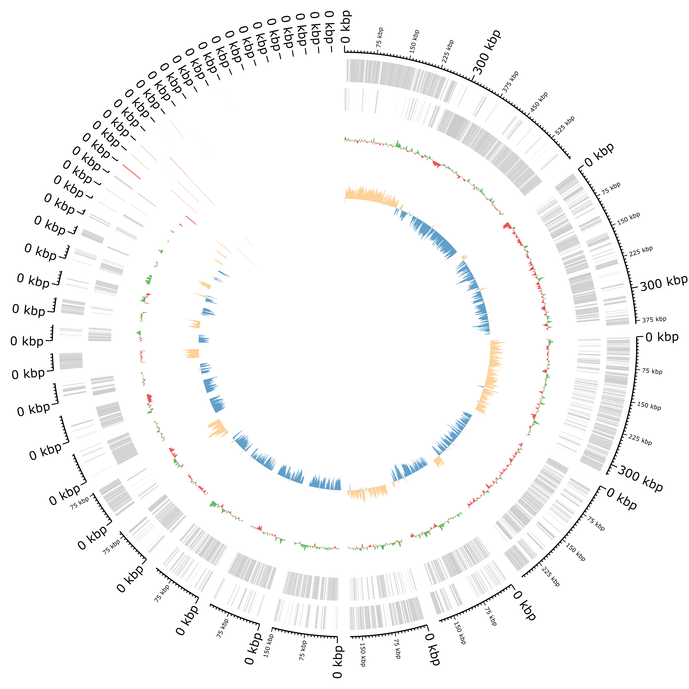

After sequencing and assembly, a genome can be annotated. It is an essential step to describe the genome. 

Genome annotation consists in describing the structure and function of the components of the genome, by predicting, analyzing, and interpreting them in order to extract their biological significance and understand the biological processes in which they participate. Among other things, it identifies the locations of genes and all the coding regions in a genome (*structural annotation*) and determines what those genes do (*functional annotation*).

To illustrate the process to annotate a bacterial genome, we take an assembly of a bacterial genome (KUN1163 sample) generated by following a [bacterial genome assembly tutorial]() from data produced in "Complete Genome Sequences of Eight Methicillin-Resistant *Staphylococcus aureus* Strains Isolated from Patients in Japan" (). 

> Methicillin-resistant *Staphylococcus aureus* (MRSA) is a major pathogen
> causing nosocomial infections, and the clinical manifestations of MRSA
> range from asymptomatic colonization of the nasal mucosa to soft tissue
> infection to fulminant invasive disease. Here, we report the complete
> genome sequences of eight MRSA strains isolated from patients in Japan.
{: .quote cite=""}

> <agenda-title></agenda-title>
>
> In this tutorial, we will cover:
>
> 1. TOC
> {:toc}
>
{: .agenda}

# Galaxy and data preparation

Any analysis should get its own Galaxy history. So let's start by creating a new one and get the data (contig file from the assembly) into it.

> <hands-on-title>Prepare Galaxy and data</hands-on-title>
>
> 1. Create a new history for this analysis
>
>    
>
> 2. Rename the history
>
>    
>
> 3.  the contig file from [Zenodo]({{ page.zenodo_link }}) or from Galaxy shared data libraries:
>
>    ```
>    {{ page.zenodo_link }}/files/DRR187559_contigs.fasta
>    ```
>
>    
>
>    
>
>
{: .hands_on}

# Contig annotation

For annotating the contigs, several tools exists to do that: Prokka (), Bakta (), etc. Here, we use **Bakta** as recommended by  as the successor of **Prokka**.

**Bakta** is a tool for the rapid & standardized annotation of bacterial genomes and plasmids from both isolates and metagenome-assembled genomes (MAGs). It implements a comprehensive annotation workflow for coding and non-coding genes (*i.e.* tRNA, rRNA). 

")

It is also able to detect and annotate small proteins (sORF). Predicted CDS are annotated using an alignment-free protein sequence identification approach with cross-references to public databases via stable identifiers. 

> <hands-on-title>Contig annotation</hands-on-title>
>
> 1.  with the following parameters:
>    - In *"Input/Output options"*:
>        - *"The bakta database"*: latest one
>        - *"The amrfinderplus database"*: latest one
>        -  *"Select genome in fasta format"*: Contig file
>    - In *"Optional annotation"*:
>        - *"Keep original contig header (--keep-contig-headers)"*: `Yes`
>    - In *"Selection of the output files"*:
>        - *"Output files selection"*: 
>          - `Annotation file in TSV`
>          - `Annotation and sequence in GFF3`
>          - `Feature nucleotide sequences as FASTA`
>          - `Summary as TXT`
>          - `Plot of the annotation result as SVG`
{: .hands_on}

**Bakta** can generate many outputs. Here we selected:

- `Analysis_summary`: a summary of the analysis as text file

   > <question-title></question-title>
   >
   > 1. How many contigs have been provided as input?
   > 2. How long is the draft genome?
   > 3. How many CDSs have been found?
   > 4. How many small proteins?
   > 5. Which other components have been found? 
   >
   > How does it compare to results for KUN1163 in [Table 1](https://journals.asm.org/doi/10.1128/mra.01212-19#tab1) in ?
   >
   > > <solution-title></solution-title>
   > >
   > > 1. 44 (the sequence count)
   > > 2. 2,911,349 bp, with is a bit shorter than the expected 2,914,567 bp in [Table 1](https://journals.asm.org/doi/10.1128/mra.01212-19#tab1) in 
   > > 3. 2,717 CDSs, a bit more than the expected 2,704 CDSs in [Table 1](https://journals.asm.org/doi/10.1128/mra.01212-19#tab1) in 
   > > 4. 5 sORFs. There is no information about sORFs in 
   > > 5. Other components
   > >    
   > >    Components | Bakta | 
   > >    --- | --- | --- 
   > >    tRNAs | 57 | 61
   > >    Transfer-messenger RNA (tmRNAs) | 1 | 1
   > >    rRNAs | 9 | 5
   > >    ncRNAs | 95 | No information
   > >
   > {: .solution}
   {: .question}

- `Nucleotide_sequences` with feature nucleotide sequences as FASTA file

   > <question-title></question-title>
   >
   > 1. How many sequences are in this file?
   > 2. What are the sequences stored there?
   >
   > > <solution-title></solution-title>
   > >
   > > 1. 2,884 sequences
   > > 2. Here are stored:
   > >    - tRNAs
   > >    - tmRNAs
   > >    - rRNAs
   > >    - ncRNAs
   > >    - CDSs
   > >    - sORFs
   > >
   > {: .solution}
   {: .question}

- `annotation_summary` with annotations as simple human readble TSV

   > <question-title></question-title>
   >
   > What is stored there?
   >
   > > <solution-title></solution-title>
   > >
   > > This a table with 9 columns (`Sequence Id`, `Type`, `Start`, `Stop`, `Strand`, `Locus Tag`, `Gene`, `Product`, `DbXrefs`). It contains here 2,916 lines, so the information and location for:
   > >    - tRNAs
   > >    - tmRNAs
   > >    - rRNAs
   > >    - ncRNAs
   > >    - CDSs
   > >    - sORFs
   > >    - gaps
   > >    - oriCs
   > >    - oriVs
   > >    - oriTs
   > >
   > {: .solution}
   {: .question}


- `Annotation_and_sequences` in GFF3

   GFF is a file format used for describing genes and other features of DNA, RNA and protein sequences. It is a tab delimited file with 9 fields per line:

   1. **seqid**: The name of the sequence where the feature is located. 
   2. **source**: The algorithm or procedure that generated the feature. This is typically the name of a software or database.
   3. **type**: The feature type name, like "gene" or "exon". In a well structured GFF file, all the children features always follow their parents in a single block (so all exons of a transcript are put after their parent "transcript" feature line and before any other parent transcript line). In GFF3, all features and their relationships should be compatible with the standards released by the Sequence Ontology Project.
   4. **start**: Genomic start of the feature, with a 1-base offset. This is in contrast with other 0-offset half-open sequence formats, like BED.
   5. **end**: Genomic end of the feature, with a 1-base offset. This is the same end coordinate as it is in 0-offset half-open sequence formats, like BED.
   6. **score**: Numeric value that generally indicates the confidence of the source in the annotated feature. A value of "." (a dot) is used to define a null value.
   7. **strand**: Single character that indicates the strand of the feature. This can be "+" (positive, or 5'->3'), "-", (negative, or 3'->5'), "." (undetermined), or "?" for features with relevant but unknown strands.
   8. **phase**: phase of CDS features; it can be either one of 0, 1, 2 (for CDS features) or "." (for everything else). See the section below for a detailed explanation.
   9. **attributes**: A list of tag-value pairs separated by a semicolon with additional information about the feature. 

   > <question-title></question-title>
   >
   > How many features are annotated?
   >
   > > <solution-title></solution-title>
   > >
   > > 51k+ (number of lines in the GFF)
   > >
   > {: .solution}
   {: .question}

- Plot of the annotation as circular genome annotation
   
   

   > <question-title></question-title>
   >
   > 1. What the 2 rings in the center? 
   > 2. How are plotted the features?
   >
   > > <solution-title></solution-title>
   > >
   > > 1. The first ring represents the GC content per sliding window over the entire sequence(s) with in green representing GC above  and red GC below average. The 2nd ring represents the GC skew in orange and blue.
   > > 2. All features are plotted on two rings representing the forward and reverse strand from outer to inner with CDS in grey (the other colors are hard to distinguish)
   > >
   > {: .solution}
   {: .question}

# Further structural annotation

**Bakta** gives a lot of information already, especially regarding CDSs or RNAs, but some structural annotation might be missing, e.g. plasmids, or interesting to identify independently.

## Plasmids

To identify plasmids in our contigs, we use **PlasmidFinder** (), a tool for the identification and typing of plasmid sequences in Whole-Genome Sequencing. It uses the [plasmidfinder database](https://bitbucket.org/genomicepidemiology/plasmidfinder_db/) with hundreds of sequences to predict the plasmid in the data.

> <hands-on-title> Plasmid identification</hands-on-title>
>
> 1.  with the following parameters:
>    - In *"Input parameters"*:
>        -  *"Choose a fasta or fastq file"*: Contig file
>        - *"PlasmidFinder database"*: most recent one
{: .hands_on}

**PlasmidFinder** generates several outputs:

- `raw_results.txt`: A text file containing the result table and alignments
- `results.tsv`: A tabular file with the following columns:
   
   - **Database**
   - **Plasmid**: Plasmid against which the input genome has been aligned.
   - **Identity**: Percent identity in the alignment between the best matching plasmid in the database and the corresponding sequence in the inputgenome (also called the high-scoring segment pair (HSP)). A perfect alignment is 100%, but must also cover the entire length of the plasmid in the database (compare example 1 and 3).
   - **Query/Template Length**: Query length is the length of the best matching plasmid in the database, while HSP length is the length of the alignment between the best matching plasmid and the corresponding sequence in the genome (also called the high-scoring segment pair (HSP)).
   - **Contig**: Name of contig the plasmid is found in.
   - **Position in contig**: Starting position of the found gene in the contig.
   - **Note**: Notes about the plasmid
   - **Accession number**: Reference Genbank accession number accoding to NCBI for the plasmid in the database.

   > <question-title></question-title>
   >
   > 1. How many plasmid sequences have been found?
   > 2. Where are they located?
   > 3. Are these sequences all associated with *Staphylococcus aureus*?
   > 4. What can we conclude about contig00019?
   >
   > > <solution-title></solution-title>
   > >
   > > 1. 5 plasmid sequences
   > > 2. 3 are on the contig00019, 1 on contig00002, and 1 on contig00024
   > > 3. Looking at the accession number on the NCBI, we find that:
   > >    - CP000737, AP003139 (2 times) correspond to *Staphylococcus aureus* plasmids
   > >    - AF503772 corresponds to a *Enterococcus faecalis* plasmid
   > >    - CP003584 corresponds to a *Enterococcus faecium* plasmid
   > > 
   > > 4. All plasmid sequences corresponding to *Staphylococcus aureus* plasmids are all on contig00019, making this contig likely a plasmid. In addition, this contig has a length of 30,347 bp, which is similar to the expected length of the plasmid for KUN1163 in [Table 1](https://journals.asm.org/doi/10.1128/mra.01212-19#tab1) in 
   > {: .solution}
   {: .question}

- `plasmid.fasta`: A fasta file containing the best matching sequences from the query genome
- `hit_in_genome.fasta`: A fasta file containing the best matching plasmid genes from the database

## Integrons

Integrons are genetic mechanisms that allow bacteria to adapt and evolve rapidly through the stockpiling and expression of new genes. An integron is minimally composed of:

- a gene encoding for a site-specific recombinase (intI)
- a proximal recombination site (attI), which is recognized by the integrase and at which gene cassettes may be inserted
- a promoter (Pc) which directs transcription of cassette-encoded genes

To detect integrons, we will use **IntegronFinder** (). This tool:

1. Annotates the CDS with **Prodigal**
2. Detects independently:

   1. integron integrase using the intersection of two HMM profiles: one specific of tyrosine-recombinase (PF00589) and one specific of the integron integrase, near the patch III domain of tyrosine recombinases
   2. attC recombination sites with a covariance model (CM), which models the secondary structure in addition to the few conserved sequence positions.

3. Integrates the results to distinguish 3 types of elements

   - Complete integron: Integron with integron integrase nearby attC site(s)
   - In0 element: Integron integrase only, without any attC site nearby
   - CALIN element: Cluster of attC sites Lacking INtegrase nearby 

> <hands-on-title> Integron identification</hands-on-title>
>
> 1.  with the following parameters:
>    -  *"Replicon file"*: Contig file
>    - *"Thorough local detection"*: `Yes`
>    - *"Search also for promoter and attI sites?"*: `Yes`
>    - *"Remove log file"*: `Yes`
>
{: .hands_on}

**IntegronFinder** generates 2 outputs:

- A summary with for each sequence in the input the number of identified CALIN elements, In0 elements, and complete integrons.

   > <question-title></question-title>
   >
   > How many integron elements have been found?
   >
   > > <solution-title></solution-title>
   > >
   > > No integron elements have been found on any contig. It could be because the genome is too stable, or because the assembly quality is not good enough and some parts useful for the integron detection were removed.
   > {: .solution}
   {: .question}

- An integron annotation file as a tabular

## IS (Insertion Sequence) elements

Insertion sequence (IS) element is a short DNA sequence that acts as a simple transposable element. IS are the smallest but most abundant autonomous transposable elements in bacterial genomes.  They only code for proteins implicated in the transposition activity. They play then a key role in bacterial genome organization and evolution.

To detect IS elements, we will use **ISEScan** (). **ISEScan** is a highly sensitive software pipeline based on profile hidden Markov models constructed from manually curated IS elements

> <hands-on-title> IS identification </hands-on-title>
>
> 1.  with the following parameters:
>    -  *"Genome fasta input"*: Contig file
>
{: .hands_on}

**ISEScan** generates several files:

- A summary as a table

- The results as a table

   > <question-title></question-title>
   >
   > 1. How many IS elements have been detected?
   > 2. Where are they located?
   > 3. What the different IS families?
   >
   > > <solution-title></solution-title>
   > >
   > > 1. 20
   > > 2. Using  to group and count on 1st column, we find:
   > > 
   > >    Contig | IS element number
   > >    --- | ---
   > >    contig00001 | 2
   > >    contig00002 | 1
   > >    contig00003 | 2
   > >    contig00004 | 1
   > >    contig00005 | 1
   > >    contig00006 | 1
   > >    contig00009 | 3
   > >    contig00010 | 1
   > >    contig00011 | 1
   > >    contig00012 | 1
   > >    contig00019 | 3
   > >    contig00027 | 1
   > >    contig00032 | 1
   > >    contig00037 | 1 
   > >
   > > 3. As for previous question, when grouping and counting on 2nd column, we find 5 IS families:
   > >    
   > >    IS families | Identified IS elements
   > >    --- | ---
   > >    IS1182 | 4
   > >    IS21 | 7
   > >    IS3 | 3
   > >    IS6 | 5
   > >    ISL3 | 1 
   > >
   > {: .solution}
   {: .question}

- The results as a GFF file
- Several FASTA files:
   - IS nucleotide sequences
   - ORF nucleotide sequences
   - ORF amino acide sequences

# Visualisation of the annotation

We would like to look at the annotation using [JBrowse](https://jbrowse.org/jb2/) () with several information: 

1. Annotations identified by **Bakta**
2. Plasmid sequences identified by **PlasmidFinder**
3. Integrons identified by **IntegronFinder**
4. IS elements identified by **ISEscan**

**JBrowse** needs the annotations to be in GFF format. **Bakta** and **ISEscan** generated both GFF files. For **PlasmidFinder** and **IntegronFinder**, we need to format the outputs.

**PlasmidFinder** generated the `results.tsv` with all needed information. To transform it to a GFF, we need to:

1. Split the 6th column on `..` to have start and end into 2 separated columns
2. Remove in the content of column 5 what is after the contig name
2. Remove the 1st line
3. Transform to GFF3

> <hands-on-title> Transform PlasmidFinder to GFF </hands-on-title>
>
> 1.  with the following parameters:
>    -  *"File to process"*: `results.tsv` output of **PlasmidFinder**
>    - In *"Replacement"*:
>      - In *"1: Replacement"*
>        - *in column*: `Column: 6`
>        - *"Find pattern"*: `(.*)\.\.(.*)`
>        - *"Replace with"*: `\\1\t\\2`
>
>        This will split the content of the 6th column on `..` and put it into column 6 and column 7. Column 7 will be then replaced.
>
>      -  *"Insert Factor"*
>      - In *"2: Replacement"*
>        - *in column*: `Column: 5`
>        - *"Find pattern"*: `(.*)( len.*)`
>        - *"Replace with"*: `\\1`
>
>        This will remove in the content of column 5 what is after the contig name
>
> 2.  with the following parameters:
>    -  *"Text file"*: output of **Replace Text** above
>    - *"Operation"*: `Keep everything from this line on`
>    - *"Number of lines"*: `2`
>
> 3.  with the following parameters:
>    -  *"Table"*: output of the above **Select last**  step
>    - *"Record ID column or value"*: `5`
>    - *"Start column or value"*: `6`
>    - *"End column or value"*: `7`
>    - *"Type column or value"*: `2`
>    - *"Score column or value"*: `3`
>    - *"Source column or value"*: `1`
>    -  *"Insert Qualifiers"*
>        - *"Name"*: `name`
>        - *"Qualifier value column or raw text"*: `8`
>    -  *"Insert Qualifiers"*
>        - *"Name"*: `accession`
>        - *"Qualifier value column or raw text"*: `9`
>
> 4. Rename to `PlasmidFinder GFF`
{: .hands_on}

> <details-title>Transform IntegronFinder output to GFF if integrons found</details-title>
> **IntegronFinder** tabular output can be transformed to GFF by:
> 
> 1. Replace `NA` values on column 7 by `0`
> 2. Remove the first two lines
> 3. Transform to GFF3
> 
> > <hands-on-title> Transform IntegronFinder to GFF </hands-on-title>
> > 1.  with the following parameters:
> >    -  *"File to process"*: tabular output of **IntegronFinder**
> >    - In *"Replacement"*:
> >      - In *"1: Replacement"*
> >        - *in column*: `Column: 7`
> >        - *"Find pattern"*: `NA`
> >        - *"Replace with"*: `0`
> >
> > 2.  with the following parameters:
> >    -  *"Text file"*: output of **Replace Text** above
> >    - *"Operation"*: `Keep everything from this line on`
> >    - *"Number of lines"*: `3`
> >
> > 3.  with the following parameters:
> >    -  *"Table"*: tabular output of **IntegronFinder**
> >    - *"Record ID column or value"*: `2`
> >    - *"Start column or value"*: `4`
> >    - *"End column or value"*: `5`
> >    - *"Type column or value"*: `11`
> >    - *"Score column or value"*: `7`
> >    - *"Source column or value"*: `IntegronFinder`
> >    -  *"Insert Qualifiers"*
> >        - *"Name"*: `name`
> >        - *"Qualifier value column or raw text"*: `3`
> >    -  *"Insert Qualifiers"*
> >        - *"Name"*: `annotation`
> >        - *"Qualifier value column or raw text"*: `9`
> >
> > 4. Rename to `IntegronFinder GFF`
> {: .hands_on}
{: .details}

We can now launch **JBrowse** with different information track.

> <hands-on-title>Visualize the Genome</hands-on-title>
> 1.  with the following parameters:
>    - *"Reference genome to display"*: `Use a genome from history`
>        -  *"Select the reference genome"*: Contig file
>    - *"Genetic Code"*: `11. The Bacterial, Archaeal and Plant Plastid Code`
>    - In *"Track Group"*:
>        -  *"Insert Track Group"*
>            - *"Track Category"*: `Bakta`
>            - In *"Annotation Track"*:
>                -  *"Insert Annotation Track"*
>                    - *"Track Type"*: `GFF/GFF3/BED Features`
>                        -  *"GFF/GFF3/BED Track Data"*: `Annotation_and_sequences` (output of **Bakta** )
>                        - *"JBrowse Track Type [Advanced]"*: `Neat Canvas Features`
>                        - *"Track Visibility"*: `On for new users`
>        -  *"Insert Track Group"*
>            - *"Track Category"*: `Plasmid sequences`
>            - In *"Annotation Track"*:
>                -  *"Insert Annotation Track"*
>                    - *"Track Type"*: `GFF/GFF3/BED Features`
>                        -  *"GFF/GFF3/BED Track Data"*: `PlasmidFinder GFF`
>                        - *"JBrowse Track Type [Advanced]"*: `Neat Canvas Features`
>                        - *"Track Visibility"*: `On for new users`
>        -  *"Insert Track Group"*
>            - *"Track Category"*: `IS elements`
>            - In *"Annotation Track"*:
>                -  *"Insert Annotation Track"*
>                    - *"Track Type"*: `GFF/GFF3/BED Features`
>                        -  *"GFF/GFF3/BED Track Data"*: GFF output of **ISEScan**
>                        - *"JBrowse Track Type [Advanced]"*: `Neat Canvas Features`
>                        - *"Track Visibility"*: `On for new users`
>
>        *If integrons are found as **IntegronFinder***
>
>        -  *"Insert Track Group"*
>            - *"Track Category"*: `Integrons`
>            - In *"Annotation Track"*:
>                -  *"Insert Annotation Track"*
>                    - *"Track Type"*: `GFF/GFF3/BED Features`
>                        -  *"GFF/GFF3/BED Track Data"*: `IntegronFinder GFF`
>                        - *"JBrowse Track Type [Advanced]"*: `Neat Canvas Features`
>                        - *"Track Visibility"*: `On for new users`
>
> 3. View the output of JBrowse
>
{: .hands_on}

In the output of the JBrowse you can view the genes, IS, plasmid, etc on the contigs. With the search tools you can easily find genes of interest. JBrowse can handle many inputs and can be very useful.

If it takes too long to build the JBrowse instance, you can view an embedded one here:



> <comment-title></comment-title>
> 1. It is ok to have the message stating `Error reading from name store.`.
> 2. The feature name search will not work.
{: .comment}

> <question-title></question-title>
>
> 1. Have all sequences identified by **PlasmidFinder** on contig19 been identified by **Bakta**?
> 2. Have all sequences identified by **ISEScan** on contig19 been identified by **Bakta**?
>
> > <solution-title></solution-title>
> >
> > 1. Yes all sequences in the **PlasmidFinder** track are also in the **Bakta** track. For 
> > 2. All Insertion Sequences in the **ISEScan** track are also in the **Bakta** track, but the Terminanl Inverted repeats are not in the **Bakta** track
> {: .solution}
{: .question}

To learn more options for **JBrowse**, check out the [dedicated tutorial]()

# Conclusion

In this tutorial, contigs were annotated with different tools and then visualized.

Other visualizations, specially for publications, can be done using **Circos**. To learn how to do it, you can follow the [dedicated tutorial]().

To refine the genome annotation, you can also use **Apollo** and our [tutorial]().
