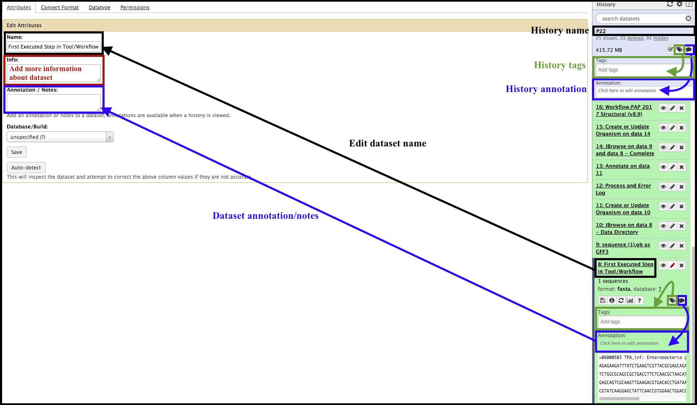
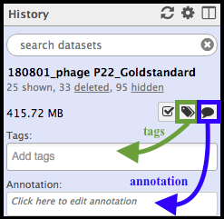

> ### Agenda
>
> 1. Minimum Essential Practices
> 2. How Implementing These Practices is Helpful
>
{: .agenda}

# Rationale - Maintaining Reproducible Records

An important tenet of science is to maintain records to a reproducible, traceable standard. This philosophy is applicable to both lab notebooks *and* Galaxy histories. It is tempting to think that, because of the presence of a ‘history’ in Galaxy, the program has adequately maintained the user’s records and no further steps are needed to document research activities/analyses performed within the Galaxy suite. This is **incorrect.** Here, strongly recommended practices are shown to make data in Galaxy more accessible to both the current user and futures users.

# Minimum Essential Practices

Galaxy enables the editing of *both* histories and individual datasets, as well as the ability to add tags and/or annotation notes.

## Histories
------

### History names

The name above does not tell much about what is contained in the history, aside from the organism being worked on (phage P22). Clicking on the name will allow for editing. Give the history a descriptive name that tells of the main analyses, datasets, or goals for the work done in this history.

The name here was changed to display the date the history was created, the organism, and the goal of the work done in this history - a “gold standard” reference genome for P22, a canonical phage.

### History Tags and Annotation Notes

Tags 
and annotation notes  can be added by clicking on their respective icons at the top of the history panel, below the name. This could help a new user sort though data that belongs to someone else.

Possible tags could include the workflows and/or tools run within that history