# Introduction


The {CRISPR} system is a bacterial immune system that has been modified for genome engineering. This groundbreaking technology resulted in a Nobel Prize for Emmanuelle Charpentier and Jennifer Doudna in 2020 (). CRISPR consists of two components: a guide RNA (gRNA) and a non-specific CRISPR-associated endonuclease (Cas9). The gRNA is a short synthetic RNA composed of a scaffold sequence necessary for Cas9-binding (trRNA) and ~20 nucleotide spacer or targeting sequence which defines the genomic target to be modified (crRNA). Cas9 induces double-stranded breaks (DSB) within the target DNA. The resulting DSB is then repaired by either error-prone Non-Homologous End Joining (NHEJ) pathway or less efficient but high-fidelity Homology Directed Repair (HDR) pathway. The NHEJ pathway is the most active repair mechanism and it leads to small nucleotide insertions or deletions (indels) at the DSB site. This results in in-frame amino acid deletions, insertions or frameshift mutations leading to premature stop codons within the open reading frame (ORF) of the targeted gene. Ideally, the end result is a loss-of-function mutation within the targeted gene; however, the strength of the knockout phenotype for a given mutant cell is ultimately determined by the amount of residual gene function.

The ease of generating gRNAs makes {CRISPR} one of the most scalable genome editing technologies and it has been recently utilized for genome-wide screens. These screens enable systematic targeting of 1000s of genes, with one gene targeted per cell, to identify genes driving phenotypes, such as cell survival, drug resistance or sensitivity. It is feasible for any laboratory to perform a CRISPR screen () and they are being increasingly used to obtain biological insight (, ). These days, pooled whole-genome knockout, inhibition and activation CRISPR libraries and CRISPR sub-library pools are commonly screened.

")


> <agenda-title></agenda-title>
>
> In this tutorial, we will cover:
>
> 1. TOC
> {:toc}
>
{: .agenda}

# Preparing the reads

## Data upload

Here we will demonstrate analysing {CRISPR} screen using data from . There are 3 samples from the human esophageal cancer cell line (OACM5.1): a baseline sample taken at time zero (T0-Control), a sample treated with drug for 8 days (T8-APR-246) and a control sample treated with vehicle for 8 days (T8-Vehicle). The aim is to identify genes whose knockout increases the cancer cells sensitivity to the drug. We will use FASTQ files containing 1% of reads from the original samples to demonstrate the read processing steps.

> <hands-on-title>Retrieve CRISPR screen fastq datasets</hands-on-title>
>
> 1. Create a new history for this tutorial
> 2. Import the files from Zenodo:
>
>    - Open the file  __upload__ menu
>    - Click on __Rule-based__ tab
>    - *"Upload data as"*: `Collection(s)`
>    - Copy the following tabular data, paste it into the textbox and press <kbd>Build</kbd>
>
>      ```
>      T0-Control https://zenodo.org/api/files/6599878c-f569-41bf-a37a-2c6f3d2e67f9/T0-Control.fastq.gz
>      T8-APR-246 https://zenodo.org/api/files/6599878c-f569-41bf-a37a-2c6f3d2e67f9/T8-APR-246.fastq.gz
>      T8-Vehicle https://zenodo.org/api/files/6599878c-f569-41bf-a37a-2c6f3d2e67f9/T8-Vehicle.fastq.gz
>      ```
>
>    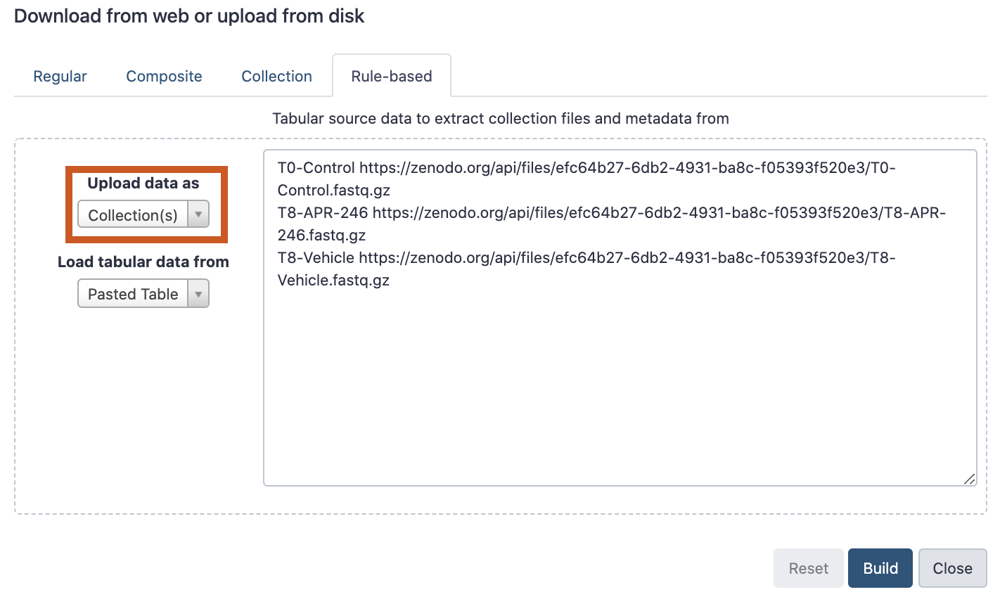
>
>    - From **Rules** menu select `Add / Modify Column Definitions`
>       - Click `Add Definition` button and select `List Identifier(s)`: column `A`
>
>         > <tip-title>Can't find <i>List Identifier</i>?</tip-title>
>         > Then you've chosen to upload as a 'dataset' and not a 'collection'. Close the upload menu, and restart the process, making sure you check *Upload data as*: **Collection(s)**
>         {: .tip}
>
>       - Click `Add Definition` button and select `URL`: column `B`
>
>    - Click `Apply`
>    - In the Name: box type `fastqs` and press <kbd>Upload</kbd>
>
>    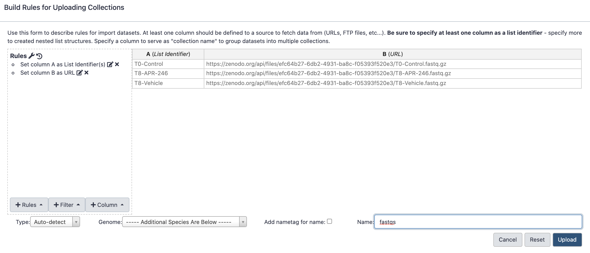
>
{: .hands_on}

## Raw reads QC

First we'll check the quality of the raw read sequences with [FastQC](https://www.bioinformatics.babraham.ac.uk/projects/fastqc/) and aggregate the reports from the multiple samples with [MultiQC](https://multiqc.info/) (). We will check if the base quality is good and for presence of adapters. For more details on quality control and what the other FastQC plots mean see the ["Quality control" tutorial]().
With CRISPR screens we expect adapter sequence to be present, surrounding the guide. The adapters for the Brunello library vector used with this dataset ([lentiGuide-Puro](https://www.addgene.org/52963/)) are shown below. We'll get FASTQC to check for their presence by providing an adapters file with their sequences.

. The adapter sequences are in red, directly adjacent to the guide on the right and left. The bases in purple at the start of the reads are stagger regions of different length (0-8bp), required to maintain diversity across the flowcell during sequencing of CRISPR screens.")

> <details-title>Adapters file</details-title>
>
> The adapters file (`adapter_list.tsv`) we use here with FASTQC was created by adding the two CRISPR adapter sequences (5' and 3' of the guide) to the bottom of the adapters file used by FASTQC [here](https://github.com/s-andrews/FastQC/blob/master/Configuration/adapter_list.txt). The first 12 bases of the CRISPR adapters were used, as that length is currently recommended in the FASTQC adapters file.
{: .details}


> <hands-on-title>Quality control</hands-on-title>
>
> 1. Import the adapters file from [Zenodo]({{ page.zenodo_link }}) or the Shared Data library (if available):
>    ```
>    https://zenodo.org/api/files/6599878c-f569-41bf-a37a-2c6f3d2e67f9/adapter_list.tsv
>    ```
>    
>
> 2.  with the following parameters:
>    -  *"Short read data from your current history"*: fastqs (click "Dataset collection" button on left-side of this input field)
>    - *"Adapter list"*: `adapter_list.tsv`
>
> 3.  with the following parameters to aggregate the FastQC reports:
>     - In *"Results"*
>       - *"Which tool was used generate logs?"*: `FastQC`
>       - In *"FastQC output"*
>         - *"Type of FastQC output?"*: `Raw data`
>         -  *"FastQC output"*: `Raw data` files (output of **FastQC**)
>
> 4. Add a tag (`#fastqc-untrimmed`) to the MultiQC webpage to make it easy to differentiate this dataset in the History from other MultiQC reports we will generate.
>
>    
>
> 5. Inspect the webpage output from MultiQC
>
>    > <question-title></question-title>
>    >
>    > 1. What is the read length?
>    > 2. What do you think of the base quality of the sequences?
>    > 3. Are adapters detected?
>    >
>    > > <solution-title></solution-title>
>    > >
>    > > 1. The read length is 75 bp.
>    > > 2. The base quality is good for the 3 files, as can be seen in the plot below.
>    > >
>    > >    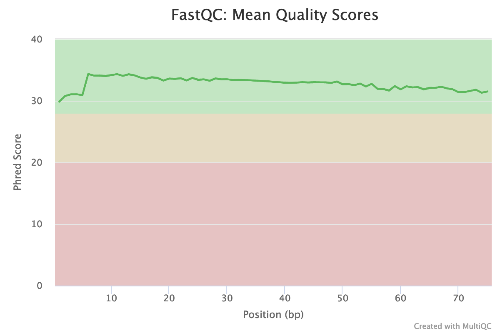
>    > > 3. Yes. In the Adapter Content plot (below) we can see the two CRISPR adapters have been detected. The adapter 5 prime of the sgRNA starts appearing at the beginning of the reads and has been detected in nearly 100% of reads. The adapter 3 prime of the sgRNA appears after base 40. There's also a little Illumina Universal adapter detected towards the ends of some reads which indicate the presence of short fragments, possibly adapter dimers.
>    > >
>    > >    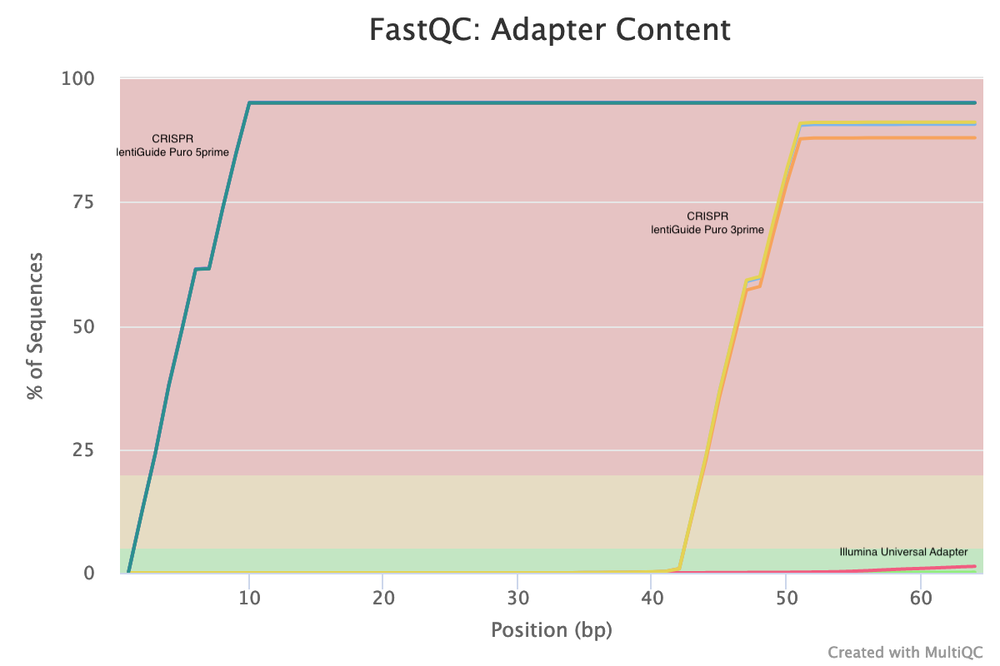
>    > {: .solution}
>    >
>    {: .question}
>
{: .hands_on}


## Trim adapters

We'll trim the adapters from these sequences using [Cutadapt](https://cutadapt.readthedocs.io/en/stable/guide.html) (). To trim, we'll use the 5' adapter sequence. We don't need to trim the 3' adapter as {MAGeCK} will only use the first 20bp from each read. It determines the number of bases to use automatically from the length of the sequences in the library file, in our case 20bp, or we can specify the sgRNA length.


> <details-title>Adapter trimming</details-title>
>
> In this dataset the adapters start at different positions in the reads, as was shown above. MAGeCK count can trim adapters around the guide sequences. However, the adapters need to start at the same position in each read, requiring the same trimming length, as described on the MAGeCK website [here](https://sourceforge.net/p/mageck/wiki/advanced_tutorial/). An example for what MAGeCK expects is shown below. If you used MAGeCK count trimming with the dataset in this tutorial it wouldn't be able to trim the 5' adapter properly and you would only get ~60% reads mapping instead of >80%.
>
> 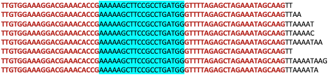
>
> For this dataset, as the adapters are not at the same position in each read, we need to trim the adapters before running MAGeCK count.
{: .details}


> <hands-on-title>Trim adapters</hands-on-title>
>
> 1.  with the following parameters:
>    - *"Single-end or Paired-end reads?"*: `Single-end`
>        -  *"FASTQ/A file #1"*: all fastq.gz files
>        - In *"Read 1 Options"*:
>            - In *"5' (End) Adapters"*:
>                -  *"Insert 5' (Front) Adapters"*
>                    - *"Source"*: `Enter custom sequence`
>                        - *"Enter custom 5' adapter sequence"*: `TTGTGGAAAGGACGAAACACCG`
>    - *"Outputs selector"*:
>        - *"Report"*: tick
>
> 2. Inspect the Cutadapt report
>
>    > <question-title></question-title>
>    >
>    > For sample T8-APR-246:
>    >
>    > What % of reads contained adapter?
>    >
>    > > <solution-title></solution-title>
>    > >
>    > > 99.6%
>    > >
>    > {: .solution}
>    {: .question}
>
> 3.  with the following parameters to aggregate the Cutadapt reports:
>     - In *"Results"*
>       - *"Which tool was used generate logs?"*: `Cutadapt/Trim Galore!`
>         -  *"Output of Cutadapt"*: `Report` files (output of **Cutadapt**)
>
> 4. Add a tag (`#cutadapt-report`) to the MultiQC webpage to differentiate this report from the previous (FastQC) one
>
> 5. Inspect the MultiQC report
>
{: .hands_on}

MultiQC produces a 5' trimmed sequences plot where we can check the results are as expected. Here we can see the length of sequence trimmed from the start of the read ranges from 22bp to 30bp with a dip at 27bp. This corresponds to the length of the adapter (22bp) plus stagger sequence (0,1,2,3,4,6,7,8bp) ([see sequencing protocol](https://media.addgene.org/cms/filer_public/61/16/611619f4-0926-4a07-b5c7-e286a8ecf7f5/broadgpp-sequencing-protocol.pdf)). There is no 5bp stagger sequence so 27bp sequences are not expected to be trimmed. The trimmed sequence lengths are what we expect for this dataset and the plot looks similar for all our samples which is good.

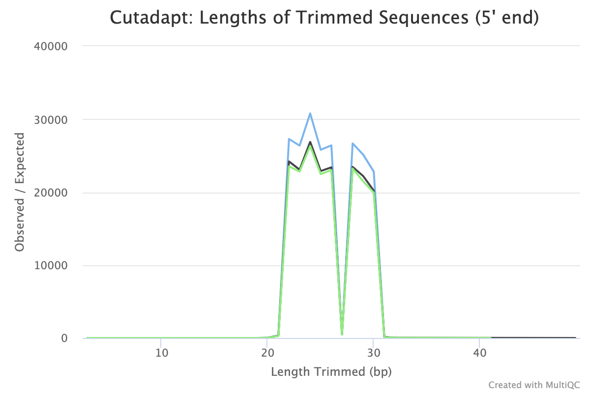{:width="70%"}


> <hands-on-title>Exercise: Quality control of the polished datasets</hands-on-title>
> Use  and  like before, but using the the trimmed datasets produced by Cutadapt as input.
>
>    > <question-title></question-title>
>    >
>    > How did read trimming affect the Adapter Content plot?
>    >
>    > > <solution-title></solution-title>
>    > >
>    > > In the Adapter Content section we now don't have any 5' adapter detected. The first 20bp of the reads, what MAGeCK will use for our dataset, has no adapter detected.
>    > >
>    > > 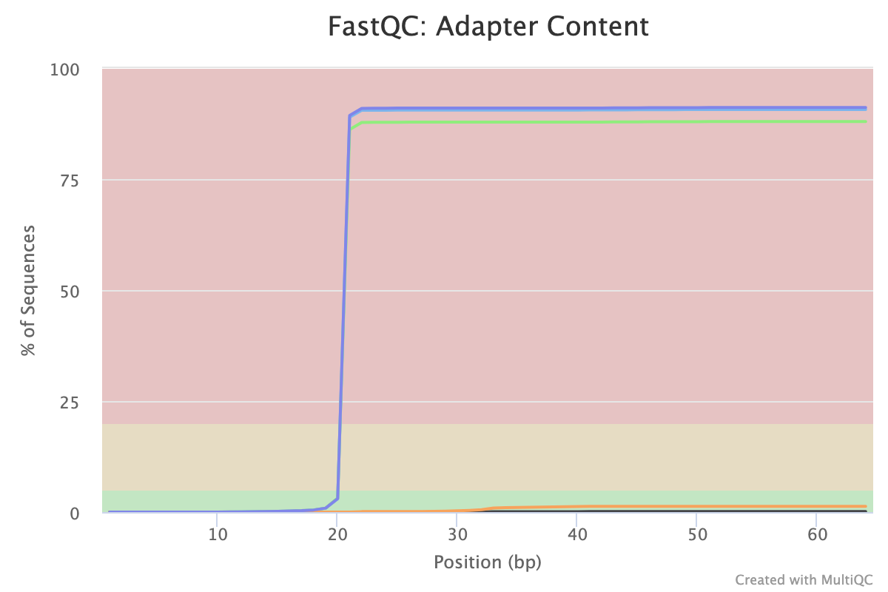{:width="70%"}
>    > >
>    > {: .solution}
>    {: .question}
{: .hands_on}

# Counting

For the rest of the {CRISPR} screen analysis, counting and testing, we'll use the tool called {MAGeCK} (, ).

To count how many guides we have for each gene, we need a library file that tells us which guide sequence belongs to which gene. The guides used here are from the [Brunello library](https://www.addgene.org/pooled-library/broadgpp-human-knockout-brunello/) () which contains 77,441 sgRNAs, an average of 4 sgRNAs per gene, and 1000 non-targeting control sgRNAs. **The library file must be tab-separated and contain no spaces within the gene or target names**. If necessary, there are tools in Galaxy that can format the file removing spaces and converting commas to tabs.

> <hands-on-title>Count guides per gene</hands-on-title>
> 1. Import the sgRNA library file
>    ```
>    https://zenodo.org/api/files/6599878c-f569-41bf-a37a-2c6f3d2e67f9/brunello.tsv
>    ```
>
> 2.  with the following parameters:
>    - *"Reads Files or Count Table?"*: `Separate Reads files`
>        -  *"Sample reads"*: the `Read 1 Output` (outputs of **Cutadapt**)
>    -  *"sgRNA library file"*: the `brunello.tsv` file
>    - In *"Output Options"*:
>        - *"Output Count Summary file"*: `Yes`
>        - *"Output plots"*: `Yes`
>
> 3. We have been using 1% of reads from the samples. Import the MAGeCK count files (sgRNA counts, counts summary and plots pdf) for the full dataset so you can see what results for a real dataset looks like.
>    ```
>    https://zenodo.org/api/files/6599878c-f569-41bf-a37a-2c6f3d2e67f9/kenji_mageck_sgrna_counts.tsv
>    https://zenodo.org/api/files/6599878c-f569-41bf-a37a-2c6f3d2e67f9/kenji_mageck_count_summary.tsv
>    https://zenodo.org/api/files/6599878c-f569-41bf-a37a-2c6f3d2e67f9/kenji_mageck_count_report.pdf
>    ```
>
{: .hands_on}

MAGeCK count outputs:

* a sgRNA Counts file
* a Count Summary file
* a PDF report

**Count Summary file**

The contents of the count summary file is explained on the MAGeCK website [here](https://sourceforge.net/p/mageck/wiki/output/#count_summary_txt), also shown below. The columns are as follows. To help you evaluate the quality of the data, recommended values from the MAGeCK authors are shown in bold.

Column | Content
--- | ---
File | The fastq (or the count table) file used.
Label | The label of that fastq file assigned.
Reads | Total number reads in the fastq file. **(Recommended: 100~300 times the number of sgRNAs)**
Mapped | Total number of reads that can be mapped to library
Percentage | Mapped percentage, calculated as Mapped/Reads **(Recommended: at least 60%)**
TotalsgRNAs | Total number of sgRNAs in the library
Zerocounts | Total number of missing sgRNAs (sgRNAs that have 0 counts) **(Recommended: no more than 1%)**
GiniIndex | The Gini Index of the read count distribution. A smaller value indicates more eveness of the count distribution. **(Recommended: around 0.1 for plasmid or initial state samples, and around 0.2-0.3 for negative selection samples)**

> <details-title>Gini index</details-title>
>
> Gini index is a measure of inequality from economics. It is used in CRISPR analysis to assess if sgRNAs are present in equal amounts. In positive selection experiments, where only some sgRNAs dominate, the index can be high. However, as discussed in , in plasmid library, in early time points, or negative selection experiments, we expect fairly even
> distribution of the remaining sgRNAs that haven't been negatively selected. A high Gini index in these types of sample can indicate CRISPR oligonucleotide synthesis unevenness, low viral transfection efficiency, and overselection, respectively.
{: .details}

> <question-title></question-title>
>
> Is the data quality good for the 3 samples? Use the count summary file for the full dataset, and the recommended values in the table above, to answer these questions.
>
> 1. Have we sequenced enough reads?
> 2. Is the mapped percentage good?
> 3. Is the sgRNA zero count value good?
> 4. Is the Gini Index good?
>
> > <solution-title></solution-title>
> >
> > 1. The number of reads is ok. For example, for T0 control sample we have 17,272,052 reads mapped to guides. We have 77,441 guides so we have ~220 reads per guide (17,272,052/77,441). A minimum of 100 reads per guide, preferably 300, is recommended.
> > 2. Yes, in the summary we have >85% mapped for all 3 samples. {MAGeCK} count does not allow any base mismatches between the reads and the library file, as described [here](https://sourceforge.net/p/mageck/wiki/advanced_tutorial/#tutorial-1-allow-mismatches-for-read-mapping) so we expect not all reads will map. Note that we filtered out (6-10%) reads with Cutadapt so we should include those in our unmapped % if we want an accurate count.
> > 3. T0-Control has 0.71% (546/77441 * 100) sgRNAs that have no reads mapped, which is good. The T8 samples are just slightly high at 2.3% (1752/77441 * 100) and 2.8% (2170/77441 * 100).
> > 4. The Gini Index is 0.09 for T0-Control (initial state) which is good. The T8 samples are higher at 0.13 and 0.14 but good for a negative selection experiment.
> >
> {: .solution}
>
{: .question}

MAGeCK count can also generate a PDF with plots that can help assess quality.

> <hands-on-title>Assess mageck count plots</hands-on-title>
>
> Inspect the PDF we imported above.
>
> > <question-title></question-title>
> >
> > What can you determine about the samples from the plots?
> >
> >
> > > <solution-title></solution-title>
> > >
> > > In the boxplots, we can see we have largely similiar distributions of counts for the 3 samples. The greater length of the box and between whiskers in the T8 samples compared to the control tells us we have a bit more variability of counts in those samples, more guides with low and high counts in T8 compared to the T0.
> > > 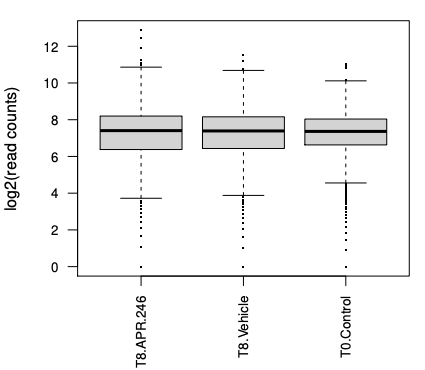
> > >
> > > The Distribution of read counts plot shows us how many guides we have for each count (the frequency sums to the total no. of guides 77,441). Similar to the boxplots, the wider distribution for T8 compared to T0 shows us that those samples have more guides with low and high counts. The peak for T0 appears lower just because it has more points (bins) in the plot.
> > > 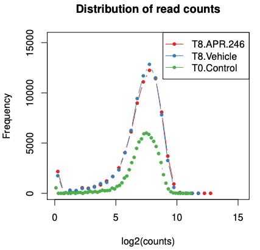
> > >
> > > The PCA plot shows us the samples from the different conditions separate well. The T8 samples are a bit more similar to each other, to each other on PC1 axis than to T0. If we had more samples we could use this plot to check for clustering of replicates, batch effect or outliers.
> > > 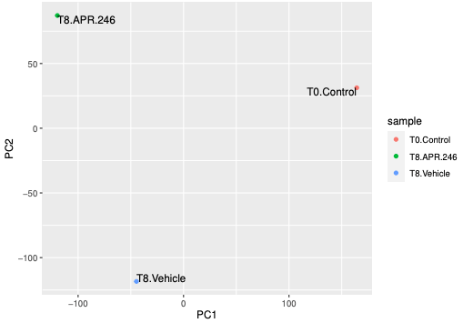
> > >
> > > The hierarchical clustering plot also shows us that the T8 samples are a bit more similar to each other than to T0.
> > > 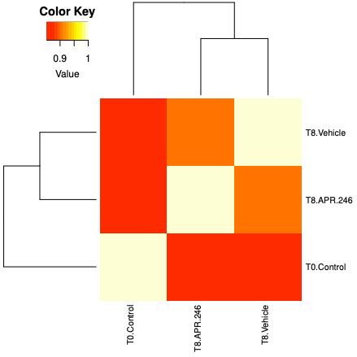
> > {: .solution}
> >
> {: .question}
>
{: .hands_on}


The paper by  has more information on MAGeCK quality control.

# Testing

Now that we've generated our guide counts, we'll use MAGeCK test to identify essential genes. Essential means positively or negatively selected sgRNAs and genes. CRISPR positive or negative selection screens can be performed. With a positive selection screen, most cells die after the treatment (selection) and we are interested in identifying genes whose sgRNAs increase and dominate, indicating loss of those genes helps cells survive that treatment. This can help identify genes essential for drug resistance. With a negative selection screen, most cells survive after the treatment. In that case, we are interested in identifying genes whose sgRNAs decrease (drop out) compared to a control (e.g. vehicle), indicating those genes are needed for the cells to survive with that treatment. This can help identify genes essential for drug sensitivity. Regardless of the type of screen performed (positive or negative), MAGeCK can identify both positively and negatively selected genes in the screen (). The dataset we are using in this tutorial is from a negative selection screen where the aim is to identify genes whose knockout increases the cancer cells sensitivity to the drug.

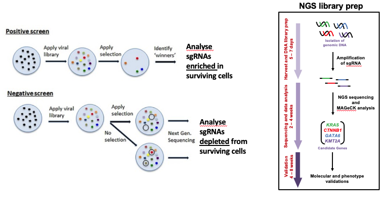


## Two conditions

If we want to compare the drug treatment (T8-APR-246) to the vehicle control (T8-Vehicle) we can use MAGeCK test. MAGeCK test uses a robust ranking aggregation (RRA) algorithm ().

 from different experiments are first normalized using median normalization and mean-variance modeling is used to capture the relationship of mean and variance in replicates. The statistical significance of each sgRNA is calculated using the learned mean-variance model. Essential genes (both positively and negatively selected) are then identified by looking for genes whose sgRNAs are ranked consistently higher (by significance) using robust rank aggregation (RRA) (from )")


> <hands-on-title>Test for enrichment</hands-on-title>
>
> 1.  with the following parameters:
>    -  *"Counts file"*: `kenji_mageck_sgRNA_counts.tsv`(the counts file for the full dataset that we imported)
>    - *"Specify Treated samples or Control"*: `Treated samples`
>        - *"Treated Sample Labels (or Indexes)"*: `0`
>    - *"Control Sample Labels (or Indexes)"*: `1`
>    - In *"Output Options"*:
>        - *"Output normalized counts file"*: `Yes`
>        - *"Output plots"*: `Yes`
>
> > <details-title>MAGeCK test sample names</details-title>
> >
> > For MAGeCK test we could specify the samples using their names, which must match the names used in the columns of the counts file, but the hyphens we have in our sample names aren't allowed. We could change the hyphens in the counts file or we can specify the samples by their positions in the counts file, with the first sample column being 0. We do that here.
> >
> {: .details}
>
{: .hands_on}

> <comment-title>Replicates</comment-title>
>
> If we have biological and/or technical replicates we can handle them in a similar way to that described on the [MAGeCK website](https://sourceforge.net/p/mageck/wiki/QA/#how-to-deal-with-biological-replicates-and-technical-replicates).
For biological replicates, we input them in MAGeCK test Treated Sample Labels/Control Sample Labels fields separated by a comma.
For technical replicates, we could combine the fastqs for each sample/biological replicate, for example with the **Concatenate datasets** tool, before running MAGeCK count.
>
{: .comment}

> <details-title>Normalization</details-title>
>
> We are using MAGeCK's default normalization method "median" which is more robust to outliers.
> Figure M1 from  shows a comparison of median ("median") versus total ("total") normalization for two CRISPR screen datasets.
> The distribution of the read counts of significant sgRNAs (FDR=1%) was compared with the mean read count distribution of all sgRNAs (“all”, black). The distribution of the significant sgRNAs should be similar to the distribution of all sgRNAs if the normalization method is unbiased. The difference is small for the leukemia dataset. However, in the melanoma dataset, where a few sgRNAs have very large read counts, the difference is larger, as “total” normalization will prefer sgRNAs with higher read-counts. In contrast, the distribution after “median” normalization is closer to the distribution of all sgRNAs.
>
> 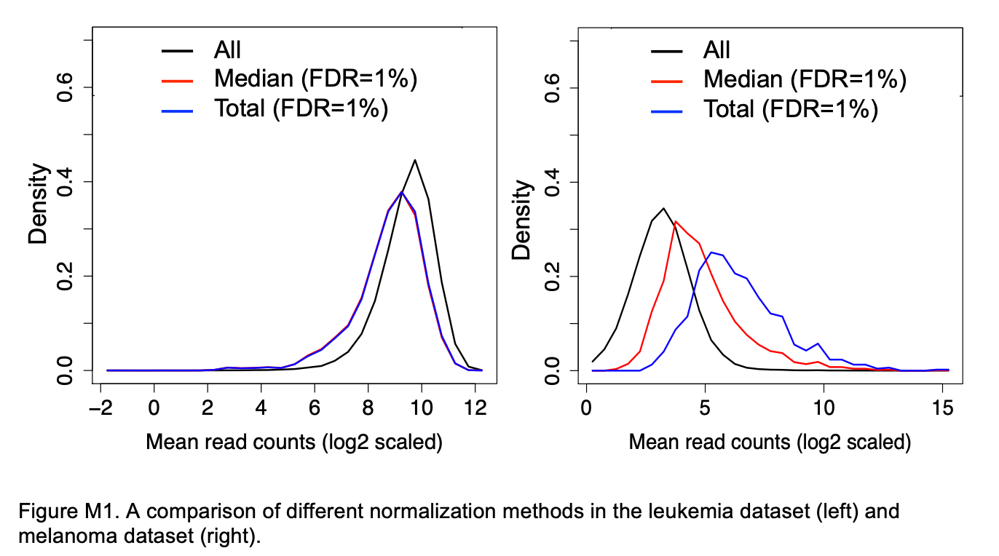
>
> If many genes have zero counts, such as after treatment in a positive selection screen, the median may be zero and we may get a message in the MAGeCK log that we have to use total normalization.
>
> Instead of median or total, we could choose to normalize using control guide sgRNAs. However, we would need to know that they're not changing due to the experiment or introducing bias ().
{: .details}

{MAGeCK} test outputs:

* a Gene Summary file
* a sgRNA Summary file
* a PDF report

**Gene Summary file**

The Gene Summary file contains the columns described below and a row for each gene targeted by sgRNAs. We have >20,000 genes in the file for this dataset.
We get values for both negative and positive selection. The dataset here is from a negative selection screen so we are most interested in the negative values.
Genes are ranked by the p.neg field (by default). If you need a ranking by the p.pos, you can use the **Sort** data in ascending or descending order tool in Galaxy.

Column name | Content
--- | ---
id | Gene ID
num | The number of targeting sgRNAs for each gene
neg\|score | The RRA lo value of this gene in negative selection
neg\|p-value | The raw p-value (using permutation) of this gene in negative selection
neg\|fdr | The false discovery rate of this gene in negative selection
neg\|rank  | The ranking of this gene in negative selection
neg\|goodsgrna | The number of "good" sgRNAs, i.e., sgRNAs whose ranking is below the alpha cutoff (determined by the --gene-test-fdr-threshold option), in negative selection.
neg\|lfc | The log2 fold change of this gene in negative selection. The way to calculate gene lfc is controlled by the --gene-lfc-method option
pos\|score | The RRA lo value of this gene in positive selection
pos\|p-value | The raw p-value (using permutation) of this gene in positive selection
pos\|fdr | The false discovery rate of this gene in positive selection
pos\|rank  | The ranking of this gene in positive selection
pos\|goodsgrna | The number of "good" sgRNAs, i.e., sgRNAs whose ranking is below the alpha cutoff (determined by the --gene-test-fdr-threshold option), in positive selection.
pos\|lfc | The log fold change of this gene in positive selection


**sgRNA summary file**

The sgRNA Summary file contains the columns described below. We can use the sgRNA file to check how the individual guides for genes of interest performed.

Column | Content
--- | ---
sgrna | sgRNA ID
Gene | The targeting gene
control_count | Normalized read counts in control samples
treatment_count | Normalized read counts in treatment samples
control_mean | Median read counts in control samples
treat_mean | Median read counts in treatment samples
LFC | The log2 fold change of sgRNA
control_var | The raw variance in control samples
adj_var | The adjusted variance in control samples
score | The score of this sgRNA
p.low | p-value (lower tail)
p.high  | p-value (higher tail)
p.twosided | p-value (two sided)
FDR | false discovery rate
high_in_treatment | Whether the abundance is higher in treatment samples


**PDF report**

The PDF shows plots of the top 10 negatively and positively selected genes.
We can see the top genes ranked by RRA scores or p value. These values come from the gene summary file.

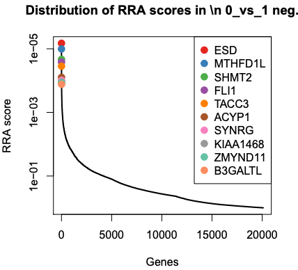

> <question-title></question-title>
>
> What are the top 3 negatively selected genes by P value?
>
> > <solution-title></solution-title>
> >
> > ESD, MTHFD1L and SHMT2, the same as by RRA score. RRA score is like p-value. Those genes are part of the glutathione pathway which was found to be altered in the published paper for this dataset.
> >
> > 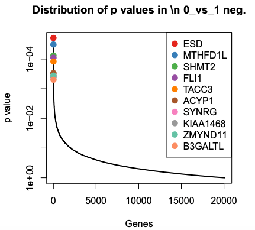
> >
> {: .solution}
>
{: .question}

The PDF also shows plots with the sgRNA counts for the top 10 genes. These values are the normalized counts for each sgRNA from the sgRNA summary file. With these plots we can see if the counts of all the sgRNAs for these top genes are changing similarly.

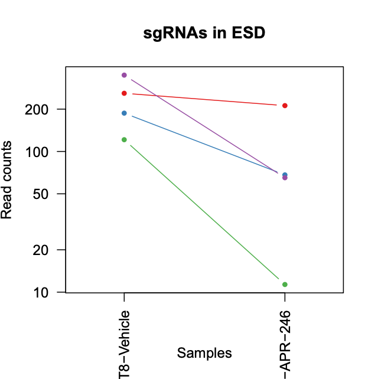{:width="50%"}

> <question-title></question-title>
>
> 1. Are all the sgRNAs for FLI1 (the 4th top neg gene) changing similarly?
> 2. In the gene summary table, how many of the negatively selected genes have FDR < 0.05?
>
> > <solution-title></solution-title>
> >
> > 1. No. We can see in this case that, while one sgRNA is a lot lower in the APR treated sample compared to the vehicle, one increases a little, and the other two sgRNAs don't change much. So we might conclude that this gene is not strongly negatively selected.
> > 2. None. One reason for this is likely the large number of genes being tested (>20,000). You could try to increase sensitivity with the procedures described [here](https://sourceforge.net/p/mageck/wiki/QA/#i-see-very-few-genes-that-are-below-the-certain-fdr-cutoff-like-010-why-it-is-that-and-what-should-i-do).
> >
> > 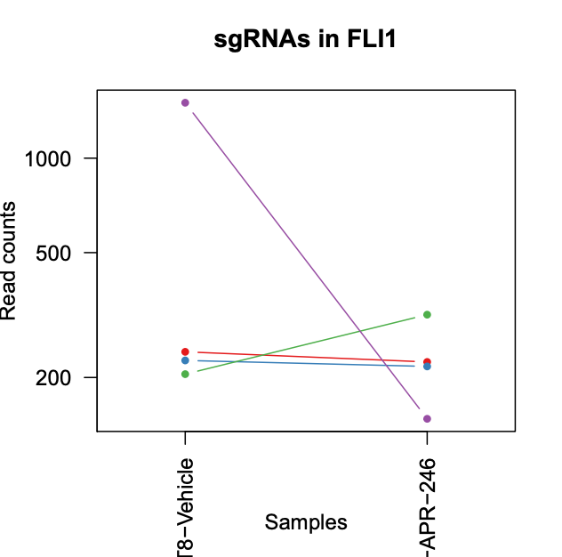{:width="50%"}
> >
> {: .solution}
>
{: .question}


### Visualisation

In addition to the visualisations automatically generated by MAGeCK in the PDF, we can create a volcano plot to further visualise the output. With a volcano plot we plot the magnitude of change for drug treatment versus vehicle control (lfc) versus significance (p-value). As we have two columns for lfc and p-value, one for negative selection and one for positive, we first combine these into one column for each using the **awk** tool. If the `neg|p-value` is smaller than the `pos|p-value` the gene is negatively selected. If the `neg|p-value` is larger than the `pos|p-value` the gene is positively selected. Then we create the plot using the **Volcano plot** tool.


> <hands-on-title>Create volcano plot</hands-on-title>
> 1.  with the following parameters:
>    -  *"File to process"*: `MAGeCK test Gene Summary`
>    - *"AWK Program"*: Copy and paste the text in the grey box below into this field
>
>    ```
>    # Print new header for first line
>    NR == 1 { print "gene", "pval", "fdr", "lfc" }
>
>    # Only process lines after first
>    NR > 1 {
>        # check if neg pval (column 4) is less than pos pval (column 10)
>        if ($4 < $10){
>           # if it is, print negative selection values
>            print $1, $4, $5, $8
>        } else {
>           # if it's not, print positive selection values
>            print $1, $10, $11, $14
>        }
>    }
>    ```
>  2. Inspect the file output. It should look like below.
> ```
> gene    pval        fdr       lfc
> ESD     1.9454e-05  0.324257  -1.9283
> MTHFD1L 3.226e-05   0.324257  -0.89778
> SHMT2   7.6093e-05  0.454208  -1.1328
> FLI1    9.0376e-05  0.454208  -0.08872
> ```
>
> 3.  to create a volcano plot
>    -  *"Specify an input file"*: the Text reformatting output file
>    -  *"File has header?"*: `Yes`
>    -  *"FDR (adjusted P value)"*: `Column 3`
>    -  *"P value (raw)"*: `Column 2`
>    -  *"Log Fold Change"*: `Column 4`
>    -  *"Labels"*: `Column 1`
>    -  *"Points to label"*: `Significant`
>        -  *"Only label top most significant"*: `10`
>
> 4. Inspect the plot in the PDF output.
>
>    > <question-title></question-title>
>    >
>    > What is the most significant gene?
>    >
>    > > <solution-title></solution-title>
>    > >
>    > > ATP5E as it is the gene nearest the top of the plot.
>    > >
>    > > 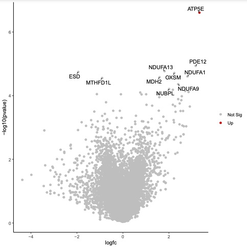{:width="50%"}
>    > >
>    > {: .solution}
>    >
>    {: .question}
>
> For more details on using the volcano plot tool, see the [tutorial here](). For how to customise the volcano plot tool output using R, see the [tutorial here]().
>
{: .hands_on}


### Pathway analysis

We can perform pathway analysis on the results to identify pathways that are changing with the treatment. MAGeCK has a pathway analysis module, however, we will use the tool **fgsea** as it outputs some visualisations and the genes enriched in the pathway. For fgsea we need a ranked list of genes and a pathways file in GMT format. We can get the ranked list from our mageck results, we'll use the RRA score column for negative results. For the pathways, we'll use the Hallmark pathways from MSigDB, which can be a good starting point for pathway exploration as discussed [here](http://www.gsea-msigdb.org/gsea/msigdb/collection_details.jsp).

> <hands-on-title>Perform gene set enrichment with fgsea</hands-on-title>
>
> 1. Import the Hallmark pathways file [Zenodo]({{ page.zenodo_link }}) or the Shared Data library (if available). Set the Type to tabular:
>    ```
>    https://zenodo.org/api/files/6599878c-f569-41bf-a37a-2c6f3d2e67f9/h.all.v7.4.symbols.gmt
>    ```
>    
>
> 2. **Cut columns from a table**  with
>    -  *"Cut columns"*: `c1,c3` (the gene symbols and neg score)
>    -  *"Delimited by"*: `Tab`
>    -  *"From"*: the MAGeCK Gene Summary file
> 3. **fgsea**  with
>    -  *"Ranked Genes"*: the output of **Cut** 
>    -  *"File has header?"*: `Yes`
>    -  *"Gene Sets"*: `h.all.v7.4.symbols.gmt` (this should be `tabular` format, if not, see how to change it in the Tip below)
>    -  *"Minimum Size of Gene Set"*: `15`
>    -  *"Output plots"*: `Yes`
>
>    > <question-title></question-title>
>    >
>    > What is the top ranked pathway?
>    >
>    > > <solution-title></solution-title>
>    > >
>    > > Oxidative phosphorylation.
>    > > You can see some explanation of fgsea output in the [RNA-seq genes to pathways" tutorial]().
>    > {: .solution}
>    >
>    {: .question}
{: .hands_on}


## (Optional) Multiple conditions

*It takes about 30 mins to run mageck mle on the samples below so this part of the tutorial is optional, you can try it if time allows or in your own time.*

If we have more than two conditions to compare, or a complex experimental design, we can use MAGeCK mle. MAGeCK mle uses a maximum likelihood estimation (MLE) algorithm (). It outputs a single value (beta score) per gene instead of a score for both negative and positive selection. A negative beta score indicates negative selection and a positive indicates positive selection. MAGeCK mle can also be used for comparing 2 conditions instead of MAGeCK test (RRA) but it is slower.

To demonstrate using MAGeCK mle, we will compare the drug treatment (T8-APR-246) to T0 and the vehicle (T8-Vehicle) to T0.
We'll use a design matrix file as described [here](https://sourceforge.net/p/mageck/wiki/input/#design-matrix-file).
The rules of the design matrix are:

* The design matrix file must include a header line of condition labels
* The first column is the sample labels that must match labels in read count file
* The second column must be a "baseline" column that sets all values to "1"
* The value in the design matrix is either "0" or "1"
* You must have at least one sample of "initial state" (e.g., day 0 or plasmid) that has only one "1" in the corresponding row. That only "1" must be in the baseline column
* The initial state (baseline) sample must be the 1st sample listed, under the header row, for mageck mle

The file for our samples looks like below. We have 3 conditions: baseline (T0), Vehicle and APR. The 1st row indicates that T0 is our baseline sample, the 2nd row indicates that we want to compare Vehicle to T0, and the 3rd row indicates that we want to compare APR to T0.

```
Samples     baseline  Vehicle APR
T0-Control  1         0       0
T8-Vehicle  1         1       0
T8-APR-246  1         0       1
```

Examples of more complicated design matrices, for e.g. time series experiments, can be seen on the [MAGeCK website](https://sourceforge.net/p/mageck/wiki/advanced_tutorial/#tutorial-4-make-full-use-of-mageck-mle-for-more-complicated-experimental-design-eg-paired-samples-time-series).

> <hands-on-title>Test for enrichment with MLE</hands-on-title>
> 1. Import the design matrix file from [Zenodo]({{ page.zenodo_link }}) or the Shared Data library (if available):
>    ```
>    https://zenodo.org/api/files/6599878c-f569-41bf-a37a-2c6f3d2e67f9/kenji_mageck_mle_design_matrix.tsv
>    ```
>
> 2.  with the following parameters:
>    -  *"Counts file"*: the `kenji_mageck_sgrna_counts.tsv` file
>    - *"Design matrix or sample labels"*: `Design matrix`
>        -  *"Design matrix file"*: the `mageck_mle_design_matrix` file
>
{: .hands_on}

MAGeCK mle Gene Summary output is described [here](https://sourceforge.net/p/mageck/wiki/output/#gene_summary_txt-in-mle-subcommand) and below.

Column | Content
--- | ---
Gene | Gene ID
sgRNA | The number of targeting sgRNAs for each gene
Condition_name\|beta | The beta score of this gene in condition (e.g. Vehicle or APR). The conditions are specified in the design matrix input to mle.
Condition_name\|p-value | The raw p-value (using permutation) of this gene
Condition_name\|fdr | The false discovery rate of this gene
Condition_name\|z  | The z-score associated with Wald test
Condition_name\|wald-p-value | The p value using Wald test
Condition_name\|wald-fdr | The false discovery rate of the Wald test

Similar to what we did with the MAGeCK test output, we can create a volcano plot to visualise the results, showing the magnitude of change (beta score) and significance (p-value).

> <hands-on-title>Visualize MLE results</hands-on-title>
> 1. Create a volcano plot to visualise the result for APR vs T0. Use the gene summary file columns `Gene` `APR|beta` `APR|wald-p-value`  `APR|wald-fdr`
>    -  to create a volcano plot
>        -  *"Specify an input file"*: the MAGeCK mle Gene Summary file
>        -  *"FDR (adjusted P value)"*: `Column 14`
>        -  *"P value (raw)"*: `Column 13`
>        -  *"Log Fold Change"*: `Column 9`
>        -  *"Labels"*: `Column 1`
>        -  *"Points to label"*: `Significant`
>        -  *"Only label top most significant"*: `10`
>
>   {:width="50%"}
>
>    Similarly, you could create a plot for the vehicle vs T0 using the gene summary file columns `Gene` `Vehicle|beta` `Vehicle|wald-p-value`  `Vehicle|wald-fdr`
>
{: .hands_on}


> <tip-title>Getting help</tip-title>
>
> For questions about using Galaxy, you can ask in the [Galaxy help forum](https://help.galaxyproject.org/). For questions about MAGeCK, you can ask in the [MAGeCK Google group](https://groups.google.com/g/mageck).
>
{: .tip}


# Conclusion


{CRISPR} Screen reads can be assessed for quality using standard sequencing tools such as FASTQC, MultiQC and trimmed of adapters using Cutadapt. The detection of enriched guides can be performed using {MAGeCK}. Downstream analysis can include visualisations, such as volcano plot, and pathway analysis with tools like fgsea.

# Acknowledgements


Thanks to Mehmet Tekman for suggesting the awk tool. Thanks also to Jennifer Devlin, Lydia Lim and Sylvia Mahara for comments and feedback on the tutorial.
