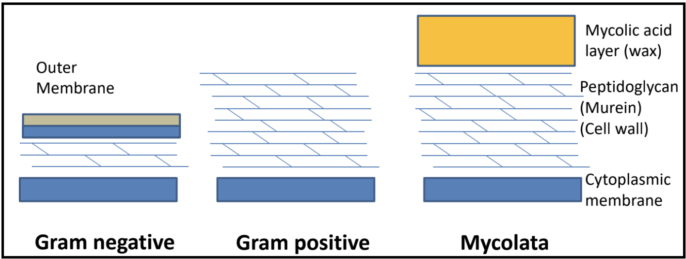
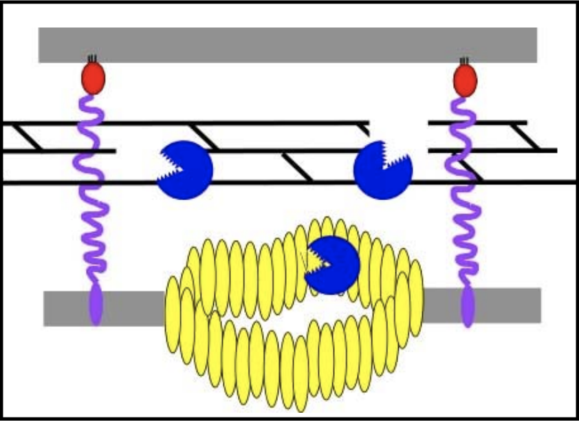
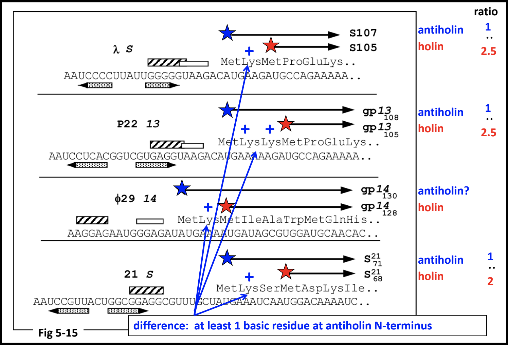
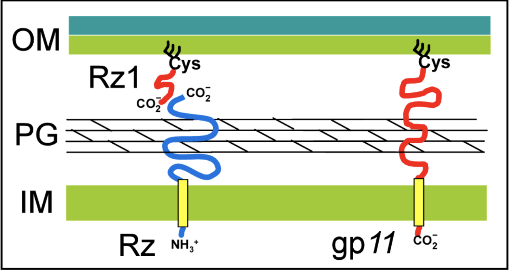

> ### Agenda
>
> 1. A Background on Lysis Genes
>    > * Genes Involved
>    > * Expected Genetic Context
> 2. Finding the Endolysin
>    > * Conserved Domain (InterPro)
>    > * BLAST Hits
>    > * SAR Endolysins
>    > * Types of Endolysins
> 3. Finding Holins and Antiholins
>    > * TMHMM Tracks - Transmembrane Prediction
>    > * BLAST Homology
>    > * Basic Considerations When Looking for Holins
>    > * Annotating Holoin/Antiholin Pairs
> 4. Spanin Genes
>    > * Gram-Negative Hosts
>    > * Spanin Architectures: i-spanin/o-spanin, u-spanin
>    > * What is an SPII signal? What is a lipobox?
> 5. Missing Lysis Genes
> {:toc}
>
{: .agenda}

# A Background on Lysis Genes

> ###  What are the different bacterial cell envelope structures?
>    > ### 
>    > 
> {: .solution}
{: .question}

## Genes Involved

> ###  Gram-positive & Mycolata Bacteria
>
{: .tip}

> ###  U-Spanins
>
{: .comment}

## Expected Genetic Context

> ###  Distributed Lysis Genes
>
> 
>
{: .comment}

# Finding the Endolysin

## Conserved Domain (InterPro)

## BLAST Hits

## SAR Endolysins

## Types of Endolysins

> * **Glycosidase** (T4 E)

> * **Transglycosidase (lambda R)

> * **Amidase** (T7 3.5)

> * Endopeptidase (T5 Lys)

# Finding Holins and Antiholins

## TMHMM Tracks - Transmembrane Prediction

> ###  An Important Note
> If the holin and antiholin are **NOT NEXT TO** the endolysin, then it can only be identified if there is *ONLY ONE* small TMD-containing protein in the entire genome, or via BLAST homology.
{: .tip}

## BLAST Homology

## Basic Considerations When Looking for Holins

> * Holins usually have 1-4 TMDs

> * Holins are small (70 - 220 amino acids)

## Annotating Holin/Antiholin Pairs

# Spanins

## Gram-Negative Hosts

The [CPT](https://cpt.tamu.edu/) has curated a [spanin database](https://cpt.tamu.edu/spanindb/#/phages) containing information on hundreds of annotated spanins.

## Spanin Architectures: i-spanin/o-spanin, u-spanin

> * **i-spanin**
>    > * 1 N-terminal TMD
>    > * Small (100-200 amino acids)
>    > * Functionally linked to *o-spanins*

> * o-spanin
>    > * N-terminal SPII signal
>    > * 1 N-terminal lipobox
>    > * Genetically starts completely/partially embedded or just downstream of the i-spanin

> ###  An Important Note on Spanin Annotation
> The i-spanin is **never** embedded in the o-spanin.
{: .comment}

> * u-spanin
>    > * 1 N-terminal SPII signal
>    > * 1 C-terminal TMD 

## What is an SPII signal? What is a lipobox?

# Missing Lysis Genes

