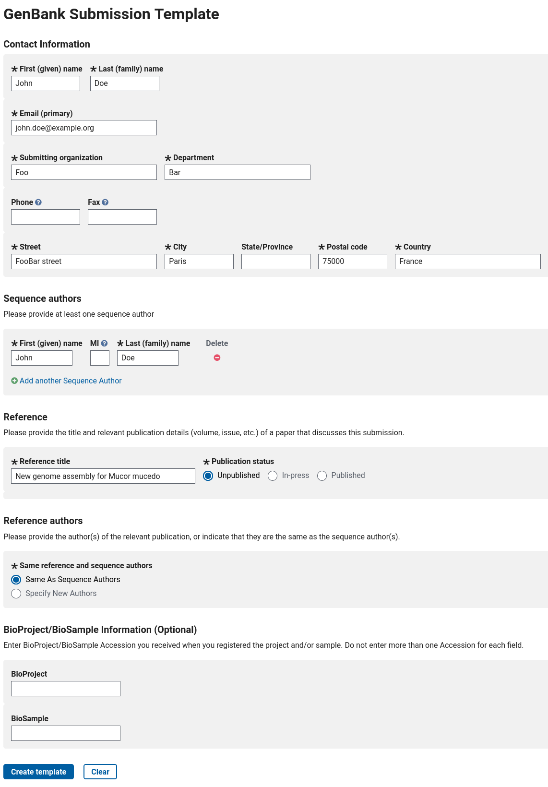
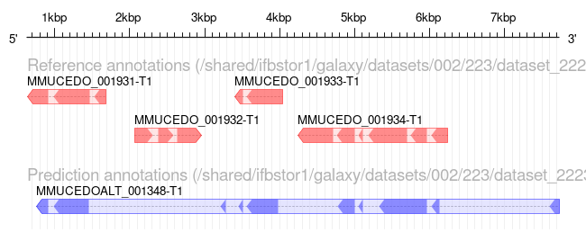

# Introduction


Genome annotation of eukaryotes is a little more complicated than for prokaryotes: eukaryotic genomes are usually larger than prokaryotes, with more genes. The sequences determining the beginning and the end of a gene are generally less conserved than the prokaryotic ones. Many genes also contain introns, and the limits of these introns (acceptor and donor sites) are not highly conserved.

In this tutorial we will use a software tool called Funannotate () to annotate the genome sequence of a small eukaryote: [*Mucor mucedo*](https://en.wikipedia.org/wiki/Mucor_mucedo) (a fungal plant pathogen).

As explained on [Funannotate's website](https://funannotate.readthedocs.io/), "it was originally written to annotate fungal genomes (small eukaryotes ~ 30 Mb genomes), but has evolved over time to accomodate larger genomes". As other annotation tools like [Maker]() () or Braker (), it works by aligning as many evidences as possible along the genome sequence, and then reconciliating all these signals to determine probable gene structures.

The evidences can be transcript or protein sequences from the same (or closely related) organism. These sequences can come from public databases (like NR or GenBank) or from your own experimental data (transcriptome assembly from an RNASeq experiment for example). Funannotate is also able to take into account repeated elements.

Funannotate uses ab-initio predictors ([Augustus](http://bioinf.uni-greifswald.de/augustus/), [SNAP](https://github.com/KorfLab/SNAP), [glimmerHMM](https://bio.tools/glimmer-hmm), [CodingQuarry](https://bmcgenomics.biomedcentral.com/articles/10.1186/s12864-015-1344-4) and [GeneMark-ES/ET](http://exon.gatech.edu/GeneMark/) (optional due to licensing)) to improve its predictions: these software tools are able to make gene structure predictions by analysing only the genome sequence with a statistical model.

While for [Maker]() you need to perform training steps for the ab-initio predictors, Funannotate is able to take care of that for you, which makes it much easier to use.

In this tutorial, you will learn how to perform a structural genome annotation, and how to evaluate its quality. Then, you will learn how to run functional annotation, using EggNOG-mapper and InterProScan to automatically assign names and functions to the annotated genes. And you will also learn how Funannotate can prepare files ready for submission of your annotation to the NCBI. Finally, you will learn how to use the [JBrowse](http://jbrowse.org/) genome browser to visualise your new annotation.

> <agenda-title></agenda-title>
>
> In this tutorial, we will cover:
>
> 1. TOC
> {:toc}
>
{: .agenda}

# Data upload

To annotate our genome using Funannotate, we will use the following files:

- The **genome sequence** in fasta format. For best results, the sequence should be soft-masked beforehand. You can learn how to do it by following the [RepeatMasker tutorial](). For this tutorial, we will try to annotate the genome assembled in the [Flye assembly tutorial]().
- Some RNASeq data in fastq format. We will align them on the genome, and Funannotate will use it as evidence to annotate genes.
- A set of **protein sequences**, like UniProt/SwissProt. It is important to have good quality, curated sequences here, that's why, by default, Funannotate will use the UniProt/SwissProt databank. In this tutorial, we have prepared a subset of this databank to speed up computing, but you should use UniProt/SwissProt for real life analysis.

 Funannotate will take into account the position of mapped RNASeq reads, and the alignment of protein sequences on the genome sequence to determine gene positions.

> <hands-on-title>Data upload</hands-on-title>
>
> 1. Create a new history for this tutorial
>
>    
>
> 2. Import the files from [Zenodo]({{ page.zenodo_link }}) or from
>    the shared data library (`GTN - Material` -> `{{ page.topic_name }}`
>     -> `{{ page.title }}`):
>
>    ```
>    https://zenodo.org/api/files/8c2cc766-2b68-45bd-a2d3-391acf9bdb1b/genome_masked.fasta
>    https://zenodo.org/api/files/8c2cc766-2b68-45bd-a2d3-391acf9bdb1b/rnaseq_R1.fq.gz
>    https://zenodo.org/api/files/8c2cc766-2b68-45bd-a2d3-391acf9bdb1b/rnaseq_R2.fq.gz
>    https://zenodo.org/api/files/8c2cc766-2b68-45bd-a2d3-391acf9bdb1b/SwissProt_subset.fasta
>    https://zenodo.org/api/files/8c2cc766-2b68-45bd-a2d3-391acf9bdb1b/alternate_annotation.gbk
>    https://zenodo.org/api/files/8c2cc766-2b68-45bd-a2d3-391acf9bdb1b/alternate_annotation.gff3
>    ```
>
>    
>    
>
{: .hands_on}

# Preparing the genome sequence

Before annotating the genome, we want to make sure that the fasta file is properly formatted. We do it now to make sure we will not encounter unexpected errors later in the annotation process.

Funannotate provides two little tools to help us. Let's run the two tools, one after the other.

The first one () compares all the sequences between them, and removes the shorter ones that are already included in longer ones. This is to reduce unexpected redundancy in the genome. This step is recommended only for haploid genomes (we know our organism is haploid). This first tool also removes any suspicious sequence (like sequences made only of 1 or 2 letters, instead of the 5 expected (ATGCN).

The second tool will ensure that our fasta file is sorted, based on the length of the contigs (the longest ones first). It will also rename contigs to make sure the name are standard (they will all begin with `scaffold_`, then a number).

> <hands-on-title>Polish the assembly</hands-on-title>
>
> 1.  with the following parameters:
>    -  *"Assembly to clean"*: `genome_masked.fasta` (Input dataset)
>
> 2.  with the following parameters:
>    -  *"Assembly to sort"*: `output` (output of **Funannotate assembly clean** )
>
{: .hands_on}

After this step, the genome is clean, sorted, and ready for the structural annotation.

> <question-title></question-title>
>
> How many sequences are removed by this cleaning step ?
>
> > <solution-title></solution-title>
> >
> > The repeat masked genome contains 1461 sequences, while the cleand one only contains 1425, so 36 were removed.
> >
> {: .solution}
>
{: .question}

# Preparing RNASeq data

When you sequence a new genome, you usually sequence a few libraries of RNASeq data, from different tissues and in different conditions, because this data will help you in annotating the genome. Here, we are using data from one RNASeq dataset that is available on [Sequence Read Archive (SRA)](https://www.ncbi.nlm.nih.gov/sra): [SRR8534859](https://www.ncbi.nlm.nih.gov/sra/?term=SRR8534859).

You would normally get the Fastq files directly from SRA and use them in the following step. To speed up the tutorial (without impairing too much the quality of the results), we have reduced the size of the dataset into a single pair of (smaller) fastq files, available from Zenodo (or the GTN Data Libraries).

To make use of this RNASeq data, we need to map it on the genome. We will use **RNA star**  and get a result in the form of a BAM file, that we will use in the rest of the tutorial.

> <hands-on-title>Hands-on</hands-on-title>
>
> 1.  with the following parameters:
>    - *"Single-end or paired-end reads"*: `Paired-end (as individual datasets)`
>        -  *"RNA-Seq FASTQ/FASTA file, forward reads"*: `rnaseq_R1.fq.gz` (Input dataset)
>        -  *"RNA-Seq FASTQ/FASTA file, reverse reads"*: `rnaseq_R2.fq.gz` (Input dataset)
>    - *"Custom or built-in reference genome"*: `Use reference genome from history and create temporary index`
>        -  *"Select a reference genome"*: `genome` (output of **Sort assembly** )
>        - *"Length of the SA pre-indexing string"*: `11`
>
{: .hands_on}

We select `11` for the *"Length of the SA pre-indexing string"* parameter as it is the recommended value for a small genome of this size. If you select 14 (the default value), STAR will advise you to use `11` instead in its logs.

> <comment-title>What if I want to use multiple RNASeq libraries</comment-title>
>
> To get the best possible annotation, it is adviced to use multiple RNASeq libraries, sequences from different tissues in different conditions. To use them, you can map each one individually using STAR, just as in this tutorial. You will get one BAM file per RNASeq library, and you can then easily merge them into a single BAM file by using the  tool. This single BAM file can then be used by Funannotate like we do in the next steps.
{: .comment}

Before we move on to the next step, we need to make sure that the mapping went well. Have a look at the `log` output of `RNA STAR`.

> <question-title></question-title>
>
> What proportion of reads were correctly mapped to the genome? Do you think it is enough to continue with this tutorial?
>
> > <solution-title></solution-title>
> >
> > Look for `Uniquely mapped reads %`: you should get ~96%. This is a very good score, because while reducing the size of the dataset for this tutorial, we have kept mostly reads properly mapping.
> > Anyway, with real data, you expect to have a vast majority of reads mapping uniquely on the genome. If it's not the case, check that you're using the correct RNASeq files, with the correct genome sequence.
> >
> {: .solution}
>
{: .question}

# Structural annotation

We can now run **Funannotate predict annotation** to perform the structural annotation of the genome.

We need to input the genome sequence, the mapped RNASeq data, and the proteins to align on the genome. We also specify the name of the species and strain (they can be used later for submission to NCBI).

There are other parameters to finely tune how Funannotate will run ab-initio predictors to predict genes, and to filter the final results based on various criteria. As Funannotate uses [BUSCO](http://busco.ezlab.org/) (Benchmarking Universal Single-Copy Orthologs) for initial training of ab-initio predictors, we select datasets close to the species we are annotating: `mucorales (orthodb 10)` and `rhizopus_oryzae`.

Funannotate is also able to use GeneMark to predict new genes, but to due to licensing restrictions, this software is not available on every Galaxy instance. We will ignore this for this tutorial, it will not impact the results too much.

> <hands-on-title>Hands-on</hands-on-title>
>
> 1.  with the following parameters:
>    -  *"Assembly to annotate"*: `genome` (output of **Sort assembly** )
>    - *"Funannotate database"*: select the latest version available
>    - In *"Organism"*:
>        - *"Name of the species to annotate"*: `Mucor mucedo`
>        - *"Strain name"*: `muc1`
>        - *"Is it a fungus species?"*: `No`
>    - In *"Evidences"*:
>        -  *"RNA-seq mapped to genome to train Augustus/GeneMark-ET"*: `mapped.bam` (output of **RNA STAR** )
>        - *"Select protein evidences"*: `Custom protein sequences`
>            -  *"Proteins to map to genome"*: `SwissProt_subset.fasta` (Input dataset)
>    - In *"Busco"*:
>        - *BUSCO models to align"*": `mucorales (orthodb 10)`
>        - *"Initial Augustus species training set for BUSCO alignment"*: `rhizopus_oryzae`
>    - *"Which outputs should be generated"*: Select all
>
{: .hands_on}

> <comment-title>on parameters</comment-title>
>
> - For *"Select protein evidences"* we select `Custom protein sequences` to reduce the computing time, but for real data analysis, you should select the default value: `Use UniProtKb/SwissProt (from selected Funannotate database)`.
> - It is possible to enable the *"Is it a fungus species?"* option in Funannotate: it launches an additional ab initio predictor (CodingQuerry) dedicated to fungi genomes. However it has proved to be unstable on the genome studied in this tutorial, and it can create a lot of fragmented gene models depending on the RNASeq data available. For this tutorial we leave this option to `No`. You can test it with real data, but be sure to compare the result with and without this option.
> - For real data analysis you can consider enabling the *"Augustus settings (advanced)"* > *"Run 'optimize_augustus.pl' to refine training (long runtime)"*. If you have enough data, you might get better results as there will be an additional training step for augustus (at the cost of a longer runtime).
{: .comment}

> <comment-title>Don't wait</comment-title>
>
> This step will take a bit of time to run. While it runs, we can already schedule the following functional annotation steps. Galaxy will run them automatically as soon as the structural annotation is ready.
{: .comment}

This tool produces several output dataset, in particular:

- the full structural annotation in Genbank, GFF3 or NCBI tbl formats: these files contain the position of all the genes that were found on the genome.
- the CDS, transcript and protein sequences of all the genes predicted by Funannotate (fasta files)
- some statistics and reports

Let's have a closer look at the output of our annotation. First display the `stats` dataset: the first par of the file contains some information on how funannotate was launched. If you go to the bottom, you'll find a few interesting numbers in the `annotation` section:

- the total number of genes and mRNA
- the average length of genes, exons, proteins
- the number of single/multiple exon transcripts

These number alone are interesting, but not fully informative on the quality of the annotation. For example, for the number of genes, you want a 'good' number based on what you expect for this species (a too big number can mean that genes are fragmented, and a too small number can mean that some genes were not annotated at all). These numbers can help when comparing an annotation with other ones performed with other parameters or tools. You can also compare these numbers with annotation of closely related species.

To get a better picture of the quality of the result, we will run BUSCO in the next step.

Before moving on, have a quick look at the `tbl2asn error summary report` output: it lists a few potential problems that were identified by Funannotate in the results it generated. For example, Funannotate can tell you when it predicted genes that contain very short exons, or that use a rare splice site sequence. You can have a detailed list of identified potential problems in the `tbl2asn genome validation report` dataset. It does not mean that each listed gene is wrong, but it means that you might want to give a closer look at these ones. If you have time to manually check each gene, Apollo can help you in doing this, see the note in the conclusion for this.



# Submission to NCBI

If you plan to submit the final genome sequence and annotation to NCBI, there are a few steps to follow.

> <warning-title>Please do not submit this genome to NCBI!</warning-title>
> In this tutorial we will **not** perform a real submission, as we don't want to duplicate the annotation in Genbank every time someone follows this tutorial!
>
> But here's a description of the main steps, and how Funannotate can help you in this process. NCBI provides a complete documentation for [genome and annotation submission](https://www.ncbi.nlm.nih.gov/genbank/genomesubmit/).
{: .warning}

- First, you should have created a BioProject and a BioSample [on the NCBI portal](https://submit.ncbi.nlm.nih.gov/subs/bioproject/), corresponding to your scientific project, and the sample(s) you have sequenced
- The raw reads used for the assembly, and the RNASeq ones should be deposited on SRA, and taggued with the BioProject and BioSample ids
- Ideally you should start submitting the assembly *before* performing the annotation. The reason is simple: NCBI performs some validation on the genome sequence before accepting it into GenBank. It means that you may be forced to make modifications to the genome sequence (e.g. remove contigs, split contigs where you have adapter contamination, etc). You will save time and trouble doing the annotation on a fully validated and frozen genome sequence.
- You should get a `locus_tag` for your genome: it is the unique prefix that is used at the beginning of each gene name. By default, Funannotate uses `FUN_` (e.g. `FUN_000001`), but to submit to NCBI you need to have a prefix specific to your genome. NCBI should provide it to you when you create your BioProject.
- You then need to prepare a file containing a few metadata. This can be done online on [https://submit.ncbi.nlm.nih.gov/genbank/template/submission/](https://submit.ncbi.nlm.nih.gov/genbank/template/submission/). You need to fill the form with some basic information, like that for example (for real data, you should of course write real information!):



When filled, you can click on the **Create template** button: you will be able to download a `.sbt` file that you should then upload to your Galaxy history.

The next step will show you how Funannotate can use this `.sbt` file, and the `locus_tag`, to generate the needed file for the submission of the annotation to the NCBI. These files will need to be submitted on the [NCBI genome submission portal](https://submit.ncbi.nlm.nih.gov/subs/genome/).

# Integrating structural and functional annotation

Now we have a structural annotation, and the results of both **EggNOG Mapper** and **InterProScan**. Each one is in a separate file, so we will now combine all this data into a single file that will contain both the structural *and* the functional annotation. This will be the final output of our annotation pipeline, ready to be submitted to the NCBI reference database.

> <hands-on-title>Hands-on</hands-on-title>
>
> 1.  with the following parameters:
>    - *"Input format"*: `GenBank (from 'Funannotate predict annotation' tool)`
>        -  *"Genome annotation in genbank format"*: `annotation (genbank)` (output of **Funannotate predict annotation** )
>    - *"Funannotate database"*: select the latest version available
>    -  *"NCBI submission template file"*: `template.sbt` (the file downloaded from NCBI website, or leave empty if you didn't generate it)
>    -  *"Eggnog-mapper annotations file"*: `annotations` (output of **eggNOG Mapper** )
>    -  *"InterProScan5 XML file"*: `InterProScan XML` (output of **InterProScan** )
>    -  *"BUSCO models"*: `mucorales (orthodb 10)`
>    - *"Strain name"*: `muc1`
>    - *"locus_tag from NCBI to rename GFF gene models with"*: `MMUCEDO_` (we consider NCBI has assigned us this `locus_tag`)
>    - *"Which outputs should be generated"*: Select all
>
{: .hands_on}

This tool produces several output dataset, in particular:

- The full structural and functional annotation in Genbank and GFF3 format
- NCBI tbl and sqn (`NCBI Sequin genome`) formats: these files can be used for submission to NCBI
- The CDS, transcript and protein sequences of all the genes predicted by Funannotate
- Some statistics and reports

If you display the GFF3 output, you will notice that the functional information, including gene names, is now stored in this file.

## Evaluation with **Busco**

We now have a complete annotation, including functional annotation, but it's time to evaluate the quality of this annotation. [BUSCO](http://busco.ezlab.org/) (Benchmarking Universal Single-Copy Orthologs) is a tool allowing to evaluate the quality of a genome assembly or of a genome annotation. By comparing genomes from various more or less related species, the authors determined sets of ortholog genes that are present in single copy in (almost) all the species of a clade (Bacteria, Fungi, Plants, Insects, Mammalians, ...). Most of these genes are essential for the organism to live, and are expected to be found in any newly sequenced and annotated genome from the corresponding clade. Using this data, BUSCO is able to evaluate the proportion of these essential genes (also named BUSCOs) found in a set of (predicted) transcript or protein sequences. This is a good evaluation of the "completeness" of the annotation.

> <hands-on-title>Hands-on</hands-on-title>
>
> 1.  with the following parameters:
>    -  *"Sequences to analyse"*: `protein sequences` (output of **Funannotate functional** )
>    - *"Mode"*: `annotated gene sets (protein)`
>    - *"Auto-detect or select lineage?"*: `Select lineage`
>        - *"Lineage"*: `Mucorales`
>    - In *"Advanced Options"*:
>        - *"Which outputs should be generated"*: `shortsummary text` and `summary image`
>
{: .hands_on}

> <question-title></question-title>
>
> How many BUSCO genes were found complete in the annotation? Do you think the quality of the annotation is good?
>
> > <solution-title></solution-title>
> >
> > On a total of 2449, you should find ~2312 BUSCO genes identifed as complete in the annotation, with 2281 being in single copy, and 31 being duplicated.
> >
> > That's a quite good result as running BUSCO on the genome itself gives a very close number (2327 Complete BUSCOs) (see Flye assembly tutorial). It means the annotation process was able to detect most of the genes it was supposed to find.
> >
> > To improve the result you can consider using more RNASeq data, and using the *"Augustus settings (advanced)"* > *"Run 'optimize_augustus.pl' to refine training (long runtime)"* option.
> {: .solution}
>
{: .question}

# Visualisation with a genome browser

With Galaxy, you can visualize the annotation you have generated using JBrowse genome browser. This allows you to navigate along the chromosomes of the genome and see the structure of each predicted gene. We also add an RNASeq track, using the BAM file created with **RNA STAR** .

> <hands-on-title>Hands-on</hands-on-title>
>
> 1.  with the following parameters:
>    - *"Reference genome to display"*: `Use a genome from history`
>        -  *"Select the reference genome"*: `genome` (output of **Sort assembly** )
>    - In *"Track Group"*:
>        -  *"Insert Track Group"*
>            - *"Track Category"*: `Annotation`
>            - In *"Annotation Track"*:
>                -  *"Insert Annotation Track"*
>                    - *"Track Type"*: `GFF/GFF3/BED Features`
>                        -  *"GFF/GFF3/BED Track Data"*: `gff3` (output of **Funannotate functional** )
>        -  *"Insert Track Group"*
>            - *"Track Category"*: `RNASeq`
>            - In *"Annotation Track"*:
>                -  *"Insert Annotation Track"*
>                    - *"Track Type"*: `BAM Pileups`
>                        -  *"BAM Track Data"*: `mapped.bam` (output of **RNA STAR** )
>                        - *"Autogenerate SNP Track"*: `Yes`
>
{: .hands_on}

Click on the newly created dataset's eye to display it. You will see a JBrowse genome browser. You can have a look at the [JBrowse tutorial]() for a more in-depth description of JBrowse.

Enable the annotation track, and the SNPs/Coverage tracks on the left side of JBrowse, then navigate along the genome. You will see the different gene models predicted by Funannotate.

If you click on a gene, a popup will appear with detailed information on the selected gene: position and sequence, but also the functional information retrieved from the **EggNOG mapper** and **InterProScan** results.

If you zoom to a specific gene, and look at the RNASeq tracks, you will see light grey regions corresponding to portions of the genomes where RNASeq were mapped, and darker grey regions corresponding to introns (= regions were some reads were found to match both the end of an exon, and the start of the next one). You can enable the other RNASeq track to display each individual read that was mapped on the genome.

If you navigate along the genome, you will find genes with very low RNASeq coverage: this demonstrates how Funannotate is able to predict genes not only with RNASeq, but also by comparing to protein sequences (from SwissProt) and using ab initio predictors, trained using RNASeq data.

# Comparing annotations

Earlier, we have seen how general statistics and BUSCO results can help to evaluate the quality of an annotation. But when annnotating a new genome, you might want to try different annotation methods and parameters. We will see now how to compare multiple annotations between them. As an example, we will compare the annotation we have generated, with an alternate one, that you have uploaded from Zenodo at the beginning of the tutorial. Comparison is only possible for annotations performed on the same genome sequence.

## Comparing with **AEGeAn ParsEval**

Let's run **AEGeAn ParsEval** first: it compares two annotations in GFF3 format.

> <hands-on-title>Hands-on</hands-on-title>
>
> 1.  with the following parameters:
>    -  *"Reference GFF3 file"*: `gff3` (output of **Funannotate functional** )
>    -  *"Prediction GFF3 file"*: `alternate_annotation.gff3` (Input dataset)
>    - *"Select the output type"*: `HTML`
>
{: .hands_on}

**AEGeAn ParsEval**  compares gene loci spread all along the genome sequence, each locus containing gene(s) on the "reference" (=the annotation we have generated) and/or the "prediction" (=the alternate one) annotation.

The output is a web page where you can see how many loci or genes are identical or different between the two annotations. By clicking on the `(+)` links, or on the scaffold names, you can see the results more in detail, even at the gene level.

> <hands-on-title>Hands-on</hands-on-title>
>
> 1. Display the report
> 2. Click on `scaffold_11`
> 3. Click on the first locus (between positions 637 and 7730)
>
{: .hands_on}

> <question-title></question-title>
>
> What can you tell from the comparison at this gene locus?
>
> > <solution-title></solution-title>
> >
> > You should see something like this:
> >
> > 
> >
> > As you can see, at this position, the alternate annotation as found only one big gene, while the annotation you have generated has found 4 different genes, not all on the same strand.
> >
> > This can be explained by the way the alternate annotation was performed: it was done by running Funannotate without any RNASeq data, and choosing a wrong value (`insecta`) in the busco parameter. The annotation you have generated is probably the good one here.
> {: .solution}
>
{: .question}

## Comparing with **Funannotate compare**

**Funannotate compare**  is another tool to compare several annotations. It uses genbank files, as generated by **Funannotate functional** .

> <hands-on-title>Hands-on</hands-on-title>
>
> 1.  with the following parameters:
>    -  *"Genome annotations in genbank format"*: `alternate_annotation.gbk` (Input dataset) and `gbk` (output of **Funannotate functional** )
>    - *"Funannotate database"*: select the latest version available
>
{: .hands_on}

The output is a web page with different tabs:

- `Stats`: general statistics on the two annotations.
- `Orthologs`: orthology relations between genes of the two annotations.
- `InterPro` and `PFAM`: count the number of times each InterPro/PFAM signature is identified in each annotation. You can download a PDF file at the top, showing an {NMDS} analysis of this data.
- `Merops` and `CAZymes`: count the number of members of each Merops/CAZymes family in each annotation. You can download PDF files at the top, showing colorful representations of this data.
- `GO`: list Gene Ontology terms that were found to be over or under represented in each annotation.

> <question-title></question-title>
>
> What can you tell from this report?
>
> > <solution-title></solution-title>
> >
> > The alternate annotation contains less genes than the one you generated, and misses a lot of functional annotations. It confirms that this alternate annotation have a lower quality than the one you performed.
> {: .solution}
>
{: .question}

# Conclusion


Congratulations for reaching the end of this tutorial! Now you know how to perform a structural and functional annotation of a new eukaryotic genome, using Funannotate, EggNOG mapper and InterProScan. You also learned how Funannotate can help you in the submission process to NCBI. And you learned how to visualise your new annotation using JBrowse, and how to compare it with another annotation.

An automatic annotation of an eukaryotic genome is unfortunately rarely perfect. If you inspect some predicted genes (or look at the `tbl2asn genome validation report` output of Funannotate), you may find some mistakes made by Funannotate, or potential problems, e.g. wrong exon/intron limits, splitted genes, or merged genes. Setting up a manual curation project using [Apollo](http://genomearchitect.org/) can help a lot to manually fix these errors. Check out the [Apollo tutorial]() for more details.
