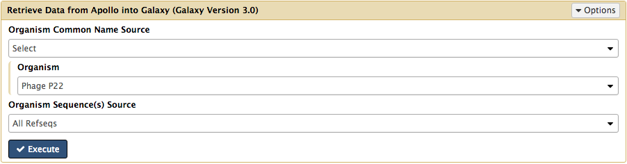
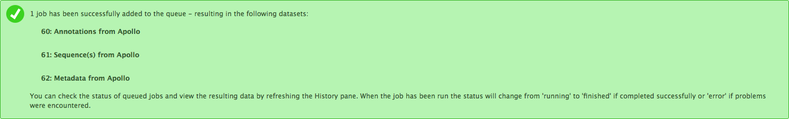
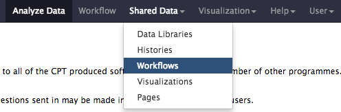
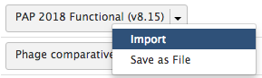
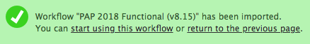
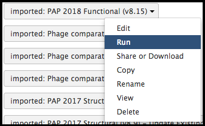
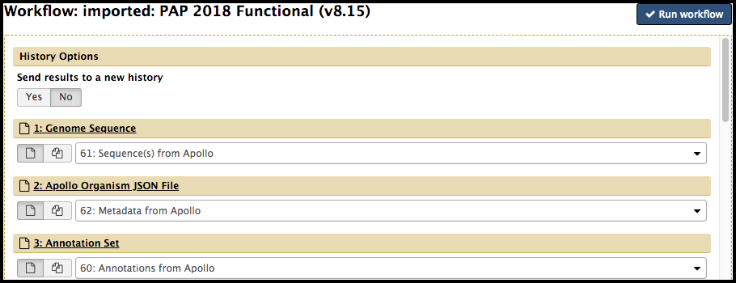

# Functional Annotation Workflow

This tutorial is used to run analyses for gene function prediction after the genome [structural annotation]({{ site.baseurl }}//topics/genome-annotation/tutorials/structural-annotation-workflow/tutorial.html) has been completed.

> ### Agenda
>
> 1. Workflow
> 2. Completion
>
{: .agenda}

# Workflow

To begin the analyses in Galaxy, the genome data must be retrieved from its Apollo record. Start by accessing Galaxy ([CPT Public Galaxy](https://cpt.tamu.edu/galaxy-pub), [CPT TAMU Galaxy](https://cpt.tamu.edu/galaxy/)). It is recommended to create and name a new history. Once in the appropriate history, navigate to the [Retrieve Data tool](https://cpt.tamu.edu/galaxy/root?tool_id=edu.tamu.cpt2.webapollo.export) using the search bar at the top of the Tool panel on the left. Open the tool by clicking on the hyperlink of the same name underneath CPT: Get Data, and the parameters to adjust will load in the center pane. 

Using the *Organism* drop-down menu, select the name of your phage, then click “Execute.” A message in a green box will appear when the retrieval has begun. Note that the following steps can be started as soon as the retrieval datasets appear in the history list (even before they turn green). 

Next, these data will serve as the input for the functional annotation workflow. To import this workflow, click on the “Shared Data” drop-down list and select “Workflows”.

The next page will list all the public and shared workflows developed at the CPT. The Phage Annotation Pipeline (PAP) workflows are available here. Look for the most recent Functional Annotation Workflow version labelled with the year and a version number, “PAP 201# Functional (v #.#)”. Click on the drop-down menu arrow for that most recent functional workflow, and select “Import”.

> ###  Note that…
> The screenshots displayed here may not precisely reflect what you see on your screen. As these are regularly updated, it is likely that the current version year or number is different. Just look for the most recent one.
{: .tip}

A successfully imported workflow will result in a message in a green box where you can click on the 'start using this workflow link'.

Alternatively, click on the Workflows menu item at the top of the center panel of Galaxy. In this list will be all the workflows that can run from this Galaxy account. Find the functional workflow that has just been imported, click on the drop-down menu, and select “Run". 

In the center pane, adjust the parameters to run the functional annotation workflow. Specifically, ensure that datasets are associated with their correct phage counterpart.
> 1. Genome Sequence should contain the “#. Sequence(s) from Apollo” dataset (where # varies dependent on their place in the current History).
> 2. Apollo Organism JSON File should contain the “#. Metadata from Apollo” dataset (where # varies dependent on their place in the current History).
> 3. Annotation Set should contain the “#. Annotation from Apollo” dataset (where # varies dependent on their place in the current History).

When the proper parameters have been set, select “Run workflow” at the top or bottom of the page. A message in a green box will appear, indicating a successful invocation of the functional annotation workflow.

This workflow includes multiple computationally-intensive steps. With high server load, it may take up to **several days** for the workflow to complete, as the workflow is executing a large number of analyses on the behalf of the user:

> * BLAST against numerous databases
> * InterProScan
> * phage spannin search tools
> * various other analyses

> ###  Note that…
> Check back on this workflow periodically; if any of the queued jobs have failed (the datasets in the History column have turned red), click on the dataset. Report a bug by clicking on the bug icon.
>
>
>
> Some individual jobs (e.g. BLAST and InterProScan) may remain yellow (“running”) for many hours.
{: .tip}

# Completion

Once all the datasets and tools have completed, then functional annotation within Apollo may begin. How to use the evidence to predict gene function is beyond the scope of this tutorial and is touched on in the [Annotation in Apollo tutorial]({{ site.baseurl }}//topics/genome-annotation/tutorials/annotation-in-apollo/tutorial.html). General Apollo function help can be found in [tutorial 1]({{ site.baseurl }}//topics/genome-annotation/tutorials/getting-started-with-apollo/tutorial.html) and [tutorial 2]({{ site.baseurl }}//topics/genome-annotation/tutorials/annotation-in-apollo/tutorial.html).