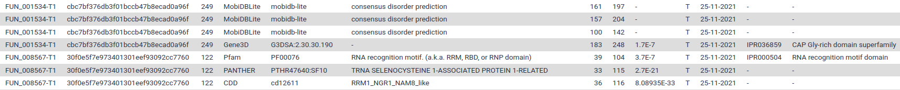


  

  `protein sequences` (output of **Funannotate predict annotation** )"


# Functional annotation

## **EggNOG Mapper**

**EggNOG Mapper** compares each protein sequence of the annotation to a huge set of ortholog groups from the [EggNOG database](http://eggnog5.embl.de). In this database, each ortholog group is associated with functional annotation like [Gene Ontology (GO)](http://www.geneontology.org/) terms or [KEGG pathways](https://www.genome.jp/kegg/pathway.html). When the protein sequence of a new gene is found to be very similar to one of these ortholog groups, the corresponding functional annotation is transfered to this new gene.

> <hands-on-title>Hands-on</hands-on-title>
>
> 1.  with the following parameters:
>    -  *"Fasta sequences to annotate"*: {{ input_dataset }}
>    - *"Version of eggNOG Database"*: select the latest version available
>    - In *"Output Options"*:
>        - *"Exclude header lines and stats from output files"*: `No`
>
{: .hands_on}

The output of this tool is a tabular file, where each line represents a gene from our annotation, with the functional annotation that was found by EggNOG-mapper. It includes a predicted protein name, GO terms, EC numbers, KEGG identifiers, ...

Display the file and explore which kind of identifiers were found by EggNOG Mapper.

## **InterProScan**

[InterPro](https://www.ebi.ac.uk/interpro/) is a huge integrated database of protein families. Each family is characterized by one or muliple signatures (i.e. sequence motifs) that are specific to the protein family, and corresponding functional annotation like protein names or [Gene Ontology (GO)](http://www.geneontology.org/). A good proportion of the signatures are manually curated, which means they are of very good quality.

**InterProScan** is a tool that analyses each protein sequence from our annotation to determine if they contain one or several of the signatures from InterPro. When a protein contains a known signature, the corresponding functional annotation will be assigned to it by **InterProScan**.

**InterProScan** itself runs multiple applications to search for the signatures in the protein sequences. It is possible to select exactly which ones we want to use when launching the analysis (by default all will be run).

> <hands-on-title>Hands-on</hands-on-title>
>
> 1.  with the following parameters:
>    -  *"Protein FASTA File"*: {{ input_dataset }}
>    - *"InterProScan database"*: select the latest version available
>    - *"Use applications with restricted license, only for non-commercial use?"*: `Yes` (set it to `No` if you run InterProScan for commercial use)
>    - *"Output format"*: `Tab-separated values format (TSV)` and `XML`
>
{: .hands_on}

> <comment-title></comment-title>
>
> To speed up the processing by InterProScan during this tutorial, you can disable `Pfam` and `PANTHER` applications. When analysing real data, it is adviced to keep them enabled.
>
> When some applications are disabled, you will of course miss the corresponding results in the output of **InterProScan**.
{: .comment}

The output of this tool is both a tabular file and an XML file. Both contain the same information, but the tabular one is more readable for a Human: each line represents a gene from our annotation, with the different domains and motifs that were found by InterProScan.

If you display the TSV file you should see something like this:

Each line correspond to a motif found in one of the annotated proteins. The most interesting columns are:

- Column 1: the protein identifier
- Column 5: the identifier of the signature that was found in the protein sequence
- Column 4: the databank where this signature comes from (InterProScan regroups several motifs databanks)
- Column 6: the human readable description of the motif
- Columns 7 and 8: the position where the motif was found
- Column 9: a score for the match (if available)
- Column 12 and 13: identifier of the signature integrated in InterPro (if available). Have a look an example webpage for [IPR036859](https://www.ebi.ac.uk/interpro/entry/InterPro/IPR036859/) on InterPro.
- The following columns contains various identifiers that were assigned to the protein based on the match with the signature (Gene ontology term, Reactome, ...)

The XML output file contains the same information in a computer-friendly format, we will use it in the next step.
