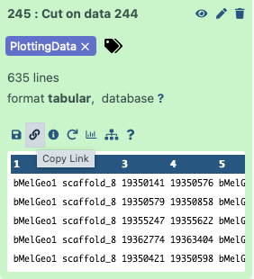

# Introduction

Despite the rapidly increasing number of fully assembled genomes few genomes are well annotated. This is especially true for large eukaryotic genomes with their complex gene structure and abundance of pseudogenes. And of course do not forget about the [Murthy's law](https://en.wikipedia.org/wiki/Murphy%27s_law): if you are interested in a particular gene the chances are that it will not be annotated in your genome of interest. In this tutorial we will demonstrate how to compare gene structures across a set of vertebrate genomes. So ...

> > <code-in-title>What I have</code-in-title>
> > - I know the gene's name
> > - I know which species I'm interested in
> > - I know where to find genomes of these species
> {: .code-in}
>
> > <code-out-title>What I want</code-out-title>
> > - I work with a gene _X_
> > - I would like to compare the structure of gene _X_ across _N_ genomes
> {: .code-out}
>
{: .code-2col}

> <tip-title>What I will get</tip-title>
> - Interactive graphs showing location of the gene across your species of choice. These will allow you to see the absence/presence of the genes across genomes, to detect potential duplications, predogenization events, re-arrangements etc.
> - Phylogenetic trees for individual exons of the gene. The trees will give you an idea of potential unusual evolutionary dynamics for the gene.
{: .tip}

> <agenda-title></agenda-title>
>
> In this tutorial, we will deal with:
>
> 1. TOC
> {:toc}
>
{: .agenda}


# Logic

The analysis follow the following logic (also see the following figure):

1. Pick a gene and select genomes to analyze
1. Get amino acid translations for all exons of my gene of interest
1. Identify genomes of interest
1. Extract amino acid sequences and genome coordinates for all possible open reading frames (ORFs) from all genomes in my set

    The following steps 5, 6, and 7 are performed using a single Galaxy workflow (grey area in the following figure).

1. Align - Find matches between exons of the gene of interest and ORFs
1. Intersect - Compute genome coordinates of matches
1. Build phylogenetic trees for individual exons

    The final step is performed using Jupyter notebook

1. Create a comparative plot showing distribution of matches across genomes of interest


------

# Example history

This [example history](https://usegalaxy.org/u/cartman/h/genecomparisonxbp1) contains results of the analysis described in this tutorial. 



You can use this history to understand the input datasets as well as outputs of the entire analysis. The key items in the history are labelled with <kbd>tags</kbd>:

> <code-in-title>dataset in the example history</code-in-title>
> - <kbd>EXONS</kbd> - amino acid translation of exons of the gene of interest (*XBP-1*)
> - <kbd>ORF_BED</kbd> - coordinates of predicted ORFs in the genomes of interest
> - <kbd>DiamondDB</kbd> - database and amino acid translations of predicted ORFs in the genomes of interest
{: .code-in}

> <code-out-title>in the sample history</code-out-title>
> - <kbd>PlottingData</kbd> - summary necessary for plotting comparative genome graphs
> - <kbd>Trees</kbd> - phylogenetic trees for each exon 
{: .code-out}

> <warning-title>A suggestion!</warning-title>
> Importing and looking around this history is very helpful for understanding how this analysis works!
{: .warning}

-------

# Practice

## Step 1: Pick a gene and select genomes to analyze

In this example we will compare structure of X-box protein 1 gene (*XBP-1*) across a set of five vertebrate genomes sequenced by [VGP](https://vertebrategenomesproject.org/) consortium ().

## Step 2: Get amino acid translations for all exons of my gene of interest

This step is manual and is performed outside Galaxy.

The best annotated vertebrate is ... human. To obtain amino acid translation of individual exons of *XBP-1* you can use [UCSC Genome browser](https://genome.ucsc.edu/cgi-bin/hgTracks?db=hg38&lastVirtModeType=default&lastVirtModeExtraState=&virtModeType=default&virtMode=0&nonVirtPosition=&position=chr22%3A28794555%2D28800597&hgsid=1433476153_N1Iet0RvAaPQIpPuVl2qbi74BrC3). The "UCSC annotations of RefSeq RNAs (NM_\* and NR_\*)" track shows two alternative transcripts produced by *XBP-1* : spliced and unspliced (here 'spliced' and 'unspliced' do not refer to the "normal' splicing process. To learn more about this fascinating gene read here).  


Clicking on the names of the transcripts open a UCSC page specific to that transcript. From there you can obtain genomic sequences corresponding to all exons. You can then translate these sequences using any available online tool (e.g., [NCBI ORFinder](https://www.ncbi.nlm.nih.gov/orffinder/)). 

In this particular case we did not create translation of all exons. Instead, we created translation of exon 1  and two terminal exons. The first exon is shared between the two transcripts. It will allow us to anchor the beginning of the gene. The two terminal exons are different between the two transcripts. Because of this we create two alternative translation per exon: `s-p2` and `s-p12` for the spliced version and `u-p1` and `u-p2` for unspliced transcript. A FASTA file containing all translation is shown below:

```
>xbp-1u-p1
GNEVRPVAGSAESAALRLRAPLQQVQAQLSPLQNISPWILAVLTLQIQ
>xbp-1u-p2
LISCWAFWTTWTQSCSSNALPQSLPAWRSSQRSTQKDPVPYQPPFLCQWG
RHQPSWKPLMN
>xbp-1s-p12
GNEVRPVAGSAESAAGAGPVVTPPEHLPMDSGGIDSSDSE
>xbp-1s-p3
SDILLGILDNLDPVMFFKCPSPEPASLEELPEVYPEGPSSLPASLSLSVG
TSSAKLEAINELIRFDHIYTKPLVLEIPSETESQANVVVKIEEAPLSPSE
NDHPEFIVSVKEEPVEDDLVPELGISNLLSSSHCPKPSSCLLDAYSDCGY
GGSLSPFSDMSSLLGVNHSWEDTFANELFPQLISV
>xbp1_ex1
MVVVAAAPNPADGTPKVLLLSGQPASAAGAPAGQALPLMVPAQRGASPEA
ASGGLPQARKRQRLTHLSPEEKALR
```

## Step 3: Identify and upload genomes of interest

This tutorial has been initially designed for the analysis of data produced by the Vertebrate Genome Consortium [VGP](https://vertebrategenomesproject.org/). However, it is equally suitable for any genomic sequences (including prokaryotic ones).

In this section we first show how to upload sample datasets. These datasets were intentionally made small. All subsequent steps of this tutorial are performed using these sample data. We then demonstrate how to upload full size genomes from the VGP data repository called [GenomeArk](https://vgp.github.io/genomeark/).

### Uploading sample data

> <hands-on-title>Sample Data upload</hands-on-title>
>
> - Create a new history for this tutorial
> - Import the files from [Zenodo]({{ page.zenodo_link }}) using the following URLs:
>
>   ```
>   https://zenodo.org/record/7034885/files/aGasCar1.fa
>   https://zenodo.org/record/7034885/files/bTaeGut2.fa
>   https://zenodo.org/record/7034885/files/fScoJap1.fa
>   https://zenodo.org/record/7034885/files/mCynVol1.fa
>   https://zenodo.org/record/7034885/files/mHomSapT2T.fa
>   ```
>   
>
{: .hands_on}

These correspond to fragments of genomes from:

 - `aGasCar1` - _Gastrophryne carolinensis_ (Eastern narrow-mouth toad)
 - `bTaeGut` - _Taeniopygia guttata_ (Zebra finch)
 - `fScoJap` - _Scomber japonicus_ (Chub mackerel)
 - `mCynVol` - _Cynocephalus volans_ (Philippine flying lemur)
 - `mHomSap` - _Homo sapiens_ (Human)

### Uploading VGP data from GenomeArk

Galaxy provides a direct connection to [GenomeArk](https://vgp.github.io/genomeark/) from its "Upload Data" tool. To access GenomeArk data you need to:

> <hands-on-title>Upload VGP data from GenomeArk</hands-on-title>
>
> - Create a new history for this tutorial
> - Import genome assembly FASTA files from GenomeArk:
>
>    - Open the file  __Upload Data__ menu
>    - Click on __Choose remote files__ button at the bottom of the Upload interface
>    - Choose __Genome Ark__
>    - Pick assembles you would like to include in your analysis (use Search box on top)
>
>
> Generally for a given species you want the assembly with the highest version number. For example, Human (_Homo sapiens_) had three assemblies at the time of writing: `mHomSap1`, `mHomSap2`, and `mHomSap3`. Pick `mHomSap3` in this situation. 
>
> Inside each assembly folder you will see typically see different sub-folders. The one you should generally be interested in will be called `assembly_curated`. Inside that folder you will typically see separate assemblies for maternal (indicated with `mat`) and paternal (indicated with `pat`) haplotypes. In the analyses here we are choosing as assembly representing heterogametic haplotype (`pat` in the case of Human).
>
> - Repeat this process for all assemblies you are interested in.
>
{: .hands_on}

### Combine uploaded sequences into a dataset collection

After uploading data from GenomeArk you will end up with a number of FASTA datasets in your history. To proceed with the analysis you will need to combine these into a single dataset collection:

> <hands-on-title>Combine genome assemblies into a dataset collection</hands-on-title>
>
> To create a collection from genome assemblies you just uploaded into GenomeArk follow the steps in the video below. Obviously, you only want to click check-boxes next to FASTA files (assemblies) you want to include and leave everything else out.
>
> 
>
{: .hands_on}

## Step 4: Extract amino acid sequences and genome coordinates for all ORFs

### Extract ORFs from genomic sequences

Now we can go ahead and find all ORFs in all genome assemblies we have bundled into a collection. For this we will use tool called [ORFiPy](https://github.com/urmi-21/orfipy):

> <hands-on-title>Find ORFs witrh ORFiPy</hands-on-title>
>
> Run  with the following parameters:
>    -  *"Find ORFs in"*: The collection containing genome assemblies we just created (click "Dataset collection"  button on left-side of this input field)
>    - *"Select options"*: check the box next to `BED` and `Peptides`
>    - *"Minimum length of ORFs"*: type the number `99`. We do not want ORFs to be too short as their number will be too high
>    - *"Output ORFs bound by Stop codons?"*: set this option to `Yes`. 
>
{: .hands_on}

Because this operation is performed on a dataset collection. it will produce a dataset collection as an output. Actually, it will produce two because we selected `BED` and `Peptides` options. One collection will contain amino acid sequences for all ORFs (it will typically be called `ORFs on collection ... (FASTA format)`) and another their coordinates (called `ORFs on collection ... (BED format)`)
)

This will produce two new dataset collections in your history: one containing coordinates of ORFs and the other containing their amino acid translations. Because genomes are large these will likely be tens of millions of ORFs identified this way.

### Creating __Diamond__ database

Because we will be using the [Diamond](https://github.com/bbuchfink/diamond) tool to find matches between our gene of interest and ORF translations we need to convert FASTA files into Diamond database using __Diamond makedb__ tool:

> <hands-on-title>Create Diamond database</hands-on-title>
>
> Run  on the collection containing amino acid translations of ORFs generated using __ORFiPy__:
>    -  "Input reference file in FASTA format"*: Select collections containing amino acid (FASTA Protein) output of __ORFiPy__ 
>
{: .hands_on}

At this point we have three input datasets that would allow us to find and visualize matches between the gene of interest and genome asseblies:

1. Diamond database of ORF translations from genome assemblies
2. Coordinates and frame information about ORFs in BED format
3. Amino acid translation of exons from the gene of interest

## Steps 5, 6, and 7: Finding matches and building trees

To find location of genes, [we will use the following workflow]() that is available as a part of this tutorial. To use this workflow you need to import it into your Galaxy instance.


The workflow takes three inputs: 

> <code-in-title>Workflow inputs</code-in-title>
>
> 1. <kbd>EXONS</kbd> - Amino acid translation of exons from the gene of interest ([Step 2](#step-2-get-amino-acid-translations-for-all-exons-of-my-gene-of-interest) of this tutorial)
> 1. <kbd>DiamondDB</kbd> - Diamond database of ORF translations from genome assemblies ([Step 4](#step-4-extract-amino-acid-sequences-and-genome-coordinates-for-all-orfs) of this tutorial)
> 1. <kbd>ORF BED</kbd> - Coordinates and frame information about ORFs in BED format ([Step 4](#step-4-extract-amino-acid-sequences-and-genome-coordinates-for-all-orfs)  of this tutorial)
>
{: .code-in}

It produces two primary outputs:

> <code-out-title>Results</code-out-title>
>
> 1. <kbd>Trees</kbd> - Phylogenetic trees for each input exon as [Newick](https://en.wikipedia.org/wiki/Newick_format) file
> 1. <kbd>PlottingData</kbd> - A summary table of exon matches for each genome
>
{: .code-out}

The overall logic of the workflow is as follows:

1. Perform [__Diamond__](https://github.com/bbuchfink/diamond) search to identify matches between the gene of interest (<kbd>EXONS</kbd>) and ORF sets from each genomes (<kbd>DiamondDB</kbd>).
2. Intersect information about the matches with BED file containing ORF coordinates (<kbd>ORF BED</kbd>). This allows us to know genomic position of the ORFs and their frames (1, 2, 3 or -1, -2, -3).
3. Extract matching parts of the sequences and generated multiple alignments using [__MAFFT__](https://mafft.cbrc.jp/alignment/software/). This is done for each amino acid sequence in <kbd>EXONS</kbd>. Thus in the case of *XBP-1* there will be five sets of alignments. 
4. Build phylogenetic tree for each alignment produced in the previous step using the [Neighbor Joining method](https://en.wikipedia.org/wiki/Neighbor_joining) - a simple and quick way to obtain a rough phylogeny.
5. Use information from step 1 to compute genome coordinates of matches. This is done by combining the information about genomic positions of ORFs from the <kbd>ORF BED</kbd> file and local alignment information generated during step 1.

## Step 7: Looking at the trees

After running the workflow phylogenetic trees will be saved into a collection named `Join neighbors on ...`. This collection will also be labelled with tag <kbd>Trees</kbd>. To visualize the trees:

> <hands-on-title>Visualize the trees</hands-on-title>
>
> - Expand the collection by clicking on it
> - Click on any dataset
> - Click the  icon:
>     
> - A selection of tree visualization tools will appear in the center pane of the interface
> - Select `Phylogenetic Tre Visualization` and play with it:
>     
{: .hands_on}

## Step 8: Generating and interpreting the comparative genome graph

Another workflow output will represent a single file summarizing genomic location of matches between each of the genomes in our dataset and amino acid translation of exons from the gene of interest. It will be called `Mapping report` and will have tag <kbd>PlottingData</kbd> associated with it. To plot the data contained in this file we will use external Jupyter notebook (note that Jupyter can be run directly from Galaxy, but to make this tutorial runnable on any Galaxy instance we will use an internal notebook server). 

### Starting notebook




<div class="UseGalaxyorg" markdown="1">

The notebook can be accessed [from here](https://colab.research.google.com/drive/1smTpRejBb7c02LiIxMPNVDjOucLAsD81?usp=sharing). You do need to have a Google Account to be able to use the notebook.

</div>
<div class="Galaxy-Europe-Australia-and-Others" markdown="1">


{{ site.url }}{{ site.baseurl }}/{{ page.path | replace: "tutorial.md", "gene_image.ipynb" }}

1. Once the notebook has started, open a Terminal in Jupyter **File → New → Terminal**

2. Run the following command:

   ```
   wget {{ ipynbpath }}
   ```

3. Switch to the Notebook that appears in the list of files on the left

</div>


### Proving data

The data is provided to the notebook by setting the `dataset_url` parameter in this cell:

```python
# Paste link to the dataset here
dataset_url = 'https://usegalaxy.org/api/datasets/f9cad7b01a472135a8abd43f91f8d3cf/display?to_ext=tabular'
```

This is a URL pointing to one of the workflow outputs: `Mapping report` with the <kbd>PlottingData</kbd> tag. To copy the URL click on the  icon adjacent to the dataset:



Running the notebook will generate two graphs explained in the next section.

### Interpreting the graphs

Analysis of sample data associated with this tutorial will produce the genome graph shown below. In this graph the Y-axis represents ORFs on positive (1, 2, 3 in red color) and negative (-1, -2, -3 in blue color) strands. The X-axis is genomic coordinates.  Boxes represent matches between amino acid sequences of exons and ORFs they are superimposed to. The color of boxes reflect the extent of amino acid identity. The color key is shown in the left upper corner of the plot. The image is interactive so you can zoom in and out.

<html>
<head>
  <script src="https://cdn.jsdelivr.net/npm/vega@5.22.1"></script>
  <script src="https://cdn.jsdelivr.net/npm/vega-lite@5.2.0"></script>
  <script src="https://cdn.jsdelivr.net/npm/vega-embed@6.20.8"></script>
</head>
<body>
  <div id="vis"/>
  <script>
    const spec = {
  "config": {
    "view": {"continuousWidth": 400, "continuousHeight": 300},
    "title": {"anchor": "start", "fontSize": 10}
  },
  "vconcat": [
    {
      "layer": [
        {
          "mark": {"type": "rule", "strokeWidth": 2},
          "encoding": {
            "color": {
              "condition": {
                "value": "blue",
                "test": "(datum['strand'] === '-')"
              },
              "value": "red"
            },
            "tooltip": [
              {"field": "orf", "title": "ORF id", "type": "nominal"},
              {"field": "genome", "title": "Genome", "type": "nominal"},
              {"field": "chr", "title": "Chromosome", "type": "nominal"},
              {"field": "id", "title": "% identity", "type": "nominal"}
            ],
            "x": {
              "field": "start",
              "scale": {"domain": [52, 10726]},
              "title": null,
              "type": "quantitative"
            },
            "x2": {"field": "end"},
            "y": {"field": "frame", "title": null, "type": "nominal"}
          },
          "selection": {
            "selector001": {
              "type": "interval",
              "bind": "scales",
              "encodings": ["x", "y"]
            }
          },
          "title": "aGasCar1.fascaffold_1"
        },
        {
          "mark": {"type": "point", "shape": "arrow", "strokeWidth": 2},
          "encoding": {
            "angle": {
              "condition": {"value": 270, "test": "(datum['strand'] === '-')"},
              "value": 90
            },
            "color": {
              "condition": {
                "value": "blue",
                "test": "(datum['strand'] === '-')"
              },
              "value": "red"
            },
            "tooltip": [
              {"field": "orf", "title": "ORF id", "type": "nominal"},
              {"field": "genome", "title": "Genome", "type": "nominal"},
              {"field": "chr", "title": "Chromosome", "type": "nominal"},
              {"field": "id", "title": "% identity", "type": "nominal"}
            ],
            "x": {"field": "start", "type": "quantitative"},
            "x2": {"field": "end"},
            "y": {"field": "frame", "title": null, "type": "nominal"}
          },
          "title": "aGasCar1.fascaffold_1"
        },
        {
          "mark": {"type": "point", "shape": "arrow", "strokeWidth": 2},
          "encoding": {
            "angle": {
              "condition": {"value": 270, "test": "(datum['strand'] === '-')"},
              "value": 90
            },
            "color": {
              "condition": {
                "value": "blue",
                "test": "(datum['strand'] === '-')"
              },
              "value": "red"
            },
            "tooltip": [
              {"field": "orf", "title": "ORF id", "type": "nominal"},
              {"field": "genome", "title": "Genome", "type": "nominal"},
              {"field": "chr", "title": "Chromosome", "type": "nominal"},
              {"field": "id", "title": "% identity", "type": "nominal"}
            ],
            "x": {"field": "end", "type": "quantitative"},
            "x2": {"field": "end"},
            "y": {"field": "frame", "title": null, "type": "nominal"}
          },
          "title": "aGasCar1.fascaffold_1"
        },
        {
          "mark": {"type": "rule", "opacity": 0.9, "strokeWidth": 10},
          "encoding": {
            "color": {
              "field": "id",
              "scale": {"scheme": "blueorange"},
              "type": "quantitative"
            },
            "tooltip": [
              {"field": "orf", "title": "ORF id", "type": "nominal"},
              {"field": "genome", "title": "Genome", "type": "nominal"},
              {"field": "chr", "title": "Chromosome", "type": "nominal"},
              {"field": "id", "title": "% identity", "type": "nominal"}
            ],
            "x": {"field": "matchStart", "type": "quantitative"},
            "x2": {"field": "matchEnd"},
            "y": {"field": "frame", "title": null, "type": "nominal"}
          },
          "title": "aGasCar1.fascaffold_1"
        },
        {
          "mark": {"type": "text", "yOffset": -10},
          "encoding": {
            "color": {"value": "black"},
            "text": {"field": "exon", "type": "nominal"},
            "tooltip": [
              {"field": "orf", "title": "ORF id", "type": "nominal"},
              {"field": "genome", "title": "Genome", "type": "nominal"},
              {"field": "chr", "title": "Chromosome", "type": "nominal"},
              {"field": "id", "title": "% identity", "type": "nominal"}
            ],
            "x": {"field": "midpoint", "type": "quantitative"},
            "x2": {"field": "end"},
            "y": {"field": "frame", "title": null, "type": "nominal"}
          },
          "title": "aGasCar1.fascaffold_1"
        }
      ],
      "data": {"name": "data-4c922bb95694b1514f353a1acd2ab409"},
      "height": 100,
      "width": 800
    },
    {
      "layer": [
        {
          "mark": {"type": "rule", "strokeWidth": 2},
          "encoding": {
            "color": {
              "condition": {
                "value": "blue",
                "test": "(datum['strand'] === '-')"
              },
              "value": "red"
            },
            "tooltip": [
              {"field": "orf", "title": "ORF id", "type": "nominal"},
              {"field": "genome", "title": "Genome", "type": "nominal"},
              {"field": "chr", "title": "Chromosome", "type": "nominal"},
              {"field": "id", "title": "% identity", "type": "nominal"}
            ],
            "x": {
              "field": "start",
              "scale": {"domain": [-228, 3860]},
              "title": null,
              "type": "quantitative"
            },
            "x2": {"field": "end"},
            "y": {"field": "frame", "title": null, "type": "nominal"}
          },
          "selection": {
            "selector002": {
              "type": "interval",
              "bind": "scales",
              "encodings": ["x", "y"]
            }
          },
          "title": "bTaeGut2.fascaffold_18"
        },
        {
          "mark": {"type": "point", "shape": "arrow", "strokeWidth": 2},
          "encoding": {
            "angle": {
              "condition": {"value": 270, "test": "(datum['strand'] === '-')"},
              "value": 90
            },
            "color": {
              "condition": {
                "value": "blue",
                "test": "(datum['strand'] === '-')"
              },
              "value": "red"
            },
            "tooltip": [
              {"field": "orf", "title": "ORF id", "type": "nominal"},
              {"field": "genome", "title": "Genome", "type": "nominal"},
              {"field": "chr", "title": "Chromosome", "type": "nominal"},
              {"field": "id", "title": "% identity", "type": "nominal"}
            ],
            "x": {"field": "start", "type": "quantitative"},
            "x2": {"field": "end"},
            "y": {"field": "frame", "title": null, "type": "nominal"}
          },
          "title": "bTaeGut2.fascaffold_18"
        },
        {
          "mark": {"type": "point", "shape": "arrow", "strokeWidth": 2},
          "encoding": {
            "angle": {
              "condition": {"value": 270, "test": "(datum['strand'] === '-')"},
              "value": 90
            },
            "color": {
              "condition": {
                "value": "blue",
                "test": "(datum['strand'] === '-')"
              },
              "value": "red"
            },
            "tooltip": [
              {"field": "orf", "title": "ORF id", "type": "nominal"},
              {"field": "genome", "title": "Genome", "type": "nominal"},
              {"field": "chr", "title": "Chromosome", "type": "nominal"},
              {"field": "id", "title": "% identity", "type": "nominal"}
            ],
            "x": {"field": "end", "type": "quantitative"},
            "x2": {"field": "end"},
            "y": {"field": "frame", "title": null, "type": "nominal"}
          },
          "title": "bTaeGut2.fascaffold_18"
        },
        {
          "mark": {"type": "rule", "opacity": 0.9, "strokeWidth": 10},
          "encoding": {
            "color": {
              "field": "id",
              "scale": {"scheme": "blueorange"},
              "type": "quantitative"
            },
            "tooltip": [
              {"field": "orf", "title": "ORF id", "type": "nominal"},
              {"field": "genome", "title": "Genome", "type": "nominal"},
              {"field": "chr", "title": "Chromosome", "type": "nominal"},
              {"field": "id", "title": "% identity", "type": "nominal"}
            ],
            "x": {"field": "matchStart", "type": "quantitative"},
            "x2": {"field": "matchEnd"},
            "y": {"field": "frame", "title": null, "type": "nominal"}
          },
          "title": "bTaeGut2.fascaffold_18"
        },
        {
          "mark": {"type": "text", "yOffset": -10},
          "encoding": {
            "color": {"value": "black"},
            "text": {"field": "exon", "type": "nominal"},
            "tooltip": [
              {"field": "orf", "title": "ORF id", "type": "nominal"},
              {"field": "genome", "title": "Genome", "type": "nominal"},
              {"field": "chr", "title": "Chromosome", "type": "nominal"},
              {"field": "id", "title": "% identity", "type": "nominal"}
            ],
            "x": {"field": "midpoint", "type": "quantitative"},
            "x2": {"field": "end"},
            "y": {"field": "frame", "title": null, "type": "nominal"}
          },
          "title": "bTaeGut2.fascaffold_18"
        }
      ],
      "data": {"name": "data-cd3fa6c014d625fc2f85cfeb0119b9e0"},
      "height": 100,
      "width": 800
    },
    {
      "layer": [
        {
          "mark": {"type": "rule", "strokeWidth": 2},
          "encoding": {
            "color": {
              "condition": {
                "value": "blue",
                "test": "(datum['strand'] === '-')"
              },
              "value": "red"
            },
            "tooltip": [
              {"field": "orf", "title": "ORF id", "type": "nominal"},
              {"field": "genome", "title": "Genome", "type": "nominal"},
              {"field": "chr", "title": "Chromosome", "type": "nominal"},
              {"field": "id", "title": "% identity", "type": "nominal"}
            ],
            "x": {
              "field": "start",
              "scale": {"domain": [314, 3976]},
              "title": null,
              "type": "quantitative"
            },
            "x2": {"field": "end"},
            "y": {"field": "frame", "title": null, "type": "nominal"}
          },
          "selection": {
            "selector003": {
              "type": "interval",
              "bind": "scales",
              "encodings": ["x", "y"]
            }
          },
          "title": "fScoJap1.fascaffold_13"
        },
        {
          "mark": {"type": "point", "shape": "arrow", "strokeWidth": 2},
          "encoding": {
            "angle": {
              "condition": {"value": 270, "test": "(datum['strand'] === '-')"},
              "value": 90
            },
            "color": {
              "condition": {
                "value": "blue",
                "test": "(datum['strand'] === '-')"
              },
              "value": "red"
            },
            "tooltip": [
              {"field": "orf", "title": "ORF id", "type": "nominal"},
              {"field": "genome", "title": "Genome", "type": "nominal"},
              {"field": "chr", "title": "Chromosome", "type": "nominal"},
              {"field": "id", "title": "% identity", "type": "nominal"}
            ],
            "x": {"field": "start", "type": "quantitative"},
            "x2": {"field": "end"},
            "y": {"field": "frame", "title": null, "type": "nominal"}
          },
          "title": "fScoJap1.fascaffold_13"
        },
        {
          "mark": {"type": "point", "shape": "arrow", "strokeWidth": 2},
          "encoding": {
            "angle": {
              "condition": {"value": 270, "test": "(datum['strand'] === '-')"},
              "value": 90
            },
            "color": {
              "condition": {
                "value": "blue",
                "test": "(datum['strand'] === '-')"
              },
              "value": "red"
            },
            "tooltip": [
              {"field": "orf", "title": "ORF id", "type": "nominal"},
              {"field": "genome", "title": "Genome", "type": "nominal"},
              {"field": "chr", "title": "Chromosome", "type": "nominal"},
              {"field": "id", "title": "% identity", "type": "nominal"}
            ],
            "x": {"field": "end", "type": "quantitative"},
            "x2": {"field": "end"},
            "y": {"field": "frame", "title": null, "type": "nominal"}
          },
          "title": "fScoJap1.fascaffold_13"
        },
        {
          "mark": {"type": "rule", "opacity": 0.9, "strokeWidth": 10},
          "encoding": {
            "color": {
              "field": "id",
              "scale": {"scheme": "blueorange"},
              "type": "quantitative"
            },
            "tooltip": [
              {"field": "orf", "title": "ORF id", "type": "nominal"},
              {"field": "genome", "title": "Genome", "type": "nominal"},
              {"field": "chr", "title": "Chromosome", "type": "nominal"},
              {"field": "id", "title": "% identity", "type": "nominal"}
            ],
            "x": {"field": "matchStart", "type": "quantitative"},
            "x2": {"field": "matchEnd"},
            "y": {"field": "frame", "title": null, "type": "nominal"}
          },
          "title": "fScoJap1.fascaffold_13"
        },
        {
          "mark": {"type": "text", "yOffset": -10},
          "encoding": {
            "color": {"value": "black"},
            "text": {"field": "exon", "type": "nominal"},
            "tooltip": [
              {"field": "orf", "title": "ORF id", "type": "nominal"},
              {"field": "genome", "title": "Genome", "type": "nominal"},
              {"field": "chr", "title": "Chromosome", "type": "nominal"},
              {"field": "id", "title": "% identity", "type": "nominal"}
            ],
            "x": {"field": "midpoint", "type": "quantitative"},
            "x2": {"field": "end"},
            "y": {"field": "frame", "title": null, "type": "nominal"}
          },
          "title": "fScoJap1.fascaffold_13"
        }
      ],
      "data": {"name": "data-33f25281b1f78907be251e80305165ce"},
      "height": 100,
      "width": 800
    },
    {
      "layer": [
        {
          "mark": {"type": "rule", "strokeWidth": 2},
          "encoding": {
            "color": {
              "condition": {
                "value": "blue",
                "test": "(datum['strand'] === '-')"
              },
              "value": "red"
            },
            "tooltip": [
              {"field": "orf", "title": "ORF id", "type": "nominal"},
              {"field": "genome", "title": "Genome", "type": "nominal"},
              {"field": "chr", "title": "Chromosome", "type": "nominal"},
              {"field": "id", "title": "% identity", "type": "nominal"}
            ],
            "x": {
              "field": "start",
              "scale": {"domain": [-71, 6632]},
              "title": null,
              "type": "quantitative"
            },
            "x2": {"field": "end"},
            "y": {"field": "frame", "title": null, "type": "nominal"}
          },
          "selection": {
            "selector004": {
              "type": "interval",
              "bind": "scales",
              "encodings": ["x", "y"]
            }
          },
          "title": "mHomSapT2T.fachr22"
        },
        {
          "mark": {"type": "point", "shape": "arrow", "strokeWidth": 2},
          "encoding": {
            "angle": {
              "condition": {"value": 270, "test": "(datum['strand'] === '-')"},
              "value": 90
            },
            "color": {
              "condition": {
                "value": "blue",
                "test": "(datum['strand'] === '-')"
              },
              "value": "red"
            },
            "tooltip": [
              {"field": "orf", "title": "ORF id", "type": "nominal"},
              {"field": "genome", "title": "Genome", "type": "nominal"},
              {"field": "chr", "title": "Chromosome", "type": "nominal"},
              {"field": "id", "title": "% identity", "type": "nominal"}
            ],
            "x": {"field": "start", "type": "quantitative"},
            "x2": {"field": "end"},
            "y": {"field": "frame", "title": null, "type": "nominal"}
          },
          "title": "mHomSapT2T.fachr22"
        },
        {
          "mark": {"type": "point", "shape": "arrow", "strokeWidth": 2},
          "encoding": {
            "angle": {
              "condition": {"value": 270, "test": "(datum['strand'] === '-')"},
              "value": 90
            },
            "color": {
              "condition": {
                "value": "blue",
                "test": "(datum['strand'] === '-')"
              },
              "value": "red"
            },
            "tooltip": [
              {"field": "orf", "title": "ORF id", "type": "nominal"},
              {"field": "genome", "title": "Genome", "type": "nominal"},
              {"field": "chr", "title": "Chromosome", "type": "nominal"},
              {"field": "id", "title": "% identity", "type": "nominal"}
            ],
            "x": {"field": "end", "type": "quantitative"},
            "x2": {"field": "end"},
            "y": {"field": "frame", "title": null, "type": "nominal"}
          },
          "title": "mHomSapT2T.fachr22"
        },
        {
          "mark": {"type": "rule", "opacity": 0.9, "strokeWidth": 10},
          "encoding": {
            "color": {
              "field": "id",
              "scale": {"scheme": "blueorange"},
              "type": "quantitative"
            },
            "tooltip": [
              {"field": "orf", "title": "ORF id", "type": "nominal"},
              {"field": "genome", "title": "Genome", "type": "nominal"},
              {"field": "chr", "title": "Chromosome", "type": "nominal"},
              {"field": "id", "title": "% identity", "type": "nominal"}
            ],
            "x": {"field": "matchStart", "type": "quantitative"},
            "x2": {"field": "matchEnd"},
            "y": {"field": "frame", "title": null, "type": "nominal"}
          },
          "title": "mHomSapT2T.fachr22"
        },
        {
          "mark": {"type": "text", "yOffset": -10},
          "encoding": {
            "color": {"value": "black"},
            "text": {"field": "exon", "type": "nominal"},
            "tooltip": [
              {"field": "orf", "title": "ORF id", "type": "nominal"},
              {"field": "genome", "title": "Genome", "type": "nominal"},
              {"field": "chr", "title": "Chromosome", "type": "nominal"},
              {"field": "id", "title": "% identity", "type": "nominal"}
            ],
            "x": {"field": "midpoint", "type": "quantitative"},
            "x2": {"field": "end"},
            "y": {"field": "frame", "title": null, "type": "nominal"}
          },
          "title": "mHomSapT2T.fachr22"
        }
      ],
      "data": {"name": "data-b9417f0d40ef923551b8b4d9ff9101ea"},
      "height": 100,
      "width": 800
    },
    {
      "layer": [
        {
          "mark": {"type": "rule", "strokeWidth": 2},
          "encoding": {
            "color": {
              "condition": {
                "value": "blue",
                "test": "(datum['strand'] === '-')"
              },
              "value": "red"
            },
            "tooltip": [
              {"field": "orf", "title": "ORF id", "type": "nominal"},
              {"field": "genome", "title": "Genome", "type": "nominal"},
              {"field": "chr", "title": "Chromosome", "type": "nominal"},
              {"field": "id", "title": "% identity", "type": "nominal"}
            ],
            "x": {
              "field": "start",
              "scale": {"domain": [315, 2819]},
              "title": null,
              "type": "quantitative"
            },
            "x2": {"field": "end"},
            "y": {"field": "frame", "title": null, "type": "nominal"}
          },
          "selection": {
            "selector005": {
              "type": "interval",
              "bind": "scales",
              "encodings": ["x", "y"]
            }
          },
          "title": "mCynVol1.fascaffold_2"
        },
        {
          "mark": {"type": "point", "shape": "arrow", "strokeWidth": 2},
          "encoding": {
            "angle": {
              "condition": {"value": 270, "test": "(datum['strand'] === '-')"},
              "value": 90
            },
            "color": {
              "condition": {
                "value": "blue",
                "test": "(datum['strand'] === '-')"
              },
              "value": "red"
            },
            "tooltip": [
              {"field": "orf", "title": "ORF id", "type": "nominal"},
              {"field": "genome", "title": "Genome", "type": "nominal"},
              {"field": "chr", "title": "Chromosome", "type": "nominal"},
              {"field": "id", "title": "% identity", "type": "nominal"}
            ],
            "x": {"field": "start", "type": "quantitative"},
            "x2": {"field": "end"},
            "y": {"field": "frame", "title": null, "type": "nominal"}
          },
          "title": "mCynVol1.fascaffold_2"
        },
        {
          "mark": {"type": "point", "shape": "arrow", "strokeWidth": 2},
          "encoding": {
            "angle": {
              "condition": {"value": 270, "test": "(datum['strand'] === '-')"},
              "value": 90
            },
            "color": {
              "condition": {
                "value": "blue",
                "test": "(datum['strand'] === '-')"
              },
              "value": "red"
            },
            "tooltip": [
              {"field": "orf", "title": "ORF id", "type": "nominal"},
              {"field": "genome", "title": "Genome", "type": "nominal"},
              {"field": "chr", "title": "Chromosome", "type": "nominal"},
              {"field": "id", "title": "% identity", "type": "nominal"}
            ],
            "x": {"field": "end", "type": "quantitative"},
            "x2": {"field": "end"},
            "y": {"field": "frame", "title": null, "type": "nominal"}
          },
          "title": "mCynVol1.fascaffold_2"
        },
        {
          "mark": {"type": "rule", "opacity": 0.9, "strokeWidth": 10},
          "encoding": {
            "color": {
              "field": "id",
              "scale": {"scheme": "blueorange"},
              "type": "quantitative"
            },
            "tooltip": [
              {"field": "orf", "title": "ORF id", "type": "nominal"},
              {"field": "genome", "title": "Genome", "type": "nominal"},
              {"field": "chr", "title": "Chromosome", "type": "nominal"},
              {"field": "id", "title": "% identity", "type": "nominal"}
            ],
            "x": {"field": "matchStart", "type": "quantitative"},
            "x2": {"field": "matchEnd"},
            "y": {"field": "frame", "title": null, "type": "nominal"}
          },
          "title": "mCynVol1.fascaffold_2"
        },
        {
          "mark": {"type": "text", "yOffset": -10},
          "encoding": {
            "color": {"value": "black"},
            "text": {"field": "exon", "type": "nominal"},
            "tooltip": [
              {"field": "orf", "title": "ORF id", "type": "nominal"},
              {"field": "genome", "title": "Genome", "type": "nominal"},
              {"field": "chr", "title": "Chromosome", "type": "nominal"},
              {"field": "id", "title": "% identity", "type": "nominal"}
            ],
            "x": {"field": "midpoint", "type": "quantitative"},
            "x2": {"field": "end"},
            "y": {"field": "frame", "title": null, "type": "nominal"}
          },
          "title": "mCynVol1.fascaffold_2"
        }
      ],
      "data": {"name": "data-4ee088ff88102dae61c31ea38e9d47e2"},
      "height": 100,
      "width": 800
    },
    {
      "layer": [
        {
          "mark": {"type": "rule", "strokeWidth": 2},
          "encoding": {
            "color": {
              "condition": {
                "value": "blue",
                "test": "(datum['strand'] === '-')"
              },
              "value": "red"
            },
            "tooltip": [
              {"field": "orf", "title": "ORF id", "type": "nominal"},
              {"field": "genome", "title": "Genome", "type": "nominal"},
              {"field": "chr", "title": "Chromosome", "type": "nominal"},
              {"field": "id", "title": "% identity", "type": "nominal"}
            ],
            "x": {
              "field": "start",
              "scale": {"domain": [-74, 5866]},
              "title": null,
              "type": "quantitative"
            },
            "x2": {"field": "end"},
            "y": {"field": "frame", "title": null, "type": "nominal"}
          },
          "selection": {
            "selector006": {
              "type": "interval",
              "bind": "scales",
              "encodings": ["x", "y"]
            }
          },
          "title": "mCynVol1.fascaffold_3"
        },
        {
          "mark": {"type": "point", "shape": "arrow", "strokeWidth": 2},
          "encoding": {
            "angle": {
              "condition": {"value": 270, "test": "(datum['strand'] === '-')"},
              "value": 90
            },
            "color": {
              "condition": {
                "value": "blue",
                "test": "(datum['strand'] === '-')"
              },
              "value": "red"
            },
            "tooltip": [
              {"field": "orf", "title": "ORF id", "type": "nominal"},
              {"field": "genome", "title": "Genome", "type": "nominal"},
              {"field": "chr", "title": "Chromosome", "type": "nominal"},
              {"field": "id", "title": "% identity", "type": "nominal"}
            ],
            "x": {"field": "start", "type": "quantitative"},
            "x2": {"field": "end"},
            "y": {"field": "frame", "title": null, "type": "nominal"}
          },
          "title": "mCynVol1.fascaffold_3"
        },
        {
          "mark": {"type": "point", "shape": "arrow", "strokeWidth": 2},
          "encoding": {
            "angle": {
              "condition": {"value": 270, "test": "(datum['strand'] === '-')"},
              "value": 90
            },
            "color": {
              "condition": {
                "value": "blue",
                "test": "(datum['strand'] === '-')"
              },
              "value": "red"
            },
            "tooltip": [
              {"field": "orf", "title": "ORF id", "type": "nominal"},
              {"field": "genome", "title": "Genome", "type": "nominal"},
              {"field": "chr", "title": "Chromosome", "type": "nominal"},
              {"field": "id", "title": "% identity", "type": "nominal"}
            ],
            "x": {"field": "end", "type": "quantitative"},
            "x2": {"field": "end"},
            "y": {"field": "frame", "title": null, "type": "nominal"}
          },
          "title": "mCynVol1.fascaffold_3"
        },
        {
          "mark": {"type": "rule", "opacity": 0.9, "strokeWidth": 10},
          "encoding": {
            "color": {
              "field": "id",
              "scale": {"scheme": "blueorange"},
              "type": "quantitative"
            },
            "tooltip": [
              {"field": "orf", "title": "ORF id", "type": "nominal"},
              {"field": "genome", "title": "Genome", "type": "nominal"},
              {"field": "chr", "title": "Chromosome", "type": "nominal"},
              {"field": "id", "title": "% identity", "type": "nominal"}
            ],
            "x": {"field": "matchStart", "type": "quantitative"},
            "x2": {"field": "matchEnd"},
            "y": {"field": "frame", "title": null, "type": "nominal"}
          },
          "title": "mCynVol1.fascaffold_3"
        },
        {
          "mark": {"type": "text", "yOffset": -10},
          "encoding": {
            "color": {"value": "black"},
            "text": {"field": "exon", "type": "nominal"},
            "tooltip": [
              {"field": "orf", "title": "ORF id", "type": "nominal"},
              {"field": "genome", "title": "Genome", "type": "nominal"},
              {"field": "chr", "title": "Chromosome", "type": "nominal"},
              {"field": "id", "title": "% identity", "type": "nominal"}
            ],
            "x": {"field": "midpoint", "type": "quantitative"},
            "x2": {"field": "end"},
            "y": {"field": "frame", "title": null, "type": "nominal"}
          },
          "title": "mCynVol1.fascaffold_3"
        }
      ],
      "data": {"name": "data-729a5f2f10472b0a903d29284fd22ba5"},
      "height": 100,
      "width": 800
    }
  ],
  "resolve": {"scale": {"y": "shared"}},
  "$schema": "https://vega.github.io/schema/vega-lite/v4.17.0.json",
  "datasets": {
    "data-4c922bb95694b1514f353a1acd2ab409": [
      {
        "genome": "aGasCar1.fa",
        "chr": "scaffold_1",
        "start": 552,
        "end": 684,
        "orf": "aGasCar1.fascaffold_1_ORF.2",
        "frame": 1,
        "strand": "+",
        "midpoint": null,
        "matchStart": null,
        "matchEnd": null,
        "exon": null,
        "id": null,
        "genome_chr": "aGasCar1.fascaffold_1",
        "clade": "a"
      },
      {
        "genome": "aGasCar1.fa",
        "chr": "scaffold_1",
        "start": 762,
        "end": 1029,
        "orf": "aGasCar1.fascaffold_1_ORF.3",
        "frame": 1,
        "strand": "+",
        "midpoint": null,
        "matchStart": null,
        "matchEnd": null,
        "exon": null,
        "id": null,
        "genome_chr": "aGasCar1.fascaffold_1",
        "clade": "a"
      },
      {
        "genome": "aGasCar1.fa",
        "chr": "scaffold_1",
        "start": 8880,
        "end": 9045,
        "orf": "aGasCar1.fascaffold_1_ORF.31",
        "frame": 1,
        "strand": "+",
        "midpoint": "8970",
        "matchStart": "8904",
        "matchEnd": "9036",
        "exon": "xbp-1u-p1",
        "id": "75.6",
        "genome_chr": "aGasCar1.fascaffold_1",
        "clade": "a"
      },
      {
        "genome": "aGasCar1.fa",
        "chr": "scaffold_1",
        "start": 8880,
        "end": 9045,
        "orf": "aGasCar1.fascaffold_1_ORF.31",
        "frame": 1,
        "strand": "+",
        "midpoint": "8923",
        "matchStart": "8904",
        "matchEnd": "8943",
        "exon": "xbp-1s-p12",
        "id": "85.7",
        "genome_chr": "aGasCar1.fascaffold_1",
        "clade": "a"
      },
      {
        "genome": "aGasCar1.fa",
        "chr": "scaffold_1",
        "start": 9270,
        "end": 9432,
        "orf": "aGasCar1.fascaffold_1_ORF.32",
        "frame": 1,
        "strand": "+",
        "midpoint": null,
        "matchStart": null,
        "matchEnd": null,
        "exon": null,
        "id": null,
        "genome_chr": "aGasCar1.fascaffold_1",
        "clade": "a"
      },
      {
        "genome": "aGasCar1.fa",
        "chr": "scaffold_1",
        "start": 9807,
        "end": 9921,
        "orf": "aGasCar1.fascaffold_1_ORF.33",
        "frame": 1,
        "strand": "+",
        "midpoint": null,
        "matchStart": null,
        "matchEnd": null,
        "exon": null,
        "id": null,
        "genome_chr": "aGasCar1.fascaffold_1",
        "clade": "a"
      },
      {
        "genome": "aGasCar1.fa",
        "chr": "scaffold_1",
        "start": 697,
        "end": 949,
        "orf": "aGasCar1.fascaffold_1_ORF.43",
        "frame": 2,
        "strand": "+",
        "midpoint": null,
        "matchStart": null,
        "matchEnd": null,
        "exon": null,
        "id": null,
        "genome_chr": "aGasCar1.fascaffold_1",
        "clade": "a"
      },
      {
        "genome": "aGasCar1.fa",
        "chr": "scaffold_1",
        "start": 9424,
        "end": 10126,
        "orf": "aGasCar1.fascaffold_1_ORF.64",
        "frame": 2,
        "strand": "+",
        "midpoint": "9776",
        "matchStart": "9514",
        "matchEnd": "10039",
        "exon": "xbp-1s-p3",
        "id": "46.5",
        "genome_chr": "aGasCar1.fascaffold_1",
        "clade": "a"
      },
      {
        "genome": "aGasCar1.fa",
        "chr": "scaffold_1",
        "start": 659,
        "end": 959,
        "orf": "aGasCar1.fascaffold_1_ORF.73",
        "frame": 3,
        "strand": "+",
        "midpoint": "831",
        "matchStart": "749",
        "matchEnd": "914",
        "exon": "xbp1_ex1",
        "id": "52.4",
        "genome_chr": "aGasCar1.fascaffold_1",
        "clade": "a"
      },
      {
        "genome": "aGasCar1.fa",
        "chr": "scaffold_1",
        "start": 8933,
        "end": 9137,
        "orf": "aGasCar1.fascaffold_1_ORF.102",
        "frame": 3,
        "strand": "+",
        "midpoint": null,
        "matchStart": null,
        "matchEnd": null,
        "exon": null,
        "id": null,
        "genome_chr": "aGasCar1.fascaffold_1",
        "clade": "a"
      },
      {
        "genome": "aGasCar1.fa",
        "chr": "scaffold_1",
        "start": 9467,
        "end": 9686,
        "orf": "aGasCar1.fascaffold_1_ORF.104",
        "frame": 3,
        "strand": "+",
        "midpoint": null,
        "matchStart": null,
        "matchEnd": null,
        "exon": null,
        "id": null,
        "genome_chr": "aGasCar1.fascaffold_1",
        "clade": "a"
      },
      {
        "genome": "aGasCar1.fa",
        "chr": "scaffold_1",
        "start": 9824,
        "end": 9974,
        "orf": "aGasCar1.fascaffold_1_ORF.105",
        "frame": 3,
        "strand": "+",
        "midpoint": null,
        "matchStart": null,
        "matchEnd": null,
        "exon": null,
        "id": null,
        "genome_chr": "aGasCar1.fascaffold_1",
        "clade": "a"
      },
      {
        "genome": "aGasCar1.fa",
        "chr": "scaffold_1",
        "start": 9977,
        "end": 10226,
        "orf": "aGasCar1.fascaffold_1_ORF.106",
        "frame": 3,
        "strand": "+",
        "midpoint": null,
        "matchStart": null,
        "matchEnd": null,
        "exon": null,
        "id": null,
        "genome_chr": "aGasCar1.fascaffold_1",
        "clade": "a"
      },
      {
        "genome": "aGasCar1.fa",
        "chr": "scaffold_1",
        "start": 9708,
        "end": 9930,
        "orf": "aGasCar1.fascaffold_1_ORF.120",
        "frame": -1,
        "strand": "-",
        "midpoint": null,
        "matchStart": null,
        "matchEnd": null,
        "exon": null,
        "id": null,
        "genome_chr": "aGasCar1.fascaffold_1",
        "clade": "a"
      },
      {
        "genome": "aGasCar1.fa",
        "chr": "scaffold_1",
        "start": 9585,
        "end": 9705,
        "orf": "aGasCar1.fascaffold_1_ORF.121",
        "frame": -1,
        "strand": "-",
        "midpoint": null,
        "matchStart": null,
        "matchEnd": null,
        "exon": null,
        "id": null,
        "genome_chr": "aGasCar1.fascaffold_1",
        "clade": "a"
      },
      {
        "genome": "aGasCar1.fa",
        "chr": "scaffold_1",
        "start": 9396,
        "end": 9564,
        "orf": "aGasCar1.fascaffold_1_ORF.122",
        "frame": -1,
        "strand": "-",
        "midpoint": null,
        "matchStart": null,
        "matchEnd": null,
        "exon": null,
        "id": null,
        "genome_chr": "aGasCar1.fascaffold_1",
        "clade": "a"
      },
      {
        "genome": "aGasCar1.fa",
        "chr": "scaffold_1",
        "start": 8952,
        "end": 9081,
        "orf": "aGasCar1.fascaffold_1_ORF.124",
        "frame": -1,
        "strand": "-",
        "midpoint": null,
        "matchStart": null,
        "matchEnd": null,
        "exon": null,
        "id": null,
        "genome_chr": "aGasCar1.fascaffold_1",
        "clade": "a"
      },
      {
        "genome": "aGasCar1.fa",
        "chr": "scaffold_1",
        "start": 10007,
        "end": 10187,
        "orf": "aGasCar1.fascaffold_1_ORF.157",
        "frame": -2,
        "strand": "-",
        "midpoint": null,
        "matchStart": null,
        "matchEnd": null,
        "exon": null,
        "id": null,
        "genome_chr": "aGasCar1.fascaffold_1",
        "clade": "a"
      },
      {
        "genome": "aGasCar1.fa",
        "chr": "scaffold_1",
        "start": 9791,
        "end": 9953,
        "orf": "aGasCar1.fascaffold_1_ORF.158",
        "frame": -2,
        "strand": "-",
        "midpoint": null,
        "matchStart": null,
        "matchEnd": null,
        "exon": null,
        "id": null,
        "genome_chr": "aGasCar1.fascaffold_1",
        "clade": "a"
      },
      {
        "genome": "aGasCar1.fa",
        "chr": "scaffold_1",
        "start": 9482,
        "end": 9662,
        "orf": "aGasCar1.fascaffold_1_ORF.159",
        "frame": -2,
        "strand": "-",
        "midpoint": null,
        "matchStart": null,
        "matchEnd": null,
        "exon": null,
        "id": null,
        "genome_chr": "aGasCar1.fascaffold_1",
        "clade": "a"
      },
      {
        "genome": "aGasCar1.fa",
        "chr": "scaffold_1",
        "start": 9305,
        "end": 9431,
        "orf": "aGasCar1.fascaffold_1_ORF.160",
        "frame": -2,
        "strand": "-",
        "midpoint": null,
        "matchStart": null,
        "matchEnd": null,
        "exon": null,
        "id": null,
        "genome_chr": "aGasCar1.fascaffold_1",
        "clade": "a"
      },
      {
        "genome": "aGasCar1.fa",
        "chr": "scaffold_1",
        "start": 8801,
        "end": 9032,
        "orf": "aGasCar1.fascaffold_1_ORF.162",
        "frame": -2,
        "strand": "-",
        "midpoint": null,
        "matchStart": null,
        "matchEnd": null,
        "exon": null,
        "id": null,
        "genome_chr": "aGasCar1.fascaffold_1",
        "clade": "a"
      },
      {
        "genome": "aGasCar1.fa",
        "chr": "scaffold_1",
        "start": 821,
        "end": 1025,
        "orf": "aGasCar1.fascaffold_1_ORF.187",
        "frame": -2,
        "strand": "-",
        "midpoint": null,
        "matchStart": null,
        "matchEnd": null,
        "exon": null,
        "id": null,
        "genome_chr": "aGasCar1.fascaffold_1",
        "clade": "a"
      },
      {
        "genome": "aGasCar1.fa",
        "chr": "scaffold_1",
        "start": 686,
        "end": 800,
        "orf": "aGasCar1.fascaffold_1_ORF.188",
        "frame": -2,
        "strand": "-",
        "midpoint": null,
        "matchStart": null,
        "matchEnd": null,
        "exon": null,
        "id": null,
        "genome_chr": "aGasCar1.fascaffold_1",
        "clade": "a"
      },
      {
        "genome": "aGasCar1.fa",
        "chr": "scaffold_1",
        "start": 9949,
        "end": 10063,
        "orf": "aGasCar1.fascaffold_1_ORF.197",
        "frame": -3,
        "strand": "-",
        "midpoint": null,
        "matchStart": null,
        "matchEnd": null,
        "exon": null,
        "id": null,
        "genome_chr": "aGasCar1.fascaffold_1",
        "clade": "a"
      },
      {
        "genome": "aGasCar1.fa",
        "chr": "scaffold_1",
        "start": 9661,
        "end": 9796,
        "orf": "aGasCar1.fascaffold_1_ORF.198",
        "frame": -3,
        "strand": "-",
        "midpoint": null,
        "matchStart": null,
        "matchEnd": null,
        "exon": null,
        "id": null,
        "genome_chr": "aGasCar1.fascaffold_1",
        "clade": "a"
      },
      {
        "genome": "aGasCar1.fa",
        "chr": "scaffold_1",
        "start": 9550,
        "end": 9658,
        "orf": "aGasCar1.fascaffold_1_ORF.199",
        "frame": -3,
        "strand": "-",
        "midpoint": null,
        "matchStart": null,
        "matchEnd": null,
        "exon": null,
        "id": null,
        "genome_chr": "aGasCar1.fascaffold_1",
        "clade": "a"
      },
      {
        "genome": "aGasCar1.fa",
        "chr": "scaffold_1",
        "start": 8947,
        "end": 9136,
        "orf": "aGasCar1.fascaffold_1_ORF.200",
        "frame": -3,
        "strand": "-",
        "midpoint": null,
        "matchStart": null,
        "matchEnd": null,
        "exon": null,
        "id": null,
        "genome_chr": "aGasCar1.fascaffold_1",
        "clade": "a"
      },
      {
        "genome": "aGasCar1.fa",
        "chr": "scaffold_1",
        "start": 781,
        "end": 946,
        "orf": "aGasCar1.fascaffold_1_ORF.227",
        "frame": -3,
        "strand": "-",
        "midpoint": null,
        "matchStart": null,
        "matchEnd": null,
        "exon": null,
        "id": null,
        "genome_chr": "aGasCar1.fascaffold_1",
        "clade": "a"
      },
      {
        "genome": "aGasCar1.fa",
        "chr": "scaffold_1",
        "start": 658,
        "end": 778,
        "orf": "aGasCar1.fascaffold_1_ORF.228",
        "frame": -3,
        "strand": "-",
        "midpoint": null,
        "matchStart": null,
        "matchEnd": null,
        "exon": null,
        "id": null,
        "genome_chr": "aGasCar1.fascaffold_1",
        "clade": "a"
      }
    ],
    "data-cd3fa6c014d625fc2f85cfeb0119b9e0": [
      {
        "genome": "bTaeGut2.fa",
        "chr": "scaffold_18",
        "start": 717,
        "end": 1026,
        "orf": "bTaeGut2.fascaffold_18_ORF.3",
        "frame": 1,
        "strand": "+",
        "midpoint": "927",
        "matchStart": "831",
        "matchEnd": "1023",
        "exon": "xbp1_ex1",
        "id": "48.6",
        "genome_chr": "bTaeGut2.fascaffold_18",
        "clade": "b"
      },
      {
        "genome": "bTaeGut2.fa",
        "chr": "scaffold_18",
        "start": 2760,
        "end": 3348,
        "orf": "bTaeGut2.fascaffold_18_ORF.11",
        "frame": 1,
        "strand": "+",
        "midpoint": "3072",
        "matchStart": "2796",
        "matchEnd": "3348",
        "exon": "xbp-1s-p3",
        "id": "60.8",
        "genome_chr": "bTaeGut2.fascaffold_18",
        "clade": "b"
      },
      {
        "genome": "bTaeGut2.fa",
        "chr": "scaffold_18",
        "start": 634,
        "end": 733,
        "orf": "bTaeGut2.fascaffold_18_ORF.15",
        "frame": 2,
        "strand": "+",
        "midpoint": null,
        "matchStart": null,
        "matchEnd": null,
        "exon": null,
        "id": null,
        "genome_chr": "bTaeGut2.fascaffold_18",
        "clade": "b"
      },
      {
        "genome": "bTaeGut2.fa",
        "chr": "scaffold_18",
        "start": 781,
        "end": 997,
        "orf": "bTaeGut2.fascaffold_18_ORF.16",
        "frame": 2,
        "strand": "+",
        "midpoint": null,
        "matchStart": null,
        "matchEnd": null,
        "exon": null,
        "id": null,
        "genome_chr": "bTaeGut2.fascaffold_18",
        "clade": "b"
      },
      {
        "genome": "bTaeGut2.fa",
        "chr": "scaffold_18",
        "start": 1957,
        "end": 2098,
        "orf": "bTaeGut2.fascaffold_18_ORF.20",
        "frame": 2,
        "strand": "+",
        "midpoint": null,
        "matchStart": null,
        "matchEnd": null,
        "exon": null,
        "id": null,
        "genome_chr": "bTaeGut2.fascaffold_18",
        "clade": "b"
      },
      {
        "genome": "bTaeGut2.fa",
        "chr": "scaffold_18",
        "start": 2773,
        "end": 2980,
        "orf": "bTaeGut2.fascaffold_18_ORF.23",
        "frame": 2,
        "strand": "+",
        "midpoint": "2887",
        "matchStart": "2797",
        "matchEnd": "2977",
        "exon": "xbp-1u-p2",
        "id": "60.7",
        "genome_chr": "bTaeGut2.fascaffold_18",
        "clade": "b"
      },
      {
        "genome": "bTaeGut2.fa",
        "chr": "scaffold_18",
        "start": 3142,
        "end": 3355,
        "orf": "bTaeGut2.fascaffold_18_ORF.24",
        "frame": 2,
        "strand": "+",
        "midpoint": null,
        "matchStart": null,
        "matchEnd": null,
        "exon": null,
        "id": null,
        "genome_chr": "bTaeGut2.fascaffold_18",
        "clade": "b"
      },
      {
        "genome": "bTaeGut2.fa",
        "chr": "scaffold_18",
        "start": 272,
        "end": 863,
        "orf": "bTaeGut2.fascaffold_18_ORF.29",
        "frame": 3,
        "strand": "+",
        "midpoint": null,
        "matchStart": null,
        "matchEnd": null,
        "exon": null,
        "id": null,
        "genome_chr": "bTaeGut2.fascaffold_18",
        "clade": "b"
      },
      {
        "genome": "bTaeGut2.fa",
        "chr": "scaffold_18",
        "start": 878,
        "end": 1529,
        "orf": "bTaeGut2.fascaffold_18_ORF.30",
        "frame": 3,
        "strand": "+",
        "midpoint": null,
        "matchStart": null,
        "matchEnd": null,
        "exon": null,
        "id": null,
        "genome_chr": "bTaeGut2.fascaffold_18",
        "clade": "b"
      },
      {
        "genome": "bTaeGut2.fa",
        "chr": "scaffold_18",
        "start": 1886,
        "end": 2069,
        "orf": "bTaeGut2.fascaffold_18_ORF.32",
        "frame": 3,
        "strand": "+",
        "midpoint": "1994",
        "matchStart": "1928",
        "matchEnd": "2060",
        "exon": "xbp-1u-p1",
        "id": "66.7",
        "genome_chr": "bTaeGut2.fascaffold_18",
        "clade": "b"
      },
      {
        "genome": "bTaeGut2.fa",
        "chr": "scaffold_18",
        "start": 2798,
        "end": 2954,
        "orf": "bTaeGut2.fascaffold_18_ORF.35",
        "frame": 3,
        "strand": "+",
        "midpoint": null,
        "matchStart": null,
        "matchEnd": null,
        "exon": null,
        "id": null,
        "genome_chr": "bTaeGut2.fascaffold_18",
        "clade": "b"
      },
      {
        "genome": "bTaeGut2.fa",
        "chr": "scaffold_18",
        "start": 3151,
        "end": 3262,
        "orf": "bTaeGut2.fascaffold_18_ORF.41",
        "frame": -1,
        "strand": "-",
        "midpoint": null,
        "matchStart": null,
        "matchEnd": null,
        "exon": null,
        "id": null,
        "genome_chr": "bTaeGut2.fascaffold_18",
        "clade": "b"
      },
      {
        "genome": "bTaeGut2.fa",
        "chr": "scaffold_18",
        "start": 2980,
        "end": 3148,
        "orf": "bTaeGut2.fascaffold_18_ORF.42",
        "frame": -1,
        "strand": "-",
        "midpoint": null,
        "matchStart": null,
        "matchEnd": null,
        "exon": null,
        "id": null,
        "genome_chr": "bTaeGut2.fascaffold_18",
        "clade": "b"
      },
      {
        "genome": "bTaeGut2.fa",
        "chr": "scaffold_18",
        "start": 1774,
        "end": 2056,
        "orf": "bTaeGut2.fascaffold_18_ORF.45",
        "frame": -1,
        "strand": "-",
        "midpoint": null,
        "matchStart": null,
        "matchEnd": null,
        "exon": null,
        "id": null,
        "genome_chr": "bTaeGut2.fascaffold_18",
        "clade": "b"
      },
      {
        "genome": "bTaeGut2.fa",
        "chr": "scaffold_18",
        "start": 991,
        "end": 1261,
        "orf": "bTaeGut2.fascaffold_18_ORF.47",
        "frame": -1,
        "strand": "-",
        "midpoint": null,
        "matchStart": null,
        "matchEnd": null,
        "exon": null,
        "id": null,
        "genome_chr": "bTaeGut2.fascaffold_18",
        "clade": "b"
      },
      {
        "genome": "bTaeGut2.fa",
        "chr": "scaffold_18",
        "start": 865,
        "end": 988,
        "orf": "bTaeGut2.fascaffold_18_ORF.48",
        "frame": -1,
        "strand": "-",
        "midpoint": null,
        "matchStart": null,
        "matchEnd": null,
        "exon": null,
        "id": null,
        "genome_chr": "bTaeGut2.fascaffold_18",
        "clade": "b"
      },
      {
        "genome": "bTaeGut2.fa",
        "chr": "scaffold_18",
        "start": 700,
        "end": 856,
        "orf": "bTaeGut2.fascaffold_18_ORF.49",
        "frame": -1,
        "strand": "-",
        "midpoint": null,
        "matchStart": null,
        "matchEnd": null,
        "exon": null,
        "id": null,
        "genome_chr": "bTaeGut2.fascaffold_18",
        "clade": "b"
      },
      {
        "genome": "bTaeGut2.fa",
        "chr": "scaffold_18",
        "start": 3207,
        "end": 3360,
        "orf": "bTaeGut2.fascaffold_18_ORF.53",
        "frame": -2,
        "strand": "-",
        "midpoint": null,
        "matchStart": null,
        "matchEnd": null,
        "exon": null,
        "id": null,
        "genome_chr": "bTaeGut2.fascaffold_18",
        "clade": "b"
      },
      {
        "genome": "bTaeGut2.fa",
        "chr": "scaffold_18",
        "start": 3087,
        "end": 3204,
        "orf": "bTaeGut2.fascaffold_18_ORF.54",
        "frame": -2,
        "strand": "-",
        "midpoint": null,
        "matchStart": null,
        "matchEnd": null,
        "exon": null,
        "id": null,
        "genome_chr": "bTaeGut2.fascaffold_18",
        "clade": "b"
      },
      {
        "genome": "bTaeGut2.fa",
        "chr": "scaffold_18",
        "start": 1971,
        "end": 2082,
        "orf": "bTaeGut2.fascaffold_18_ORF.56",
        "frame": -2,
        "strand": "-",
        "midpoint": null,
        "matchStart": null,
        "matchEnd": null,
        "exon": null,
        "id": null,
        "genome_chr": "bTaeGut2.fascaffold_18",
        "clade": "b"
      },
      {
        "genome": "bTaeGut2.fa",
        "chr": "scaffold_18",
        "start": 1848,
        "end": 1968,
        "orf": "bTaeGut2.fascaffold_18_ORF.57",
        "frame": -2,
        "strand": "-",
        "midpoint": null,
        "matchStart": null,
        "matchEnd": null,
        "exon": null,
        "id": null,
        "genome_chr": "bTaeGut2.fascaffold_18",
        "clade": "b"
      },
      {
        "genome": "bTaeGut2.fa",
        "chr": "scaffold_18",
        "start": 627,
        "end": 1599,
        "orf": "bTaeGut2.fascaffold_18_ORF.58",
        "frame": -2,
        "strand": "-",
        "midpoint": null,
        "matchStart": null,
        "matchEnd": null,
        "exon": null,
        "id": null,
        "genome_chr": "bTaeGut2.fascaffold_18",
        "clade": "b"
      },
      {
        "genome": "bTaeGut2.fa",
        "chr": "scaffold_18",
        "start": 3212,
        "end": 3347,
        "orf": "bTaeGut2.fascaffold_18_ORF.62",
        "frame": -3,
        "strand": "-",
        "midpoint": null,
        "matchStart": null,
        "matchEnd": null,
        "exon": null,
        "id": null,
        "genome_chr": "bTaeGut2.fascaffold_18",
        "clade": "b"
      },
      {
        "genome": "bTaeGut2.fa",
        "chr": "scaffold_18",
        "start": 2993,
        "end": 3170,
        "orf": "bTaeGut2.fascaffold_18_ORF.63",
        "frame": -3,
        "strand": "-",
        "midpoint": null,
        "matchStart": null,
        "matchEnd": null,
        "exon": null,
        "id": null,
        "genome_chr": "bTaeGut2.fascaffold_18",
        "clade": "b"
      },
      {
        "genome": "bTaeGut2.fa",
        "chr": "scaffold_18",
        "start": 2609,
        "end": 2990,
        "orf": "bTaeGut2.fascaffold_18_ORF.64",
        "frame": -3,
        "strand": "-",
        "midpoint": null,
        "matchStart": null,
        "matchEnd": null,
        "exon": null,
        "id": null,
        "genome_chr": "bTaeGut2.fascaffold_18",
        "clade": "b"
      },
      {
        "genome": "bTaeGut2.fa",
        "chr": "scaffold_18",
        "start": 2012,
        "end": 2168,
        "orf": "bTaeGut2.fascaffold_18_ORF.66",
        "frame": -3,
        "strand": "-",
        "midpoint": null,
        "matchStart": null,
        "matchEnd": null,
        "exon": null,
        "id": null,
        "genome_chr": "bTaeGut2.fascaffold_18",
        "clade": "b"
      },
      {
        "genome": "bTaeGut2.fa",
        "chr": "scaffold_18",
        "start": 1763,
        "end": 1973,
        "orf": "bTaeGut2.fascaffold_18_ORF.67",
        "frame": -3,
        "strand": "-",
        "midpoint": null,
        "matchStart": null,
        "matchEnd": null,
        "exon": null,
        "id": null,
        "genome_chr": "bTaeGut2.fascaffold_18",
        "clade": "b"
      },
      {
        "genome": "bTaeGut2.fa",
        "chr": "scaffold_18",
        "start": 584,
        "end": 1289,
        "orf": "bTaeGut2.fascaffold_18_ORF.70",
        "frame": -3,
        "strand": "-",
        "midpoint": null,
        "matchStart": null,
        "matchEnd": null,
        "exon": null,
        "id": null,
        "genome_chr": "bTaeGut2.fascaffold_18",
        "clade": "b"
      }
    ],
    "data-33f25281b1f78907be251e80305165ce": [
      {
        "genome": "fScoJap1.fa",
        "chr": "scaffold_13",
        "start": 1113,
        "end": 1266,
        "orf": "fScoJap1.fascaffold_13_ORF.3",
        "frame": 1,
        "strand": "+",
        "midpoint": null,
        "matchStart": null,
        "matchEnd": null,
        "exon": null,
        "id": null,
        "genome_chr": "fScoJap1.fascaffold_13",
        "clade": "f"
      },
      {
        "genome": "fScoJap1.fa",
        "chr": "scaffold_13",
        "start": 1284,
        "end": 1383,
        "orf": "fScoJap1.fascaffold_13_ORF.4",
        "frame": 1,
        "strand": "+",
        "midpoint": null,
        "matchStart": null,
        "matchEnd": null,
        "exon": null,
        "id": null,
        "genome_chr": "fScoJap1.fascaffold_13",
        "clade": "f"
      },
      {
        "genome": "fScoJap1.fa",
        "chr": "scaffold_13",
        "start": 1386,
        "end": 1488,
        "orf": "fScoJap1.fascaffold_13_ORF.5",
        "frame": 1,
        "strand": "+",
        "midpoint": null,
        "matchStart": null,
        "matchEnd": null,
        "exon": null,
        "id": null,
        "genome_chr": "fScoJap1.fascaffold_13",
        "clade": "f"
      },
      {
        "genome": "fScoJap1.fa",
        "chr": "scaffold_13",
        "start": 1632,
        "end": 1755,
        "orf": "fScoJap1.fascaffold_13_ORF.6",
        "frame": 1,
        "strand": "+",
        "midpoint": null,
        "matchStart": null,
        "matchEnd": null,
        "exon": null,
        "id": null,
        "genome_chr": "fScoJap1.fascaffold_13",
        "clade": "f"
      },
      {
        "genome": "fScoJap1.fa",
        "chr": "scaffold_13",
        "start": 1797,
        "end": 1971,
        "orf": "fScoJap1.fascaffold_13_ORF.7",
        "frame": 1,
        "strand": "+",
        "midpoint": null,
        "matchStart": null,
        "matchEnd": null,
        "exon": null,
        "id": null,
        "genome_chr": "fScoJap1.fascaffold_13",
        "clade": "f"
      },
      {
        "genome": "fScoJap1.fa",
        "chr": "scaffold_13",
        "start": 3135,
        "end": 3321,
        "orf": "fScoJap1.fascaffold_13_ORF.11",
        "frame": 1,
        "strand": "+",
        "midpoint": null,
        "matchStart": null,
        "matchEnd": null,
        "exon": null,
        "id": null,
        "genome_chr": "fScoJap1.fascaffold_13",
        "clade": "f"
      },
      {
        "genome": "fScoJap1.fa",
        "chr": "scaffold_13",
        "start": 814,
        "end": 1285,
        "orf": "fScoJap1.fascaffold_13_ORF.16",
        "frame": 2,
        "strand": "+",
        "midpoint": null,
        "matchStart": null,
        "matchEnd": null,
        "exon": null,
        "id": null,
        "genome_chr": "fScoJap1.fascaffold_13",
        "clade": "f"
      },
      {
        "genome": "fScoJap1.fa",
        "chr": "scaffold_13",
        "start": 1288,
        "end": 1480,
        "orf": "fScoJap1.fascaffold_13_ORF.17",
        "frame": 2,
        "strand": "+",
        "midpoint": null,
        "matchStart": null,
        "matchEnd": null,
        "exon": null,
        "id": null,
        "genome_chr": "fScoJap1.fascaffold_13",
        "clade": "f"
      },
      {
        "genome": "fScoJap1.fa",
        "chr": "scaffold_13",
        "start": 1534,
        "end": 1690,
        "orf": "fScoJap1.fascaffold_13_ORF.18",
        "frame": 2,
        "strand": "+",
        "midpoint": null,
        "matchStart": null,
        "matchEnd": null,
        "exon": null,
        "id": null,
        "genome_chr": "fScoJap1.fascaffold_13",
        "clade": "f"
      },
      {
        "genome": "fScoJap1.fa",
        "chr": "scaffold_13",
        "start": 1693,
        "end": 1810,
        "orf": "fScoJap1.fascaffold_13_ORF.19",
        "frame": 2,
        "strand": "+",
        "midpoint": null,
        "matchStart": null,
        "matchEnd": null,
        "exon": null,
        "id": null,
        "genome_chr": "fScoJap1.fascaffold_13",
        "clade": "f"
      },
      {
        "genome": "fScoJap1.fa",
        "chr": "scaffold_13",
        "start": 1813,
        "end": 1951,
        "orf": "fScoJap1.fascaffold_13_ORF.20",
        "frame": 2,
        "strand": "+",
        "midpoint": null,
        "matchStart": null,
        "matchEnd": null,
        "exon": null,
        "id": null,
        "genome_chr": "fScoJap1.fascaffold_13",
        "clade": "f"
      },
      {
        "genome": "fScoJap1.fa",
        "chr": "scaffold_13",
        "start": 2971,
        "end": 3241,
        "orf": "fScoJap1.fascaffold_13_ORF.24",
        "frame": 2,
        "strand": "+",
        "midpoint": null,
        "matchStart": null,
        "matchEnd": null,
        "exon": null,
        "id": null,
        "genome_chr": "fScoJap1.fascaffold_13",
        "clade": "f"
      },
      {
        "genome": "fScoJap1.fa",
        "chr": "scaffold_13",
        "start": 836,
        "end": 1061,
        "orf": "fScoJap1.fascaffold_13_ORF.25",
        "frame": 3,
        "strand": "+",
        "midpoint": null,
        "matchStart": null,
        "matchEnd": null,
        "exon": null,
        "id": null,
        "genome_chr": "fScoJap1.fascaffold_13",
        "clade": "f"
      },
      {
        "genome": "fScoJap1.fa",
        "chr": "scaffold_13",
        "start": 1070,
        "end": 1436,
        "orf": "fScoJap1.fascaffold_13_ORF.26",
        "frame": 3,
        "strand": "+",
        "midpoint": null,
        "matchStart": null,
        "matchEnd": null,
        "exon": null,
        "id": null,
        "genome_chr": "fScoJap1.fascaffold_13",
        "clade": "f"
      },
      {
        "genome": "fScoJap1.fa",
        "chr": "scaffold_13",
        "start": 1688,
        "end": 1829,
        "orf": "fScoJap1.fascaffold_13_ORF.28",
        "frame": 3,
        "strand": "+",
        "midpoint": null,
        "matchStart": null,
        "matchEnd": null,
        "exon": null,
        "id": null,
        "genome_chr": "fScoJap1.fascaffold_13",
        "clade": "f"
      },
      {
        "genome": "fScoJap1.fa",
        "chr": "scaffold_13",
        "start": 3017,
        "end": 3119,
        "orf": "fScoJap1.fascaffold_13_ORF.31",
        "frame": 3,
        "strand": "+",
        "midpoint": null,
        "matchStart": null,
        "matchEnd": null,
        "exon": null,
        "id": null,
        "genome_chr": "fScoJap1.fascaffold_13",
        "clade": "f"
      },
      {
        "genome": "fScoJap1.fa",
        "chr": "scaffold_13",
        "start": 3122,
        "end": 3254,
        "orf": "fScoJap1.fascaffold_13_ORF.32",
        "frame": 3,
        "strand": "+",
        "midpoint": null,
        "matchStart": null,
        "matchEnd": null,
        "exon": null,
        "id": null,
        "genome_chr": "fScoJap1.fascaffold_13",
        "clade": "f"
      },
      {
        "genome": "fScoJap1.fa",
        "chr": "scaffold_13",
        "start": 2974,
        "end": 3253,
        "orf": "fScoJap1.fascaffold_13_ORF.35",
        "frame": -1,
        "strand": "-",
        "midpoint": null,
        "matchStart": null,
        "matchEnd": null,
        "exon": null,
        "id": null,
        "genome_chr": "fScoJap1.fascaffold_13",
        "clade": "f"
      },
      {
        "genome": "fScoJap1.fa",
        "chr": "scaffold_13",
        "start": 1648,
        "end": 1750,
        "orf": "fScoJap1.fascaffold_13_ORF.40",
        "frame": -1,
        "strand": "-",
        "midpoint": null,
        "matchStart": null,
        "matchEnd": null,
        "exon": null,
        "id": null,
        "genome_chr": "fScoJap1.fascaffold_13",
        "clade": "f"
      },
      {
        "genome": "fScoJap1.fa",
        "chr": "scaffold_13",
        "start": 862,
        "end": 1435,
        "orf": "fScoJap1.fascaffold_13_ORF.42",
        "frame": -1,
        "strand": "-",
        "midpoint": "1147",
        "matchStart": "862",
        "matchEnd": "1432",
        "exon": "xbp-1s-p3",
        "id": "44.6",
        "genome_chr": "fScoJap1.fascaffold_13",
        "clade": "f"
      },
      {
        "genome": "fScoJap1.fa",
        "chr": "scaffold_13",
        "start": 2970,
        "end": 3309,
        "orf": "fScoJap1.fascaffold_13_ORF.47",
        "frame": -2,
        "strand": "-",
        "midpoint": "3097",
        "matchStart": "2982",
        "matchEnd": "3213",
        "exon": "xbp1_ex1",
        "id": "48.1",
        "genome_chr": "fScoJap1.fascaffold_13",
        "clade": "f"
      },
      {
        "genome": "fScoJap1.fa",
        "chr": "scaffold_13",
        "start": 1584,
        "end": 1704,
        "orf": "fScoJap1.fascaffold_13_ORF.51",
        "frame": -2,
        "strand": "-",
        "midpoint": null,
        "matchStart": null,
        "matchEnd": null,
        "exon": null,
        "id": null,
        "genome_chr": "fScoJap1.fascaffold_13",
        "clade": "f"
      },
      {
        "genome": "fScoJap1.fa",
        "chr": "scaffold_13",
        "start": 1260,
        "end": 1479,
        "orf": "fScoJap1.fascaffold_13_ORF.52",
        "frame": -2,
        "strand": "-",
        "midpoint": null,
        "matchStart": null,
        "matchEnd": null,
        "exon": null,
        "id": null,
        "genome_chr": "fScoJap1.fascaffold_13",
        "clade": "f"
      },
      {
        "genome": "fScoJap1.fa",
        "chr": "scaffold_13",
        "start": 840,
        "end": 1131,
        "orf": "fScoJap1.fascaffold_13_ORF.53",
        "frame": -2,
        "strand": "-",
        "midpoint": null,
        "matchStart": null,
        "matchEnd": null,
        "exon": null,
        "id": null,
        "genome_chr": "fScoJap1.fascaffold_13",
        "clade": "f"
      },
      {
        "genome": "fScoJap1.fa",
        "chr": "scaffold_13",
        "start": 3305,
        "end": 3476,
        "orf": "fScoJap1.fascaffold_13_ORF.57",
        "frame": -3,
        "strand": "-",
        "midpoint": null,
        "matchStart": null,
        "matchEnd": null,
        "exon": null,
        "id": null,
        "genome_chr": "fScoJap1.fascaffold_13",
        "clade": "f"
      },
      {
        "genome": "fScoJap1.fa",
        "chr": "scaffold_13",
        "start": 3008,
        "end": 3167,
        "orf": "fScoJap1.fascaffold_13_ORF.58",
        "frame": -3,
        "strand": "-",
        "midpoint": null,
        "matchStart": null,
        "matchEnd": null,
        "exon": null,
        "id": null,
        "genome_chr": "fScoJap1.fascaffold_13",
        "clade": "f"
      },
      {
        "genome": "fScoJap1.fa",
        "chr": "scaffold_13",
        "start": 1550,
        "end": 1844,
        "orf": "fScoJap1.fascaffold_13_ORF.63",
        "frame": -3,
        "strand": "-",
        "midpoint": "1668",
        "matchStart": "1601",
        "matchEnd": "1736",
        "exon": "xbp-1u-p1",
        "id": "56.5",
        "genome_chr": "fScoJap1.fascaffold_13",
        "clade": "f"
      },
      {
        "genome": "fScoJap1.fa",
        "chr": "scaffold_13",
        "start": 1076,
        "end": 1247,
        "orf": "fScoJap1.fascaffold_13_ORF.64",
        "frame": -3,
        "strand": "-",
        "midpoint": null,
        "matchStart": null,
        "matchEnd": null,
        "exon": null,
        "id": null,
        "genome_chr": "fScoJap1.fascaffold_13",
        "clade": "f"
      }
    ],
    "data-b9417f0d40ef923551b8b4d9ff9101ea": [
      {
        "genome": "mHomSapT2T.fa",
        "chr": "chr22",
        "start": 429,
        "end": 630,
        "orf": "mHomSapT2T.fachr22_ORF.2",
        "frame": 1,
        "strand": "+",
        "midpoint": null,
        "matchStart": null,
        "matchEnd": null,
        "exon": null,
        "id": null,
        "genome_chr": "mHomSapT2T.fachr22",
        "clade": "m"
      },
      {
        "genome": "mHomSapT2T.fa",
        "chr": "chr22",
        "start": 900,
        "end": 1023,
        "orf": "mHomSapT2T.fachr22_ORF.3",
        "frame": 1,
        "strand": "+",
        "midpoint": null,
        "matchStart": null,
        "matchEnd": null,
        "exon": null,
        "id": null,
        "genome_chr": "mHomSapT2T.fachr22",
        "clade": "m"
      },
      {
        "genome": "mHomSapT2T.fa",
        "chr": "chr22",
        "start": 1317,
        "end": 1431,
        "orf": "mHomSapT2T.fachr22_ORF.4",
        "frame": 1,
        "strand": "+",
        "midpoint": null,
        "matchStart": null,
        "matchEnd": null,
        "exon": null,
        "id": null,
        "genome_chr": "mHomSapT2T.fachr22",
        "clade": "m"
      },
      {
        "genome": "mHomSapT2T.fa",
        "chr": "chr22",
        "start": 1539,
        "end": 1719,
        "orf": "mHomSapT2T.fachr22_ORF.5",
        "frame": 1,
        "strand": "+",
        "midpoint": null,
        "matchStart": null,
        "matchEnd": null,
        "exon": null,
        "id": null,
        "genome_chr": "mHomSapT2T.fachr22",
        "clade": "m"
      },
      {
        "genome": "mHomSapT2T.fa",
        "chr": "chr22",
        "start": 5358,
        "end": 5631,
        "orf": "mHomSapT2T.fachr22_ORF.16",
        "frame": 1,
        "strand": "+",
        "midpoint": null,
        "matchStart": null,
        "matchEnd": null,
        "exon": null,
        "id": null,
        "genome_chr": "mHomSapT2T.fachr22",
        "clade": "m"
      },
      {
        "genome": "mHomSapT2T.fa",
        "chr": "chr22",
        "start": 5781,
        "end": 6132,
        "orf": "mHomSapT2T.fachr22_ORF.17",
        "frame": 1,
        "strand": "+",
        "midpoint": null,
        "matchStart": null,
        "matchEnd": null,
        "exon": null,
        "id": null,
        "genome_chr": "mHomSapT2T.fachr22",
        "clade": "m"
      },
      {
        "genome": "mHomSapT2T.fa",
        "chr": "chr22",
        "start": 466,
        "end": 586,
        "orf": "mHomSapT2T.fachr22_ORF.22",
        "frame": 2,
        "strand": "+",
        "midpoint": null,
        "matchStart": null,
        "matchEnd": null,
        "exon": null,
        "id": null,
        "genome_chr": "mHomSapT2T.fachr22",
        "clade": "m"
      },
      {
        "genome": "mHomSapT2T.fa",
        "chr": "chr22",
        "start": 589,
        "end": 712,
        "orf": "mHomSapT2T.fachr22_ORF.23",
        "frame": 2,
        "strand": "+",
        "midpoint": null,
        "matchStart": null,
        "matchEnd": null,
        "exon": null,
        "id": null,
        "genome_chr": "mHomSapT2T.fachr22",
        "clade": "m"
      },
      {
        "genome": "mHomSapT2T.fa",
        "chr": "chr22",
        "start": 715,
        "end": 919,
        "orf": "mHomSapT2T.fachr22_ORF.24",
        "frame": 2,
        "strand": "+",
        "midpoint": null,
        "matchStart": null,
        "matchEnd": null,
        "exon": null,
        "id": null,
        "genome_chr": "mHomSapT2T.fachr22",
        "clade": "m"
      },
      {
        "genome": "mHomSapT2T.fa",
        "chr": "chr22",
        "start": 922,
        "end": 1102,
        "orf": "mHomSapT2T.fachr22_ORF.25",
        "frame": 2,
        "strand": "+",
        "midpoint": null,
        "matchStart": null,
        "matchEnd": null,
        "exon": null,
        "id": null,
        "genome_chr": "mHomSapT2T.fachr22",
        "clade": "m"
      },
      {
        "genome": "mHomSapT2T.fa",
        "chr": "chr22",
        "start": 1429,
        "end": 1546,
        "orf": "mHomSapT2T.fachr22_ORF.26",
        "frame": 2,
        "strand": "+",
        "midpoint": null,
        "matchStart": null,
        "matchEnd": null,
        "exon": null,
        "id": null,
        "genome_chr": "mHomSapT2T.fachr22",
        "clade": "m"
      },
      {
        "genome": "mHomSapT2T.fa",
        "chr": "chr22",
        "start": 5275,
        "end": 5932,
        "orf": "mHomSapT2T.fachr22_ORF.36",
        "frame": 2,
        "strand": "+",
        "midpoint": null,
        "matchStart": null,
        "matchEnd": null,
        "exon": null,
        "id": null,
        "genome_chr": "mHomSapT2T.fachr22",
        "clade": "m"
      },
      {
        "genome": "mHomSapT2T.fa",
        "chr": "chr22",
        "start": 551,
        "end": 701,
        "orf": "mHomSapT2T.fachr22_ORF.42",
        "frame": 3,
        "strand": "+",
        "midpoint": null,
        "matchStart": null,
        "matchEnd": null,
        "exon": null,
        "id": null,
        "genome_chr": "mHomSapT2T.fachr22",
        "clade": "m"
      },
      {
        "genome": "mHomSapT2T.fa",
        "chr": "chr22",
        "start": 845,
        "end": 968,
        "orf": "mHomSapT2T.fachr22_ORF.43",
        "frame": 3,
        "strand": "+",
        "midpoint": null,
        "matchStart": null,
        "matchEnd": null,
        "exon": null,
        "id": null,
        "genome_chr": "mHomSapT2T.fachr22",
        "clade": "m"
      },
      {
        "genome": "mHomSapT2T.fa",
        "chr": "chr22",
        "start": 980,
        "end": 1112,
        "orf": "mHomSapT2T.fachr22_ORF.44",
        "frame": 3,
        "strand": "+",
        "midpoint": null,
        "matchStart": null,
        "matchEnd": null,
        "exon": null,
        "id": null,
        "genome_chr": "mHomSapT2T.fachr22",
        "clade": "m"
      },
      {
        "genome": "mHomSapT2T.fa",
        "chr": "chr22",
        "start": 1115,
        "end": 1337,
        "orf": "mHomSapT2T.fachr22_ORF.45",
        "frame": 3,
        "strand": "+",
        "midpoint": null,
        "matchStart": null,
        "matchEnd": null,
        "exon": null,
        "id": null,
        "genome_chr": "mHomSapT2T.fachr22",
        "clade": "m"
      },
      {
        "genome": "mHomSapT2T.fa",
        "chr": "chr22",
        "start": 1346,
        "end": 1499,
        "orf": "mHomSapT2T.fachr22_ORF.46",
        "frame": 3,
        "strand": "+",
        "midpoint": null,
        "matchStart": null,
        "matchEnd": null,
        "exon": null,
        "id": null,
        "genome_chr": "mHomSapT2T.fachr22",
        "clade": "m"
      },
      {
        "genome": "mHomSapT2T.fa",
        "chr": "chr22",
        "start": 5402,
        "end": 6107,
        "orf": "mHomSapT2T.fachr22_ORF.59",
        "frame": 3,
        "strand": "+",
        "midpoint": null,
        "matchStart": null,
        "matchEnd": null,
        "exon": null,
        "id": null,
        "genome_chr": "mHomSapT2T.fachr22",
        "clade": "m"
      },
      {
        "genome": "mHomSapT2T.fa",
        "chr": "chr22",
        "start": 5401,
        "end": 5833,
        "orf": "mHomSapT2T.fachr22_ORF.66",
        "frame": -1,
        "strand": "-",
        "midpoint": "5705",
        "matchStart": "5611",
        "matchEnd": "5800",
        "exon": "xbp1_ex1",
        "id": "87.5",
        "genome_chr": "mHomSapT2T.fachr22",
        "clade": "m"
      },
      {
        "genome": "mHomSapT2T.fa",
        "chr": "chr22",
        "start": 1333,
        "end": 1552,
        "orf": "mHomSapT2T.fachr22_ORF.77",
        "frame": -1,
        "strand": "-",
        "midpoint": "1406",
        "matchStart": "1336",
        "matchEnd": "1477",
        "exon": "xbp-1u-p1",
        "id": "100",
        "genome_chr": "mHomSapT2T.fachr22",
        "clade": "m"
      },
      {
        "genome": "mHomSapT2T.fa",
        "chr": "chr22",
        "start": 1333,
        "end": 1552,
        "orf": "mHomSapT2T.fachr22_ORF.77",
        "frame": -1,
        "strand": "-",
        "midpoint": "1456",
        "matchStart": "1435",
        "matchEnd": "1477",
        "exon": "xbp-1s-p12",
        "id": "100",
        "genome_chr": "mHomSapT2T.fachr22",
        "clade": "m"
      },
      {
        "genome": "mHomSapT2T.fa",
        "chr": "chr22",
        "start": 844,
        "end": 1015,
        "orf": "mHomSapT2T.fachr22_ORF.78",
        "frame": -1,
        "strand": "-",
        "midpoint": null,
        "matchStart": null,
        "matchEnd": null,
        "exon": null,
        "id": null,
        "genome_chr": "mHomSapT2T.fachr22",
        "clade": "m"
      },
      {
        "genome": "mHomSapT2T.fa",
        "chr": "chr22",
        "start": 5625,
        "end": 5985,
        "orf": "mHomSapT2T.fachr22_ORF.84",
        "frame": -2,
        "strand": "-",
        "midpoint": null,
        "matchStart": null,
        "matchEnd": null,
        "exon": null,
        "id": null,
        "genome_chr": "mHomSapT2T.fachr22",
        "clade": "m"
      },
      {
        "genome": "mHomSapT2T.fa",
        "chr": "chr22",
        "start": 5427,
        "end": 5622,
        "orf": "mHomSapT2T.fachr22_ORF.85",
        "frame": -2,
        "strand": "-",
        "midpoint": null,
        "matchStart": null,
        "matchEnd": null,
        "exon": null,
        "id": null,
        "genome_chr": "mHomSapT2T.fachr22",
        "clade": "m"
      },
      {
        "genome": "mHomSapT2T.fa",
        "chr": "chr22",
        "start": 5274,
        "end": 5424,
        "orf": "mHomSapT2T.fachr22_ORF.86",
        "frame": -2,
        "strand": "-",
        "midpoint": null,
        "matchStart": null,
        "matchEnd": null,
        "exon": null,
        "id": null,
        "genome_chr": "mHomSapT2T.fachr22",
        "clade": "m"
      },
      {
        "genome": "mHomSapT2T.fa",
        "chr": "chr22",
        "start": 1353,
        "end": 1467,
        "orf": "mHomSapT2T.fachr22_ORF.95",
        "frame": -2,
        "strand": "-",
        "midpoint": null,
        "matchStart": null,
        "matchEnd": null,
        "exon": null,
        "id": null,
        "genome_chr": "mHomSapT2T.fachr22",
        "clade": "m"
      },
      {
        "genome": "mHomSapT2T.fa",
        "chr": "chr22",
        "start": 465,
        "end": 1167,
        "orf": "mHomSapT2T.fachr22_ORF.96",
        "frame": -2,
        "strand": "-",
        "midpoint": "741",
        "matchStart": "465",
        "matchEnd": "1017",
        "exon": "xbp-1s-p3",
        "id": "95.7",
        "genome_chr": "mHomSapT2T.fachr22",
        "clade": "m"
      },
      {
        "genome": "mHomSapT2T.fa",
        "chr": "chr22",
        "start": 5780,
        "end": 6047,
        "orf": "mHomSapT2T.fachr22_ORF.99",
        "frame": -3,
        "strand": "-",
        "midpoint": null,
        "matchStart": null,
        "matchEnd": null,
        "exon": null,
        "id": null,
        "genome_chr": "mHomSapT2T.fachr22",
        "clade": "m"
      },
      {
        "genome": "mHomSapT2T.fa",
        "chr": "chr22",
        "start": 5357,
        "end": 5777,
        "orf": "mHomSapT2T.fachr22_ORF.100",
        "frame": -3,
        "strand": "-",
        "midpoint": null,
        "matchStart": null,
        "matchEnd": null,
        "exon": null,
        "id": null,
        "genome_chr": "mHomSapT2T.fachr22",
        "clade": "m"
      },
      {
        "genome": "mHomSapT2T.fa",
        "chr": "chr22",
        "start": 1313,
        "end": 1445,
        "orf": "mHomSapT2T.fachr22_ORF.112",
        "frame": -3,
        "strand": "-",
        "midpoint": "1388",
        "matchStart": "1334",
        "matchEnd": "1442",
        "exon": "xbp-1s-p12",
        "id": "81.1",
        "genome_chr": "mHomSapT2T.fachr22",
        "clade": "m"
      },
      {
        "genome": "mHomSapT2T.fa",
        "chr": "chr22",
        "start": 836,
        "end": 1073,
        "orf": "mHomSapT2T.fachr22_ORF.113",
        "frame": -3,
        "strand": "-",
        "midpoint": "926",
        "matchStart": "836",
        "matchEnd": "1016",
        "exon": "xbp-1u-p2",
        "id": "100",
        "genome_chr": "mHomSapT2T.fachr22",
        "clade": "m"
      },
      {
        "genome": "mHomSapT2T.fa",
        "chr": "chr22",
        "start": 524,
        "end": 674,
        "orf": "mHomSapT2T.fachr22_ORF.114",
        "frame": -3,
        "strand": "-",
        "midpoint": null,
        "matchStart": null,
        "matchEnd": null,
        "exon": null,
        "id": null,
        "genome_chr": "mHomSapT2T.fachr22",
        "clade": "m"
      }
    ],
    "data-4ee088ff88102dae61c31ea38e9d47e2": [
      {
        "genome": "mCynVol1.fa",
        "chr": "scaffold_2",
        "start": 960,
        "end": 1080,
        "orf": "mCynVol1.fascaffold_2_ORF.3",
        "frame": 1,
        "strand": "+",
        "midpoint": "1048",
        "matchStart": "1017",
        "matchEnd": "1080",
        "exon": "xbp1_ex1",
        "id": "68.2",
        "genome_chr": "mCynVol1.fascaffold_2",
        "clade": "m"
      },
      {
        "genome": "mCynVol1.fa",
        "chr": "scaffold_2",
        "start": 1083,
        "end": 1803,
        "orf": "mCynVol1.fascaffold_2_ORF.4",
        "frame": 1,
        "strand": "+",
        "midpoint": "1542",
        "matchStart": "1476",
        "matchEnd": "1608",
        "exon": "xbp-1u-p1",
        "id": "86.7",
        "genome_chr": "mCynVol1.fascaffold_2",
        "clade": "m"
      },
      {
        "genome": "mCynVol1.fa",
        "chr": "scaffold_2",
        "start": 1083,
        "end": 1803,
        "orf": "mCynVol1.fascaffold_2_ORF.4",
        "frame": 1,
        "strand": "+",
        "midpoint": "1731",
        "matchStart": "1659",
        "matchEnd": "1803",
        "exon": "xbp-1u-p2",
        "id": "91.8",
        "genome_chr": "mCynVol1.fascaffold_2",
        "clade": "m"
      },
      {
        "genome": "mCynVol1.fa",
        "chr": "scaffold_2",
        "start": 1083,
        "end": 1803,
        "orf": "mCynVol1.fascaffold_2_ORF.4",
        "frame": 1,
        "strand": "+",
        "midpoint": "1497",
        "matchStart": "1476",
        "matchEnd": "1518",
        "exon": "xbp-1s-p12",
        "id": "86.7",
        "genome_chr": "mCynVol1.fascaffold_2",
        "clade": "m"
      },
      {
        "genome": "mCynVol1.fa",
        "chr": "scaffold_2",
        "start": 1083,
        "end": 1803,
        "orf": "mCynVol1.fascaffold_2_ORF.4",
        "frame": 1,
        "strand": "+",
        "midpoint": "1171",
        "matchStart": "1098",
        "matchEnd": "1245",
        "exon": "xbp1_ex1",
        "id": "90.0",
        "genome_chr": "mCynVol1.fascaffold_2",
        "clade": "m"
      },
      {
        "genome": "mCynVol1.fa",
        "chr": "scaffold_2",
        "start": 985,
        "end": 1219,
        "orf": "mCynVol1.fascaffold_2_ORF.7",
        "frame": 2,
        "strand": "+",
        "midpoint": null,
        "matchStart": null,
        "matchEnd": null,
        "exon": null,
        "id": null,
        "genome_chr": "mCynVol1.fascaffold_2",
        "clade": "m"
      },
      {
        "genome": "mCynVol1.fa",
        "chr": "scaffold_2",
        "start": 1486,
        "end": 1591,
        "orf": "mCynVol1.fascaffold_2_ORF.8",
        "frame": 2,
        "strand": "+",
        "midpoint": null,
        "matchStart": null,
        "matchEnd": null,
        "exon": null,
        "id": null,
        "genome_chr": "mCynVol1.fascaffold_2",
        "clade": "m"
      },
      {
        "genome": "mCynVol1.fa",
        "chr": "scaffold_2",
        "start": 1624,
        "end": 1795,
        "orf": "mCynVol1.fascaffold_2_ORF.9",
        "frame": 2,
        "strand": "+",
        "midpoint": null,
        "matchStart": null,
        "matchEnd": null,
        "exon": null,
        "id": null,
        "genome_chr": "mCynVol1.fascaffold_2",
        "clade": "m"
      },
      {
        "genome": "mCynVol1.fa",
        "chr": "scaffold_2",
        "start": 950,
        "end": 1307,
        "orf": "mCynVol1.fascaffold_2_ORF.14",
        "frame": 3,
        "strand": "+",
        "midpoint": null,
        "matchStart": null,
        "matchEnd": null,
        "exon": null,
        "id": null,
        "genome_chr": "mCynVol1.fascaffold_2",
        "clade": "m"
      },
      {
        "genome": "mCynVol1.fa",
        "chr": "scaffold_2",
        "start": 1310,
        "end": 1451,
        "orf": "mCynVol1.fascaffold_2_ORF.15",
        "frame": 3,
        "strand": "+",
        "midpoint": null,
        "matchStart": null,
        "matchEnd": null,
        "exon": null,
        "id": null,
        "genome_chr": "mCynVol1.fascaffold_2",
        "clade": "m"
      },
      {
        "genome": "mCynVol1.fa",
        "chr": "scaffold_2",
        "start": 1508,
        "end": 2171,
        "orf": "mCynVol1.fascaffold_2_ORF.16",
        "frame": 3,
        "strand": "+",
        "midpoint": "1565",
        "matchStart": "1511",
        "matchEnd": "1619",
        "exon": "xbp-1s-p12",
        "id": "70.3",
        "genome_chr": "mCynVol1.fascaffold_2",
        "clade": "m"
      },
      {
        "genome": "mCynVol1.fa",
        "chr": "scaffold_2",
        "start": 1508,
        "end": 2171,
        "orf": "mCynVol1.fascaffold_2_ORF.16",
        "frame": 3,
        "strand": "+",
        "midpoint": "1896",
        "matchStart": "1622",
        "matchEnd": "2171",
        "exon": "xbp-1s-p3",
        "id": "87.0",
        "genome_chr": "mCynVol1.fascaffold_2",
        "clade": "m"
      },
      {
        "genome": "mCynVol1.fa",
        "chr": "scaffold_2",
        "start": 2006,
        "end": 2207,
        "orf": "mCynVol1.fascaffold_2_ORF.21",
        "frame": -1,
        "strand": "-",
        "midpoint": null,
        "matchStart": null,
        "matchEnd": null,
        "exon": null,
        "id": null,
        "genome_chr": "mCynVol1.fascaffold_2",
        "clade": "m"
      },
      {
        "genome": "mCynVol1.fa",
        "chr": "scaffold_2",
        "start": 1610,
        "end": 1760,
        "orf": "mCynVol1.fascaffold_2_ORF.22",
        "frame": -1,
        "strand": "-",
        "midpoint": null,
        "matchStart": null,
        "matchEnd": null,
        "exon": null,
        "id": null,
        "genome_chr": "mCynVol1.fascaffold_2",
        "clade": "m"
      },
      {
        "genome": "mCynVol1.fa",
        "chr": "scaffold_2",
        "start": 1391,
        "end": 1607,
        "orf": "mCynVol1.fascaffold_2_ORF.23",
        "frame": -1,
        "strand": "-",
        "midpoint": null,
        "matchStart": null,
        "matchEnd": null,
        "exon": null,
        "id": null,
        "genome_chr": "mCynVol1.fascaffold_2",
        "clade": "m"
      },
      {
        "genome": "mCynVol1.fa",
        "chr": "scaffold_2",
        "start": 1082,
        "end": 1271,
        "orf": "mCynVol1.fascaffold_2_ORF.24",
        "frame": -1,
        "strand": "-",
        "midpoint": null,
        "matchStart": null,
        "matchEnd": null,
        "exon": null,
        "id": null,
        "genome_chr": "mCynVol1.fascaffold_2",
        "clade": "m"
      },
      {
        "genome": "mCynVol1.fa",
        "chr": "scaffold_2",
        "start": 815,
        "end": 1079,
        "orf": "mCynVol1.fascaffold_2_ORF.25",
        "frame": -1,
        "strand": "-",
        "midpoint": null,
        "matchStart": null,
        "matchEnd": null,
        "exon": null,
        "id": null,
        "genome_chr": "mCynVol1.fascaffold_2",
        "clade": "m"
      },
      {
        "genome": "mCynVol1.fa",
        "chr": "scaffold_2",
        "start": 2050,
        "end": 2170,
        "orf": "mCynVol1.fascaffold_2_ORF.31",
        "frame": -2,
        "strand": "-",
        "midpoint": null,
        "matchStart": null,
        "matchEnd": null,
        "exon": null,
        "id": null,
        "genome_chr": "mCynVol1.fascaffold_2",
        "clade": "m"
      },
      {
        "genome": "mCynVol1.fa",
        "chr": "scaffold_2",
        "start": 1927,
        "end": 2047,
        "orf": "mCynVol1.fascaffold_2_ORF.32",
        "frame": -2,
        "strand": "-",
        "midpoint": null,
        "matchStart": null,
        "matchEnd": null,
        "exon": null,
        "id": null,
        "genome_chr": "mCynVol1.fascaffold_2",
        "clade": "m"
      },
      {
        "genome": "mCynVol1.fa",
        "chr": "scaffold_2",
        "start": 1720,
        "end": 1924,
        "orf": "mCynVol1.fascaffold_2_ORF.33",
        "frame": -2,
        "strand": "-",
        "midpoint": null,
        "matchStart": null,
        "matchEnd": null,
        "exon": null,
        "id": null,
        "genome_chr": "mCynVol1.fascaffold_2",
        "clade": "m"
      },
      {
        "genome": "mCynVol1.fa",
        "chr": "scaffold_2",
        "start": 1522,
        "end": 1717,
        "orf": "mCynVol1.fascaffold_2_ORF.34",
        "frame": -2,
        "strand": "-",
        "midpoint": null,
        "matchStart": null,
        "matchEnd": null,
        "exon": null,
        "id": null,
        "genome_chr": "mCynVol1.fascaffold_2",
        "clade": "m"
      },
      {
        "genome": "mCynVol1.fa",
        "chr": "scaffold_2",
        "start": 1213,
        "end": 1447,
        "orf": "mCynVol1.fascaffold_2_ORF.35",
        "frame": -2,
        "strand": "-",
        "midpoint": null,
        "matchStart": null,
        "matchEnd": null,
        "exon": null,
        "id": null,
        "genome_chr": "mCynVol1.fascaffold_2",
        "clade": "m"
      },
      {
        "genome": "mCynVol1.fa",
        "chr": "scaffold_2",
        "start": 964,
        "end": 1132,
        "orf": "mCynVol1.fascaffold_2_ORF.36",
        "frame": -2,
        "strand": "-",
        "midpoint": null,
        "matchStart": null,
        "matchEnd": null,
        "exon": null,
        "id": null,
        "genome_chr": "mCynVol1.fascaffold_2",
        "clade": "m"
      },
      {
        "genome": "mCynVol1.fa",
        "chr": "scaffold_2",
        "start": 2166,
        "end": 2319,
        "orf": "mCynVol1.fascaffold_2_ORF.42",
        "frame": -3,
        "strand": "-",
        "midpoint": null,
        "matchStart": null,
        "matchEnd": null,
        "exon": null,
        "id": null,
        "genome_chr": "mCynVol1.fascaffold_2",
        "clade": "m"
      },
      {
        "genome": "mCynVol1.fa",
        "chr": "scaffold_2",
        "start": 1974,
        "end": 2085,
        "orf": "mCynVol1.fascaffold_2_ORF.43",
        "frame": -3,
        "strand": "-",
        "midpoint": null,
        "matchStart": null,
        "matchEnd": null,
        "exon": null,
        "id": null,
        "genome_chr": "mCynVol1.fascaffold_2",
        "clade": "m"
      },
      {
        "genome": "mCynVol1.fa",
        "chr": "scaffold_2",
        "start": 1797,
        "end": 1902,
        "orf": "mCynVol1.fascaffold_2_ORF.44",
        "frame": -3,
        "strand": "-",
        "midpoint": null,
        "matchStart": null,
        "matchEnd": null,
        "exon": null,
        "id": null,
        "genome_chr": "mCynVol1.fascaffold_2",
        "clade": "m"
      },
      {
        "genome": "mCynVol1.fa",
        "chr": "scaffold_2",
        "start": 1692,
        "end": 1794,
        "orf": "mCynVol1.fascaffold_2_ORF.45",
        "frame": -3,
        "strand": "-",
        "midpoint": null,
        "matchStart": null,
        "matchEnd": null,
        "exon": null,
        "id": null,
        "genome_chr": "mCynVol1.fascaffold_2",
        "clade": "m"
      },
      {
        "genome": "mCynVol1.fa",
        "chr": "scaffold_2",
        "start": 1419,
        "end": 1524,
        "orf": "mCynVol1.fascaffold_2_ORF.46",
        "frame": -3,
        "strand": "-",
        "midpoint": null,
        "matchStart": null,
        "matchEnd": null,
        "exon": null,
        "id": null,
        "genome_chr": "mCynVol1.fascaffold_2",
        "clade": "m"
      },
      {
        "genome": "mCynVol1.fa",
        "chr": "scaffold_2",
        "start": 1068,
        "end": 1359,
        "orf": "mCynVol1.fascaffold_2_ORF.47",
        "frame": -3,
        "strand": "-",
        "midpoint": null,
        "matchStart": null,
        "matchEnd": null,
        "exon": null,
        "id": null,
        "genome_chr": "mCynVol1.fascaffold_2",
        "clade": "m"
      },
      {
        "genome": "mCynVol1.fa",
        "chr": "scaffold_2",
        "start": 924,
        "end": 1065,
        "orf": "mCynVol1.fascaffold_2_ORF.48",
        "frame": -3,
        "strand": "-",
        "midpoint": null,
        "matchStart": null,
        "matchEnd": null,
        "exon": null,
        "id": null,
        "genome_chr": "mCynVol1.fascaffold_2",
        "clade": "m"
      }
    ],
    "data-729a5f2f10472b0a903d29284fd22ba5": [
      {
        "genome": "mCynVol1.fa",
        "chr": "scaffold_3",
        "start": 426,
        "end": 579,
        "orf": "mCynVol1.fascaffold_3_ORF.3",
        "frame": 1,
        "strand": "+",
        "midpoint": null,
        "matchStart": null,
        "matchEnd": null,
        "exon": null,
        "id": null,
        "genome_chr": "mCynVol1.fascaffold_3",
        "clade": "m"
      },
      {
        "genome": "mCynVol1.fa",
        "chr": "scaffold_3",
        "start": 660,
        "end": 771,
        "orf": "mCynVol1.fascaffold_3_ORF.4",
        "frame": 1,
        "strand": "+",
        "midpoint": null,
        "matchStart": null,
        "matchEnd": null,
        "exon": null,
        "id": null,
        "genome_chr": "mCynVol1.fascaffold_3",
        "clade": "m"
      },
      {
        "genome": "mCynVol1.fa",
        "chr": "scaffold_3",
        "start": 843,
        "end": 948,
        "orf": "mCynVol1.fascaffold_3_ORF.5",
        "frame": 1,
        "strand": "+",
        "midpoint": null,
        "matchStart": null,
        "matchEnd": null,
        "exon": null,
        "id": null,
        "genome_chr": "mCynVol1.fascaffold_3",
        "clade": "m"
      },
      {
        "genome": "mCynVol1.fa",
        "chr": "scaffold_3",
        "start": 951,
        "end": 1053,
        "orf": "mCynVol1.fascaffold_3_ORF.6",
        "frame": 1,
        "strand": "+",
        "midpoint": null,
        "matchStart": null,
        "matchEnd": null,
        "exon": null,
        "id": null,
        "genome_chr": "mCynVol1.fascaffold_3",
        "clade": "m"
      },
      {
        "genome": "mCynVol1.fa",
        "chr": "scaffold_3",
        "start": 1452,
        "end": 1605,
        "orf": "mCynVol1.fascaffold_3_ORF.8",
        "frame": 1,
        "strand": "+",
        "midpoint": null,
        "matchStart": null,
        "matchEnd": null,
        "exon": null,
        "id": null,
        "genome_chr": "mCynVol1.fascaffold_3",
        "clade": "m"
      },
      {
        "genome": "mCynVol1.fa",
        "chr": "scaffold_3",
        "start": 1638,
        "end": 1839,
        "orf": "mCynVol1.fascaffold_3_ORF.9",
        "frame": 1,
        "strand": "+",
        "midpoint": null,
        "matchStart": null,
        "matchEnd": null,
        "exon": null,
        "id": null,
        "genome_chr": "mCynVol1.fascaffold_3",
        "clade": "m"
      },
      {
        "genome": "mCynVol1.fa",
        "chr": "scaffold_3",
        "start": 4395,
        "end": 5139,
        "orf": "mCynVol1.fascaffold_3_ORF.14",
        "frame": 1,
        "strand": "+",
        "midpoint": null,
        "matchStart": null,
        "matchEnd": null,
        "exon": null,
        "id": null,
        "genome_chr": "mCynVol1.fascaffold_3",
        "clade": "m"
      },
      {
        "genome": "mCynVol1.fa",
        "chr": "scaffold_3",
        "start": 538,
        "end": 739,
        "orf": "mCynVol1.fascaffold_3_ORF.18",
        "frame": 2,
        "strand": "+",
        "midpoint": null,
        "matchStart": null,
        "matchEnd": null,
        "exon": null,
        "id": null,
        "genome_chr": "mCynVol1.fascaffold_3",
        "clade": "m"
      },
      {
        "genome": "mCynVol1.fa",
        "chr": "scaffold_3",
        "start": 985,
        "end": 1213,
        "orf": "mCynVol1.fascaffold_3_ORF.19",
        "frame": 2,
        "strand": "+",
        "midpoint": null,
        "matchStart": null,
        "matchEnd": null,
        "exon": null,
        "id": null,
        "genome_chr": "mCynVol1.fascaffold_3",
        "clade": "m"
      },
      {
        "genome": "mCynVol1.fa",
        "chr": "scaffold_3",
        "start": 1423,
        "end": 1537,
        "orf": "mCynVol1.fascaffold_3_ORF.20",
        "frame": 2,
        "strand": "+",
        "midpoint": null,
        "matchStart": null,
        "matchEnd": null,
        "exon": null,
        "id": null,
        "genome_chr": "mCynVol1.fascaffold_3",
        "clade": "m"
      },
      {
        "genome": "mCynVol1.fa",
        "chr": "scaffold_3",
        "start": 4570,
        "end": 4831,
        "orf": "mCynVol1.fascaffold_3_ORF.27",
        "frame": 2,
        "strand": "+",
        "midpoint": null,
        "matchStart": null,
        "matchEnd": null,
        "exon": null,
        "id": null,
        "genome_chr": "mCynVol1.fascaffold_3",
        "clade": "m"
      },
      {
        "genome": "mCynVol1.fa",
        "chr": "scaffold_3",
        "start": 4912,
        "end": 5047,
        "orf": "mCynVol1.fascaffold_3_ORF.28",
        "frame": 2,
        "strand": "+",
        "midpoint": null,
        "matchStart": null,
        "matchEnd": null,
        "exon": null,
        "id": null,
        "genome_chr": "mCynVol1.fascaffold_3",
        "clade": "m"
      },
      {
        "genome": "mCynVol1.fa",
        "chr": "scaffold_3",
        "start": 5050,
        "end": 5272,
        "orf": "mCynVol1.fascaffold_3_ORF.29",
        "frame": 2,
        "strand": "+",
        "midpoint": null,
        "matchStart": null,
        "matchEnd": null,
        "exon": null,
        "id": null,
        "genome_chr": "mCynVol1.fascaffold_3",
        "clade": "m"
      },
      {
        "genome": "mCynVol1.fa",
        "chr": "scaffold_3",
        "start": 575,
        "end": 695,
        "orf": "mCynVol1.fascaffold_3_ORF.36",
        "frame": 3,
        "strand": "+",
        "midpoint": null,
        "matchStart": null,
        "matchEnd": null,
        "exon": null,
        "id": null,
        "genome_chr": "mCynVol1.fascaffold_3",
        "clade": "m"
      },
      {
        "genome": "mCynVol1.fa",
        "chr": "scaffold_3",
        "start": 698,
        "end": 818,
        "orf": "mCynVol1.fascaffold_3_ORF.37",
        "frame": 3,
        "strand": "+",
        "midpoint": null,
        "matchStart": null,
        "matchEnd": null,
        "exon": null,
        "id": null,
        "genome_chr": "mCynVol1.fascaffold_3",
        "clade": "m"
      },
      {
        "genome": "mCynVol1.fa",
        "chr": "scaffold_3",
        "start": 821,
        "end": 1025,
        "orf": "mCynVol1.fascaffold_3_ORF.38",
        "frame": 3,
        "strand": "+",
        "midpoint": null,
        "matchStart": null,
        "matchEnd": null,
        "exon": null,
        "id": null,
        "genome_chr": "mCynVol1.fascaffold_3",
        "clade": "m"
      },
      {
        "genome": "mCynVol1.fa",
        "chr": "scaffold_3",
        "start": 1028,
        "end": 1148,
        "orf": "mCynVol1.fascaffold_3_ORF.39",
        "frame": 3,
        "strand": "+",
        "midpoint": null,
        "matchStart": null,
        "matchEnd": null,
        "exon": null,
        "id": null,
        "genome_chr": "mCynVol1.fascaffold_3",
        "clade": "m"
      },
      {
        "genome": "mCynVol1.fa",
        "chr": "scaffold_3",
        "start": 1535,
        "end": 1652,
        "orf": "mCynVol1.fascaffold_3_ORF.40",
        "frame": 3,
        "strand": "+",
        "midpoint": null,
        "matchStart": null,
        "matchEnd": null,
        "exon": null,
        "id": null,
        "genome_chr": "mCynVol1.fascaffold_3",
        "clade": "m"
      },
      {
        "genome": "mCynVol1.fa",
        "chr": "scaffold_3",
        "start": 4544,
        "end": 4976,
        "orf": "mCynVol1.fascaffold_3_ORF.49",
        "frame": 3,
        "strand": "+",
        "midpoint": null,
        "matchStart": null,
        "matchEnd": null,
        "exon": null,
        "id": null,
        "genome_chr": "mCynVol1.fascaffold_3",
        "clade": "m"
      },
      {
        "genome": "mCynVol1.fa",
        "chr": "scaffold_3",
        "start": 4979,
        "end": 5366,
        "orf": "mCynVol1.fascaffold_3_ORF.50",
        "frame": 3,
        "strand": "+",
        "midpoint": null,
        "matchStart": null,
        "matchEnd": null,
        "exon": null,
        "id": null,
        "genome_chr": "mCynVol1.fascaffold_3",
        "clade": "m"
      },
      {
        "genome": "mCynVol1.fa",
        "chr": "scaffold_3",
        "start": 4521,
        "end": 5271,
        "orf": "mCynVol1.fascaffold_3_ORF.56",
        "frame": -1,
        "strand": "-",
        "midpoint": null,
        "matchStart": null,
        "matchEnd": null,
        "exon": null,
        "id": null,
        "genome_chr": "mCynVol1.fascaffold_3",
        "clade": "m"
      },
      {
        "genome": "mCynVol1.fa",
        "chr": "scaffold_3",
        "start": 1419,
        "end": 1551,
        "orf": "mCynVol1.fascaffold_3_ORF.62",
        "frame": -1,
        "strand": "-",
        "midpoint": "1494",
        "matchStart": "1440",
        "matchEnd": "1548",
        "exon": "xbp-1s-p12",
        "id": "70.3",
        "genome_chr": "mCynVol1.fascaffold_3",
        "clade": "m"
      },
      {
        "genome": "mCynVol1.fa",
        "chr": "scaffold_3",
        "start": 942,
        "end": 1179,
        "orf": "mCynVol1.fascaffold_3_ORF.63",
        "frame": -1,
        "strand": "-",
        "midpoint": "1032",
        "matchStart": "942",
        "matchEnd": "1122",
        "exon": "xbp-1u-p2",
        "id": "91.8",
        "genome_chr": "mCynVol1.fascaffold_3",
        "clade": "m"
      },
      {
        "genome": "mCynVol1.fa",
        "chr": "scaffold_3",
        "start": 4655,
        "end": 5102,
        "orf": "mCynVol1.fascaffold_3_ORF.67",
        "frame": -2,
        "strand": "-",
        "midpoint": "4868",
        "matchStart": "4799",
        "matchEnd": "4937",
        "exon": "xbp1_ex1",
        "id": "91.5",
        "genome_chr": "mCynVol1.fascaffold_3",
        "clade": "m"
      },
      {
        "genome": "mCynVol1.fa",
        "chr": "scaffold_3",
        "start": 1427,
        "end": 1709,
        "orf": "mCynVol1.fascaffold_3_ORF.76",
        "frame": -2,
        "strand": "-",
        "midpoint": "1515",
        "matchStart": "1448",
        "matchEnd": "1583",
        "exon": "xbp-1u-p1",
        "id": "91.3",
        "genome_chr": "mCynVol1.fascaffold_3",
        "clade": "m"
      },
      {
        "genome": "mCynVol1.fa",
        "chr": "scaffold_3",
        "start": 1427,
        "end": 1709,
        "orf": "mCynVol1.fascaffold_3_ORF.76",
        "frame": -2,
        "strand": "-",
        "midpoint": "1562",
        "matchStart": "1541",
        "matchEnd": "1583",
        "exon": "xbp-1s-p12",
        "id": "86.7",
        "genome_chr": "mCynVol1.fascaffold_3",
        "clade": "m"
      },
      {
        "genome": "mCynVol1.fa",
        "chr": "scaffold_3",
        "start": 950,
        "end": 1121,
        "orf": "mCynVol1.fascaffold_3_ORF.77",
        "frame": -2,
        "strand": "-",
        "midpoint": null,
        "matchStart": null,
        "matchEnd": null,
        "exon": null,
        "id": null,
        "genome_chr": "mCynVol1.fascaffold_3",
        "clade": "m"
      },
      {
        "genome": "mCynVol1.fa",
        "chr": "scaffold_3",
        "start": 4825,
        "end": 5293,
        "orf": "mCynVol1.fascaffold_3_ORF.81",
        "frame": -3,
        "strand": "-",
        "midpoint": null,
        "matchStart": null,
        "matchEnd": null,
        "exon": null,
        "id": null,
        "genome_chr": "mCynVol1.fascaffold_3",
        "clade": "m"
      },
      {
        "genome": "mCynVol1.fa",
        "chr": "scaffold_3",
        "start": 4609,
        "end": 4732,
        "orf": "mCynVol1.fascaffold_3_ORF.82",
        "frame": -3,
        "strand": "-",
        "midpoint": null,
        "matchStart": null,
        "matchEnd": null,
        "exon": null,
        "id": null,
        "genome_chr": "mCynVol1.fascaffold_3",
        "clade": "m"
      },
      {
        "genome": "mCynVol1.fa",
        "chr": "scaffold_3",
        "start": 1621,
        "end": 1732,
        "orf": "mCynVol1.fascaffold_3_ORF.90",
        "frame": -3,
        "strand": "-",
        "midpoint": null,
        "matchStart": null,
        "matchEnd": null,
        "exon": null,
        "id": null,
        "genome_chr": "mCynVol1.fascaffold_3",
        "clade": "m"
      },
      {
        "genome": "mCynVol1.fa",
        "chr": "scaffold_3",
        "start": 1468,
        "end": 1573,
        "orf": "mCynVol1.fascaffold_3_ORF.91",
        "frame": -3,
        "strand": "-",
        "midpoint": null,
        "matchStart": null,
        "matchEnd": null,
        "exon": null,
        "id": null,
        "genome_chr": "mCynVol1.fascaffold_3",
        "clade": "m"
      },
      {
        "genome": "mCynVol1.fa",
        "chr": "scaffold_3",
        "start": 574,
        "end": 1147,
        "orf": "mCynVol1.fascaffold_3_ORF.92",
        "frame": -3,
        "strand": "-",
        "midpoint": "848",
        "matchStart": "574",
        "matchEnd": "1123",
        "exon": "xbp-1s-p3",
        "id": "88.6",
        "genome_chr": "mCynVol1.fascaffold_3",
        "clade": "m"
      }
    ]
  }
};
    vegaEmbed("#vis", spec, {mode: "vega-lite"}).then(console.log).catch(console.warn);
  </script>
</body>
</html>

One of the interesting things you can immediate see in this graph is that the Philippine flying lemur (`mCynVol`) contains two copies of _XBP-1_ located on `scaffold_2` and `scaffold_3`. Furthermore, the copy located on `scaffold_2` looks like a retransposed duplicate of the gene because it is shorter and likely missing some of the introns -- a hallmark of retrotransposition. 

Another plot currently produced by the notebook is a summary plot showing the distribution of matches across species and their amino acid identity:


# About the gene

_XBP-1_ is one of a few vertebrate gene containing overlapping reading frames encoding different proteins within a single gene (). In this case the switch between two reading frames occurs when a highly specialized RNA endonuclease, IRE1, excises a 26 nucleotide spacer from _XBP-1_ mRNA (). This converts the so-called “unspliced” form of the transcript (XBP-1U) to the “spliced” form XBP-1S (Note that the term “spliced” is misleading here. The XBP-1U is already processed by splicing machinery and contains no canonical introns. The “spliced” is simply used to indicate the removal of the 26 nucleotide spacer). Because the 26 is not divisible by three, the XBP-1S transcript is translated in a different frame from the point of cleavage. The activation of IRE1 and resulting removal of the spacer is triggered by presence of unfolded proteins in the endoplasmic reticulum and the IRE1-XBP1 pathway is one of the three major unfolded protein response systems in higher eukaryotes () that is conserved all the way to yeast (with _XBP-1_'s homologue _HAC-1_;  ) . 

> <tip-title>Getting help</tip-title>
>
> For questions about using Galaxy, you can ask in the [Galaxy help forum](https://help.galaxyproject.org/).
>
{: .tip}
