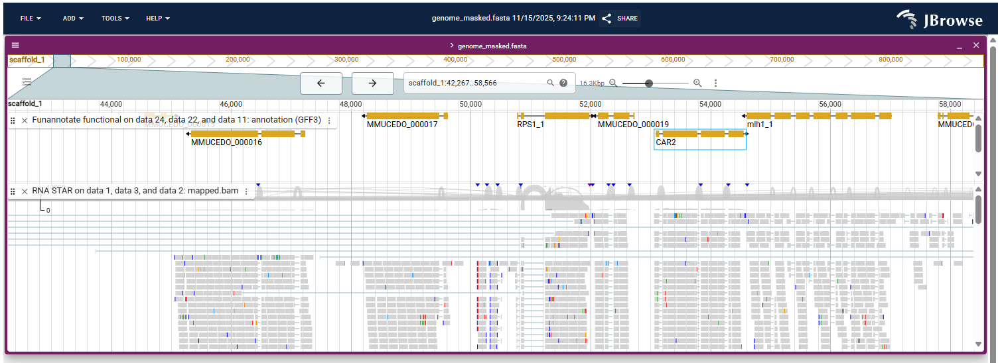

# Introduction

This tutorial guides learners through a complete workflow for fungal genome annotation, evaluation, comparative genomics, and visualization. We will annotate the genome of *Mucor mucedo* using Funannotate, compare the predicted proteome with those of related *Mucor* species using OrthoFinder, and visualize results both in JBrowse2 and Circos. All data required for the exercises are available in the accompanying Zenodo dataset.

The first part of the tutorial and corresponding datasets are based on the Galaxy tutorial [Genome annotation with Funannotate]() and corresponding [Zenodo dataset](https://zenodo.org/record/7867921).

> <agenda-title></agenda-title>
>
> In this tutorial, we will cover:
>
> 1. TOC
> {:toc}
>
{: .agenda}

# Data upload

In this first step, you will create a new Galaxy history and upload all input datasets needed for the tutorial. All required files are provided in the Zenodo record associated with this training: **{{ page.zenodo_link }}**. These include:

- The *Mucor mucedo* genome assembly (FASTA), soft-masked with RepeatMasker
- Paired-end RNA-seq reads (FASTQ)
- A SwissProt subset for functional annotation
- Complete proteomes of related *Mucor* species and *Saccharomyces cerevisiae* (downloaded from UniProt and packaged in the Zenodo dataset)

These datasets will allow you to perform structural annotation, functional annotation, comparative genomics, and visualization.

Before starting, read the following background:

> <details-title>Background: Why these data?</details-title>
>
> The *Mucor mucedo* genome used here was originally sequenced and published in the study by . According to the authors, the genome size is **≈45 Mb**, with **14,052 annotated genes** and a **BUSCO completeness of 96.9%**. Throughout the tutorial, you will compare your own results to these published values.
>
> We will use these numbers later for evaluation and comparison.
{: .details}

> <question-title></question-title>
>
> Additional genome, assembly and annotation statistics for *Mucor mucedo* and *Saccharomyces cerevisiae* can be found in **NCBI Datasets** (<https://www.ncbi.nlm.nih.gov/datasets/>). Visit NCBI Datasets to find them and compare them against. Do these two fungi genomes have a comparable genome size and quality? What about annotated genes?
>
> > <solution-title></solution-title>
> >
> > - *M. mucedo*: **46.1 Mb**, PacBio + Falcon assembly, **455 scaffolds**, **14,042 protein-coding genes**.
> > - *S. cerevisiae*: **12.1 Mb**, **16 scaffolds** (chromosomes), **6,021 protein-coding genes**.
> >
> {: .solution}
>
{: .question}

> <hands-on-title>Upload data from Zenodo</hands-on-title>
>
> 1. Create a new Galaxy history.
> 2. Upload the datasets from **<{{ page.zenodo_link }}>** using either:
>    - **Paste/Fetch data** (URLs from Zenodo), or
>    - **Upload from your computer** after downloading the files.
>
>    
>
>    
>
> 3. Ensure that the datatypes are correctly assigned.
>
>    
>
> 4. Assign tags such as:
>    - `#genome`
>    - `#rnaseq`
>    - `#proteome`
>
>    
>
> 5. For the multiple UniProt proteomes, create a [Dataset Collection]() named `Proteomes`.
>    - This will be required later for OrthoFinder.
>
>    
>
>    > <comment-title>Tip: Downloading proteomes directly from UniProt</comment-title>
>    > If you prefer, you can download the proteomes from **UniProt** (<https://www.uniprot.org/>) yourself:
>    > 1. Search each proteome accession (e.g. `UP000002311` for *S. cerevisiae*)
>    > 2. Click **“Download one protein sequence per gene (FASTA)”**.
>    > 3. Upload all FASTA files to Galaxy.
>    > 4. Create a **collection** named `Proteomes`, including all the downloaded proteomes.
>    {: .comment}
>
{: .hands_on}

# Statistics of our genome (gfastats)

In this section, we will explore the basic assembly statistics of the *Mucor mucedo* genome using **gfastats**, a lightweight tool designed to compute standard genome summary metrics.

Understanding these statistics is important because they give an overview of assembly fragmentation, contiguity, and completeness. You will later compare your results to:

- The published genome from  (≈45 Mb, ~14k genes, BUSCO ≈97%)
- NCBI Datasets values (46.1 Mb, ~14k genes, 455 scaffolds)

> <details-title>Assembly statistics: what do N50, number of scaffolds, and total length tell us?</details-title>
>
> **Total assembly size** gives a first indication of completeness.
>
> **N50** is the length for which the collection of all contigs of that length or longer covers at least 50% of the assembly. Larger N50 values indicate more contiguous (less fragmented) assemblies.
>
> **Number of scaffolds** reflects fragmentation: many scaffolds = fragmented assembly.
>
> **Longest scaffold length** gives an idea of the maximum contiguity achieved.
>
> Later on, BUSCO will help evaluating biological completeness relative to a lineage-specific set of orthologs.
{: .details}

> <hands-on-title>Compute genome statistics with gfastats</hands-on-title>
>
> 1. Run  with the following parameters:
>    -  *"Input file"*: `genome_masked.fasta` (Input dataset)
>    - *"Specify target sequences"*: `Disabled`
>    - *"Tool mode"*: `Summary statistics generation`
>        - *"Report mode"*: `Genome assembly statistics (--nstar-report)`
>
> 2. Inspect the output.
>
>    > <comment-title>Tip: Which values should you focus on?</comment-title>
>    > - **Total scaffold length**: Expect ~45–46 Mb.
>    > - **# scaffolds**: Expect ≈455.
>    > - **Scaffold N50**: Higher indicates better contiguity.
>    > - **Largest scaffold** length gives an idea of long-range continuity.
>    {: .comment}
>
{: .hands_on}

> <question-title>Interpreting assembly statistics</question-title>
>
> 1. Is your assembly size close to the expected ~45–46 Mb?
> 2. Is the number of scaffolds closer to a chromosome-level assembly (like *S. cerevisiae* with 16 scaffolds) or a fragmented draft assembly?
>
>    > <solution-title></solution-title>
>    > 1. The lenght of this assembly is ~48 Mb.
>    > 2. The number of scaffolds in this assembly is 1,425 scaffolds, indicating a **fragmented draft assembly**, unlike the fully resolved 16-chromosome assembly of *S. cerevisiae*.
>    {: .solution}
>
{: .question}

# Preparing RNASeq data (RNA STAR)

RNA sequencing (RNA-seq) data provide essential transcript evidence for genome annotation. Funannotate uses this evidence to improve gene model prediction, helping to:

- identify exon–intron boundaries,
- support splice junctions,
- detect expressed genes,
- refine the structure of predicted transcripts.

In this step, you will map the paired-end RNA-seq reads to the *Mucor mucedo* genome using **RNA STAR**, a fast and sensitive aligner commonly used in transcriptomics. The resulting BAM file will serve as evidence for training **Augustus** and **GeneMark-ET** inside Funannotate.

> <details-title>Background: Why RNA mapping matters for annotation</details-title>
>
> Although ab initio gene predictors are powerful, they often make mistakes when:
> - identifying splice sites,
> - predicting untranslated regions (UTRs),
> - distinguishing closely spaced genes,
> - detecting small or lowly expressed genes.
>
> RNA-seq evidence directly anchors annotation to biological transcription signals. Funannotate will automatically use the aligned reads to improve its structural predictions.
{: .details}

> <hands-on-title>Map RNA-seq reads to the genome with RNA STAR</hands-on-title>
>
> 1. Run  with the following parameters:
>    - *"Single-end or paired-end reads"*: `Paired-end (as individual datasets)`
>        -  *"Forward reads"*: `RNAseq_R1.fastq.gz`
>        -  *"Reverse reads"*: `RNAseq_R2.fastq.gz`
>    - *"Custom or built-in reference genome"*: `Use reference genome from history and create temporary index`
>        -  *"Select a reference genome"*: `output` (Input dataset)
>        - *"Length of the SA pre-indexing string"*: `11`
>        - *"Build index with or without known splice junctions annotation"*: `build index without gene-model`
>            - *"Per gene/transcript output"*: `No per gene or transcript output as no GTF was provided`
>        - *"Diploid mode"*: `No`
>    - *"Use 2-pass mapping for more sensitive novel splice junction discovery"*: `No`
>    - In *"Output filter criteria"*:
>        - *"Would you like to set additional output filters?"*: `No`
>    - In *"Algorithmic settings"*:
>        - *"Configure seed, alignment and limits options"*: `Use Defaults`
>    - *"Compute coverage"*: `No coverage`
>
> 2. Inspect the resulting BAM file.
>    - Check the mapping rate and alignment summary under the dataset’s **info** button.
>
>    > <comment-title>Tip: What mapping rate should you expect?</comment-title>
>    > For a well-matched RNA-seq dataset from the same strain, a vast majority of reads are expected to map uniquely on the genome. Mapping rates of **80–95%** are typical. Large deviations may indicate issues with data quality or genome fragmentation.
>    {: .comment}
>
{: .hands_on}

Have a look at the `log` output of `RNA STAR`.

> <question-title>Interpreting RNA-seq mapping</question-title>
>
> 1. What percentage of reads mapped uniquely to the genome?
> 2. Are most reads uniquely mapped or multi-mapped? Why does this matter for annotation?
> 3. How might genome fragmentation (e.g., many scaffolds) affect mapping?
>
>    > <solution-title></solution-title>
>    > 1. You should find a percentage of **uniquely mapped reads ~96.31%**.
>    > 2. You should find a percentage of **reads mapped to multiple loci ~3.19%**, and a percentage of **reads mapped to too many loci ~0.03%**, which is much less than the percentage of uniquely mapping reads.
>    > 3. Fragmented assemblies may split genes across scaffolds, reducing mapping contiguity and causing more multi-mapped reads.
>    {: .solution}
>
{: .question}

# Structural annotation (Funannotate predict)

Structural annotation identifies the location and structure of genes in a genome: exon–intron boundaries, untranslated regions (UTRs), coding sequences (CDS), and gene models. In this tutorial, we use **Funannotate**, a comprehensive genome annotation pipeline designed for fungal and other eukaryotes.

Funannotate integrates multiple evidence sources:
- **RNA-seq alignments** (from RNA STAR)
- **Protein evidence** (from UniProt proteomes)
- **Ab initio predictors** such as Augustus and GeneMark-ET

The combination of evidence-supported and ab initio prediction improves reliability and helps reconstruct complete and accurate gene models.

> <details-title>Background: Evidence-driven vs ab initio gene prediction</details-title>
>
> **Ab initio prediction** uses sequence features (codon bias, splice site motifs) to predict genes without external evidence. It can detect genes even with low expression but may produce false positives.
>
> **Evidence-based prediction** uses biological data (e.g., RNA-seq, proteins) to support or correct gene boundaries.
>
> Funannotate merges predictions from several algorithms and integrates evidence to generate a consensus gene model using **Evidence Modeler (EVM)**.
{: .details}

> <hands-on-title>Predict gene models with Funannotate predict</hands-on-title>
>
> 1. Run  with the following parameters:
>    -  *"Assembly to annotate"*: `genome_masked.fasta` (Input dataset)
>    - In *"Organism"*:
>        - *"Name of the species to annotate"*: `Mucor mucedo`
>        - *"Strain name"*: `muc1`
>        - *"Is it a fungus species?"*: `No`
>    - In *"Evidences"*:
>        -  *"RNA-seq mapped to genome to train Augustus/GeneMark-ET"*: `mapped.bam` (output of **RNA STAR** )
>        - *"Select protein evidences"*: `Custom protein sequences`
>            -  *"Proteins to map to genome"*: `SwissProt_subset.fasta` (Input dataset)
>    - In *"Busco"*: 
>        - *BUSCO models to align"*": `mucorales (orthodb 10)` (preferred if available)
>        - *"Initial Augustus species training set for BUSCO alignment"*: `rhizopus_oryzae` (preferred if available)
>    - *"Which outputs should be generated"*: Select all
>
> 2. Examine the generated files, specially:
>    - the full structural annotation in Genbank, GFF3 or NCBI tbl formats: these files contain the position of all the genes that were found on the genome.
>    - the CDS, transcript and protein sequences of all the genes predicted by Funannotate (fasta files)
>    - statistics: `stats`
>
>    > <comment-title>Tip: Output formats matter</comment-title>
>    > Funannotate produces many outputs; **GenBank (.gbk)** is especially important because Funannotate functional requires it as input.
>    {: .comment}
>
{: .hands_on}

> <comment-title>On the parameters</comment-title>
>
> From the original Galaxy tutorial [Genome annotation with Funannotate]():
> - For *"Select protein evidences"* we select `Custom protein sequences` to reduce the computing time, but for real data analysis, you should select the default value: `Use UniProtKb/SwissProt (from selected Funannotate database)`.
> - It is possible to enable the *"Is it a fungus species?"* option in Funannotate: it launches an additional ab initio predictor (CodingQuerry) dedicated to fungi genomes. However it has proved to be unstable on the genome studied in this tutorial, and it can create a lot of fragmented gene models depending on the RNASeq data available. For this tutorial we leave this option to `No`. You can test it with real data, but be sure to compare the result with and without this option.
> - For real data analysis you can consider enabling the *"Augustus settings (advanced)"* > *"Run 'optimize_augustus.pl' to refine training (long runtime)"*. If you have enough data, you might get better results as there will be an additional training step for augustus (at the cost of a longer runtime).
{: .comment}

> <question-title>Understanding structural annotation</question-title>
>
> Have a closer look at the `stats` file. The first part of the file contains some information on how funannotate was launched. If you go to the bottom, you'll find a few interesting numbers in the `annotation` section:
>
> - the total number of genes and mRNA
> - the average length of genes, exons, proteins
> - the number of single/multiple exon transcripts
>
> 1. How many genes did Funannotate predict? How does this compare to the ~14k genes reported in  and in the NCBI Datasets database?
> 2. Are there many fragmented genes? What might cause this?
> 3. Are UTRs annotated? Which functional evidences are considered?
>
> > <solution-title></solution-title>
> > 1. The predicted number should be close to ~14k.
> > 2. Genome fragmentation can split genes across scaffolds, creating partial predictions. However, most annotations predicted are complete.
> > 3. UTRs are not annotated at this point. No functional evidences are considered at this point.
> {: .solution}
>
{: .question}

# Functional annotation (EggNOG Mapper, InterProScan and Funannotate functional)

Functional annotation allows us to assign biological meaning to predicted genes and proteins. This includes:
- identifying protein domains,
- predicting gene functions,
- assigning orthologs,
- linking to metabolic pathways,
- retrieving GO terms and enzyme codes.

In this tutorial, we will use two complementary tools:
- **eggNOG-mapper** for orthology-based annotation,
- **InterProScan** for protein domain and family identification.

These two annotation strategies will later be combined using **Funannotate functional**.

## Functional annotation with EggNOG Mapper

EggNOG Mapper uses precomputed orthologous groups from the eggNOG database to assign functional annotation rapidly and accurately.

It provides:
- **GO terms**
- **KEGG pathways**
- **COG categories**
- **Enzyme codes (EC numbers)**
- **Orthology relationships**

> <details-title>Background: Why orthology improves functional annotation</details-title>
>
> Orthologs are genes in different species that evolved from a common ancestral gene through speciation.
> 
> They tend to retain similar functions across species, making orthology-based annotation highly reliable.
> 
> EggNOG-mapper performs fast homology searches (here using Diamond) and transfers high-confidence functional annotations from well-characterized organisms.
{: .details}

> <hands-on-title>Annotate proteins with eggNOG-mapper</hands-on-title>
>
> 1. Run  with the following parameters:
>    - *"Basis for annotation"*: `Seed orthologs computed with Diamond (diamond)`
>        -  *"Fasta sequences to annotate"*: `fa_proteins` (output of **Funannotate predict annotation** )
>        - *"Type of sequences"*: `proteins`
>        - *"Scoring matrix and gap costs"*: `BLOSUM62`
>
> 2. Inspect the output `annotations` tabular file:
>    - Contains annotations per protein
>    - Includes GO terms, COG categories, KEGG pathways, and orthology identifiers
>
> > <comment-title>Tip: eggNOG outputs multiple useful columns</comment-title>
> > Check the columns `Preferred_name`, `GO_terms`, `KEGG_Pathway`, and `COG_category` for downstream analyses.
> {: .comment}
>
{: .hands_on}

## Functional annotation with InterProScan

InterProScan integrates dozens of protein signature databases (Pfam, SMART, TIGRFAMs, SUPERFAMILY, etc.) to annotate protein domains and families.

Use it to:
- identify domains,
- detect repeated motifs,
- classify proteins into families,
- assign InterPro and GO terms.

> <details-title>Background: What does InterProScan add?</details-title>
>
> While eggNOG provides function based on **evolutionary relationships**, InterProScan provides function based on **conserved sequence motifs and domains**.
> 
> Combining the two yields a much more complete annotation.
{: .details}

> <hands-on-title>Annotate protein domains with InterProScan</hands-on-title>
>
> 1. Run  with the following parameters:
>    -  *"Protein FASTA File"*: `fa_proteins` (output of **Funannotate predict annotation** )
>    - *"Use applications with restricted license, only for non-commercial use?"*: `Yes`
>    - *"Output format"*: Select all
>
> 2. Inspect the InterProScan in different formats:
>    - Contains domain predictions
>    - Includes InterPro IDs and GO terms
>    - XML output is required by Funannotate functional
{: .hands_on}

## Integrating structural and functional annotation (Funannotate functional)

Funannotate functional integrates:
- structural annotation (`.gbk` from Funannotate predict),
- orthology-based annotation (eggNOG),
- domain annotation (InterProScan).

The result is a fully annotated genome with:
- gene names,
- product descriptions,
- GO terms,
- EC numbers,
- InterPro signatures,
- updated GFF3 and GenBank files.

> <hands-on-title>Integrate structural and functional annotation with Funannotate functional</hands-on-title>
>
> 1. Run  with the following parameters:
>    - *"Input format"*: `GenBank (from 'Funannotate predict annotation' tool)`
>        -  *"Genome annotation in genbank format"*: `annot_gbk` (output of **Funannotate predict annotation** )
>    -  *"Eggnog-mapper annotations file"*: `annotations` (output of **eggNOG Mapper** )
>    -  *"InterProScan5 XML file"*: `outfile_xml` (output of **InterProScan** )
>    - *"Strain name"*: `muc1`
>    - *"locus_tag from NCBI to rename GFF gene models with"*: `MMUCEDO_`
>    - *"Which outputs should be generated"*: Select all
>
> 2. Examine the updated outputs:
>    - the full structural annotation in Genbank, GFF3 or NCBI tbl formats: these files contain the position of all the genes that were found on the genome.
>    - the CDS, transcript and protein sequences of all the genes predicted by Funannotate (fasta files)
>    - statistics: `stats`
>
> > <comment-title>Tip: The locus tag ensures stable gene identifiers</comment-title>
> > The prefix `MMUCEDO_` follows NCBI conventions and helps when comparing annotations or submitting data.
> {: .comment}
>
{: .hands_on}

> <question-title>Updated annotations</question-title>
>
> Have a closer look at the `stats` file. How has the `annotation` section changed? Which functional evidences are considered?
>
> > <solution-title></solution-title>
> > Several functional evidences are now considered: GO terms, InterProScan, EggNOG, pfam...
> {: .solution}
>
{: .question}

# Evaluation with BUSCO

BUSCO (**B**enchmarking **U**niversal **S**ingle-**C**opy **O**rthologs) is a widely used tool for evaluating the completeness and quality of genomes, transcriptomes, or gene annotations. It uses lineage-specific datasets of highly conserved orthologs expected to be present as **single-copy genes** in most species of a given clade.

For fungi such as *Mucor mucedo*, using a lineage like **mucoromycota**, **fungi**, or **eukaryota** helps estimate:
- completeness of the predicted proteome,
- fragmentation due to assembly issues,
- duplication due to biological or technical artifacts.

In , the *Mucor mucedo* genome achieved a **BUSCO completeness of 96.9%**, which we will compare against our results.

> <details-title>Background: Interpretation of BUSCO categories</details-title>
>
> BUSCO results include:
> - **C (Complete)**: the BUSCO gene was found in its full length.
> - **S (Single-copy)**: present only once (as expected).
> - **D (Duplicated)**: more than one copy found; may indicate assembly duplication or paralogs.
> - **F (Fragmented)**: only part of the BUSCO gene was found.
> - **M (Missing)**: no match found.
>
> **High C, high S, low D/F/M** reflects a good annotation.
>
> Fragmentation in assemblies may increase **F** and **D**.
{: .details}

> <hands-on-title>Assess annotation completeness with BUSCO</hands-on-title>
>
> 1. Run  with the following parameters:
>    -  *"Sequences to analyse"*: `fa_proteins` (output of **Funannotate functional** )
>    - *"Cached database with lineage"*: `Busco v5 Linage Datasets (all+2024-03-21)`
>    - *"Mode"*: `Annotated gene sets (protein)`
>    - *"Auto-detect or select lineage?"*: `Select lineage`
>        - *"Lineage"*: ``
>    - *"Which outputs should be generated"*: Select all
>
> 2. Inspect the summary text file.
>    - **Complete BUSCOs** should be close to the reference value of **96.9%**.
>    - Note the proportion of **Duplicated** and **Fragmented** BUSCOs.
>
> > <comment-title>Tip: Use the most specific lineage available</comment-title>
> > Specific lineages (e.g., *mucoromycota*) give more accurate completeness estimates than broad ones (e.g., *eukaryota*).
> {: .comment}
>
{: .hands_on}

> <question-title>Interpreting your BUSCO output</question-title>
>
> 1. Is your **Complete BUSCO %** similar to the ~96.9% reported in ?
> 2. Are many BUSCOs duplicated? What biological or technical factors could explain this?
>
> > <solution-title></solution-title>
> > 1. The value obtained here for **Complete BUSCOs** is slightly smaller, but still very good (~92.5%).
> > 2. The % of duplicated BUSCOs is small (~1.2%). Duplications may arise from gene family expansions, assembly errors, or fragmented contigs.
> {: .solution}
>
{: .question}

# Visualisation with a genome browser (JBrowse2)

Genome browsers provide an intuitive and interactive way to inspect genome assemblies, gene predictions, and supporting evidence such as RNA-seq alignments. In this tutorial, you will use **JBrowse2**, the modern successor to JBrowse, to examine your annotated *Mucor mucedo* genome.

Using JBrowse2, you can:
- View the genome assembly sequence
- Visualize gene models (GFF3)
- Assess support from RNA-seq alignments (BAM)
- Check exon–intron boundaries
- Investigate potential annotation errors

This visual inspection is crucial to validating genome annotation results.

> <details-title>Background: Why visualization is important</details-title>
>
> Even when using advanced annotation tools, errors can occur:
> - Incomplete gene models
> - Incorrect intron–exon boundaries
> - Genes predicted on the wrong strand
> - Fused or split gene models
>
> Visualization helps confirm whether RNA-seq evidence supports predicted gene structures. It also helps identify structural variation or assembly errors.
{: .details}

> <hands-on-title>Launch a JBrowse2 genome browser instance</hands-on-title>
>
> 1. Run  with the following parameters:
>    - *"Action"*: `New JBrowse Instance`
>    - In *"Genome Assembly"*:
>        -  *"Insert Genome Assembly"*
>            - *"Reference genome to display"*: `Use a genome from history`
>                -  *"Select the reference genome"*: `genome_masked.fasta` (Input dataset)
>            - In *"Track Category"*:
>                -  *"Insert Track Category"*
>                    - *"Track Category Label"*: `Annotation`
>                    - In *"Track"*:
>                        -  *"Insert Track"*
>                            - *"Track Type"*: `GFF/GFF3/BED Features`
>                                - *"GFF/GFF3/BED Track Data"*: `Use data from history`
>                                - *"GFF/GFF3/BED Track Data"*: `annotation (GFF3)` (output of **Funannotate functional** )
>                                - In *"Advanced: styling options"*:
>                                    - *"Display style"*: `LinearBasicDisplay`
>                -  *"Insert Track Category"*
>                    - *"Track Category Label"*: `RNA-seq`
>                    - In *"Track"*:
>                        -  *"Insert Track"*
>                            - *"Track Type"*: `BAM Pileups`
>                                - *"BAM Track Data"*: `Use data from history`
>                                - *"BAM Track Data"*: `mapped.bam` (output of **RNA STAR** )
>                                - In *"Advanced: styling options"*:
>                                    - *"Display style"*: `Alignments (Pileup + SNP Coverage)`
>
> 2. Launch the JBrowse session.
>    - Browse several scaffolds.
>    - Inspect gene predictions by clicking on them.
>
> > <comment-title>Tip: Gene-rich regions reveal annotation quality</comment-title>
> > Regions with high RNA-seq coverage and multiple predicted genes allow you to:
> > - verify splice junctions,
> > - confirm start/stop codons.
> {: .comment}
>
{: .hands_on}

> <question-title>Inspecting your gene models</question-title>
>
> 1. Do the predicted intron–exon boundaries align with RNA-seq splice junctions?
> 2. Are all genes equally expressed? Are some predicted genes not supported by RNA-seq?
> 3. Can you find evidence of alternative splicing in any genes?
>
> > <solution-title></solution-title>
> > 1. Accurate boundaries should match split-read junctions.
> > 2. Some genes are more highly expressed than others. Genes without RNA support may be lowly expressed, mispredicted, or pseudogenes.
> > 3. If present, alternative isoforms may appear as differential splice patterns. However, remember that we have used a reduced RNA-seq dataset and data was not enough to detect splicing isoforms. In real analyses, you should use complete RNA-seq datasets from multiple samples to get more in depth results.
> {: .solution}
>
{: .question}

# Comparative genomics (OrthoFinder)

Comparative genomics allows us to place the *Mucor mucedo* gene set in an evolutionary context. Here, we compare our annotated proteins against:
- complete proteomes from several species of the **Mucor** genus (downloaded from UniProt), and
- **Saccharomyces cerevisiae** (UP000002311) as an outgroup.

We use **OrthoFinder**, a powerful and accurate tool to identify:
- orthologous groups (orthogroups),
- gene family expansions and contractions,
- species tree inference,
- comparative statistics across species.

> <details-title>Background: What are orthogroups?</details-title>
>
> Orthogroups contain genes that originated from a single ancestral gene in the last common ancestor of the compared species.
>
> They include orthologs (same gene across species) and paralogs (gene copies within species).
>
> OrthoFinder reconstructs gene trees and uses them to infer a robust species tree.
>
> Comparing the size of orthogroups across species helps detect gene family expansions linked to adaptation or pathogenicity.
{: .details}

> <hands-on-title>Identify orthogroups and infer evolutionary relationships with OrthoFinder</hands-on-title>
>
> 1. Add the `fa_proteins` (output of **Funannotate functional** ) into the `Proteomes` collection (collection of FASTA files)
>
> 2. Run  with the following parameters:
>    - *"Orthofinder starting point"*: `From fasta files`
>        -  *"Select input fasta files"*: `Proteomes` (Input dataset collection, including *Mucor mucedo* annotated proteins)
>        - *"Sequence search program"*: `Diamond (faster)`
>    - *"Orthofinder run mode"*: `Full run (including gene trees)`
>        - *"Method for gene tree inference"*: `Dendroblast (faster)`
>        - *"Outputs"*: Include all
>
> 3. Examine the output files, which include:
>    - list of orthogroups and assigned genes
>    - number of genes per species in each orthogroup
>    - inferred species tree
>        - Click `Visualize` and then `Phylogenetic tree` to view a graphical representation of the NEWICK tree
>    - statistics
>
> 4. Explore the statistics:
>    - How many orthogroups contain *M. mucedo* genes?
>    - Are any orthogroups expanded in *M. mucedo* compared to other *Mucor* species?
>    - How does *S. cerevisiae* cluster relative to the *Mucor* genus?
>
> > <comment-title>Tip: Gene family expansions may reveal biological insights</comment-title>
> > Look for large orthogroups in *M. mucedo* that are small or absent in the outgroup. These may correspond to lineage-specific adaptations.
> {: .comment}
>
{: .hands_on}

> <question-title>Interpreting OrthoFinder results</question-title>
>
> 1. Do the *Mucor* species cluster together as expected in the species tree?
> 2. Does *S. cerevisiae* appear as a clear outgroup?
> 3. Can you identify orthogroups unique to *M. mucedo*?
> 4. Which orthogroups appear expanded or contracted?
>
> > <solution-title></solution-title>
> > 1. The *Mucor* species form a monophyletic clade.
> > 2. Yes—*S. cerevisiae* cluster far from the *Mucor* group.
> > 3. A total of 13027 of the 13282 *M. mucedo* annotated genes are found in orthogroups. A total of 139 orthogroups are specific to this species and contain a total of 812 *M. mucedo* genes. Unique orthogroups may indicate species-specific traits.
> > 4. See e.g. orthogroup OG0000145. It is specific to *M. mucedo* and contais a total of 33 genes. Expanded orthogroups may relate to metabolism, stress response, or pathogenicity.
> {: .solution}
>
{: .question}

# Visualisation with a circular plot (Circos)

Circular genome visualisation is a powerful way to summarise complex genomic relationships in a single figure. **Circos** plots are commonly used to display:
- genome structure and size,
- gene density,
- GC content variation,
- synteny and orthology links,
- comparative genomics results (e.g., OrthoFinder outputs).

Here, we will use **Circos** to visualise: 
- scaffolds of ***Mucor mucedo***,
- gene annotations across the genome,
- GC-skew across the genome,

The exact information displayed depends on which files you choose to load into Circos.

> <details-title>Background: What is a Circos plot?</details-title>
>
> Circos is a software for visualising data in circular layouts. It excels at showing relationships between genomic segments, especially at large scale.
>
> A typical Circos plot includes:
> - a circular backbone representing chromosomes or scaffolds;
> - tracks such as gene density, GC content, or annotations;
> - ribbons or links representing similarities or orthologous genes.
>
> In comparative genomics, Circos allows quick identification of:
> - conserved syntenic regions,
> - genome rearrangements,
> - expansions or contractions in specific regions.
{: .details}

Circos requires specific input formats. For this tutorial, the key inputs come from:
- **Genome assembly** (FASTA index / scaffold coordinates)
- **GC-skew** (computed from the genome)
- **Annotations** (GFF3 from Funannotate functional)
- **OrthoFinder orthologs** (Orthologues per species(tsv), for *Mucor mucedo*, from OrthoFinder)

Galaxy provides helper tools to convert these to Circos-compatible formats. Below are the preparatory sub-steps used for creating Circos-ready data layers. These steps generate GC-skew scatter tracks and tile tracks — all of which can be integrated as layers inside your Circos plot.

## Computing the **GC Skew**

GC skew is the measure of imbalance between guanine (G) and cytosine (C) nucleotides in a sliding window along the genome. It provides insight into genome composition and can highlight replication origins, strand asymmetries, or unusual compositional patterns.

> <details-title>Background: What is GC Skew?</details-title>
>
> GC skew is defined as:
>
> **(G − C) / (G + C)** in a window.
>
> Positive skew indicates more **G** than **C**, while negative skew indicates the opposite. Plotting GC skew around the genome can reveal biologically meaningful patterns.
{: .details}

> <hands-on-title>Compute **GC Skew** with GC Skew</hands-on-title>
>
> 1. Run  with the following parameters:
>    - *"Source for reference genome"*: `Use a genome from history`
>        -  *"Select a reference genome"*: `genome_masked.fasta` (Input dataset)
>    - *"Window size"*: `5000`
>
> 2. The output is a **BIGWIG** file containing GC skew values across all scaffolds.
>
>
> > <comment-title>Tip: Choosing window size</comment-title>
> > Smaller windows give higher resolution but heavier and noisier data. 
> {: .comment}
>
{: .hands_on}

> <question-title>Understanding GC Skew</question-title>
>
> 1. Why does GC skew vary across the genome?
> 2. What biological features can GC skew help identify?
>
> > <solution-title></solution-title>
> > 1. Because local nucleotide composition differs by region due to mutation biases, replication mechanisms, and selection pressures.
> > 2. GC skew patterns can reveal replication origins, strand asymmetries, and unusual genomic regions.
> {: .solution}
>
{: .question}

## Converting bigWig to Scatter Track

Scatter plots in Circos represent numeric genomic data (e.g. GC skew, coverage, gene density) as points distributed along the circumference of the genome.

To produce a scatter track, we must convert the BIGWIG output from the GC Skew tool into a Circos-compatible scatter format.

> <hands-on-title>Prepare a scatter plot track for Circos: bigWig to Scatter</hands-on-title>
>
> 1. Run  with the following parameters:
>    -  *"Data file"*: `gc_skew.bigwig` (output of **GC Skew** )
>
> 2. The output is a Circos-formatted scatter track file (tabular).
>
> > <comment-title>Tip: Scatter vs histogram tracks</comment-title>
> > Scatter tracks show individual values, whereas histograms aggregate values into bins. Scatter is more suitable for GC skew.
> {: .comment}
>
{: .hands_on}

> <question-title>Understanding scatter tracks</question-title>
>
> 1. Why is scatter a good visualization choice for GC skew?
> 2. What might cause extreme GC skew values at certain positions?
>
> > <solution-title></solution-title>
> > 1. Because GC skew varies rapidly and scatter preserves fine-scale fluctuations.
> > 2. Local sequence bias, repeats, or assembly artifacts can cause spikes.
> {: .solution}
>
{: .question}

## Converting GFF3 to Circos Tiles

Tile tracks in Circos are commonly used to visualize intervals, such as gene annotations or other genomic features.

For this tutorial, we generate tiles from the **Funannotate functional** GFF3 gene annotations.

> <hands-on-title>Generate annotation tiles using Circos: Interval to Tiles</hands-on-title>
>
> 1. Run  with the following parameters:
>    - *"Data Format"*: `GFF3`
>        -  *"GFF3 File"*: `gff3` (output of **Funannotate functional** )
>        - *"GFF3 Attribute to pull value from"*: `ID`
>
> 2. The output is a BED-like table with gene annotations, ready for Circos.
>
{: .hands_on}

> <question-title>Understanding tile tracks</question-title>
>
> 1. Why might a tile track be useful in a Circos plot?
> 2. What happens if too many feature types are included?
>
> > <solution-title></solution-title>
> > 1. Because it highlights the distribution of genomic features (e.g., gene-rich vs gene-poor regions).
> > 2. The plot can become cluttered and difficult to interpret.
> {: .solution}
>
{: .question}

## Generating a Circos plot

Finally, we are going to generate a Circos plot with the previously-generated data layers.

> <hands-on-title>Create a comparative Circos plot</hands-on-title>
>
> 1. Run  with the following parameters:
>    - In *"Karyotype"*:
>        - *"Reference Genome Source"*: `FASTA File from History (can be slow, generate a length file to improve execution time.)`
>            -  *"Source FASTA Sequence"*: `genome_masked.fasta` (Input dataset)
>    - In *"Karyotype"*:
>        - *"Chromosome units"*: `Megabases`
>        - In *"Labels":
>            - *"Show Label"*: `No`
>        - In *"Cytogenetic Bands":
>            - *"Show Cytogenetic Bands?"*: `No`
>    - In *"2D Data Tracks"*:
>        - In *"2D Data Plot"*:
>            -  *"Insert 2D Data Plot"*
>                - *"Outside Radius"*: `0.89`
>                - *"Inside Radius"*: `0.8`
>                - *"Plot Type"*: `Tiles`
>                    -  *"Tile Data Source"*: `tiles` (output of **Circos: Interval To Tiles** )
>                    - In *"Plot Format Specific Options"*:
>                        - *"Fill Color"*: `#678de4`
>                        - *"Stroke Thickness"*: `0`
>                - *"Minimum / maximum options"*: `Plot all values`
>                - In *"Rules"*:
>                    - In *"Rule"*:
>                        -  *"Insert Rule"*
>                            - In *"Conditions to Apply"*:
>                                -  *"Insert Conditions to Apply"*
>                                    - *"Condition"*: `Based on qualifier value (when available)`
>                                        - *"Qualifier name"*: `strand`
>                                        - *"Condition"*: `Less than (numeric)`
>                                        - *"Qualifier value to compare against"*: `0`
>                            - In *"Actions to Apply"*:
>                                -  *"Insert Actions to Apply"*
>                                    - *"Action"*: `Change Fill Color for all points`
>                                        - *"Fill Color"*: `#f79308`
>            -  *"Insert 2D Data Plot"*
>                - *"Outside Radius"*: `0.79`
>                - *"Inside Radius"*: `0.7`
>                - *"Plot Type"*: `Histogram`
>                    -  *"Histogram Data Source"*: `scatter` (output of **Circos: bigWig to Scatter** )
>                    - In *"Plot Format Specific Options"*:
>                        - *"Stroke Thickness"*: `0`
>                - *"Minimum / maximum options"*: `Plot all values`
>                - In *"Rules"*:
>                    - In *"Rule"*:
>                        -  *"Insert Rule"*
>                            - In *"Conditions to Apply"*:
>                                -  *"Insert Conditions to Apply"*
>                                    - *"Condition"*: `Apply to Every Point`
>                            - In *"Actions to Apply"*:
>                                -  *"Insert Actions to Apply"*
>                                    - *"Action"*: `Change Fill Color based on Value`
>                                        - *"Fill Color"*: `Sequential: Blue - Purple`
>                                        - *"Minimum value of dataset"*: `-1.0`
>                                        - *"Maximum value of dataset"*: `1.0`
>    - In *"Limits"*:
>        - *"Maximum number of ideograms to draw"*: `1500`
>
> The output will be a publication-ready circular genome plot.
>
> > <comment-title>Tip: Start simple</comment-title>
> > Circos plots can become overwhelming. Begin with:
> > - assembly ideogram
> > - a single data track
> > 
> > Then gradually add more information.
> {: .comment}
>
{: .hands_on}

> <tip-title>Challenge Task: Limiting your Circos visualization to the longest scaffolds</tip-title>
>
> Your Circos visualization is now very cluttered. Limit the visualization to represent just the ten longest scaffold (scaffold_1 to scaffold_10) (hint: *`Limit/Filter and Order Chromosomes`* = `scaffold_1;scaffold_2;scaffold_3;scaffold_4;scaffold_5;scaffold_6;scaffold_7;scaffold_8;scaffold_9;scaffold_10`; *`Spacing Between Ideograms (in chromosome units)`* = `0.05`). 
>
> 1. What does the GC-skew scatter track reveal about compositional changes across *Mucor mucedo* scaffolds?
> 2. Do the gene annotation tiles suggest uniform gene distribution, or are there clear gene-rich and gene-poor regions?
> 3. How do GC-skew patterns relate to regions of high or low gene density?
> 4. Are any scaffolds noticeably different in GC-skew or annotation density compared to the others?
>
{: .tip}

 all the scaffolds, and (B) the ten longest scaffolds.")

> <tip-title>Challenge Task: Visualize ortholog abundance as heatmaps</tip-title>
>
> Extend your Circos plot by adding **heatmap tracks** showing, for each *Mucor mucedo* gene, how many orthologs it has in each of the other *Mucor* species.
>
> **Hints to complete the challenge:**
> - Use `Orthogroups.GeneCount.tsv` from OrthoFinder.
> - Extract, for each *M. mucedo* gene, the number of orthologs in the remaining species.
> - Join these values with gene coordinates (from your GFF3 annotation file).
> - Convert the data into Circos heatmap format.
> - Add the resulting track(s) to your Circos visualization.
>
> **Questions to reflect on:**
> - Do genes with many orthologs cluster in specific genomic regions?
> - Do ortholog-rich areas correlate with extreme GC-skew or gene density patterns?
> - Could expansions in orthologous gene families relate to adaptation or functional specialization in *M. mucedo*?
{: .tip}

# Conclusion

In this tutorial, you performed a complete workflow for genome annotation, evaluation, comparison, and visualization using Galaxy tools. Starting with raw genomic and transcriptomic data, you:
- Uploaded and inspected genome data, evaluating assembly statistics.
- Prepared RNA-seq reads and used them to support structural gene annotation.
- Predicted genes with Funannotate, then added functional annotation using EggNOG-mapper and InterProScan.
- Evaluated annotation completeness using BUSCO, comparing your results with published values.
- Visualised the genome interactively using JBrowse2 to inspect gene models and RNA-seq support.
- Performed comparative genomics with OrthoFinder to place Mucor mucedo in an evolutionary context.
- Generated a Circos plot integrating genome scaffolds, annotations, and GC-skew.
- Explored how to extend Circos with additional data layers such as ortholog heatmaps.

By completing these steps, you have learned how to:
- conduct end-to-end eukaryotic genome annotation,
- assess and validate genomic and functional predictions,
- explore evolutionary relationships across species, and
- create high-quality visual summaries of genomic data.

This workflow equips you with foundational skills in genome annotation, comparative analysis, and visualisation — and provides a flexible template you can adapt for your own research or teaching contexts. Here is the workflow for you to use in your own data:


