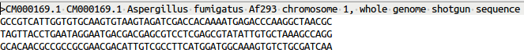
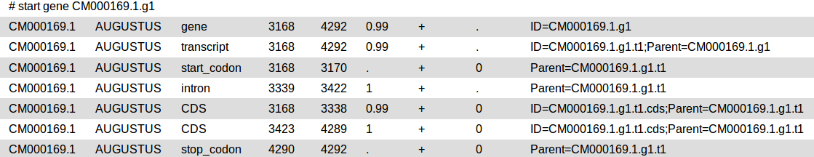
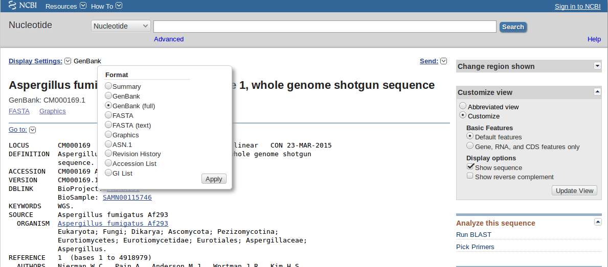
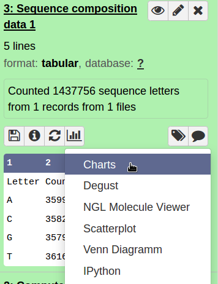
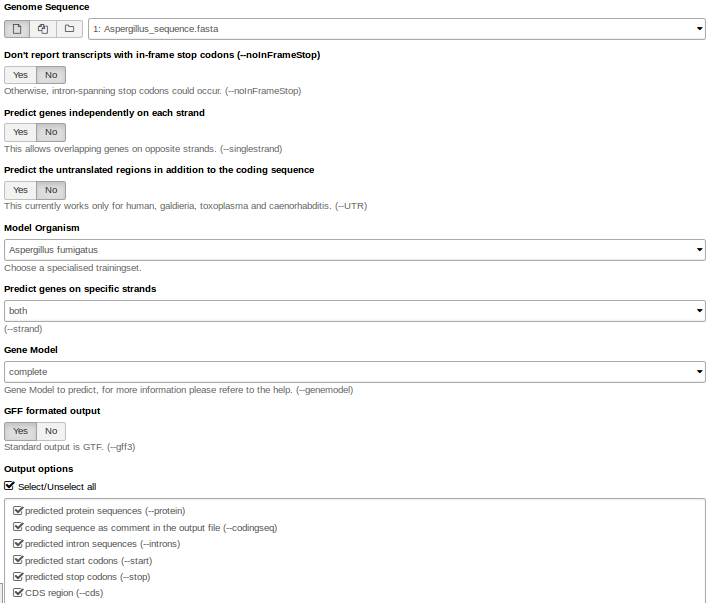
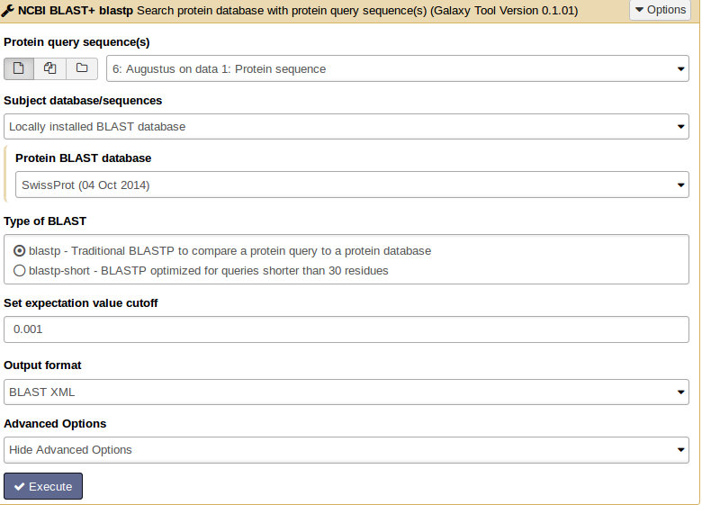
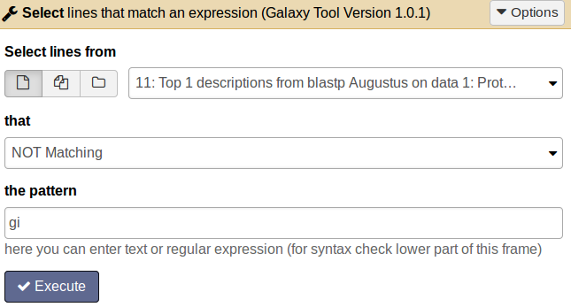
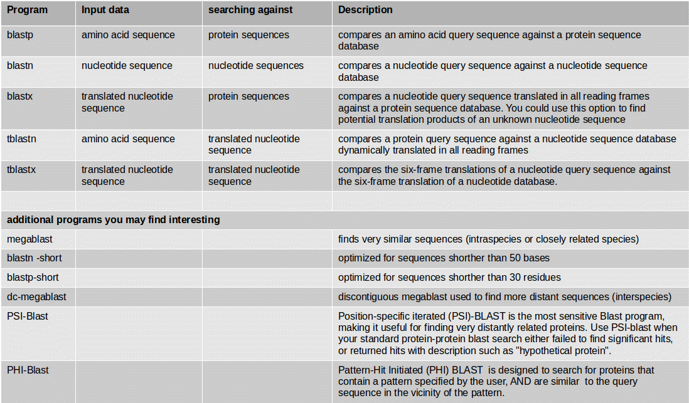
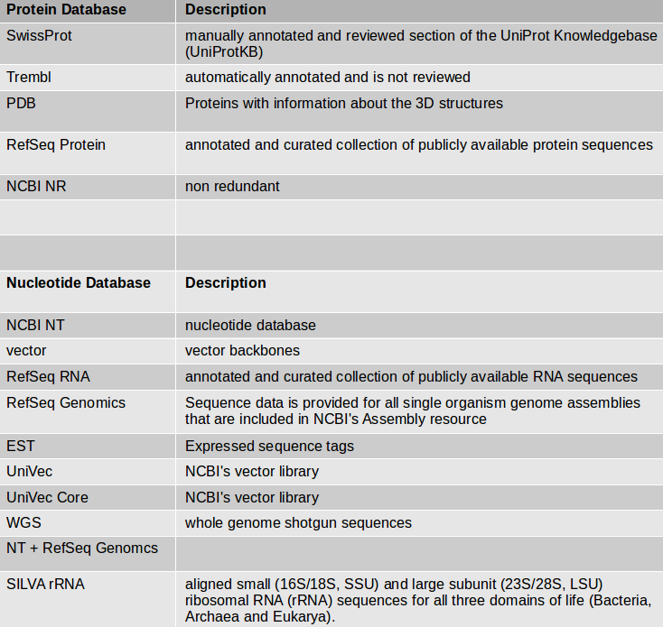
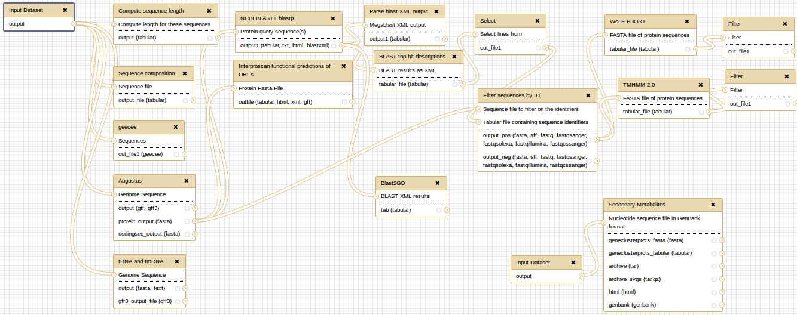

# Introduction

Genome annotation is the process of attaching biological information to sequences.
It consists of three main steps:

 - identifying portions of the genome that do not code for proteins
 - identifying elements on the genome, a process called gene prediction, and
 - attaching biological information to these elements.

> <agenda-title></agenda-title>
>
> In this tutorial, we will deal with:
>
> 1. TOC
> {:toc}
>
{: .agenda}

# Introduction into File Formats

**FASTA**

DNA and protein sequences are written in FASTA format where you have in the first line a ">" followed by the description. In the second line the sequence starts.

**GFF3**

The general feature format (gene-finding format, generic feature format, GFF) is a file format used for describing genes and other features of DNA, RNA and protein sequences.

**GENBANK**

The genbank sequence format is a rich format for storing sequences and associated annotations.

# Structural Annotation

For the genome annotation we use a piece of the *Aspergillus fumigatus* [genome sequence](https://zenodo.org/record/1250793/files/Aspergillus_sequence.fasta) as input file.

## Sequence Features

First we want to get some general information about our sequence.

> <hands-on-title>Sequence composition</hands-on-title>
>
> 1. Count the number of bases in your sequence (**compute sequence length**)
> 2. Check for sequence composition and GC content (**geecee**).
> 3. Plot the sequence composition as bar chart.
>
> 
>
{: .hands_on}

## Gene Prediction

At first you need to identify those structures of the genome which code for proteins. This step of annotation is called “structural annotation”. It contains the identification and location of open reading frames (ORFs), identification of gene structures and coding regions, and the location of regulatory motifs. Galaxy contains several tools for the structural annotation. Tools for gene prediction are **Augustus** (for eukaryotes and prokaryotes) and **glimmer3** (only for prokaryotes).

> <hands-on-title>Gene prediction</hands-on-title>
>
> We use **Augustus** for gene prediction.
> 1. Use the genome sequence (FASTA file) as input.
> 2. Choose the right *model organism*, *gff* format output.
> 3. Select all possible output options.
>
> 
>
> Augustus will provide three output files: *gff3*, *coding sequences* (CDS) and *protein sequences*.
>
>    > <question-title></question-title>
>    >
>    > How many genes are predicted?
>    >
>    > > <solution-title></solution-title>
>    > > Check the output: [augustus_output](../../images/augustus_out.png)
>    > {: .solution }
> {: .question}
>
{: .hands_on}

> <hands-on-title>tRNA and tmRNA Prediction</hands-on-title>
>
> Use **Aragorn** for tRNA and tmRNA prediction.
> 1. As input file use the *Aspergillus* genome sequence. You can choose the genetic code (e.g. bacteria).
> 2. Select the topology of your genome (circular or linear).
>
>    > <question-title></question-title>
>    >
>    > Are there tRNAs or tmRNAs in the sequence?
>    >
>    {: .question}
>
{: .hands_on}

> <details-title>Aragorn in depth</details-title>
>
> read more about **Aragorn** [here](https://nar.oxfordjournals.org/content/32/1/11.full.pdf+html).
{: .details}

# Functional Annotation

## Similarity Searches (BLAST)

Functional gene annotation means the description of the biochemical and biological function of proteins. Possible analyses to annotate genes can be for example:

- similarity searches
- gene cluster prediction for secondary metabolites
- identification of transmembrane domains in protein sequences
- finding gene ontology terms
- pathway information

For similarity searches we use *NCBI BLAST+ blastp* to find similar proteins in a protein database.

> <hands-on-title> Similarity search</hands-on-title>
>
> 1.  As input file, select the protein sequences from Augustus.
> 2. Choose the protein BLAST database *SwissProt* and the output format *xml*.
>
> 
>
> 3. Parsing the xml output (**Parse blast XML output**) results in changing the format style into tabular.
>
>    > <question-title></question-title>
>    >
>    > What information do you see in the BLAST output?
>    >
>    {: .question}
>
>
> From BLAST search results we want to get only the best hit for each protein.
> 4.  Therefore apply the tool **BLAST top hit descriptions** with *number of descriptions =1* on the xml output file.
>
>    > <question-title></question-title>
>    >
>    > For how many proteins we do not get a BLAST hit?
>    >
>    {: .question}
>
> 5.  Choose the tool **Select lines that match an expression** and enter the following information: *Select lines from* [select the BLAST top hit descriptions result file]; *that* [not matching]; *the pattern* [gi].
>
>    
>
>    > <comment-title>Results file</comment-title>
>    > The result file will contain all proteins which do not have an entry in the second column and therefore have no similar protein in the SwissProt database.
>    {: .comment}
>
>    > <comment-title>Obtaining unannotated proteins for analysis</comment-title>
>    > For functional description of those proteins we want to search for motifs or domains which may classify them more. To get a protein sequence FASTA file with only the not annotated proteins, use the tool **Filter sequences by ID from a tabular file** and select for *Sequence file to filter on the identifiers* [Augustus protein sequences] and for *Tabular file containing sequence identifiers* the protein file with not annotated sequences. The output file is a FASTA file with only those sequences without description.
>    {: .comment}
>
{: .hands_on}

This file will be the input for more detailed analysis:

- **Interproscan** is a functional prediction tool. Select all applications and run it on your protein file.

- **WolfPSort** predicts eukaryote protein subcellular localization. Filter the result file for the best ranked localization hit. Use **Filter data on any column using simple expressions** with *c4==1*. The parameter c4==1 means: filter and keep all results where in column 4 is a "1".

- **TMHMM** finds transmembrane domains in protein sequences. The number of amino acids in transmembrane helices should be >18. This information can be found in column 3. Filter the result file *c3>17.99*.

- **BLAST2GO** maps BLAST results to GO annotation terms.

### BLAST Programs

> <details-title>Organism not available in a BLAST database</details-title>
>
> If you have an organism which is not available in a BLAST database, you can use its genome sequence in FASTA file for BLAST searches "sequence file against sequence file". If you need to search in these sequences on a regularly basis, you can create a own BLAST database from the sequences of the organism. The advantage of having a own database for your organism is the duration of the BLAST search which speeds up a lot.
{: .details}

**NCBI BLAST+ makeblastdb** creates a BLAST database from your own FASTA sequence file. Molecule type of input is protein or nucleotide.

> <details-title>Further Reading about BLAST Tools in Galaxy</details-title>
>
> Cock et al. (2015): [NCBI BLAST+ integrated into Galaxy](http://biorxiv.org/content/early/2015/05/04/014043.full-text.pdf+html)
>
> Cock et al. (2013): [Galaxy tools and workflows for sequence analysis with applications in molecular plant pathology](https://peerj.com/articles/167/)
{: .details}

## More Similarity Search Tools in Galaxy

* **VSEARCH**: For processing metagenomic sequences, including searching, clustering, chimera detection, dereplication, sorting, masking and shuffling. VSEARCH stands for vectorized search, as the tool takes advantage of parallelism in the form of SIMD vectorization as well as multiple threads to perform accurate alignments at high speed. VSEARCH uses an optimal global aligner (full dynamic programming Needleman-Wunsch), in contrast to USEARCH which by default uses a heuristic seed and extend aligner. This results in more accurate alignments and overall improved sensitivity (recall) with VSEARCH, especially for alignments with gaps.

> <details-title>`vsearch` in depth</details-title>
>
> Documentation for vsearch see [here](https://github.com/torognes/vsearch).
{: .details}

* **Diamond**: Diamond is a high-throughput program for aligning a file of short reads against a protein reference database such as NR, at 20,000 times the speed of Blastx, with high sensitivity.

> <details-title>Diamond in depth</details-title>
>
> [Buchfink et al. (2015): Fast and sensitive protein alignment using Diamond.](https://www.nature.com/nmeth/journal/v12/n1/abs/nmeth.3176.html)
{: .details}

* **Kraken**: Kraken BLAST is a highly scalable, extremely fast, commercial, parallelized implementation of the NCBI BLAST application.

## Identification of Gene Clusters

For identification of gene clusters, **antiSMASH** is used. The tool uses genbank file as input files and predicts gene clusters. Output files are a html visualization and the gene cluster proteins.

> <hands-on-title>antiSMASH analysis</hands-on-title>
>
>  Import this [dataset](../../input_data/Streptomyces_coelicolor_part.genbank) into your Galaxy history and run **antiSMASH** to detect gene clusters. The genbank file contains a part of the *Streptomyces coelicolor* genome sequence.
>
{: .hands_on}

> <question-title></question-title>
>
> Which gene clusters are identified?
>
{: .question}

When you have a whole genome **antiSMASH** analysis, your result may look like this:

At the end, you can extract a reproducible workflow out of your history. The workflow should look like this:

