# Getting Started With Apollo
{:.no_toc}

The Center for Phage Technology Galaxy program is an instance of the Galaxy Project, and provides a web interface for bioinformatics tools. Apollo, a genome browser, can be accessed through Galaxy to view, edit, and annotate genomes.

> ### Agenda
>
> In this tutorial, you will find:
>
> * Background Information
>    > * History of Genome Browsers
>    >    > 1. Artemis
>    >    > 2. GBrowse
>    >    > 3. JBrowse
>    >    > 4. Apollo
>    > * Genome File Formats
>    >    > 1. FASTA
>    >    > 2. GFF3
>    >    > 3. GenBank
> * Annotation Within Apollo
>    > * Apollo in Galaxy - General Use
>    >    > 1. JBrowse in Galaxy
>    >    > 2. Moving Data From Galaxy to Apollo
>    > * Navigating Through Apollo
> * Workflows
{: .agenda}

# Background Information

Although it is not the first genome browser, Apollo is the first collaborative genomic annotation editor available solely on the Internet.

> ###  Important Definitions 
> * **Static:** Unmodifiable, specifically in the context of a computer resource that you are accessing. The website that you see cannot be modified by you, the user accessing them. This is opposed to “dynamic” where you can interact with the files or service, and your interactions can persist.
> * **Instance:** A specific copy of a web service made available over the internet. Given that the administrators can run 0-N copies of the same web service, we use the term “instance” to refer to a specific copy of a service.
> * **Tracks:** A set of analysis results that can be shown or hidden depending on the annotator’s needs.
> * **Feature:** Conceptually, a region of a genome with some annotations (such as a Name, Product, or Dbxref). Visually, a rectangular box in a track.
> * **Evidence:** Tracks contain evidence; these are results of specific computer methods (which are documented and citable), which we use to make annotations. Annotations should not be made without evidence. Evidence allows us to move the annotation process from an art to a science.
> * **Annotations:** Annotation is the addition of descriptive features to a DNA sequence, such as a protein’s function, or locating tRNAs, and terminators. The annotation process we do is 100% computer based, so keep in mind that until an annotation is experimentally tested in the lab, it is putative or assumed based on an educated hypothesis.
{: .details}

## History of Genome Browsers

This section will cover a bit of history about Genome Browsers. While not useful to the annotation process, it is important to know what the terms mean and how the parts all fit together, so that the developers and annotators can have a common language.

We use a lot of software under the umbrella term of GMOD, the [Generic Model Organism Database.](http://www.gmod.org/wiki/Main_Page “Generic Model Organism Database”)

GMOD is a collection of open source software for maintaining Model Organism Databases (MODs). Having a common platform for MODs is important, as historically individual labs spent effort building their own, custom organism databases, and then faced challenges trying to interoperate with other databases. With GMOD and the associated tools, software that talks to one MOD can be re-used when talking to another MOD. We can use the same tools to work with the CPT’s Phage Database, as people use to access data in Yeast genome databases.

### 1. Artemis

Artemis, the first genome browser discussed here, is not actually a GMOD project. Artemis was an older, desktop-based genome browser. You had to install the software on your computer in order to run it. All of the other genome browsers observed here are web-based. Artemis allows for annotation, but those annotations were only stored on your local device. Artemis featured a three-pane view consisting of a high-level overview of the genome, a DNA-level view, and a list of all the features in the genome.

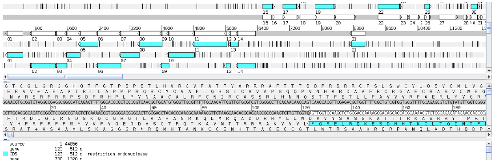

### 2. GBrowse

One of the earlier genome browsers, GBrowse did *not* support annotation. Think of it like the old Yahoo-maps. Instead of just clicking and dragging the map, you had to click where you wanted to go, wait a few seconds, and the new map would be displayed. It makes the process tedious.

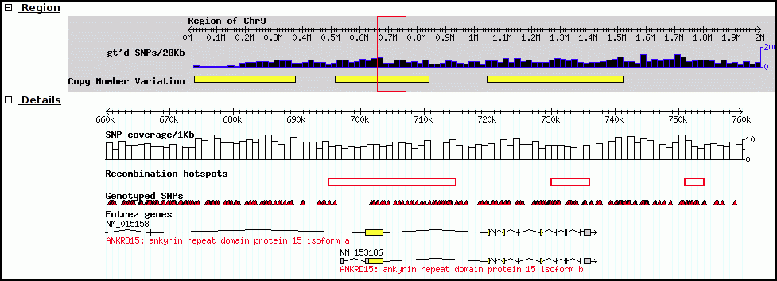

### 3. JBrowse

JBrowse is used in Galaxy workflows for genome visualization. JBrowse is a more modern re-implementation of GBrowse. JBrowse is much more like Google Maps (or any other current web map service); you click and drag and can quickly browse around the genome, turning evidence tracks on and off where relevant. Many labs have deployed JBrowse instances to help showcase their annotation efforts to the community, and to make their data accessible. FlyBase has produced a demo in JBrowse, displaying *Drosophila melanogaster*. Note that JBrowse is a **_static_** visualization tool. You cannot make any changes to the data, and you cannot make annotations and save them. It is a “Read Only” view of genomes and annotations.

### 4. Apollo

Apollo takes JBrowse one step further and adds support for community annotation; it provides a “Read+Write” view of genomes. You can create new annotations on new gene features, and these are shared with everyone who has access to the Apollo server. From a computer perspective, Apollo embeds a copy of JBrowse. For the annotation workflow, we will use both Apollo and JBrowse.

## Genome File Formats

There are three file formats to be aware of during genome annotation.
> * **FASTA:** stores genomic sequence information in the form of nucleotide sequences.
> * **GFF3:** stands for general feature format; stores genome annotations.
> * **GenBank:** an older format containing annotations and sequence information.

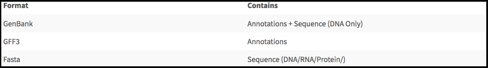

### 1. FASTA

The sequence contained in a FASTA file may be DNA, RNA, or protein sequences; they may contain unspecified bases (N/Y/X) or gaps (-). Within a FASTA file, each sequence begins with a “>,” which is immediately followed by the “FASTA ID.” Some sequences have a “description” after *any whitespace character*, such as the given example.

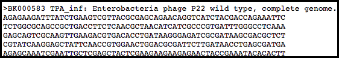

### 2. GFF3

The eukaryotic gene model captures a lot of information about the biological process behind producing proteins from DNA, such as mRNAs, transcription, and alternative splicing. GFF3 files thus have to encode these complex, hierarchical, parent-child relationships. Characteristics of GFF3 files, such as the tab separated, key-value pairs, allow simplicity and ease of use.

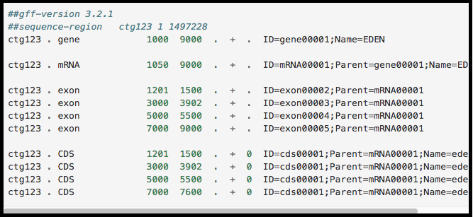

At the top level is a “gene” (3rd column) spanning from 1000 to 9000, on the forward strand (7th column), with an ID of gene00001, and the Name EDEN.

Below the "gene" is an mRNA feature. The mRNA has a Parent attribute (Parent=gene00001) set to the ID of the “parent” gene feature. This makes it a child of the gene feature.

Similarly all four exons and all four CDSs have a Parent of mRNA00001. ID, Name, and Parent are all known as feature attributes - metadata about a feature. Feature attributes also contain other fields; you will sometimes see Notes, Products, or many other fields. Only a handful of these attributes have standards defining what information they contain, and the rest are free to be used as needed. From a computational perspective, we prefer the fields with standardized meanings. If they conform to a standard, we can apply automation in our processing. If they are a free-form “notes” field, we need a human to interpret and codify the evidence.

> ###  Note that…
> All of this is a little bit excessive for phages (where exons are rare, and mRNAs not involved). Nevertheless, it is important to ensure that the data is accessible to other researchers so they can do experiments building on the work. Part of this requires conforming to standard formats and conventions used by other groups. It is more important that to understand the format exists and that it encodes parent-child biological relationships than the precise specifics of what each column means.
{: .tip}

### 3. GenBank

GenBank files are a fixed-width format which displays a “flat” gene model and lacks any way to represent the hierarchical relationships that are biologically relevant. There are a few major regions in a GenBank file:
> * The header (starting with LOCUS…) gives information on
>    > 1. Sequence ID (BK000583 in the example shown)
>    > 2. Genome or chromosome length (41724 bp)
>    > 3. Annotation set version (1, from VERSION BK000583.1)
>    > 4. References

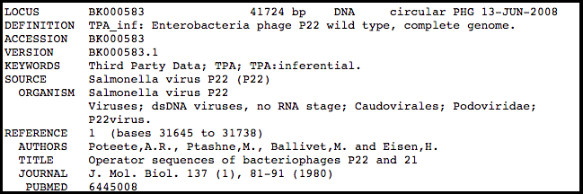

> * The feature table (starting with FEATURES) usually begins with a “source” type feature, which contains information about the chromosome/genome. Features consist of a feature type key on the left, and key-value pairs on the right formatted as */key=“Value…”*

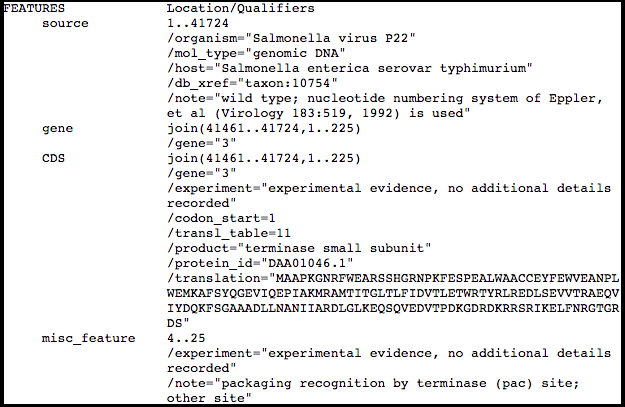

> * The sequence data, which is displayed as six separated columns of ten characters each, with the sequence index annotated on the left.

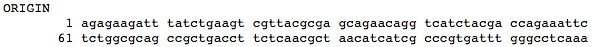

# Annotation Within Apollo

Continuing on to actually using Apollo, this section will go through an example annotation. Characteristics of the program will also be described to assist in the navigation of the program. There are two primary components to annotation:

1. Structural annotation, which consists of locations of genomic features, such as genes and terminators. Several gene callers will identify possible genes in the phage genome. Putative genes in Apollo will be annotated based on these results. See the [Structural Annotation Workflow Tutorial]({{ site.baseurl }}//topics/genome-annotation/tutorials/structural-annotation-workflow/tutorial.html) for more information. 
2. Functional annotation, which entails predicting gene functions based on multiple sources of evidence. To run the analyses to allow this prediction see the [Functional Annotation Workflow Tutorial]({{ site.baseurl }}//topics/genome-annotation/tutorials/functional-annotation-workflow/tutorial.html).

## Apollo in Galaxy - General Use

### 1. JBrowse in Galaxy

The CPT developed a tool called JBrowse-in-Galaxy (JiG), which allows the building of JBrowse instances within Galaxy; this contrasts with how JBrowse instances are traditionally configured, through a complex and manual process at the command line. 

The CPT uses JBrowse as a tool for displaying the results of a bioinformatic analysis in a standardized way; instead of having to digest and understand 20+ different report formats, images, output files, tables, etc., all of our analyses are presented as easy-to-grasp features in evidence tracks. As its input, Apollo takes complete JBrowse instances. To view any data in Apollo, a JBrowse instance needs to be configured first. On the far left side of the Galaxy web page is a “Tools” column with a search bar. Search [“JBrowse genome browser”](https://cpt.tamu.edu/galaxy/root?tool_id=jbrowse) and click on the synonymous link underneath “CPT: Genomic Viz.”

It is vital that the correct files are elected for the steps in the tool, otherwise the tool will not run. Once you’v created a JBrowse instance, it will appear in the history column on the left side of the Galaxy page. To see the JBrowse instance, click on the corresponding eyeball  symbol; clicking on the JBrowse instance step will reveal more details and options. If desired, clicking on the floppy disk symbol will save the JBrowse instance to the local device. This is typically unnecessary, as it will remain stored within the Galaxy history.

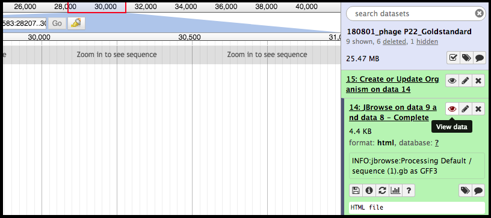

### 2. Moving Data From Galaxy to Apollo

With a complete JBrowse instance, data can now be channeled to Apollo. Data is built up in Galaxy in the form of a JBrowse instance, which is then pushed to the Apollo service in the *Create or Update Organism* step. Once annotations have been made on the organism’s genome in Apollo, the updated set of annotations can be exported into Galaxy, and then re-analyzed for another update in Apollo with the new results.

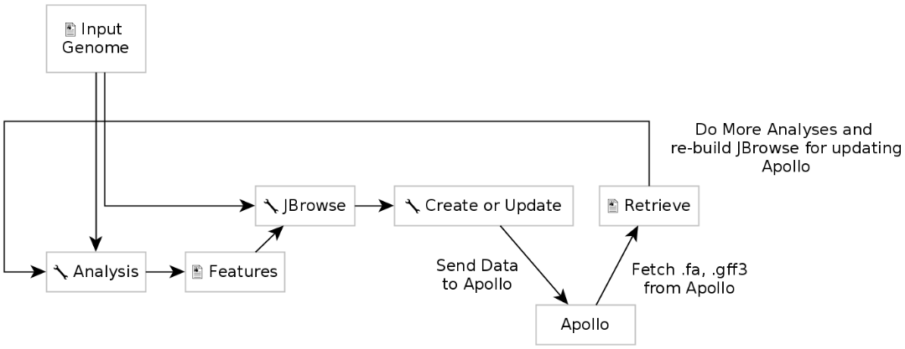

**Create or Update Organism** is a tool that allows for the creation/updating of an organism in Apollo with new data from Galaxy in the form of a JBrowse instance. The [Create or Update Organism](https://cpt.tamu.edu/galaxy/root?tool_id=edu.tamu.cpt2.webapollo.create_or_update) tool can be found using the search function in the Tools column in Galaxy, underneath “CPT: Apollo.”

> ###  Note that…
> You **_must_** fill out the Organism Common Name. If the phage is “P22,” it is recommended that
>    > * If possible, the FASTA file header reads *>P22* (and nothing else), and
>    > * “P22” is typed into the Organism Common name field in this tool.
> Like with the JBrowse Instance tool, if the fields are not filled correctly, the tool will *not* run, or will run *incorrectly*.
{: .tip}

Executing this step will transfer data to Apollo and produce a JSON (JavaScript Object Notation) file. The output JSON file contains some metadata about the organism. With the data available in Apollo, it can be accessed at [Apollo](https://cpt.tamu.edu/apollo/annotator/index); accessing Apollo requires logging into Galaxy. The genome can also be accessed via the “Annotate on data #” step in the history column by clicking the eye  symbol. The Annotate tool takes the JSON file from the **Create or Update Organism** step and loads Apollo directly in Galaxy.

### Navigating Through Apollo

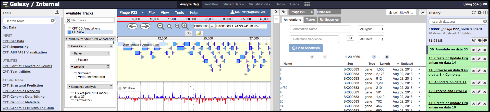

> ###  Maximizing Screen Space
> Having the gene tracks on in combination with the Apollo panel and the Galaxy columns can be overwhelming and distracting from the annotation. 
> * Small arrows in the bottom right corner of the History column and in the bottom left corner of the Tools column can be toggled to collapse the Galaxy columns and further expand the Apollo annotation screen. 
> * Clicking the arrow near the top right corner of the Apollo panel will close the right pane. 
> Display of the Available Tracks column on the left can be toggled by clicking the menu/hamburger icon on the right upper side.
> * The width for both side panels in Apollo can be adjusted by clicking and dragging the edge of the panel. 
> * Additionally, zooming down to the single gene level can greatly assist in focusing on annotation. 
{: .tip}

As depicted above, Apollo will present a two-pane display, surrounded by the Galaxy Tools and History columns on the left and right, respectively. On the left is an embedded JBrowse instance, and on the right is the Apollo annotator panel. JBrowse as embedded in Apollo is *slightly* different than a normal JBrowse; however, the movement controls are all the same:
> * the magnifying glasses will zoom in (+)/out (-) of the genome and its data.
> * the arrow icons will move upstream/downstream along the genome.
> * clicking/dragging on the red outlined box on the genome ruler (light grey box toward the top of the page, 0bp; 12,500 bp; 25,000 bp; etc.) will move to specific regions.
> * clicking/dragging anywhere else on the genome ruler will allow movement and zooming into that specific region.

> ###  Enhance Viewing Experience
> The menu bar at the top has useful options, some that aren’t available in “standard” JBrowse. **View** offers helpful adjustments to observing the genome within Apollo
> * “Color by CDS frame” is a popular option during annotation. It colors each coding sequence based on which reading frame it is in.
> * “Show Track label” facilitates annotation by removing the track’s labeling at the far left of the embedded JBrowse window. This allows for annotation of small features near the end of the genome, which would otherwise be hidden by the track label (e.g. “User-created annotations).
{: .tip}

The pale yellow track that is visible across the screen below the navigation controls is the User Created Annotations track. The called genes and other features exist here. Since gene features will be added to this track and edited, this track will *always* be visible.

In the Apollo panel on the right, there is a drop-down menu called the Genome Selector, and it will list all organisms available to the account in use.

Apollo uses the concept of ‘Organisms’ with ‘reference sequences’ below it. Each organism can have one or more reference sequences. In higher order organisms, those often correspond to multiple chromosomes. For phage uses they are most often used to correspond to different assemblies of the genome. For most projects, **only organisms with a single reference sequence will be worked on.**

On the left side of the embedded JBrowse instance is a checklist-like column titled “Available Tracks”. Here the evidence tracks currently available for the genome being analyzed are listed. Evidence tracks will appear upon the execution of structural and functional workflows, as well as other custom analyses.
The first evidence tracks used will be those from the structural workflow: *GeneMarkS*, *MetaGeneAnnotator*, and *Glimmer3*. Selecting these will display predicted genes below the User-Created Annotations Track.

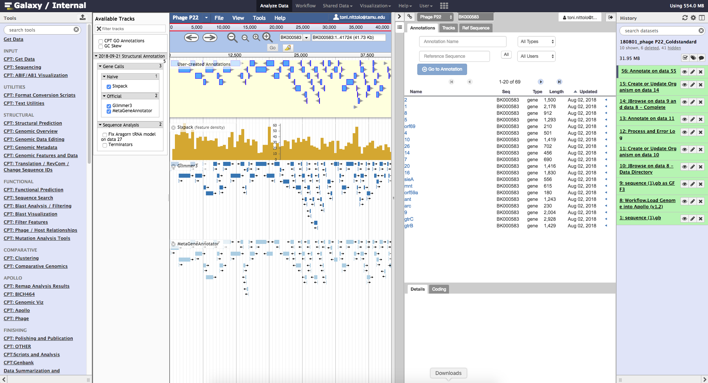

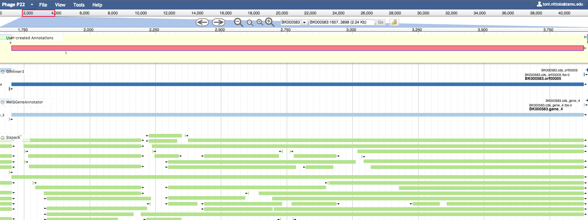

> ###  Note that…
> The examples above already have genes called in the User Created Annotations track; the phage P22 genome is already annotated. This **_will not_** be the case for a novel phage genome.
{: .tip}

At that level, comparison of the three gene models may occur to determine possible genes. Only one gene in the *MetaGeneAnnotator* track has an annotated Shine-Dalgarno (SD) sequence; the CPT filters all SD sequences to ensure only the high-quality sequences are visible. If an undesirable feature has been created/annotated, right-clicking on the feature will display many options; select “Delete.”

All changes made are instantaneously and immediately saved.

## Workflows

There are at least two standard workflows in the phage annotation pipeline that are run in Galaxy to allow annotation in Apollo. The first covers [structural annotation]({{ site.baseurl }}//topics/genome-annotation/tutorials/structural-annotation-workflow/tutorial.html) (genes, terminators, tRNAs), and the second starts the [functional annotation]({{ site.baseurl }}//topics/genome-annotation/tutorials/functional-annotation-workflow/tutorial.html) (BLAST, InterProScan, other protein databases).