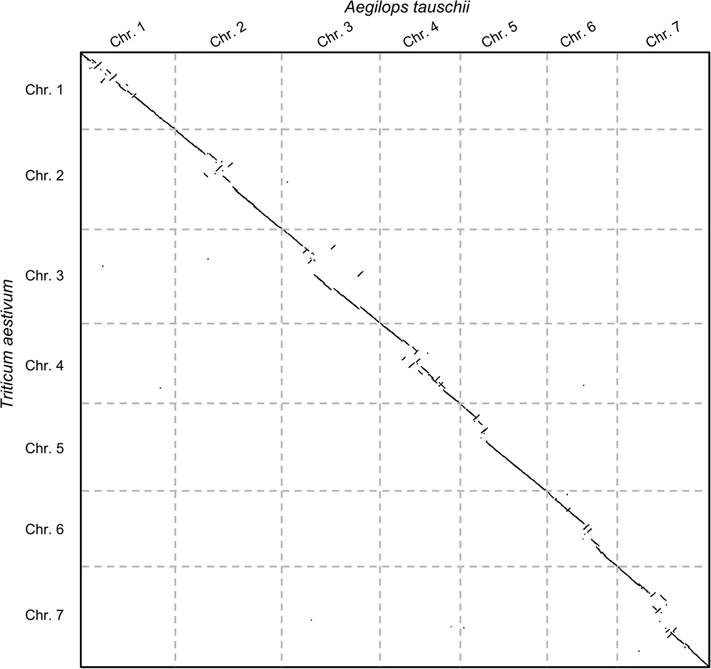
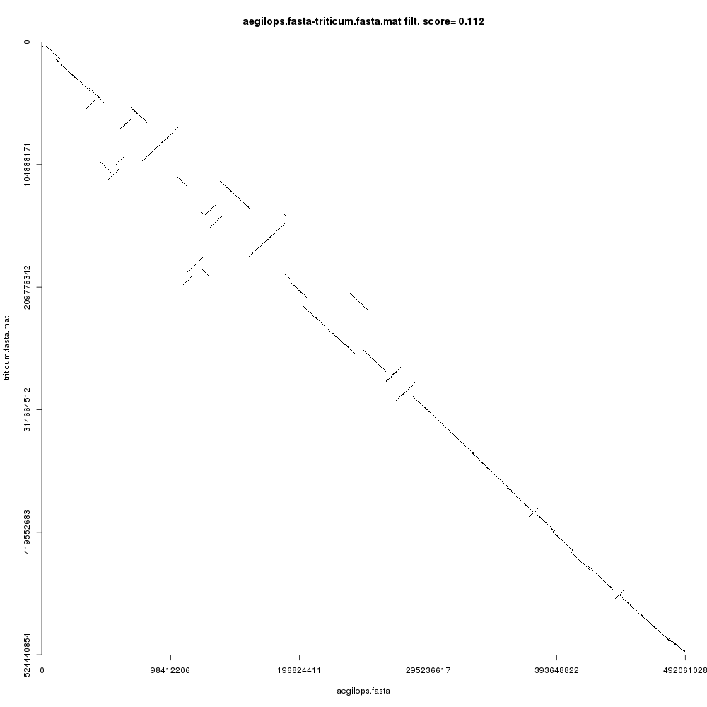

# Introduction


<!-- This is a comment. -->

Sequence comparison is a core problem in bioinformatics. It is used widely in evolutionary studies, structural and functional analyses, assembly, metagenomics, etc. Despite its regular presence in everyday Life-sciences pipelines, it is still not a trivial step that can be overlooked. Therefore, understanding how sequence comparison works is key to developing efficient workflows that are central to so many other disciplines.

In the following tutorial, we will learn how to compare both small and large sequences using both seed-based alignment methods and alignment-free methods, and how to post-process our comparisons to refine our results. Besides, we will also learn about the theoretical background of sequence comparison, including why some tools are suitable for some jobs and others are not.

This tutorial is divided into two large sections:

 - Fine-grained sequence comparison: In this part of the tutorial we will use `GECKO` () to perform sequence alignment between small sequences. We will also identify, extract and re-align regions of interest.
 - Coarse-grained sequence comparison: In this part of the tutorial, we will tackle on how to compare massive sequences using `CHROMEISTER` (), an alignment-free sequence comparison tool. We will generate visualization plots for the comparison of large plant genomes and automatically detect large-scale rearrangements.

> <agenda-title></agenda-title>
>
> In this tutorial, we will cover:
>
> 1. TOC
> {:toc}
>
{: .agenda}

# Fine-grained sequence comparison

Imagine you are working on an evolutionary study regarding the species *Mycoplasma hyopneumoniae*. In particular, you are interested in the strains `232` and `7422` and wish to compare their DNA sequence to know more about the evolutionary changes that took place between both. The workflow you will follow starts with (1) acquiring the data, (2)  getting it ready for Galaxy, (3) running the comparison and (4) inspecting and working with the resulting alignments. Let's go! 

## Preparing the data

First we will be uploading the data to Galaxy so that we can run our tools on it.

> <hands-on-title>Mycoplasma data upload</hands-on-title>
>
> 1. Create a new history for this tutorial and give it a descriptive name (e.g. "Mycoplasma comparison hands-on")
>
>    
>    
>
> 2. Import `mycoplasma-232.fasta` and `mycoplasma-7422.fasta` from [Zenodo](https://zenodo.org/record/4485547#.YBj8XHmCGUk).
>
>    ```
>    https://zenodo.org/record/4485547/files/mycoplasma-232.fasta
>    https://zenodo.org/record/4485547/files/mycoplasma-7422.fasta
>    ```
>
>    
>
>    As default, Galaxy takes the link as name, so rename them.
>
> 3. Rename the files to `232.fasta` and `7422.fasta` and change the datatype if needed to `fasta` (Galaxy will auto-discover the format of the files).
>
>    
>    
>
{: .hands_on}

If you were successful, both sequences should now be available as `.fasta` datasets in your history.


> <question-title></question-title>
>
> 1. What do you think about the size of the sequences in regards to the difficulty of comparing them? (You can check the size of the files by clicking on the information icon)
>
> > <solution-title></solution-title>
> > 1. It always depends on the focus of our study. For instance, if we were looking for optimal alignments, two 1 MB sequences are indeed large enough to make most approaches either fail or take a decent amount of time and resources. On the other hand, if we were looking for seed-based local alignments (e.g. `GECKO` or `BLAST` () ), the comparison would require merely seconds (check the slides for more information).
> >
> {: .solution }
>
{: .question}

As we discussed in the previous section, running optimal aligning tools on such "small" data can be difficult (in fact, tools such as the well-known `EMBOSS needle` will require cuadratic amounts of time and memory, whereas tools such as `EMBOSS strecher` will require quadratic time ()). These limitations can make it impractical in many situations. Therefore, we will now learn how to overcome these limitations by employing seed-based methods, particularly `GECKO`.

## Running the comparison

We will now run a comparison between *Mycoplasma hyopneumoniae 232* and *Mycoplasma hyopneumoniae 7422* in Galaxy using `GECKO`.

> <hands-on-title>Comparing two mycoplasmas with GECKO</hands-on-title>
> 1.  with the following parameters
>    -  *"Query sequence"*: `232.fasta`
>    -  *"Reference sequence"*: `7422.fasta`
>    - *"K-mer seed size"*: `16`
>    - *"Minimum length"*: `50`
>    - *"Minimum similarity"*: `60`
>    - *"Generate alignments file?"*: `Extract alignments (CSV and alignments file)`
> 2. Check out the files that have been generated, i.e. the `CSV` and the `Alignments` file. 
>    > <question-title></question-title>
>    >
>    > 1. What information is provided in the `CSV` file?
>    > 2. And in the `Alignments` file?
>    > 3. What happens if we re-run the experiment with other parameters (e.g. change `Minimum length` to `5000` and `Minimum similarity` to `95`)?
>    >
>    > > <solution-title></solution-title>
>    > > 1. The `CSV` file contains a summary of the detected High-Scoring Segment Pairs (HSPs) or alignments. The file is divided in a few rows of metadata (e.g. containing the sequence names) and one row per alignment detected. Check out the `GECKO` help (bottom of the tool  page to know what each column does!
>    > > 2. The `Alignments` file contains the actual regions of the query and reference sequence for each alignment detected. With this file, you can investigate individual alignments, find mutations and differences between the sequences, extract the aligned part, etc.
>    > > 3. Changing the parameters affect the number of alignments GECKO will detect. In fact, if we use parameters that are too restrictive, then we might not get any alignments at all! On the other hand, if we use parameters that are too permissive, then we might get a lot of noise in the output. Thus, it is very important to understand what the parameters do. Never leave your parameters default, always know what they do! Check out the help section to get information about the parameters.
>    >  {: .solution }
>    {: .question} 
>
>    > <comment-title>Note about parameters</comment-title>
>    > 1. Besides the `minimum length` and `minimum similarity` parameters, which are applied as a filter after the comparison is completed, the `k-mer seed size` is an internal parameter that regulates the number of seeds that can be found. A smaller `k-mer` size will translate into detecting more seeds, which are starting points for alignments.
>    > 2. Notice that this parameter must be taken into account depending on the type of sequence that we are working with. For example, if we set `k-mer seed size` to `32`, then `GECKO` will attempt to find alignments that start with 32 consecutive, equally aligned base pairs between the two sequences. If your sequences are far away from each other (in terms of evolutionary distance) then it will be very hard to find such 32 consecutive base pairs!
>    > 3. Some advice: this parameter can affect performance greatly. For instance, setting `k-mer seed size` to `8` in the case of chromosomes can require much more computing time than using for instance `32`. On the other hand, if we set it to `32` in the case of small bacterial sequences, we might not find any alignments!
>    {: .comment}
>
{: .hands_on}

## Post-processing: extracting alignments

We will now use additional tools to post-process our alignments. Consider the case where you are interested in a set of DNA repeats located at a given position in the sequences. 

> <comment-title>Note about interactive exploration of alignments</comment-title>
> In a different scenario where e.g. you do not know what to look for or need to find the location of particular alignments, and you need an interactive exploration, you can also use `GECKO-MGV` to ease the process. `GECKO-MGV`generates a visual representation where you can zoom in and out of the alignments, select and export as FASTA, etc., find more in the `GECKO-MGV` article () or run it with a dockerized container from [here](https://github.com/estebanpw/docker-geckomgv).
{: .comment}


For our current experiment, we will be looking for the following set of repeats:

 Sequence comparison between <em>Mycoplasma hyopneumoniae</em> 232 and 7422. (Right) Zoomed-in region where the repeats of interest are located.")

Let's extract the repeats highlighted in red (Figure 1, right) which are aligned to the position 19,610 in the query sequence and perform a multiple sequence alignment on them to check if there are any evolutionary differences. The sequences will be extracted from the reference (i.e. *Mycoplasma hyopneumoniae 7422*) since this is where the repeats duplicate in respect to the query sequence (notice that in Figure 1 we are selecting the ones stacked vertically).

### Extracting repeat alignments and running Multiple Sequence Alignment

> <hands-on-title>Multiple Sequence Alignment of a set of repeats</hands-on-title>
> 1. Search for the tool  and run it with the following parameters
>    -  *"File to process"*: `Gecko on data 2 and 1: Alignments` (Note: if you have run the previous experiment with different parameters, make sure to select here the alignments file corresponding to the first experiment, and make sure you ran it with the same parameters!)
>    - *"AWK Program"*: `BEGIN{FS=" "} /@\(196[0-9][0-9]/ { printf(">sequence%s%s\n", $(NF-1), $NF); getline; while(substr($0,1,1) != ">"){ if(substr($0,1,1) =="Y"){ print $2; } getline; } } ` (Paste this code into the text box)
>    
>    > <comment-title>Note about AWK</comment-title>
>    > Although the AWK script looks a bit threatening, it is very simple:
>    >  - The `BEGIN{FS=" "}` tells it to separate fields by a space.
>    >  - The `/@\(196[0-9][0-9]/` is a regular expression that indicates we are looking for a line containing the string `@(196xx` where `xx` are two random digits between 0 and 9. This is used to identify the repeats that start at coordinates 19,600 to 19,699.
>    >  - The previous regular expression triggers an action. The first part `printf(">sequence%s%s\n", $(NF-1), $NF); getline` prints out the sequence ID along with the coordinates and moves on to the next line.
>    >  - The second part `while(substr($0,1,1) != ">"){ if(substr($0,1,1) =="Y"){ print $2; } getline;` scans the next lines and prints the nucleotide sequence corresponding to the `Y` sequence (the reference), up until a `>` is found, which means we are done with the sequence.
>    {: .comment}
>
> 2. Change the name of the output file `Text reformatting on data ...` to `repeats` Change the datatype to `.fasta`.
>
>    
>    
>
> 3.  with the following parameters
>    -  *"FASTA file"*: `repeats.fasta`
>    - *"Data type"*: `DNA nucleotide sequences`
>    - *"Output alignment format"*: `Native Clustal output format`
>    - *"Show residue numbers in clustal format output"*: `No`
>    - *"Output order"*: `Aligned`
>    - *"Output complete alignment"*: `Complete alignment`
>
> 4. Inspect the output file `ClustalW on data ... clustal`.
>    - The file is divided into several blocks.
>    - Each block contains the next 50 contiguos nucleotides of each alignment in one line per sequence.
>    - Gaps are included.
>    - The asterisk symbol `*` indicates that there is consensus across all sequences in the current position.
> 5. Another file `ClustalW on data ... dnd` is also generated which can be used to view the output alignment as a tree.
>
{: .hands_on}

Your output alignment file `ClustalW on data ... clustal` should look similar to the following one (click on ) :

```
CLUSTAL 2.1 multiple sequence alignment


sequence@_19610_31252_      AAAATAAAATCAGAATTTCGTGAAAAAGCACGTAAAATAGCGACTCTTTG
sequence@_19610_28814_      AAAATAAAATCAGAATTTCGTGAAAAAGCACGTAAAATAGCGACTCTTTG
sequence@_19610_25551_      AAAATAAAATCTGAATTTCGCGAAAAAGCACGTAAAATACCGACTCTTTG
                            *********** ******** ****************** **********

sequence@_19610_31252_      TTTTTCACCACCGGATAAATCTTTGACTTGTTGGTTTAGTTTGTCATTTT
sequence@_19610_28814_      TTTTTCACCACCGGATAAATCTTTGACTTGTTGGTTTAGTTTGTCATTTT
sequence@_19610_25551_      TTTCTCGCCACCCGATAAATCTTTGACTTGTTGATTTAGTTTTTCATTTT
                            *** ** ***** ******************** ******** *******

sequence@_19610_31252_      CGATATTGAGGAAATTTGCACTTTTTTCAAGTAAGACTTGGTCAAATTCC
sequence@_19610_28814_      CGATATTGAGGAAATTTGCACTTTTTTCAAGTAAGACTTGGTCAAATTCC
sequence@_19610_25551_      CAATATTAAGAAAATTTGCTCTTTTTTCAAGCAAATTTTGATCAAATTCT
                            * ***** ** ******** *********** **   *** ******** 

sequence@_19610_31252_      CTTTTAATTATGTTATTTCCAATTAAAATATTATTTTTAACCGATAAATT
sequence@_19610_28814_      CTTTTAATTATGTTATTTCCAATTAAAATATTATTTTTAACCGATAAATT
sequence@_19610_25551_      TTTTGAATTAAGCTATTTCCAATTAAAATATTATTTTTAACAGAAAGATT
                             *** ***** * **************************** ** * ***

sequence@_19610_31252_      CTCAATCAAATTAAAATCTTGAAAAACTACATCAATTAAAGGGTTTTTTT
sequence@_19610_28814_      CTCAATCAAATTAAAATCTTGAAAAACTACATCAATTAAAGGGTTTTTTT
sequence@_19610_25551_      TTCAATTAGGTTAAAATCCTGAAAAACTACATCAATTAAAGGATTTTTTT
                             ***** *  ******** *********************** *******

sequence@_19610_31252_      CTTCTTTACCTT
sequence@_19610_28814_      CTTCTTTACCTT
sequence@_19610_25551_      CTTCTTT-----
                            *******     

```
We can see that there are several locus along the duplicated repeats where single point mutations have taken place, and that the ending of the last repeat is missing.


So far we have learnt how to run our own custom sequence comparison, extract a set of DNA repeats and perform multiple sequence alignment on them (MSA). While this represents an common example of a bioinformatics pipeline, in the next part of the tutorial we will jump to a large-scale comparison scenario where we do not need fine-grained alignments, but instead we will be looking at the "bigger picture" using alignment-free methods. 

# Coarse-grained sequence comparison

In this second part of the tutorial, we are going to work with chromosome-sized sequences. While we can still use `GECKO` for chromosomes, it will take some more time and resources. However, consider now the case where you do not need alignments, but rather are in one of the following cases:

- You are working with a very large *de novo* assembly genome for which you do not know the strain and thus you need to compare it to several candidates. 
- You want to study large evolutionary rearrangements at a block level rather than alignment level at several species at once.
- You want to generate a dotplot between several massive chromosomes from e.g. plants to find the main syntenies, but your sequences are full of repeats and other computational approaches fail.

As you can imagine, all three scenarios require several large-scale sequence comparisons. While there are also other ways to approach these situations, in this tutorial we will learn how we can use `CHROMEISTER` which is specifically designed for large-scale genome comparison without alignments (alignment-free method).

## Introduction

Before jumping on the hands-on, let us see an example of the second case: say we wanted to study the evolutionary rearrangements between the grass and common wheat genomes (*Aegilops tauschii* and *Triticum aestivum*). The following plot shows the comparison:



Now there are some things to note here: (1) these alignment-free comparisons can be performed very quickly, (2) we can visually see the large rearrangements and (3) we can identify which chromosome comparisons actually have any signal. This last point is interesting because it allows us to use `CHROMEISTER` to quickly identify which comparisons are worth to perform with more accurate tools and avoid lots of unnecessary computation (in this case only the diagonal has similarity, but it might not be the case, *e.g.* *Homo sapiens* and *Mus musculus*).

Let us now jump into the hands-on! We will learn how to compare chromosomes with `CHROMEISTER`, particularly from the grass and common wheat genomes, which are nearly 5 times larger than the average human chromosome!

## Preparing the data

> <hands-on-title>Chromosome data upload</hands-on-title>
>
> 1. Create a new history for this tutorial and give it a descriptive name (e.g. "Chromosome comparison hands-on")
>
>    
>    
>
> 2. Import `aegilops_tauschii_chr1.fasta` and `triticum_aestivum_chr1.fasta` from [Zenodo](https://zenodo.org/record/4485547#.YBj8XHmCGUk).
>
>    ```
>    https://zenodo.org/record/4485547/files/aegilops_tauschii_chr1.fasta
>    https://zenodo.org/record/4485547/files/triticum_aestivum_chr1.fasta
>    ```
>
>    
>
>    As default, Galaxy takes the link as name, so rename them.
>
> 3. Rename the files to `aegilops.fasta` and `triticum.fasta` and change the datatype to `fasta` if needed.
>
>    
>    
>    > <comment-title>Note on the name of the chromosomes</comment-title>
>    > Please notice that these chromosomes are not labelled as "chromosome 1" at their original sources. We have renamed them for simplicity.
>    {: .comment}
>
{: .hands_on}

> <question-title></question-title>
>
> 1. We already discussed the mycoplasma sequences in regards to their size. What do you think about the size of the two chromosomes that we will be comparing now from a computational standpoint?
>
> > <solution-title></solution-title>
> > 1. Chromosome-like sequences are arguably some of the largest DNA sequences you can find. Regarding the comparison, optimal chromosome comparison typically requires either large clusters to be run or special hardware accelerators (such as GPUs). On the other hand, for seed-based local alignment we can still use common approaches, but they will take a considerable amount of time. Finally, if we use alignment-free methods such as `CHROMEISTER`, we can perform a comparison in few minutes (check the slides for more information) instead of hours.
> >
> {: .solution }
>
{: .question}

## Running the comparison

> <hands-on-title>Comparing two plant chromosomes with CHROMEISTER</hands-on-title>
> 1.  with the following parameters
>    -  *"Query sequence"*: `aegilops.fasta`
>    -  *"Reference sequence"*: `triticum.fasta`
>    - *"Output dotplot size"*: `1000`
>    - *"K-mer seed size"*: `32`
>    - *"Diffuse value"*: `4`
>    - *"Add grid to plot for multi-fasta data sets"*: `No`
>    - *"Generate image of detected events"*: `Yes`
> 2. Run the job and wait for the results. It should take around ~3 minutes.
> 3. Let's inspect the output files:
>    - *"Comparison matrix"*: This file is the "core" of the comparison. It contains the heuristically matched seeds sampled per section of the chromosomes. This file is used for custom post-processing.
>    - *"Comparison dotplot"*: This file is a `.png` image representing the pairwise comparison. 
>    - *"Comparison metainformation"*: This CSV file contains information about the comparison such as name of the sequences compared, length, etc. It is particularly useful when using multi-fasta inputs. 
>    - *"Detected events"*: This CSV file contains information regarding rearrangements automatically detected. 
>    - *"Detected events plot"*" This file is a `.png` image showing the detected events. 
>    - *"Comparison score"*: This text file contains the scoring distance between the query and the reference.
>
>    > <comment-title>About parameters</comment-title>
>    >
>    > Some of the parameters used in `CHROMEISTER` are similar to those in `GECKO`, but others are new, in particular:
>    > 1. *"Output dotplot size"*: This number represents the width and height of the resulting comparison plot, but it also affects the degree of precision with which alignment-free blocks are calculated. A value of `1000` is adequate for mostly everything (resulting in a `1000x1000` output doplot), but for extremely large sequences a value of `2000` will yield more resolution since less blocks will be grouped together. 
>    > 2. *"K-mer seed size"*: This value is the same as in `GECKO`. Generally, `32` is a good choice for any sequence that is not very small such as the mycoplasmas from the previous part of the tutorial, which were around 1 Mbp in size.
>    > 3. *"Diffuse value"*: This parameter regulates the stringency with which alignment-free seeds are matched. A diffuse value of `1` means perfect matching, whereas a value of `4` means match only a fourth of the seed (taken in uniform steps). The value of `4` is recommended for everything except when signals start to deteriorate in large comparisons with plenty of repeats.
>   > 4. The *"Add grid to plot for multi-fasta data sets"* parameter adds grid lines to the plot to separate multiple sequences. This is useful when using multi-fasta inputs.
>   > 5. The *"Generate image of detected events"* parameter will include, if enabled, a plot of the rearrangements detected with colors, one per type of rearrangement. More on that later!
>    {: .comment}
>    >
>
{: .hands_on}


Your `Comparison dotplot` file (remember to inspect each using the  icon) should look like this: 



Figure 3 shows the comparison plot for the plant chromosomes. Notice that the origin of both sequences is at the top-left and the ending is at the bottom-right of the plot. Noise and small repeats are filtered out automatically by `CHROMEISTER` to allow focusing on where the main similarity blocks are located. We can see that there three types of blocks:

- Blocks that are "conserved" are on the main diagonal. This means that the sequences are similar (in a coarse-grained fashion) in such regions.
- Blocks that are inverted are on the antidiagonals, i.e. rotated 90 degrees. These blocks show sequence regions that have been reversed and rearranged into the complementary strand.
- Blocks that are not in the main diagonal are "transposed", meaning that they have been rearranged in one of the sequences but not in the other. These can also be inverted.

> <comment-title>Note on the comparison plot</comment-title>
Notice that the comparison plot is only an approximation. It is aimed at showing the general location and direction of syntenies. For example, if `CHROMEISTER` was run with parameter **Output dotplot size** equal to `1000`, then each pixel in the plot contains the averaged information of nearly 500,000 base pairs! Thus, any block can contain lots of smaller rearrangements, mutations, inversions, etc., that are ignored for the sake of providing a clean overview of the general alignment direction in a pairwise comparison.
{: .comment}

Also note that a `score` value can be seen in the title of the plot (this value is also available in the **Comparison score** file). This value is calculated based on the alignment coverage and number of rearrangements and can be used to automatically filter out similar from dissimilar sequence comparisons. A value of `0` means that the sequences are nearly equal (rearrangement-wise), whereas a value closer to `1` means that the sequences are more dissimilar.

## Post-processing: detecting rearrangements

Let us now see how the blocks detected in the comparison are automatically classified for further processing. Figure 4 shows the blocks detected heuristically from the comparison and classified according to their position and orientation. This plot is available in the file **Detected events plot**.

, inverted blocks (green) and transposed blocks (blue)")

In Figure 4 we can see a similar plot to that in Figure 3 but with the addition of colors. Each detected block is labelled according to whether it is in the main diagonal (red), transposed (blue) or inverted (green). Inverted transpositions are also labelled green. Notice that this automatic classification process is based on the Hough transform () which is governed by a set of parameters which can therefore affect the sensitivity of the detection of blocks, and hence some blocks can be missed.

Each of these blocks is also available in the `CSV` file **Detected events**. Let us take a peek:

```
xStart,yStart,xEnd,yEnd,strand,approximate length,description
189935556,218167395,202237082,205056373,f,12301526,conserved block
...
156475406,165723309,175173725,185127621,r,18698319,inversion
...
208633875,239669470,213062425,234949502,f,4428550,transposition
...
86602740,73946160,103332815,91252708,r,16730075,inverted transposition
```

The header line describes each column. `xStart` and `xEnd` are the starting and ending coordinates in the query sequence, wheras `yStart` and `yEnd` are the same but for the reference sequence. The strand can be either `f` for the forward strand or `r` for the reverse strand. Notice that the length of the block is approximate, since it is an estimation based on the length of the line and transformed by the length of each sequence. The `description` column contains the label of the detected event. The four possible types (conserved block, inversion, transposition or inverted transposition) are shown above with examples.

Besides providing a visual understanding of the large rearrangements that took place between two sequences, the detection of blocks can be further used to research evolutionary distances, for instance by incorporating the number of Large Scale Genome Rearrangements to generate richer metrics in phylogenetic studies.

# Conclusion


From a pratical perspective, we have shown how to run pairwise genome comparisons using Galaxy, from small to large-scale sequences (in particular bacterial mycoplasmas and plant chromosomes) throughout two levels of precision:

- Using `GECKO` to detect High-scoring Segment Pairs, which can be used to find fine-grained alignments such as repeats, genes, synteny blocks, etc.
- Using `CHROMEISTER` to find large-scale conserved blocks, which enables us to look at the "big picture" of a comparison as well as study its large-scale rearrangements.

Moreover, we have described how we can use additional tools to post-process our comparisons, including extraction of alignments, multiple sequence alignment, automatic detection of rearrangements, dotplot visualization, etc. Additionally, we recommend taking a look at `GECKO-MGV` (), a tool for the interactive exploration of sequence comparisons produced with `GECKO`.

On the other hand, from a theoretical standpoint, we have discussed why sequence comparison is a difficult problem, how the length of the sequences can affect runtimes, the complexity of the algorithms, impact of parameters, etc., in order to give researchers a broader understanding of how to use sequence comparison algorithms for their scientific experiments (more details in the slides).


