# CPT Galaxy

Galaxy is a platform for doing reproducible bioinformatics research. It provides a friendly interface to vast number of complex command line tools, and it encourages consistent science by using identical software and interfaces across all Galaxy instances. Galaxy aims to make computational biology accessible to research scientists that may not have computer programming or system administration experience. The [Center for Phage Technology (CPT)](https://cpt.tamu.edu/) utilizes Galaxy for all computer-based analysis. Long-running jobs can be launched while a scientist returns to their lab work; meanwhile, Galaxy keeps track of the progress of the analysis and automatically saves the work done up until that point.

The Galaxy interface consists of three panels; on the left is a column containing all available tools. In the center is where analysis will occur and resulted viewed. On the right is the current history and ability to access other available histories.

> ###  Note that…
> If the user is lost within the program, clicking **Analyze Data** within the blue bar at the top will return the user to the Galaxy home page. Refreshing the page will also return one to the home page without losing any work done up until that point; Galaxy automatically saves all progress.
{: .tip}

> ### Agenda
>
> In this tutorial, the following Galaxy characteristics will be reviewed:
>
> 1. Tools
>    > * Uploading Data
>    > * Choosing and Executing a Tool
> 2. Histories
>    > * Datasets
>    > * Naming Histories
>    > * Switching Histories
> 3. Workflows
>    > * Importing a Workflow
>    > * Running a Workflow
>
{: .agenda}

# Tools

> ###  What is a Galaxy Tool?
>    > ###  A Galaxy tool is…
>    > … something that generates/transforms data. Within Galaxy, tools are simple interfaces to the complex software behind them. Some examples of a tool would be Gene Caller, which reads the genome and yields a list of possible gene locations, or BLAST, which searches protein sequences in the genome against a database.
>    {: .solution}
{: .question}

## Uploading Data

Nearly all Galaxy tools process input files and produce output files. To upload data from the user’s local device, click on the upload symbol in the top right-hand corner of the Tools column.

This will bring up an upload menu that will allow the import of data into Galaxy. Files can be dragged and dropped into this box; alternatively, clicking on **Choose local file** in the bottom menu enables the browsing of files on the local device for upload.

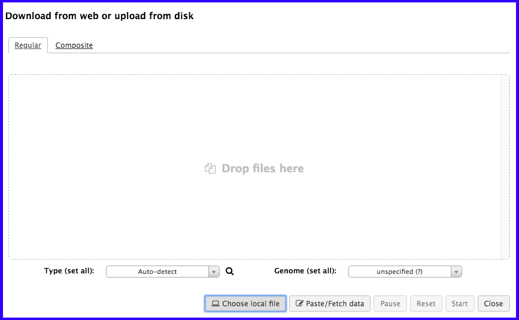

> ###  Advanced Users…
> * **Choose FTP file** allows one to select a file that has been previously uploaded via FTP. *This is required for files >2GB*.
> * **Paste/Fetch data** allows one to paste in a bit of text or a URL. Galaxy will import that into the history panel on the right.
> * [This tutorial](https://galaxyproject.github.io/training-material/topics/introduction/tutorials/galaxy-intro-ngs-data-managment/tutorial.html) offers many different examples of various means of uploading data into Galaxy.
{: .comment}

Once the file has been detected by Galaxy, it will appear in the upload window.

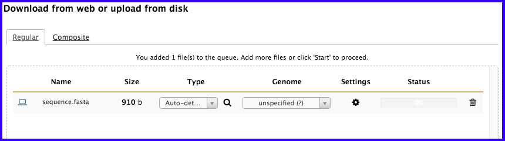

> ###  File Format Issues?
> If Galaxy does not detect the file type properly, the user can set the file type. Although it is a rare occurrence, be sure to double check the file is formatted properly before overriding Galaxy.
{: .tip}

When all of the files desired to be uploaded have been selected, click **Start** in the bottom right of the upload menu. The dataset will indicate to you that it is uploaded in the upload window by yielding a 100% status; at this time, the window can be closed. In the history column, the freshly uploaded dataset will be grey with a clock symbol…

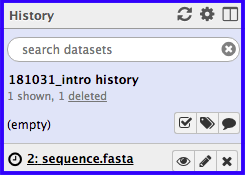

… followed by green when it is ready.

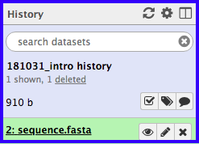

## Choosing and Executing a Tool

There is now data in Galaxy that is ready to be processed by one of many available tools! At the top of the tool panel is a search bar. Alternatively, clicking one of the bold, underlined selections will reveal multiple tools of a certain type which the user can choose from. When selecting the tool, be sure to read the *What it does* text at the bottom of the tool interface page that appears; it will give the user important information regarding running the tool and the consequences of it.

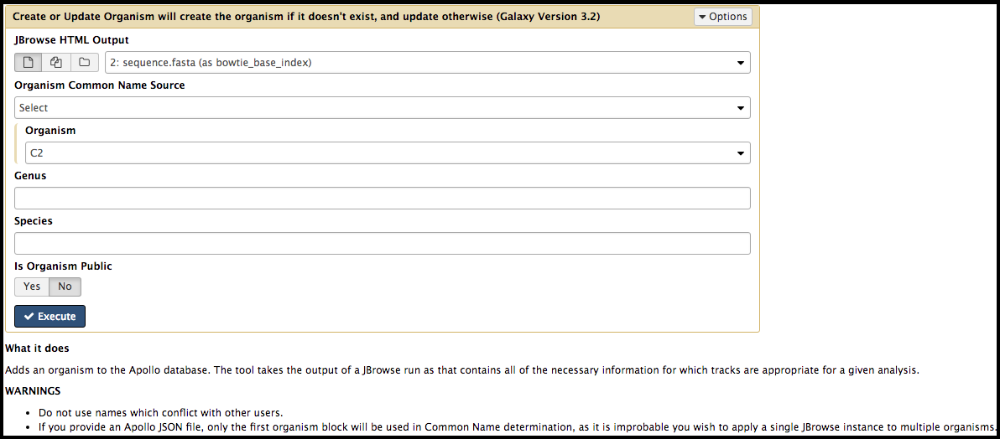

Review the options in the tool interface. Keep in mind that many options are set to default values. Uploaded files or other datasets in the current history can be used as inputs. When configuration of the tool is complete, **execute it**, and it will appear as a set of output files in the history on the right.

# Histories

Histories are used to separate out analyses and help keep track of what tools have been run. All analyses will be stored in the histories.

## Datasets

Each numbered entry within a history is called a *dataset*. Tool/workflow outputs and data uploads appear as datasets in the current history.

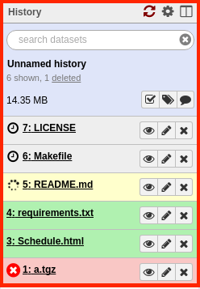

Datasets can be one of four colors:
> * Grey = the tool has been submitted but has not yet begun processing.
> * Yellow = the tool is currently running
> * Green = a successful execution of the tool
> * Red = a failed execution of the tool

> ###  Failed Tools
> Sometimes tools fail and turn red; it likely is not the fault of the user. Clicking on the name of the dataset will open details about the tool.
>
> 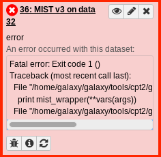
>
> Selecting the bug icon in the bottom left-hand corner will bring up a page in the main Galaxy interface. There, a message can be typed and report submitted.
{: .comment}

There are useful features within a dataset. Clicking on the name of a collapsed dataset will open the expanded view.

Near the top, the format is detailed to be *tabular*. At the bottom of the expanded datasets is a preview of this table. Galaxy keeps track of file formats to ensure only correctly-formatted data is used for tools.

> *  views the dataset
> *  modifies the metadata
> * **X** deletes a dataset (these can be recovered! See below.)
> *  downloads the dataset to the local device; note that Galaxy will always have a hard copy.
> *  views details about the tool that was run, and how it was configured.
> *  is commonly used, as it re-runs the tool with the same parameters configured. Additionally, these parameters may be tweaked before re-running.
> *   presents the dataset in different ways. Charts allow the user to build graphs from the tabular dataset, and a Multiple Sequence Alignment (MSA) visualization plugin in Galaxy allows for interactive exploration of MSAs.
> *  allows for the annotation of datasets with tags.
> *   allows the user to comment on a dataset; this could be a reminder of why it was executed, or perhaps to annotate interesting results found in the output.

> ###  Recovering Deleted Datasets
> Deleted datasets are not permanently removed from the history, and can be recovered. At the top of the history is a count of deleted and hidden datasets. Clicking on *deleted* will reveal the deleted datasets.
>
> 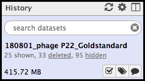
>
> The revealed, deleted datasets will have two options; selecting *Undelete it* will allow the dataset to re-appear in the standard history.
>
> 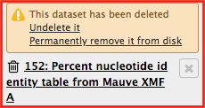
{: .hands_on}

## Organizing Histories

It’s good scientific practice to maintain organized records; this translates to [CPT](https://cpt.tamu.edu) Galaxy histories and workflows. Clicking on the name of the history will allow for editing of the name. Hit *Enter* to save the new name. A good name for a history may include the date and the name of the phage being worked on.

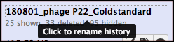

To help keep track of progress on a phage, it is advised to create a new history the running a new set of analyses; this could be assembling/annotating a genome, or executing comparative analysis between phages. Another organization option is to change the name of the first dataset after a workflow/tool has been run.

> ###  Re-naming Datasets
> Click on the  symbol in the first dataset of the workflow. This will bring up some editable details in the main Galaxy interface.
>
> 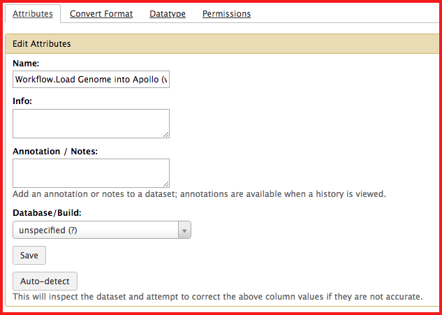
>
> There, the name can be changed. It is advised to change the name of the dataset to the workflow/tool that was run (including the version), and the date executed.
{: .hands_on}

## Switching Histories

There are three icons in the top right-hand corner of the History panel. The  will refresh the current history. The  shows advanced history options. The two-panel icon allow you to view and switch between different histories. Clicking on this reveals the different histories.

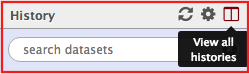

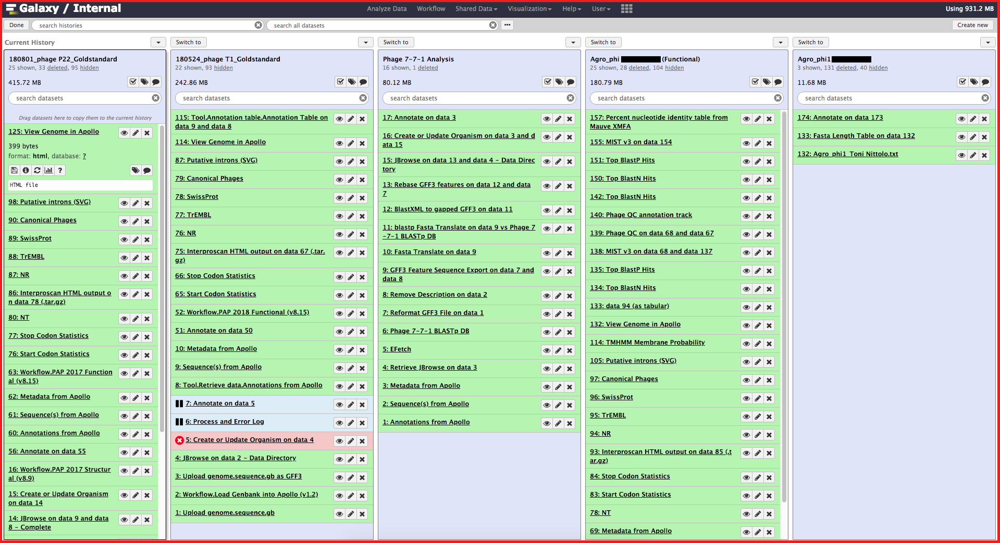

On the left is the current history, and all histories on the right are other histories. The **switch to** button will set that history as the current history. At the top left-hand corner is a **done** button, which will exit this view when complete. Any analyses run will be done in that history.

# Workflows

> ###  What is a Workflow?
>    > ###  Workflows are…
>    > … merely collections of jobs, where some jobs depend on the outputs of *other* jobs. Workflows solve numerous problems, such as:
>    > * **Running tools immediately.** The next step can begin as soon as data is available; a human does not have to manually start it.
>    > * **Discarding useless data.** In the example below, most likely only the output BLASTp results are desired, and not the storing of intermediate files forever.
>    > * **Simplification of interfaces.** Workflows hide the complexity of many Galaxy tools. The users like uninterested in the extraction of features from a GFF3 file, and then the translation of those to protein sequences.
>    {: .solution}
{: .question}

Say a task has been presented, such as follows:
> * Loading data from Apollo
> * Extract all of the genes as DNA sequences
> * Translate said DNA sequences to protein sequences
> * Run those protein sequences through BLASTp

Doing these tasks one by one would mean keeping track of *at least* 4 files. The user would have to wait for one tool to finish before executing the next one. This is where workflows come in handy:

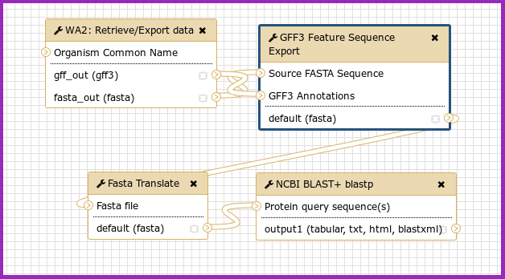

## Importing a Workflow

Often times, a workflow will need to be imported for it to be used. Select the *Shared Data* drop-down menu at the top of the galaxy interface, and Select *Workflows.* This will bring up a page of all of the available workflows in [CPT](https://cpt.tamu.edu) Galaxy.

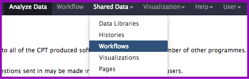

Find the workflow of interest, select the down arrow, and click *Import.* Each workflow has a short description of what it does on the right, as well as the owner and date of last update. It is advised to use the most recent version of the desired workflow.

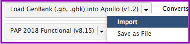

The imported workflow will then become available for use under the *Workflow* menu at the top of Galaxy (to the right of *Shared Data.*)

## Running a Workflow

In the collection of workflows, click on the down arrow of the desired workflow, and select *Run.*

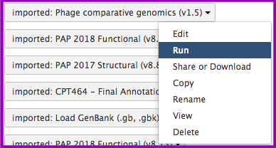

The workflow interface page will appear; this can feel a little overwhelming, especially as a beginner. For a large part, the parameters are pre-configured. Some inputs may need to be manually adjust day the user. Ask the [CPT](https://cpt.tamu.edu) staff and IT management (cpt@tamu.edu) if there is confusion about the necessary inputs.

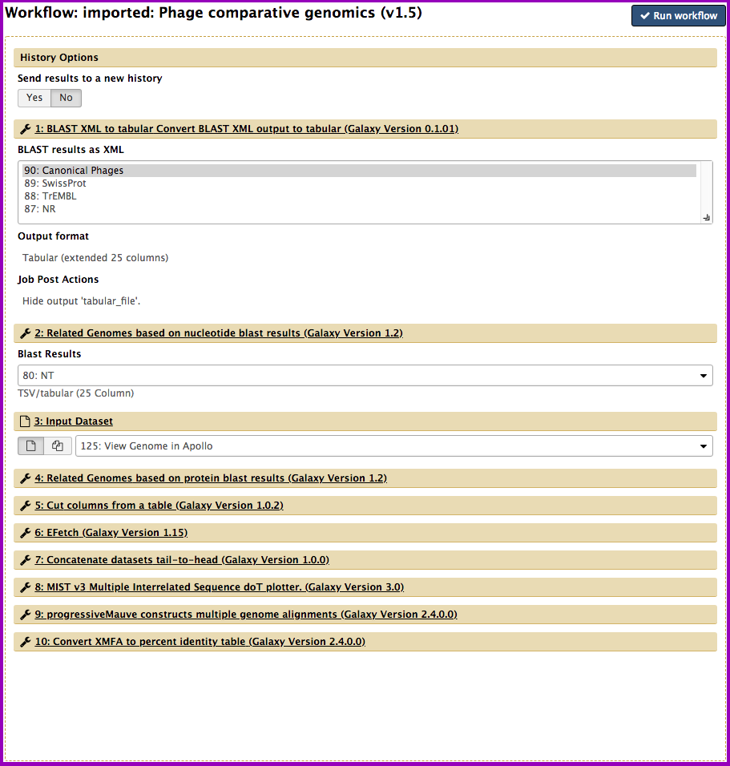

When ready, click the *Run workflow* button at the top in order to launch the workflow.