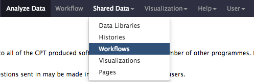
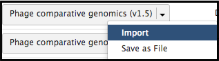
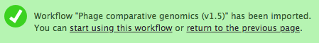
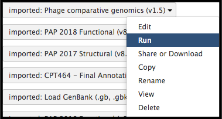
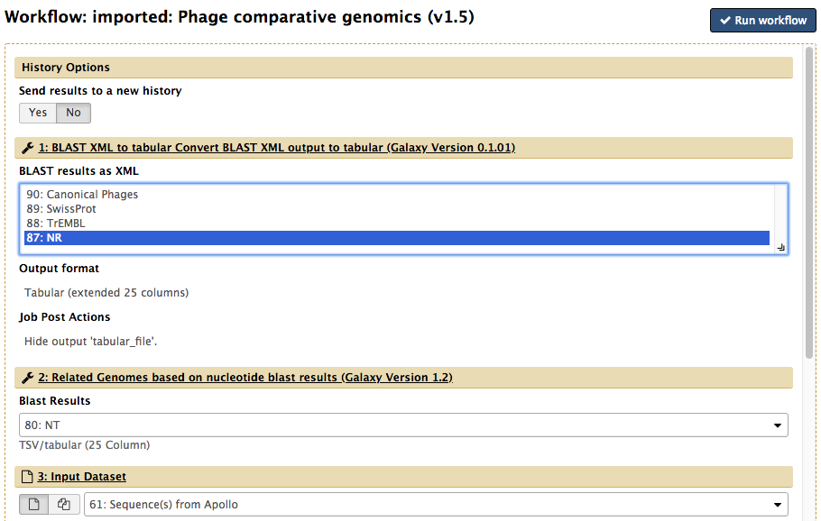
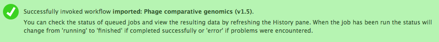

> ### Agenda
>
> In this tutorial, you will find:
>
> * Background
>
>    > * DNA Sequence Comparisons
>    > * Protein Sequence Comparison
>
> * Workflow
>
{: .agenda}

# Background

The functional annotation workflow has been run and gene prediction has at least started on your novel phage genome. Now it is time to start looking at relationships between the novel phage and other known phages. The best way to do this is to compare the novel phage genome to sequences that are already deposited in the sequence databases. This comparison can be executed in two ways:

> * Compare the entire **DNA sequence** of the novel phage to the DNA sequences of other organisms
> * Compare the **protein sequences** of all the genes in the novel phage genome to the protein sequences of other organisms

As part of the functional workflow, BLASTp (for proteins) and BLASTn (for nucleotide sequences) have already been run; thus, both of these kinds of comparisons have already been made. The BLAST results will be compared against the NCBI NR and NT databases for proteins and DNA, respectively. These are the most current and comprehensive databases as they reflect the internationally shared [INSDC database.](http://www.insdc.org/)

> ###  A Brief Center for Phage Technology Precedent
> An overview of how the [CPT](https://cpt.tamu.edu/) currently organizes and classifies genomes is provided in [this publication.](https://www.ncbi.nlm.nih.gov/pmc/articles/PMC5408676/pdf/viruses-09-00070.pdf)
{: .tip}

### DNA Sequence Comparisons

Because the triplet code that encodes protein sequences is *degenerate* (as in, there are multiple possible triplet codons for most amino acids), a DNA sequence can drift and still encode the same protein sequence by accumulation of silent mutations. This means that DNA sequences encoding similar proteins can diverge at a relatively high rate, thus DNA sequence comparisons are only particularly useful for organisms that are **closely related.** Between related organisms, DNA sequence comparisons can provide good overall parallels, as this single analysis can demonstrate both conservation of DNA sequences and genome *synteny* (the order of genes in the genome). Additionally, high conservation of DNA sequences automatically means that proteins encoded by that sequence must also be similar. Once DNA sequence similarity drops below ≈ 30%, it is no longer very useful for comparisons.

### Protein Sequence Comparisons

Comparison of organisms by protein sequence is much more sensitive, as there is stronger pressure to conserve a protein sequence for the protein to retain its function. Phage genome organization is considered to be *modular*, meaning that individual genes or groups of genes can be shared across otherwise very different phages. It is not unusual for two phages to be very similar across the genome with only particular genes - such as phage tail fibers - being different.

> ###  Modular Phage Gene Examples
> Comparing phages lambda and P22, one will see that they share similar integration and lysogen genes, *but* different morphogenesis genes (siphophage versus podophage, respectively).
> Comparing phages lambda and T1, one will see that they have related morphogenesis genes, *but* different modules for control of replication and lysis.
{: .tip}

# Workflow

> * Open CPT Galaxy ([CPT Public Galaxy](https://cpt.tamu.edu/galaxy-pub), [CPT TAMU Galaxy](https://cpt.tamu.edu/galaxy)), and find the history that contains the results of the [functional workflow](https://cpt.tamu.edu/training-material-dev/topics/genome-annotation/tutorials/functional-annotation-workflow/tutorial.html) for the desired phage genome.

> ###  Can't find the input dataset?
> When workflows are run in Galaxy, they often hide the output of their tools to give a clean and readable history with only relevant datasets shown. Sometimes a later analysis will require that dataset and it must be unhidden so that it can be used as input for a tool. 
>At the top of the history, click on the “hidden” hyperlink to see all workflow outputs that have been hidden. Scroll down and find the “NT” dataset; this is the output from BLASTn against the NCBI nt database. Click “Unhide it” on this dataset and it will become available for analysis. If preferred, click “hide hidden” at the top of the history to re-hide the other datasets to prevent clutter.
{: .details}

> * At the top of the web page, click on the Shared Data drop-down menu and select workflows.

> * Find the most recent version of the “Phage comparative genomics (v1.#) workflow,” where # indicates the most recent version of this workflow. Click on the drop-down menu for that workflow and select “Import.” After this, a green box containing a message will appear to inform the user of a successful import.

> * From there, one can click on “start using this workflow” within the message box to be brought to the page containing all of the user’s imported workflows. Find the Phage comparative genomics workflow, click the drop-down menu, and select “Run.”

> * The parameters for the workflow will then load in the center Galaxy panel. The inputs that the user needs to adjust are as follows:
>    > * Step one will be the NR dataset (BLASTp results)
>    > * Step two will be the NT dataset (BLASTn results)
>    > * Step three will be the phage’s FASTA DNA sequence.

> ###  Note that…
> The dataset numbers will be different for each user.
{: .tip}

> * Once the inputs have been selected, click “Run workflow” at the top or the bottom of the page to execute the workflow. A message in a green box will appear to inform the user of a successful invocation of the phage comparative genomics workflow. From here, wait until all of the steps have completed and their datasets have turned green.

> ###  Issues with Workflow
> If the dataset turns red in the history column, click on it to expand it. Report the bug by clicking on the bug icon in the bottom left-hand corner of the expanded dataset.
>
> 
>
> A common issue encountered when running this workflow is using the *wrong NT input type*. Check to make sure that the NT dataset you selected is the TSV/tabular format by clicking on the dataset name and looking at the file format. If it is a different problem, or the bug persists, contact [CPT](https://cpt.tamu.edu) IT staff (cpt@tamu.edu).
{: .comment}

When the workflow has completed running, you can investigate what phages may be closely related to the one being annotated by looking at the tool outputs. This workflow should have produced three new datasets in the history column: *Top BLASTn hits*, *Top BLASTp hits*, and *MIST v3*.

Look at the *Top BLASTn hits* data by clicking the eye  symbol. A small table will list the top 5 most similar organisms to the phage in question at the DNA level, as determined by BLASTn. If a phage in the database has high similarity **at the DNA level** to the phage in question, it is worthwhile to line up the genomes and visualize just how related they are; an easy way to do this is via a comparison method called  **dot plot**, which will visualize a pairwise comparison of the two sequences.

The results of a dot plot analysis can be seen by clicking on the eye  symbol in the *MIST v3* dataset. This will be the results of pairwise dot plots of the phage in question against the 5 closest-matching genomes. Phages that are related and syntenic will produce a discrete diagonal line in the dot plot. As DNA sequence similarity decreases, the line will become fainter and patchier until it is no longer visible.

Utilizing relationships and similarity at the protein level, the *Top BLASTp hits* dataset displays a table of the top 5 most related organisms based on the number of similar proteins found by BLASTp. This tool searched through your BLASTp results against the NCBI nr database and retrieved the organisms that matched the highest number of proteins in your phage (an E-value < 1e-3). This number can be found in the last column of the table. Note that this table shows **only** the top 5 results. If the phage in question is part of a large cluster of similar phages (E.G.: T4-like phages), then T4 itself may not appear in the list; 5 other T4-like phages may be more closely related to the phage in question, and T4 may by only the 10th most related phage. The does *not* mean the phage in question is not T4-like, and it is up to the annotator to determine how the phage in question relates to other phages.

> ###  Further sleuthing...
> There are several ways that the annotator can use the output of these analyses to determine the closest type phage.
> * Copy the phage name or number. Go to the [NCBI Taxonomy browser](https://www.ncbi.nlm.nih.gov/taxonomy/) and search the name. Click on the name you searched to analyze its lineage.
> * Copy the phage name and search it at [ViralZone](https://talk.ictvonline.org/taxonomy/). Find the closest related type phage.
{: .details}
