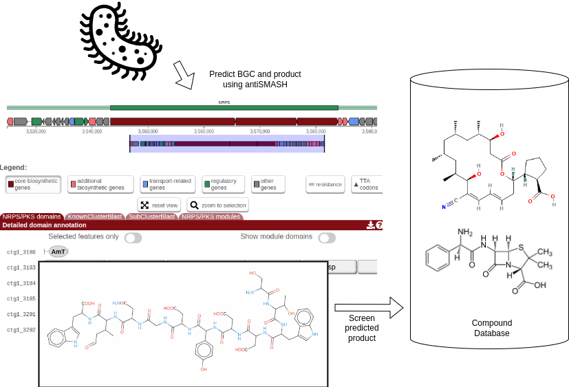

Genome mining is an important source for various bio-active compounds such as antibiotics and fungicides ().
The challenge in secondary metabolite discovery using genome mining requires to annotate biosynthetic gene clusters (BGCs) using dedicated tools such as antiSMASH () as well as to query the discovered secondary metabolite against compound libraries () in order to identify weather they might posses bio-active properties.

In this toturial we will:
* Annotate biosynthetic gene clusters (BGCs) using antiSMASH. 
* Extract the predicted compounds  as `SMILES` using a custom script. 
* Query the predicted compounds agains the MIBiG () which is a dedicated BGC database.

> <agenda-title></agenda-title>
>
> In this tutorial, we will cover:
>
> 1. TOC
> {:toc}
>
{: .agenda}

# Galaxy and data preparation

Any analysis should get its own Galaxy history. So let’s start by creating a new one and get the data into it.

## Get data

> <hands-on-title> History Creation and Data Upload </hands-on-title>
>
> 1. Create a new history for this tutorial
>
>    
>
> 2. Rename the history
>
>    
>
> 3. Import the files from [Zenodo]({{ page.zenodo_link }}) or from
>    the shared data library (`GTN - Material` -> `{{ page.topic_name }}`
>     -> `{{ page.title }}`):
>
>    ```
>    https://zenodo.org/record/10652998/files/MIBiG_compounds_3.0.sdf
>    https://zenodo.org/record/10652998/files/gbk2features.ipynb
>    ```
>   
>    For this training we need a custom jupyter notebook and a compound library.
>   
>    
>
> 4. Rename the datasets
> 5. Check that the datatype
>
>    
>
> 6. Add to each database a tag corresponding to ...
>
>    
>
{: .hands_on}

# Biosynthetic gene clusters (BGCs) detection and compound extraction

The general idea of this tutorial is described in the flowchart below. 
Zierep et. al. previously created a 
workflow that combines BGC prediction with natural compound screening in their webserver [SeMPI 2.0](http://sempi.pharmazie.uni-freiburg.de/)
(). 
Here, we want to reproduce the workflow using Galaxy, which allows to adjust the workflow and combine it with other
tools and databases. 
E.g. the workflow could be combined with metagenomic workflows, that allow to screen a vast amount of metagenome assembly genomes (MAGs) for potential novel bioactive compounds.



## Download a bacterial genome with **NCBI Accession Download**

> <hands-on-title> Task description </hands-on-title>
>
> 1.  with the following parameters:
>    - *"Select source for IDs"*: `Direct Entry`
>        - *"ID List"*: `AL645882.2`
>    - *"Molecule Type"*: `Nucleotide`
>
>    > <comment-title> Genome download </comment-title>
>    >
>    > This downloads the `Streptomyces coelicolor A3(2) complete genome`, 
which should be a great source for biosynthetic gene clusters (BGCs).
>    {: .comment}
>
{: .hands_on}

## Detect BGCs and predict NRPS / PKS metabolite structures with **Antismash**

> <hands-on-title> Task description </hands-on-title>
>
> 1.  with the following parameters:
>    -  *"Sequence file in GenBank,EMBL or FASTA format"*: `output` (output of **NCBI Accession Download** )
>    - *"Taxonomic classification of input sequence"*: `Bacteria`
>
>    > <comment-title> BGC detection </comment-title>
>    >
>    > This step uses Antismash for BGC detection. Another tool that could be used is [prism](https://prism.adapsyn.com/).
>    > But prism can only be used via a web server and is therefore not integrable into Galaxy workflows.
>    {: .comment}
>
{: .hands_on}

> <question-title></question-title>
>
> 1. How many BGCs are detected for the `Streptomyces coelicolor A3(2) complete genome` ?
> 2. How many BGCs are of type NRPS ? 
>
> > <solution-title></solution-title>
> >
> > 1. In the HTML report of Antismash you can find 27 BGCs of various types.
> > 2. Of those 27 BGCs 4 are pure NRPS and one more is  classified as NRPS-like.
> >
> {: .solution}
>
{: .question}

## Collapse single BGC Genbank files into one **Collapse Collection**

> <hands-on-title> Task description </hands-on-title>
>
> 1.  with the following parameters:
>    -  *"Collection of files to collapse into single dataset"*: `genbank` (output of **Antismash** )
>    - *"Prepend File name"*: `Yes`
>
>    > <comment-title> Collapse Genbank files </comment-title>
>    >
>    > Antismash produces one Genbank file for each cluster. Genbank files can contain multiple records. For downstream analysis it is more convenient to combine all clusters into one file.   
>    {: .comment}
>
{: .hands_on}

# Custom script in Galaxy

## Apply a custom script with **Interactive JupyTool and notebook**

For the next steps we need to extract the `SMILES` representations of the predicted BGC metabolites.
And convert in the `.smi` format (basically a tabular format that contains names and structures of chemical compounds).

The  `SMILES` representations of the predicted BGC metabolites are stored as features of the clusters in the Genbank files.

```
     cand_cluster    1..49828
                     /SMILES="NC(CCCN)C(=O)NC(C(O)C)C(=O)NC(CCCN)C(=O)O"
                     /candidate_cluster_number="1"
                     /contig_edge="False"
                     /detection_rules="cds(Condensation and (AMP-binding or
                     A-OX))"
                     /kind="single"
                     /product="NRPS"
                     /protoclusters="1"
                     /tool="antismash"
```

There are various tools that can convert Genbank files into GFF (like  and  ) and then the one could extract the SMILES string via regex.
However, unfortunately both tools seem to have difficulty to parse SMILES and introduce artefact like: 

```
SMILES=CC(%3DO)C(%3DO)O
```

Therefore we need to quickly prototype our own script, that allows to generate the desired `SMILES` representations.
This is in fact a great chance to demonstrate how the interactive  can be used to connect workflow steps, for which there is no dedicated tool yet available in Galaxy, showing the flexible nature of Galaxy.

> <hands-on-title> Task description </hands-on-title>
>
> 1.  with the following parameters:
>    - *"Do you already have a notebook?"*: `Load a previous notebook`
>        -  *"IPython Notebook"*: `gbk2features.ipynb` (from your history)
>        - *"Execute notebook and return a new one."*: `Yes`
>    - In *"User inputs"*:
>        -  *"Insert User inputs"*
>            - *"Name for parameter"*: `dataset` (this dataset can be used in the notebook)
>            - *"Choose the input type"*: `Dataset`
>                -  *"Select value"*: `Collapse Genbank files` (output of **Collapse Collection** )
>
>
>    > <comment-title> Interactive JupyTool and notebook </comment-title>
>    >
>    > JupyTool notebooks can be executed interactively, which allows to run any code (python / R / bash) dynamically or as a normal tool itself, that executes a provide script and return the output. More information about the JupyTool can be found in the [Interactive JupyTool Tutorial](https://training.galaxyproject.org/topics/galaxy-interface/tutorials/jupyterlab/tutorial.html).
>    {: .comment}
>
{: .hands_on}

In this workflow the jupyter notebook is executed and the output collected. If you want to run the notebook interactively. Rerun the tool and set the option *"Execute notebook and return a new one."*: `No`. Now the notebook start up interactively and you can play around the the python code.

The code we provide for the notebook looks like this:

```python
from Bio import SeqIO
import pandas as pd
import numpy as np

input_path = "galaxy_inputs"

use_qualifiers = ["SMILES"] 

feature_list = []

for folder in os.listdir(input_path):

    folder_path = os.path.join(input_path, folder)

    if os.path.isdir(folder_path):

        for file in os.listdir(folder_path):
            file_path = os.path.join(folder_path, file)
            if '.genbank' in file:
                for record in SeqIO.parse(file_path, "genbank"):
                    #print(record)
                    
                    for feat in record.features:

                        combined_features = {}
                        combined_features['ID'] = record.id
                        combined_features['Name'] = record.name
                        combined_features['Type'] = feat.type
                        combined_features['Start'] = feat.location.start
                        combined_features['End'] = feat.location.end
                        combined_features['Strand'] = feat.location.strand

                        for qualifier in feat.qualifiers.items():
                                combined_features[qualifier[0]] = qualifier[1][0]
                        
                        feature_list.append(combined_features)
                
df = pd.DataFrame(feature_list)

# df trimming is simpler with pandas
df.replace('', np.nan, inplace=True)
df = df.dropna(subset=use_qualifiers)

#remove extra space antiSMASH bug (https://github.com/antismash/antismash/issues/694)
df['SMILES'] = df['SMILES'].str.replace(' ', '')


#only keep what is needed downstream
df = df.loc[:,['ID', 'Name', 'Type', 'Start', 'End', 'Strand', 'SMILES']]

df.to_csv("outputs/collection/feature_table.tsv", sep="\t")
```

> <question-title></question-title>
>
> 1. What does the notebook do ?
>
> > <solution-title></solution-title>
> >
> > 1. The notebook creates a table with a row for each `SMILES` qualifier.
> >
> {: .solution}
>
{: .question}

# Cheminformatics

The next two steps convert the generated table into the `.smi` format.

## Sub-step with **Text reformatting**

> <hands-on-title> Task description </hands-on-title>
>
> 1.  with the following parameters:
>    -  *"File to process"*: `output_collection` (output of **Interactive JupyTool and notebook** )
>    - *"AWK Program"*: `{print $8, $2-$5-$6}`
>
>    ***TODO***: *Check parameter descriptions*
>
>    ***TODO***: *Consider adding a comment or tip box*
>
>    > <comment-title> short description </comment-title>
>    >
>    > A comment about the tool or something else. This box can also be in the main text
>    {: .comment}
>
{: .hands_on}

***TODO***: *Consider adding a question to test the learners understanding of the previous exercise*

> <question-title></question-title>
>
> 1. Question1?
> 2. Question2?
>
> > <solution-title></solution-title>
> >
> > 1. Answer for question1
> > 2. Answer for question2
> >
> {: .solution}
>
{: .question}

## Sub-step with **Remove beginning**

> <hands-on-title> Task description </hands-on-title>
>
> 1.  with the following parameters:
>    -  *"from"*: `outfile` (output of **Text reformatting** )
>
>    ***TODO***: *Check parameter descriptions*
>
>    ***TODO***: *Consider adding a comment or tip box*
>
>    > <comment-title> short description </comment-title>
>    >
>    > A comment about the tool or something else. This box can also be in the main text
>    {: .comment}
>
{: .hands_on}

***TODO***: *Consider adding a question to test the learners understanding of the previous exercise*

> <question-title></question-title>
>
> 1. Question1?
> 2. Question2?
>
> > <solution-title></solution-title>
> >
> > 1. Answer for question1
> > 2. Answer for question2
> >
> {: .solution}
>
{: .question}

## Sub-step with **Remove duplicated molecules**

> <hands-on-title> Task description </hands-on-title>
>
> 1.  with the following parameters:
>    -  *"Molecular input file"*: `out_file1` (output of **Remove beginning** )
>    - *"Select descriptor for molecule comparison"*: `Canonical SMILES`
>
>    ***TODO***: *Check parameter descriptions*
>
>    ***TODO***: *Consider adding a comment or tip box*
>
>    > <comment-title> short description </comment-title>
>    >
>    > A comment about the tool or something else. This box can also be in the main text
>    {: .comment}
>
{: .hands_on}

***TODO***: *Consider adding a question to test the learners understanding of the previous exercise*

> <question-title></question-title>
>
> 1. Question1?
> 2. Question2?
>
> > <solution-title></solution-title>
> >
> > 1. Answer for question1
> > 2. Answer for question2
> >
> {: .solution}
>
{: .question}


## Sub-step with **Molecule to fingerprint**

> <hands-on-title> Task description </hands-on-title>
>
> 1.  with the following parameters:
>    -  *"Molecule file"*: `output` (Input dataset)
>    - *"Type of fingerprint"*: `Open Babel FP2 fingerprints`
>
>    ***TODO***: *Check parameter descriptions*
>
>    ***TODO***: *Consider adding a comment or tip box*
>
>    > <comment-title> short description </comment-title>
>    >
>    > A comment about the tool or something else. This box can also be in the main text
>    {: .comment}
>
{: .hands_on}

***TODO***: *Consider adding a question to test the learners understanding of the previous exercise*

> <question-title></question-title>
>
> 1. Question1?
> 2. Question2?
>
> > <solution-title></solution-title>
> >
> > 1. Answer for question1
> > 2. Answer for question2
> >
> {: .solution}
>
{: .question}

## Sub-step with **Molecule to fingerprint**

> <hands-on-title> Task description </hands-on-title>
>
> 1.  with the following parameters:
>    -  *"Molecule file"*: `outfile` (output of **Remove duplicated molecules** )
>    - *"Type of fingerprint"*: `Open Babel FP2 fingerprints`
>
>    ***TODO***: *Check parameter descriptions*
>
>    ***TODO***: *Consider adding a comment or tip box*
>
>    > <comment-title> short description </comment-title>
>    >
>    > A comment about the tool or something else. This box can also be in the main text
>    {: .comment}
>
{: .hands_on}

***TODO***: *Consider adding a question to test the learners understanding of the previous exercise*

> <question-title></question-title>
>
> 1. Question1?
> 2. Question2?
>
> > <solution-title></solution-title>
> >
> > 1. Answer for question1
> > 2. Answer for question2
> >
> {: .solution}
>
{: .question}

## Sub-step with **Natural Product**

> <hands-on-title> Task description </hands-on-title>
>
> 1.  with the following parameters:
>    -  *"Molecule file"*: `outfile` (output of **Remove duplicated molecules** )
>
>    ***TODO***: *Check parameter descriptions*
>
>    ***TODO***: *Consider adding a comment or tip box*
>
>    > <comment-title> short description </comment-title>
>    >
>    > A comment about the tool or something else. This box can also be in the main text
>    {: .comment}
>
{: .hands_on}

***TODO***: *Consider adding a question to test the learners understanding of the previous exercise*

> <question-title></question-title>
>
> 1. Question1?
> 2. Question2?
>
> > <solution-title></solution-title>
> >
> > 1. Answer for question1
> > 2. Answer for question2
> >
> {: .solution}
>
{: .question}

## Sub-step with **Drug-likeness**

> <hands-on-title> Task description </hands-on-title>
>
> 1.  with the following parameters:
>    -  *"Molecule data in SDF or SMILES format"*: `outfile` (output of **Remove duplicated molecules** )
>
>    ***TODO***: *Check parameter descriptions*
>
>    ***TODO***: *Consider adding a comment or tip box*
>
>    > <comment-title> short description </comment-title>
>    >
>    > A comment about the tool or something else. This box can also be in the main text
>    {: .comment}
>
{: .hands_on}

***TODO***: *Consider adding a question to test the learners understanding of the previous exercise*

> <question-title></question-title>
>
> 1. Question1?
> 2. Question2?
>
> > <solution-title></solution-title>
> >
> > 1. Answer for question1
> > 2. Answer for question2
> >
> {: .solution}
>
{: .question}

## Sub-step with **Similarity Search**

> <hands-on-title> Task description </hands-on-title>
>
> 1.  with the following parameters:
>    - *"Subject database/sequences"*: `Chemfp fingerprint file`
>        - *"Query Mode"*: `Query molecules are stores in a separate file`
>            -  *"Target molecules"*: `outfile` (output of **Molecule to fingerprint** )
>        - *"select the k nearest neighbors"*: `1`
>
>    ***TODO***: *Check parameter descriptions*
>
>    ***TODO***: *Consider adding a comment or tip box*
>
>    > <comment-title> short description </comment-title>
>    >
>    > A comment about the tool or something else. This box can also be in the main text
>    {: .comment}
>
{: .hands_on}

***TODO***: *Consider adding a question to test the learners understanding of the previous exercise*

> <question-title></question-title>
>
> 1. Question1?
> 2. Question2?
>
> > <solution-title></solution-title>
> >
> > 1. Answer for question1
> > 2. Answer for question2
> >
> {: .solution}
>
{: .question}


## Re-arrange

To create the template, each step of the workflow had its own subsection.

***TODO***: *Re-arrange the generated subsections into sections or other subsections.
Consider merging some hands-on boxes to have a meaningful flow of the analyses*

# Conclusion

Sum up the tutorial and the key takeaways here. We encourage adding an overview image of the
pipeline used.