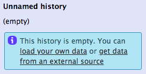
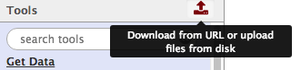
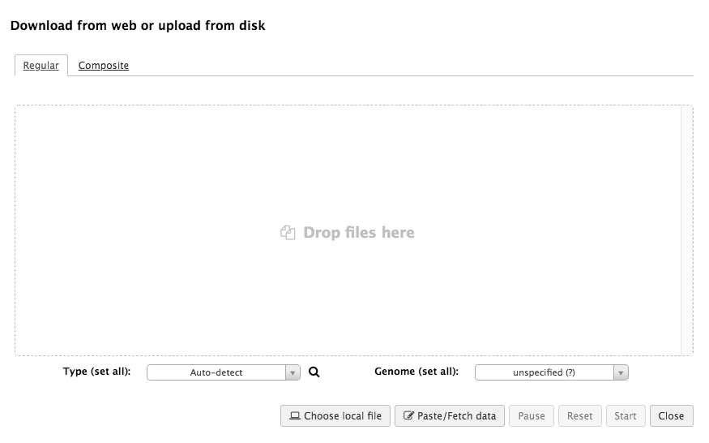
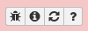
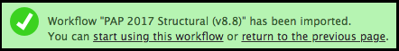
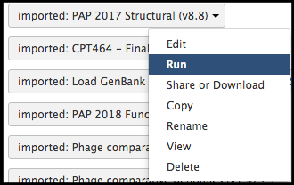
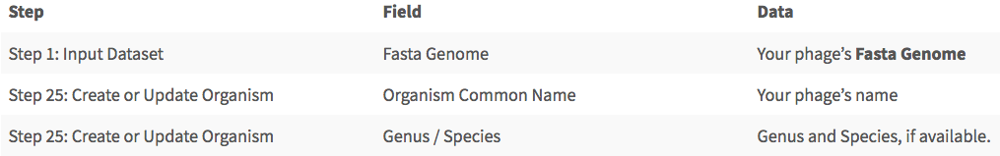
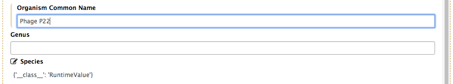
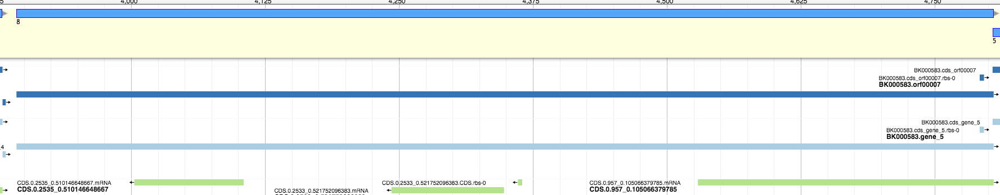
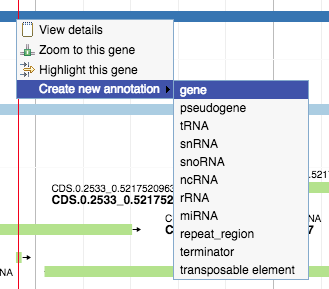

# Structural Workflow Annotation

A genome is ready to be annotated within Apollo! To begin, the process of executing the structural annotation workflow will be detailed here.

> ### Agenda
>
> 1. Prerequisites
> 2. Workflow
> 3. Gene Calling
> 4. Completion
>
{: .agenda}

# Prerequisites 

<!-- BICH464 prerequisites discuss downloading the FASTA file from the Student Genomes Google Drive folder. -->

If it is a novel phage that has not been named yet, decide on a name for the phage. Access CPT Galaxy ([CPT Public Galaxy](https://cpt.tamu.edu/galaxy-pub), [CPT TAMU Galaxy](https://cpt.tamu.edu/galaxy)) to upload the FASTA file containing the desired phage genome. There are two methods to upload a FASTA file to Galaxy.
> * On the right side of the screen is a column titled “History;” it should be an empty, unnamed history containing only a blue box with a message. Click on the “… load your own data…” hyperlink.

> * On the left side of the screen is a column titled “Tools.” In the top right-hand corner of that column is an “upload” symbol. Click on that.

Both paths yield the same result; a white screen will appear, with different file upload options. 

Drag and drop the FASTA file from the download location on the local device, or select “Choose local file” to find the FASTA file. Click ‘Start’ once the desired file has been placed into the white box. The file will then appear in the History column on the right. That dataset in the history will turn green once it is ready.

> ###  Troubleshooting: Dataset/Tool Turns Red
> Sometimes, datasets or tools in the History column will turn red if they have failed. This is OK, as it likely isn’t the fault of the user. If this occurs, click on the failed dataset to expand it. Clicking on the bug icon will allow the user to submit a report, allowing the CPT to be made aware of what went wrong.
> 
{: .comment}

# Workflow

The structural annotation workflow will run the desired genome through three automated gene callers: *MetaGeneAnnotator*, *GeneMarkS*, and *Glimmer3*. A completely naïve get of open reading frames (ORFs) will also be generated, in case the user believes they have found a gene not in any of the evidence tracks. Lastly, tNA and terminator finding tools will be run. To begin, click on Shared Data drop-down menu at the top of the Galaxy page, and select the “Workflows” option.

The next page will be a list of different workflows that all execute different actions. Look for “PAP 201# Structural (v #.#),” where # is the largest number indicating the most recent version of this workflow. Click on the drop-down menu for that most recent structural workflow, and select “Import.”

> ###  Note that…
> The above image may not precisely reflect the current structural workflow. It is possible the structural annotation workflow has been updated since the creation of this page.
{: .tip}

The user should receive a message in a green box, indicating a successfully imported workflow.

Next to the Shared Data drop-down menu is a Workflows option; clicking on this will bring up a page for the logged-in user’s imported workflows. Find the structural workflow that has just imported, click on the drop-down menu, and select “Run.”

There will be a list of parameters, some of which the user must fill out before being able to properly execute the workflow.

The list of parameters will appear as seen in the example below, executed for page P22.

Once the proper parameters have been filled out, the workflow is ready; click “Run workflow,” found at both the bottom and top of the page. If everything went successfully, a message in a green box will appear, indicating success. Follow any instructions that may be in the message (E.G.: a need to refresh the History panel to see the jobs created by the workflow).

# Gene Calling

The workflow has now loaded the genome and the evidence tracks into Apollo. From there, each likely gene region must be examined and the select the most likely gene calls. Recall that the three gene callers are correct approximately 90-95% of the time.

For example, in the image above, the light blue and dark blue tracks are a better choice for a gene than the green track; they have a higher genomic coverage and a Shine-Dalgarno site identified.

> ###  Calling Genes
>Right-clicking on the gene will display four options. Click on “Create new annotation;” this will display more options. Click on “gene” in order to call that gene. Genes for the whole genome must be called before continuing on to the functional annotation.
>
>
{: .hands_on}

> ###  Note that…
> It is better to over-call (call more genes than are likely to be in the genome) than to under-call genes and have to go back and re-run BLAST and related analyses.
{: .tip}

# Completion

Once genes have been identified across the full length of the genome, the functional annotation workflow may be executed, and annotation may continue.

<!-- LINK FUNCTIONAL ANNOTATION WORKFLOW INFORMATION UPON COMPLETION. -->
