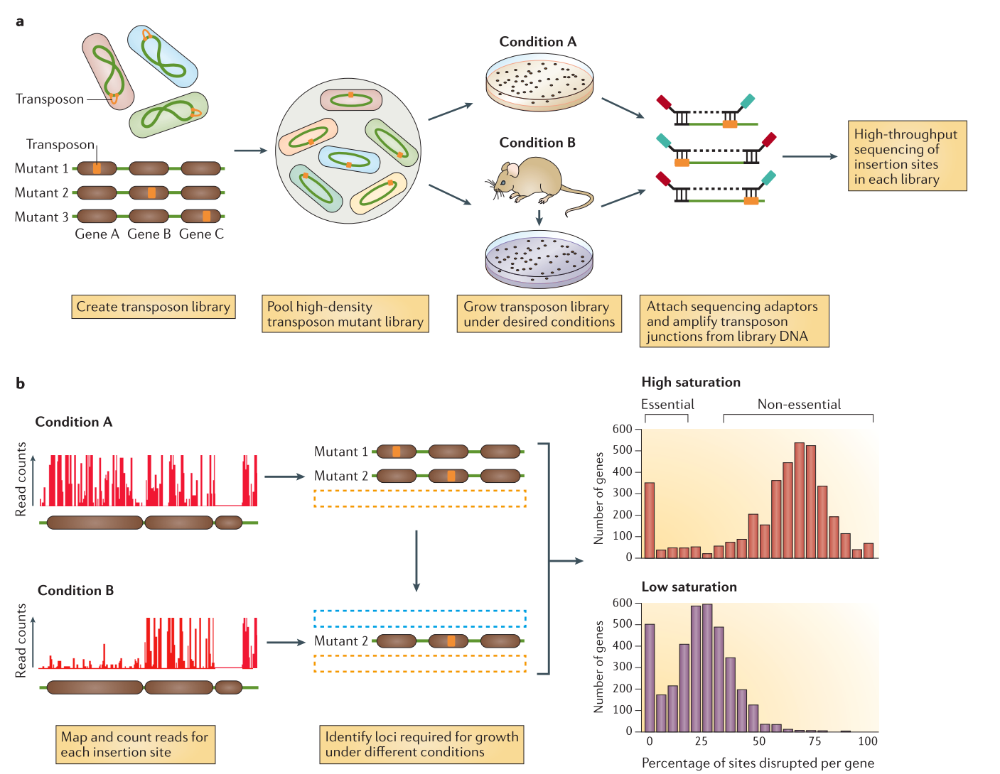

# Introduction
{:.no_toc}
Transposon insertion sequencing is a technique used to functionally annotate bacterial genomes. The genome is saturated by transposon insertions. The transposon is a mariner transposon (inserting at TA sites) that has been modified to allow the sequencing of flanking regions. By saturating the genome we ensure every TA site in the genome has an insertion at least one in the initial population of bacteria. The population is then grown in different media and the sequenced. The sequencing of the regions flanking the insertion allows to detect where are the insertion retained in the population after growth and to quantify them. The insertion of a transposon being disruptive for the region, if some insertions disappear completely from the population it indicates that the region is essential for the the bacteria survival.

| Transposon insertion sequencing method |
|:--------------:|
||
| **a. Data production** The initial population genomes are mutated so that the genome is saturated with transposon insertions.  A library is *saturated* if in the genomes across the whole population of bacteria, each potential insertion site has at least one insertion. The population is then divided into several media containing different growth conditions. After growth, the regions flanking the insertion are amplified and sequenced, allowing to determine the location of the insertion. **b. Analysis** After alignement to the reference genome, the resulting data will show a discrete repartition of reads on each TA site. If a gene present several insertions, like the two leftmost genes in *Condition A*, it means that its disruption has little or no impact to the bacterial growth. On the other hand, when a gene shows no insertions at all, like the rightmost gene in *Condition A*, is means that any disruption in this gene killed the bacteria, meaning its a gene essential to bacteria survival. If the library is sufficiently saturated, there is a clear threshold between essential and non-essential genes when you analyze the insertion rate per gene. From [Chao et al.](http://www.doi.org/10.1038/nrmicro.2015.7)|
||

In order to target the flanking regions for sequencing, the reads have a specific set of sequences that will impact how we will process them.

| Structure of the tranposon constructs |
|:--------------:|
||
| The transposon construct is a mariner transposon with two specific region used to specifically sequence the region upstream of the insertion. The transposon inserts at TA site at the ITR junctions. These ITR junctions have been modified to include a Mme1 restriction site (cut 21 bp upstream from the restriction site). Using MmeI enzyme to determine the size of the reads allow to have a hmogeneous read size and therefore avoid a bias in the representation of the insertions. It also includes a NotI restriction site. These two site are the 5' and 3' limits to the genomic DNA we want to sequence. **A. Sequence flanking genomic regions** After digestion by NotI restriction enzyme. these fragments are attached to biotinylated adaptors that link to NotI restriction site. The attached fragment are then digested by MMeI at a site upstream , where an Illumina primer is then linked. The sequencing is then done, adding Illumina adaptors and an additional barcode to the read for multiplexed sequencing. **B. Removing incorrect fragments** An insertion can sometimes be composed of one or more copies of the transposon (multimer). There is therefore a risk to select plasmid backbone sequence. To solve this problem, an additional NotI has been add in the backbone to create different length construct, that can later be filtrated (C). Different promoters are added to the construct along with an additional 3 bp barcode to analyze differential expression impact, but this will be the subject of another tutorial.  From [Santiago et al.](http://www.doi.org/10.1186/s12864-015-1361-3)|
||

The objectives of this tutorial will then be to remove non genomic sequences from the reads, align them to a reference genome, and use the location of genes to determine a list of essential genes.

> ### Agenda
>
> In this tutorial, we will deal with:
>
> 1. TOC
> {:toc}
>
{: .agenda}

# Removing all non genomic sequences from the sequenced reads

## Data Structure

The experimental design of transposon insertion sequencing produces raw reads containing a lot of adapters and foreign sequences that has been used to insert and target the transposon. In order to obtain the core reads that contain only genomic sequence, we have a number of steps to do to remove them and divide the reads per experimental condition and type of transposon.

| Data pre-processing |
|:--------------:|
||
|The pre-processing of the data will be don through several steps of cutadapt software, first we sill separate the reads of each experimental condition based on a 8 bp barcode at the beginning of the read (Illumina demultiplexing). The tail of each set of read is then removed. It immediately follows the 3bp barcode specific to transposon constructs, and contains illumina adapter sequence and downstream. To be sure all our reads have been trimmed correctly we filter out the reads too large. We then separate the reads per transposon construct and then remove the remaining transposon sequence containing MmeI.|
||

## Separating reads from different experimental conditions

 First we divide the initial data set by experimental conditions thanks to a 8bp barcode added by the Illumina multiplexing protocol.
 We first need to create a fasta file containing the barcodes for each condition.
 You can find the training Dataset here (Put zenodo link here)

 Barcode data:
 `>control
 ^CTCAGAAG
 >condition
 ^GACGTCAT`
 The '^' at the beginning of the sequence means we want to anchor the barcode at the beginning of the read. To know more about the symbols used by cutadapt, see cutadapt [manual](https://cutadapt.readthedocs.io/en/stable/guide.html#adapter-types)

 > ###  Hands-on:  Upload Data in history by pasting them
 >
 > 1.  **Click** on the upload icon in the left panel.
 > 2. **Click** on the `Paste/Fetch Data` button
 > 3. Change *"Name"* to `Condition barcodes`
 > 4. Change *"Type"* to `Fasta`
 > 5. Paste the barcode data.
 > 6. **Click** on `Start button`
 >
 >    > ###  Questions
 >    >
 >    > What is a fasta file?
 >    >
 > {: .question}
 >
 >

 We now are going to use cutadapt to slipt our reads by experimental condition.

 > ###  Hands-on:  Barcode splitting with Cutadapt
 >
 > 1.  Select the **Cutadapt** tool in the tool bar.
 > 2. Set *"Single-end or Paired-end reads?"* to `Single-end`
 > 3. Set *"FASTQ/A file"* to the `fastq file` containing the training set.
 > 4. **Click** on `Insert 5' (Front) Adapters`
 > 5. Set *"Source"* to `File From History`
 > 6. Set *"Choose file containing 5' adapters"* to the `condition barcodes` file in our history
 > 7. **Click** on `Adapter Options`
 > 8. Set *"Maximum error rate"* to `0.15` to allow 1 mismatch
 > 9. Set *"Match times"* to `3` in case the barcode attached several times
 > 10. **Click** on `Output Options`
 > 11. Set *"Report"* to `yes`
 > 12. Set *"Multiple output"* to `yes` to separate the reads into one file per condition
 > 13. **Click** on `Execute`
 >
 >    > ###  Questions
 >    >
 >    > What would change if our barcodes were at the end of the reads ?
 >    >
 > {: .question}
 >
 >

The output is a collection of the different conditions dataset, here control and condition, and a report text file.
You can look at the report and see that 100% of the reads has been trimmed.

## Remove Adapter sequence

Now that we have divided the set per condition, we are going to trim the tail containing the illumina adapter. We want to remove the adapter and everything downstream, we are therefore gonna use the end adapter option of cutadapt and not anshor the sequence anywhere

 > ###  Hands-on:  Remove Adapter with Cutadapt
 >
 > 1.  Select the **Cutadapt** tool in the tool bar.
 > 2. Set *"Single-end or Paired-end reads?"* to `Single-end`
 > 3. Set *"FASTQ/A file"* to the `Cutadapt on data... Output` collection output of the previous step.
 > 4. **Click** on `Insert 3' (End) Adapters`
 > 5. Set *"Source"* to `Enter custom Sequence`
 > 6. Set *"Enter custom 3' adapter sequence"* to `CGTTATGGCACGC`
 > 7. **Click** on `Adapter Options`
 > 8. Set *"Match times"* to `3` in case the barcode attached several times
 > 9. **Click** on `Output Options`
 > 10. Set *"Report"* to `yes`
 > 11. **Click** on `Execute`
 >
 >    > ###  Questions
 >    >
 >    > What are the outputs at this step?
 >    >
 >    > What portion of the reads contained the adapters?
 >    >
 > {: .question}
 >
 >

## Filter reads on length

To remove the reads that might not have been trimmed because of too many mismatches or other reasons, we will filter the reads by size. Because we know the approximate size of the remaining sequences, we can filter the reads based on this estimation.

> ###  Hands-on:  Filter reads with Cutadapt
>
> 1.  Select the **Cutadapt** tool in the tool bar.
> 2. Set *"Single-end or Paired-end reads?"* to `Single-end`
> 3. Set *"FASTQ/A file"* to the `Cutadapt on data... Output` collection output of the previous step.
> 4. **Click** on `Filter Options`
> 5. Set *"Minimum length"* to `64`
> 6. Set *"Maximum length"* to `70`
> 7. **Click** on `Output Options`
> 8. Set *"Report"* to `yes`
> 9. **Click** on `Execute`
>
>    > ###  Questions
>    >
>    > How many reads where discarded?
>    >
> {: .question}
>
>

We can see that is both samples the reads have pass the filtering at more than 98%. If the reads passing is very low, it means the previous trimming steps is incomplete or faulty.

## Separate reads from different transposon constructs

We have now removed the transposon sequences that was outside of the 3 bp barcode specific to the type of construct. The constructs used in this experiment contain different strengths and directions of promoters. It means that in addition of disrupting a gene at the location of the insertion, it will modify the expression of either upstream or downstream regions. The analysis of this modification will be studied in another training material, but for now we will consider it does not impact the essentiality analysis and we will use the different constructs as replicates.
We therefore need to separate the reads based on the construct specific 3bp barcodes.

You can download the fasta file containing the barcodes here (add zenodo link)). Upload the file into galaxy and take a look at it.

> ###  Questions
>
> What does the "$" means in the barcode sequence file ?
>
> {: .question}  

> ###  Hands-on:  Barcode split with Cutadapt
>
> 1.  Select the **Cutadapt** tool in the tool bar.
> 2. Set *"Single-end or Paired-end reads?"* to `Single-end`
> 3. Set *"FASTQ/A file"* to the  `Cutadapt on data... Output` collection output of the previous step.
> 4. **Click** on `Insert 3' (End) Adapters`
> 5. Set *"Source"* to `File From History`
> 6. Set *"Choose file containing 3' adapters"* to the `construct barcodes` file in our history
> 7. **Click** on `Adapter Options`
> 8. Set *"Match times"* to `3` in case the barcode attached several times
> 9. **Click** on `Output Options`
> 10. Set *"Report"* to `yes`
> 11. Set *"Multiple output"* to `yes` to separate the reads into one file per condition
> 12. **Click** on `Execute`
>
>    > ###  Questions
>    >
>    > Are the reads equally divided between constructs ?
>    >
> {: .question}
>
>

You can notice that the output of this split is a *nested collection*, a collection of collection. When you look at the reports, you can see that most of the reads have been assigned to the *blunt* construct, this is because the blunt construct is the control and does not contain any promoters. This means that there is less negative selective pressure on blunt than the other ones, that have the affected flanking region in addition to the disrupted gene at the insertion site.
This won't be a problem here as we will see the tool we use for the essentiality prediction consider the sum of reads in the duplicates.

## Remove remaining transposon sequence.

The last remaining transposon sequence is the linker containing the MmeI restriction site.

 > ###  Hands-on:  Remove Linker with Cutadapt
 >
 > 1.  Select the **Cutadapt** tool in the tool bar.
 > 2. Set *"Single-end or Paired-end reads?"* to `Single-end`
 > 3. Set *"FASTQ/A file"* to the `Cutadapt on data... Output` nested collection output of the previous step.
 > 4. **Click** on `Insert 3' (End) Adapters`
 > 5. Set *"Source"* to `Enter custom Sequence`
 > 6. Set *"Enter custom 3' adapter sequence"* to `ACAGGTTGGATGATAAGTCCCCGGTCTATATTGAGAGTAACTACATTT`
 > 7. **Click** on `Adapter Options`
 > 8. Set *"Maximum error rate"* to `0.15`
 > 9. **Click** on `Output Options`
 > 10. Set *"Report"* to `yes`
 > 11. **Click** on `Execute`
 >
 > {: .question}
 >
 >

Verify that the majority of the read have been trimmed. Now that we isolated the genomic sequences from the initial reads. We want to align them to count how many insertion have been retained at each TA sites.

# Count the number of insertion per TA sites

## Align the reads to a reference genome

## Get coverage of the genomes

## Get TA sites positions

## Merge overall coverage and TA sites to get the coverage of each TA sites

# Predict Essential Genes with Transit

> ###  Hands-on:
>
> 1.
> 2.
> 3.
>
>
{: .hands_on}
