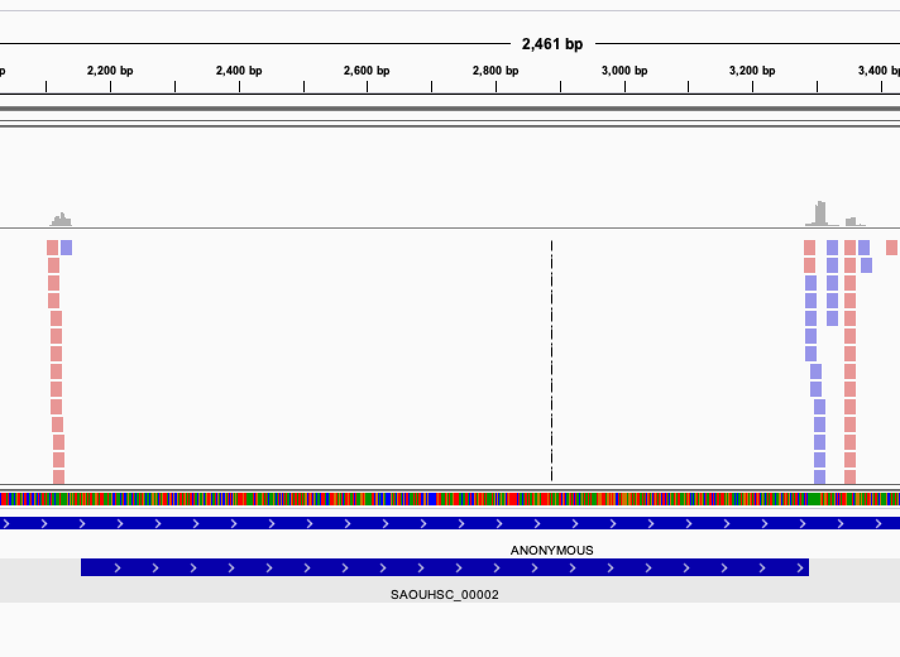

# Introduction


In microbiology, identifying links between genotype and phenotype is key to understand bacteria growth and virulence mechanisms, and to identify targets for drugs and vaccines. These analysis are limited by the lack of bacterial genome annotations (*e.g.* 30% of genes for *S. pneumoniae* are of unknown function) and by the fact that genotypes often arose from complex composant interactions.

## Transposon insertion Sequencing


Transposon insertion sequencing is a technique used to functionally annotate bacterial genomes. In this technique, the genome is saturated by insertions of transposons. Transposons are highly regulated, discrete DNA segments that can relocate within the genome. They have a large influence on gene expression and can be used to determine the function of genes.

When a transposon inserts itself in a gene, the gene's function will be disrupted, affecting the fitness (growth) of the bacteria. We can then manipulate transposons for use in insertional mutagenesis, *i.e.* creation of mutations of DNA by the addition of transposons. The genomes can be then sequenced to locate the transposon insertion site and the function affected by a transposon insertion can be linked to the disrupted gene.

")

1. **Data production** (**a** in the previous image)

    An initial population of genomes is mutated so that the genome of the bacteria is saturated with transposon insertions. A library is called *saturated* if in the genomes across the whole population of bacteria, each potential insertion site has at least one insertion. The population is then divided into several media containing different growth conditions, to identify the impact of the insertions on the bacteria growth. After growth, the regions flanking the insertion are amplified and sequenced, allowing to determine the location of the insertion.

2. **Analysis** (**b** in the previous image)

    The sequences are aligned to the reference genome to identify the location of the regions flanking the insertions. The resulting data will show a discrete repartition of reads on each site. If a gene present several insertions, like the two leftmost genes in *Condition A*, it means that its disruption has little or no impact to the bacterial growth. On the other hand, when a gene shows no insertions at all, like the rightmost gene in *Condition A*, is means that any disruption in this gene killed the bacteria, meaning it is a gene essential to bacteria survival. If the library is sufficiently saturated, there is a clear threshold between essential and non-essential genes when you analyze the insertion rate per gene.

Two type of transposon insertion methods exist:
- Gene disruption, where we analyze only the disruptions. This will covered by of this tutorial
- Regulatory element insertion, where different promoters are inserted by the transposon, and we analyze the change in gene expression in addition to the disruption. This method will be the subject of another tutorial.

## Building a TnSeq library


Different types of transposons can be used depending of the goal of your analysis.

- Randomly pooled transposon
    - Mariner-based transposons, common and stable transposons which target the "TA" dinucleotides

        The TA are distributed relatively evenly along genome. The Mariner-based transposons can be inserted to impact statistically every gene, with in average more than 30 insertions site per kb. With the low insertion bias, it is easy to build saturated libraries. But local variations means less loci and less statistical power.

    - Tn5-based vectors, which insert at random sites

        This transposon do not require any target sequences. It is useful for specie where it is difficult to build mariner based transposons. But it has a preference for high GC content, causing insertion bias

- Defined sequence transposon

    It can be used to study interactions in pathways of interest, but also more precise targeting (small genes, pathways) for specific analyses

Independently of the transposon choice we need to be careful about the library complexity. With a large complex library, multiple insertion can be found in every potential locus. The higher density of insertion, the greater precision in identifying limits of regions of interest. If the density of the library is too low, some genes might by chance not be disrupted and mistaken for essential. The advantage of a target specific transposon, like the mariner, in opposition of a Tn5-based transposon inserting randomly, it that the limited number of insertion sites makes it easier to build high complexity libraries.

After selection of the type of transposon, we need to modify it to allow insertion site amplification and sequencing to get a library fitting the transposon insertion. Biases could be introduced during the process due to uneven fragment sizes. To avoid that, we can introduce a Type I restriction site to cleave DNA downstream of transposon, and get uniform fragment sizes and therefore avoid a bias in the representation of the insertions.

As we just want to identify the TA site affected by an insertion, we only need the location of the start of the reads and not a good coverage of the entire genome. Long reads are then not so important. On the other hand, a minimum transposon length of 16 bp is necessary for precise mapping on the genome . We can therefore not use the BsmFI restriction site (11 to 12 bp) but MmeI.

**In this tutorial, we are using mariner transposon targeting TA sequences, in ordered to target the whole genome uniformly,** with two specific regions used to specifically sequence the region upstream of the insertion 

")

The transposon inserts itself at TA site at the ITR junctions. These ITR junctions have been modified to include a Mme1 restriction site and a NotI restriction site which cut 21 bp upstream the restriction site. These two site are the 5' and 3' limits to the genomic DNA we want to sequence.

1. After digestion by NotI restriction enzyme, the fragments are attached to biotinylated adaptors that link to NotI restriction site. The attached fragment are then digested by MMeI at a site upstream, where an Illumina primer is then linked. The sequencing is then done, adding Illumina adaptors and an additional barcode to the read for multiplexed sequencing.

2. An insertion can sometimes be composed of one or more copies of the transposon (multimer). There is therefore a risk to select plasmid backbone sequence. To solve this problem, an additional NotI has been added in the backbone to create different length construct, that can later be filtrated. Different promoters are added with an additional 3 bp barcode to analyze differential expression impact. This type of complex analysis will be covered in a follow-up tutorial.

Because of this complex transposon structure, the reads obtained after sequencing contain a lot of adapters and foreign sequences used to insert and target the transposon. Several steps of preprocessing are then need to extract only the transposon sequence before finding its location on the genome.

## Tnseq analysis


Once the genomic sequences are extracted from the initial reads (*i.e.* remove non genomic sequences from the reads), they need to be located each on the genome to link them to a TA site and genes. To do that we map them to a reference genome, link them to a specific insertion site, and then count the number of insertion for each TA site and identify essential genes of regions.

We will apply this approach in this tutorial using a subset of TnSeq reads from .

> <agenda-title></agenda-title>
>
> In this tutorial, we will deal with:
>
> 1. TOC
> {:toc}
>
{: .agenda}

# Data upload

Let's start with uploading the data.

> <hands-on-title>Import the data</hands-on-title>
>
> 1. Create a new history for this tutorial and give it a proper name
>
>    
>
>    
>
> 2. Import from [Zenodo](https://zenodo.org/record/2579335) or a data library (ask your instructor):
>   - FASTQ file with the Tnseq reads: `Tnseq-Tutorial-reads.fastqsanger.gz`
>   - Set of barcodes to separate reads from different experimental conditions: `condition_barcodes.fasta`
>   - Set of barcodes to separate reads from different transposon constructs: `construct_barcodes.fasta`
>   - Genome file for *Staphylococcus aureus*: `staph_aur.fasta`
>   - Annotation file for *Staphylococcus aureus*: `staph_aur.gff3`
>
>    ```
>    https://zenodo.org/record/2579335/files/Tnseq-Tutorial-reads.fastqsanger.gz
>    https://zenodo.org/record/2579335/files/condition_barcodes.fasta
>    https://zenodo.org/record/2579335/files/construct_barcodes.fasta
>    https://zenodo.org/record/2579335/files/staph_aur.fasta
>    https://zenodo.org/record/2579335/files/staph_aur.gff3
>    ```
>
>    
>
>    
>
>
> 3. Rename the files
>
>    
>
{: .hands_on}


# Remove all non genomic sequences from the sequenced reads

Because of the experimental design for transposon insertion sequencing, the raw reads contain a lot of adapters and foreign sequences used to insert and target the transposon. To obtain the core reads that contain only genomic sequence, the reads have to go through several steps (using the **Cutadapt** tool) to remove them and divide the reads per experimental condition and type of transposon:


1. We separate the reads of each experimental condition based on a 8 bp barcode at the beginning of each read. These barcodes were added to be able to pool different conditions together before the transposon insertion and sequencing.
2. The tail of each set of read is then removed. It immediately follows the 3 bp barcode specific to transposon constructs, and contains illumina adapter sequence and downstream
3. To be sure all our reads have been trimmed correctly we filter out the reads too large.
4. We then separate the reads per transposon construct
5. We remove the remaining transposon sequence containing MmeI.

## Separate reads by experimental conditions

First we divide the initial data set by experimental conditions using the 8 bp barcode added during the Illumina multiplexing protocol.

> <hands-on-title>Inspect condition barcodes</hands-on-title>
>
> 1. Inspect the `condition_barcodes` file
>
{: .hands_on}

This fasta file contains the barcodes for each condition:

```
>control
^CTCAGAAG
>condition
^GACGTCAT
```

We can see 2 barcodes there: one for control and one for condition.

> <comment-title>Barcode symbols used by <b>Cutadapt</b></comment-title>
>
> The `^` at the beginning of the sequence means we want to anchor the barcode at the beginning of the read. To know more about the symbols used by **Cutadapt**, you check the [**Cutadapt** manual](https://cutadapt.readthedocs.io/en/stable/guide.html#adapter-types).
{: .comment}

We would like now to split our Tnseq reads in `Tnseq-Tutorial-reads` given the barcodes.

> <hands-on-title>Split reads by condition barcodes using Cutadapt</hands-on-title>
>
> 1. **Cutadapt**  with:
>     - *"Single-end or Paired-end reads?"*: `Single-end`
>       -  *"FASTQ/A file"*: `Tnseq-Tutorial-reads`
>       - In *"Read 1 Options"*
>         - In *"5' (Front) Adapters"*
>           - Click on *"Insert 5' (Front) Adapters"*
>             - *"Source"*: `File From History`
>               - *"Choose file containing 5' adapters"*: `condition_barcodes` file
>     - In *"Adapter Options"*
>       - *"Maximum error rate"*: `0.15` (to allow 1 mismatch)
>       - *"Match times"*: `3` (to cover cases where barcodes are attached several times)
>     - In *"Output Selector"*, select
>       -  *"Report"*
>       -  *"Multiple output"* (to separate the reads into one file per condition)
>       -  *"Untrimmed reads"* (to write reads that do not contain the adapter to a separate file)
>
>     The output is a collection of the different conditions datasets, here control and condition, and a report text file.
>
> 2. Inspect the report text generated by **Cutadapt** 
{: .hands_on}

> <question-title></question-title>
>
> 1. What percentage of reads has been trimmed for the adapter?
> 2. How many reads have been trimmed for each condition?
> 3. What should we change if our barcodes were at the end of the reads ?
>
> > <solution-title></solution-title>
> >
> > 1. 100% of the reads were trimmed (line `Reads with adapters`)
> > 2. 2,847,018 for control (`CTCAGAAG` barcode) and 2,862,108 for condition (`GACGTCAT` barcode)
> > 3. We should use the option *"Insert 3' (End) Adapters"* and anchored them at the end of the read with the symbol `$` in our fasta file containing the barcodes.
> {: .solution }
>
{: .question}


## Remove Adapter sequence

Our reads are now divided by condition. We need to trim their tail containing the Illumina adapters, used for initiating the sequencing (`CGTTATGGCACGC`, here). To do so, we remove the adapter and everything downstream, using the end adapter option of **Cutadapt** and not anchor the sequence anywhere. To eliminate reads that might not have been trimmed because of too many mismatches or other reasons, we filter the reads by size, given the known approximate size of the remaining sequences (**how is it computed??**).

> <hands-on-title>Remove Adapter with Cutadapt</hands-on-title>
>
> 1. **Cutadapt**  to remove adapters with:
>    - *"Single-end or Paired-end reads?"*: `Single-end`
>      -  *"FASTQ/A file"*: collection output of the previous **Cutadapt**
>      - In *"Read 1 Options"*
>        - In *"3' (End) Adapters"*
>          - Click on *"Insert 3' (End) Adapters"*
>            - *"Source"*: `Enter custom Sequence`
>              - *"Enter custom 3' adapter sequence"*: `CGTTATGGCACGC`
>    - In *"Adapter Options"*
>      - *"Match times"*: `3` (to cover cases where barcodes are attached several times)
>    - In *"Output Selector"*, select
>      -  *"Report"*
>
>    > <question-title></question-title>
>    > What are the outputs at this step?
>    > > <solution-title></solution-title>
>    > > The outputs are two collections: one containing the reads in both conditions, and one containing the **Cutadapt** reports for each condition.
>    > {: .solution }
>    {: .question}
>
> 2. Inspect the generated report files
>
>    > <question-title></question-title>
>    > What percentage of the reads contained the adapter?
>    > > <solution-title></solution-title>
>    > > More than 99% of the reads contained the adapter in both conditions (line `Reads with adapters` in the reports)
>    > {: .solution }
>    {: .question}
>
> 3. **Cutadapt**  to filter reads based on length with:
>    - *"Single-end or Paired-end reads?"*: `Single-end`
>      -  *"FASTQ/A file"*: collection output of the previous **Cutadapt**
>    - In *"Filter Options"*
>      - *"Minimum length"* : `64`
>      - *"Maximum length"* : `70`
>    - In *"Output Selector"*, select
>      -  *"Report"*
>
> 4. Inspect the generated report files
>
>    > <question-title></question-title>
>    > How many reads where discarded after filtering?
>    > > <solution-title></solution-title>
>    > > Less than 2% of the reads were discarded in both conditions (lines `Reads that were too short` and `Reads that were too long` in the reports)
>    > {: .solution }
>    {: .question}
>
{: .hands_on}

We can see that is both samples the reads have pass the filtering at more than 98%. If this percentage is very low, it means the previous trimming steps is incomplete or faulty.

## Separate reads from different transposon constructs

The constructs used in this experiment contain different strengths and directions of promoters. We use the different constructs as replicates, so we need now to separate the reads based on the construct specific 3 bp barcodes.

> <comment-title></comment-title>
> In addition of disrupting a gene at the location of the insertion, such constructs can modify the expression of either upstream or downstream regions. The analysis of such modification will be studied in another training material, but for now we consider that the construct does not impact the essentiality analysis.
{: .comment}

> <hands-on-title>Inspect construct barcodes</hands-on-title>
>
> 1. Inspect the `construct_barcodes` file
>
>    > <question-title></question-title>
>    >
>    > What does the `$` mean in the barcode sequence file?
>    >
>    > > <solution-title></solution-title>
>    > > It means the barcode is anchored at the end of the reads.
>    > {: .solution}
>    {: .question}
{: .hands_on}

> <hands-on-title>Barcode split with Cutadapt</hands-on-title>
>
> 1. **Cutadapt**  with:
>    - *"Single-end or Paired-end reads?"*: `Single-end`
>      -  *"FASTQ/A file"*: collection output of the previous **Cutadapt**
>      - In *"Read 1 Options"*
>        - In *"3' (End) Adapters"*
>          - Click on *"Insert 3' (End) Adapters"*
>            - *"Source"* : `File From History`
>               -  *"Choose file containing 5' adapters"*: `construct_barcodes` file
>    - In *"Adapter Options"*
>       - *"Match times"*: `3` (to cover cases where barcodes are attached several times)
>    - In *"Output Selector"*, select
>       -  *"Report"*
>       - *"Multiple output"* (to separate the reads into one file per condition)
>
> 2. Inspect the report files
>
>    > <question-title></question-title>
>    >
>    > Are the reads equally divided between constructs?
>    >
>    > > <solution-title></solution-title>
>    > > When you look at the reports, you can see that most of the reads have been assigned to the *blunt* construct (`TAC` barcode): the blunt construct is the control and does not contain any promoters. This means that there is less negative selective pressure on blunt than the other ones, that have affected flanking region in addition to the disrupted gene at the insertion site. This won't be a problem here as the tool we use for the essentiality prediction consider the sum of reads in the replicates.
>    > {: .solution }
>    {: .question}
>
{: .hands_on}

You can notice that the output of this split is a *nested collection*, a collection of collection.

## Remove the remaining transposon sequence

The last remaining transposon sequence in the reads is the linker with the MmeI restriction site (`ACAGGTTGGATGATAAGTCCCCGGTCTATATTGAGAGTAACTACATTT`).

> <hands-on-title> Remove Linker with Cutadapt</hands-on-title>
>
> 1. **Cutadapt**  with:
>    - *"Single-end or Paired-end reads?"*: `Single-end`
>      -  *"FASTQ/A file"*: collection output of the previous **Cutadapt**
>      - In *"Read 1 Options"*
>        - In *"3' (End) Adapters"*
>          - Click on *"Insert 3' (End) Adapters"*
>            - *"Source"*: `Enter custom Sequence`
>              - *"Enter custom 3' adapter sequence"*: `ACAGGTTGGATGATAAGTCCCCGGTCTATATTGAGAGTAACTACATTT`
>    - In *"Adapter Options"*
>      - *"Maximum error rate"*: `0.15`
>    - In *"Output Selector"*, select
>      -  *"Report"*
>
> 2. Inspect the report files and check that the majority of the read have been trimmed
{: .hands_on}

Now that we isolated the genomic sequences from the initial reads, we want to align them to count how many insertion have been retained at each TA site.

# Count the number of insertion per TA sites

## Align the reads to a reference genome

To identify the location of each TA site to the count them, the first step is to map the reads on the reference genome. We use the **Bowtie**.

> <comment-title></comment-title>
> We could also use **Bowtie2** with an end-to-end option, but **Bowtie** is more suitable for very short reads like ours (16-17 bp).
{: .comment}


> <hands-on-title>Map reads with Bowtie</hands-on-title>
>
> 1. **Map with Bowtie for Illumina**  with:
>    - *"Will you select a reference genome from your history or use a built-in index?"*: `Use one from the history`
>      -  *"Select the reference genome"*: `staph_aur.fasta` file.
>    - *"Is this library mate-paired?"*: `Single-end`
>      -  *"FASTQ file"*: collection output of the last **Cutadapt**
>      - *"Bowtie settings to use"*: `Full parameters list`
>      - *"Skip the first n reads (-s)"*: `0`
>      - *"Maximum number of mismatches permitted in the seed (-n)"*: `0`
>      - *"Seed length (-l)"*: `17`
>      - *"Whether or not to make Bowtie guarantee that reported singleton alignments are 'best' in terms of stratum and in terms of the quality values at the mismatched positions (--best)"*: `Use best`
>      - *"Whether or not to try as hard as possible to find valid alignments when they exist (-y)"* : `Try Hard`
>
>    > <question-title></question-title>
>    > Why are we strictly enforcing no mismatch mapping?
>    > > <solution-title></solution-title>
>    > > Our reads being very short, the smallest size needs precise mapping, allowing even one mismatch would risk having reads mapping in wrong positions.
>    > {: .solution }
>    {: .question}
>
> 2. Rename your collection for better clarity
>
>    
>
{: .hands_on}

## Compute coverage of the genome

We have now our reads mapped on the reference genome. We can compute the genome coverage, *i.e.* how much the nucleotides of the genome are covered by reads. This information will be later crossed with our TA sites position.

In our case, the sequenced reads cover the  5' region flanking region of the TA site where the transposon inserted. We should not then extract the coverage across the whole reads, as it could cover several TA sites, but only the coverage at the 3' end of the read:


> <hands-on-title>Compute genome coverage</hands-on-title>
>
> 1. **bamCoverage**  with:
>    -  *"BAM/CRAM file"*: collection output of the last **Map with Bowtie for Illumina**
>    - *"Bin size in bases"*: `1`
>    - *"Scaling/Normalization method"*: `Do not normalize or scale`
>    - *"Coverage file format"*: `bedgraph`
>    - *"Show advanced options"*: `yes`
>      - *"Ignore missing data?"*: `Yes` (to get only region with read counts)
>      - *"Offset inside each alignment to use for the signal location"*: `-1` (to read the signal of the coverage only at the 3' end of the read)
>
{: .hands_on}

## Identify TA sites positions

In order to get the coverage on each TA site we need to prepare a file containing the position of each TA site.

As you can see on the [previous figure](#figure-4), the read can cover one side or the other of the TA depending on the direction of insertion of the transposon. Depending on the direction of insertion the coverage will be counted on the leftmost position of the TA site or on the rightmost. As we are not considering strand separately in this analyses, we will consider both count as attached to the leftmost base of the TA site. To do that we will create two list of TA site positions, listing the 5' end of each TA site for forward and reverse strand, and then merge them to get a global count per TA site.

> <hands-on-title>Get TA sites coordinates</hands-on-title>
>
> 1. **Nucleotide subsequence search**  with:
>    -  *Nucleotide sequence to be searched"*: `staph_aur.fasta`
>    - *"Search with a"*: `user defined pattern`
>    - *"Search pattern"*: `TA`
>    - *"Search pattern on"*: `forward strand`
> 4. Inspect the generated file
{: .hands_on}

**Nucleotide subsequence search** generate one BED file with the coordinates of each TA on the genome:
1. Chrom
2. Start
3. End
4. Name
5. Strand

The only information we need here are the positions of the 5' end of each TA site for each strand.

> <hands-on-title>Get forward and reverse strand positions</hands-on-title>
>
>
> 1. **Cut columns from a table**  with:
>    - Cut columns : `c2`
>    - *"Delimited by"*: `tab`
>    -  *"From"*: output of **Nucleotide subsequence search**
>
> 4. Add the `#forward` tag to the output
>
>    
>
> 2. **Cut columns from a table**  with:
>    - Cut columns : `c1,c3`
>    - *"Delimited by"*: `tab`
>    -  *"From"*: output of **Nucleotide subsequence search**
>
> 3. **Compute an expression on every row**  to shift the end position of TA sites  by 1 and get the start of the TA site on the reverse strand with:
>    - *Add expression"*: `c2-1`
>    -  *"as a new column to"*: output of **cut**
>    - *"Round result?"*: `yes`
>
>
> 4. **Cut columns from a table**  with:
>    - Cut columns : `c3`
>    - *"Delimited by"*: `tab`
>    -  *"From"*: output of **Compute**
>
> 8. Add the `#reverse` tag to the output
>
{: .hands_on}


## Merge overall coverage and positions of TA sites to get the coverage of each TA sites

We have now 2 files containing the coordinates of our TA sites for both strands. We should cross them with the coverage files to get the coverage on both sides of each TA site.

> <hands-on-title> Get coverage of TA sites</hands-on-title>
>
> 1. **Join two files**  with:
>    -  *1st file"*: output of **bamCoverage**
>    - *"Column to use from 1st file"*: `Column 2` (to select the position of the end of the read)
>    -  *"2nd File"*: output of last **cut** with the `forward` tags
>    - *"Column to use from 2nd file"*: `Column 1`
>    - *"Output lines appearing in"*: `Both 1st & 2nd file, plus unpairable lines from 2st file. (-a 2)` (to get all TA sites)
>    - *"First line is a header line"*: `No`
>    - *"Value to put in unpaired (empty) fields"*: `0` (to assign a count of 0 to TA sites not covered in the bamCoverage file)
>
> 2. Add `#forward` tag to the output collections
>
>    
>
> 3. **Cut columns from a table**  with:
>    - Cut columns : `c1,c4`
>    - *"Delimited by"*: `tab`
>    -  *"From"*: output of**Join two files** with the `forward` tag
>
>
> 5. Repeat the same steps for `reverse`
>
{: .hands_on}

We now have a read count for each nucleotide at the different TA sites. The insertions on the forward strand files are in a different direction than those on the reverse strand file. In our case, we are only interested in studying the gene disruption, and therefore we do not want to consider the directions separately. We can then combine the forward and reverse counts together to get a total count per TA site. In order to do that we need to assign the count of both strand to the same nucleotide, by shifting by one position the count on the reverse strand.

> <hands-on-title>Get total count per TA site</hands-on-title>
>
> 1. **Compute an expression on every row**  to shift the positions of reverse strand counts with:
>    - *Add expression"*: `c1-1` (to shift the position by 1)
>    -  *"as a new column to"*: **Cut** output collection with the tags `reverse`
>    - *"Round result?"* : `yes`
>
> 2. **Cut columns from a table**  with:
>    - *"Cut columns"*: `c3,c2`
>    - *"Delimited by"*: `tab`
>    -  *File to cut"*: output of the previous **Compute**
>
> 3. **Sort**  with:
>    -  *"Sort Query"*: the newest `reverse` collection
>    - *"Number of header lines"*: `0`
>    - In *"Column selections"*
>      - *"on column"*: `Column: 1` (to sort on positions)
>      - *"in"*: `Ascending Order`
>      - *"Flavor"*: `Fast numeric sort (-n)`
>
> 4. Repeat the **Sort** with the newest `forward` collection
>
> 6. **Join two files**  to merge the two collections and get the forward and reverse count in two different columns with:
>    -  *1st file"* : the `forward` collection from **Sort**
>    - *"Column to use from 1st file"*: `Column 1` to join on positions
>    -  *"2nd File"* : the `reverse` collection from **Sort**
>    - *"Column to use from 2nd file"*: `Column 1`
>    - *"Output lines appearing in"*: `Both 1st & 2nd file` (to get all TA sites)
>    - *"First line is a header line"*: `No`
>    - *"Value to put in unpaired (empty) fields"*: `.`
>
> 7. **Compute an expression on every row**  to get the total read count with:
>    - *Add expression"*: `c2+c3` to get the total count
>    -  *"as a new column to"*: output of **Join two files** with the tags `reverse` and `forward`
>    - *"Round result?"*: `yes`
>
>
> 2. **Cut columns from a table**  with:
>    - *"Cut columns"*: `c1,c4`
>    - *"Delimited by"*: `tab`
>    -  *File to cut"*:output of the last **Compute**
>
> 9. **Sort data in ascending or descending order**  with:
>    -  *Sort Query"*: output of the last **Cut**
>    - *"Number of header lines"*: `0`
>    - In *"Column selections"*
>      - *"on column"*: `Column: 1` (to sort on positions)
>      - *"in"*: `Ascending Order`
>      - *"Flavor"*: `Fast numeric sort (-n)`
>
{: .hands_on}

> <question-title></question-title>
>
> Take a look at the output files:
>
> 1. What are the data contained in the two columns?
> 2. What do the 5 first lines of the blunt sample in the treatment with the condition look like?
>
> > <solution-title></solution-title>
> > 1. The first column contain the position of the TA site, and the second column the number of insertions observed.
> > 2. Your five first lines should look like this :
> >     - One column with the positions : `4,10,16,42,79`
> >     - One column with the number of insertions : `0,3,20,0,11`
> >
> > If your counts are only zeros in one of the blunt sample, you might have made a mistake in merging the counts to the TA sites.
> >
> {: .solution }
{: .question}


# Predicting Essential Genes with Transit

Now that we have the counts of insertions per TA site, we can use them to predict gene essentiality. Several methods exist to identify essential genes of regions. They can be divided in two major categories:

")

1. **Annotation dependent method**

    The total read count an/or percentage of disrupted site are computed per annotated regions. The values are then compared to the rest of the genome to classify the genes into the categories *essential* or *non-essential*.

2. **Annotation independent method**

    The total read count and/or disrupted sites are computed independently of annotated regions. One of these methods is using a sliding window. Each window is then classified into the categories *essential* or *non-essential*. After the windows have been classified, they are linked annotations, and the genes/regions can be classified as *essential*, *non-essential*, or *domain essential* according to the classification of the windows they cover. The same classification can be done using HMM based methods instead of sliding windows. In that case, each insertion site will be predicted as *essential* or *non essential* ).

To predict the essential genes in our datasets, we will use the Transit tool .

## Transit
Transit is a software that can be used to analyse TnSeq Data. It is compatible with Mariner and Tn5 transposon. In total, 3 methods are available to assess gene essentiality in one sample.

#### Gumbel method

The Gumbel method performs a gene by gene analysis of essentiality for Mariner data based on the longest consecutive sequence of TA site without insertions in a gene. This allows to identify essential domains regardless of insertion at other location of the gene.

The distribution governing the longest sequence of consecutive non insertion is  characterized by a Gumbel distribution. This distribution is often used to model the distribution of maximums (or minimums) of a variable (See the [Wikipedia article on Gumbel distribution ](https://en.wikipedia.org/wiki/Gumbel_distribution)). The Gumbel distribution is used as a likelihood of non-essentiality, as the longest run of non-insertions should follow what is expected given the global distribution of non-insertion runs. The essential genes, whose runs of empty sites are longer than expected, are modeled through a normalized sigmoid function. This function reflect that any gene can be essential, except the gene were the run of non insertions are too smell to represent a domain.

The total distribution of the maximum run of non-insertion per gene is therefore represented y a bimodal distribution composed of a Gumbel distribution of non-essential genes and a normalized sigmoid function of essential ones. The parameters of these distributions are estimated through a Metropolis–Hastings (MH) sampling procedure ).

Using these two distribution, the posterior probability of each distribution is calculated for each gene. Some genes can be classified as "Unclear" if one probability is not winning over the other. Some other can be classified as "Small" if the space of TA sites covered by the gene is insufficient to categorize it (See the [Transit Manual for the Gumbel method](https://transit.readthedocs.io/en/latest/transit_methods.html#gumbel)).

#### HMM method

The HMM method performs a whole genome essentiality analysis for Mariner data. This approach uses the clustering of TA sites along the genome to identify essential regions, and then apply results to the annotation to identify genes containing essential regions. The HMM method provides a classification for each TA site into 4 states : Essential, Non-Essential, Growth Advantage, and Growth Defect.

This method require a well-saturated library and is sensitive to sparse datasets .

#### Tn5Gaps method

The Tn5Gaps method is a method dedicated to the identification of essential genes in studies using Tn5 transposons. The analysis is performed on the whole genome to identify regions of non insertion overlapping with genes. It is based on a Gumbel analysis method  and adapted to Tn5 transposon specificity. The main difference comes from the fact that Tn5 transposon can insert everywhere, thus
creating libraries with lower insertion rates. The difference from the Gumbel method described above is that the run of non insertion are computer on the whole genome instead of individual genes. The longest run of non insertion considered is not the longest within the gene, but the longest one overlapping the gene.


## Predict the essentiality of genes

In our case, we will use the Gumbel method, because we are using Mariner data and our data look pretty sparse. Gumbel is therefore the safe choice compared to HMM which is more sensitive to sparse data.


In order to use transit, we need to create a an annotation file in the `prot_table` format, specific to the Transit tool. It can be created this file from a GFF3 from GenBank like the one we uploaded earlier.

> <hands-on-title>Hands-on : Create annotation file in prot_table format</hands-on-title>
> 1. Check that the format of `staph_aur.gff3` file is `gff3` and not `gff`
> 2. Change the datatype if needed
>
>    
>
> 3. **Convert GFF3 to prot_table for TRANSIT**  with:
>    -  *GenBank GFF file"*: the `staph_aur.gff3` file
>
{: .hands_on}


Now that we have prepared the annotation file, we can use the count per TA site to predict essential genes using Transit tool, with some customized parameters:

- The number of sites with a single read could be artefactual. We ignore then counts lower than 2
- A disrupted site that would be very close to the border of the gene may not actually disturb the gene function, and therefore not be an actual signal of disruption. We ignore then insertion near the extremities of the genes.

> <hands-on-title>Predict gene essentiality with Transit</hands-on-title>
>
> 1. **Gumbel**  with:
>    - *"Operation mode"*: `Replicates`
>      -  *"Input .wig files"*: output of the latest **Sort**
>    -  *"Input annotation"*: output of the latest **Convert**
>    - *"Smallest read-count to consider"*: `2` (to ignore single count insertions)
>    - *"Ignore TAs occurring at given fraction of the N terminus."*: `0.1` (to ignore 10% of the insertion at the N-terminus extremity of the gene)
>    - *"Ignore TAs occurring at given fraction of the C terminus."*: `0.1` (to ignore 10% of the insertion at the C-terminus extremity of the gene)
>
{: .hands_on}

The output of Transit is a tabulated file containing the following columns:
- Gene ID
- Name of the gene
- Gene description
- Number of Transposon Insertions Observed within the Gene
- Total Number of TA sites within the Gene
- Length of the Maximum Run of Non-Insertions observed (in number of TA sites)
- Span of nucleotides for the Maximum Run of Non-Insertions
- Posterior Probability of Essentiality
- Essentiality call for the gene
  - E=Essential
  - U=Uncertain
  - NE=Non-Essential
  - S=too short

> <comment-title>More details about Transit</comment-title>
> You can find more information on [Transit manual page](https://transit.readthedocs.io/en/latest/transit_methods.html)
{: .comment}

We can obtain the list of genes predicted as essential by filtering on the essentiality call.

> <hands-on-title>Hands-on : Get table of essential genes</hands-on-title>
>
> 1. **Filter data on any column using simple expressions**  with:
>    -  *"Filter"*: output of the last **Gumbel**
>    - *With following condition"*: `c9=='E'` (to select essential genes)
>
{: .hands_on}


> <question-title></question-title>
>
> How many genes are essential in each conditions?
>
> > <solution-title></solution-title>
> >
> > 359 genes are essential in control, and 381 in condition.
> {: .solution }
>
{: .question}


## Compare the essential genes between two conditions

Now let's compare the results between out two conditions.

> <hands-on-title>Separate Files from the collection</hands-on-title>
>
> 1. **Extract Dataset from a list**  to extract 1st file in the collection with:
>    -  *Input List"*: output of the last **Filter**
>    - *How should a dataset be selected?"*: `Select by index`
>      - *Element index:"*: `0` to select the first dataset
>
> 2. Add the `#condition` tag
>
> 3. **Extract Dataset from a list**  to extract 2nd file in the collection with:
>    -  *Input List"*: output of the last **Filter**
>    - *How should a dataset be selected?"*: `Select by index`
>      - *Element index:"*: `1` to select the second dataset
>
> 4. Add the `#control` tag
{: .hands_on}

We would like now to get the list of essential gene in both conditions

> <hands-on-title>Get gene essential in both conditions</hands-on-title>
>
> 1. **Join two files**  with:
>    -  *1st file"*: output of **Extract Dataset** with `control` tag
>    - *Column to use from 1st file"*: `Column : 1` (to compare on gene ID)
>    -  *2nd file"*: output of **Extract Dataset** with `condition` tag
>    - *Column to use from 2nd file"*: `Column : 1` (to compare on gene ID)
>    - *Output lines appearing in"*: `Both 1st and 2nd files` (to get common essential genes)
>
{: .hands_on}


Let's now get the list of essential gene that are different between the two conditions.

> <hands-on-title>Get gene essential only in control</hands-on-title>
>
> 1. **Join two files**  with:
>    -  *1st file"*: output of **Extract Dataset** with `control` tag
>    - *Column to use from 1st file"*: `Column : 1` (to compare on gene ID)
>    -  *2nd file"*: output of **Extract Dataset** with `condition` tag
>    - *Column to use from 2nd file"*: `Column : 1` (to compare on gene ID)
>    - *Output lines appearing in"*: `1st but not 2nd`
{: .hands_on}


> <hands-on-title>Hands-on : Get gene essential only in condition</hands-on-title>
>
>  1. **Join two files**  with:
>   - *1st file"*: output of **Extract Dataset** with `control` tag
>   - *Column to use from 1st file"*: `Column : 1` (to compare on gene ID)
>   - *2nd file"*: output of **Extract Dataset** with `condition` tag
>   - *Column to use from 2nd file"*: `Column : 1` (to compare on gene ID)
>   - *Output lines appearing in"*: `2nd but not 1st`
{: .hands_on}


> <question-title></question-title>
>
> 1. How many genes are essential in both conditions?
> 2. How many genes are essential only in control?
> 3. How many genes are essential only in condition?
>
>
> > <solution-title></solution-title>
> >
> > 1. 320 genes are essential in both conditions.
> > 2. 39 genes are essential only in control.
> > 3. 61 genes are essential only in condition.
> {: .solution }
>
{: .question}

# Conclusion

In this tutorial, we learned how to predict essential genes in different conditions. Although it seems to be a long process, keep in mind that the steps allowing to get the list of TA site does not need to be repeated for each analysis as long as you study the same genome.
For repetitive analyses, the steps are fewer : mapping, coverage, attribution to TA sites, merging of strands and Transit analysis.

This tutorial focused on simple gene essentiality prediction in individual samples. You could be interested in intergenic regions as well, or comparing many samples together. Other methods exist in transit for these goals, that follow the same workflow. It is important to look at your data and to perform quality control to evaluate the coverage and sparsity of your data. This will influence not only the choice of method (HMM does not manage sparse data well), but the choice of parameters for your analysis.

Once you get this list of gene, it is interesting to verify manually the genes classified as essentials. In order to do that, you can visualize the read mapped on your genome by displaying the bam files in IGV.





When looking at the read mapping at the location of predicted essential genes, you may encounter several situation: Some gene will have no read at all mapping to them, some will have an empty region, while other will have no clearly defined empty region but a very low count of reads, possibly indicating a growth defect induced by the gene disruption.




Once you have curated and confirm the genes that appear essential, comparing the annotation of essential genes with the condition of growth will allow you a better understanding of certain mechanism of interest, like the gene involved in resistance to stress for example.

A comparison with published results of essentiality in your organism will be useful but don't expect to find exactly the same results. The conditions of growth differ from one experiment to another, and can highly influence the detection of essential genes.
