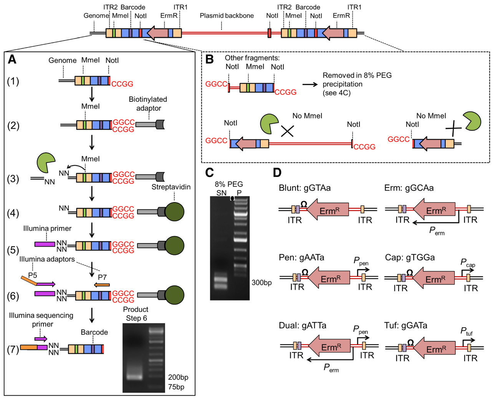

# Introduction
{:.no_toc}
Transposon insertion sequencing is a technique used to functionally annotate bacterial genomes. The genome is saturated by transposon insertions. The transposon is a mariner transposon (inserting at TA sites) that has been modified to allow the sequencing of flanking regions. By saturating the genome we ensure every TA site in the genome has an insertion at least one in the initial population of bacteria. The population is then grown in different media and the sequenced. The sequencing of the regions flanking the insertion allows to detect where are the insertion retained in the population after growth and to quantify them. The insertion of a transposon being disruptive for the region, if some insertions disappear completely from the population it indicates that the region is essential for the the bacteria survival.

| Transposon insertion sequencing method |
|:--------------:|
||
| **a. Data production** The initial population genomes are mutated so that the genome is saturated with transposon insertions.  A library is *saturated* if in the genomes across the whole population of bacteria, each potential insertion site has at least one insertion. The population is then divided into several media containing different growth conditions. After growth, the regions flanking the insertion are amplified and sequenced, allowing to determine the location of the insertion. **b. Analysis** After alignement to the reference genome, the resulting data will show a discrete repartition of reads on each TA site. If a gene present several insertions, like the two leftmost genes in *Condition A*, it means that its disruption has little or no impact to the bacterial growth. On the other hand, when a gene shows no insertions at all, like the rightmost gene in *Condition A*, is means that any disruption in this gene killed the bacteria, meaning its a gene essential to bacteria survival. If the library is sufficiently saturated, there is a clear threshold between essential and non-essential genes when you analyze the insertion rate per gene. From [Chao et al.](http://www.doi.org/10.1038/nrmicro.2015.7)|
|:--------------|

In order to target the flanking regions for sequencing, the reads have a specific set of sequences that will impact how we will process them.

| Structure of the tranposon constructs |
|:--------------:|
||
| The transposon construct is a mariner transposon with two specific region used to specifically sequence the region upstream of the insertion. The transposon inserts at TA site at the ITR junctions. These ITR junctions have been modified to include a Mme1 restriction site (cut 21 bp upstream from the restriction site). It also includes a NotI restriction site. These two site are the 5' and 3' limits to the genomic DNA we want to sequence. **A. Sequence flanking genomic regions** After digestion by NotI restriction enzyme. these fragments are attached to biotinylated adaptors that link to NotI restriction site. The attached fragment are then digested by MMeI at a site upstream , where an Illumina primer is then linked. The sequencing is then done, adding Illumina adaptors and an additional barcode to the read for multiplexed sequencing. **B. Removing incorrect fragments** An insertion can sometimes be composed of one or more copies of the transposon (multimer). There is therefore a risk to select plasmid backbone sequence. To solve this problem, an additional NotI has been add in the backbone to create different length construct, that can later be filtrated (C). Different promoters are added to the construct along with an additional 3 bp barcode to analyse differential expression impact, but this will be the subject of another tutorial.  From [Santiago et al.](http://www.doi.org/10.1186/s12864-015-1361-3)|
|:--------------|
||

> ### Agenda
>
> In this tutorial, we will deal with:
>
> 1. TOC
> {:toc}
>
{: .agenda}

# Pre-processing the data

## Data Structure

The experimental design of transposon insertion sequencing produces raw reads containing a lot of adapters and foreign sequences that has been used to insert and target the transposon. In order to obtain the core reads that contain only genomic sequence, we have a number of steps to do to remove them and divide the reads per experimental condition and type of transposon.

## Separating Conditions

 First we divide the initial data set by experimental conditions thanks to a 8bp barcode

> ###  Hands-on:
>
> 1.
> 2.
> 3.
>
>
{: .hands_on}
