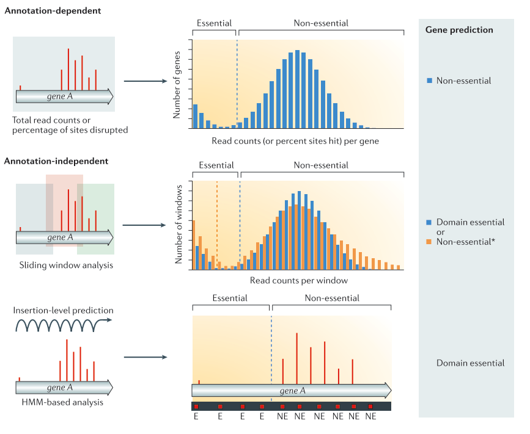

# Introduction
{:.no_toc}

In microbiology, identifying links between genotype and phenotype is key to understand bacteria growth and virulence mechanisms, and to identify targets for drugs and vaccines. These analysis are limated y the lack of bacterial genome annotations (eg 30% of genes for S. pneumoniae are of unknown function) and by the fact that genotypes often arose from complex composant interactions.
## Overview of Transposon insertion Sequencing
{:.no_toc}

Transposon insertion sequencing is a technique used to functionally annotate bacterial genomes. The genome is saturated by transposon insertions, an the insertion of a transposon being disruptive for the region, the analysis of insertion frequency provides information on how the bacteria fitness change due to this disruption (see [Transposon insertion sequencing method](#method)) :
 - An insertion mutant with lower fitness decrease frequency in the population
 - An increased fitness lead to increased frequency in the population

| Transposon insertion sequencing method |
|:--------------:|
||
| **a. Data production** The initial population genomes are mutated so that the genome is saturated with transposon insertions.  A library is *saturated* if in the genomes across the whole population of bacteria, each potential insertion site has at least one insertion. The population is then divided into several media containing different growth conditions. After growth, the regions flanking the insertion are amplified and sequenced, allowing to determine the location of the insertion. **b. Analysis** After alignement to the reference genome, the resulting data will show a discrete repartition of reads on each TA site. If a gene present several insertions, like the two leftmost genes in *Condition A*, it means that its disruption has little or no impact to the bacterial growth. On the other hand, when a gene shows no insertions at all, like the rightmost gene in *Condition A*, is means that any disruption in this gene killed the bacteria, meaning its a gene essential to bacteria survival. If the library is sufficiently saturated, there is a clear threshold between essential and non-essential genes when you analyze the insertion rate per gene. From [Chao et al.](http://www.doi.org/10.1038/nrmicro.2015.7)|
||


Two type of transposon insertion methods exist:
 -  Gene disruption, where we analyze only the disruptions. (The object of this tutorial)
 -  Regulatory element insertion, where different promoters are inserted by the transposon, and we analyze the change in gene expression in addition to the disruption. (Will be the subject or another tutorial)

## <a name="BuildLibrary">Building a TnSeq library</a>
{:.no_toc}

In this tutorial, we are using mariner transposon, that target TA sequences, in ordered to target the whole genome uniformaly. Different types of transposon can be used depending of the goal of you analysis :
- Randomly pooled tranposon :
    - Mariner-based transposons, which target TA dinucleotides
        - The TA are distributed relatively evenly along genome, which allows to impact statistically every gene
        - There is in average more than 30 insertions site per kb
        - The local variations means less loci and less statistical power
        - Advantages: low insertion bias, easy to build saturated libraries
    - Tn5-based vectors, which insert at random sites
        - Require no target sequences
        - It has a preference for high GC content, causing insertion bias
        - Useful for specie where it is difficult to build mariner based transposons
- Defined sequence transposon
    - Can be used to study interactions in pathways of interest
    - More precise targeting (small genes, pathways) for specific analyses

Independently of your choice of transposon you need to be careful about your library complexity . A large complexity means that there is multiple insertion in every potential locus. The higher density of insertion you have, the greater precision  you have in identifying limits of regions of interest. If the density of the library is too low, some genes might not be disrupted by chance and mistaken for essential. The advantage of a target specific transposon, like the mariner, in opposition of a Tn5-based transposon inserting randomly, it that the limited number of insertion sites makes it easier to build high complexity libraries.

After you selected the type of transposon corresponding to your goals, you need to modify it to allow insertion site amplification and sequencing so that you get a library representative of the tranposon insertion.
Biases could get introduced by the process due to uneven fragment sized. To avoid this problem, we can introduce a Type I restriction site to cleave DNA downstream of transposon, and get uniform fragment sizes

It has been shown that a minimum length of 16 bp is necessary for precise mapping on the genome ([Kwon and al. 2016](http://doi.org/10.1007/s00253-015-7037-8)). We can therefore use the MmeI restriction site (21pb) but not BsmFI (11 to 12 bp). It is not important in that case to have longer reads as we do not care to have a good coverage on the entire genome, the only information we need it the Ta site affected by an insertion, to do that we only need the location of the start of a read.

In this tutorial, the transposon is a mariner Himar1 with the structure described in the figure [Structure of the tranposon constructs](#TranspStructure)

| Structure of the tranposon constructs |
|:--------------:|
||
| The transposon construct is a mariner transposon with two specific region used to specifically sequence the region upstream of the insertion. The transposon inserts at TA site at the ITR junctions. These ITR junctions have been modified to include a Mme1 restriction site (cut 21 bp upstream from the restriction site). Using MmeI enzyme to determine the size of the reads allow to have a hmogeneous read size and therefore avoid a bias in the representation of the insertions. It also includes a NotI restriction site. These two site are the 5' and 3' limits to the genomic DNA we want to sequence. **A. Sequence flanking genomic regions** After digestion by NotI restriction enzyme. these fragments are attached to biotinylated adaptors that link to NotI restriction site. The attached fragment are then digested by MMeI at a site upstream , where an Illumina primer is then linked. The sequencing is then done, adding Illumina adaptors and an additional barcode to the read for multiplexed sequencing. **B. Removing incorrect fragments** An insertion can sometimes be composed of one or more copies of the transposon (multimer). There is therefore a risk to select plasmid backbone sequence. To solve this problem, an additional NotI has been add in the backbone to create different length construct, that can later be filtrated (C). Different promoters are added to the construct along with an additional 3 bp barcode to analyze differential expression impact, but this will be the subject of another tutorial.  From [Santiago et al.](http://www.doi.org/10.1186/s12864-015-1361-3)|
||

Because of this complex tranposon structure, the reads obtained after sequencing contain a large portion of tranposon sequence for a 16-17 bp genomic sequence. This will necessitate several step of pre-processing to extract this genomic sequence.  


## Tnseq analysis
{:.no_toc}

Once we extracted the genomic sequences from the initial reads, we need to locate each of them on the genome to link them to a TA site. To do that we need to map them to a reference genome, link them to a specific insertion site, and then count the number of insertion for each TA site.

Once we have the count of insertion at every insertion site, there is several methods existing to identify essential genes of regions. They can be divided in two major categories (see figure [Methods of TnSeq Analyses](#AnalysesMethods)) :
1. Annotation dependent : The read counts and/or insertion frequency are calculated across defined regions (genes, promoters ... )
2. Annotation independent : The read counts and/or disrupted sites are considered across the whole genome, independently of defined structures.


| Methods of TnSeq Analyses|
|:--------------:|
||
| **Annotation dependent method** The total read count an/or percentage of disrupted site are computed per annotated regions. The values are then compared to the rest of the genome to classify the genes into the categories *essential* or *non-essential*. **Annotation independent method** The total read count and/or disrupted sites are computed independently of annotated regions. One of these methods is using a sliding window. Each window is then classified into the categories *essential* or *non-essential*. After the windows have been classified, they are linked annotations, and the genes/regions can be classified as *essential*, *non-essential*, or *domain essential* according to the classification of the windows they cover. The same classification can be done using HMM based methods instead of sliding windows. In that case, each insertion site will be predicted as *essential* or *non essential*. From [Chao et al.](http://www.doi.org/10.1038/nrmicro.2015.7)|
||


The objectives of this tutorial will then be to remove non genomic sequences from the reads, align them to a reference genome, and use the location of genes to determine a list of essential genes.
> ### Agenda
>
> In this tutorial, we will deal with:
>
> 1. TOC
> {:toc}
>
{: .agenda}

# Removing all non genomic sequences from the sequenced reads

## Data Structure

The experimental design of transposon insertion sequencing produces raw reads containing a lot of adapters and foreign sequences that has been used to insert and target the transposon. In order to obtain the core reads that contain only genomic sequence, we have a number of steps to do to remove them and divide the reads per experimental condition and type of transposon.

| Data pre-processing |
|:--------------:|
||
|The pre-processing of the data will be don through several steps of Cutadapt software, first we sill separate the reads of each experimental condition based on a 8 bp barcode at the beginning of the read (Illumina demultiplexing). The tail of each set of read is then removed. It immediately follows the 3bp barcode specific to transposon constructs, and contains illumina adapter sequence and downstream. To be sure all our reads have been trimmed correctly we filter out the reads too large. We then separate the reads per transposon construct and then remove the remaining transposon sequence containing MmeI.|
||


## Separating reads from different experimental conditions

 First we divide the initial data set by experimental conditions thanks to a 8bp barcode added by the Illumina multiplexing protocol.
 Start with uploading the training dataset containing all the reads here (put zenodolink).
 Then we need to create a fasta file containing the barcodes for each condition.


 Barcode data:
 ```
 >control
 ^CTCAGAAG
 >condition
 ^GACGTCAT
 ```

 The '^' at the beginning of the sequence means we want to anchor the barcode at the beginning of the read. To know more about the symbols used by cutadapt, see cutadapt [manual](https://cutadapt.readthedocs.io/en/stable/guide.html#adapter-types)

> ###  Hands-on:  Barcode splitting with Cutadapt
>
>  **Click** on the upload icon in the left panel to upload barcode data.
>    - **Click** on the `Paste/Fetch Data` button
>    - Change *"Name"* to `Condition barcodes`
>    - Change *"Type"* to `Fasta`
>    - Paste the barcode data.
>    - **Click** on `Start button`
>
>  Select the **Cutadapt** tool in the tool bar and run with the following parameters to split the dataset based on barcodes:
>    - Set *"Single-end or Paired-end reads?"* to `Single-end`
>    - Set *"FASTQ/A file"* to the `fastq file` containing the training set.
>    - **Click** on `Insert 5' (Front) Adapters`
>         - Set *"Source"* to `File From History`
>         - Set *"Choose file containing 5' adapters"* to the `condition barcodes` file in the history
>    - **Click** on `Adapter Options`
>         - Set *"Maximum error rate"* to `0.15` to allow 1 mismatch
>         - Set *"Match times"* to `3` in case the barcode attached several times
>    - **Click** on `Output Options`
>         - Set *"Report"* to `yes`
>         - Set *"Multiple output"* to `yes` to separate the reads into one file per condition
>    - **Click** on `Execute`
>
>
>    > ###  Questions
>    >
>    >  What would change if our barcodes were at the end of the reads ?
>    >
>    > > ###  Solution
>    > >  
>    > >  We would have used the option `Insert 3' (End) Adapters` and anchored them at the end of the read with the symbol `$` in our fasta file containing the barcodes.
>    > >
>    > {: .solution }
>    >
> {: .question}
{: .hands_on}

The output is a collection of the different conditions dataset, here control and condition, and a report text file.
You can look at the report and see that 100% of the reads has been trimmed.


## Removing Adapter sequence

Now that we have divided the set per condition, we are going to trim the tail containing the illumina adapter. We want to remove the adapter and everything downstream, we are therefore gonna use the end adapter option of cutadapt and not anchor the sequence anywhere.
To remove the reads that might not have been trimmed because of too many mismatches or other reasons, we will then filter the reads by size. Because we know the approximate size of the remaining sequences, we can filter the reads based on this estimation.


> ###  Hands-on:  Remove Adapter with Cutadapt
>
>  Select the **Cutadapt** tool in the tool bar and run with the following parameters to remove adapters:
>    - Set *"Single-end or Paired-end reads?"* to `Single-end`
>    - Set *"FASTQ/A file"* to the `Cutadapt on data... Output` collection output of the previous step.
>    - **Click** on `Insert 3' (End) Adapters`
>        - Set *"Source"* to `Enter custom Sequence`
>        - Set *"Enter custom 3' adapter sequence"* to `CGTTATGGCACGC`
>    - **Click** on `Adapter Options`
>        - Set *"Match times"* to `3` in case the barcode attached several times
>    - **Click** on `Output Options`
>        - Set *"Report"* to `yes`
>    - **Click** on `Execute`
>
>
>  Run  **Cutadapt**  again with the following parameters to filter reads based on length:
>    - Set *"Single-end or Paired-end reads?"* to `Single-end`
>    - Set *"FASTQ/A file"* to the `Cutadapt on data... Output` collection output of the previous step.
>    - **Click** on `Filter Options`
>        - Set *"Minimum length"* to `64`
>        - Set *"Maximum length"* to `70`
>    - **Click** on `Output Options`
>        - Set *"Report"* to `yes`
>    - **Click** on `Execute`
>
>
>
>    > ###  Questions
>    >
>    > 1. What are the outputs at this step?
>    >  
>    > 2. What percentage of the reads contained the adapter?
>    >  
>    > 3. How many reads where discarded after filtering?
>    >
>    > > ###  Solution
>    > >  
>    > > 1. The outputs are two collections : one containing the reads in two conditions, and one containing the Cutadapt reports for each condition.
>    > >
>    > > 2. More than 99% of the reads contained the adapter in both conditions. (Line `Reads with adapters` in Report output)
>    > >
>    > > 3. Less than 2% of the reads were discarded in both conditions. (Lines `Reads that were too short` and `Reads that were too long` in Report output)
>    > >
>    > {: .solution }
> {: .question}
>
{: .hands_on}

We can see that is both samples the reads have pass the filtering at more than 98%. If the reads passing is very low, it means the previous trimming steps is incomplete or faulty.

## Separate reads from different transposon constructs

We have now removed the transposon sequences that was outside of the 3 bp barcode specific to the type of construct. The constructs used in this experiment contain different strengths and directions of promoters. It means that in addition of disrupting a gene at the location of the insertion, it will modify the expression of either upstream or downstream regions. The analysis of this modification will be studied in another training material, but for now we will consider it does not impact the essentiality analysis and we will use the different constructs as replicates.
We therefore need to separate the reads based on the construct specific 3bp barcodes.

You can download the fasta file containing the barcodes here (add zenodo link)). Upload the file into galaxy and take a look at it.

> ###  Questions
>
> What does the "$" means in the barcode sequence file ?
>
>   > ###  Solution
>   >
>   > It means the barcode is anchored at the end of the reads.
>   >
> {: .solution }
>
{: .question}  


> ###  Hands-on:  Barcode split with Cutadapt
>
>  Select the **Cutadapt** tool in the tool bar and run with the following parameters:
>    - Set *"Single-end or Paired-end reads?"* to `Single-end`
>    - Set *"FASTQ/A file"* to the  `Cutadapt on data... Output` collection output of the previous step.
>    - **Click** on `Insert 3' (End) Adapters`
>        - Set *"Source"* to `File From History`
>        - Set *"Choose file containing 3' adapters"* to the `construct barcodes` file in our history
>    - **Click** on `Adapter Options`
>        - Set *"Match times"* to `3` in case the barcode attached several times
>    - **Click** on `Output Options`
>        - Set *"Report"* to `yes`
>        - Set *"Multiple output"* to `yes` to separate the reads into one file per condition
>    - **Click** on `Execute`
>
>    > ###  Questions
>    >
>    > Are the reads equally divided between constructs ?
>    >
>    > > ###  Solution
>    > >  When you look at the reports, you can see that most of the reads have been assigned to the *blunt* construct, this is because the blunt construct is the control and does not contain any promoters. This means that there is less negative selective pressure on blunt than the other ones, that have affected flanking region in addition to the disrupted gene at the insertion site.  This won't be a problem here as the tool we use for the essentiality prediction consider the sum of reads in the replicates.
>    > >
>    > {: .solution }
> {: .question}
>
{: .hands_on}

You can notice that the output of this split is a *nested collection*, a collection of collection.

## Removing remaining transposon sequence.

The last remaining transposon sequence is the linker containing the MmeI restriction site.


> ###  Hands-on:  Remove Linker with Cutadapt
>
>  Select the **Cutadapt** tool in the tool bar and run with the following parameters:
>    - Set *"Single-end or Paired-end reads?"* to `Single-end`
>    - Set *"FASTQ/A file"* to the `Cutadapt on data... Output` nested collection output of the previous step.
>    - **Click** on `Insert 3' (End) Adapters`
>        - Set *"Source"* to `Enter custom Sequence`
>        - Set *"Enter custom 3' adapter sequence"* to `ACAGGTTGGATGATAAGTCCCCGGTCTATATTGAGAGTAACTACATTT`
>    - **Click** on `Adapter Options`
>        - Set *"Maximum error rate"* to `0.15`
>    - **Click** on `Output Options`
>        - Set *"Report"* to `yes`
>    - **Click** on `Execute`
>
{: .hands_on}

Verify that the majority of the read have been trimmed. Now that we isolated the genomic sequences from the initial reads. We want to align them to count how many insertion have been retained at each TA sites.

# Counting the number of insertion per TA sites

## Aligning the reads to a reference genome

The first step is to map our read to a the reference genome (you can download it here (zenodo link)). We are going to use the tool Bowtie. We could also use Bowtie2 with an end-to-end option, but Bowtie is more suitable for very short reads like ours (16-17 bp).

> ###  Hands-on:  Map reads with Bowtie
>
>  Select the **Map with Bowtie for Illumina** tool in the tool bar and run with the following parameters:
>   - Set *"Will you select a reference genome from your history or use a built-in index?"* to `Use one from the history`
>   - Set *"Select the reference genome"* to the `staph_aur.fasta` file that you just uploaded.
>   - Set *"Is this library mate-paired?"* to `Single-end`
>   -  Set *"FASTQ file"* to `Cutadapt on...Output` that you got at the end of the preprocessing section
>   - Set *"Bowtie settings to use"* to `Full parameters list` to change parameters so that bowtie stricly enforces no mismatches.
>       - Set *"Skip the first n reads (-s)"* to `0`
>       - Set *"Maximum number of mismatches permitted in the seed (-n)"* to `0`
>       - Set *"Seed length (-l)"* to `17`
>       - Set *"Whether or not to try as hard as possible to find valid alignments when they exist (-y)"* to `Try Hard`
>       - Set *"Whether or not to make Bowtie guarantee that reported singleton alignments are 'best' in terms of stratum and in terms of the quality values at the mismatched positions (--best)"* to `Use best`
>   - **Click** on `Execute`
>
>
>  *Optional* : Rename your collection for better clarity:
>   - Open the collection by clicking on it in the history panel
>   -  **Click** on the name of the collection `Bowtie...`
>   - Change the title to  `Mapped reads`
>   - Hit Enter key
>
>
>    > ###  Questions
>    >
>    > Why are we strictly enforcing no mismatch mapping?
>    >
>    > > ###  Solution
>    > > Our reads being very short, the smallest size allowing precise mapping (see [Introduction](#BuildLibrary) ), allowing even one mismatch would risk having reads mapping in wrong positions.
>    > >
>    > {: .solution }
> {: .question}
>
{: .hands_on}

## Getting coverage of the genome

Now that we have mapped the reads on the reference genome, we are going to calculate the coverage of the genome to later cross them with our TA sites position.
In our case, the reads cover the flanking region on one side of the TA site where the transposon inserted. That means we do not want to have the coverage across the whole reads, as it could cover several TA sites, but only the coverage at the end of the read. (See Figure [Mapping read and TA site coverage](#MapCoverage))


| Mapping read and TA site coverage |
|:--------------:|
||
| The sequenced read cover the 5' region flanking the site of insertion. To assign the read to its correct insertion, we need to compute the coverage at the 3' end of the read. |
||


> ###  Hands-on:  Compute genome coverage
>
>  Select the **bamCoverage** tool in the tool bar and run with the following parameters:
>   - Set *"BAM/CRAM file"* to `Mapped Reads` collection
>   - Set *"Bin size in bases"* to `1`
>   - Set *"Scaling/Normalization method"* to `Do not normalize or scale`
>   - Set *"Coverage file format"* to `bedgraph`
>   - Set *"Show advanced options"* to `yes`
>       - Set *"Ignore missing data?"* to `yes` to get only region with read counts
>       - Set *"Offset inside each alignment to use for the signal location."* to `-1` to read the signal of the coverage only at the 3' end of the read.
>   - **Click** on `Execute`
>
{: .hands_on}

## Getting TA sites positions

## Merging overall coverage and TA sites to get the coverage of each TA sites

# Predicting Essential Genes with Transit

> ###  Hands-on:
>
> 1.
> 2.
> 3.
>
>
{: .hands_on}
