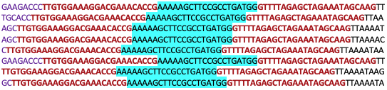
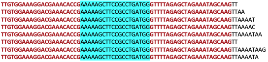
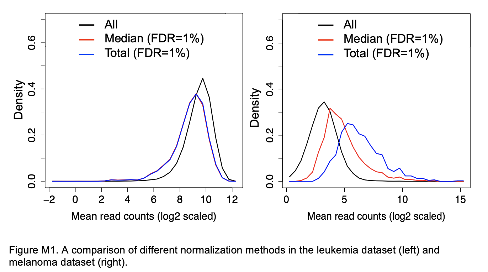

# Introduction
{:.no_toc}

**C**lustered **R**egularly **I**nterspaced **S**hort **P**alindromic **R**epeats (**CRISPR**)-Cas9 is a groundbreaking technology of recent years. It enables editing of the genome and resulted in a Nobel Prize for Emmanuelle Charpentier and Jennifer Doudna in 2020. 

The CRISPR repeat sequences guide the Cas9 enzyme to introduce breaks in DNA. With the CRISPR-Cas9 editing system, a 20 base target region in the genome is added into the CRISPR guide and the Cas9 enzyme then cuts this region.

CRISPR screens provide a high-throughput way to identify genes and pathways that enable cells to survive. In a CRISPR screen all the genes in the genome can be targeted (genome-wide screen) or just a selection (boutique screen). Knockout or activation screens can be performed. 

")

Here we will demonstrate analysing CRISPR screen using data from .


> ### Agenda
>
> In this tutorial, we will cover:
>
> 1. TOC
> {:toc}
>
{: .agenda}

# Preparing the reads

## Data upload

We will use fastq files containing 1% of reads from the original samples to demonstrate the read processing steps. 

> ###  Hands-on: Retrieve CRISPR screen fastq datasets
>
> 1. Create a new history for this tutorial
> 2. Import the files from Zenodo:
>
>    - Open the file  __upload__ menu
>    - Click on __Rule-based__ tab
>    - *"Upload data as"*: `Collection(s)`
>    - Copy the following tabular data, paste it into the textbox and press <kbd>Build</kbd>
>
>      ```
>      T0-Control https://zenodo.org/api/files/646f76fa-dc6b-404a-9a74-c371a43aacd5/T0-Control.fastq.gz
>      T8-APR-246 https://zenodo.org/api/files/646f76fa-dc6b-404a-9a74-c371a43aacd5/T8-APR-246.fastq.gz
>      T8-Vehicle https://zenodo.org/api/files/646f76fa-dc6b-404a-9a74-c371a43aacd5/T8-Vehicle.fastq.gz
>      ```
>  
>    
>
>    - From **Rules** menu select `Add / Modify Column Definitions`
>       - Click `Add Definition` button and select `List Identifier(s)`: column `A`
>
>         > ###  Can't find *List Identifier*?
>         > Then you've chosen to upload as a 'dataset' and not a 'collection'. Close the upload menu, and restart the process, making sure you check *Upload data as*: **Collection(s)**
>         {: .tip}
>
>       - Click `Add Definition` button and select `URL`: column `B`
>
>    - Click `Apply` 
>    - In the Name: box type `fastqs` and press <kbd>Upload</kbd>
>      
>    
>    
{: .hands_on}

## Raw reads QC

First we'll check the quality of the raw read sequences with [FastQC](https://www.bioinformatics.babraham.ac.uk/projects/fastqc/) and aggregate the reports from the multiple samples with [MultiQC](https://multiqc.info/) (). We will check if the base quality is good and for presence of adapters. For more details on quality control and what the FastQC plots mean see the ["Quality control" tutorial]().


> ###  Hands-on: Quality control
>
> 1.  with the following parameters:
>    -  *"Short read data from your current history"*: fastqs (click "Dataset collection" button on left-side of this input field)
>
> 2. Inspect the webpage output of **FastQC** for the T0 sample
>
>    > ###  Questions
>    >
>    > What is the read length?
>    >
>    > > ###  Solution
>    > >
>    > > The read length is 75 bp.
>    > >
>    > {: .solution}
>    >
>    {: .question}
>
> 3.  with the following parameters to aggregate the FastQC reports:
>     - In *"Results"*
>       - *"Which tool was used generate logs?"*: `FastQC`
>       - In *"FastQC output"*
>         - *"Type of FastQC output?"*: `Raw data`
>         -  *"FastQC output"*: `Raw data` files (output of **FastQC**)
>
> 4. Inspect the webpage output from MultiQC for each FASTQ
>
>    > ###  Questions
>    >
>    > What do you think of the quality of the sequences?
>    >
>    > > ###  Solution
>    > >
>    > > The quality seems good for the 3 files.
>    > >
>    > {: .solution}
>    >
>    {: .question}
>
{: .hands_on}


## Trim adapters

We need to trim the adapters to leave just the 20bp guide sequences.  We'll trim these sequences using [Cutadapt](https://cutadapt.readthedocs.io/en/stable/guide.html) () and its linked adapter format `MY_5PRIME_ADAPTER...MY_3PRIME_ADAPTER`.


> ###  Adapter trimming
> 
> In this dataset the adapters are different lengths in the reads, as shown below. 
>
> 
>
> MAGeCK count can trim adapters around the guide sequences. However, the adapters need to be the same length in the reads, as described on the MAGeCK website [here](https://sourceforge.net/p/mageck/wiki/advanced_tutorial/). An example for what MAGeCK expects is shown below. If you used MAGeCK count trimming with the dataset in this tutorial it wouldn't be able to trim the adapters properly and you would only get ~60% reads mapping instead of >80%.
>
> 
>
> So for this dataset, as the adapters are not the same length in the reads, we need to trim the adapters before running MAGeCK count. To trim, we could run Cutadapt twice, first trimming the 5' adapter sequence, then trimming the 3' adapter. Alternatively, we can run Cutadapt just once using the linked adapter format `MY_5PRIME_ADAPTER...MY_3PRIME_ADAPTER`, as discussed [here](https://github.com/marcelm/cutadapt/issues/261#issue-261019127).
{: .details}


> ###  Hands-on: Trim adapters
>
> 1.  with the following parameters:
>    - *"Single-end or Paired-end reads?"*: `Single-end`
>        -  *"FASTQ/A file #1"*: all fastq.gz files 
>        - In *"Read 1 Options"*:
>            - In *"3' (End) Adapters"*:
>                -  *"Insert 3' (End) Adapters"*
>                    - *"Source"*: `Enter custom sequence`
>                        - *"Enter custom 3' adapter sequence"*: `TGTGGAAAGGACGAAACACCG...GTTTTAGAGCTAGAAATAGCAAG`
>    - In *"Filter Options"*:
>        - *"Minimum length (R1)"*: `20`
>    - In *"Read Modification Options"*:
>        - *"Quality cutoff"*: `20`
>    - *"Outputs selector"*: 
>        - *"Report"*: tick
>
> 2. Inspect the report output from Cutadapt for the T8-APR sample
>
>    > ###  Questions
>    >
>    > What % of reads had adapters?
>    >
>    > > ###  Solution
>    > >
>    > > 99.9% 
>    > >
>    > {: .solution}
>    >
>    {: .question}
>
{: .hands_on}


# Counting

For the rest of the CRISPR screen analysis, counting and testing, we'll use MAGeCK (, ).

To count how many guides we have for each gene, we need a library file that tells us which guide sequence belongs to which gene. The guides used here are from the Brunello library so we use that file. The file must be tab-separated and contain no spaces within the target names. If necessary, there are tools in Galaxy that can format the file removing spaces and converting commas to tabs.

> ###  Hands-on: Count guides per gene
> 1. Import the library file 
>    ```
>    https://zenodo.org/api/files/646f76fa-dc6b-404a-9a74-c371a43aacd5/brunello.tsv
>    ```
>
>    
>
> 2.  with the following parameters:
>    - *"Reads Files or Count Table?"*: `Separate Reads files`
>        -  *"Sample reads"*: the `Read 1 Output` (outputs of **Cutadapt**)
>    -  *"sgRNA library file"*: the `brunello.tsv` file
>    - In *"Output Options"*:
>        - *"Output Count Summary file"*: `Yes`
>        - *"Output plots"*: `Yes`
>
> 3. Inspect the Count Summary file
>
> 4. We have been using 1% of reads from the samples. Import the count summary file for the full dataset so you can see what the values look like.
>    ```
>    https://zenodo.org/api/files/646f76fa-dc6b-404a-9a74-c371a43aacd5/kenji_mageck_count_summary.tsv
>    ```
>
{: .hands_on}

The contents of the count summary file is explained on the MAGeCK website [here](https://sourceforge.net/p/mageck/wiki/output/#count_summary_txt), also shown below. The columns are as follows. **To help you evaluate the quality of the data, recommended values are shown in bold.**

Column | Content
--- | ---
File | The fastq (or the count table) file used.
Label | The label of that fastq file assigned.
Reads | Total number reads in the fastq file. **(Recommended: 100~300 times the number of sgRNAs)**
Mapped | Total number of reads that can be mapped to library
Percentage | Mapped percentage, calculated as Mapped/Reads **(Recommended: at least 60%)**
TotalsgRNAs | Total number of sgRNAs in the library
Zerocounts | Total number of missing sgRNAs (sgRNAs that have 0 counts) **(Recommended: no more than 1%)**
GiniIndex | The Gini Index of the read count distribution. A smaller value indicates more eveness of the count distribution. **(Recommended: around 0.1 for plasmid or initial state samples, and around 0.2-0.3 for negative selection samples )**


> ###  Questions
>
> Is the data quality good for the 3 samples? Use the count summary file for the full dataset, and the recommended values in the table above, to answer these questions.
>
> 1. Have we sequenced enough reads?
> 2. Is the mapped percentage good?
> 3. Is the sgRNA zero count value good?
> 4. Is the Gini Index good?
>
> > ###  Solution
> >
> > 1. The number of reads is ok. The lowest number of reads we have for a sample is 17,855,968 (T8-Vehicle), we have 77,441 guides so we have ~230 reads per guide (17,855,968/77,441). A minimum of 100 reads per guide, preferably 300, is recommended.
> > 2. Yes, it is >80% in all 3 samples.
> > 3. T0-Control has 0.69% (535/77441 * 100) which is good. The T8 samples are just slightly high at 2.1% (1659/77441 * 100) and 2.7% (2102/77441 * 100).
> > 4. The Gini Index is 0.09 for T0-Control (initial state) which is good. The T8 samples are 0.12 and 0.13 which is good (not too high) as this is a negative selection experiment.
> >
> {: .solution}
>
{: .question}


The paper by  has more information on MAGeCK quality control.

# Testing

We have been using 1% of reads from the samples in the original dataset to save time as FASTQ files are large. As counts files are small, here we will import and use the MAGeCK counts file generated using all the reads for the samples.

We want to compare the drug treated sample (T8-APR-246) to the control (T8-Vehicle). We could specify them using their names, which must match the names used in the columns of the counts file, but hypens aren't allowed. We can also specify by their positions in the counts file with the first sample column being 0.

> ###  Hands-on: Test for enrichment
> 1. Import the count file from the full dataset [Zenodo]({{ page.zenodo_link }}) or the Shared Data library (if available):
>    ```
>    https://zenodo.org/api/files/646f76fa-dc6b-404a-9a74-c371a43aacd5/kenji_mageck_counts.tsv
>    ```
>
> 2.  with the following parameters:
>    -  *"Counts file"*: the `kenji_mageck_counts.tsv` file
>    - *"Specify Treated samples or Control"*: `Treated samples`
>        - *"Treated Sample Labels (or Indexes)"*: `0`
>    - *"Control Sample Labels (or Indexes)"*: `1`
>    - In *"Output Options"*:
>        - *"Output normalized counts file"*: `Yes`
>        - *"Output plots"*: `Yes`
>
>
>
>    > ###  Normalization
>    >
>    > We are using MAGeCK's default normalization method "median" which is more robust to outliers.
>    > Figure M1 from  shows a comparison of median ("median") versus total ("total") normalization for two CRISPR screen datasets. 
>    > The distribution of the read counts of significant sgRNAs (FDR=1%) was compared with the mean read count distribution of all sgRNAs (“all”, black). The distribution of the significant sgRNAs should be similar to the distribution of all sgRNAs if the normalization method is unbiased. The difference is small for the leukemia dataset. However, in the melanoma dataset, where a few sgRNAs have very large read counts, the difference is larger, as “total” normalization will prefer sgRNAs with higher read-counts. In contrast, the distribution after “median” normalization is closer to the distribution of all sgRNAs.
>    > 
>    > 
>    >
>    {: .details}
>
> 3. Inspect the PDF Report output.
>
>    > ###  Questions
>    >
>    > What are the top 3 genes?
>    >
>    > > ###  Solution
>    > >
>    > > ESD, MTHFD1L and SHMT2 which are part of the glutathione pathway. That was the main pathway found to be altered in the published paper for this dataset.
>    > >
>    > {: .solution}
>    >
>    {: .question}
>
{: .hands_on}


> ###  Tip: Getting help
>
> For questions about using Galaxy, you can ask in the [Galaxy help forum](https://help.galaxyproject.org/). For questions about MAGeCK, you can ask in the [MAGeCK Google group](https://groups.google.com/g/mageck).
>
{: .tip}


# Conclusion
{:.no_toc}

CRISPR Screen reads can be assessed for quality using standard sequencing tools such as FASTQC, MultiQC and trimmed of adapters using Cutadapt. The detection of enriched guides can be performed using MAGeCK.
