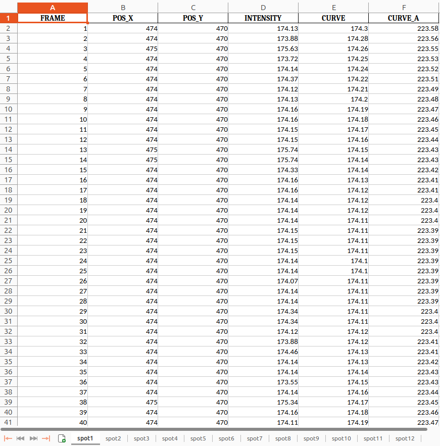

# Introduction

Mitochondria act like fuel stations for the cell, supplying the energy needed to keep it functioning and healthy. During certain activities, they can produce bursts of **superoxide**, known as '**mitoflashes**.' These short, intense events occur in individual mitochondria and can be observed in cardiomyocytes, skeletal muscle, hippocampal neurons, chondrocytes, isolated mitochondria, and among other types of eukaryotic cells using confocal microscopy. Commonly detected with a mitochondria-targeted circularly permuted fluorescent protein (mt-cpYFP), mitoflashes provide real-time insights into mitochondrial respiration function _in situ_ and act as a biosensor for superoxide levels, reflecting the activity of the mitochondrial electron transport chain.

Mitoflashes are triggered by elevated **reactive oxygen species (ROS)** levels, and various physiological and stress-related signals including fluctuations in mitochondrial membrane potential, transient openings of the mitochondrial permeability transition pore (mPTP), calcium level changes, and bioenergetic stress (like nutrient deprivation or high metabolic demand, ). Additionally, they can be induced during specific cellular processes, like differentiation and certain developmental stages, where mitochondrial function is tightly regulated. This burst event activates the mPTP, causing a depolarization of the mitochondrial membrane potential (ΔΨm) and a mild alkalization of the matrix (). While mitoflashes signal mitochondrial activity and ROS changes, they do not precisely quantify ROS levels or other cellular signatures. These events, however, are able to distinguish active from static mitochondria, making them valuable biomarkers for tracking mitochondrial health and function.

Importantly, the frequency and kinetics of mitoflashes hold physiological and pathophysiological implications. They correlate with key processes such as muscle contraction, cell differentiation, neuron development, wound healing, and lifespan prediction. The frequency and characteristics of mitoflashes vary by cell type; for example, adult cardiomyocytes display approximately 3.8 ± 0.5 mitoflashes, while primary cultured hippocampal neurons show around 31 ± 4 per cell ().

In this tutorial, you will learn to track mitochondria in live-cell imaging data and detect mitoflashes using Galaxy tools for image analysis. You will work with time-lapse microscopy data, often stored as TIFF files with image stacks, to observe and analyze mitochondrial events across multiple time points. By identifying these events and quantifying their frequency through intensity measurements fitted to a curve, you'll gain insights into mitochondrial behavior and activity over time.

This tutorial is based on a workflow originally described in % cite Wang2022 %.

> <agenda-title></agenda-title>
>
> In this tutorial, we will cover:
>
> 1. Understanding the concept and biological relevance of mitoflashes.
> 2. Processing live-cell imaging data for mitochondrial tracking.
> 3. Detecting and analyzing mitoflashes with Galaxy tools.
> 4. Analysis and Interpretation of mitoflash events.
>
{: .agenda}

# Preparing Your Data

First, we need to upload the data we'll work with. Ensure that you have the necessary files prepared from Zenodo or a shared data library within Galaxy.

## Data Upload

> <hands-on-title>Data Upload</hands-on-title>
>
> 1. Create a new history for this tutorial in Galaxy.
>
>    
>
> 2. Import the mitoflash imaging data from [Zenodo](https://zenodo.org/records/14071552) or from the shared data library:
>    - **Important:** Choose the correct data type if prompted (tiff).
>
>    ```
>    https://zenodo.org/records/14071552/files/mitoflashes_8bit.tiff
>    ```
>
>    
>    
>    
> 
> 3. Confirm that the datatypes are correct for each file:
>    - `mitoflashes_8bit.tiff` should be an image in **tiff** file format.
>
>    
> 4. Tag each dataset with a label like "mitoflash_1" for easy identification later if you are working with multiple images.
>
{: .hands_on}

# Analyzing Mitochondrial Movement

In this section, we will focus on the detection of the mitochondria in a time-lapse image sequence based on local intensity maxima. This will provide insights into mitochondrial energy production and cellular health dynamics in the subsequent analysis.

## Step 1: Mitochondrion Detection

> <hands-on-title>Mitochondrion Detection</hands-on-title>
>
> 1.  with the following recommended parameters:
>    -  *"Image input"*: `mitoflashes_8bit.tiff`
>    - **Starting time point**: `1` (first frame in the stack)
>    - **Ending time point**: `0` (use `0` to process until the last frame)
>    - **Intensity measurement method**: Set to `Smoothed` for a more averaged intensity or `Robust` for resilience to outliers.
>    - **Threshold**: Start at 10%; lower to 5-8% to catch weaker signals, or raise to 15-20% to focus on the strongest signals.
>    - **Gaussian filter sigma**: Use a value around `1` to suppress noise; increase to `1.5` if noise is high.
>    - **Boundary pixels**: Set to `10` to ignore spots within the image edges, adjusting as needed for image size.
>
>    This tool detects mitochondria based on intensity maxima. Adjusting the threshold parameter can improve the accuracy of spot detection, allowing to reduce the number of missed or spuriously detected mitochondria (as a rule of thumb, the latter is better tolerable for our analysis).
>
{: .hands_on}


## Step 2: Tracking Mitochondrial Movement

Mitochondria are dynamic organelles, constantly moving, and changing position within the cell. Without tracking, intensity measurements could be inconsistent or misleading, as they might reflect overlapping signals from different mitochondria rather than continuous changes in a single organelle. 

By linking each mitochondrion’s position across frames, we ensure that intensity fluctuations represent true changes within the same mitochondrial structure, enabling precise analysis of events like mitoflashes.

> <hands-on-title>Tracking Mitochondrial Movement</hands-on-title>
>
> 1.  with the following recommended parameters:
>    -  *"Coordinates (and intensities) of input points"*: Output from the **Spot Detection** tool.
>    - **Neighborhood size**: Set to `6` pixels as a starting value. Adjust within `1-10` pixels based on the density of points and proximity between spots across frames.
>    - **Intensity threshold**: A recommended starting value is `25%` of the global maximum intensity. Increase to `30-40%` for stricter filtering if spots have low intensity.
>    - **Minimum track length**: Use `50%` of the sequence length as a baseline. Adjust based on the expected duration of mitoflash events.
>    
>    This tool links detected spots across frames to track their movement. The **Neighborhood size** parameter controls the maximum allowed distance for associating points between frames (in pixels). Increase the **Intensity threshold** parameter to filter out more weak signals (e.g., to remove spurious tracks).
>
{: .hands_on}

# Detecting Mitoflashes

Mitoflashes are identified based on sudden changes in fluorescence intensity in mitochondria, signifying superoxide bursts. We will use a curve-fitting tool to capture these fluctuations and measure their characteristics.

## Step 3: Curve Fitting for Mitoflash Detection

> <hands-on-title>Mitoflash Detection</hands-on-title>
>
> 1.  with the following parameters:
>    -  *"File name of input data points (xlsx)"*: Output from the **Perform linking in time series (nearest neighbors)** tool.
>    - **Degree of the polynomial function**: Set to `2nd degree`.
>    - **Penalty**: Choose *Least absolute deviations (LAD)* for robust fitting to intensity fluctuations.
>    - **Alpha**: Set a significance level, such as `0.01`, to generate assistive curves if needed.
>
>    This step uses polynomial curve fitting to model the basic underlying intensity patterns over time. The chosen **Penalty** ensures that the curve remains robust against brief, high-intensity deviations (e.g., mitoflashes or image noise), preserving the basic intensity trends. Mitoflash events are then identified as intensity values that significantly exceed the fitted curve by a specified threshold. To aid in this identification, an assistive curve is generated to represent the significance threshold, allowing mitoflash events to be easily recognized as those values exceeding the assistive curve.
>
{: .hands_on}

## Analysis and Interpretation of Results

Congratulations! You’ve reached the final step of your analysis and now have a fully prepared results table, ready for interpretation and further exploration! The output is an Excel file containing the columns **FRAME**, **POS_X**, **POS_Y**, **INTENSITY**, **CURVE**, and **CURVE_A**. This information is available for all detected spots in your image stack and can be used to calculate metrics for interpreting and plotting your mitoflash events results. 

Therefore, we can now analyze the _frequency_, _duration_, and _intensity_ of the mitoflashes. This data will allow us to understand the physiological significance of mitoflashes in processes like muscle contraction, neuron development, and wound healing. In the upcoming section, we will expand on how to interpret and plot these mitoflash events to give them biological meaning.

Here is an example of what the final output from the curve fitting tool in this tutorial looks like:



> <question-title>Example Analysis</question-title>
>
> Consider the following example data table.
>
> | FRAME | POS_X | POS_Y | INTENSITY | CURVE   | CURVE_A |
> |-------|-------|-------|-----------|---------|---------|
> | 1     | 57    | 474   | 114.84    | 116.10  | 165.38  |
> | 2     | 57    | 474   | 115.91    | 116.11  | 165.39  |
> | 3     | 57    | 474   | 166.00    | 166.05  | 165.40  |
> | 4     | 57    | 474   | 116.24    | 116.13  | 165.42  |
> | 5     | 57    | 474   | 116.40    | 116.15  | 165.43  |
> | 6     | 57    | 474   | 164.50    | 165.00  | 165.44  |
> | 7     | 57    | 474   | 165.10    | 165.20  | 165.45  |
> | 8     | 57    | 474   | 115.69    | 116.33  | 165.62  |
>
>
> 1. Which frames show **INTENSITY** values that correspond to mitoflash events?
> 2. What does a case like Frame 7 (where both **INTENSITY** and **CURVE** are close to **CURVE_A**) indicate in terms of biological significan    ce or computational interpretation?
>
> > <solution-title>Solutions</solution-title>
> >
> > 1. Frame 3 demonstrates a brief but significant increase of the intensity value (**INTENSITY > CURVE_A**), that corresponds to a mitoflash     event. Frame 6 shows **CURVE > CURVE_A**, while **INTENSITY** remains below **CURVE_A**.
> > 2. Frame 7 represents a borderline case where both **INTENSITY** and **CURVE** are near **CURVE_A**. This could reflect computational noise    , weak mitoflash activity, or background fluctuations that do not meet the threshold for a significant event.
> >
> {: .solution}
>
{: .question}

### Key Parameters for Analysis and Plotting

1. **FRAME**: Represents time points in the data, with each row corresponding to a frame in the time-lapse sequence. Use **FRAME** as the x-axis for time-based plotting.

2. **POS_X** and **POS_Y**: These columns provide the coordinates of each detected mitoflash, allowing visualization of mitochondrial movement and spatial distribution within the cell.

3. **INTENSITY**: Shows the raw intensity values for each mitochondrion at each time point. Plotting **INTENSITY** against **FRAME** reveals fluctuations over time, with peaks indicating mitoflash events.

4. **CURVE** and **CURVE_A**: Contain fitted curve data that smooths out noise to highlight true intensity peaks. **CURVE** is the main fit, while **CURVE_A** may show adjusted fits if available.
   
   - **Amplitude (F/F0)**: The peak value in **CURVE** or **CURVE_A**, representing the magnitude of each mitoflash. Higher amplitudes indicate stronger bursts, which can have biological significance.
   - **Tpk (Time to Peak)**: The frame where **CURVE** or **CURVE_A** reaches maximum intensity, indicating the speed of each mitoflash.
   - **T50 (Duration)**: The frames where the curve values are at least half of the peak value, representing the mitoflash duration. Longer durations may reflect sustained mitochondrial activity.

### Suggested Plots

- **Mitoflash Intensity Over Time**: Plot **FRAME** (x-axis) against **INTENSITY** or **CURVE** (y-axis) to observe intensity fluctuations over time, with peaks marking mitoflash events.
  
- **Amplitude and Duration Analysis**: Create a histogram or scatter plot of **Amplitude** (from **CURVE** peaks) and **T50** to explore the distribution of mitoflash magnitudes and durations.

- **Spatial Mapping of Mitoflashes**: Use **POS_X** and **POS_Y** for a 2D plot, with each point representing a mitoflash location. Color-code points by **Amplitude** to show intensity distribution across the cell.

This format seamlessly integrates the example data and a question for the user to reflect on and interact with the tutorial, helping them understand how to interpret differences between **INTENSITY**, **CURVE**, and **CURVE_A**.

These analyses and visualizations provide an understanding of mitochondrial activity and responses to cellular conditions, enabling insights into mitochondrial health and function in various states.

, Mitochondrion tracking (Step 2), and Curve fitting to measured intensities (Step 3).")

# Conclusion

In this tutorial, we have covered key techniques for tracking mitochondria and detecting mitoflashes. By processing and analyzing live-cell imaging data, you can gain valuable insights into mitochondrial behavior and health in cells. Tracking mitoflashes can contribute to studies in metabolism, aging, and diseases linked to mitochondrial dysfunction in verious cell types and eukaryotic organisms.
