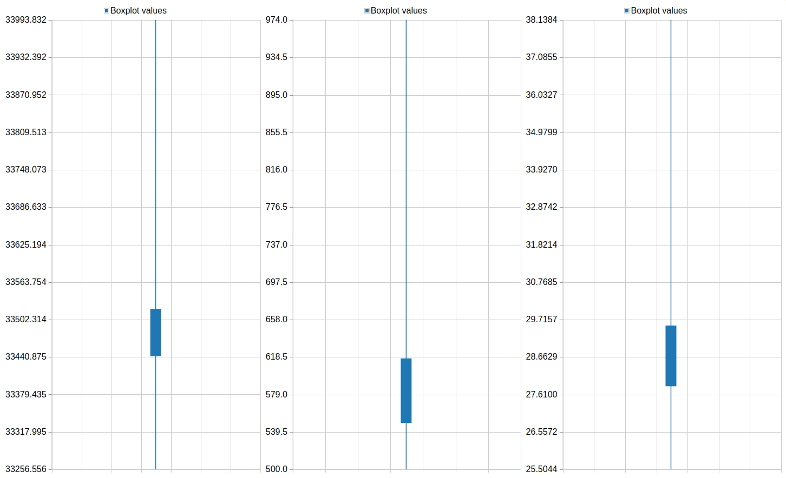

# Introduction


This tutorial shows how to segment and extract features from cell nuclei Galaxy for image analysis. As example use case, this tutorial shows you how to compare the phenotypes of PLK1 threated cells in comparison to a control. The data used in this tutorial is available at [Zenodo](https://zenodo.org/record/3362976).

RNA interference (RNAi) is used in the example use case for silencing genes by way of mRNA degradation. Gene knockdown by this method is achieved by introducing small double-stranded interfering RNAs (siRNA) into the cytoplasm. Small interfering RNAs can originate from inside the cell or can be exogenously introduced into the cell. Once introduced into the cell, exogenous siRNAs are processed by the RNA-induced silencing complex (RISC).The siRNA is complementary to the target mRNA to be silenced, and the RISC uses the siRNA as a template for locating the target mRNA. After the RISC localizes to the target mRNA, the RNA is cleaved by a ribonuclease. RNAi is widely used as a laboratory technique for genetic functional analysis. RNAi in organisms such as C. elegans and Drosophila melanogaster provides a quick and inexpensive means of investigating gene function. Insights gained from experimental RNAi use may be useful in identifying potential therapeutic targets, drug development, or other applications. RNA interference is a very useful research tool, allowing investigators to carry out large genetic screens in an effort to identify targets for further research related to a particular pathway, drug, or phenotype.

The example used in this tutorial deals with PLK1 knocked down cells. PLK1 is an early trigger for G2/M transition. PLK1 supports the functional maturation of the centrosome in late G2/early prophase and establishment of the bipolar spindle. PLK1 is being studied as a target for cancer drugs. Many colon and lung cancers are caused by K-RAS mutations. These cancers are dependent on PLK1.

> <agenda-title></agenda-title>
>
> In this tutorial, we will deal with:
>
> 1. TOC
> {:toc}
>
{: .agenda}

# Getting data

The dataset required for this tutorial contains a screen of DAPI stained HeLa nuclei ([more information](https://zenodo.org/record/3360236)). We will use a sample image from this dataset for training basic image processing skills in Galaxy.

> <hands-on-title>Data upload</hands-on-title>
>
> 1. If you are logged in, create a new history for this tutorial
>
>    
>
> 2. Import  the following dataset from [Zenodo]( https://zenodo.org/record/3362976) or from the data library (ask your instructor).
>    - **Important:** Choose the type of data as `zip`.
>
>    ```
>    https://zenodo.org/record/3362976/files/B2.zip
>    ```
>
>    
>
>    
>
> 3. **Unzip file**  with the following parameters:
>    -  *"input_file"*: `Zipped ` input file
>    - *"Extract single file"*: `Single file`
>    - *"Filepath"*: `B2--W00026--P00001--Z00000--T00000--dapi.tif`
>
> 4. Rename  the dataset to `testinput.tif`
>
>    
>
> 5. **Unzip file**  with the following parameters:
>    -  *"input_file"*: `Zipped ` input file
>    - *"Extract single file"*: `All files`
>
> 6. Rename  the resulting collection to `control`
>
>    
>
> 7. Import  the following dataset from [Zenodo]( https://zenodo.org/record/3362976) or from the data library (ask your instructor).
>    - **Important:** Choose the type of data as `zip`.
>    ```
>    https://zenodo.org/record/3362976/files/B3.zip
>    ```
>
>    
>
>    
>
> 8. **Unzip**  to extract the zipped screen:
>    -  *"input_file"*: `Zipped ` input file
>    - *"Extract single file"*: `All files`
>
> 9. Rename  the collection to `PLK1`
> 9. Upload  the following segmentation filter rules as a new pasted file (format: `tabular`):
>    ```
>    	area	eccentricity
>    min	500	0.
>    max	100000	0.5
>    ```
>
>    
>
> 9. Rename  dataset to `rules`
>
>    
{: .hands_on}


# Create feature extraction workflow
First, we will create and test a workflow which extracts mean DAPI intensity, area, and major axis length of cell nuclei from an image.

> <hands-on-title>Create feature extraction workflow</hands-on-title>
>
> 1. **Filter Image**  with the following parameters to smooth the image:
>    - *"Image type"*: `Gaussian Blur`
>    - *"Radius/Sigma"*: `3`
>    -  *"Source file"*: `testinput.tif` file
> 2. **Auto Threshold**  with the following parameters to segment the image:
>    -  *"Source file"*: output of **Filter image** 
>    - *"Threshold Algorithm"*: `Otsu`
>    - *"Dark Background"*: `Yes`
> 3. **Split objects**  with the following parameters to split touching objects:
>    -  *"Source file"*: output of **Auto Threshold** 
>    - *"Minimum distance between two objects."*: `20`
> 4. **2D Feature Extraction**  with the following parameters to extract features from the segmented objects:
>    -  *"Label file"*: output of **Split objects** 
>    - *"Use original image to compute additional features."*: `No original image`
>    - *"Select features to compute"*: `Select features`
>    - *"Available features"*:
>        -  `Add label id of label image`
>        -  `Area`
>        -  `Eccentricity`
>        -  `Major Axis Length`
> 5. **Filter segmentation**  with the following parameters to filter the label map from 3. with the extracted features and a set of rules:
>    -  *"Source file"*: output of **Split objects** 
>    -  *"Feature file"*: output of **2D Feature Extraction** 
>    -  *"Rules file"*: rules file
> 6. **2D Feature Extraction**  with the following parameters to extract features the final readout from the segmented objects:
>    -  *"Label file"*: output of **Filter segmentation** 
>    - *"Use original image to compute additional features."*: `Use original image`
>    -  *"Original image file"*: `testinput.tif` file
>    - *"Select features to compute"*: `Select features`
>    - *"Available features"*:
>      -  `Mean Intensity`
>      -  `Area`
>      -  `Major Axis Length`
> 7. Now we can extract the workflow for batch processing
>    - Name it "feature_extraction".
>
>    
>
> 8. Edit the workflow you just created
>    - Name the inputs `input image` and `filter rules`.
>    - Mark the results of steps 5 and 6 as outputs (by clicking on the asterisk next to the output name).
>
{: .hands_on}

The resulting workflow should look something like this:


# Apply workflow to screen

Now we want to apply our extracted workflow to `original data` and merge the results. For this purpose, we create a workflow which uses the previously created workflow as subworkflow.

> <hands-on-title>Create screen analysis workflow</hands-on-title>
>
> 1. Create a new workflow in the workflow editor.
>
>    
> 2. Add a **Input dataset collection** node and name it `input images`
> 3. Add a **Input dataset** node and name it `rules`
> 4. Add the **feature_extraction** workflow as node.
>    -  *"input image"*: `input images` output of **Input dataset collection** 
>    -  *"filter rules"*: `rules` output of **Input dataset** 
> 5. Add a **Collapse Collection**  node.
>    -  *"Collection of files to collapse into single dataset"*: output of **feature_extraction** workflow
>    - *"Keep one header line"*: `Yes`
>    - *"Append File name"*: `No`
>    - Mark the tool output as workflow output
> 6. Save your workflow and name it `analyze_screen`
{: .hands_on}

The resulting workflow should look something like this:


> <hands-on-title>Run screen analysis workflow</hands-on-title>
>
> 1. Run the screen analysis workflow  on the `control` screen and the `rules` file
>
>    
>
> 2. Run the screen analysis workflow  on the `PLK1` screen and the `rules` file
>
{: .hands_on}

# Plot feature extraction results

Finally, we want to plot the results for better interpretation.

> <hands-on-title>Plot feature extraction results</hands-on-title>
>
> 1. Click on the `Visualize this data`  icon of the **Collapse Collection**  results.
> 2. Run `Box plot` with the following parameters:
>    - *"Provide a title"*: `Screen features`
>    - *"X-Axis label"*:
>    - *"Y-Axis label"*:
>    - *"1: Data series"*:
>        - *"Provide a label"*: `Mean intensity`
>        - *"Observations"*: `Column 1`
>    - *"2: Data series"*:
>        - *"Provide a label"*: `Area`
>        - *"Observations"*: `Column 2`
>    - *"3: Data series"*:
>        - *"Provide a label"*: `Major axis length`
>        - *"Observations"*: `Column 3`
>
>    > <question-title></question-title>
>    >
>    > Plot the feature distribution of PLK1 and control. What differences do you observe between the screens?
>    >
>    > > <solution-title></solution-title>
>    > > The phenotype of PLK1 threated cells show a higher mean intensity and a shorter major axis in comparison to the control.
>    > {: .solution }
>    {: .question}
{: .hands_on}


One of the resulting plots should look something like this:

{: width="100%"}

# Conclusion


In this exercise you imported images into Galaxy, segmented cell nuclei, filtered segmentations by morphological features, extracted features from segmentations, scaled your workflow to a whole screen, and plotted the feature extraction results using Galaxy.
