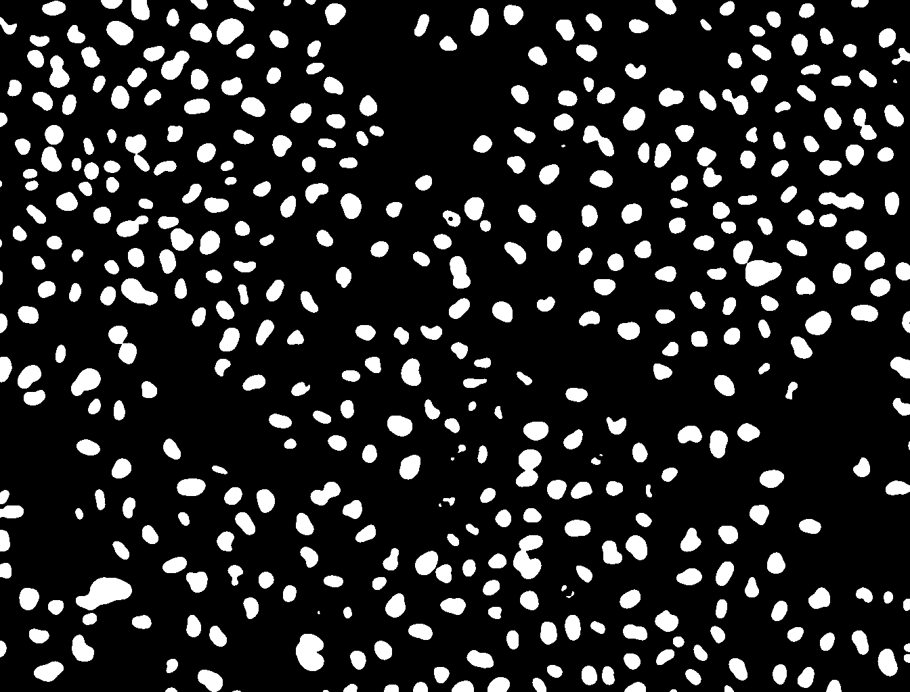
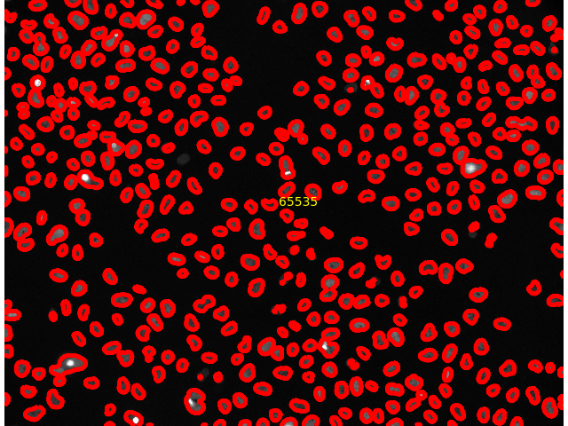

# Introduction


Image analysis is the extraction of meaningful information from images by means of digital image processing techniques. Imaging is an important component in a wide range of scientific fields of study, such as astronomy, medicine, physics, biology, geography, chemistry, robotics, and industrial manufacturing.

This tutorial shows how to use Galaxy to perform basic image analysis tasks such as format conversion, image enhancement, segmentation, and feature extraction.

> <agenda-title></agenda-title>
>
> In this tutorial, we will deal with:
>
> 1. TOC
> {:toc}
>
{: .agenda}

# Getting data

The dataset required for this tutorial is available from [Zenodo](https://zenodo.org/record/3362976) and
contains a screen of [DAPI](https://en.wikipedia.org/wiki/DAPI) stained [HeLa](https://en.wikipedia.org/wiki/HeLa) nuclei ([more information](https://zenodo.org/record/3362976)). We will use a sample image from this dataset for training basic image processing skills in Galaxy.

Our objective is to automatically count the number of cells contained in this image. In order to achieve this, we will enhance the quality of the image, automatically detect the nuclei and segment the nuclei and count them.


> <hands-on-title>Data upload</hands-on-title>
>
> 1. If you are logged in, create a new history for this tutorial
>
>    
>
> 2. Import the following dataset from [Zenodo](https://zenodo.org/record/3362976) or from the data library (ask your instructor).
>    - **Important:** Choose the type of data as `zip`.
>
>    ```
>    https://zenodo.org/record/3362976/files/B2.zip
>    ```
>
>    
>    
>
> 3. **Unzip file**  with the following parameters:
>    -  *"input_file"*: `Zipped ` input file
>    - *"Extract single file"*: `Single file`
>    - *"Filepath"*: `B2--W00026--P00001--Z00000--T00000--dapi.tif`
>
> 4. Rename  the dataset to `input.tif`
>
>    
{: .hands_on}


# Image Metadata Extraction

Now, we can extract metadata from an image.

> <hands-on-title>Extract Image Metadata</hands-on-title>
>
> 1. **Image Info**  with the following parameters to extract metadata from the image:
>    -  *"Input Image"*: `input.tif` file (output of the previous step)
> 2. Click on the  (eye) icon next to the file name, to look at the file content and search for image acquisition information
>
>    > <question-title></question-title>
>    >
>    > 1. What is the datatype?
>    > 2. What are the pixel dimentions?
>    > 3. How many bits per pixel are used?
>    >
>    > > <solution-title></solution-title>
>    > > 1. TIFF
>    > > 2. 1344x1024
>    > > 3. 16
>    > {: .solution }
>    {: .question}
{: .hands_on}

# Image Conversion

Not all tools can handle all image formats. Especially proprietary microscope image formats should be converted to TIFF ([supported formats](https://docs.openmicroscopy.org/bio-formats/5.7.1/supported-formats.html)). However, TIFF can not be displayed in the browser. Therefore, we convert `input.tif` to a PNG for visualization.

> <hands-on-title>Convert Image</hands-on-title>
>
> 1. **Convert image**  with the following parameters to convert the image to PNG:
>    -  *"Input Image"*: `input.tif` file
>    - *"Output data type"*: `PNG`
> 2. Rename  the generated file to `viz_input`
> 3. Click on the  (eye) icon next to the file name to look at the file content
>
{: .hands_on}

Your image should look something like this:

{: width="75%"}

> <question-title></question-title>
>
> You can observe that the image content is barely visible. Why?
>
> > <solution-title></solution-title>
> > The original image is 16-bit and the intensity values are spread over a larger range than the
> > display can render. Therefore, for improved visibility the intensity histogram of the image can
> > be normalized first.
> {: .solution }
{: .question}


Next we will normalize the histogram to improve the contrast. We do this using a [Contrast Limited Adaptive Histogram Equalization (CLAHE)](https://en.wikipedia.org/wiki/Adaptive_histogram_equalization) approach.

> <hands-on-title>Normalize Histogram and Convert Image</hands-on-title>
>
> 1. **Histogram equalization**  with the following parameters to normalize the histogram of the image:
>    -  *"Source file"*: `input.tif` file
>    - *"Histogram Equalization Algorithm"*: `CLAHE`
> 2. Rename  the generated file to `input_normalized`
> 3. **Convert image**  with the following parameters to convert the image to PNG:
>    -  *"Input Image"*: `input_normalized` file (output of **Histogram equalization** )
>    - *"Output data type"*: `PNG`
> 4. Rename  the generated file to `viz_normalized`
> 5. Click on the  (eye) icon next to the file name, to look at the file content
{: .hands_on}

Your image should now look something like this:

{: width="75%"}

We can now clearly make out the presence of the stained nuclei. Next we will automatically detect these features and segment the image.

# Image Filtering

Specific features of interest (e.g., edges, noise) can be enhanced or suppressed by using an image filter.

> <hands-on-title>Filter image</hands-on-title>
>
> 1. **Filter Image**  with the following parameters to smooth the image:
>    - *"Image type"*: `Gaussian Blur`
>    - *"Radius/Sigma"*: `3`
>    -  *"Source file"*: `input.tif` file
> 2. Rename  the generated file to `input_smoothed`
> 3. **Histogram equalization**  with the following parameters to normalize the histogram of the image:
>    -  *"Source file"*: `input_smoothed` file (output of **Filter image** )
>    - *"Histogram Equalization Algorithm"*: `CLAHE`
> 4. Rename  the generated file to `input_smoothed_normalized`
> 5. **Convert image**  with the following parameters to convert the image to PNG:
>    -  *"Input Image"*: `input_smoothed_normalized` file (output of **Histogram equalization** )
>    - *"Output data type"*: `PNG`
> 6. Rename  the generated file to `viz_smoothed_normalized`
> 7. Click on the  (eye) icon next to the file name, to look at the file content and compare the result with `viz_normalized`. You can observe that `viz_smoothed_normalized` has significant reduced noise.
{: .hands_on}

Your image should now look something like this:

{: width="75%"}


# Segmentation

Objects of interest like nuclei can be segmented by using a smoothed image and thresholding. Moreover, the results can be overlayed with the original image.

> <hands-on-title>Segment image</hands-on-title>
>
> 1. **Auto Threshold**  with the following parameters to segment the image:
>    -  *"Source file"*: `input_smoothed` file (output of **Filter image** )
>    - *"Threshold Algorithm"*: `Otsu`
>    - *"Dark Background"*: `Yes`
> 2. Rename  the generated file to `input_segmented`
> 3. **Binary 2 Label**  with the following parameters to segment the image:
>    -  *"Binary Image File"*: `input_segmented` file (output of **Auto Threshold** )
> 4. Rename  the generated file to `input_segmented_labeled`
> 5. **Convert image**  with the following parameters to convert the image to PNG:
>    -  *"Input Image"*: `input_segmented_labeled` file (output of **Binary 2 Label** )
>    - *"Output data type"*: `PNG`
> 6. Rename  the converted image to `viz segmented`
>
>    > <question-title></question-title>
>    >
>    > 1. What does **Binary 2 Label**  do? (Hint: check the tool help section)
>    > 2. View the `viz_segmented` image from the last step, what do you see?
>    >      - Can you explain this result?
>    > 3. Exercise: Try to make the information in this image better visible (Hint: **Histogram Equalization** )
>    >
>    > > <solution-title></solution-title>
>    > > 1. The tool assigns each connected component (e.g., segmented cell) in the image an object id and stores it as the intensity value.
>    > > 2. The image looks completely black.
>    > >    The object IDs generated by **Binary 2 Label**  are relatively low.
>    > >    Since the IDs are stored as intensity values, these are too low to be visible in this case. Nevertheless, there is more
>    > >    information in this image than meets the eye.
>    > > 3. To make labeled objects visible, the values have to be stretched to a larger range of visible intensity values. We
>    > >    can do that by equalizing the histogram again:
>    > >
>    > >    - **Histogram equalization**  with the following parameters to normalize the intensity values:
>    > >      -  *"Source file"*: `input_segmented_labeled` file (output of **Binary 2 Label** )
>    > >      - *"Histogram Equalization Algorithm"*: `CLAHE`
>    > >
>    > >    - **Convert image**  with the following parameters to convert the image to PNG:
>    > >      -  *"Input Image"*: output of **Histogram Equalization** 
>    > >      - *"Output data type"*: `PNG`
>    > >
>    > >     The information contained in the original image has now become visible to the human eye:
>    > >     
>    > >
>    > {: .solution }
>    {: .question}
>
>
> 7. **Overlay Segmentation Mask**  with the following parameters to convert the image to PNG:
>    -  *"Image Source File"*: `viz_normalized` file
>    -  *"Mask Source File"*: `viz_segmented` file
>    - *"Image Is Greyscale"*: `Yes`
>    - *"Thickness"*: `3`
>    - *"Stroke Color"*: `red`
>    - *"Plot Labels"*: `yes`
>    - *"Label Color"*: `yellow`
> 8. Click on the  (eye) icon next to the file name, to look at the file content and assess the segmentation performance
> 9. **Count Objects**  with the following parameters to count the segmented objects in the image:
>    -  *"Source file"*: `input_segmented_labeled` file (output of **Binary 2 Label** )
>
>    > <question-title></question-title>
>    >
>    > How many objects were segmented?
>    >
>    > > <solution-title></solution-title>
>    > >  The **Count Objects**  tool counted 425 objects.
>    > {: .solution }
>    {: .question}
{: .hands_on}

The resulting image should look something like this:

{: width="75%"}

We see the segmentation mask overlayed; each detected object (nucleus) is labeled with its ID value.

We see that with the help of just a few simple steps, we were able to detect the locations of the stained nuclei, and count them.

# Conclusion


In this exercise you imported images into Galaxy, extracted meta information from an image, converted between file formats, learned how to visualize microscopy images, filtered the image, and segmented cells using Galaxy.
