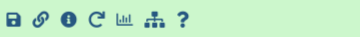

Image analysis is the extraction of meaningful information from images by means of digital image processing techniques. Imaging is an important component in a wide range of scientific fields of study, such as astronomy, medicine, physics, biology, geography, chemistry, robotics, and industrial manufacturing.

This tutorial shows how to use Galaxy to perform basic image analysis tasks such as format conversion, image enhancement, segmentation, and feature extraction.

> <agenda-title></agenda-title>
>
> In this tutorial, we will deal with:
>
> 1. TOC
> {:toc}
>
{: .agenda}

# Getting Data

The dataset required for this tutorial is available from [Zenodo](https://zenodo.org/record/3362976) and
contains a screen of [DAPI](https://en.wikipedia.org/wiki/DAPI) stained [HeLa](https://en.wikipedia.org/wiki/HeLa) nuclei ([more information](https://zenodo.org/record/3362976)). We will use a sample image from this dataset for training basic image processing skills in Galaxy.

Our objective is to automatically count the number of cells contained in this image. In order to achieve this, we will enhance the quality of the image, automatically detect the nuclei and segment the nuclei and count them.


> <hands-on-title>Data upload</hands-on-title>
>
> 1. If you are logged in, create a new history for this tutorial
>
>    
>
> 2. Import the following dataset from [Zenodo](https://zenodo.org/record/3362976) or from the data library (ask your instructor).
>    - **Important:** Choose the type of data as `zip`.
>
>    ```
>    https://zenodo.org/record/3362976/files/B2.zip
>    ```
>
>    
>
>    
>
> 3.  with the following parameters:
>    -  *"input_file"*: `B2.zip`
>    - *"Extract single file"*: `Single file`
>    - *"Filepath"*: `B2--W00026--P00001--Z00000--T00000--dapi.tif`
>
> 4. Rename  the dataset to `input.tif`
>
>    
{: .hands_on}


# Image Metadata Extraction

Now, we can extract metadata from an image.

> <hands-on-title>Extract Image Metadata</hands-on-title>
>
> 1.  with the following parameters to extract metadata from the image:
>    -  *"Input Image"*: `input.tif` file (output of the previous step)
> 2. Click on the  (eye) icon next to the file name, to look at the file content and search for image acquisition information
>
>    > <question-title></question-title>
>    >
>    > 1. What is the datatype?
>    > 2. What are the pixel dimentions?
>    > 3. How many bits per pixel are used?
>    >
>    > > <solution-title></solution-title>
>    > > 1. TIFF
>    > > 2. 1344x1024
>    > > 3. 16
>    > {: .solution }
>    {: .question}
{: .hands_on}

# Visual Inspection of TIFF Images

Not all tools can handle all image formats. Especially proprietary microscope image formats should be converted to TIFF ([supported formats](https://docs.openmicroscopy.org/bio-formats/5.7.1/supported-formats.html)). However, TIFF cannot be displayed in most web browsers directly. Therefore, for visual inspection of TIFF images, we use a TIFF visualization plugin in Galaxy.

> <hands-on-title>Visual Inspection of TIFF Images</hands-on-title>
>
> 1. Click on the title of your file to see the row of small icons for saving, linking, etc.:
> 
> 2. Click on the **visualise icon**  and then select the **Tiff Viewer** visualization plugin.
>
{: .hands_on}

Your image should look something like this:

{: width="75%"}

> <question-title></question-title>
>
> You can observe that the image content is barely visible. Why?
>
> > <solution-title></solution-title>
> > The original image is 16-bit and the intensity values are spread over a larger range than the
> > display can render. Therefore, for improved visibility the intensity histogram of the image can
> > be normalized first.
> {: .solution }
{: .question}


Next we will normalize the histogram to improve the contrast. We do this using a [Contrast Limited Adaptive Histogram Equalization (CLAHE)](https://en.wikipedia.org/wiki/Adaptive_histogram_equalization) approach.

> <hands-on-title>Normalize Histogram</hands-on-title>
>
> 1.  with the following parameters to normalize the histogram of the image:
>    -  *"Input image"*: `input.tif` file
>    - *"Histogram equalization algorithm"*: `CLAHE`
> 2. Rename  the generated file to `input_normalized`.
> 3. Click on the **visualise icon**  of the file to visually inspect the image using the **Tiff Viewer** visualization plugin.
{: .hands_on}

Your image should now look something like this:

{: width="75%"}

We can now clearly make out the presence of the stained nuclei. Next we will automatically detect these features and segment the image.

# Image Filtering

Specific features of interest (e.g., edges, noise) can be enhanced or suppressed by using an image filter.

> <hands-on-title>Filter image</hands-on-title>
>
> 1.  with the following parameters to smooth the image:
>    - *"Filter type"*: `Gaussian`
>    - *"Sigma"*: `3`
>    -  *"Source file"*: `input.tif` file
> 2. Rename  the generated file to `input_smoothed`.
> 3.  with the following parameters to normalize the histogram of the image:
>    -  *"Input image"*: `input_smoothed` file (output of )
>    - *"Histogram equalization algorithm"*: `CLAHE`
> 4. Rename  the generated file to `input_smoothed_normalized`.
> 5. Click on the **visualise icon**  of the file to visually inspect the image and compare the result with `input_normalized`. You can observe that `input_smoothed_normalized` has significantly reduced noise.
{: .hands_on}

Your image should now look something like this:

{: width="75%"}


# Segmentation

Objects of interest like nuclei can be segmented by using a smoothed image and thresholding. Moreover, the results can be overlayed with the original image.

> <hands-on-title>Segment image</hands-on-title>
>
> 1.  with the following parameters to segment the image:
>    -  *"Input image"*: `input_smoothed` file (output of )
>    - *"Thresholding method"*: `Globally adaptive / Otsu`
> 2. Rename  the generated file to `input_segmented`.
> 3.  with the following parameters to segment the image:
>    -  *"Binary image"*: `input_segmented` file (output of )
> 4. Rename  the generated file to `input_segmented_labeled`
>
>    > <question-title></question-title>
>    >
>    > 1. What does  do? (Hint: check the tool help section)
>    > 2. View the `input_segmented_labeled` image from the last step, what do you see? Can you explain this result?
>    > 3. Exercise: Try to make the information in this image better visible (Hint: use )
>    >
>    > > <solution-title></solution-title>
>    > > 1. The tool assigns each connected component (e.g., segmented cell) in the image a unique object ID called *label* and stores it as the intensity value.
>    > > 2. The image looks completely black.
>    > >    The object labels generated by  are relatively low. Since the labels are stored as intensity values, these are too low to be visible in this case. Nevertheless, there is more information in this image than meets the eye.
>    > > 3. To make the labeled objects visible, the values have to be stretched to a larger range of visible intensity values. We
>    > >    can do that by equalizing the histogram again. To this end, use  with the following parameters to normalize the intensity values:
>    > >    -  *"Input image"*: `input_segmented_labeled` file (output of )
>    > >    - *"Histogram equalization algorithm"*: `CLAHE`
>    > >
>    > >    The information contained in the original image has now become visible to the human eye:
>    > >    
>    > >
>    > {: .solution }
>    {: .question}
>
>
> 7.  with the following parameters to convert the image to PNG:
>    - *"Type of the overlay"*: `Segmentation contours over image`
>    -  *"Intensity image"*: `input_normalized` file
>    -  *"Label map"*: `input_segmented_labeled` file (output of )
>    - *"Contour thickness"*: `2`
>    - *"Contour color"*: `red`
>    - *"Show labels"*: `yes`
>    - *"Label color"*: `yellow`
> 8. Click on the  (eye) icon next to the file name, to look at the file content and assess the segmentation performance.
> 9.  with the following parameters to count the segmented objects in the image:
>    -  *"Source file"*: `input_segmented_labeled` file (output of )
>
>    > <question-title></question-title>
>    >
>    > How many objects were segmented?
>    >
>    > > <solution-title></solution-title>
>    > >  The  tool counted 425 objects.
>    > {: .solution }
>    {: .question}
{: .hands_on}

The resulting image should look something like this:

{: width="75%"}

We see the segmentation mask overlayed; each detected object (nucleus) is labeled with its ID value.

We see that with the help of just a few simple steps, we were able to detect the locations of the stained nuclei, and count them.

# Conclusion


In this exercise you imported images into Galaxy, extracted meta information from an image, learned how to visualize microscopy images, filtered the image, and segmented cells using Galaxy.
