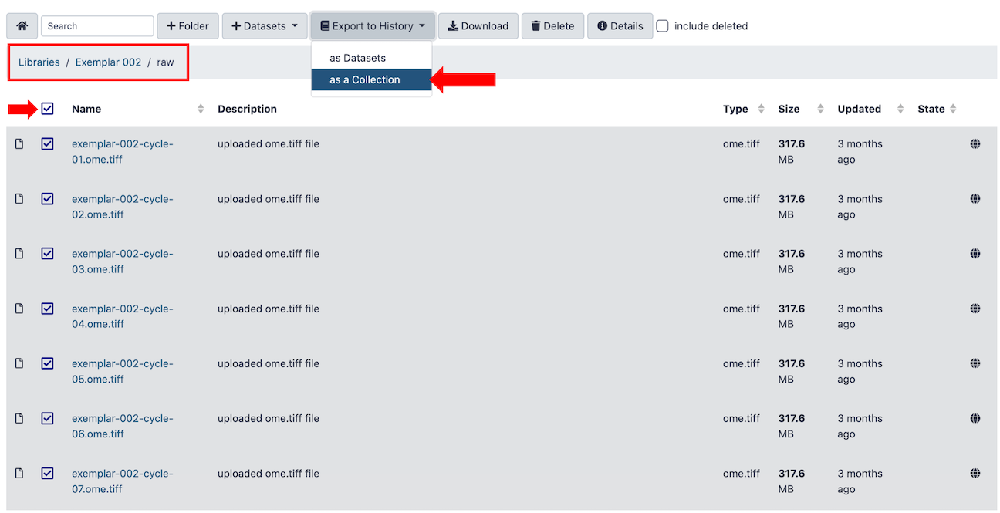
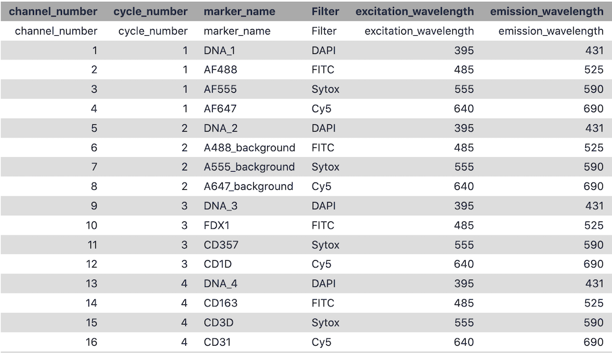
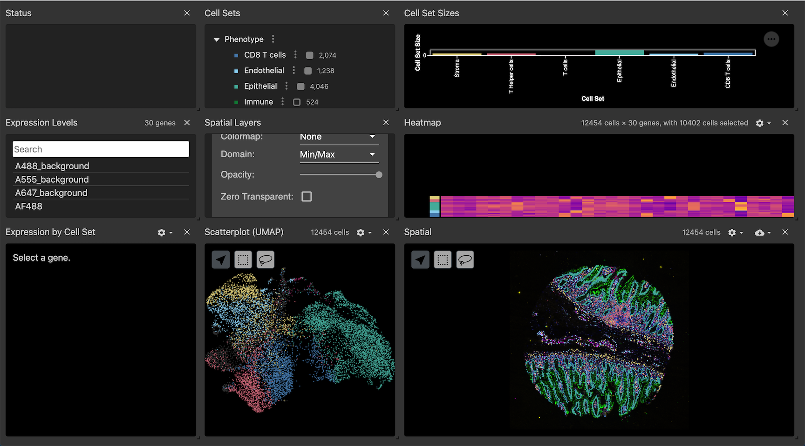

# Introduction
{:.no_toc}

Multiplex tissue images are large, multi-channel images that contain intensity data for numerous biomarkers. The methods for generating multiplex tissue images are diverse, and each method can require specialized knowledge for downstream processing and analysis. The MCMICRO () pipeline was developed to process multiplex images into single-cell data, and to have the range of tools to accomodate for different imaging methods. The tools used in the MCMICRO pipeline, in addition to tools for single-cell analysis, spatial analysis, and interactive visualization are available in Galaxy to facilitate comprehensive and accessible analyses of multiplex tissue images. The MCMICRO tools available in Galaxy are capable of processing Whole Slide Images (WSI) and Tissue Microarrays (TMA). WSIs are images in which a tissue section from a single sample occupies the entire microscope slide; whereas, TMAs multiplex smaller cores from multiple samples onto a single slide. This tutorial will demonstrate how to use the Galaxy multiplex imaging tools to process and analyze publicly available TMA test data provided by MCMICRO (Figure 1.).

Find a full example history [here](https://cancer.usegalaxy.org/u/watsocam/h/gtnexemplar002tma)

, CD163 (yellow), CD3D (blue), CD31 (red), VDAC1 (green), and Keratin (orange). This image is being viewed using Avivator, an interactive tool that allows the user to selectively view channels and adjust channel intensities.")

> ### Agenda
>
> In this tutorial, we will cover:
>
> 1. TOC
> {:toc}
>
{: .agenda}

# Get data

Multiplex tissue images come in a variety of forms and file-types depending on the modality or platform used. For this tutorial, the Exemplar-002 data was imaged using Cyclic Immunofluorescence (CycIF) with a RareCyte slide scanner. Many of the steps in this workflow have platform-specific parameters, and the hands-on sections will show the best parameters for CycIF RareCyte images; however, notes will be made where critical differences may occur depending on the modality or platform throughout the tutorial.

The raw files for each round (10 in total) of the exemplar-002 data are available on [cancer.usegalaxy.org](https://cancer.usegalaxy.org) under **Data Libraries** (Figure 2.). Import the raw files into a new history as a **list collection**.

> ###  Hands-on: Data import to history
>
> 1. Create a new history for this tutorial
>
>    
>
> 2. Import the files for Exemplar-002 from the Shared Data Library to the new history
>
>    
>
{: .hands_on}

> ###  **Imaging platform differences**
> 
> The Exemplar-002 raw images are in *ome.tiff* format; however, commonly seen raw file-types are *ome.tiff*, *tiff*, *czi*, and *svs*. If your input images are not *ome.tiff* or *tiff*, you may have to edit the dataset attributes in Galaxy to allow tools to recognize them as viable inputs. 
>
{: .warning}

# Tile illumination correction with **BaSiC Illumination**

Commonly, raw MTI data will consist of one image per round of imaging. These individual round images are frequently captured in tiles, and there can be slight variations in how each tile was illuminated across the course of imaging. Prior to tile stitching and image registration, the tiles have to undergo illumination correction with **BaSiC Illumination** () to account for this. Unlike many of the other tools in this workflow, BaSiC has no extra parameters to think about: Just input the collection of raw images and press *go*!

Two new list collections will appear in the history upon completion: 

  - BaSiC Illumination on Collection `X`: FFP (flat-field)
  - BaSiC Illumination on Collection `X`: DFP (deep-field)

> ###  Hands-on: Illumination correction
>
> 1.  with the following parameters:
>
>    -  *"Raw Cycle Images: "*: List collection of raw images
>
{: .hands_on}

# Stitching and registration with **ASHLAR**

After illumination is corrected across round tiles, the tiles must be stitched together, and subsequently, each round mosaic must be registered together into a single pyramidal OME-TIFF file. **ASHLAR** from MCMICRO provides both of these functions. 

> ###  Important detail: Marker File
>
> **ASHLAR** optionally reads a marker metadata file to name the channels in the output OME-TIFF image. This marker file will also be used in later steps. Make sure that the marker file is comma-separated and has the `marker_names` as the third column (Figure 3.). 
>
> 
>
{: .comment}

> ###  Hands-on: Image stitching and registration
>
> 1.  with the following parameters:
>
>    -  *"Raw Images"*: List collection of raw images
>    -  *"Deep Field Profile Images"*: List collection of DFP images produced by **BaSiC Illumination**
>    -  *"Flat Field Profile Images"*: List collection of FFP images produced by **BaSiC Illumination**
>    - *"Flip X-axis"*: `No`
>    - *"Flip Y-axis"*: `No`
>    - *"Maximum allowed per-tile corrective shift"*: `30`
>    - *"Upgrade to BF6-Compliant OME-TIFF Pyramid"*: `Upgrade Pyramid`
>    -  *"Markers File (optional)"*: Comma-separated markers file with marker_names in third column
>
>    - In *"Advanced Options"*:
>        - *"Align Channel Number"*: `0` (Channel usually containing DAPI, hoescht, or other DNA marker)
>        - *"Sigma"*: `Not entered, left as default`
>        - *"Cyto mask channel"*: `Not entered, left as default`
>        - *"Flip output image horizontally"*: `No`
>        - *"Flip output image vertically"*: `No`
>        - *"Write output as a single pyramidal TIFF"*: `Yes`
>
{: .hands_on}

> ###  **Imaging platform differences**
> 
> ASHLAR, among other tools in the MCMICRO and Galaxy-MTI pre-processing tools have some parameters that are specific to the 
imaging patform used. By default, ASHLAR is oriented to work with images from RareCyte scanners. AxioScan scanners render images
in a different orientation. Because of this, when using ASHLAR on AxioScan images, it is important to select the **Flip Y-Axis**
parameter to *Yes*
> 
> ASHLAR will work for most imaging modalities; however, certain modalities require different tools to be registered. For example,
multiplex immunohistochemistry (mIHC) images must use an aligner that registers each moving image to a reference Hematoxylin image. 
For this, Galaxy-MTI includes the alternative registration tool . 
>
{: .warning}

# TMA dearray with **UNetCoreograph**

Many downstream processing and analysis steps require each individual core from the TMA to be in a separate image file. To accomplish this from our registered ome.tiff image, we can use **UNetCoreograph** to detect and crop each core into separate files.

UNetCoreograph will output images (used for downstream steps), masks, and a preview image (Figure 4.).

> ###  Hands-on: TMA dearray
>
> 1.  with the following parameters:
>
>    -  *"Registered TIFF"*: The output of **ASHLAR** (registered, pyramidal OME-TIFF file)
>    - *"Downsample factor"*: `5`
>    - *"Channel"*: `0`
>    - *"Buffer"*: `2.0`
>    - *"Sensitivity"*: `0.3`
>    - *"Cluster"*: `No`
>    - *"Tissue"*: `No`
>
>    > ###  What about Whole Slide Images? 
>    >
>    > Whole slide images do not need to be dearrayed, so in most cases, this step can be skipped; however, UNetCoreograph has the *"Tissue"* option, which when selected, can act to separate the whole tissue from the background in a whole slide image which can be useful. In this case, it is important to toggle the *"Downsample factor"* as this often needs to be higher when extracting whole tissues.
>    {: .comment}
>
{: .hands_on}

# Nuclear segmentation with **Mesmer**

Cell segmentation is the basis for all downstream single-cell analyses. Different segmentation tools work highly variably depending on the imaging modality or platform used. Because of this, Galaxy-MTI has incorporated several cell segmentation tools so users may find the tool that works optimally for their data. 

Available segmentation tools in Galaxy-MTI:

  - Mesmer ()
  - UnMicst and s3segmenter ()
  - Cellpose ()
  - ilastik ()

In this tutorial, we use **Mesmer** because it tends to perform generally well on a diverse range of image types, and has a limited number of parameters to understand. 

> ###  Important detail: Running images in batches
>
> Now that each image has been split into individual core images, downstream tools must be run on the images separately. Luckily, Galaxy makes this easy by including the option to run each tool in batch across a collection of inputs. Next to the input for the tool, select  (**Dataset collection**) as the input type, and pass the collection output by UNetCoreograph as input. 
>
{: .comment}

> ###  Hands-on: Nuclear segmentation
>
> 1.  with the following parameters:
>    -  *"Image containing the nuclear marker(s) "*: Collection output of UNetCoreograph (images)
>    - *"The numerical index of the channel(s) from nuclear-image "*: `0`
>    - *"Compartment for segmentation prediction: "*: `Nuclear`
>    - *"Resolution of the image in microns-per-pixel"*: `0.65`
>    - *"Whether to np.squeeze the outputs before saving"*: `Yes`
>    - *"Segment with Cell Membrane"*: `No`
>
>    > ###  np.squeeze
>    >
>    > The **np.squeeze** parameter is very important to select as `Yes` to make the output compatible with next steps
>    {: .comment}
>
{: .hands_on}

> ###  **Imaging platform differences: Image resolution**
> 
> A crucial parameter for Mesmer and other segmentation tools is the **Image resolution**. This is reported in microns/pixel, and can vary depending on the imaging platform used and the settings at image acquisition. Mesmer accepts the resolution in microns/pixel; however, if using UNMICST, the resolution must be reported as a ratio of the resolution of UNMICST's training images (0.65). For example, when using UNMICST, if your images were captured at a resolution of 0.65, then the UNMICST value would be 1, but if your images were captured at 0.325 microns/pixel, then the value you would enter for UNMICST would be 0.5. 
>
{: .warning}

# Calculate single-cell features with **Quantification**

After generating a segmentation mask, the mask and the original registered image can be used to extract mean intensities for each marker in the panel, spatial coordinates, and morphological features for every cell. This step is performed by MCMICRO's **Quantification** module. 

Once again, as this is a TMA, we will be running this in batch mode for every core image and its segmentation mask. 

The quantification step will produce a CSV cell feature table for every image in the batch. 

> ###  Hands-on: Quantification
>
> 1.  with the following parameters:
>
>    -  *"Registered TIFF "*: Collection output of UNetCoreograph (images)
>    -  *"Primary Cell Mask "*: Collection output of Mesmer (or other segmentation tool)
>    -  *"Additional Cell Masks "*: `Nothing Selected` (Other tools may produce multiple mask types)
>    -  *"Marker channels"*: Comma-separated markers file with marker_names in third column
>
>    > ###  Mask metrics and Intensity metrics
>    >
>    > Leaving the *"mask metrics"* and *"intensity metrics"* blank will by default run all available metrics
>    >
>    {: .comment}
>
{: .hands_on}

# **Convert McMicro Output to Anndata**

Anndata () is a Python package and file format schema for working with annotated data matrices that has gained popularity in the single-cell analysis community. Many downstream analysis tools, including Scimap from MCMICRO, Scanpy (), and Squidpy () are built around anndata format files (h5ad). This tool splits the marker intensity data into a separate dataframe (`X`), and places all observational data (spatial coordinates, morphological features, etc.) in the cell feature table into a separate dataframe (`obs`) that shares the same indices as `X`. In downstream analyses, new categorical variables, such as phenotype assignments for each cell, are stored in the `obs` dataframe. 

Learn more about this file format at the [anndata documentation](https://anndata.readthedocs.io/en/latest/index.html).

> ###  Hands-on: Task description
>
> 1.  with the following parameters:
>
>    -  *"Select the input image or images"*: Collection output of Quantification (cellMaskQuant)
>    - In *"Advanced Options"*:
>        - *"Whether to remove the DNA channels from the final output"*: `No`
>        - *"Whether to log the data"*: `Yes`
>        - *"Name of the column that contains the CellID"*: `CellID` (Default)
>        - *"Whether to use unique name for cells/rows"*: `No`
>        - *"Column name to split the counts table and metadata"*: `X_centroid` (Default)
>
>    > ###  Important parameter: Unique names for cells/rows
>    >
>    > Setting *"Whether to use unique name for cells/rows"* to `No` to ensures that downstream interactive visualizations will be able to map observational features to the mask CellIDs. 
>    {: .comment}
>
{: .hands_on}

# Scimap: **Single Cell Phenotyping**

There are several ways to classify cells available in Galaxy-MTI. Unsupervised approaches, such as Leiden clustering, can be performed on all cells and phenotypes can be manually annotated based on marker expression patterns observed by the user. This approach is time consuming, so here we will demonstrate automated phenotyping based on thresholds of specific lineage markers using MCMICRO's Scimap. Scimap phenotyping can either be provided a table of manual gate values for each marker of interest (which can be determined using the **GateFinder** tool in Galaxy-MTI), or by default, Scimap will fit a Gaussian Mixture Model (GMM) to the `log(intensity)` data for each marker to determine positive and negative populations for that marker. The marker intensity values are rescaled between (0,1) with 0.5 being the cut-off between negative and positive populations. Scimap uses a 'Phenotype workflow' to guide the classification of cells (Figure 5.). For more on how to construct a Scimap workflow, see the [Scimap documentation](https://scimap-doc.readthedocs.io/en/latest/tutorials/scimap-tutorial-cell-phenotyping/).

> ###  Hands-on: Task description
>
> 1.  with the following parameters:
>
>    -  *"Select the input anndata"*: Output of **Convert MCMICRO output to Anndata**
>    -  *"Select the dataset containing manual gate information"*: (Optional) manually determined gates in CSV format. Gates will be determined automatically using a GMM for each marker if this file is not provided
>    -  *"Select the dataset containing gating workflow"*: CSV phenotype workflow (Figure 5.)
>    - *"Save the GMM gates plots If True"*: `Yes`
>
>
>    > ###  Limitations of GMM automated phenotyping
>    >
>    > When manual gates are not provided, Scimap fits a GMM to determine a threshold between positive and negative cells. This automated gating works well when markers are highly abundant within the tissue, and the data shows a bimodal distribution (Figure 6A.). GMM gating can lead to spurious thresholds, however, when the data does not appear to be bimodal (Figure 6B.). This tends to happen when the marker is not highly abundant in the tissue, so there isn't a large positive population. Markers that have a highly continuous range of intensity, like certain functional markers, can also be problematic with GMM gating. It is recommended to always look at the GMM plots output by Scimap, and validate any potentially spurious gates manually. 
>    >
>    >  An example of a marker with a bimodal distribution and a reasonable looking gate. (B) An example of a marker with a unimodal distribution that is not ideal for fitting with a GMM, and would be a candidate for manual validation and gating.")
>    > 
>    {: .comment}
>
{: .hands_on}

# Interactive visualization of multiplex tissue images

Visual analysis is an important part of multiplex tissue imaging workflows. Galaxy-MTI has several tools that make interactive visualization easy, and can be used at various stages of analysis. 

## Converting UNetCoreograph images to OME-TIFF using the **Convert image** tool

UNetCoreograph outputs each individual core image in `tiff` format. Interactive visualization tools, such as **Vitessce** and **Avivator** require the images to be in `OME-TIFF` format to be viewed. Galaxy-MTI includes a conversion tool that can accomodate this, along with many other useful conversion functions. 

> ###  Hands-on: Convert image
>
> 1.  with the following parameters:
>    - *"Output data type"*: `OME TIFF`
>    - *"Extract series"*: `All series`
>    - *"Extract timepoint"*: `All timepoints`
>    - *"Extract channel"*: `All channels`
>    - *"Extract z-slice"*: `All z-slices`
>    - *"Extract range"*: `All images`
>    - *"Extract crop"*: `Full image`
>    - *"Tile image"*: `Tile image`
>    - *"Pyramid image"*: `Generate Pyramid`
>
{: .hands_on}

## **Rename OME-TIFF Channels**

Some tools can cause the channel names in an OME-TIFF image to be lost. To fix this, or to change the channel names to whatever the user prefers, the **Rename OME-TIFF Channels** tool can be invoked using a markers file similar to the one used in previous steps. 

> ###  Hands-on: Rename channels
>
> 1.  with the following parameters:
>
>    -  *"Input image in either tiff or OME-tiff format"*: File to be converted (or collection of files to run in batch)
>    - *"Format of input image"*: `ome.tiff`
>    -  *"Channel metadata CSV"*: Comma-separated markers file with marker_names in third column
>
{: .hands_on}

## Initial visualization with **Avivator**

For any `OME-TIFF` image in a Galaxy-MTI history, there will be an option to view the image using **Avivator**. This is a great way to perform an initial inspection of an image for QC purposes before continuing with downstream steps. The **Avivator** window can be launched by expanding the dataset information in the history panel and clicking the link (Figure 7.).

 and, when clicked, launches an Avivator window to explore the image (right).")

## Generating an interactive visualization dashboard with **Vitessce**

**Vitessce** is a powerful visualization tool that creates interactive dashboards (Figure 8.) to look at a multiplex `OME-TIFF` images in conjunction with data generated during analysis and stored in an anndata file. The segmentation mask can be overlaid onto the image to qualitatively assess the segmentation performance. The mask can then be colored with associated observational data (Figure 9A.), such as `phenotype`, with the same colors appearing in barplots (Figure 9B.), UMAP representations, heatmaps, and marker intensity violin plots for comrehensive data exploration. 

, and the phenotype barplot (B).")

> ###  Hands-on: Vitessce visualization
>
> 1.  with the following parameters:
>
>    -  *"Select the OME Tiff image"*: OME-TIFF image to be viewed (or collection of files to run in batch)
>    -  *"Select masks for the OME Tiff image (Optional)"*: Output of Mesmer (or other segmentation tool)
>    - *"Whether to do phenotyping"*: `Yes`
>        - *"Select an embedding algorithm for scatterplot"*: `UMAP`
>        - *"Input phenotyping keys"*: `Multiple choices`
>            - *"Select the key(s)"*: `phenotype`
>
{: .hands_on}

# Next steps: Compositional and spatial analyses

Galaxy-MTI includes additional tools from **Scimap** and tools from the **Squidpy** package () that can be used to perform a variety of downstream analyses. For example, once phenotypes have been assigned to individual cells, **Squidpy** has several methods for understanding the spatial organization of the tissue. Using **Squidpy**, a spatial neighborhood graph is first generated, from which the organization of specific phenotype groups and their interactions can be quantified. 

> ###  Hands-on: Spatial analysis with **Squidpy**
>
> 1.  generate a spatial neighborhood graph with the following parameters:
>
>    -  *"Select the input anndata"*: Anndata file containing phenotype information (or other variable of interest)
>    - *"Select an analysis"*: `Spatial neighbors -- Create a graph from spatial coordinates`
>
> 2.  compute and plot a neighborhood enrichment analysis with the following parameters:
>
>    -  *"Select the input anndata"*: Output of step 1 (anndata file with spatial neighborhood graph)
>    - *"Select an analysis"*: `nhood_enrichment -- Compute neighborhood enrichment by permutation test`
>    - *"Key in anndata.AnnData.obs where clustering is stored"*: `phenotype`
>
>    > ###  Neighborhood enrichment plot
>    >
>    > **Squidpy** was used to calculate neighborhood enrichments for each phenotype in core 2 of exemplar 2 (Figure 10.). This shows which phenotypes co-locate most frequently within the tissue. 
>    >
>    > 
>    >
>    {: .comment}
>
> 3.  calculate Ripley's L curves for each phenotype with the following parameters:
>
>    -  *"Select the input anndata"*: Output of step 1 (anndata file with spatial neighborhood graph)
>    - *"Select an analysis"*: `nhood_enrichment -- Compute neighborhood enrichment by permutation test`
>    - *"Key in anndata.AnnData.obs where clustering is stored"*: `phenotype`
>    - In *"Advanced Graph Options"*:
>        - *"Which Ripley's statistic to compute"*: `L`
>    - In *"Plotting Options"*:
>        - *"Ripley's statistic to be plotted"*: `L`
>
>    > ###  Ripley's L plot
>    >
>    > **Squidpy** was used to calculate Ripley's L curves for each phenotype in core 2 of exemplar 2 (Figure 11.). This shows the overall organization of each phenotype in the tissue. If the curve for a given phenotype lies above the light grey null line (Example: Epithelial cells in Figure 11.), the phenotype is statistically significantly clustered. If the curve lies on the null line (Example: Myeloid lineage in Figure 11.), it's spatial distribution within the tissue is random. If the curve is underneath the null line (Example: T cells in Figure 11.), it's spatial distribution is statistically significantly dispersed. 
>    >
>    > 
>    >
>    {: .comment}
>
{: .hands_on}

# Conclusion

In this tutorial, we demonstrated a complete multiplex tissue imaging analysis workflow performed entirely in a web browser using Galaxy-MTI. Using an example tissue microarray imaged with cylic immunofluoresence provided by MCMICRO, we...

  - Corrected illumination between imaging tiles
  - Stitched and registered input images to produce a single, pyramidal OME-TIFF image that is viewable in multiple built-in interactive viewing tools (Avivator, Vitessce)
  - Split the TMA into separate images for each core
  - Processed each core in parallel, beginning with nuclear segmentation
  - Quantified the mean marker intensities, morphological features, and spatial coordinates of each cell in each core
  - Converted the resulting tabular data to anndata format for convenient downstream anaylses and visualizations
  - Performed marker-based, automatically gated, phenotyping of cells
  - Prepared the dearrayed images and viewed them interactively in a dashboard combined with observational data

