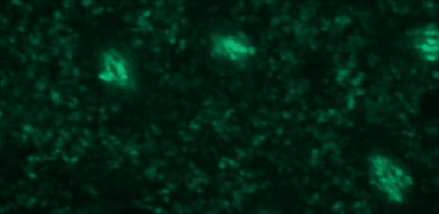
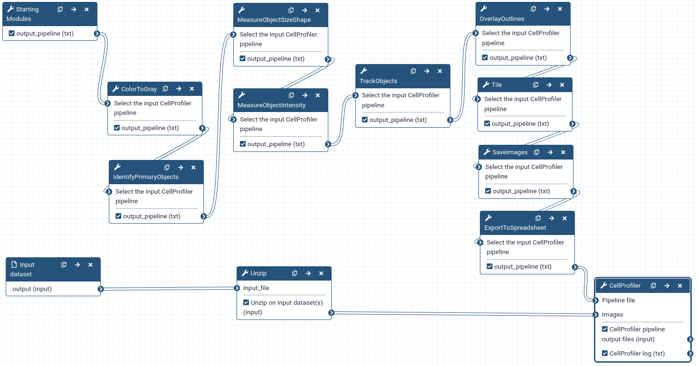
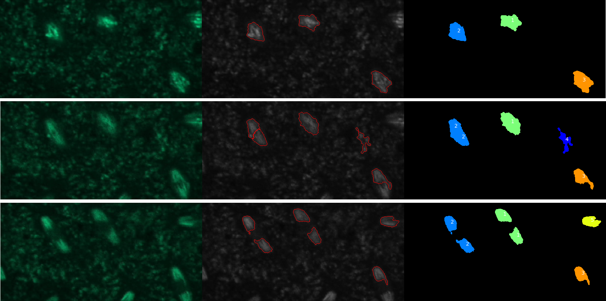

# Introduction


Most biological processes are dynamic and observing them over time can provide valuable insights. Combining fluorescent markers with time-lapse imaging is a common approach to collect data on dynamic cellular processes such as cell division (e.g. , ). However, automated time-lapse imaging can produce large amounts of data that can be challenging to process. One of these challenges is the tracking of individual objects as it is often impossible to manually follow a large number of objects over many time points.

To demonstrate how automatic tracking can be applied in such situations, this tutorial will track dividing nuclei in a short time-lapse recording of one mitosis of a syncytial blastoderm stage _Drosophila_ embryo expressing a GFP-histone gene that labels chromatin.

Tracking is done by first segmenting objects then linking objects between consecutive frames. Linking is done by matching objects and several criteria or matching rules are available. Here we will link objects if they significantly overlap between the current and previous frames.


> <tip-title>Prerequisites</tip-title>
> It is expected that you are already familiar with the Galaxy interface and the workflow editor. If this is not the case, we recommend you to complete the requirements listed at the start of this tutorial.
{: .tip}

> <warning-title>Important information: CellProfiler in Galaxy</warning-title>
> The Galaxy   tool takes two inputs: a CellProfiler pipeline and an image collection.
> Some pipelines created with stand-alone CellProfiler may not work with the Galaxy CellProfiler tool. Some reasons are:
>  * The pipeline was built with a different version of CellProfiler. The Galaxy tool currently uses CellProfiler 3.9.
>  * Modules used by the pipeline aren't available in Galaxy.
>  * Parameters for some CellProfiler modules are limited/constrained compared to the stand-alone version, most notably:
>    - Parameters require manual input from the user whereas, in the stand-alone version, some modules can inherit parameter values from other modules.
>    - Input and output file locations are set by Galaxy and can't be set by the user.
>    - Metadata extraction from file names is limited to a set of fixed patterns.
>
> It is recommended to build a CellProfiler pipeline using the Galaxy interface if the pipeline is to be run by Galaxy.
{: .warning}


> <agenda-title></agenda-title>
>
> In this tutorial, we will cover:
>
> 1. TOC
> {:toc}
>
{: .agenda}


# Get data

This tutorial will use a time-lapse recording of nuclei progressing through mitotic anaphase during early _Drosophila_ embryogenesis. The nuclei are labelled on chromatin with a GFP-histone marker and have been imaged every 7 seconds using a laser scanning confocal microscope with a 40X objective.
The images are saved as a zip archive on Zenodo and need to be uploaded to the Galaxy server before they can be used.



> <hands-on-title>Data upload</hands-on-title>
>
> 1. Create a new history for this tutorial.
>    When you log in for the first time, an empty, unnamed history is created by default. You can simply rename it.
>
>    
>
> 2. Import  the files from [Zenodo]({{ page.zenodo_link }}) or from
>    the shared data library.
>    - **Important:** If setting the type to 'Auto-detect', make sure that after upload, the datatype is set to zip.
>
>    ```
>    https://zenodo.org/api/files/e5d1bd5c-60a0-42e4-8f0d-a2ebc863c5d9/drosophila_sample.zip
>    ```
>
>    
>
> 3. Rename  the file to drosophila_embryo.zip
>
{: .hands_on}


# Create a CellProfiler pipeline in Galaxy

In this section, we will build a CellProfiler pipeline from scratch in Galaxy.
We need to:
  - Read the images and the metadata
  - Convert the colour images to grayscale
  - Segment the nuclei
  - Extract features from the segmented nuclei
  - Perform tracking
  - Produce some useful output files

A pipeline is built by chaining together Galaxy tools representing CellProfiler modules and must start with the  tool and end with the   tool.




> <details-title>More details about the pipeline steps</details-title>
>    - Metadata is needed to tell CellProfiler what a temporal sequence of images is and what the order of images is in the sequence.
>    - CellProfiler is designed to work primarily with grayscale images. Since we don't need the colour information, we convert colour images to grayscale type.
>    - Segmentation means identifying the nuclei in each image. In CellProfiler, this is done by thresholding the intensity level in each image.
>    - When we perform tracking we're usually interested in quantifying how some properties of the objects evolve over time. Also, sometimes we may want to do tracking by matching objects based on some property of the objects (e.g. a shape measurement). Therefore, for each segmented object, we compute some features, i.e. numerical descriptors of some properties of the object.
>    - Tracking will provide the information required to allow downstream data analysis tools to link the features into a multidimensional time series.
>
>
{: .details}


## Create a new workflow

> <hands-on-title>Creating a new workflow</hands-on-title>
> 1. Create a new workflow
>
>    
>
{: .hands_on }

The next steps will add new tools using the workflow editor.
Remember to save the workflow when done (or anytime) to not lose your input parameters.


## Read the images

> <hands-on-title>Reading images</hands-on-title>
>
> 1. Add Inputs → **Input Dataset** to the workflow
>
> 2. Add  **Unzip** with the following parameter:
>   -  *"Extract single file"*: `All files`
>
>
{: .hands_on}


## Get the metadata

> <comment-title></comment-title>
>
> The Starting modules tool combines four CellProfiler modules that are always used together at the start of a pipeline. These modules are:
>  * Images
>  * Metadata
>  * NamesAndTypes
>  * Groups
{: .comment}

> <hands-on-title>Getting metadata</hands-on-title>
>
> 1.  with the following parameters:
>
>     - Images
>        - *"Do you want to filter only the images?"*: `Select the images only`
>
>     - Metadata
>        - *"Do you want to extract the metadata?"*: `Yes, specify metadata`
>
>          -  Insert new metadata
>            - *"Metadata extraction method"*: `Extract from file/folder names`
>            - *"Metadata source"*: `File name`
>            - *"Select the pattern to extract metadata from the file name"*: `field1_field2_field3`
>            - *"Extract metadata from"*: `Images matching a rule`
>
>              - *"Match the following rules"*: `All`
>              -  Insert filtering rules:
>                - *"Select the filtering criteria"*: `File`
>                - *""operator*: `Does`
>                - *"contain"*: `Contain regular expression`
>                - *"match_value"*: `GFPHistone`
>
>     - NamesAndTypes
>       - *"Process 3D"*: `No, do not process 3D data`
>       - *"Assign a name to"*: `Give images one of several names depending on the metadata`
>         -  Insert another image:
>           - *"Match the following rules"*: `All`
>           -  Insert rule:
>
>             - *"Select rule criteria"*: `File`
>
>               - *"operator"*: `Does`
>               - *"contain"*: `Contain regular expression`
>               - *"match_value"*: `GFPHistone`
>
>           - *"Select the image type"*: `Color image`
>           - *"Name to assign these images"*: `OrigColor`
>           - *"Set intensity range from"*: `Image metadata`
>
>       - *"Image matching method"*: `Metadata`
>
>     - Groups
>       - *"Do you want to group your images?"*: `Yes, group the images`
>       - *"Metadata category"*: `field1`
>
>
{: .hands_on}

> <question-title></question-title>
>
> How are we capturing metadata and what type of metadata are we getting?
>
> > <solution-title></solution-title>
> >
> > Metadata is obtained from the filenames by extracting three text fields separated by an underscore. The metadata we get is "DrosophilaEmbryo", "GFPHistone" and numbers with leading zeros. These three fields represent respectively the sample identifier, the marker visualized in the image and the index in the time series.
> >
> {: .solution}
>
{: .question}

> <question-title></question-title>
>
> How will CellProfiler form a temporal sequence?
>
> > <solution-title></solution-title>
> >
> > Images will be grouped based on field1 which here is the sample identifier and ordered alpha-numerically (by default) which will order them by field3 (the time series index) since fields 1 and 2 are constant.
> >
> {: .solution}
>
{: .question}


## Convert the images to grayscale

> <hands-on-title>Colour to grayscale conversion</hands-on-title>
>
> 1.  with the following parameters:
>    - *"Select the input CellProfiler pipeline"*: Connect output of **Starting Modules**  to input of 
>    - *"Enter the name of the input image"*: `OrigColor`
>    - *"Conversion method"*: `Combine`
>        - *"Name the output image"*: `OrigGray`
>        - *"Image type"*: `RGB`
>          - *"Relative weight of the red channel"*: `1`
>          - *"Relative weight of the green channel"*: `1`
>          - *"Relative weight of the blue channel"*: `1`
>
>
{: .hands_on}


## Segmentation

The first step to track nuclei starts with the identification of those objects on the images.

> <hands-on-title>Nuclei segmentation</hands-on-title>
>
> 1.  with the following parameters:
>    -  *"Select the input CellProfiler pipeline"*: output of **ColorToGray** 
>    - *"Use advanced settings?"*: `Yes, use advanced settings`
>        - *"Enter the name of the input image (from NamesAndTypes)"*: `OrigGray`
>        - *"Enter the name of the primary objects to be identified"*: `Nuclei`
>        - *"Typical minimum diameter of objects, in pixel units (Min)"*: `30`
>        - *"Typical maximum diameter of objects, in pixel units (Max)"*: `9999`
>        - *"Discard objects outside diameter range?"*: `Yes`
>        - *"Discard objects touching the border of the image?"*: `Yes`
>        - *"Threshold strategy"*: `Global`
>            - *"Thresholding method"*: `Otsu`
>                - *"Two-class or three-class thresholding?"*: `Three classes`
>                    - *"Assign pixels in the middle intensity class to the foreground or the background?"*: `Background`
>                - *Threshold smoothing scale"*: `1.3488`
>                - *Threshold correction factor"*: `1`
>                - *Lower bound on threshold"*: `0.01`
>                - *Upper bound on threshold"*: `1`
>        - *"Method to distinguish clumped objects"*: `Intensity`
>            - *"Method to draw dividing lines between clumped objects"*: `Intensity`
>                - *"Automatically calculate size of smoothing filter for declumping?"*: `Yes`
>                - *"Automatically calculate minimum allowed distance between local maxima?"*: `Yes`
>                - *"Speed up by using lower-resolution mage to find local maxima?"*: `Yes`
>        - *"Fill holes in identified objects"*: `After both thresholding and declumping`
>        - *"Handling of objects if excessive number of objects identified"*: `Continue`
>
{: .hands_on}


## Feature extraction

Once the objects of interest (nuclei) are identified, we extract features, i.e. numerical descriptors of object properties. We do this because we may be interested in analysing the evolution of these properties over time or want to use them in the tracking procedure to match objects over time.

> <hands-on-title>Shape features</hands-on-title>
>
> 1.  with the following parameters:
>    -  *"Select the input CellProfiler pipeline"*: output of **IdentifyPrimaryObjects** 
>    - In *"new object"*:
>        -  *"Insert new object"*
>            - *"Enter the name of the object to measure"*: `Nuclei`
>    - *"Calculate the Zernike features?"*: `No`
>
{: .hands_on}

> <hands-on-title>Intensity features</hands-on-title>
>
> 1.  with the following parameters:
>    -  *"Select the input CellProfiler pipeline"*: output of **MeasureObjectSizeShape** 
>    - In *"new image"*:
>        -  *"Insert new image"*
>            - *"Enter the name of an image to measure"*: `OrigGray`
>    - In *"new object"*:
>        -  *"Insert new object"*
>            - *"Enter the name of the objects to measure"*: `Nuclei`
>
{: .hands_on}


## Track nuclei

With the nuclei and the relevant features measured, we are now ready to start the tracking step!
> <hands-on-title>Object tracking</hands-on-title>
>
> 1.  with the following parameters:
>    -  *"Select the input CellProfiler pipeline"*: output of **MeasureObjectIntensity** 
>    - *"Enter the name of the objects to track"*: `Nuclei`
>    - *"Choose a tracking method"*: `Overlap`
>        - *"Maximum pixel distance to consider matches"*: `50`
>        - *"Filter objects by lifetime?"*: `No`
>        - *"Select display option?"*: `Color and Number`
>        - *"Save color-coded image?"*: `Yes`
>            - *"Name the output image"*: `TrackedNuclei`
>
{: .hands_on}


## Visualize results

To make sure that the tracking has gone as expected, we will have a look at the original images together with the results of the segmentation step. And we will visualize them together (in tiles) for easier comparison.
> <hands-on-title>Visualize segmentation outcome</hands-on-title>
>
> 1.  with the following parameters:
>    -  *"Select the input CellProfiler pipeline"*: output of **TrackObjects** 
>    - *"Display outlines on a blank image?"*: `No`
>        - *"Enter the name of image on which to display outlines"*: `OrigGray`
>        - *"Outline display mode"*: `Color`
>            - In *"Outline"*:
>                -  *"Insert Outline"*
>                    - *"Enter the name of the objects to display"*: `Nuclei`
>                    - *"Select outline color"*:  (red)
>    - *"Name the output image"*: `OutlineImage`
>    - *"How to outline"*: `Inner`
>
{: .hands_on}

> <hands-on-title>Tiling images</hands-on-title>
>
> 1.  with the following parameters:
>    -  *"Select the input CellProfiler pipeline"*: output of **OverlayOutlines** 
>    - *"Enter the name of an input image"*: `OrigColor`
>    - *"Name the output image"*: `TiledImages`
>    - *"Tile assembly method"*: `Within cycles`
>        - *"Automatically calculate number of rows?"*: `No`
>            - *"Final number of rows"*: `1`
>        - *"Automatically calculate number of columns?"*: `Yes`
>        - *"Image corner to begin tiling"*: `top left`
>        - *"Direction to begin tiling"*: `row`
>        - *"Use meander mode?"*: `No`
>        - In *"Another image"*:
>            -  *"Insert Another image"*
>                - *"Enter the name of an additional image to tile"*: `OutlineImage`
>            -  *"Insert Another image"*
>                - *"Enter the name of an additional image to tile"*: `TrackedNuclei`
>
{: .hands_on}


## Save the images and features

The tiled images and the features computed in previous steps are now exported to the Galaxy history ready to be analyzed.
> <hands-on-title>Save the images</hands-on-title>
>
> 1.  with the following parameters:
>    -  *"Select the input CellProfiler pipeline"*: output of **Tile** 
>    - *"Select the type of image to save"*: `Image`
>        - *"Saved the format to save the image(s)"*: `png`
>    - *"Enter the name of the image to save"*: `TiledImages`
>    - *"Select method for constructing file names"*: `From image filename`
>        - *"Enter the image file name"*: `OrigColor`
>        - *"Append a suffix to the image file name"*: `Yes`
>            - *"Text to append to the image file name"*: `_tile`
>    - *"Overwrite existing files without warning?"*: `Yes`
>    - *"When to save"*: `Every cycle`
>    - *"Record the file and path information to the saved image?"*: `No`
>
>
{: .hands_on}

> <question-title></question-title>
>
> What will be the file names of the output images?
>
> > <solution-title></solution-title>
> >
> > The files will be named DrosophilaEmbryo_GFPHistone_0000_tile.png,
> > DrosophilaEmbryo_GFPHistone_0001_tile.png ...
> {: .solution}
>
{: .question}


> <hands-on-title>Export tabular data to character-delimited text files</hands-on-title>
>
> 1.  with the following parameters:
>    -  *"Select the input CellProfiler pipeline"*: output of **SaveImages** 
>    - *"Select the column delimiter"*: `Comma (",")`
>    - *"Add a prefix to file names?"*: `Do not add prefix to the file name`
>    - *"Overwrite existing files without warning"*: `Yes`
>    - *"Add image metadata columns to your object data file"*: `Yes`
>    - *"Representation of Nan/Inf"*: `NaN`
>    - *"Calculate the per-image mean values for object measurements?"*: `Yes`
>    - *"Calculate the per-image median values for object measurements?"*: `Yes`
>    - *"Calculate the per-image standard deviation values for object measurements?"*: `Yes`
>    - *"Create a GenePattern GCT file?"*: `No`
>
>    > <comment-title></comment-title>
>    >
>    > By default all measurement types are exported.
>    > This is in contrast to the stand-alone version of CellProfiler which allows choosing which measurement types to save.
>    {: .comment}
>
{: .hands_on}


# Run the pipeline with **CellProfiler**

As mentioned in the introduction, the tool   takes as input the pipeline that we have been assembling over this tutorial and the input data. We are now ready to finally run CellProfiler!
> <hands-on-title>Running the pipeline with CellProfiler</hands-on-title>
>
> 1.   with the following parameters:
>    -  *"Pipeline file"*: `output of **ExportToSpreadsheet** 
>    - *"Are the input images packed into a tar archive?"*: `No`
>        -  *"Images"*: output of **Unzip** 
>    - *"Detailed logging file?"*: `Yes`
>
> 2. Run the workflow.
>
>    
>
>    > <comment-title></comment-title>
>    >
>    > If the pipeline fails, inspect the CellProfiler log file for clues about errors.
>    > A common source of errors is not providing the correct information to a module such as pointing a CellProfiler module at a non-existent dataset (e.g. with a typo in the name).
>    {: .comment}
>
{: .hands_on}





> <question-title></question-title>
>
> How many nuclei have been tracked?
>
> > <solution-title></solution-title>
> > Five objects were detected but only four of these were nuclei.
> >
> {: .solution}
>
{: .question}


> <question-title></question-title>
>
> How could we get rid of tracks that don't correspond to nuclei?
>
> > <solution-title></solution-title>
> >
> > Objects that are not nuclei appear to be transient so one solution would be to require the tracks to have a minimal length. This can be done using the *"Filter objects by lifetime"* parameter of the TrackObjects module.
> >
> {: .solution}
>
{: .question}
> <question-title></question-title>
>
> Where is the data needed to plot change in nuclei eccentricity over time?
>
> > <solution-title></solution-title>
> > The data is in the csv file called Nuclei in the CellProfiler pipeline output data set.
> >
> {: .solution}
>
{: .question}


# Conclusion


We've run a CellProfiler pipeline on Galaxy to segment and track dividing nuclei in a Drosophila embryo. We've exported images to visually inspect the outcome and saved tables of computed object features in comma-separated text files for future analysis.
