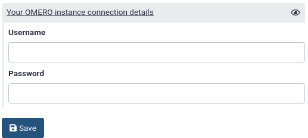
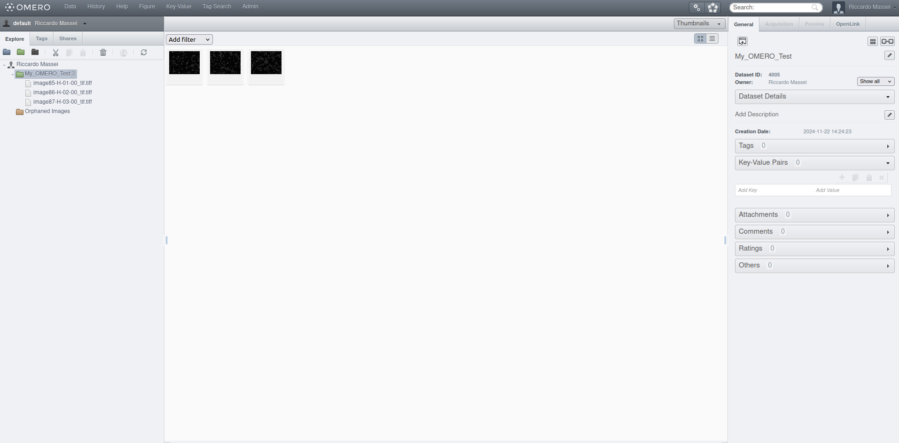
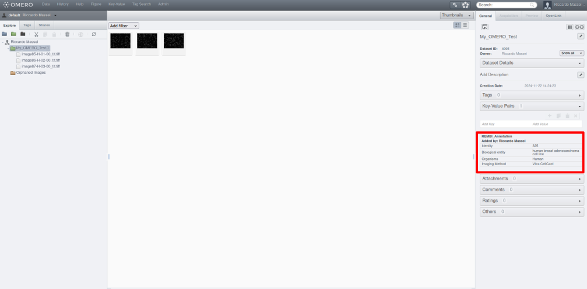
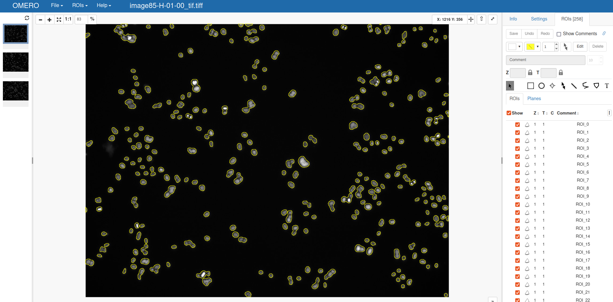
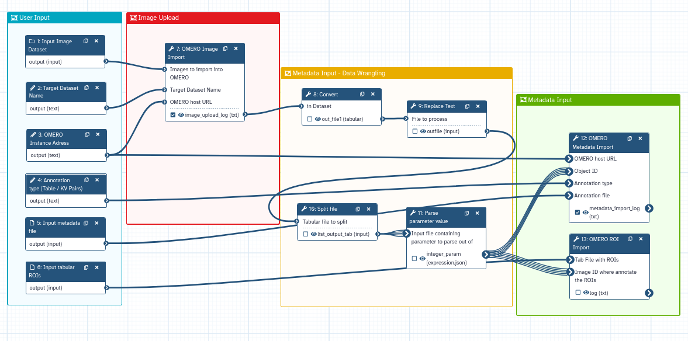
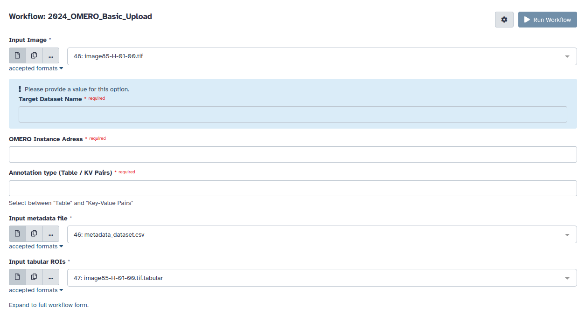

The efficient and accurate treatment of microscopy metadata is of great importance, as it 
provides insights that are essential for effective image management, search, organisation, 
interpretation, and sharing. Considering this, it is vital to find ways to properly deal with the huge amount 
of complex and unstructured data for implementing **[Findable, Accessible, 
Interoperable and Reusable (FAIR)](https://www.nature.com/articles/sdata201618)** concepts in bio-imaging.

One of the most flexible and used open-source tools for image and metadata management can be
identified as **[OMERO
(Open Microscopy Environment Remote Objects)](https://www.nature.com/articles/nmeth.1896)**. **OMERO** is an open-source 
software platform designed to manage, visualise, and analyse large sets of biological image
data. Developed by the Open Microscopy Environment consortium, **OMERO** provides researchers 
with a centralised repository to store images and metadata, tools for collaborative 
sharing, and advanced functionalities for image processing and analysis.

In this tutorial, you will learn how to use the different tools of the **Galaxy OMERO-suite**. 
The  **Galaxy OMERO-suite** is based on the Python packages omero-py and ezomero, and it allows interactively building pipelines to upload and fetch image data in OMERO 
using a Galaxy workflow. 
Images can automatically be enriched with metadata (i.e. key-value pairs, tags, raw data, regions 
of interest) and uploaded to an OMERO server. The tools give the possibility 
to the user to intuitively fetch images from the local server and 
perform image analysis.

> <agenda-title></agenda-title>
>
> In this tutorial, we will cover:
>
> 1. Learn the different tools of the Galaxy OMERO-suite to manage image data and metadata
> 2. Get data from an OMERO instance using the Galaxy OMERO-suite
> 3. Build a pipeline for image and metadata upload into OMERO
{: .agenda}


## Before Starting - Set up the OMERO credentials
Before starting you need to set up your OMERO credential. 
This is necessary to connect to a target OMERO instance and needs to be performed just one time.

The OMERO credentials have to be saved in your preferences 
(*User → Preferences → Manage information*).



This feature is embedded in Galaxy and needs to be enabled by the admin 
of the server you are using. You can now use it in [UseGalaxy.eu](https://usegalaxy.eu/) or ask your 
admin to add it. For more info about the configuration on the admin side, 
please take a look at the [README file of the tool](https://github.com/galaxyproject/tools-iuc/blob/main/tools/idr_download/README.md).

**Please Notice**: The configuration file, which contains your OMERO password and username, will be stored in the job working directory.
    This directory only exists during the runtime of the job and should only be accessible by the system user that runs the job.
    However, please be aware that your username and password **may be exposed** to users with administrative rights.
    We are working on increasing the security of the OMERO suite

# Prepare your data

We need a dataset to upload into your OMERO instance. 
To this end, we have prepared an integrative dataset with images, metadata and regions of interest (ROIs) in Zenodo. 


## Data Upload - Image, metadata and ROI files

> <hands-on-title>Data Upload</hands-on-title>
>
> 1. Create a new history for this tutorial in Galaxy.
>
>    
>
> 2. Import the nuclei imaging data from [Zenodo](https://zenodo.org/records/14196675) or 
> from the shared data library:
>    - **Important:** Choose the correct data type if prompted.
>
>    ```
>    https://zenodo.org/records/14205500
>    ```
>
>    
>    
>    
>
>   
>    - Select the following files: 
>    
>       - `image85-H-01-00.tif`
>       - `image85-H-01-00.tif.tabular`
>       - `image86-H-02-00.tif`
>       - `image86-H-02-00.tif.tabular`
>       - `image87-H-03-00.tif`
>       - `image87-H-03-00.tif.tabular`
>       - `metadata_dataset.csv`
> 
> 3. Tag each dataset with a label like "image" (tif files), "rois" (tabular files) and "metadata" (CSV file)
> for easy identification
{: .hands_on}

# Upload images and metadata

In this section, we will focus on how uploading images and metadata into a user-defined OMERO instance.
This is done by using the **OMERO Image Import** and **OMERO Metadata Import** tools.

## Step 1: Image Upload

> <hands-on-title>Upload images into OMERO</hands-on-title>
>
> 1.  with the following recommended parameters:
>    -  *Images to import into OMERO*: You can select here different files to import into OMERO.
>    Select the datasets `image85-H-01-00.tif`, `image86-H-02-00.tif` and `image87-H-03-00.tif`
>    - **OMERO host URL**: Input the URL of your OMERO instance.
>    - **OMERO port**: Input the OMERO port (pre-defined value, *4064*)
>    -  **Target Dataset Name**: Type "My_OMERO_Test"
> 
>    A log file text file will be
>    created with the OMERO ID of the newly imported images
{: .hands_on}

After tool execution, you can check the images in your OMERO instance!


Obviously, the Dataset and Image ID change according to your instance... In this case, we have created a new
dataset called "My_OMERO_Test" with ID 4005, while images have IDs 30781, 30782 and 30783.

## Step 2: Upload metadata

You can upload two different kinds of metadata files using the OMERO-suite.

- **Key Value Pairs:** Useful for displaying dataset and image metadata in OMERO.web. 
Key Value pairs are for unstructured data where every object can have different keys, and they can be easily edited ad-hoc by users.
- **Tables:** Useful for showing results for multiple images at the same time. Tables are suitable for e.g. analysis results or large structured data, columns have defined types (kv pairs are all strings) and can be queried like a database table.

We will learn now how to upload **Key-Value pairs** using the **OMERO Metadata Import** tool

> <hands-on-title>Upload Key-Value Pairs into OMERO</hands-on-title>
>
> 1.  with the following recommended parameters:
>    -  *Annotation file*: `metadata_file.tsv`
>    - **OMERO host URL**: Input the URL of your OMERO instance.
>    - **OMERO port**: Input the OMERO port (pre-defined value, *4064*)
>    -  **Target Object Type**: Select *"Dataset"*
>    - **Selection**: Select *"Target an existing object"*
>    - **Object ID**: Input the ID of the previously created dataset. *4005* for this training
>    - **Annotation type**: Select *"KV"*
>    - **Annotation Name**: Type *"REMBI_Annotation"*
{: .hands_on}

Switch back to your OMERO instance. 
The Key Values are now in OMERO, associated with a target dataset! Well done!


# Upload region of interest (ROIs)
OMERO support the ROI visualization in OMERO.viewer. 
In this section you will learn to associate ROIs coordinates to
an image stored in OMERO using the **OMERO ROI Import** tool.

Please note that this tool supports just polygon ROIs given in a specific format.
The tool [Analyze particles](https://toolshed.g2.bx.psu.edu/view/imgteam/imagej2_analyze_particles_binary/862af85a50ec)
can automatically create the ROIs in this specific format.

Check the `roi_file.tsv` to have an example. Everything is explained in the tools help section!


> <hands-on-title>Upload images into OMERO</hands-on-title>
>
> 1.  with the following recommended parameters:
>    -  **Tab File with ROIs**: `roi_file.tsv`
>    - **OMERO host URL**: Input the URL of your OMERO instance.
>    - **OMERO port**: Input the OMERO port (pre-defined value, *4064*)
>    - **Image ID where annotate the ROIs**: Select the **image ID** where to annotate the ROIs. We will go for *30782*
{: .hands_on}

Switch back to your OMERO instance and the image by double-clicking it.
This will open the OMERO.viewer. 
Go now to the "ROIs" sub-panel.
The ROIs are now annotated in OMERO and associated with the target image! **Awesome!**



# Get OMERO object IDs and Annotations
You can get information on projects, datasets and image IDs. 
Furthermore, you can fetch annotations and tables
associated with an OMERO object. This is done with the **OMERO get IDs** and 
**OMERO get Object** tools, respectively.

First of all, let's try to get all the image IDs present in all Datasets!

> <hands-on-title>Upload images into OMERO</hands-on-title>
>
> 1.  with the following recommended parameters:
>    - **OMERO host URL**: Input the URL of your OMERO instance.
>    - **OMERO port**: Input the OMERO port (pre-defined value, *4064*)
>    - **Type of object to fetch ID:**: Select *"Dataset IDs"*
>    - **Which datasets?**: Select *"All datasets"*
>    - **ID of the project**: *0*
{: .hands_on}

Since we have just one dataset in your OMERO instance, the tool will produce a tabular file
with the IDs of the three images we just uploaded.

| 1     |
|-------|
| 30781 |
| 30782 |
| 30783 |

Now, let's try to get an annotation file...

> <hands-on-title>Get an annotation file from OMERO</hands-on-title>
>
> 1.  with the following recommended parameters:
>    - **OMERO host URL**: The target OMERO host URL
>    - **OMERO port**: The OMERO port, pre-defined to *4064*
>    - **Type of object to fetch:**: Select *"Annotation"*
>    - **How do you provide the ID(s) of the OMERO object?**: Select *"Comma separated values"*
>    - **ID(s) of the object(s) to fetch on OMERO separated by comma**: 4005
{: .hands_on}

Perfect, you fetched the Annotation file "REMBI_Annotation". 
**OMERO get Object** is particularly useful when you want to fetch data associated with your dataset or 
images!

# Filter OMERO object based on filename, tags and Key-Value Pairs
Finally, you filter OMERO objects based on their features... One option is to filter by filename,
a useful parameter to apply if you want to get certain images. 

This can be done by using the **OMERO IDs** Tool

> <hands-on-title>Upload images into OMERO</hands-on-title>
>
> 1.  with the following recommended parameters:
>    - **OMERO host URL**: The target OMERO host URL
>    - **OMERO port**: The OMERO port, pre-defined to *4064*
>    - **Filename to search among the image IDs**: Type `image85-H-01-00_tif.tiff`
>    - **List of images IDs**: Type *30781,30782,30783*
{: .hands_on}

As an output, you will have a tabular file with the following info:

| 1     |
|-------|
| 30782 |

Which is ID associated to the image with file name "image85-H-01-00_tif.tiff"! 

However, you can also use this tool to fetch images with specific file names or tags,
making data fetching an easy task...

# A full workflow for data management with the OMERO suite 

In this section, you will learn to integrate all the different tools to build a workflow for uploading
an images, metadata and ROIs  into OMERO.

### Step 1 - Define the OMERO inputs
To make the workflow work, you need to define six inputs. 

This will make this workflow reusable with different datasets.

> <hands-on-title>Create the inputs for the OMERO pipeline</hands-on-title>
>
> 1. Create a new workflow in the workflow editor.
>
>    
>
> 2. Select  **Input dataset collection** from the list of tools:
>    -  **1: Input dataset collection** appears in your workflow. 
>    Change the "Label" of this input to *Input image Dataset*.
> 3. Add two  **Input dataset**:
>    -  **2: Input Dataset** and  **3: Input Dataset** appears in your workflow. 
> Change the "Label" of these inputs to *Input Tabular ROIs* and *Input Metadata File*
> 4. Add three **Simple Input for Workflow Logic**:
>    - **4: Simple input for workflow logic**, **5: Simple input for workflow logic**, 
>    **6: Simple input for workflow logic**  appear in your workflow. 
>    Change the "Label" of these inputs to *Target Dataset Name*, *OMERO instance address* and
>    *Annotation type*
{: .hands_on}

### Step 2 - OMERO Import
We now add the step for the image import

> <hands-on-title>Add the image upload step to the workflow</hands-on-title>
>
>1. While in the workflow editor add   from the list of tools:
>   - Connect the output of  **1: Input image Datasets** to the "Images to Import in OMERO" 
>   input of  **7: OMERO Image Import**.
>   - Connect the output of  **4: Target Dataset Name** to the "Target Dataset Name" 
>   input of  **7: OMERO Image Import**.
>   - Connect the output of  **5: OMERO instance address** to the "OMERO host url"
>   input of  **7: OMERO Image Import**.
{: .hands_on}

### Step 3 - Dynamically parse image IDs 
We need now a small series of steps to get the ID of the image we just upload into OMERO
This can be done with the following tool sequence:

> <hands-on-title>Parse Images IDs </hands-on-title>
>
>1. Add  **Convert** from the list of tools:
>   - Connect the output of  **7: OMERO Image Import** to the  **8: Convert** input
>2. Add  **Replace text**  from the list of tools:
>   - Connect the output of  **8: Convert** to the  **Replace text** input 
>3. Add  **Split File**  from the list of tools:
>   - Connect the output of  **9: Replace text** to the  **10: Split File** 
>4. Add  **Parse parameter value**  from the list of tools:
>   - Connect the output of  **10: Split File**  to the  **11: Parse parameter value**
{: .hands_on}

We got the OMERO image ID! We can now use it as an input for next sequence of tools...

### Step 4 - Metadata and ROIs input

The last section is to upload metadata and ROIs

> <hands-on-title> Add tools to upload metadata and ROIs </hands-on-title>
>
>1. Add   from the list of tools:
>   - Connect the output of  **5: OMERO instance address** to the "OMERO host url"
>   input of  **12: OMERO Metadata Import**.
>   - Connect the output of  **11: Parse parameter value** to the "Object ID"
>   input of  **12: OMERO Metadata Import**.
>   - Connect the output of  **6: Annotation type** to the "Annotation type"
>   input of  **12: OMERO Metadata Import**.
>   - Connect the output of  **3: Input Metadata File** to the "Annotation file"
>   input of  **12: OMERO Metadata Import**.
>2. Add   from the list of tools:
>   - Connect the output of  **5: OMERO instance address** to the "OMERO host url"
>   input of  **13: OMERO ROI Import**.
>   - Connect the output of  **2: Input Tabular ROIs** to the "Tab File with ROIs"
>   input of  **13: OMERO ROI Import**.
>   - Connect the output of  **11: Parse parameter value** to the "Image ID where annotate the ROIs"
>   input of  **13: OMERO ROI Import**.
>3. Save your workflow and name it `OMERO_basic_upload`.
{: .hands_on}


You are done! The final workflow should  look like this:


And you can easily add all parameters during the workflow invocation:


This workflow can be easily re-used or turned into a sub-workflow for an image processing
pipeline.

# Conclusion

In this exercise, you imported images into OMERO using Galaxy. You also learn how to
import metadata and ROIs, as well as get information such as image ID and annotation file
from a target OMERO instance.


# References

- Allan, C., Burel, JM., Moore, J. et al. OMERO: flexible, model-driven data management for experimental biology. 
Nat Methods 9, 245–253 (2012). https://doi.org/10.1038/nmeth.1896
- Wilkinson, M., Dumontier, M., Aalbersberg, I. et al. The FAIR Guiding Principles for Scientific Data Management and
stewardship. Sci Data 3, 160018 (2016). https://doi.org/10.1038/sdata.2016.18
