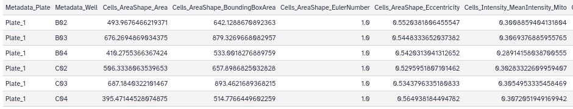
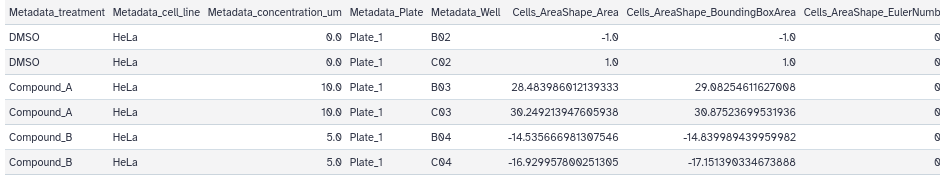
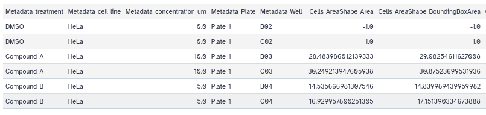
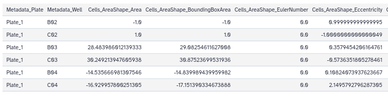
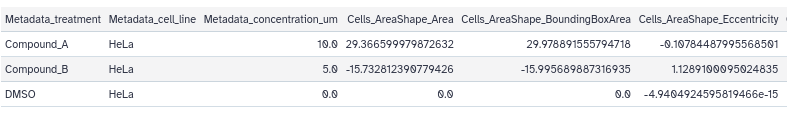
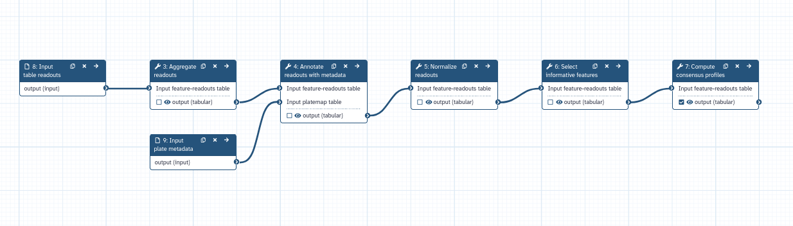

High-content imaging screens generate thousands of microscopy images capturing how cells respond to genetic or chemical perturbations. In particular, [cell painting assays](https://en.wikipedia.org/wiki/Cell_painting) are a high-content/high-throughput imaging methods designed to reveal a broad range of cellular phenotypes. Image analysis makes it possible to extract numerical information from cell shape, producing what are known as "morphological profiles". These morphological profiles offer a window into a variety of biological processes, such as how cells react to genetic modifications, drug exposure, and shifts in their environment (). Extracting biological meaning from these images requires transforming raw features and readouts into clean, comparable profiles. Because of the sheer number of values involved, these results can be extremely large, and specific frameworks are needed to process such morphological profiles correctly.

In this context, **Pycitominer** is a Python toolkit for processing high dimensional readouts from high-throughput image-based profiling experiments ().

{: width="50%"}

In this tutorial, you will learn how to run a Pycitominer pipeline using Galaxy. We will follow the different steps explained in the [Pycitominer documentation](https://pycytominer.readthedocs.io/en/stable/tutorials/introduction_to_pycytominer.html). If you want a more comphresince explanation of
each step, please fell free to visit the main [Pycitominer main documentation page](https://pycytominer.readthedocs.io/en/stable/tutorials/introduction_to_pycytominer.html) or the [GitHub repository](https://github.com/cytomining/pycytominer)!

> <agenda-title></agenda-title>
>
> In this tutorial, we will deal with:
>
> 1. TOC
> {:toc}
>
{: .agenda}

# Getting data

The data necessary for this tutorial can be created following the instruction of the Pycitominer documentation. However, for simplicity, we already made them available for you here in the training!

> <hands-on-title>Data Upload</hands-on-title>
>
> 1. Create a new history for this tutorial.
>
> 2. Download the following image and import it into your Galaxy history.
>    - [`01_platemap.tsv`](workflows/test-data/01_platemap.tsv)
>    - [`01_single_cells.tsv`](workflows/test-data/01_single_cells.tsv)
>    
>    If you are importing the image via URL:
>
>    
>
>    If you are importing the image from the shared data library:
>
>    
>
> 3. Confirm the datatypes are correct (`tabular` for both images)
>
>    
> 
>    
{: .hands_on}

# Step 1: Aggregate — From Cells to Wells

**Aggregation** collapses single-cell measurements into a single profile per well or per sample by computing a summary statistic (such as the median) across all cells.

> <hands-on-title>Aggregate plate readouts with Pycitominer</hands-on-title>
>
> 1.  with the following parameters to aggregate redouts:
>    -  *"Input feature-readouts table"*: `01_single_cells.tsv` file
>    - *"Aggregation Column"*: Select "c1:Metadata_Plate" and "c2:Metadata_Well"
>    - *"Aggregation function"*: `Mean`
> 2. Rename  the generated file to `01_output_aggregate.tsv`.
> 3. Click on the **visualise icon**  of the file to visually inspect the image using the **Tabulator** visualization plugin.
{: .hands_on}

The original file with 601 rows is now aggregated into a file with just 7 rows by aggregating plate and single wells!

# Step 2: Annotate — Adding Experimental Context

**Annotation** merges these profiles with experimental metadata (i.e. plate and well identifiers, and other conditions) so each profile is linked to what was done to the cells.

> <hands-on-title> Annotate readouts with metadata with Pycitominer</hands-on-title>
>
> 1.  with the following parameters to aggregate redouts:
>    -  *"Input feature-readouts table"*: `01_output_aggregate.tsv` file
>    - *"Column describing the wells in the feature-readouts table"*: Select "c2:Metadata_Well"
>    -  *"Input platemap table"*: `01_platemap.tsv` file
>    - *"Column describing the wells in the platemap"*: Select "c1:well_position"
> 2. Rename  the generated file to `02_output_annotated.tsv`.
> 3. Click on the **visualise icon**  of the file to visually inspect the image using the **Tabulator** visualization plugin.
{: .hands_on}

Three additional columns are now added to the table: "Metadata_treatment", "Metadata_cell_line" and "Metadata_concentration_um". All these informations are important to give more context to the data.

# Step3: Normalize — Removing Technical Variation

**Normalization** rescales features to make them comparable across plates and batches, commonly by standardizing each feature against control samples to correct for plate-to-plate variation.

> <hands-on-title> Normalize readouts with Pycytominer </hands-on-title>
>
> 1.  with the following parameters to aggregate redouts:
>    -  *"Input feature-readouts table"*: `02_output_annotated.tsv` file
>    - *"Column with normalization values"*: Select "c1:Metadata_treatment"
>    - *"Value"*: Type "DMSO"
>    - *"Normalization method"*: Select "Standardize"
> 2. Rename  the generated file to `03_output_normalized.tsv`.
> 3. Click on the **visualise icon**  of the file to visually inspect the image using the **Tabulator** visualization plugin.
{: .hands_on}

Now values do not differ anymore much for scale and unit. Normalization allows a better comparability of the results.

# Step 4: Feature Selection — Keeping Only Informative Features

**Feature selection** removes uninformative or redundant features, such as those with low variance, high correlation with other features, or missing values, yielding a compact and reliable feature set.

> <hands-on-title>  Select informative features with Pycytominer </hands-on-title>
>
> 1.  with the following parameters to aggregate redouts:
>    -  *"Input feature-readouts table"*: 03_output_normalized.tsv` file
>    - *"Operations"*: Select "Variance Threshold" and "Blocklist"
> 2. Rename  the generated file to `04_output_features.tsv`.
> 3. Click on the **visualise icon**  of the file to visually inspect the image using the **Tabulator** visualization plugin.
{: .hands_on}

 We passed from 16 columns to 15, since the feature "Cells_AreaShape_EulerNumber" was removed from the readouts... indeed, all values in each well was equal to 0.

# Step 5: Consensus — Collapsing Replicates

**Compute Consensus** replicate profiles into one consensus profile per treatment group by computing the median across all replicates.

> <hands-on-title> Compute consensus profiles with Pycytominer  </hands-on-title>
>
> 1.  with the following parameters to aggregate redouts:
>    -  *"Input feature-readouts table"*: 04_output_features.tsv` file
>    - *"Column with unique condition"*: Select "c1:Metadata_treatment", "c2:Metadata_cell_line" and "c3:Metadata_concentration_um"
>    - *"Reduction operation"*: Select "Mean"
> 2. Rename  the generated file to `05_output_consensus.tsv`.
> 3. Click on the **visualise icon**  of the file to visually inspect the image using the **Tabulator** visualization plugin.
{: .hands_on}

We have now a table with just 4 lines, collapsed in the selected unique conditions!

# A full workflow for table readouts processing

You can now create a workflow from the different Pycitominer steps in your history:

> <hands-on-title> Extract Pycitominer workflow from history  </hands-on-title>
> 1. Now we can extract the workflow for batch processing:
>    - Name it "pycitominer-full-steps".
>    - Don't treat `01_platemap.tsv` and `01_single_cells.tsv` as inputs (the workflow is supposed to be applied to the images directly).
>
>    
>
> 2. Edit the workflow you just created:
>    - Select "Input dataset" from the list of tools. The step  **8: Input Dataset** appears.
>    - Select "Input dataset" from the list of tools. The step  **9: Input Dataset** appears.
>    - Change the "Label" of  **8: Input Dataset** to `input table readouts`.
>    - Change the "Label" of  **9: Input Dataset** to `input plate metadata`.
>    - Connect the output of  **8: input table readouts** to the input of  **3: Aggregate readouts**.
>    - Connect the output of  **9: input plate metadata** to the "Input plate Table" input of  **4: Annotate readouts with metadata**.
>    - Mark the results of  **7: Compute Consensus Profile** as the primary outputs of the workflow (by clicking on the checkboxes of the outputs).
>
{: .hands_on}

You have now an Pycitominer automatized workflow in Galaxy! 

# Conclusion

The following tutorial uses high-content imaging analysis as an example, but the same Pycytominer tools can be used
in many other contexts for data wrangling, normalization, and annotation... Find your own solution!