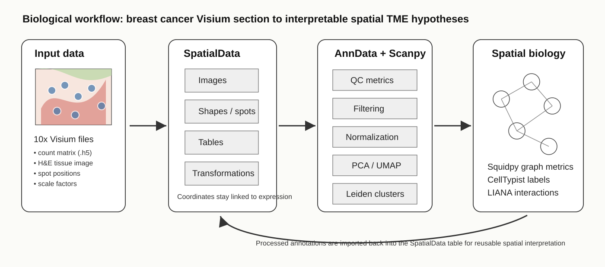

# Introduction

Spatial transcriptomics measures gene expression while retaining positional information from the tissue section. This is useful in breast cancer because molecular signals can be interpreted together with histology, rather than as a dissociated or bulk average. The dataset used here is the public 10x Genomics **Human Breast Cancer (Block A Section 1)** Visium Spatial Gene Expression dataset, repackaged on Zenodo for Galaxy training .

According to the 10x Genomics dataset description, the source tissue is fresh frozen human invasive ductal carcinoma. The section was reported as AJCC/UICC Stage Group IIA, ER positive, PR negative, and HER2 positive, with annotation including ductal carcinoma in situ, lobular carcinoma in situ, and invasive carcinoma. The same source reports 3,798 spots detected under tissue, a median of 20,762 UMI counts per spot, and a median of 6,026 genes per spot . These details are useful context for interpreting the analysis, but they do not replace pathologist review or experimental validation.

This tutorial uses Galaxy tools to build a reproducible analysis path: create a linked spatial object, export the expression table to AnnData, perform Scanpy preprocessing, identify Leiden clusters, test spatial organisation with Squidpy, annotate likely cell-type signals with CellTypist, and infer candidate ligand-receptor interactions with LIANA. The workflow is designed for reproducible exploration. It supports careful interpretation of spatial patterns, but cluster labels, cell-type predictions, and ligand-receptor pairs should be treated as hypotheses until they are checked against marker genes, morphology, spatial context, and relevant literature.

Recent breast cancer spatial studies illustrate why this type of workflow is useful: combining morphology, single-cell information, and spatial gene expression can help resolve tumour, stromal, immune, myoepithelial, and in situ/invasive tumour-associated regions that are difficult to interpret from expression alone .

> <agenda-title></agenda-title>
>
> In this tutorial, we will cover:
>
> 1. TOC
> {:toc}
>
{: .agenda}

> <comment-title>How to read the biological interpretation</comment-title>
>
> The questions in this tutorial focus on outputs that learners can inspect in their Galaxy histories: QC plots, cluster summaries, marker-gene plots, spatial-neighbourhood statistics, CellTypist labels, and LIANA tables. Exact cluster identities are not hard-coded because they depend on selected parameters and the reference model available on the Galaxy server.
>
> The tutorial separates **observations** from **interpretations**. Dataset metadata and method descriptions are cited. Outputs such as clusters, marker genes, cell-type labels, spatial enrichment, and ligand-receptor pairs should be treated as evidence for hypotheses that need additional checks, especially because Visium spots can contain RNA from multiple neighbouring cells.
>
{: .comment}

# Study design and analysis questions

The guiding question is: **can a reproducible Galaxy workflow generate interpretable hypotheses about spatially organised tumour microenvironment states in a breast cancer Visium section?**

The workflow answers this through smaller analysis questions:

1. Are the expression table, spot coordinates, scale factors, and tissue images correctly linked?
2. Which spots and genes pass basic QC checks for this dataset?
3. Which preprocessing choices are used before dimensionality reduction and clustering?
4. Which Leiden resolution gives a useful candidate annotation for downstream spatial analysis?
5. Are the candidate clusters spatially organised, adjacent, or enriched near one another?
6. Which cell-type labels and ligand-receptor pairs are plausible enough to prioritise for follow-up?

> <details-title>Important limitation of spot-level Visium biology</details-title>
>
> A standard Visium capture spot is not the same as one isolated cell. A spot can contain transcripts from more than one neighbouring cell type. For this reason, a cluster in this tutorial should usually be interpreted as a **spatial tissue state** or **local niche**, not automatically as a purified cell type. CellTypist and LIANA results are most useful when checked against marker genes, spatial location, histology, and independent biological knowledge.
>
{: .details}

# Data

## Get the Visium breast cancer data

> <hands-on-title> Data Upload </hands-on-title>
>
> 1. Create a new history for this tutorial
> 2. Import the files from [Zenodo]({{ page.zenodo_link }}) or from
>    the shared data library (`GTN - Material` -> `{{ page.topic_name }}`
>     -> `{{ page.title }}`):
>
>    ```
>    https://zenodo.org/api/records/15129356/files/BreastCancer1.zip/content
>    ```
>    The data on Zenodo are provided as a compressed archive. When you paste the link
>    into Galaxy's upload tool, Galaxy will show an **Export** option. Select it and
>    click **Next** to import the archive.
>
>    The archive contains the following files:
>    - `V1_Breast_Cancer_Block_A_Section_1_filtered_feature_bc_matrix.h5`
>    - `V1_Breast_Cancer_Block_A_Section_1_image.tif`
>    - `scalefactors_json.json`
>    - `tissue_hires_image.png`
>    - `tissue_lowres_image.png`
>    - `tissue_positions_list.csv`
>
>    
>
>    
>
> 3. Once the data are imported, check the datatype of each dataset and set it according
>    to the file extension:
>    - `.csv` → `csv`
>    - `.tiff` → `tiff`
>    - `.h5` → `h5`
>    - `.png` → `png`
>
>    
>
> 4. Rename the datasets so the history is easy to read. Suggested names are:
>    - `filtered_feature_bc_matrix.h5`
>    - `fullres_tissue_image.tif`
>    - `scalefactors_json.json`
>    - `tissue_hires_image.png`
>    - `tissue_lowres_image.png`
>    - `tissue_positions_list.csv`
>
> 5. Add the tags `#visium`, `#breast-cancer`, and `#spatial` to the imported datasets. These tags make it easier to follow the data through a long workflow.
>
>    
>
> 6. Create a text file named `Resolution.txt` with the following contents and upload it to Galaxy:
>    ```
>    0.2
>    0.5
>    0.8
>    1.0
>    1.2
>    ```
>
>    Use the Galaxy upload tool or the paste/fetch data option to create the file, and
>    follow the standard upload steps shown in the Galaxy FAQ snippets.
>
>    
>
>    > <tip-title>Why this file is needed</tip-title>
>    >
>    > The workflow runs Leiden clustering at several candidate resolutions. Keeping the resolution list as a small text file makes the comparison reproducible and easy to change for another tissue section.
>    >
>    {: .tip}
>
> 7. Run  with the imported files to create the SpatialData object:
>    - *"Spatial technology"*: `10x Genomics Visium`
>    -  *"Feature BC matrix (Counts file)"*: `V1_Breast_Cancer_Block_A_Section_1_filtered_feature_bc_matrix.h5`
>    - *"Is the matrix input raw?"*: `No`
>    -  *"Scale factors file"*: `scalefactors_json.json`
>    -  *"Full resolution image"*: `V1_Breast_Cancer_Block_A_Section_1_image.tif`
>    -  *"Tissue high resolution image"*: `tissue_hires_image.png`
>    -  *"Tissue low resolution image"*: `tissue_lowres_image.png`
>    -  *"Tissue positions file"*: `tissue_positions_list.csv`
>
>    This step creates a SpatialData object containing the gene-expression table, tissue image, spot coordinates, and scale factors. In the rest of the tutorial this object acts as the spatial container that can later receive the processed AnnData table.
>
{: .hands_on}

# Build a joint spatial object

A Visium analysis is not only a count matrix analysis. Each capture spot has spatial coordinates and is connected to a tissue image. SpatialData is used here because it provides a unified framework for storing images, coordinates, transformations, and molecular tables for spatial omics data . The workflow then exports the molecular table as AnnData so that Scanpy-compatible tools can perform QC, normalization, clustering, and marker-gene analysis .



> <question-title></question-title>
>
> Why is it useful to keep the H&E image, spot coordinates, and expression matrix linked during a breast cancer TME analysis?
>
> > <solution-title></solution-title>
> >
> > Spatial transcriptomics aims to interpret expression profiles in the anatomical context of the tissue. Breast cancer sections can contain neighbouring malignant and non-malignant tissue compartments. Keeping image, coordinates, and expression linked helps connect molecular clusters to tissue morphology and spatial niches rather than treating spots as independent observations.
> >
> {: .solution}
>
{: .question}

## Create the SpatialData container and workflow-control inputs

> <hands-on-title> Export AnnData and prepare workflow-control values </hands-on-title>
>
> 1. **Export the SpatialData expression table to AnnData.**  with the following parameters:
>    -  *"SpatialData object"*: `output` (Input dataset)
>    - *"Operation"*: `Export the table of a SpatialData object to anndata`
>
> 2. **Split the list of Leiden resolutions.**  with the following parameters:
>    - *"Select the file type to split"*: `Text files`
>        -  *"Text file to split"*: `output` (Input dataset)
>        - *"Specify number of output files or number of records per file?"*: `Number of records per file ('chunk mode')`
>        - *"Method to allocate records to new files"*: `Maintain record order`
>
> 3. **Create names for Leiden result columns.**  with the following parameters:
>    -  *"File to process"*: `output` (Input dataset)
>    - In *"Replacement"*:
>        -  *"Insert Replacement"*
>            - *"Find pattern"*: `^`
>            - *"Replace with:"*: `leiden_res_`
>
> 4. **Map the QC top-gene parameter.**  with the following parameters:
>    - *"Select type of input parameter to match"*: `Integer`
>        - *"Value to map"*: `number of expected clusters workflow input (default: 3)`
>    - *"Select how to handle unmapped values"*: `Use unmodified input parameter value if input parameter value not found in mappings`
>
> 5. **Map the scaling parameter.**  with the following parameters:
>    - *"Select type of input parameter to match"*: `Boolean`
>        - *"Value to map"*: `Yes`
>        - In *"Add value mapping"*:
>            -  *"Insert Add value mapping"*
>                - *"to this value"*: `True`
>    - *"Select how to handle unmapped values"*: `Use unmodified input parameter value if input parameter value not found in mappings`
>    - *"Select type of parameter to output"*: `Boolean`
>
> 6. **Calculate initial QC metrics.**  with the following parameters:
>    -  *"Annotated data matrix"*: `result_adata` (output of **SpatialData Operations** )
>    - *"Method used for inspecting"*: `Calculate quality control metrics, using 'pp.calculate_qc_metrics'`
>        - *"Proportions of top genes to cover"*: `50,100,200,300`
>
> 7. **Parse the current Leiden resolution.**  with the following parameters:
>    -  *"Input file containing parameter to parse out of"*: `list_output_txt` (output of **Split file** )
>    - *"Select type of parameter to parse"*: `Float`
>
> 8. **Transpose the Leiden-resolution table.**  with the following parameters:
>    -  *"Input tabular dataset"*: `outfile` (output of **Replace Text** )
>
{: .hands_on}

# Quality control: decide which spots and genes are reliable

QC is the first biological interpretation checkpoint. Visium spots with very few detected genes may represent low-quality capture, tissue-free areas, damaged tissue, or poor permeabilisation. Spots with unusually high counts or genes may represent dense tissue, mixed cellular content, or technical outliers. The tutorial therefore asks learners to inspect `total_counts`, `n_genes_by_counts`, and spot `volume` before applying thresholds.

> <details-title> Why volume is included in this workflow</details-title>
>
> The workflow carries a `volume` observation-level variable from the spatial representation. In this tutorial, treat it as a geometry-associated QC feature rather than assuming it is a physical cell volume. Filtering by this value can remove spatial observations that behave differently from the rest of the capture area, but the thresholds are dataset-specific decisions, not universal constants.
>
{: .details}

## Inspect QC distributions before filtering

> <hands-on-title> Generate initial QC plots </hands-on-title>
>
> 1. **Plot total counts versus detected genes.**  with the following parameters:
>    -  *"Annotated data matrix"*: `anndata_out` (output of **Scanpy Inspect and manipulate** )
>    - *"Method used for plotting"*: `Generic: Scatter plot along observations or variables axes, using 'pl.scatter'`
>        - *"Plotting tool that computed coordinates"*: `Using coordinates`
>            - *"x coordinate"*: `total_counts`
>            - *"y coordinate"*: `n_genes_by_counts`
>            - *"Color by"*: `volume`
>            - *"Use the layers attribute?"*: `No`
>
> 2. **Plot detected genes per Visium spot.**  with the following parameters:
>    -  *"Annotated data matrix"*: `anndata_out` (output of **Scanpy Inspect and manipulate** )
>    - *"Method used for plotting"*: `Generic: Violin plot, using 'pl.violin'`
>        - *"Keys for accessing variables"*: `Subset of variables in 'adata.var_names' or fields of '.obs'`
>            - *"Keys for accessing variables"*: `n_genes_by_counts`
>        - In *"Violin plot attributes"*:
>            - *"Add a stripplot on top of the violin plot"*: `Yes`
>                - *"Add a jitter to the stripplot"*: `Yes`
>                    - *"Size of the jitter points"*: `0.4`
>            - *"Display keys in multiple panels"*: `No`
>
> 3. **Plot total counts per Visium spot.**  with the following parameters:
>    -  *"Annotated data matrix"*: `anndata_out` (output of **Scanpy Inspect and manipulate** )
>    - *"Method used for plotting"*: `Generic: Violin plot, using 'pl.violin'`
>        - *"Keys for accessing variables"*: `Subset of variables in 'adata.var_names' or fields of '.obs'`
>            - *"Keys for accessing variables"*: `total_counts`
>        - In *"Violin plot attributes"*:
>            - *"Add a stripplot on top of the violin plot"*: `Yes`
>                - *"Add a jitter to the stripplot"*: `Yes`
>                    - *"Size of the jitter points"*: `0.4`
>            - *"Display keys in multiple panels"*: `No`
>
> 4. **Plot spot volume before filtering.**  with the following parameters:
>    -  *"Annotated data matrix"*: `anndata_out` (output of **Scanpy Inspect and manipulate** )
>    - *"Method used for plotting"*: `Generic: Violin plot, using 'pl.violin'`
>        - *"Keys for accessing variables"*: `Subset of variables in 'adata.var_names' or fields of '.obs'`
>            - *"Keys for accessing variables"*: `volume`
>        - In *"Violin plot attributes"*:
>            - *"Add a stripplot on top of the violin plot"*: `Yes`
>                - *"Add a jitter to the stripplot"*: `Yes`
>                    - *"Size of the jitter points"*: `0.4`
>            - *"Display keys in multiple panels"*: `No`
>
{: .hands_on}

> <question-title></question-title>
>
> After these QC plots are generated, which observation-level metrics should you inspect before choosing filtering thresholds?
>
> > <solution-title></solution-title>
> >
> > Inspect `total_counts`, `n_genes_by_counts`, and `volume`. `total_counts` and `n_genes_by_counts` describe molecular depth and complexity per spot; `volume` is used here as a spatial or geometry-associated QC feature from the workflow. Thresholds should be justified from the plotted distributions and should not be assumed to be universal.
> >
> {: .solution}
>
{: .question}

## Apply expression-based filters

The next filters remove observations and genes that do not carry enough reliable signal for downstream clustering. This is a balance: filtering too weakly leaves technical noise, while filtering too strongly can remove rare but biologically important tumour or immune states.

> <hands-on-title> Apply expression filters and prepare Leiden metadata </hands-on-title>
>
> 1. **Filter spots by minimum detected genes.**  with the following parameters:
>    -  *"Annotated data matrix"*: `anndata_out` (output of **Scanpy Inspect and manipulate** )
>    - *"Method used for filtering"*: `Filter cell outliers based on counts and numbers of genes expressed, using 'pp.filter_cells'`
>        - *"Filter"*: `Minimum number of genes expressed`
>            - *"Minimum number of genes expressed required for a cell to pass filtering"*: `3`
>
> 2. **Compose the Leiden annotation name.**  with the following parameters:
>    - In *"components"*:
>        -  *"Insert components"*
>            - *"Choose the type of parameter for this field"*: `Text Parameter`
>                - *"Enter text that should be part of the computed value"*: `leiden_res_`
>        -  *"Insert components"*
>            - *"Choose the type of parameter for this field"*: `Float Parameter`
>                - *"Enter float that should be part of the computed value"*: `current resolution value parsed from Resolution.txt`
>
> 3. **Convert tab-delimited resolution values to comma-separated text.**  with the following parameters:
>    -  *"File to process"*: `out_file` (output of **Transpose** )
>    - In *"Replacement"*:
>        -  *"Insert Replacement"*
>            - *"Find pattern"*: `\t`
>            - *"Replace with:"*: `,`
>
> 4. **Filter spots by minimum total counts.**  with the following parameters:
>    -  *"Annotated data matrix"*: `anndata_out` (output of **Scanpy filter** )
>    - *"Method used for filtering"*: `Filter cell outliers based on counts and numbers of genes expressed, using 'pp.filter_cells'`
>        - *"Filter"*: `Minimum number of counts`
>            - *"Minimum number of counts required for a cell to pass filtering"*: `25`
>
> 5. **Parse the Leiden annotation key.**  with the following parameters:
>    -  *"Input file containing parameter to parse out of"*: `outfile` (output of **Replace Text** )
>
> 6. **Filter genes by minimum number of spots.**  with the following parameters:
>    -  *"Annotated data matrix"*: `anndata_out` (output of **Scanpy filter** )
>    - *"Method used for filtering"*: `Filter genes based on number of cells or counts, using 'pp.filter_genes'`
>        - *"Filter"*: `Minimum number of cells expressed`
>            - *"Minimum number of cells expressed required for a gene to pass filtering"*: `3`
>
> 7. **Filter genes by minimum total counts.**  with the following parameters:
>    -  *"Annotated data matrix"*: `anndata_out` (output of **Scanpy filter** )
>    - *"Method used for filtering"*: `Filter genes based on number of cells or counts, using 'pp.filter_genes'`
>        - *"Filter"*: `Minimum number of counts`
>            - *"Minimum number of counts required for a gene to pass filtering"*: `3`
>
> 8. **Filter spots by maximum total counts.**  with the following parameters:
>    -  *"Annotated data matrix"*: `anndata_out` (output of **Scanpy filter** )
>    - *"Method used for filtering"*: `Filter cell outliers based on counts and numbers of genes expressed, using 'pp.filter_cells'`
>        - *"Filter"*: `Maximum number of counts`
>            - *"Maximum number of counts required for a cell to pass filtering"*: `100000000`
>
> 9. **Filter spots by maximum detected genes.**  with the following parameters:
>    -  *"Annotated data matrix"*: `anndata_out` (output of **Scanpy filter** )
>    - *"Method used for filtering"*: `Filter cell outliers based on counts and numbers of genes expressed, using 'pp.filter_cells'`
>        - *"Filter"*: `Maximum number of genes expressed`
>            - *"Maximum number of genes expressed required for a cell to pass filtering"*: `100000000`
>
{: .hands_on}

## Re-check QC after expression filtering

After filtering, repeat the same diagnostic plots. A GTN tutorial should train learners to compare before/after results, not only to run a fixed workflow.

> <question-title></question-title>
>
> What should happen to the distribution of `n_genes_by_counts` after applying minimum-gene and minimum-count filters?
>
> > <solution-title></solution-title>
> >
> > The lower tail should shrink because spots with very low molecular complexity have been removed. The distribution should still retain enough spread to represent real tissue heterogeneity; a perfectly narrow distribution would be suspicious because different tissue regions can differ in cellularity and RNA content.
> >
> {: .solution}
>
{: .question}

> <hands-on-title> Recalculate and plot QC after expression filtering </hands-on-title>
>
> 1. **Recalculate QC metrics after expression filtering.**  with the following parameters:
>    -  *"Annotated data matrix"*: `anndata_out` (output of **Scanpy filter** )
>    - *"Method used for inspecting"*: `Calculate quality control metrics, using 'pp.calculate_qc_metrics'`
>        - *"Proportions of top genes to cover"*: `50,100,200,300`
>
> 2. **Plot filtered counts versus detected genes.**  with the following parameters:
>    -  *"Annotated data matrix"*: `anndata_out` (output of **Scanpy Inspect and manipulate** )
>    - *"Method used for plotting"*: `Generic: Scatter plot along observations or variables axes, using 'pl.scatter'`
>        - *"Plotting tool that computed coordinates"*: `Using coordinates`
>            - *"x coordinate"*: `total_counts`
>            - *"y coordinate"*: `n_genes_by_counts`
>            - *"Color by"*: `volume`
>            - *"Use the layers attribute?"*: `No`
>
> 3. **Plot detected genes after filtering.**  with the following parameters:
>    -  *"Annotated data matrix"*: `anndata_out` (output of **Scanpy Inspect and manipulate** )
>    - *"Method used for plotting"*: `Generic: Violin plot, using 'pl.violin'`
>        - *"Keys for accessing variables"*: `Subset of variables in 'adata.var_names' or fields of '.obs'`
>            - *"Keys for accessing variables"*: `n_genes_by_counts`
>        - In *"Violin plot attributes"*:
>            - *"Add a stripplot on top of the violin plot"*: `Yes`
>                - *"Add a jitter to the stripplot"*: `Yes`
>                    - *"Size of the jitter points"*: `0.4`
>            - *"Display keys in multiple panels"*: `No`
>
> 4. **Plot total counts after filtering.**  with the following parameters:
>    -  *"Annotated data matrix"*: `anndata_out` (output of **Scanpy Inspect and manipulate** )
>    - *"Method used for plotting"*: `Generic: Violin plot, using 'pl.violin'`
>        - *"Keys for accessing variables"*: `Subset of variables in 'adata.var_names' or fields of '.obs'`
>            - *"Keys for accessing variables"*: `total_counts`
>        - In *"Violin plot attributes"*:
>            - *"Add a stripplot on top of the violin plot"*: `Yes`
>                - *"Add a jitter to the stripplot"*: `Yes`
>                    - *"Size of the jitter points"*: `0.4`
>            - *"Display keys in multiple panels"*: `No`
>
> 5. **Plot spot volume after expression filtering.**  with the following parameters:
>    -  *"Annotated data matrix"*: `anndata_out` (output of **Scanpy Inspect and manipulate** )
>    - *"Method used for plotting"*: `Generic: Violin plot, using 'pl.violin'`
>        - *"Keys for accessing variables"*: `Subset of variables in 'adata.var_names' or fields of '.obs'`
>            - *"Keys for accessing variables"*: `volume`
>        - In *"Violin plot attributes"*:
>            - *"Add a stripplot on top of the violin plot"*: `Yes`
>                - *"Add a jitter to the stripplot"*: `Yes`
>                    - *"Size of the jitter points"*: `0.4`
>            - *"Display keys in multiple panels"*: `No`
>
{: .hands_on}

## Apply image-derived volume filters

The expression filters focus on the molecular matrix. The `volume` filters add spatial or geometry-associated context. Use them as QC checks for observations that are not comparable with the rest of the capture area, and avoid interpreting the values as direct cell sizes unless the upstream object explicitly documents them that way.

> <hands-on-title> Apply spatial or geometry-associated volume filters </hands-on-title>
>
> 1. **Filter spots by minimum tissue volume.**  with the following parameters:
>    -  *"Annotated data matrix"*: `anndata_out` (output of **Scanpy Inspect and manipulate** )
>    - *"Method used for filtering"*: `Filter on any column of observations or variables`
>        - *"What to filter?"*: `Observations (obs)`
>        - *"Type of filtering?"*: `By key (column) values`
>            - *"Key to filter"*: `volume`
>            - *"Type of value to filter"*: `Number`
>                - *"Filter"*: `greater than`
>                - *"Value"*: `50.0`
>
> 2. **Filter spots by maximum tissue volume.**  with the following parameters:
>    -  *"Annotated data matrix"*: `anndata_out` (output of **Scanpy filter** )
>    - *"Method used for filtering"*: `Filter on any column of observations or variables`
>        - *"What to filter?"*: `Observations (obs)`
>        - *"Type of filtering?"*: `By key (column) values`
>            - *"Key to filter"*: `volume`
>            - *"Type of value to filter"*: `Number`
>                - *"Filter"*: `less than`
>                - *"Value"*: `10000000.0`
>
{: .hands_on}

## Re-check QC after volume filtering

> <hands-on-title> Recalculate and plot QC after volume filtering </hands-on-title>
>
> 1. **Recalculate QC metrics after volume filtering.**  with the following parameters:
>    -  *"Annotated data matrix"*: `anndata_out` (output of **Scanpy filter** )
>    - *"Method used for inspecting"*: `Calculate quality control metrics, using 'pp.calculate_qc_metrics'`
>        - *"Proportions of top genes to cover"*: `50,100,200,300`
>
> 2. **Plot volume-filtered counts versus genes.**  with the following parameters:
>    -  *"Annotated data matrix"*: `anndata_out` (output of **Scanpy Inspect and manipulate** )
>    - *"Method used for plotting"*: `Generic: Scatter plot along observations or variables axes, using 'pl.scatter'`
>        - *"Plotting tool that computed coordinates"*: `Using coordinates`
>            - *"x coordinate"*: `total_counts`
>            - *"y coordinate"*: `n_genes_by_counts`
>            - *"Color by"*: `volume`
>            - *"Use the layers attribute?"*: `No`
>
> 3. **Plot detected genes after volume filtering.**  with the following parameters:
>    -  *"Annotated data matrix"*: `anndata_out` (output of **Scanpy Inspect and manipulate** )
>    - *"Method used for plotting"*: `Generic: Violin plot, using 'pl.violin'`
>        - *"Keys for accessing variables"*: `Subset of variables in 'adata.var_names' or fields of '.obs'`
>            - *"Keys for accessing variables"*: `n_genes_by_counts`
>        - In *"Violin plot attributes"*:
>            - *"Add a stripplot on top of the violin plot"*: `Yes`
>                - *"Add a jitter to the stripplot"*: `Yes`
>                    - *"Size of the jitter points"*: `0.4`
>            - *"Display keys in multiple panels"*: `No`
>
> 4. **Plot total counts after volume filtering.**  with the following parameters:
>    -  *"Annotated data matrix"*: `anndata_out` (output of **Scanpy Inspect and manipulate** )
>    - *"Method used for plotting"*: `Generic: Violin plot, using 'pl.violin'`
>        - *"Keys for accessing variables"*: `Subset of variables in 'adata.var_names' or fields of '.obs'`
>            - *"Keys for accessing variables"*: `total_counts`
>        - In *"Violin plot attributes"*:
>            - *"Add a stripplot on top of the violin plot"*: `Yes`
>                - *"Add a jitter to the stripplot"*: `Yes`
>                    - *"Size of the jitter points"*: `0.4`
>            - *"Display keys in multiple panels"*: `No`
>
> 5. **Plot tissue volume after volume filtering.**  with the following parameters:
>    -  *"Annotated data matrix"*: `anndata_out` (output of **Scanpy Inspect and manipulate** )
>    - *"Method used for plotting"*: `Generic: Violin plot, using 'pl.violin'`
>        - *"Keys for accessing variables"*: `Subset of variables in 'adata.var_names' or fields of '.obs'`
>            - *"Keys for accessing variables"*: `volume`
>        - In *"Violin plot attributes"*:
>            - *"Add a stripplot on top of the violin plot"*: `Yes`
>                - *"Add a jitter to the stripplot"*: `Yes`
>                    - *"Size of the jitter points"*: `0.4`
>            - *"Display keys in multiple panels"*: `No`
>
{: .hands_on}

# Normalize the matrix and control unwanted variation

The filtered count matrix still reflects sequencing depth and capture efficiency. Normalization makes spots comparable by scaling their library sizes; log transformation compresses extreme count differences; highly variable gene selection focuses the analysis on genes that carry the strongest biological structure; and optional regression can reduce unwanted effects such as `total_counts` and `volume` .

> <warning-title> Do not over-regress biological spatial structure</warning-title>
>
> In a tumour section, total RNA content and tissue volume may partly reflect real biology. For example, tumour-rich regions, adipose regions, and immune-dense regions can differ in cellularity. Regression is useful when these variables dominate technical variation, but it can also remove biological signal if used without checking the plots.
>
{: .warning}

## Prepare normalized, HVG-selected, and optional regressed matrices

> <hands-on-title> Preserve counts, normalize, transform, and select highly variable genes </hands-on-title>
>
> 1. **Freeze the filtered matrix in AnnData raw.**  with the following parameters:
>    -  *"Annotated data matrix"*: `anndata_out` (output of **Scanpy Inspect and manipulate** )
>    - *"Function to manipulate the object"*: `Copy layers from a different anndata object`
>        -  *"Source anndata object"*: `anndata_out` (output of **Scanpy Inspect and manipulate** )
>        - In *"Layers to copy"*:
>            -  *"Insert Layers to copy"*
>                - *"Layer to be copied from the source anndata"*: `X`
>                - *"Target layer name"*: `counts`
>
> 2. **Normalize library sizes across spots.**  with the following parameters:
>    -  *"Annotated data matrix"*: `anndata` (output of **Manipulate AnnData** )
>    - *"Method used for normalization"*: `Normalize counts per cell, using 'pp.normalize_total'`
>        - *"Target sum"*: `10000.0`
>        - *"Exclude (very) highly expressed genes for the computation of the normalization factor (size factor) for each cell"*: `No`
>
> 3. **Log-transform the normalized counts.**  with the following parameters:
>    -  *"Annotated data matrix"*: `anndata_out` (output of **Scanpy normalize** )
>    - *"Method used for inspecting"*: `Logarithmize the data matrix, using 'pp.log1p'`
>
> 4. **Select highly variable genes with Cell Ranger flavour.**  with the following parameters:
>    -  *"Annotated data matrix"*: `anndata_out` (output of **Scanpy Inspect and manipulate** )
>    - *"Method used for filtering"*: `Annotate (and filter) highly variable genes, using 'pp.highly_variable_genes'`
>        - *"Choose the flavor for identifying highly variable genes"*: `Cell Ranger`
>            - *"Number of highly-variable genes to keep"*: `4000`
>
> 5. **Select highly variable genes with Seurat flavour.**  with the following parameters:
>    -  *"Annotated data matrix"*: `anndata_out` (output of **Scanpy Inspect and manipulate** )
>    - *"Method used for filtering"*: `Annotate (and filter) highly variable genes, using 'pp.highly_variable_genes'`
>        - *"Choose the flavor for identifying highly variable genes"*: `Seurat`
>            - *"Maximal mean cutoff"*: `1000000000.0`
>            - *"Maximal normalized dispersion cutoff"*: `50.0`
>
{: .hands_on}

> <hands-on-title> Select the preprocessing branch, regress covariates, and scale </hands-on-title>
>
> 1. **Choose the requested highly-variable-gene strategy.**  with the following parameters:
>    - *"Picking behavior"*: `Pick first value`
>        - *"Select type of parameter to select from"*: `Dataset`
>            - In *"Pick from"*:
>                -  *"Insert Pick from"*
>                    -  *"Value"*: `anndata_out` (output of **Scanpy filter** )
>
> 2. **Regress out technical covariates.**  with the following parameters:
>    -  *"Annotated data matrix"*: `data_param` (output of **Pick parameter value** )
>    - *"Method used for plotting"*: `Regress out unwanted sources of variation, using 'pp.regress_out'`
>        - *"Keys for observation annotation on which to regress on"*: `total_counts,volume`
>
> 3. **Plot the regressed matrix summary.**  with the following parameters:
>    -  *"Annotated data matrix"*: `data_param` (output of **Pick parameter value** )
>    - *"Method used for plotting"*: `Preprocessing: Plot dispersions versus means for genes, using 'pl.highly_variable_genes'`
>
> 4. **Choose whether to use the regressed matrix.**  with the following parameters:
>    - *"Picking behavior"*: `Pick first value`
>        - *"Select type of parameter to select from"*: `Dataset`
>            - In *"Pick from"*:
>                -  *"Insert Pick from"*
>                    -  *"Value"*: `anndata_out` (output of **Scanpy remove confounders** )
>
> 5. **Scale the matrix to comparable gene variance.**  with the following parameters:
>    -  *"Annotated data matrix"*: `data_param` (output of **Pick parameter value** )
>    - *"Method used for inspecting"*: `Scale data to unit variance and zero mean, using 'pp.scale'`
>        - *"Maximum value"*: `10.0`
>
> 6. **Choose whether to use the scaled matrix.**  with the following parameters:
>    - *"Picking behavior"*: `Pick first value`
>        - *"Select type of parameter to select from"*: `Dataset`
>            - In *"Pick from"*:
>                -  *"Insert Pick from"*
>                    -  *"Value"*: `anndata_out` (output of **Scanpy Inspect and manipulate** )
>
{: .hands_on}

# Dimensionality reduction and clustering

PCA, neighbourhood graph construction, UMAP, and Leiden clustering turn a high-dimensional gene-expression matrix into interpretable groups of spots. In this tutorial, the same tissue section is clustered over several Leiden resolutions, then the workflow chooses the resolution whose number of clusters is closest to the expected number specified by the learner. This makes resolution choice explicit and reproducible instead of relying on a single arbitrary value.

## Build transcriptomic embeddings and Leiden clusters

> <hands-on-title> Run PCA, build neighbours, and visualise the embedding </hands-on-title>
>
> 1. **Run principal component analysis.**  with the following parameters:
>    -  *"Annotated data matrix"*: `data_param` (output of **Pick parameter value** )
>    - *"Method used"*: `Computes PCA (principal component analysis) coordinates, loadings and variance decomposition, using 'pp.pca'`
>        - *"Type of PCA?"*: `Full PCA`
>
> 2. **Plot the PCA embedding.**  with the following parameters:
>    -  *"Annotated data matrix"*: `anndata_out` (output of **Scanpy cluster, embed** )
>    - *"Method used for plotting"*: `PCA: Scatter plot in PCA coordinates, using 'pl.pca'`
>        - *"Keys for annotations of observations/cells or variables/genes"*: `log1p_total_counts,log1p_n_genes_by_counts,volume,total_counts`
>    - In *"Advanced Options"*:
>        - *"Output annotated data matrix?"*: `Yes`
>
> 3. **Build the transcriptomic nearest-neighbour graph.**  with the following parameters:
>    -  *"Annotated data matrix"*: `anndata_out` (output of **Scanpy plot** )
>    - *"Method used for inspecting"*: `Compute a neighborhood graph of observations, using 'pp.neighbors'`
>
> 4. **Embed spots with UMAP.**  with the following parameters:
>    -  *"Annotated data matrix"*: `anndata_out` (output of **Scanpy Inspect and manipulate** )
>    - *"Method used"*: `Embed the neighborhood graph using UMAP, using 'tl.umap'`
>
> 5. **Plot the UMAP embedding.**  with the following parameters:
>    -  *"Annotated data matrix"*: `anndata_out` (output of **Scanpy cluster, embed** )
>    - *"Method used for plotting"*: `Embeddings: Scatter plot in UMAP basis, using 'pl.umap'`
>        - *"Keys for annotations of observations/cells or variables/genes"*: `log1p_total_counts,log1p_n_genes_by_counts,volume`
>        - *"Show edges?"*: `No`
>    - In *"Advanced Options"*:
>        - *"Output annotated data matrix?"*: `Yes`
>
{: .hands_on}

> <hands-on-title> Cluster spots across resolutions and extract annotations </hands-on-title>
>
> 1. **Run Leiden clustering across resolutions.**  with the following parameters:
>    -  *"Annotated data matrix"*: `anndata_out` (output of **Scanpy plot** )
>    - *"Method used"*: `Cluster cells into subgroups, using 'tl.leiden'`
>        - *"Coarseness of the clusterin"*: `current resolution value parsed from Resolution.txt`
>        - *"Key under which to add the cluster labels"*: `leiden_res_<current resolution>`
>        - *"How many iterations of the Leiden clustering algorithm to perform."*: `2`
>
> 2. **Extract observation annotations for cluster comparison.**  with the following parameters:
>    -  *"Annotated data matrix"*: `anndata_out` (output of **Scanpy cluster, embed** )
>    - *"What to inspect?"*: `Key-indexed observations annotation (obs)`
>
{: .hands_on}

> <question-title></question-title>
>
> Why should the PCA/UMAP plots be checked before interpreting Leiden clusters biologically?
>
> > <solution-title></solution-title>
> >
> > PCA and UMAP can show whether spots separate mainly by biological signal or by QC-associated variables such as `total_counts`, `n_genes_by_counts`, or `volume`. If the embedding is dominated by a QC gradient, the clusters may mainly reflect technical or sampling effects. If clusters show coherent marker genes and are not explained only by QC metrics, they are better candidates for downstream spatial interpretation.
> >
> {: .solution}
>
{: .question}

## Marker genes and resolution choice

Marker-gene ranking is the step that connects computational clusters back to tumour biology. In this dataset, the source annotation includes invasive carcinoma, ductal carcinoma in situ, and lobular carcinoma in situ, and the section may also contain non-malignant stromal or immune components typical of a tumour microenvironment . Marker genes can therefore help prioritise candidate tissue states, but exact labels should be treated as hypotheses until checked against known markers and morphology.

> <hands-on-title> Rank marker genes and prepare cluster labels for comparison </hands-on-title>
>
> 1. **Rank marker genes for each Leiden clustering.**  with the following parameters:
>    -  *"Annotated data matrix"*: `anndata_out` (output of **Scanpy cluster, embed** )
>    - *"Method used for inspecting"*: `Rank genes for characterizing groups, using 'tl.rank_genes_groups'`
>        - *"Get ranked genes as a Tabular file?"*: `True`
>        - *"The key of the observations grouping to consider"*: `leiden_res_<current resolution>`
>        - *"Comparison"*: `Compare each group to the union of the rest of the group`
>        - *"Method"*: `Wilcoxon-Rank-Sum`
>
> 2. **Prepare cell IDs and Leiden labels for joining.**  with the following parameters:
>    -  *"File to process"*: `obs` (output of **Inspect AnnData** )
>    - *"AWK Program"*: `awk 'BEGIN {FS=\t} {print $1, $NF}'`
>
> 3. **Plot ranked marker genes.**  with the following parameters:
>    -  *"Annotated data matrix"*: `anndata_out` (output of **Scanpy Inspect and manipulate** )
>    - *"Method used for plotting"*: `Marker genes: Plot ranking of genes using dotplot plot, using 'pl.rank_genes_groups'`
>
{: .hands_on}

> <hands-on-title> Join Leiden annotations and compare candidate resolutions </hands-on-title>
>
> 1. **Join Leiden assignments across resolutions.**  with the following parameters:
>    -  *"Tabular files"*: `outfile` (output of **Text reformatting** )
>    - *"Number of header lines in each input file"*: `1`
>
> 2. **Remove duplicated cell identifiers.**  with the following parameters:
>    -  *"File to cut"*: `tabular_output` (output of **Column join** )
>    - *"Operation"*: `Discard`
>    - *"Cut by"*: `fields`
>        - *"Is there a header for the data's columns ?"*: `Yes`
>            - *"List of Fields"*: `c['1']`
>
> 3. **Clean the joined table header.**  with the following parameters:
>    -  *"File to process"*: `output` (output of **Advanced Cut** )
>    - In *"Find and Replace"*:
>        -  *"Insert Find and Replace"*
>            - *"Find pattern"*: `split_file_\d+.txt_`
>            - *"Find-Pattern is a regular expression"*: `Yes`
>            - *"Replace all occurences of the pattern"*: `Yes`
>            - *"Find and Replace text in"*: `entire line`
>
> 4. **Make cluster labels categorical-safe.**  with the following parameters:
>    -  *"File to process"*: `outfile` (output of **Replace** )
>    - In *"Find and Replace"*:
>        -  *"Insert Find and Replace"*
>            - *"Find pattern"*: `(?<!\.)\b(\d+)\b`
>            - *"Replace with"*: `c_\1`
>            - *"Find-Pattern is a regular expression"*: `Yes`
>            - *"Replace all occurences of the pattern"*: `Yes`
>            - *"Find and Replace text in"*: `entire line`
>
> 5. **Count clusters at each Leiden resolution.**  with the following parameters:
>    - *"Input Single or Multiple Tables"*: `Single Table`
>        -  *"Table"*: `outfile` (output of **Replace** )
>        - *"Input data has"*: `Column names`
>        - *"Type of table operation"*: `Compute expression across rows or columns`
>            - *"Calculate"*: `Number of Unique Observations`
>
> 6. **Add Leiden annotations back to AnnData.**  with the following parameters:
>    -  *"Annotated data matrix"*: `anndata_out` (output of **Scanpy plot** )
>    - *"Function to manipulate the object"*: `Add new annotation(s) for observations or variables`
>        - *"What to annotate?"*: `Observations (obs)`
>        -  *"Table with new annotations"*: `outfile` (output of **Replace** )
>
> 7. **Add the current Leiden key to the cluster-count table.**  with the following parameters:
>    - *"Add this value"*: `mapped cluster-count text value`
>    -  *"to Dataset"*: `table` (output of **Table Compute** )
>
> 8. **Convert Leiden labels to categorical annotations.**  with the following parameters:
>    -  *"Annotated data matrix"*: `anndata` (output of **Manipulate AnnData** )
>    - *"Function to manipulate the object"*: `Transform string annotations to categoricals`
>
> 9. **Compare observed and expected cluster numbers.**  with the following parameters:
>    -  *"Input file"*: `out_file1` (output of **Add column** )
>    - *"Input has a header line with column names?"*: `Yes`
>        - In *"Expressions"*:
>            -  *"Insert Expressions"*
>                - *"Add expression"*: `abs(c2-c3)`
>                - *"The new column name"*: `difference`
>    - In *"Error handling"*:
>        - *"If an expression cannot be computed for a row"*: `Fail the entire tool run`
>
> 10. **Plot the selected clustering result on UMAP.**  with the following parameters:
>    -  *"Annotated data matrix"*: `anndata` (output of **Manipulate AnnData** )
>    - *"Method used for plotting"*: `Embeddings: Scatter plot in UMAP basis, using 'pl.umap'`
>        - *"Keys for annotations of observations/cells or variables/genes"*: `candidate Leiden key parsed from the cluster-count table`
>        - *"Show edges?"*: `No`
>    - In *"Advanced Options"*:
>        - *"Output annotated data matrix?"*: `Yes`
>
{: .hands_on}

> <hands-on-title> Select the resolution and prepare the spatial-analysis input </hands-on-title>
>
> 1. **Sort candidate resolutions by cluster-number difference.**  with the following parameters:
>    -  *"Sort Query"*: `out_file1` (output of **Compute** )
>    - *"Number of header lines"*: `1`
>    - In *"Column selections"*:
>        -  *"Insert Column selections"*
>            - *"Sort on column"*: `c4`
>        -  *"Insert Column selections"*
>            - *"Sort on column"*: `c1`
>            - *"in"*: `Descending order`
>
> 2. **Optionally subsample the processed AnnData.**  with the following parameters:
>    -  *"Annotated data matrix"*: `anndata_out` (output of **Scanpy plot** )
>    - *"Method used for filtering"*: `Sample observations or variables with or without replacement, using 'pp.sample'`
>        - *"Type of sampling"*: `By fraction`
>            - *"Sample to this 'fraction' of the number of observations"*: `1.0`
>
> 3. **Select the best Leiden resolution row.**  with the following parameters:
>    - *"Input Single or Multiple Tables"*: `Single Table`
>        -  *"Table"*: `outfile` (output of **Sort** )
>        - *"Type of table operation"*: `Drop, keep or duplicate rows and columns`
>            - *"List of rows to select"*: `2`
>    - *"Output formatting options"*: `Ignore NaN values`
>
> 4. **Pick the AnnData object for spatial analysis.**  with the following parameters:
>    - *"Picking behavior"*: `Pick first value`
>        - *"Select type of parameter to select from"*: `Dataset`
>            - In *"Pick from"*:
>                -  *"Insert Pick from"*
>                    -  *"Value"*: `anndata_out` (output of **Scanpy filter** )
>
> 5. **Extract the selected Leiden resolution name.**  with the following parameters:
>    - *"Cut columns"*: `c1`
>    -  *"From"*: `table` (output of **Table Compute** )
>
{: .hands_on}

> <question-title></question-title>
>
> Why should the selected Leiden resolution be checked with marker genes and spatial plots instead of chosen only from the expected number of clusters?
>
> > <solution-title></solution-title>
> >
> > The expected number of clusters is only a workflow-control target. A useful resolution should also produce clusters with interpretable marker genes, coherent UMAP structure, and biologically plausible spatial organisation on the tissue. A resolution that matches the expected number but splits one tissue state artificially, or merges clearly different regions, should be reconsidered.
> >
> {: .solution}
>
{: .question}

# Spatial neighbourhood biology

Expression clustering alone does not tell us whether clusters are spatially organised. Squidpy represents spots as a spatial graph and then asks questions such as: which clusters are neighbours more often than expected, which clusters are central in a niche, and which genes show spatial autocorrelation .


> <question-title></question-title>
>
> What is the biological difference between a transcriptomic neighbour graph and a spatial neighbour graph?
>
> > <solution-title></solution-title>
> >
> > A transcriptomic neighbour graph links spots with similar expression profiles, even if they are far apart on the tissue. A spatial neighbour graph links spots that are physically close in the tissue. Comparing the two helps separate molecular similarity from anatomical proximity.
> >
> {: .solution}
>
{: .question}

## Quantify spatial relationships

> <hands-on-title> Build the spatial graph and quantify spatial organisation </hands-on-title>
>
> 1. **Build a spatial neighbour graph.**  with the following parameters:
>    -  *"Select the input anndata"*: `data_param` (output of **Pick parameter value** )
>    - *"Select an analysis"*: `Spatial neighbors -- Create a graph from spatial coordinates`
>        - In *"Advanced Graph Options"*:
>            - *"Type of coordinate system"*: `generic`
>            - *"Whether to compute the graph from Delaunay triangulation"*: `Yes`
>
> 2. **Parse the selected clustering key.**  with the following parameters:
>    -  *"Input file containing parameter to parse out of"*: `out_file1` (output of **Cut** )
>
> 3. **Calculate centrality scores for spatial niches.**  with the following parameters:
>    -  *"Select the input anndata"*: `output` (output of **Analyze and visualize spatial multi-omics data** )
>    - *"Select an analysis"*: `centrality_scores -- Compute centrality scores per cluster or cell type`
>        - *"Key in anndata.AnnData.obs where clustering is stored"*: `selected Leiden key`
>
> 4. **Calculate neighbourhood enrichment between clusters.**  with the following parameters:
>    -  *"Select the input anndata"*: `output` (output of **Analyze and visualize spatial multi-omics data** )
>    - *"Select an analysis"*: `nhood_enrichment -- Compute neighbourhood enrichment between clusters or cell types`
>        - *"Key in anndata.AnnData.obs where clustering is stored"*: `selected Leiden key`
>
> 5. **Calculate spatial autocorrelation for genes.**  with the following parameters:
>    -  *"Select the input anndata"*: `output` (output of **Analyze and visualize spatial multi-omics data** )
>    - *"Select an analysis"*: `spatial_autocorr -- Calculate Global Autocorrelation Statistic (Moran’s I or Geary’s C)`
>
{: .hands_on}

# Cell-type annotation and cell-cell communication hypotheses

The final biological layer asks which cell-type signals may contribute to each spatial cluster and which ligand-receptor pairs may represent candidate interactions between clusters. CellTypist provides reference-based cell-type predictions . LIANA aggregates ligand-receptor evidence from multiple methods and resources so that intercellular communication can be prioritised reproducibly .

> <details-title> Interpreting CellTypist on Visium data</details-title>
>
> Standard Visium spots are not single cells; each spot can contain transcripts from multiple neighbouring cells. Treat CellTypist predictions as dominant or enriched cell-type signals, not as proof that each spot contains only one cell type. Mixed predictions are biologically plausible in tumour-stroma boundaries and immune-rich niches.
>
{: .details}

> <question-title></question-title>
>
> Why does ligand-receptor analysis need careful interpretation in Visium breast cancer data?
>
> > <solution-title></solution-title>
> >
> > Ligand-receptor tools infer possible communication from expression and grouping information. In Visium data, each spot may contain multiple cells, so a predicted interaction may reflect neighbouring spots, mixed cells inside a spot, or broader tissue co-localisation. The best candidates should be interpreted together with spatial proximity, marker genes, literature, and where possible orthogonal validation.
> >
> {: .solution}
>
{: .question}

## Annotate cell-type signals and infer ligand-receptor pairs

> <comment-title> Choosing the CellTypist reference model</comment-title>
>
> The workflow exposes the CellTypist cached model as a workflow input named **select celltypist model**. Cached model names can differ between Galaxy servers. For a breast cancer TME tutorial, choose the broadest human immune or tissue-compatible model available on the server, and record the selected model in the history annotation or tutorial notes.
>
{: .comment}

> <hands-on-title> Annotate cell-type signals and infer ligand-receptor pairs </hands-on-title>
>
> 1. **Predict cell types with CellTypist.**  with the following parameters:
>    -  *"Input AnnData file"*: `output` (output of **Analyze and visualize spatial multi-omics data** )
>    - *"Select model from"*: `Cached`
>        - *"Choose CellTypist model"*: the cached model supplied to workflow input **select celltypist model**
>    - *"Refine the predicted labels by running the majority voting classifier after over-clustering"*: `Yes`
>    - *"Generate a dotplot of the predicted cell types"*: `Yes`
>        - *"Reference column in AnnData.obs for dotplot"*: `selected Leiden key`
>
> 2. **Infer ligand-receptor communication with LIANA.**  with the following parameters:
>    -  *"Annotated data matrix"*: `anndata_out` (output of **CellTypist** )
>    - *"Method for ligand-receptor inference"*: `Aggregate ligand-receptor scores from multiple methods (rank_aggregate)`
>        - *"Group By"*: `selected Leiden key`
>        - *"Interaction source"*: `Use built-in database`
>            - *"Resource source"*: `Download from LIANA API`
>        - *"Subset cell type pairs"*: `Use all possible combinations`
>        - *"Consensus options"*: `Default (Specificity and Magnitude)`
>
{: .hands_on}

# Return the processed table to SpatialData

The final import step makes the processed analysis portable again: cluster labels, cell-type predictions, communication results, and spatial statistics are stored with the original tissue image and spatial coordinates. This is important for reproducible spatial analysis because downstream users can inspect annotations together with the original image and coordinate context .

## Store processed annotations with the spatial object

> <hands-on-title> Import the processed AnnData table back into SpatialData </hands-on-title>
>
> 1.  with the following parameters:
>    -  *"SpatialData object"*: `output` (Input dataset)
>    - *"Operation"*: `Import anndata table to a SpatialData object`
>        -  *"annotated data object to add"*: `anndata_out` (output of **Liana methods** )
>        - *"Table name"*: `table_processed`
>
{: .hands_on}

# Conclusion

In this tutorial, we built a complete spatial transcriptomics interpretation workflow for a breast cancer Visium section. The analysis started by linking expression, image, and coordinate files in a SpatialData object, then used AnnData and Scanpy-compatible tools for QC, filtering, normalization, highly variable gene selection, dimensionality reduction, clustering, and marker-gene ranking. The selected Leiden clustering was then analysed with Squidpy to quantify spatial neighbourhoods and spatially variable genes. Finally, CellTypist and LIANA were used to prioritise cell-type and cell-cell communication hypotheses that should be checked against marker genes, morphology, and independent evidence.

The most important lesson is that a spatial transcriptomics workflow is not just a technical pipeline. Each step changes the biological interpretation: QC controls which tissue regions remain, normalization controls comparability, clustering defines candidate tissue states, spatial graphs test whether those states are anatomically organised, and annotation/communication tools suggest mechanisms that can be followed up experimentally.

> <question-title></question-title>
>
> Which final results would you prioritise for biological follow-up?
>
> > <solution-title></solution-title>
> >
> > Prioritise results that agree across several layers of evidence: a cluster with clear marker genes, a coherent spatial location on the tissue, a plausible cell-type prediction, significant neighbourhood enrichment, spatially autocorrelated genes, and biologically plausible ligand-receptor pairs. Results supported by only one method should be considered exploratory.
> >
> {: .solution}
>
{: .question}
