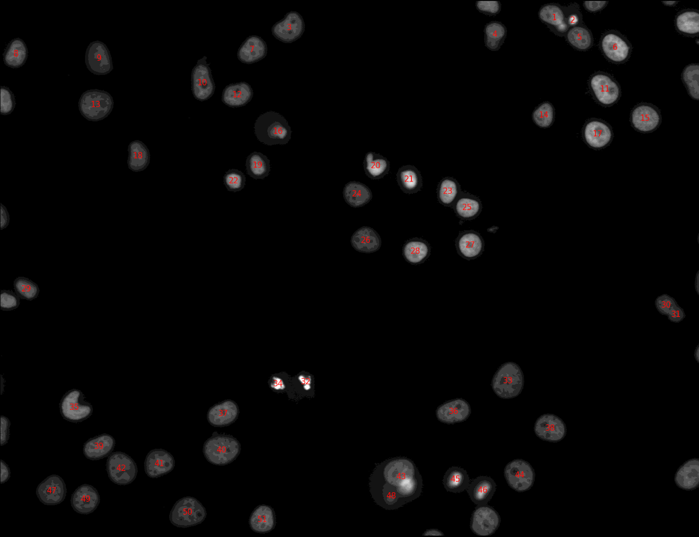

# Introduction

The nucleolus is a prominent structure of the nucleus of eukaryotic cells and is involved in ribosome biogenesis and cell cycle regulation. In DNA staining of cells, nucleoli can be identified as the absence of DNA in nuclei ([Fig. 1](#figure-1)).
Phenotypes caused by reduced gene function are widely used to elucidate gene function and image-based RNA interference (RNAi) screens are routinely used to find and characterize genes involved in a particular biological process. While screens typically focus on one biological process of interest, the molecular markers used can also inform on other processes. Re-using published screens image data can then be a cost-effective alternative to performing new experiments.
In particular, regardless of the targeted biological process, many screens include a DNA label and therefore can also reveal the effect of gene knock-downs on nucleoli.

{: width="50%"}

In this tutorial, we will analyse DNA channel images of publicly available RNAi screens to extract numerical descriptors (i.e. features) of nucleoli.
The images and associated metadata will be retrieved from the [Image Data Resource (IDR)](http://idr.openmicroscopy.org/), a repository that collects image datasets of tissues and cells.

To process and analyse the images, we will use [CellProfiler](http://cellprofiler-manual.s3.amazonaws.com/CellProfiler-3.1.9/index.html) (), a popular image analysis software. CellProfiler normally comes as a desktop application in which users can compose image analysis workflows from a series of modules. Many of these modules are now also available as tools in Galaxy.

To fully emulate the behaviour of the standalone CellProfiler in Galaxy, each image analysis workflow needs to have three parts:

1) **StartingModules**  to initialise the pipeline,

2) tools performing the analysis ([Fig. 2](#figure-2)): identification of the nuclei, nucleoli and background, together with the feature extraction,

3) **CellProfiler**  to actually run the pipeline.

In this tutorial, you will learn how to create a workflow that downloads a selection of images from the IDR, and uses CellProfiler to segment the nuclei and nucleoli. You will also learn how to extract and export features at three different levels: image, nucleus, nucleolus.

> <agenda-title></agenda-title>
>
> In this tutorial, we will cover:
>
> 1. TOC
> {:toc}
>
{: .agenda}

# Get data

> <hands-on-title>Download images from the IDR</hands-on-title>
>
> 1. If you are logged in, create a new history for this tutorial.
>
>    
> 2. **IDR Download**  with the following parameters:
>    - *"How would you like to specify the IDs of images to download?"*: `As text (comma-separated list of IDs or a valid IDR link)`
>    -  *"Image IDs to download"*: `http://idr.openmicroscopy.org/webclient/?show=image-295900|image-295905|image-295910|image-295918|image-295928|image-295934`
>    -  *"Name of the channel to download"*: `Cy3`
>    -  *"z-plane of images to download"*: `0`
>    -  *"Image frame to download"*: `0`
>    -  *"Limit the download to a selected region of the image?"*: `No, download the entire image plane`
>    -  *"Skip failed retrievals?"*: `Yes`
>    -  *"Download images in a tarball?"*: `Yes`
>
>
>
>    > <tip-title>Get the IDR link from a manual selection of images</tip-title>
>    >
>    > To get the valid IDR link, go to the [dataset of interest in the IDR](http://idr.openmicroscopy.org/webclient/?show=screen-102) and select in the preview of a plate a few images ((figure [Fig. 3](#figure-3) - 1)). Once you see them at the bottom of the page (figure [Fig. 3](#figure-3) - 2), select them again and click the link button in the top-right corner of the right panel (figure [Fig. 3](#figure-3) - 3).
>    >
>    > 
>    {: .tip}
>
>    > <comment-title></comment-title>
>    >
>    > **IMPORTANT:** When the number of images to download is high, it is strongly recommended to enable the option *“Download images in a tarball?”* in order to improve the performance.
>    {: .comment}
>
{: .hands_on}

> <question-title></question-title>
>
> 1. Why are we taking the `Cy3` channel in the [example data](http://idr.openmicroscopy.org/webclient/img_detail/295900/)?
> 2. How could we download 100,000 images in one go?
>
> > <solution-title></solution-title>
> >
> > 1. The `Cy3` dye was used in the study to stain DNA. Since we want to segment the abscence of DNA, `Cy3` is the only channel that we need to download from the IDR.
> >
> > 2. We could upload a text file with the image ids of interest.
> >
> {: .solution}
>
{: .question}

# Start CellProfiler pipeline

The tool **Starting Modules**  comprises the first 4 modules of the standalone CellProfiler. It needs to be the first tool of a workflow because it sets the naming and metadata handling for the rest of tools.

> <hands-on-title>Specify metadata to CellProfiler</hands-on-title>
>
> 1. **Starting Modules**  with the following parameters:
>    - Images
>       - *"Do you want to filter only the images? "*: `Select the images only`
>    - Metadata
>       - *"Do you want to extract the metadata?"*: `Yes, specify metadata`
>           - *"Metadata extraction method"*: `Extract from file/folder names`
>       - *"Metadata source"*: `File name`
>       - *"Select the pattern to extract metadata from the file name"*: `field1__field2__field3__field4__field5__field6`
>       - *"Extract metadata from"*: `All images`
>    - NamesAndTypes
>       - *"Process 3D"*: `No, do not process 3D data`
>       - *"Assign a name to"*: `Give every image the same name`
>       - *"Name to assign these images"*: `DNA`
>       - *"Select the image type"*: `Grayscale image`
>           - *"Set intensity range from"*: `Image metadata`
>    - Groups
>       - *"Do you want to group your images?"*: `Yes, group the images`
>       - *"param"*: `field1`
>
>
>
>    > <comment-title></comment-title>
>    >
>    > The images downloaded from the IDR are named following the pattern: `plateName__imageID__cropX__cropY__cropWidth__cropHeight`. These fields indicate to which plate the image belongs, what is the identifier of the image in the IDR, and the 4 cropping parameters selected. In our case, the upper-left corner (X, Y) and the width and height from there. We have a total of 6 metadata values encoded in the name of the file, separated by `__`. The pattern to extract our metadata from the file name properly is, therefore: `field1__field2__field3__field4__field5__field6`. It is important to keep in mind that, for CellProfiler, our `plateName` will be called `field1`, `imageID` will be `field2`, `cropX` will be `field3`, etc. These matches are relevant for a meaningful interpretation of the features.
>    {: .comment}
>
{: .hands_on}

# Object segmentation

## Segment nuclei

Since we are interested in segmenting the nucleoli, you may wonder why we need to segment nuclei first. There are several reasons for that:

- Get the nuclei features. The intensity, size, shape, number of nucleoli per nucleus, etc. can be informative to study the nucleoli.

- Avoid the detection of wrong spots. In a first segmentation, we detect the nuclei, while in the second pass we will segment the holes (nucleoli). The holes need to fall inside the nuclei, and hence the importance of having them segmented too.

In the first step, we will identify the nuclei that are complete, meaning that they are not touching the borders of the image.

> <hands-on-title>Segment nuclei that are complete within the boundaries of the image</hands-on-title>
>
> 1. **IdentifyPrimaryObjects**  with the following parameters:
>    -  *"Select the input CellProfiler pipeline"*: `output_pipeline` (output of **Starting Modules** )
>    - *"Use advanced settings?"*: `Yes, use advanced settings`
>        - *"Enter the name of the input image (from NamesAndTypes)"*: `DNA`
>        - *"Enter the name of the primary objects to be identified"*: `Nuclei`
>        - *"Typical minimum diameter of objects, in pixel units (Min)"*: `15`
>        - *"Typical maximum diameter of objects, in pixel units (Max)"*: `200`
>        - *"Discard objects outside the diameter range?"*: `Yes`
>        - *"Discard objects touching the border of the image?"*: `Yes`
>        - *"Threshold strategy"*: `Global`
>            - *"Thresholding method"*: `Otsu`
>                - *"Two-class or three-class thresholding?"*: `Two classes`
>                - *"Threshold correction factor"*: `0.9`
>        - *"Method to distinguish clumped objects"*: `Shape`
>            - *"Method to draw dividing lines between clumped objects"*: `Shape`
>                - *"Automatically calculate size of smoothing filter for declumping?"*: `Yes`
>                - *"Automatically calculate minimum allowed distance between local maxima?"*: `Yes`
>        - *"Handling of objects if excessive number of objects identified"*: `Continue`
>
>
>
>    > <comment-title></comment-title>
>    >
>    > - The names entered to the input image and objects have to be consistent (case sensitive) with the ones in *NamesAndTypes* and the tools to follow.
>    > - The min and max diameter of the objects (`Typical minimum diameter of objects, in pixel units (Min)` and `Typical minimum diameter of objects, in pixel units (Max)`) will have to be adjusted to the resolution of the images.
>    > - The `Threshold correction factor` is used to adjust the threshold in Otsu's method. The value depends on the images and it might be useful to test several values and pick the one that works best for a particular kind of image.
>    {: .comment}
>
{: .hands_on}

> <question-title></question-title>
>
> We are using here Otsu's thresholding method for segmentation. What other segmentation options are available? What is the difference between them?
>
> > <solution-title></solution-title>
> >
> > In the *global* methods we have `Manual`, `Measurement`, `Minimum cross entropy`, `Otsu` and `Robust background`. For the *adaptive* ones we only have `Otsu`. Check the parameters' help to get more information on each one.
> >
> {: .solution}
>
{: .question}

From the previous tool, we got a group of objects (nuclei). Now, we want to export the segmentation masks as a single image to check how well the segmentation algorithm is performing. We also want to label the nuclei with their identifiers for future visual inspection of the results. The output of this step will look like (you will only get this image after running the whole workflow):

> <question-title></question-title>
>
> Why are some nuclei not labeled in the image above?
>
> > <solution-title></solution-title>
> >
> > We have indicated to the tool **IdentifyPrimaryObjects**  that the nuclei that are either outside the diameter range or touching the border should be discarded.
> >
> {: .solution}
>
{: .question}

> <hands-on-title>Mask the nuclei detected</hands-on-title>
>
> 1. **ConvertObjectsToImage**  with the following parameters:
>    -  *"Select the input CellProfiler pipeline"*: `output_pipeline` (output of **IdentifyPrimaryObjects** )
>    - *"Enter the name of the input objects you want to convert to an image"*: `Nuclei`
>    - *"Enter the name of the resulting image"*: `MaskNuclei`
>    - *"Select the color format"*: `Binary (black & white)`
>
> 2. **DisplayDataOnImage**  with the following parameters:
>    -  *"Select the input CellProfiler pipeline"*: `output_pipeline` (output of **ConvertObjectsToImage** )
>    - *"Display object or image measurements?"*: `Object`
>        - *"Enter the name of the input objects"*: `Nuclei`
>        - *"Measurement category"*: `Number`
>    - *"Enter the name of the image on which to display the measurements"*: `DNA`
>    - *"Display mode"*: `Text`
>        - *"Text color"*: `#ff0000`
>        - *"Number of decimals"*: `0`
>    - *"Name the output image that has the measurements displayed"*: `ImageDisplay`
>
> 3. **SaveImages**  with the following parameters:
>    -  *"Select the input CellProfiler pipeline"*: `output_pipeline` (output of **DisplayDataOnImage** )
>    - *"Select the type of image to save"*: `Image`
>        - *"Saved the format to save the image(s)"*: `tiff`
>    - *"Enter the name of the image to save"*: `ImageDisplay`
>    - *"Select method for constructing file names"*: `From image filename`
>        - *"Enter the image name (from NamesAndTypes) to be used as file prefix"*: `DNA`
>        - *"Append a suffix to the image file name?"*: `Yes`
>            - *"Text to append to the image name"*: `_nucleiNumbers`
>    - *"Overwrite existing files without warning?"*: `Yes`
>
>    > <comment-title></comment-title>
>    >
>    > The `Text color` parameter can be any of your choice, the hexa code is not really relevant. The only consideration is that it needs to be visible on top of the nuclei.
>    {: .comment}
{: .hands_on}

## Segment nucleoli

The nucleoli are lacking intensity in the DNA staining and therefore, we need to enhance the black holes before masking.

> <hands-on-title>Detect and mask dark holes</hands-on-title>
>
> 1. **EnhanceOrSuppressFeatures**  with the following parameters:
>    -  *"Select the input CellProfiler pipeline"*: `output_pipeline` (output of **SaveImages** )
>    - *"Enter the name of the input image"*: `DNA`
>    - *"Enter a name for the resulting image"*: `DNAdarkholes`
>    - *"Select the operation"*: `Enhance`
>        - *"Feature type"*: `Dark holes`
>            - *"Maximum hole size"*: `15`
>
>
> 2. **MaskImage**  with the following parameters:
>    -  *"Select the input CellProfiler pipeline"*: `output_pipeline` (output of **EnhanceOrSuppressFeatures** )
>    - *"Enter the name of the input image"*: `DNAdarkholes`
>    - *"Enter the name of the resulting image"*: `MaskDNAdarkholes`
>    - *"Use objects or an image as a mask?"*: `Objects`
>        - *"Enter the name objects to mask the input image"*: `Nuclei`
>    - *"Invert the mask?"*: `No`
>
>
{: .hands_on}

Now that we have all the holes in one mask, we can segment the nucleoli as individual objects in the same way as we did with the nuclei. All the nucleoli can be then combined into one single image.

> <hands-on-title>Segment nucleoli as individual objects</hands-on-title>
>
> 1. **IdentifyPrimaryObjects**  with the following parameters:
>    -  *"Select the input CellProfiler pipeline"*: `output_pipeline` (output of **MaskImage** )
>    - *"Use advanced settings?"*: `Yes, use advanced settings`
>        - *"Enter the name of the input image (from NamesAndTypes)"*: `MaskDNAdarkholes`
>        - *"Enter the name of the primary objects to be identified"*: `Nucleoli`
>        - *"Typical minimum diameter of objects, in pixel units (Min)"*: `2`
>        - *"Typical maximum diameter of objects, in pixel units (Max)"*: `15`
>        - *"Discard objects touching the border of the image?"*: `Yes`
>        - *"Threshold strategy"*: `Global`
>            - *"Thresholding method"*: `Otsu`
>                - *"Two-class or three-class thresholding?"*: `Two classes`
>                - *"Threshold correction factor"*: `0.9`
>        - *"Method to distinguish clumped objects"*: `Shape`
>            - *"Method to draw dividing lines between clumped objects"*: `Shape`
>                - *"Automatically calculate size of smoothing filter for declumping?"*: `Yes`
>                - *"Automatically calculate minimum allowed distance between local maxima?"*: `Yes`
>        - *"Handling of objects if excessive number of objects identified"*: `Continue`
>
>
> 2. **ConvertObjectsToImage**  with the following parameters:
>    -  *"Select the input CellProfiler pipeline"*: `output_pipeline` (output of **IdentifyPrimaryObjects** )
>    - *"Enter the name of the input objects you want to convert to an image"*: `Nucleoli`
>    - *"Enter the name of the resulting image"*: `MaskNucleoli`
>    - *"Select the color format"*: `Binary (black & white)`
>
>
{: .hands_on}

## Combine segmentation masks

We have now one segmentation mask per image with all the nuclei detected, `MaskNuclei`, and another one for the nucleoli, `MaskNucleoli`. These are binary masks in which the background is black and the objects detected are white. We would like to check whether both segmentation steps went well. That could be achieved by combining both of them (using different colors) into one image. Here, we are converting the nucleus mask to blue and the nucleoli to magenta. The outcome that you will obtain after the execution of the workflow will look like:

 and nucleoli (magenta).")

> <hands-on-title>Convert and save the nuclei and nucleoli masks</hands-on-title>
>
> 1. **GrayToColor**  with the following parameters:
>    -  *"Select the input CellProfiler pipeline"*: `output_pipeline` (output of **ConvertObjectsToImage** )
>    - *"Enter the name of the resulting image"*: `CombinedMask`
>    - *"Select a color scheme"*: `RGB`
>        - *"Enter the name of the image to be colored red"*: `MaskNucleoli`
>        - *"Relative weight for the red image"*: `0.8`
>        - *"Enter the name of the image to be colored blue"*: `MaskNuclei`
>        - *"Relative weight for the blue image"*: `0.5`
>
>
> 2. **SaveImages**  with the following parameters:
>    -  *"Select the input CellProfiler pipeline"*: `output_pipeline` (output of **GrayToColor** )
>    - *"Select the type of image to save"*: `Image`
>        - *"Saved the format to save the image(s)"*: `tiff`
>    - *"Enter the name of the image to save"*: `CombinedMask`
>    - *"Select method for constructing file names"*: `From image filename`
>        - *"Enter the image name (from NamesAndTypes) to be used as file prefix"*: `DNA`
>        - *"Append a suffix to the image file name?"*: `Yes`
>            - *"Text to append to the image name"*: `_combinedMask`
>    - *"Overwrite existing files without warning?"*: `Yes`
>
>
>    > <comment-title></comment-title>
>    >
>    > - You can pick any other color of your choice, as long as the contrast is good enough to distinguish both objects.
>    > - We are saving here a tiff image but any other format of your choice would work too.
>    {: .comment}
>
>
{: .hands_on}

# Background extraction

The background extraction is useful for quality control. For instance, in a high-exposed or low-contrast image, the nuclei will not be very different from the background and that may lead to the wrong segmentation.

To extract the background, we first need to get the foreground and subtract it from the original image. We already have the nuclei mask, however, we excluded incomplete nuclei, i.e., those touching the borders or those which sizes are outside the specified range. This means that the mask is not covering all the nuclei and we need to get rid of the constraints to get the complete foreground. At this stage, we want to detect everything with a certain intensity (foreground) and subtract it from the complete image to get the background.

## Identify the foreground

> <hands-on-title>Segment all nuclei</hands-on-title>
>
> 1. **IdentifyPrimaryObjects**  with the following parameters:
>    -  *"Select the input CellProfiler pipeline"*: `output_pipeline` (output of **SaveImages** )
>    - *"Use advanced settings?"*: `Yes, use advanced settings`
>        - *"Enter the name of the input image (from NamesAndTypes)"*: `DNA`
>        - *"Enter the name of the primary objects to be identified"*: `NucleiIncludingTouchingBorders`
>        - *"Typical minimum diameter of objects, in pixel units (Min)"*: `15`
>        - *"Typical maximum diameter of objects, in pixel units (Max)"*: `200`
>        - *"Discard objects outside the diameter range?"*: `No`
>        - *"Discard objects touching the border of the image?"*: `No`
>        - *"Threshold strategy"*: `Global`
>            - *"Thresholding method"*: `Otsu`
>                - *"Two-class or three-class thresholding?"*: `Two classes`
>                - *"Threshold correction factor"*: `0.9`
>        - *"Method to distinguish clumped objects"*: `Shape`
>            - *"Method to draw dividing lines between clumped objects"*: `Shape`
>                - *"Automatically calculate size of smoothing filter for declumping?"*: `Yes`
>                - *"Automatically calculate minimum allowed distance between local maxima?"*: `Yes`
>        - *"Handling of objects if excessive number of objects identified"*: `Continue`
>
>
> 2. **ConvertObjectsToImage**  with the following parameters:
>    -  *"Select the input CellProfiler pipeline"*: `output_pipeline` (output of **IdentifyPrimaryObjects** )
>    - *"Enter the name of the input objects you want to convert to an image"*: `NucleiIncludingTouchingBorders`
>    - *"Enter the name of the resulting image"*: `Image_NucleiIncludingTouchingBorders`
>    - *"Select the color format"*: `Binary (black & white)`
>
>
{: .hands_on}

## Remove the foreground from the original image

> <hands-on-title>Subtract the foreground from the original image</hands-on-title>
>
> **ImageMath**  with the following parameters:
>    -  *"Select the input CellProfiler pipeline"*: `output_pipeline` (output of **ConvertObjectsToImage** )
>    - *"Enter a name for the resulting image"*: `BG`
>    - *"Operation"*: `Subtract`
>        - In *"First Image"*:
>            - *"Image or measurement?"*: `Image`
>                - *"Enter the name of the first image"*: `DNA`
>        - In *"Second Image"*:
>            - *"Image or measurement?"*: `Image`
>                - *"Enter the name of the second image"*: `Image_NucleiIncludingTouchingBorders`
>    - *"Ignore the image masks?"*: `No`
>
>
{: .hands_on}

# Feature extraction

Now that we have the objects of interest segmented and the background extracted, we can start measuring parameters on them. In particular it is relevant to:

- measure the granularity, texture and intensity of the nuclei and original image,
- measure the intensity of the original image, the background and foreground,
- measure the size and shape of nuclei and nucleoli,
- assess the quality of the original image,
- measure the area ocuppied by nuclei and nucleoli.

A step that requires special attention is the relationship nucleolus-nucleus. This is useful to compute statistics on the number of nucleoli by nucleus.

> <comment-title></comment-title>
>
> The order in which the tools in this section are chained is not relevant for the outcome.
{: .comment}

## Measure the granularity, texture, intensity, size and shape

> <hands-on-title>Measure the granularity, texture, intensity, size and shape</hands-on-title>
>
> 1. **MeasureGranularity**  with the following parameters:
>    -  *"Select the input CellProfiler pipeline"*: `output_pipeline` (output of **ImageMath** )
>    - In *"new image"*:
>        -  *"Insert new image"*
>            - *"Enter the name of a greyscale image to measure"*: `DNA`
>
>
> 2. **MeasureTexture**  with the following parameters:
>    -  *"Select the input CellProfiler pipeline"*: `output_pipeline` (output of **MeasureGranularity** )
>    - In *"new image"*:
>        -  *"Insert new image"*
>            - *"Enter the name of an image to measure"*: `DNA`
>    - *"Measure images or objects?"*: `Objects`
>        - In *"new object"*:
>            -  *"Insert new object"*
>                - *"Enter the names of the objects to measure"*: `Nuclei`
>
>
> 3. **MeasureObjectIntensity**  with the following parameters:
>    -  *"Select the input CellProfiler pipeline"*: `output_pipeline` (output of **MeasureTexture** )
>    - In *"new image"*:
>        -  *"Insert new image"*
>            - *"Enter the name of an image to measure"*: `DNA`
>    - In *"new object"*:
>        -  *"Insert new object"*
>            - *"Enter the name of the objects to measure"*: `Nuclei`
>
>
> 4. **MeasureObjectSizeShape**  with the following parameters:
>    -  *"Select the input CellProfiler pipeline"*: `output_pipeline` (output of **MeasureObjectIntensity** )
>    - In *"new object"*:
>        -  *"Insert new object"*
>            - *"Enter the name of the object to measure"*: `Nuclei`
>        -  *"Insert new object"*
>            - *"Enter the name of the object to measure"*: `Nucleoli`
>
>
{: .hands_on}

> <question-title></question-title>
>
> Why are we measuring the granularity, texture and intensity of the original image and the nuclei only?
>
> > <solution-title></solution-title>
> >
> > The nucleoli was not stained in the DNA channel and hence, the granularity, texture and intensity are constant values.
> >
> {: .solution}
>
{: .question}

## Relate nucleoli to their parent nucleus

It might be relevant to compute some statistics on the number of nucleoli inside each nucleus. CellProfiler has a very interesting module to relate both objects, in which each one of the nucleoli is assigned an identifier and linked to the identifier of its parent nucleus.

> <hands-on-title>Relate nucleoli to their parent nucleus</hands-on-title>
>
> 1. **RelateObjects**  with the following parameters:
>    -  *"Select the input CellProfiler pipeline"*: `output_pipeline` (output of **MeasureObjectSizeShape** )
>    - *"Parent objects"*: `Nuclei`
>    - *"Child objects"*: `Nucleoli`
>    - *"Calculate child-parent distances?"*: `Both`
>        - *"Calculate distances to other parents?"*: `No`
>    - *"Do you want to save the children with parents as a new object set?"*: `Yes`
>
>
{: .hands_on}

## Measure the image quality-related parameters

In this section, we will measure the image quality, the area occupied by the nuclei and nucleoli in the original image and the intensity of the foreground and background.

> <hands-on-title>Measure the image quality</hands-on-title>
>
> 1. **MeasureImageQuality**  with the following parameters:
>    -  *"Select the input CellProfiler pipeline"*: `output_pipeline` (output of **RelateObjects** )
>    - *"Calculate blur metrics?"*: `Yes`
>    - *"Calculate thresholds?"*: `Yes`
>        - *"Use all thresholding methods?"*: `No`
>            - In *"new threshold method"*:
>                -  *"Insert new threshold method"*
>                    - *"Select a thresholding method"*: `Otsu`
>                        - *"Two-class or three-class thresholding?"*: `Two classes`
>
>
> 2. **MeasureImageAreaOccupied**  with the following parameters:
>    -  *"Select the input CellProfiler pipeline"*: `output_pipeline` (output of **MeasureImageQuality** )
>    - In *"new area"*:
>        -  *"Insert new area"*
>            - *"Measure the area occupied in a binary image, or in objects?"*: `Objects`
>                - *"Enter the name of the objects to measure"*: `Nuclei`
>        -  *"Insert new area"*
>            - *"Measure the area occupied in a binary image, or in objects?"*: `Objects`
>                - *"Enter the name of the objects to measure"*: `Nucleoli`
>
>
> 3. **MeasureImageIntensity**  with the following parameters:
>    -  *"Select the input CellProfiler pipeline"*: `output_pipeline` (output of **MeasureImageAreaOccupied** )
>    - In *"new image"*:
>        -  *"Insert new image"*
>            - *"Enter the name of the image to measure"*: `DNA`
>            - *"Measure the intensity only from areas enclosed by objects?"*: `No`
>        -  *"Insert new image"*
>            - *"Enter the name of the image to measure"*: `DNA`
>            - *"Measure the intensity only from areas enclosed by objects?"*: `Yes`
>                - *"Enter the name of the objects that the intensity will be aggregated within"*: `Nuclei`
>        -  *"Insert new image"*
>            - *"Enter the name of the image to measure"*: `BG`
>            - *"Measure the intensity only from areas enclosed by objects?"*: `No`
>
>
{: .hands_on}

> <question-title></question-title>
>
> In step 3, we are measuring the area occupied by objects for the DNA twice. Why is that?
>
> > <solution-title></solution-title>
> >
> > We want to have the global intensity of the image, so the parameter *"Measure the intensity only from areas enclosed by objects?"* has to be set to `No`. However, we also want to obtain the intensity of the foreground, so only the parts of the images that are enclosed by nuclei.
> >
> {: .solution}
>
{: .question}

## Export the features to a CSV

All the parameters that we have measured related to the images and objects need to be exported to a file for each one of 6 example images analysed.

> <hands-on-title>Export features</hands-on-title>
>
> **ExportToSpreadsheet**  with the following parameters:
>    -  *"Select the input CellProfiler pipeline"*: `output_pipeline` (output of **MeasureImageIntensity** )
>    - *"Select the column delimiter"*: `Tab`
>    - *"Add a prefix to file names?"*: `Do not add prefix to the file name`
>    - *"Create a GenePattern GCT file?"*: `No`
>    - *"Export all measurement types?"*: `Yes`
>
>
>
{: .hands_on}

# Run the CellProfiler pipeline

All the steps in our workflow (except for the **IDR download** ) have been passing through an `output_pipeline` as a parameter. This was the way to assemble all the modules from CellProfiler, now we can run all of them together!

> <hands-on-title>Run CellProfiler pipeline</hands-on-title>
>
> **CellProfiler**  with the following parameters:
>    -  *"Pipeline file"*: `output_pipeline` (output of **ExportToSpreadsheet** )
>    - *"Are the input images packed into a tar archive?"*: `Yes`
>        -  *"A tarball of images"*: `output_tar` (output of **IDR Download** )
>    - *"Detailed logging file?"*: `Yes`
>
>
>
>    > <comment-title></comment-title>
>    >
>    > This is the only time-consuming step of the workflow, as it needs to perform the whole analysis in the input dataset.
>    {: .comment}
>
{: .hands_on}

# Conclusion

In this tutorial, you have downloaded images from a public image repository into your Galaxy history. After that, you have built and run a typical image analysis pipeline, composed of segmentation of several objects and feature extraction. As an outcome, you got plenty of features to analyse! And some masks to check that the segmentation algorithms worked as expected. Now you are ready to perform your biological data analysis!
