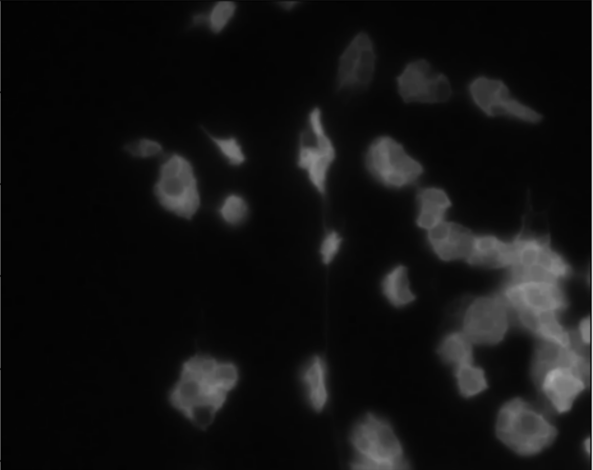

# Introduction

<!-- This is a comment. -->

Voronoi segmentation is a technique used to divide an image or space into regions
based on the proximity to a set of defined points, called seeds or sites. Each 
region, known as a Voronoi cell, contains all locations that are closer to its 
seed than to any other. This approach is especially useful when analyzing spatial 
relationships, as it reveals how different areas relate in terms of distance and 
distribution. Voronoi segmentation is widely applicable for tasks where it's 
important to understand the proximity or neighborhood structure of points, such 
as organizing space, studying clustering patterns, or identifying regions of 
influence around each point in various types of data.


## Voronoi Segmentation for bioimage analysis

In bioimage analysis, Voronoi segmentation is a valuable tool for studying the 
spatial organization of cells, tissues, or other biological structures within an 
image. By dividing an image into regions around each identified cell or structure, 
Voronoi segmentation enables researchers to analyze how different cell types are 
distributed, measure distances between cells, and examine clustering patterns. This 
can provide insights into cellular interactions, tissue organization, and functional 
relationships within biological samples, such as identifying the proximity of immune 
cells to tumor cells or mapping neuron distributions within brain tissue.

## Voronoi Segmentation for Earth Observation

In Earth observation, Voronoi segmentation is used to analyze spatial patterns and distributions in satellite or aerial images. By creating regions based on proximity to specific points, such as cities, vegetation clusters, or monitoring stations, Voronoi segmentation helps in studying how features are organized across a landscape. This method is particularly useful for mapping resource distribution, analyzing urban growth, monitoring vegetation patterns, or assessing land use changes. For instance, it can help divide an area into regions of influence around weather stations or identify how different land cover types interact spatially, aiding in environmental monitoring and planning.


> <agenda-title></agenda-title>
>
> In this tutorial, we will cover:
>
> 1. TOC
> {:toc}
>
{: .agenda}

# Get data


## Bioimage data

This tutorial will use an image dataset from the [BioImage archive](https://www.ebi.ac.uk/bioimage-archive/). This dataset is specifically prepared for training nuclear segmentation. 

The images are saved in the BioImage archive and can be uploaded to the Galaxy server with the corresponding BioImage Archive retrieval tool.



> <hands-on-title>Data upload with Bioimage Archive Tool</hands-on-title>
>
> 1. Create a new history for this tutorial.
>    When you log in for the first time, an empty, unnamed history is created by default. You can simply rename it.
> 
>    
>
> 2.  with the following parameters:
>    -  *"Storage mode"*: `fire` (Storage mode is always fire)
>    - *"The path of accession"*: `S-BIAD/634/S-BIAD634`
>    > <comment-title> BioImage Archive </comment-title>
>    >
>    > This tool will upload all the files into your Galaxy history which can be very inconvenient when you have large dataset. 
>    > In that case, you can delete data files you do not plan to use for your analysis.
>    {: .comment}
>
> 3. Rename  the file `Neuroblastoma_0.tif` to `input_image.tif`  
> 4. Check that the datatype
>
>    
>
> 5. Add to each database a tag corresponding to `input`
>
>    
>
>
{: .hands_on}

## Earth Observation (EO) data


> <hands-on-title> EO Data Upload </hands-on-title>
>
> 1. Create a new history for this tutorial.
>    When you log in for the first time, an empty, unnamed history is created by default. You can simply rename it.
> 
>    
>
> 2. Import the files from [Zenodo]({{ page.zenodo_link }}) or from
>    the shared data library (`GTN - Material` -> `{{ page.topic_name }}`
>     -> `{{ page.title }}`):
>
>    - **Important:** If setting the type to 'Auto-detect', make sure that after upload, the datatype is set to tiff.
>
>    ```
>    https://zenodo.org/records/5494629/files/Sep_2014_RGB_602500_646500.tif
>    ```
>
>    
>
>    
>
> 3. Rename  the file `Sep_2014_RGB_602500_646500.tif` to `input_image.tif`
> 4. Check that the datatype
>
>    
>
> 5. Add to each database a tag corresponding to `input`
>
>    
>
{: .hands_on}

# Data preparation

## Sub-step with **Convert image format**

> <hands-on-title> Select channel for Voronoi Segmentation </hands-on-title>
>
> 1.  with the following parameters:
>    -  *"Input Image"*: `output` (Input dataset)
>    - *"Extract series"*: `All series`
>    - *"Extract timepoint"*: `All timepoints`
>    - *"Extract channel"*: `Extract channel`
>        - *"Channel id"*: `{'id': 2, 'output_name': 'output'}`
>    - *"Extract z-slice"*: `All z-slices`
>    - *"Extract range"*: `All images`
>    - *"Extract crop"*: `Full image`
>    - *"Tile image"*: `No tiling`
>    - *"Pyramid image"*: `No Pyramid`
>
>    > <comment-title> Why do we need to select a single channel? </comment-title>
>    >
>    > Select a single channel from the input image. Note that some tools number channels starting from 1, while others start from 0.
>    {: .comment}
>
{: .hands_on}

## Sub-step with **Convert image format**

> <hands-on-title> Task description </hands-on-title>
>
> 1.  with the following parameters:
>    -  *"Input Image"*: `output` (Input dataset)
>    - *"Extract series"*: `All series`
>    - *"Extract timepoint"*: `All timepoints`
>    - *"Extract channel"*: `Extract channel`
>        - *"Channel id"*: `{'id': 2, 'output_name': 'output'}`
>    - *"Extract z-slice"*: `All z-slices`
>    - *"Extract range"*: `All images`
>    - *"Extract crop"*: `Full image`
>    - *"Tile image"*: `No tiling`
>    - *"Pyramid image"*: `No Pyramid`
>
>    ***TODO***: *Check parameter descriptions*
>
>    ***TODO***: *Consider adding a comment or tip box*
>
>    > <comment-title> short description </comment-title>
>    >
>    > A comment about the tool or something else. This box can also be in the main text
>    {: .comment}
>
{: .hands_on}

***TODO***: *Consider adding a question to test the learners understanding of the previous exercise*

> <question-title></question-title>
>
> 1. Question1?
> 2. Question2?
>
> > <solution-title></solution-title>
> >
> > 1. Answer for question1
> > 2. Answer for question2
> >
> {: .solution}
>
{: .question}

## Sub-step with **Convert binary image to label map**

> <hands-on-title> Task description </hands-on-title>
>
> 1.  with the following parameters:
>    -  *"Binary image"*: `output` (Input dataset)
>    - *"Mode"*: `Connected component analysis`
>
>    ***TODO***: *Check parameter descriptions*
>
>    ***TODO***: *Consider adding a comment or tip box*
>
>    > <comment-title> short description </comment-title>
>    >
>    > A comment about the tool or something else. This box can also be in the main text
>    {: .comment}
>
{: .hands_on}

***TODO***: *Consider adding a question to test the learners understanding of the previous exercise*

> <question-title></question-title>
>
> 1. Question1?
> 2. Question2?
>
> > <solution-title></solution-title>
> >
> > 1. Answer for question1
> > 2. Answer for question2
> >
> {: .solution}
>
{: .question}

## Sub-step with **Filter 2-D image**

> <hands-on-title> Task description </hands-on-title>
>
> 1.  with the following parameters:
>    -  *"Input image"*: `output` (output of **Convert image format** )
>    - *"Filter type"*: `Gaussian`
>
>    ***TODO***: *Check parameter descriptions*
>
>    ***TODO***: *Consider adding a comment or tip box*
>
>    > <comment-title> short description </comment-title>
>    >
>    > A comment about the tool or something else. This box can also be in the main text
>    {: .comment}
>
{: .hands_on}

***TODO***: *Consider adding a question to test the learners understanding of the previous exercise*

> <question-title></question-title>
>
> 1. Question1?
> 2. Question2?
>
> > <solution-title></solution-title>
> >
> > 1. Answer for question1
> > 2. Answer for question2
> >
> {: .solution}
>
{: .question}

## Sub-step with **Compute Voronoi tessellation**

> <hands-on-title> Task description </hands-on-title>
>
> 1.  with the following parameters:
>    -  *"Input image"*: `output` (output of **Convert binary image to label map** )
>
>    ***TODO***: *Check parameter descriptions*
>
>    ***TODO***: *Consider adding a comment or tip box*
>
>    > <comment-title> short description </comment-title>
>    >
>    > A comment about the tool or something else. This box can also be in the main text
>    {: .comment}
>
{: .hands_on}

***TODO***: *Consider adding a question to test the learners understanding of the previous exercise*

> <question-title></question-title>
>
> 1. Question1?
> 2. Question2?
>
> > <solution-title></solution-title>
> >
> > 1. Answer for question1
> > 2. Answer for question2
> >
> {: .solution}
>
{: .question}

## Sub-step with **Threshold image**

> <hands-on-title> Task description </hands-on-title>
>
> 1.  with the following parameters:
>    -  *"Input image"*: `output` (output of **Filter 2-D image** )
>    - *"Thresholding method"*: `Manual`
>        - *"Threshold value"*: `{'id': 3, 'output_name': 'output'}`
>
>    ***TODO***: *Check parameter descriptions*
>
>    ***TODO***: *Consider adding a comment or tip box*
>
>    > <comment-title> short description </comment-title>
>    >
>    > A comment about the tool or something else. This box can also be in the main text
>    {: .comment}
>
{: .hands_on}

***TODO***: *Consider adding a question to test the learners understanding of the previous exercise*

> <question-title></question-title>
>
> 1. Question1?
> 2. Question2?
>
> > <solution-title></solution-title>
> >
> > 1. Answer for question1
> > 2. Answer for question2
> >
> {: .solution}
>
{: .question}

## Sub-step with **Process images using arithmetic expressions**

> <hands-on-title> Task description </hands-on-title>
>
> 1.  with the following parameters:
>    - *"Expression"*: `tessellation * (mask / 255) * (1 - seeds / 255)`
>    - In *"Input images"*:
>        -  *"Insert Input images"*
>            -  *"Image"*: `result` (output of **Compute Voronoi tessellation** )
>            - *"Variable for representation of the image within the expression"*: `tessellation`
>        -  *"Insert Input images"*
>            -  *"Image"*: `output` (Input dataset)
>            - *"Variable for representation of the image within the expression"*: `seeds`
>        -  *"Insert Input images"*
>            -  *"Image"*: `output` (output of **Threshold image** )
>            - *"Variable for representation of the image within the expression"*: `mask`
>
>    ***TODO***: *Check parameter descriptions*
>
>    ***TODO***: *Consider adding a comment or tip box*
>
>    > <comment-title> short description </comment-title>
>    >
>    > A comment about the tool or something else. This box can also be in the main text
>    {: .comment}
>
{: .hands_on}

***TODO***: *Consider adding a question to test the learners understanding of the previous exercise*

> <question-title></question-title>
>
> 1. Question1?
> 2. Question2?
>
> > <solution-title></solution-title>
> >
> > 1. Answer for question1
> > 2. Answer for question2
> >
> {: .solution}
>
{: .question}

## Sub-step with **Colorize label map**

> <hands-on-title> Task description </hands-on-title>
>
> 1.  with the following parameters:
>    -  *"Input image (label map)"*: `result` (output of **Process images using arithmetic expressions** )
>
>    ***TODO***: *Check parameter descriptions*
>
>    ***TODO***: *Consider adding a comment or tip box*
>
>    > <comment-title> short description </comment-title>
>    >
>    > A comment about the tool or something else. This box can also be in the main text
>    {: .comment}
>
{: .hands_on}

***TODO***: *Consider adding a question to test the learners understanding of the previous exercise*

> <question-title></question-title>
>
> 1. Question1?
> 2. Question2?
>
> > <solution-title></solution-title>
> >
> > 1. Answer for question1
> > 2. Answer for question2
> >
> {: .solution}
>
{: .question}


## Re-arrange

To create the template, each step of the workflow had its own subsection.

***TODO***: *Re-arrange the generated subsections into sections or other subsections.
Consider merging some hands-on boxes to have a meaningful flow of the analyses*

# Conclusion

Sum up the tutorial and the key takeaways here. We encourage adding an overview image of the
pipeline used.


