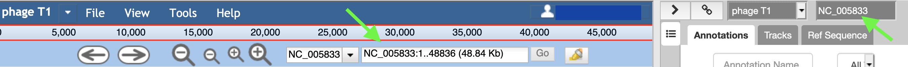

# Apollo FAQ

General introduction about the topic and then an introduction of the tutorial (the questions and the objectives). It is nice also to have a scheme to sum up the pipeline used during the tutorial. The idea is to give to trainees insight into the content of the tutorial and the (theoretical and technical) key concepts they will learn.

> ###  My gene names/edits won’t save!
>    > ###  Solution
>    > * The gene name has a special character; *remove it.*
>    > * You haven’t refreshed the page or logged in recently; *refresh the page.*
> {: .solution}
{: .question}

> ###  I cannot drag the boundaries of a gene.
>    > ###  Solution
>    > * The gene as called from the Sixpack evidence track. 
> {: .solution}
{: .question}

> ###  Upon logging in to Apollo, the following error message appears.
>    > 
>    >
>    > ###  Solution
>    > * This error message occurs because a FASTA file with a name that did not match the organism in question was applied in a JBrowse job in Galaxy and applied to the organism in Apollo. You can see this in the following images as a mismatch between the names in the Apollo window (ID fields should match). 
>    > 
>    > 
>    >
>    > **Suggested Action:**
>    > * Generate a fresh JBrowse instance to apply to Apollo. **Caution: this will erase your evidence tracks, but not the annotations in the user-created annotations track.** Do this by running the [JBrowse tool](https://cpt.tamu.edu/galaxy/root?tool_id=jbrowse-cpt), selecting NEW JBrowse instance and pointing it to a fasta sequence with the correct name to match the sequence ID of your Apollo organism (use the [rename tool](https://cpt.tamu.edu/galaxy/root?tool_id=edu.tamu.cpt.seq.rename) if needed, but better to use a fasta generated after [retrieving Data](https://cpt.tamu.edu/galaxy/root?tool_id=edu.tamu.cpt2.webapollo.export) from Apollo). Finally, run the Create or [Update Organism tool](https://cpt.tamu.edu/galaxy/root?tool_id=edu.tamu.cpt2.webapollo.create_or_update) and apply the new JBrowse dataset. 
> {: .solution}
{: .question}
