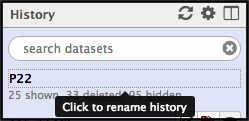
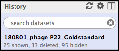
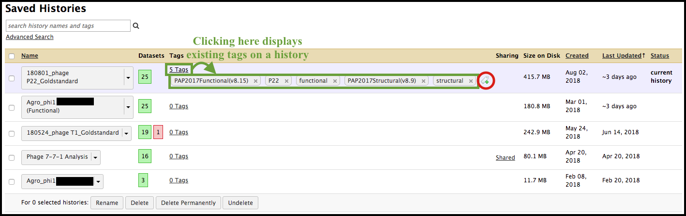
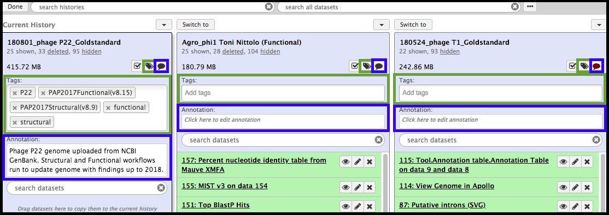
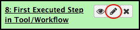

> ### Agenda
>
> 1. Rationale - Reproducible Records
> 2. Minimum Essential Practices
>    > * Histories
>    >    > * History Names
>    >    > * History Tags and Annotation Notes
> 3. How Implementing These Practices is Helpful
>
{: .agenda}

# Rationale -  Reproducible Records

An important tenet of science is to maintain reproducible and traceable records using a standard. This philosophy is applicable to both lab notebooks *and* Galaxy histories. It is tempting to think that, because of the presence of a ‘history’ in Galaxy, the program has adequately maintained the user’s records and no further steps are needed to document research activities/analyses performed within the Galaxy suite. This is **incorrect.** Here, strongly recommended practices are shown to make data in Galaxy more accessible to both the current user and futures users.

# Minimum Essential Practices

Galaxy enables the editing of *both* histories and individual datasets, as well as the ability to add tags and/or annotation notes.

## Histories
------

### History names

The name above does not tell much about what is contained in the history, aside from the organism being worked on (phage P22). Clicking on the name will allow for editing. Give the history a descriptive name that tells of the main analyses, datasets, or goals for the work done in this history.

The name here was changed to display the date the history was created, the organism, and the goal of the work done in this history - a “gold standard” reference genome for P22.

### History Tags and Annotation Notes

Tags 
and annotation notes  can be added by clicking on their respective icons at the top of the history panel, below the name. This could help a new user sort through data that belongs to someone else.

> ###  Suggested History Tags and Annotations
> * **Tags**: phage assembly, phage name, workflow used, tool development, workflow creation; general keywords that are associated with the analysis done in that history.
> * **Annotation**: Instead of using keywords, provide a summary of what was performed/completed in that history. Include numbers for key datasets someone else might look for when accessing this history (e.g. final node FASTA extraction, BLASTdb made, etc.).
{: .tip}

Name the history according to the analysis that has been or will be performed there. Add tags and an annotation summary when the history is created. Update those fields as needed. After initially filling them in, they can be collapsed out of view of maximize space in the history panel.

> ###  Tagging in Saved Histories
> Clicking on the  icon opens a drop-down menu containing History Actions. Under *History Lists* is a **Saved Histories** option.
>
> 
>
> All of the user’s histories will appear as condensed lines in a list in the main Galaxy interface.
>
> 
>
> In the case of a history with existing tags, clicking on the  (circled in red above) will allow the addition of new tags and removal of old tags. For histories without tags, clicking on the *0 Tags* will allow for addition of tags.
>
> 
> Histories displayed in this view can be searched or sorted using tags alone. 
{: .hands_on}

> ###  Edit in  the *View all Histories* View
> Editing the name of a history and adding tags/annotations can be done in the *View all histories* view. To access this, select the  icon in the top right-hand corner of the History panel.
>
> 
>
> Clicking on the  and  icons will open the same sections seen in the History panel. Tags and annotation notes can be added here just as they were added in the History panel.
>
> 
{: .comment}

## Datasets
------

Datasets populate Galaxy histories, and more datasets are added as workflows/tools/analyses are run within each history. To help organize the history and make it interpretable later, it can be a very helpful practice to re-name datasets after they are generated. Some of the assigned names are descriptive and do not need to be changed. Additionally, Galaxy does not indicate which dataset represents the first output of an executed workflow. It is helpful to rename the first dataset output from a workflow to reflect it as such. 

For any dataset, click on the  icon next to the name of the dataset (circled below in red).

This will open editable fields for the dataset in the main Galaxy interface.

> ###  Naming Datasets
> Edit the name of the dataset to include details like: the date, name of tool or workflow that it represents, input dataset number or type, result, phage name, etc... For example:
> 
> 
>
> Clicking **Save** at the bottom of the dataset attributes will solidify the change in the appearance of the dataset in the History panel.
>
> 
{: .tip}

In the dataset attributes, both information and annotations/notes can be added that, upon clicking **Save**, will appear in the details of the dataset. However, to view the annotations made in this interface, the  icon in the expanded dataset must be clicked.

On the contrary, tags can *ONLY* be added to a dataset be selecting the  icon in the expanded dataset.

> ###  Histories are Free
> A collection of well-annotated/tagged histories can be considered akin to entries in a lab notebook for different experiments. The organization and digital tracking afforded by the Galaxy interface gives the illusion of being a lab notebook, but it requires the systematic addition of this type of metadata to *truly* function as a useful digital record. There is no consequence for using more than one history for analyses of the same phage. On the contrary, it helps with the organization of results if a new history is created for each new analysis. Clicking on the  opens  drop-down menu containing History Actions. Under *Current History* is a *Create New* option. Selecting this will immediately create the new history and have that new history set as the current history. A well-documted, long list of histories is much more useful than a short list of histories that no one can interpret.
{: .tip}

> ###  Further Documentation of History
> A text or pdf file containing any additional useful information and or documentation on the project can also be uploaded as a dataset. This further enables the user to create a useful digital record and well documented history.
{:tip}

# How Implementing These Practices is Helpful

## Assists the User in Finding Their Data
------

> * It is impossible to remember everything that the user has ever done in Galaxy; there is *nothing wrong* with this. Allowing Galaxy to store that record with some input from the user makes the life of the user easier. Additionally, it makes the work reviewable and reproducible by later users who may browse and try to publish data from past histories.

> * In the saved histories view, the user can view/sort through histories based on the tags the histories have been given.

> * In the view all histories view, the user can **search** the annotation notes that have been put onto both histories **and** datasets.

## Assists Collaborators to Use This Data
------

> * When the creator has moved on to a different lab, lab members will be able to continue using this data for research and publication. **Clear documentation is essential for future publication**.

> * When the history is shared, the user that it has been shared with can interpret the datasets and trace the path taken without the assistance of the creator of that history.

> ###  Sharing a History
> To share a history, access the Saved Histories list. Find the desired history, click on the down arrow, and select “Share or Publish.”
>
> 
>
> A new screen will appear in the main Galaxy interface with options for publishing and sharing with  user. Select the *Share with a user* button (outlined in red).
>
> 
>
> Another new screen will appear in the main interface, with a space (outlined in red) for the user to input Galaxy user e-mails to share the history with. Typing in letters will act like a search of user e-mails, yielding a list of options in a drop-down menu below. Search for the desired user.
>
> 
>
> When the desired user has been selected, click **Submit**. The publishing/sharing page will appear once more, but with the addition of a list of users that the history has been shared with. Clicking the down-arrow on that list next to the shared user’s e-mail will allow for the un-sharing of that history with that user.
>
{: .hands_on}

