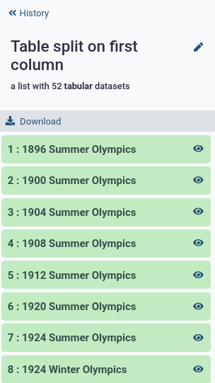

<!--
Note to contributors: feel free to add sections here to include additional data manipulation options.
Make sure each section is independent of each other, i.e. each section should start with the olympics.tsv file.
Also make sure to include many exercises (with answers) for your section!
-->


<!-- set up some variables to easily update tool versions throughout tutorial, since most tools are used many times %} -->






















# Introduction


Scientific analyses often consist of a number of tools that run one after the other, in order to go from the raw data to scientific insight. Between these specialized tools, simple data manipulation steps are often needed as a kind of "glue" between tools. For example, the output of tool A may produce a file that contains all the information needed as input for tool B, but tool B expects the columns in a different order. Or in genomic data analysis, some tools expect chromosome X to be listed as `chrX`, while others simply expect `X`. In these situations, extra data manipulation steps are needed to prepare files for input to analysis tools.

Galaxy has a large collection of tools to perform such basic data manipulation tasks, and becoming familiar with these operations will allow to perform your analysis more easily in Galaxy (and outside).


> <agenda-title></agenda-title>
>
> In this tutorial, we will cover:
>
> 1. TOC
> {:toc}
>
{: .agenda}


# Cheatsheet

Here is an overview table of the different data manipulations in this tutorial, with links to the tools in Galaxy.

If you've opened this tutorial via the  icon in Galaxy (top menu bar), you can click on the tool names in the last column to quickly open them in Galaxy and start using them on your own!

<!-- GTN:IGNORE:006 -->

| Operation              | Description                        | Galaxy Tool    |
|------------------------|------------------------------------|----------------|
| Convert format         | Change the file format             |  Edit attributes |
| Word count             | Count the number of lines, words and characters in a file |  |
| Sort on a column       | Change the order of the rows based on values in one or more columns |  |
| Filter                 | Remove rows based on values in one or more columns | |
| Counting               | Count occurrences of values in a column   |  ,  |
| Group on a column      | And perform simple operations (count, mean, min, max etc) |  ,  |
| Compute on rows        | to derive new column values from existing ones |  |
| Find and Replace       | in a specific column               | |
| Find and Replace       | on every line                      | |
| Join two Datasets      | side by side on a specified field  |  |
| Concatenate datasets   | one after the other                |  |
| Remove Beginning       | Good for removing header lines     |  |
| Select First lines     | Good for finding top 10s or saving header lines |  |
| Cut Columns            | By header name                     | |
| Cut Columns            | By column number                   | , |
| Paste                  | Two files side by side             |  |
| Split file             | Based on values of a column        |  |
| Unique                 | Remove duplicate rows              |  |

**TIP: Adding tools to your Favourites:** If you find yourself frequently using the same tool often but struggle to find it back in the long list of tools, you can **star** your favourite tools in Galaxy!




In this tutorial, these tools are explained in more detail, and we provide some exercises for you to practice.


# Background

In this tutorial, we will use as our dataset a table with results from the Olympics, from the games in Athens in 1896 until Tokyo in 2020. The objective is to familiarize you with a large number of the most important data manipulation tools in Galaxy. Much like the Olympics, there are many different disciplines (types of operations), and for each operation there are often multiple techniques (tools) available to athletes (data analysts, you) that are great for achieving the goal.


We will show you many of these commonly needed data manipulation operations, and some examples of how to perform them in Galaxy. We also provide many exercises so that you can train your skills and become a data manipulation Olympian!


# Upload Data

Before we can do any manipulation, we will need some data. Let's upload our table with Olympics results now.

> <hands-on-title>Get data</hands-on-title>
>
> 1.  the file `olympics.tsv` via link
>
>    ```
>    {{page.zenodo_link}}/files/olympics.tsv
>    ```
>
>    
>
> 2. **Expand** on the item in your history to see some metadata and a short preview of the contents.
>
> 3. **View**  the dataset by clicking on the eye icon.
>
>    > <question-title></question-title>
>    >
>    > 1. What is the format of the file?
>    > 2. What does each row represent?
>    > 3. How many lines are in the file? (Hint: )
>    > 4. How many columns?
>    >
>    > > <solution-title>Answer</solution-title>
>    > >
>    > > 1. When you expand the `olympics.tsv` dataset in your history (see also screenshot below), you will see `format: tabular`, this is another term for a tab-separated (`tsv`) file.
>    > > 2. Each row represents an athlete's participation in an event. If an athlete competes in multiple events, there is a line for each event.
>    > > 3. 234,523. Look at the expanded view in your history, this tells us there are ~250,000 rows in the dataset. We can get the exact number using the   tool.
>    > > 4. There are 17 columns in this file. There are multiple ways to find this answer:
>    > >    - Count the columns manually (only doable for small files)
>    > >    - In the expanded view, scroll sideways on the dataset preview, at the top the columns are numbered
>    > >    - Click on the  i icon on the dataset, here you will find more detailed information about the file and the job that created it.
>    > >      At the bottom is also a preview (peek) of the dataset, and numbered columns
>    > >
>    > > 
>    > >
>    > {: .solution}
>    {: .question}
>
{: .hands_on}


## About this dataset

The data was [obtained](https://github.com/UOSCS/Olympic_Athletes) from [Olympedia](https://www.olympedia.org/). The file `olympics.tsv` contains
234,522 rows and 17 columns. Each row corresponds to an individual athlete competing in an individual Olympic event. The columns are:

- **athlete_id** - Unique number for each athlete
- **name** - Athlete's name
- **sex** - M or F
- **birth_year** - 4-digit number
- **birth_day** - e.g. 24 July
- **birth_place** - town and/or country
- **height** - In centimeters (or `NA` if data not known)
- **weight** - In kilograms (or `NA` if data not known)
- **team** - Team name
- **noc** - National Olympic Committee 3-letter code
- **games** - Year and season
- **year** - Integer
- **season** - Summer or Winter
- **city** - Host city
- **sport** - Sport
- **event** - Event
- **medal** - Gold, Silver, Bronze (or `NA` if no medal was won)

We will use this dataset to practice our data manipulation skills in Galaxy.


# Choose your adventure!

This tutorial is structured a bit differently than most. **You do not have to do the steps in the order they are presented below.** Every section in this tutorial uses the dataset you just uploaded (the `olympics.tsv` file) as input, so you can jump to any section in this tutorial right now if you have a particular data manipulation operation in mind you want to learn more about.


# File Format Conversion

The file we uploaded is a `.tsv` file. This stands for *tab-separated values*. This means that this is a file containing rows and columns, where a TAB character is used to signify a column ends and a new one begins. Galaxy is great at understanding tab-separated files files, and most of the data manipulation tools are designed to work with such files.

A similar format you may come across a lot in data science, is the `.csv` file, or *comma-separated values* file. This is the same as `.tsv`, but uses comma (`,`) characters to indicate new columns, instead of TAB (`\t`) characters.

Galaxy can convert these two formats into each other.


> <hands-on-title>Convert Tabular to CSV</hands-on-title>
>
> 1. Convert the `olympics.tsv` file into a CSV file
>
>    
>
> 2.  **View the converted dataset**
>
>    > <question-title></question-title>
>    >
>    > 1. What do you notice?
>    > 2. Why are some values in quotes?
>    >
>    > > <solution-title>Answer</solution-title>
>    > >
>    > > 1. Galaxy does not display the table as nicely as before.
>    > >    This is because Galaxy is optimized to work with `tsv` files. For most rows you now see commas separating the different columns.
>    > > 2. If the data in a column contains a comma (e.g. in this file we have events such as `swimming 5,000 meters`), we put the value in quotes to signifiy that that comma is part of the data, not a column delimiter.
>    > >
>    > {: .solution}
>    {: .question}
>
>
{: .hands_on}


## Converting vs Changing the datatype

The **file format conversion** step changed the dataset itself (by changing TABs to commas), and therefore created another dataset in your history. It is also possible to **change the datatype**; this does not change the underlying file/data, but just tells Galaxy what type of file it is. Galaxy uses this information in a variety of ways, such as:
  - How to display the data when you click the  **View** button
  - Which visualization options to offer
  - Filtering the list of possible inputs for tools (to only allow those of the correct datatype and protect you from mistakes)
  - Which file format conversions to make available
  - etc..


When you upload a file to Galaxy, by default it will attempt to auto-detect the file format. This is very often correct, but some times you may need to manually set the datatype to the correct value.


> <hands-on-title>Change datatype from Tabular to TXT</hands-on-title>
>
> 1. **Change** the datatype of the `olympics.tsv` file to `txt`.
>
>    
>
> 2.  **View the dataset** again
>
>    > <question-title></question-title>
>    >
>    > 1. What do you see?
>    > 2. Why didn't this step create a new item in your history?
>    >
>    > > <solution-title>Answer</solution-title>
>    > >
>    > > 1. Since Galaxy now no longer know that this is a tabular file with rows and columns,
>    > > it displays the data as-is, no longer arranging the view into neat columns.
>    > >
>    > > 2. The file itself did not change, only the metadata. We simply told Galaxy to treat this file as a plain text file, instead of a tabular file.
>    > >
>    > {: .solution}
>    {: .question}
>
> 3. **Change** the file back from `txt` to `tabular`
>
>    
>
{: .hands_on}


# Sorting

We have a lot of data in this file, but it is ordered by the athlete ID number, which is a somewhat arbitrary and meaningless number. But we can sort the rows in this file to something more convenient, for example alphabetically by name of the athlete, or chronologically by year of the Olympics.

> <hands-on-title>Sort table based on a column</hands-on-title>
>
> 1. We will sort the file in chronological order based on the year of the Olympic games
>
>    > <question-title></question-title>
>    >
>    > 1. Which column contains the year?
>    > 2. Do we want ascending or descending order if we want the oldest games at the top?
>    > 3. What should we do with the very first row (the one with the header names?)
>    >
>    > > <solution-title>Answer</solution-title>
>    > >
>    > > 1. Column 12
>    > > 2. The file should be sorted in ascending (increasing) order
>    > > 3. The header line should always stay on top, so we want to ignore it when we sort the file.
>    > >
>    > {: .solution}
>    {: .question}
>
> 2. Open the  tool
>    - Read the help text at the bottom of the tool form
>    - Which settings do you think we need to use?
>
> 3.  with the following parameters:
>    -  *"Sort Query"*: `olympics.tsv`
>    -  *"Number of header lines"*: `1``
>    - Column selections
>      -  *"on column"*: `Column 12`
>      -  *"in"*: `Ascending order`
>      -  *"Flavor"*: `Fast numeric sort`
>
> 4.  **View** the sorted file.
>
>    > <question-title></question-title>
>    >
>    > Which athlete is listed at the top of the file now?
>    >
>    > > <solution-title>Answer</solution-title>
>    > >
>    > > 1. J. Defert. Who competed in a Tennis event 1896 Summer Olympics in Athens.
>    > >
>    > {: .solution}
>    {: .question}
>
> 5. **Rename**  the resulting file to somthing meaningful (e.g. `Olympics in chronological order`)
>    - It can be easy to lose track of what steps you have performed and what each output contains, especially if you are doing many
>      data manipulation steps. Do future-you a favour and give datasets good names!
>
{: .hands_on}

This is great, but maybe it would make more sense to sort alphabetically by athlete name *within each year*.

## Sort on multiple columns at once

So we want to sort twice, first by year, an then within each year, we sort again alphabetically by name. The sort tool can do this!


> <hands-on-title>Sort table based on a column</hands-on-title>
>
> 1. We will sort the file in chronological order based on the year of the Olympic games
>
>    > <question-title></question-title>
>    >
>    > 1. Which column contains athlete names?
>    > 2. Do we want ascending or descending order if we want to sort alphabetically with A first?
>    >
>    > > <solution-title>Answer</solution-title>
>    > >
>    > > 1. Column 2
>    > > 2. The file should be sorted in ascending (increasing) order
>    > >
>    > {: .solution}
>    {: .question}
>
>
> 2.  **Rerun** the sort tool with the following parameters:
>    - All parameter from the first step should already be set for you, and should remain the same
>    -  Insert Column selections
>      -  *"on column"*: `Column 2`
>      -  *"in"*: `Ascending order`
>      -  *"Flavor"*: `Alphabetical sort`
>
> 3.  **View** the sorted file.
>
>    > <question-title></question-title>
>    >
>    > Which athlete is listed at the top now? Which discipline (sport) did they compete in?
>    >
>    > > <solution-title>Answer</solution-title>
>    > >
>    > > 1. A. Grigoriadis. He competed in the 500 meters freestyle swimming event.
>    > >
>    > {: .solution}
>    {: .question}
>
> 4. **Rename**  the resulting file to somthing meaningful
>
{: .hands_on}

## Exercises

Ok, time to train! Let's see if you can use the sort tool to answer the following questions:

> <question-title>Exercise: Reverse the sort</question-title>
>
> Which athlete comes *last by alphabet*, in the *most recent* Olympics?
>
> > <solution-title>Answer</solution-title>
> >
> > `Žolt Peto` who competed in table tennis at the 2020 Summer Olympics in Tokyo.
> > <br>
> > We do this by repeating the previous sort (on year and then name), but changing the order to *descending* for both, to get the answer to the top of the file.
> >
> {: .solution}
{: .question}


> <question-title>Exercise: sort by height</question-title>
>
> 1. What is the height of the tallest competing athlete? Which athlete(s) are of this height?
> 2. What is the shortest?
> 3. Who was the tallest athlete from the most recent Olympics? How tall were they?
>
> > <solution-title>Hints</solution-title>
> >
> > 1. Height is listed in column 7. Since this is a simple number (no scientific notation), we can use *fast numerical sort*,
> >    and because we want the tallest on top, we will need to sort in *descending* (decreasing) order.
> > 2. Rerun the tool for step 1, but change the order to *ascending*
> > 3. First sort by year (descending), then by height (descending)
> >
> {: .solution}
>
> > <solution-title>Answers</solution-title>
> >
> >  1. Adam Sandurski from Poland is the tallest athlete in the file, at 214 cm tall.
> >  2. Here we don't get a clear answer. That is because not all athletes have height data available, and blank fields (`NA`) are being sorted to the top. We can filter out rows with missing data to get our answer (see [Filter](#filtering) section to learn how to do this). For now we cannot answer this question with just the sort tool. Some times multiple tools are required to perform such tasks. The [exercise section at the end of this tutorial](#exercises-putting-it-all-together) has many exercises that require a combination of different tools.
> >  3. Gennaro Di Mauro, 210 cm. (2020 Summer Olympics in Tokyo)
> >
> {: .solution}
>
> > <solution-title>Full Solutions</solution-title>
> >
> > 1.  with the following parameters:
> >   -  *"Sort Query"*: `olympics.tsv`
> >   -  *"Number of header lines"*: `1``
> >   - Column selections
> >     -  *"on column"*: `Column 7`
> >     -  *"in"*: `Descending order`
> >     -  *"Flavor"*: `Fast numeric sort`
> >
> > 2.  with the following parameters:
> >   -  *"Sort Query"*: `olympics.tsv`
> >   -  *"Number of header lines"*: `1``
> >   - Column selections
> >     -  *"on column"*: `Column 7`
> >     -  *"in"*: `Ascending order`
> >     -  *"Flavor"*: `Fast numeric sort`
> >
> > 3.  with the following parameters:
> >   -  *"Sort Query"*: `olympics.tsv`
> >   -  *"Number of header lines"*: `1``
> >   - Column selections
> >     -  *"on column"*: `Column 12` (year column)
> >     -  *"in"*: `Descending order` (most recent on top)
> >     -  *"Flavor"*: `Fast numeric sort`
> >   -  Insert Column selections
> >     -  *"on column"*: `Column 7` (height column)
> >     -  *"in"*: `Descending order` (tallest first)
> >     -  *"Flavor"*: `Fast numeric sort`
> >
> {: .solution}
>
{: .question}


# Filtering

This file contains a lot of data, but we may only be interested in a subset of this data. For example, we may only want to look at one particular Olympics, or one particular sport. In such cases we can filter the dataset. This will create a new dataset, removing any rows that are not of interest to us (i.e. that don't meet the criteria we provide).


> <hands-on-title>Filter table based on a column</hands-on-title>
>
> We will filter the file to show only winter Olympics
>
> 1. Look at the `olympics.tsv` file and answer the following questions
>
>    > <question-title></question-title>
>    >
>    > 1. Which column contains this information?
>    > 2. Which values can this column have? (make sure to notice capitalisation, 'Winter' is not the same as 'winter' to these tools)
>    >
>    > > <solution-title>Answers</solution-title>
>    > >
>    > > 1. Column 13, the column with the *season* header
>    > > 2. The values can be `Summer` or `Winter`
>    > >
>    > {: .solution}
>    {: .question}
>
> 2. Open the tool 
>    - read the help text at the bottom of the tool carefully
>    - get familiar with how to indicate columns and write expressions for filtering
>
>    > <question-title></question-title>
>    >
>    > 1. How would you write the expressions for the following conditions:
>    >    1. column 6 must be 'Yes'
>    >    2. column 13 must be smaller than 75
>    >    3. column 7 cannot be 'NA'
>    >    4. column 2 cannot be empty
>    >
>    > 2. It is also possible to combine multiple conditions, using `and`, `or`, `not` and parentheses
>    >    How would you write expressions for the following filtering conditions:
>    >    1. column 5 is larger than 2 or smaller than -2
>    >    2. column 5 is larger than 2 and smaller than 10
>    >    3. the sum of columns 4 and 6 is greater than or equal to 25,000
>    >
>    > > <solution-title>Answers</solution-title>
>    > >
>    > > 1. The answers are:
>    > >    1. `c6=='Yes'`
>    > >    2. `c13<75`
>    > >    3. `c7!='NA'`
>    > >    4. `c2!=''`
>    > >
>    > > 2. The answers are:
>    > >    1. `c5>2 or c5<-2`
>    > >    2. `c5>2 and c5<10`
>    > >    3. `c4+c6 >= 25000`
>    > >
>    > {: .solution}
>    {: .question}
>
>    Ok, great, now that you've got the hang of writing expressions for this tool, let's create a file with only Winter Olympics:
>
> 3.  with the following parameters:
>    -  *"Filter"*: `olympics.tsv`
>    -  *"With the following condition"*: `c13=='Winter'`
>    -  *"Number of header lines to skip"*: `1`
>
> 4.  **View** the filtered file.
>
>    > <question-title></question-title>
>    >
>    > How many lines are in this file? (Hint: expand the dataset in your history or use  )
>    >
>    > > <solution-title>Answer</solution-title>
>    > >
>    > > 44,681 (this is including the header line)
>    > >
>    > {: .solution}
>    {: .question}
>
> 5. **Repeat** the step for the Summer Olympics
>
>    > <question-title></question-title>
>    >
>    > 1. How many lines do you expect in the this file?
>    > 2. How many lines are in this file? Were you right?
>    >
>    > > <solution-title>Hints</solution-title>
>    > >
>    > > 1. Use the  to find the number of lines in the `olympics.tsv` file and subtract the number of rows in the Winter Olympics file
>    > > 2. Be careful to consider whether these counts include the header line of the file or not
>    > >
>    > {: .solution}
>    >
>    > > <solution-title>Answers</solution-title>
>    > >
>    > > 1. The original file has 234,523 lines, and the Winter Olympics had 44,681 lines. So we would expect 234,523 - 44,681 = 189,842 rows of data. Since we have subtracted the header line in this equation as well, we expect the Summer Olympics file to have 1 more line that this, so 189,843 total lines.
>    > > 2. 189,843. If you were off by one or two lines, it may have been that you counted the header lines double
>    > > <br>
>    > > It is always useful to take a moment to think about the expected outcome, this makes it easier to spot mistakes and will save you time in the long run.
>    > >
>    > {: .solution}
>    {: .question}
>
> 6. **Rename**  both outputs to something descriptive (e.g. `Filter: Winter Olympics only` etc)
>    - This is primarily to get you into the habit. If this is a file you might want to view or use again later, it will be hard to find back again unless you name it well.
>
{: .hands_on}

## Exercises

Ok, time to train! let's see if you can use the  tool to answer the following questions:


> <question-title>Exercise: Medal winners</question-title>
>
> 1. How many gold medals were handed out?
> 2. How many total medals?
> 3. How many medals were handed out during the 2018 Olympics?
> 4. How many medals were won by individuals with a height between 170 and 180 cm?
> 5. How many gold medals were won by individuals shorter than 160cm or taller than 190?
>
> > <solution-title>Hints</solution-title>
> >
> > - Column 17 contains information about medals
> > - The possible values are `Gold`, `Silver`, `Bronze`, and `` (empty).
> > - Expand the output or use the tool  to see the number of lines in the file
> > - Don't forget that the output (and line count) may include the header line
> > - Do not use quotes on number columns (e.g. year)
> > - You may need parentheses for complex conditions
> >
> {: .solution}
>
> > <solution-title>Answers</solution-title>
> >
> >  1. 8,110   (Expression: `c17=='Gold'`)
> >  2. 24,633  (Expression: `c17=='Gold' or c17=='Silver' or c17=='Bronze'`, or `c17!='NA'`)
> >  3. 131     (Expression: `c17=='Gold' and c12==2018` (note: do not use quotes around `2018`, as it is a numerical value))
> >  4. 8,086   (Expression: `c17!='NA' and c7>=170 and c7<=180`)
> >  5. 812     (Expression: `c17=='Gold' and (c7<160 or c7>190)` (note: parentheses are important here))
> >
> > Note: these numbers are found by determining the number of lines in the file after each filtering step, and subtracting 1 for the header line.
> >
> {: .solution}
{: .question}


# Counting

A common operation we might want to perform on tables of data, is simple counting. How many times does a certain value appear? For our dataset for instance, we might want to know how many countries participated in each Olympics, how many women, etc; any column that has categorical data that we can count. The tool  does exactly this.


> <hands-on-title>Count occurrences of values in columns</hands-on-title>
>
> Let's start by simply counting how many different Olympic Games we have in our dataset, and how many times it appears (so how many participations there were each year)
>
> 1.  with the following parameters
>    -  *"from dataset"*: `olympics.tsv`
>    -  *"Count occurrences of values in column(s)"*: `Column 11`
>
> 2.  **View** the results.
>
>    > <question-title></question-title>
>    >
>    > 1. How many different Olympic games are in our file?
>    > 2. Which Olympic games had the most participations? (Tip: set the parameter *"How should the results be sorted?"* to `most common values first`)
>    >
>    > > <solution-title>Answer</solution-title>
>    > >
>    > > 1. 52; there are 53 lines in the resulting file, with one line containing the value of the column header (`games`).
>    > >
>    > >    The resulting file looks something like:
>    > >
>    > >     ```
>    > >     615	1896 Summer Olympics
>    > >     2503	1900 Summer Olympics
>    > >     2643	1904 Summer Olympics
>    > >     3213	1908 Summer Olympics
>    > >     4610	1912 Summer Olympics
>    > >     3448	1920 Summer Olympics
>    > >     5242	1924 Summer Olympics
>    > >     358	1924 Winter Olympics
>    > >     4493	1928 Summer Olympics
>    > >     ...
>    > >     ```
>    > >
>    > > 2. 1996 Summer Olympics. (10501 participations)
>    > >
>    > {: .solution}
>    {: .question}
>
>    You may have noticed that we could have selected multiple columns in this tool. This lets us count on combinations of columns.
>    Let's try counting the number of men and women in each olympic games.
>
> 3.  with the following parameters
>    -  *"from dataset"*: `olympics.tsv`
>    -  *"Count occurrences of values in column(s)"*: `Column 11, Column 3`
>
> 4.  **View** the results.
>
>    > <question-title></question-title>
>    >
>    > You see the resulting file has a line for every combination of the two columns (games and sex), providing the count for each.
>    >
>    > 1. How many women were in the first Olympic games?
>    >
>    > 2. Which Olympic games had the most women participants? (Tip: set the parameter *"How should the results be sorted?"* to `most common values first`)
>    >
>    > > <solution-title>Answer</solution-title>
>    > >
>    > > 1. 2 women participated in the 1896 Olympics. (note that we cannot be sure if this is two different women, or 1 woman participating twice).
>    > >    The file looks something like this:
>    > >    ```
>    > >    2	F	1896 Summer Olympics
>    > >    43	F	1900 Summer Olympics
>    > >    17	F	1904 Summer Olympics
>    > >    55	F	1908 Summer Olympics
>    > >    97	F	1912 Summer Olympics
>    > >    132	F	1920 Summer Olympics
>    > >    269	F	1924 Summer Olympics
>    > >    ```
>    > >
>    > > 2. 2020 Summer Olympics (4652)
>    > >
>    > {: .solution}
>    {: .question}
>
>
{: .hands_on}


Let's say we wanted to know how many different sports there were in each Olympics. If we used the counting tool above, we would get a results file for each combination of sport and olympics, with the number of lines (participations) of each. But we don't really care about the number of lines that have this combination, just the total number of unique sports in each games.

To answer these types of questions we can use a slightly more advanced tool, called . This tool can do a lot more than counting, but here we will show you how to use it to count in this way.


> <hands-on-title>Counting number of different sports per Olympic Games</hands-on-title>
>
> We will now determine how many different sport there were in each of the different Olympics
>
> 1.  with the following parameters:
>    -  *"Input tabular dataset"*: `olympics.tsv`
>    -  *"Group by fields"*: `11` (the `games` column)
>    -  *"Input file has a header line"*: `Yes`
>    -  *"Sort Input"*: `Yes`
>    - *"Operation to perform on each group"*:
>      -  *"Type"*: `Count Unique values`
>      -  *"On Column"*: `Column: 15` (the `sport` column)
>
> 2.  **View** the results.
>
>    > <question-title></question-title>
>    >
>    > 1. Why did we tell the tool to sort the file?
>    > 2. How many sport were in the first Olympics? How many in the latest?
>    > 3. Which Olympics had the most different sports?
>    >
>    > > <solution-title>Answer</solution-title>
>    > >
>    > > 1. This is for technical reasons; the tool assumes that your file is sorted (on the column that you supplied to the "Group by fields" parameter).
>    > >    This assumption can greatly speed up the calculation, but will give incorrect results if the file was not actually sorted.
>    > >    If you know for sure that your data is sorted in the right way, you can skip this step. If you are unsure, enable this parameter to be safe, and the
>    > >    tool will perform the sorting step before its calculation.
>    > > 2. 10 and 38.
>    > > 3. The 2020 Summer Olympics had the most different sports (38)
>    > >
>    > {: .solution}
>    {: .question}
>
> 3. **Rename**  the output to something descriptive
>
{: .hands_on}


Note: Datamash can do a lot more than counting,  and we will showcase some of these other operatins in the [Grouping](#grouping) section.

## Exercises

Ok, let's practice!

> <question-title>Exercise: Number of participations per country</question-title>
>
> 1. Which country has had the most participations in the Olympics?
> 2. How many countries participated in the first Olympics? How many in the last?
>
> > <solution-title>Hints</solution-title>
> >
> > 1. Since we are counting participations (rows), we can use the simple  tool
> > 2. Since we are counting a bit more complex question, we need the  tool
> >
> {: .solution}
>
> > <solution-title>Answers</solution-title>
> >
> >  1. The United States with 17,286 participations
> >  2. 15 and 250.
> >
> {: .solution}
>
> > <solution-title>Full Solutions</solution-title>
> >
> >  1.  with the following parameters:
> >     -  *"from dataset"*: `olympics.tsv`
> >     -  *"Count occurrences of values in column(s)"*: `Column 9` (the `team` column)
> >     -  *"How should the results be sorted?"*: `With the most common values first`
> >
> >     This gives an output like:
> >     ```
> >     17286	United States
> >     11700	France
> >     10230	Great Britain
> >     8898	Italy
> >     7988	Canada
> >     ```
> >
> >  2.  with the following parameters:
> >   -  *"Input tabular dataset"*: `olympics.tsv`
> >   -  *"Group by fields"*: `11` (the `games` column)
> >   -  *"Input file has a header line"*: `yes`
> >   -  *"Sort Input"*: `yes`
> >   - *"Operation to perform on each group"*:
> >       -  *"Type"*: `Count Unique values`
> >       -  *"On Column"*: `Column: 9` (the `team` column)
> >
> >   This gives an output like:
> >   ```
> >   1896 Summer Olympics	15
> >   1900 Summer Olympics	29
> >   1904 Summer Olympics	13
> >   ...
> >   2016 Summer Olympics	280
> >   2018 Winter Olympics	108
> >   2020 Summer Olympics	250
> >   ```
> >
> {: .solution}
{: .question}


# Grouping

Often we may want to group rows based on a value in a column, and perform some operation on the resulting rows. For example we would like to group the olympics data by one value (e.g. year, country, sport), and determine some value for each group (e.g. number of medals won, average age of athletes, etc).

In the [counting](#counting) section of this tutorial we show how to get answers that require a count (e.g. number of medals won), but sometimes we want to do something more complex, like calculating the average height of athletes in a group, say per country or per sport. This section will show some example of these types of questions.

We can use the  tool for this purpose.

> <hands-on-title>Tallest athlete per sport</hands-on-title>
>
> We would like to answer the following question: *How tall was the tallest athlete of each sport?*
>
> 1. Open the  tool and read the help section at the bottom
>
>    > <question-title></question-title>
>    >
>    > Which settings do you think we need to provide to answer our question?
>    >
>    > > <solution-title>Answer</solution-title>
>    > >
>    > > - *"Group by fields"*: We want to group by sport (Column 15).
>    > > - *"Sort"*: `Yes`. This may not be obvious, but because our file is currently not sorted by our chosen group (sport), we need to tell the tool to do this.
>    > > - *"Skip NA or NaN values"*: since we do have NA values for athletes for whom height data is unknown, we should set this to `Yes`
>    > > - Our file has a header line, so we should indicate this as well
>    > > - *"Operation"*: we want to determine the **Maximum** height (Column 7)
>    > >
>    > {: .solution}
>    {: .question}
>
> 2.  with the following parameters:
>    -  *"Input tabular dataset"*: `olympics.tsv`
>    -  *"Group by fields"*: `15`
>    -  *"Sort input"*: `yes`
>    -  *"Input file has a header line"*: `yes`
>    -  *"Skip NA or NaN values"*: `yes`
>    - *"Operation to perform on each group"*:
>      -  *"Type"*: `Maximum`
>      -  *"On Column"*: `Column: 7`
>
> 3.  **View** the results.
>
>    > <question-title></question-title>
>    >
>    > 1. How tall was the tallest athlete in basketball? And what about karate?
>    > 2. Why do some sports have a value of `inf`?
>    >
>    > > <solution-title>Answer</solution-title>
>    > >
>    > > 1. Basketball's tallest athlete was 192cm. For Karate it is 163.
>    > > 2. Our dataset had quite a number of `NA` (unknown) values in the height column, especially for the earlier Olympics. For sports that had only NA values, there is no maximum so the tool outputs `inf` instead.
>    > {: .solution}
>    {: .question}
>
{: .hands_on}


## Grouping on multiple columns

You may have noticed that we could also provide multiple columns to group on. If we do this, we can compute values for combinations of groups, such as sex and sport, to find e.g. the tallest woman in basketball or the shortest man per Olympics. There are also many more options for the computation we perform, so perhaps we are more interested not in the tallest athlete, but the average height. Let's perform some of these slightly more advanced queries now.


> <hands-on-title>Average height of men and women per sport</hands-on-title>
>
> The question we would like to answer here, is what is the average height for men and women per sport?
>
> 1.  Open the  tool
>     - Which parameters do you think we need?
>     - Refer to the help section at the bottom of the tool page if you need more information
>
> 2.  with the following parameters:
>    -  *"Input tabular dataset"*: `olympics.tsv`
>    -  *"Group by fields"*: `15,3` (The sports column, and the sex column)
>    -  *"Sort input"*: `yes`
>    -  *"Input file has a header line"*: `yes`
>    -  *"Print header line"*: `yes`
>    -  *"Skip NA or NaN values"*: `yes`
>    - *"Operation to perform on each group"*:
>      -  *"Type"*: `Mean`
>      -  *"On Column"*: `Column: 7`
>
> 3.  **View** the results.
>    - Notice the header line in this output that we requested with the *"Print header line parameter"*. Adding this line will help you remember which columns you grouped on and which computation you performed. In our case it was obvious, but if you have a dataset with multiple columns with similar values, this can be useful
>    - See if you can answer the following questions based on the output file.
>
>    > <question-title></question-title>
>    >
>    > 1. What is the average height of women participating in archery?
>    > 2. What is the average height of men participating in [ballooning](https://en.wikipedia.org/wiki/Ballooning_at_the_1900_Summer_Olympics)?
>    > 3. Why do some values have `nan` instead of a height?
>    > 4. Why do some sports not have a value for one of the sexes?
>    > 5. Can you find a sport where women were taller than the men? (Hint: it starts with the letter A)
>    >
>    > > <solution-title>Answer</solution-title>
>    > >
>    > > 1. 167.25677031093 cm
>    > > 2. 170 cm
>    > > 3. If none of the rows in the group had height data available, it will output `nan` (not a number) instead. This is most common for sports that were only featured a few times in the early years of the Olympics.
>    > > 4. Sports such as artistic swimming only exist for women, so no M appears in the data for that group, so there simply is no row for the mean height of men doing artistic swimming in our output.
>    > > 5. [Art Competitions](https://en.wikipedia.org/wiki/Art_competitions_at_the_Summer_Olympics)
>    > >
>    > > If all went well, your output file should look something like:
>    > >
>    > > ```
>    > > GroupBy(sport)	     GroupBy(sex)  mean(height)
>    > > Aeronautics         M             nan
>    > > Alpine Skiing       F             167.38324708926
>    > > Alpine Skiing       M             178.18747142204
>    > > Alpinism            M             nan
>    > > Archery             F             167.25677031093
>    > > Archery             M             178.5865470852
>    > > Art Competitions    F             175.33333333333
>    > > Art Competitions    M             173.97260273973
>    > > Artistic Gymnastics F             156.15316901408
>    > > ```
>    > {: .solution}
>    {: .question}
>
{: .hands_on}


## Exercises

> <question-title>Exercise: Grouping and computing</question-title>
>
> 1. How tall is the shortest woman Badminton player to win a gold medal?
> 2. What is the average height and standard deviation of athletes from Denmark (DEN) in the 1964 Olympics?
> 3. Can you determine how heavy the heaviest tennis player in the 2020 Olympics is? Why not?
>
> > <solution-title>Hints</solution-title>
> >
> > 1. We need to group on 3 columns: medals, sport and sex (note: the order you provide the columns determines the order they are listed in in the output)
> > 2. We need to group on 2 columns: country (team) and year, then compute 2 things: the average (mean) and population standard deviation over column 7 (height).
> >    (explanation of [sample vs population standard deviation](https://www.statology.org/population-vs-sample-standard-deviation/))
> > 3. You should get an error message here, try to read it carefully to find out why it didn't work, and how we might be able to fix it (Tip: [troubleshooting errors HOWTO]())
> >
> > TIP: You can use CTRL+F in your browser to search for values in the file (e.g. "Badminton")
> {: .solution}
>
> > <solution-title>Answers</solution-title>
> >
> >  1. 161 cm.
> >  2. mean height: 175.91304347826, standard deviation: 7.0335410308672`
> >  3. We get an error message saying: `datamash: invalid numeric value in line 2434 field 8: '63-67'`. So from this we see that our weight column is not always a
> >     single number, but sometimes a range, such as `63-67` (kg), e.g. for sports with weight classes such as boxing. Datamash does not know how to
> >     handle such values, and will therefore fail. If we want to do this computation, we will have to clean up our data first (e.g. by replacing each
> >     range by its upper or lower value. We will do this in the [final exercise section](#exercises-putting-it-all-together) of this tutorial)
> >
> {: .solution}
>
> > <solution-title>Full Solutions</solution-title>
> >
> > 1.  with the following parameters:
> >    -  *"Input tabular dataset"*: `olympics.tsv`
> >    -  *"Group by fields"*: `17,15,3` (The medal, sports, and the sex columns)
> >    -  *"Sort input"*: `yes`
> >    -  *"Input file has a header line"*: `yes`
> >    -  *"Print header line"*: `yes`
> >    -  *"Skip NA or NaN values"*: `yes`
> >    - *"Operation to perform on each group"*:
> >      -  *"Type"*: `Minimum`
> >      -  *"On Column"*: `Column: 7`
> >
> >    This will give an output like below, scroll down to find the gold medalists, then badminton, then F (if you used a different order in the Group by fields parameter, this file may look a bit different, but will still provide the same information)
> >
> >    ```
> >    GroupBy(medal)	GroupBy(sport)	GroupBy(sex)	min(height)
> >    Bronze	Alpine Skiing	F	156
> >    Bronze	Alpine Skiing	M	167
> >    Bronze	Archery	F	155
> >    Bronze	Archery	M	166
> >    Bronze	Art Competitions	F	-inf
> >    Bronze	Art Competitions	M	172
> >    Bronze	Artistic Gymnastics	F	136
> >    ...
> >    ```
> >
> > 2.  with the following parameters:
> >    -  *"Input tabular dataset"*: `olympics.tsv`
> >    -  *"Group by fields"*: `12,9` (year and team columns)
> >    -  *"Sort input"*: `yes`
> >    -  *"Input file has a header line"*: `yes`
> >    -  *"Print header line"*: `yes`
> >    -  *"Skip NA or NaN values"*: `yes`
> >    - *"Operation to perform on each group"*:
> >      -  *"Type"*: `Mean`
> >      -  *"On Column"*: `Column: 7`
> >    -  *"Insert Operation to perform on each group"*:
> >      -  *"Type"*: `Population Standard deviation`
> >      -  *"On Column"*: `Column: 7`
> >
> >    This will give an output like below:
> >
> >    ```
> >    GroupBy(year)	GroupBy(team)	mean(height)	pstdev(height)
> >    1896	Australia	nan	nan
> >    1896	Austria	nan	nan
> >    1896	Belgium	nan	nan
> >    1896	Bulgaria	nan	nan
> >    1896	Denmark	nan	nan
> >    1896	France	167.62962962963	4.6836844324555
> >    ...
> >    ```
> >
> > 3. Any calculations you run which try to compute anything over the weight column (Column 8) will fail. Please see the [final exercise section](#exercises-putting-it-all-together) for the solution
> >    to this question, in which we will first clean up the data in the weight column using the Find and Replace operation.
> >
> >    This type of situation occurs quite frequently, where you data does not fit with your expectations or assumptions, and you may have to perform additional data
> >    manipulation steps to clean up your data. It is very useful to know how to read the error messages of tools. Depending on the tool, the error messages may or may
> >    not be very informative, but in many cases it can give you a clue as to why it failed, which sometimes can be fixed by you. If you think it is a problem with the
> >    tool itself, please submit a bug report, and the tool authors will be able to have a look at it. More information about troubleshooting and reporting errors can
> >    be found in [this FAQ]()
> >
> >
> {: .solution}
>
{: .question}


# Computing

Sometimes we want to use the data in our column to compute a new value, and add that to the table. For instance, for our dataset we could caluclate athtletes BMI (using height and weight columns), or their age at time of participation (from year of birth and year of the Olymics). By adding these computed values as a new colum to our datset, we can more easily query the dataset for these values. We can do these types of operations using the  tool.

As an example, let's calculate the age of each athlete at the time of participation, and add this as a new column to our dataset.


> <hands-on-title>Compute age of athletes</hands-on-title>
>
> 1. Open the  tool.
>    - read the help text at the bottom of the tool
>    - what parameters do you think we need to use?
>
> 2.  with the following parameters:.
>    -  *"Input file"*: `olympics.tsv`
>    -  *"Input has a header line with column names?"*: `Yes`
>    - In *"Expressions"*:
>      -  *"Add expression"*: `int(c12)-int(c4)` (year column minus the year_of_birth column)
>      -  *"Mode of the operation?"*: `Append`
>      -  *"The new column name"*: `age`
>    - Under *"Error handling"*:
>      -  *"Autodetect column types"*: `No`
>      -  *"If an expression cannot be computed for a row"*: `Fill in a replacement value`
>      -  *"Replacement value"*: `NA (not available)`
>
> 3.  **View** the results.
>
>    > <question-title></question-title>
>    >
>    > 1. Why did we set up the Error handling section of the tool like we did?
>    >
>    >    The help at the bottom of the tool interface has a section dedicated
>    >    to its handling of errors. Read it and try to relate it to the
>    >    detailed contents of our input data. You can also try rerunning the
>    >    tool with any of the Error handling settings changed and see what
>    >    happens.
>    > 2. What changed in our file?
>    > 3. How old was Arnaud Boetsch during his Olympic tennis participation?
>    >
>    > > <solution-title>Answers</solution-title>
>    > >
>    > > 1. Rationale behind Error handling settings
>    > >    - We disabled column type autodetection because some of the numerical
>    > >      columns in our input have "NA" values. The tool would figure out
>    > >      that the columns are meant to hold numbers, but would then fail to
>    > >      convert these "NA" values to a number. Without column type
>    > >      autodetection the tool will treat all column values as strings
>    > >      (words) and that is why we have to use `int()` in the expression
>    > >      to compute, which says: take the value in parentheses and convert
>    > >      it to an integer number.
>    > >    - We configured 'NA' as the replacement value to use in rows for
>    > >      which our expression cannot be computed. If you inspect the input
>    > >      data carefully, you will find that some rows do not specify a
>    > >      year of birth of the athlete (look at athlete IDs 13 and 14 for
>    > >      example). Since the tool would not be able to compute our
>    > >      expression on such lines we needed to specify what to do instead.
>    > > 2. A new `age` column was added to the end of our file, the value is the age of the athlete in years at time of the olympics.
>    > > 3. Arnaud Boetsch is listed on lines 6 and 7. He turned 27 the year of the Olympics in Atlanta.
>    > >
>    > {: .solution}
>    {: .question}
>
> 4. **Rename**  the output to something descriptive (e.g. `Compute: add age column`)
{: .hands_on}

This was a simple computation, but much more complex mathematical expressions can be computed with this tool. See the help section at the bottom of the tool for a list of all supported operations. In the exercise below, we will compute the BMI for each athlete as an example.


## Exercises

BMI stands for Body Mass Index, is a metric to provide a very crude measure of how healthy your weight is. The formula to compute BMI is:

$$ BMI = weight / (height^2) $$

(with weight in kilograms and height in meters).


Let's use the  tool to compute this data for all athletes and add it as a new column directly after the existing height and weight columns.


> <question-title>Exercise: Calculating BMI</question-title>
>
> 1. How would you express this calculation in the tool?
>    - Remember that our height is in cm, and the formula expects height in meters
>
>    - Try to apply the lessons learnt with regard to error handling from the previous age calculation, i.e. remember the problematic NA values in the weight and height columns.
>
> 2. How do you configure the tool to insert the new BMI column directly to the right of the weight column?
> 3. What is the BMI for Arnaud Boetsch?
>
>
> > <solution-title>Hints</solution-title>
> >
> > - division is `/` and multiplication is ` * ` .
> > - The tool does not recognize the `^` operation as exponentiation. You can use `height * height` or `pow(height,2)`, or replace `^` with `**`.
> > - Parentheses may be required.
> > - Use `int(column)` like before to tell the tool the columns contain numbers
> >
> >   This is only needed because the "NA" values will require disabling column type autodetection again.
> > - `Append` mode will add the newly computed column at the end of the row, but there are other options, too.
> >
> {: .solution}
>
> > <solution-title>Answers</solution-title>
> >
> > 1. `int(c8)/(int(c7)*int(c7))*10000` (other variations are possible)
> > 2. You can choose `Insert mode` and specify column `9` as the insert position.
> > 3. 22.69
> {: .solution}
>
> > <solution-title>Full solution</solution-title>
> >
> > 2.  with the following parameters:
> >    -  *"Input file"*: `olympics.tsv`
> >    -  *"Input has a header line with column names?"*: `Yes`
> >    - In *"Expressions"*:
> >      -  *"Add expression"*: `int(c8)/(int(c7)*int(c7))*10000`
> >      -  *"Mode of the operation?"*: `Insert`
> >      -  *"Insert new column before existing column number"*: `9`
> >      -  *"The new column name"*: `BMI`
> >    - Under *"Error handling"*:
> >      -  *"Autodetect column types"*: `No`
> >      -  *"If an expression cannot be computed for a row"*: `Fill in a replacement value`
> >      -  *"Replacement value"*: `NA (not available)`
> >
> {: .solution}
>
{: .question}


# Find and Replace

Often you may need to change the contents of a file a bit to fit the expectations of an analysis tool. For instance, our file uses `NA` for missing values, but other conventions included leaving the cell empty, or using `NaN` (not a number) instead. Or, when working with chromosomal data, you may need to add or remove the `chr` prefix from a column before using it as input to a certain tool. In such situations, we can find all occurrences of a certain pattern in our file, and replace it with another value.

If we want to perform such a replacement on a single column in our data, we can use the  tool, or if we want to do a replacement on a line by line basis (e.g. if our data isn't tabular and therefore doesn't have columns), we can use the  tool. Both of these tools are similar, in that they use *regular expressions* (or *regex*) to define a pattern to search for. Regular expressions are a standardized way to describe patterns, and while they can seem quite complex at first, with just a few of the basics and a bit of practice, you can perform powerful operations on large datasets with ease.

A few of the basics of regular expression, plus some links to further resources are given in the box below:



Let's start with a simple example:

> <hands-on-title>Find and Replace</hands-on-title>
>
> Our file uses a mix of `Athina` and `Athens` to indicate the Capital City of Greece in the `city` column.
> Let's standardize this by replacing occurrences of `Athina` with `Athens`.
>
> 1. Open 
>    - Read the help text at the bottom, what settings do you think we need to use?
>    - Read the Regular expressions 101 FAQ below
>
>      
>
> 2.  with the following parameters:
>    -  *"Select cells from"*: `olympics.tsv`
>    - *"using column"*: `Column 14`
>    -  *"Check"*
>      - *"Find Regex"*: `Athina`
>      - *"Replacement"*: `Athens`
>
> 3.  **View** the results.
>    - Look at the file before and after. Athlete 7 (Patrick Chila) near the top of the `olympics.tsv` file, had a value of Athina in the city column. Verify that it has been changed to Athens.
>
>    > <question-title></question-title>
>    >
>    > Why did we use the column replace tool, and not the general replace tool?
>    >
>    > > <solution-title>Answer</solution-title>
>    > >
>    > > It is safer to use the column replace tool in our case. We know the city name only occurs in one of the columns.
>    > > If we had used the line replace tool, it would have replaced all occurrences of `Athina`, which may have unforeseen consequences (e.g. maybe somebody was named Athina, in that case we don't want to replace it)
>    > >
>    > {: .solution}
>    {: .question}
>
{: .hands_on}

This was rather simple example, so let's try a few more examples with slightly more complex expressions.


## Exercises

You may have noticed that our file has a lot of missing data. Especially for the earlier years, things like height, weight and birthday of athletes was not registered, or simply not known. In some columns you see these missing values have been replaced with an `NA` (not available) value. In other columns (for example birth place), the cells have simply been left empty.

Different tools may expect different ways of handling missing data. So you may have to change your missing data from empty to `NA`, `NaN`, or something else, between analysis steps


> <hands-on-title>Fill empty cells</hands-on-title>
>
> We will now replace empty cells in the `birth_place` column, do use `NA` instead
>
> 1. Open 
>    - Read the help text at the bottom, what settings do you think we need to use?
>    - Read the Regular expressions 101 FAQ below
>
>      
>
>    > <question-title></question-title>
>    >
>    > 1. Should we use the column or line replace tool?
>    > 2. What is the expression for an empty line? (hint: see regular expressions 101 box above)
>    >
>    > > <solution-title>Answer</solution-title>
>    > >
>    > > 1. Since we only want to replace in one column, we will use the column replace tool
>    > > 2. `^$` indicates an empty line (`^` indicated the beginning, and `$` the end). The value in the column is treated as the line, since we are looking only in 1 column.
>    > >
>    > {: .solution}
>    {: .question}
>
> 2.  with the following parameters:
>    -  *"Select cells from"*: `olympics.tsv`
>    - *"using column"*: `Column 6`
>    -  *"Check"*
>      -  *"Find Regex"*: `^$`
>      -  *"Replacement"*: `NA`
>
> 3.  **View** the results.
>    - Look at the file before replacement, find a line without a value in the `birth_place` column. Verify that it has been replaced in the resulting file.
>
{: .hands_on}

Let's do another example, this one using capture groups.

Look at the `birth_day` column. It has values in a format like `12 December`. Suppose we have a tool that expects this data to be in the reverse format, `December 12`. The file is too big to change this manually in every column. But with regular expression tools we can make this replacement easily

> <hands-on-title>Reverse Birthday Format</hands-on-title>
>
> We will now change the format in birthday column from `day month` to `month day`
>
> 1. Open 
>    - Read the help text at the bottom, what settings do you think we need to use?
>    - Read the Regular expressions 101 FAQ below
>
>      
>
>    > <question-title></question-title>
>    >
>    > 1. How do we match on the birthday format? How strict/exact shoule we be here?
>    > 2. How do we captures both the day and the month?
>    > 3. How do we refer to the values we captured (for the replacement value)
>    >
>    > > <solution-title>Hints</solution-title>
>    > >
>    > > 1. Birthday is one or more digits, followed by a space, followed by one or more letters.
>    > > 2. Remember that you can capture values using parentheses `(..)`
>    > > 3. `\1` will be the variable containing the value in the first capture, `\2` the second, etc
>    > >
>    > {: .solution}
>    >
>    > > <solution-title>Answers</solution-title>
>    > >
>    > > 1. There are multiple solutions here, depending on how strict you want to be
>    > >    - `\d+ ([a-zA-Z]+)` (not strict, would also match on `142 Septober`
>    > >    - `[0-9]{1,2} (January|February|March|April|May|June|July|August|September|October|November|December)` (this is much more strict, only matches on 1 or 2 digits, followed by a space, followed by one of the months. But this would still match on 42 April, and may miss it if one month names didn't start with a capital letter)
>    > >    - `[123]?[0-9] [a-zA-Z]+` this will only allow dates below 40
>    > >
>    > >    There are different ways to express this, and there is no one perfect solution. If you know your data is clean, and you do not have to worry about values like 42 Septober,
>    > >    then you can be less strict. If your data is less clean, you may be more worried about capturing things that aren't valid birthdays and might want to be a bit stricter.
>    > >    It all depends on your data and use case.
>    > >
>    > > 2. `([\d]{1,2}) ([a-zA-Z]+)` captures both the day and the month
>    > > 3. We can use `\1` to refer to the day we captured, and `\2` for the month in our replacement.
>    > >
>    > {: .solution}
>    {: .question}
>
> 2.  with the following parameters:
>    -  *"Select cells from"*: `olympics.tsv`
>    - *"using column"*: `Column 5`
>    -  *"Check"*
>      -  *"Find Regex"*: `(\d{1,2}) ([a-zA-Z]+)` (or your own variation)
>      -  *"Replacement"*: `\2 \1` (first month, then space, then day)
>
> 3.  **View** the results.
>    - Did it work? If not, no shame, it often takes some trial and error to get your expression right. Click the rerun  button on the tool,
>      and tweak your expression until it works.
>
{: .hands_on}


# Removing Columns

We can remove columns from a table using either  if your table has a header line, or  if it does not (in this case we just indicate columns by their number). These tools can also be used to change the order of columns in your file. There is also the tool  that offers a few more options.

To do the reverse, adding one or more columns, we can use the  tool. This assumes we have the same number of rows in both files, already in the correct order. It is a very "dumb" tool that simple combines the two files next to each other.


> <hands-on-title>Remove columns</hands-on-title>
>
> Suppose we want to simplify our file a bit. All we want is file with 4 columns: athlete name, sport, olympic games, and medals.
>
> 1. Open the  tool and read the help text at the bottom.
>    - Which settings do you think we need?
>
> 2.  with the following parameters:
>    -  *"Tabular File"*: `olympics.tsv`
>    -  *"Header name"*: `name`
>    -  *"Header name"*: `sport`
>    -  *"Header name"*: `games`
>    -  *"Header name"*: `medals`
>    -  *"Keep named columns"*: `Yes`
>
> 3.  **View** the results.
>
>    > <question-title></question-title>
>    >
>    > 1. How many rows and columns do you expect the output to have?
>    >
>    > > <solution-title>Answer</solution-title>
>    > >
>    > > 1. We expect the same number of rows as the original dataset, but now only the 4 columns we requested to keep.
>    > >
>    > {: .solution}
>    {: .question}
>
{: .hands_on}


Notice that during this step, we also changed the order of the columns. This tool can also be used to re-arrange columns, if you supply all column names but in a different order.


## Exercises


> <question-title>Exercise: Removing Columns</question-title>
>
> 1. Create a file with 4 columns: name, sport, games, medal (same task as the previous hands-on), but use the  tool instead.
> 2. Create a file that is similar to `olympics.tsv`, but without the first column (athlete_id column)
> 3. You want to keep all the columns of `olympics.tsv`, but change the order so that `sport` and `event` come right after the athlete's name.
>
> > <solution-title>Hints</solution-title>
> >
> > 1. We need to determine the column numbers and provide these to the tool, rather than the column headers
> > 2. Think about what the *"Keep named colums"* parameter does to simplify the settings here
> > 3. Which of the two tools would be easier to use? (this can be a personal preference, but think about whether you would rather provide column names or numbers)
> >
> {: .solution}
>
> > <solution-title>Full Solutions</solution-title>
> >
> > 1.  using the following parameters:
> >    -  *"Cut Columns"*: `c2,c15,c11,c17`
> >    -  *"Delimited By"*: `TAB`
> >    -  *"From"*: `olympics.tsv`
> >
> > 2.  with the following parameters:
> >    -  *"Tabular File"*: `olympics.tsv`
> >    -  *"Header name"*: `athlete_id`
> >    -  *"Keep named columns"*: `No`
> >
> >    **Note:** the *"Keep named columns"* parameter determines wheter we keep or remove the columns we specified.
> >    You could have obtained the same result by supplying all column names except the first one, and selecting
> >    *"Keep named columns"*: `No`, but that would have been a lot more work.
> >
> > 3.  using the following parameters:
> >    -  *"Cut Columns"*: `c1,c2,c15,c16,c3,c4,c5,c6,c7,c8,c9,c10,c11,c12,c13,c14,c17`
> >    - *"Delimited By"*: `TAB`
> >    -  *"From"*: `olympics.tsv`
> >
> >    **Note:** you can also use the , it just requires a bit more typing,
> >    but on the other hand it is also a bit less error-prone (i.e. it is easier to mix up column numbers than column names).
> >
> {: .solution}
>
{: .question}


# Unique

Sometimes, in the course of our data manipulations, we may end up with a file that has duplicate rows. In order to filter these out, we can use the  tool.

Let's say we would like to create a list of all unique athletes (id and name).


> <hands-on-title>Obtaining list of unique athletes</hands-on-title>
>
> First we will cut just the `athlete_id` and `name` columns from our dataset
> (please see the [Removing Columns](#removing-columns) section for more info on this step)
>
> 1.  using the following parameters:
>    -  *"Cut Columns"*: `c1,c2`
>    -  *"Delimited By"*: `TAB`
>    -  *"From"*: `olympics.tsv`
>
> 2. **View**  the resulting dataset
>
>    > <question-title></question-title>
>    >
>    > 1. Do you see duplication? Why is that?
>    >
>    > > <solution-title>Answer</solution-title>
>    > >
>    > > 1. Yes. For all athletes who participated more than once, the row will be identical.
>    > >
>    > {: .solution}
>    {: .question}
>
> 3.  with the following parameters:
>    -  *"File to scan for unique values"*: `output from the first step`
>
> 4. **View**  the resulting dataset
>
>    > <question-title></question-title>
>    >
>    > 1. What happened to our header line? How could we fix that?
>    > 2. How many unique athletes do we have?
>    >
>    > > <solution-title>Answer</solution-title>
>    > >
>    > > 1. The unique tool has done some sorting internally, so our header line is not longer at the top. We could fix this in several ways:
>    > >    - sort the file again to get it back to the top (using natural sort in descending order will work).
>    > >    - or, we could have removed the header line before running **Unique** (with **remove beginning** tool), then add it back afterwards (with **concatenate** tool).
>    > > 2. 94,733; The resulting file has 94,734 lines (one of which is our header line)
>    > >
>    > {: .solution}
>    {: .question}
>
{: .hands_on}


# Joining Files

This file contains a lot of information, but we may want to add more information. For example if we had a file with information about each country (population, capital city, etc), we could join that information with our Olympics data, to get a single file with all information in every row.

For example, if we would like to be able to group by continent, to e.g. count athletes, medals etc per continent, we will have to add a `continent` column to our file. To do this we would need a second file that maps each country to the corresponding continent. This is what we will do in the next hands-on section.

We obtained country information data from [DataHub](https://datahub.io/core/country-codes). More information about this file can be found in the description there. It has 56 columns with a wide variety of data about each country (from country codes, to capital city, languages spoken, etc)

> <hands-on-title>Get data</hands-on-title>
>
> 1.  the file `country-information.tsv` via link
>
>    ```
>    {{page.zenodo_link}}/files/country-information.tsv
>    ```
>
>    
>
> 2.  **View** file.
>
>    > <question-title></question-title>
>    >
>    > 1. How many columns does this file have?
>    > 2. Which column(s) in this file are the same as in the `olympics.tsv` file?
>    >
>    > > <solution-title>Answer</solution-title>
>    > >
>    > > 1. The country information file has 56 columns (see [DataHub](https://datahub.io/core/country-codes) for more details).
>    > > 2. Both files have a `NOC` column with the 3-letter country code (`NOC` stands for National Olympic Committee). We can use this column to join the appropriate country data to each row in our `olympics.tsv` file.
>    > >
>    > {: .solution}
>    {: .question}
>
{: .hands_on}

We would now like to take our Olympics dataset as the basis, and add columns to every row of this file with some information about the country. In order to join, we will need to have one column that is shared between the two files, on which we can match. The `NOC` column is perfect for this because it is a defined standard. Both files also contain a column with the country name in it, which is also a possible candidate to use for joining, but because it is less standardised, it is safer to use the NOC column. For example, if one file uses "Netherlands", while the other uses "The Netherlands" to indicate the same country, the joining will fail for these rows. So always make sure the columns you join on are compatible!

> <hands-on-title>Joining country information to the Olympics data.</hands-on-title>
>
> 1. Open , and read the help text at the bottom
>    - Which settings do you think we need to use?
>
> 2.  with the following parameters:
>    -  *"Join"*: `olympics.tsv`
>    -  *"using column"*: `Column 10` (the `noc` column)
>    -  *"with"*: `country-information.tsv`
>    -  *"and column"*: `Column 2` (the `NOC` column)
>    -  *"Keep the header lines?"*: `Yes`
>
> 3.  **View** the results.
>
>    > <question-title></question-title>
>    >
>    > 1. What do you expect the output to look like? Were you right?
>    > 2. How many columns are in the resulting file? What about the NOC column?
>    > 3. What is a possible downside to this approach?
>    >
>    > > <solution-title>Answer</solution-title>
>    > >
>    > > 1. All the columns from the country information file are added to the end of each row of our olympics dataset
>    > > 2. Our olympics datset had 17 columns, the country information file has 56 columns. Therefore we have 17+56=73 columns columns in our resulting file. This also means the NOC column
>    > >    we joined on appears twice in our output.
>    > > 3. There is a lot of data duplication in this file now. The exact same country information is added to every line of every athlete from a certain country.
>    > >    This means much larger file size, and more usage of your quota.
>    > >    If you do not need all these columns, it could save you a lot of space to remove unneeded columns from the `country-information.tsv` file, before joining.
>    > >
>    > {: .solution}
>    {: .question}
>
{: .hands_on}


# Concatenating

Concatenation of two files simple means putting the contents of the two files together, one after the other. Our dataset was created in 2021, but since then we've had another Olympic event, the 2022 Winter Olympics in Beijing. If we have the same data for this latest Olympics, we could simply add the rows from the 2022 games to our current file with data, in order to create a single file with all data from 1896 to 2022.

First, let's get this data for the 2022 Olympics

> <hands-on-title>Get 2022 Olympics data</hands-on-title>
>
> 1.  the file `country-information.tsv` via link
>
>    ```
>    {{page.zenodo_link}}/files/olympics_2022.tsv
>    ```
>
>    
>
> 2. View  the new dataset, does it have the same structure as our original `olympics.tsv` file?
>
>    > <question-title></question-title>
>    >
>    > 1. Does the new file have the same structure?
>    > 2. Can we simply add the lines of the new files to the end of our existing olympics dataset?
>    >
>    > > <solution-title>Answer</solution-title>
>    > >
>    > > 1. Yes, this file has all the same columns, in the same order, so concatenation should be relatively straightforward.
>    > > 2. If we simply put the contents of this file after our existing dataset, we will have a second header line in the middle of our data rows. It is best to remove the header line from the second dataset after we have verified it is compatible. This way we will only add the real data rows to our dataset.
>    > >
>    > {: .solution}
>    {: .question}
>
{: .hands_on}


Since this new dataset has the exact same structure (number and order of columns), we can simple add the lines from this file to the end of our existing `olympics.tsv` file.


> <hands-on-title>Adding 2022 Olympics to our dataset</hands-on-title>
>
> First we need to remove the header line from the 2022 file (since these lines will be added to the end of our olympic dataset, we don't want to have a second header line floating around in our file)
>
> 1.  with the following parameters:
>    -  *"Remove first"*: `1`
>    -  *"from"*: `olympics_2022.tsv`
>
>    Now we can perform the concatenation:
>
> 2.  with the following parameters:
>    -  *"Concatenate Datasets"*: `olympics.tsv` (this file will be first)
>    -  *"Insert Dataset"*:
>      - *"Dataset"*: `output from step 1` (2022 data without the header)
>
> 3.  **View** the results.
>
>    > <question-title></question-title>
>    >
>    > 1. How many lines do you expect in the new file? Were you correct? (Hint: use  to count lines)
>    > 2. Where are the lines of the 2022 Olympics?
>    >
>    > > <solution-title>Answer</solution-title>
>    > >
>    > > 1. The `olympics.tsv` file had 234,523 lines, and the `olympics_2022.tsv` file had 4076 lines. Both of these numbers include a header line, which we removed for the second file, so we expect our concatenated file to contain 234,523 + 4076 - 1 = 238,598 lines (which it does).
>    > > 2. The new file has the entire contents of `olympics.tsv` at the beginning of the file, followed by the contents of the `olympics_2022.tsv` file at the end.
>    > {: .solution}
>    {: .question}
>
{: .hands_on}

Now this only works so simply because our two datasets had the same structure; the same number of columns, in the same order. If your data comes from different sources, you may have to do some additional data manipulation before you can concatenate, e.g. to make sure the columns match, or how each file deals with missing data (empty cells, `NA`, `NaN` or something else).


# Splitting Files

This dataset contains a lot of data, we might want to split the data into one file per Olympic games, or have one file for all the winter games, and another file for all the summer games. In these situtations, where we want to create new, smaller files, based on the values in a column, we can use the tool .

Tip: use this tool only if you want a separate file for **all values** in a column. For example, if you want a file for each Olympic games, use the split tool, but if you just want a file for one particular Olympics (say Tokyo 2020), you could simply use the [Filter](#filtering) tools to extract the data from the full dataset, without making files for all the other Olympics as well.


> <hands-on-title>Splitting the dataset by Olympics</hands-on-title>
>
> We would like to create a separate file for each Olympic event.
>
> 1. Open the tool , and read the help text at the bottom
>    - which settings do you think we need to use?
>
> 2.  with the following parameters:
>    -  *"File to select"*: `olympics.tsv`
>    -  *"on column"*: `Column 11` (the `games` column)
>    -  *"Include the header in all splitted files?"*: `Yes`
>
> 3.  **View** the results.
>
>    > <question-title></question-title>
>    >
>    > 1. How many different files do we get?
>    > 2. How many lines are in the file for the 1908 Summer Olympics?
>    >
>    > > <solution-title>Answers</solution-title>
>    > >
>    > > 1. We get 1 collection with 52 files in it, one per Olympic games:
>    > >    
>    > > 2. 3214 lines
>    > {: .solution}
>    {: .question}
>
{: .hands_on}


## Exercises

Let's practice this a bit more, see if you can use the split file to answer the following questions:

> <question-title>Exercise: sort by height</question-title>
>
> 1. Create two files, one for Summer Olympics, one for Winter Olympics. Which has more lines?
> 2. Split the file by sport, how many sports have there been at the Olympics?
> 3. Split the file by medal, would you expect the output files to be equal sizes?
>
> > <solution-title>Hints</solution-title>
> >
> > 1. Split on the `season` column (Column 13)
> > 2. Split on the `sport` column (Column 15)
> > 3. Split on the `medal` column (Column 17)
> >
> {: .solution}
>
> > <solution-title>Answers</solution-title>
> >
> >  1. The summer olympics file has more lines (~180,000) than the winter olympics file (~45,000) (the first winter Olympics wasn't held until 1924)
> >  2. Each file in the resulting collection represents a sport, there are 91 datasets in the collection, representing 91 different sports in the history of the Olympics.
> >  3. The files for gold silver and bronze are roughly equal, but not exactly (think of situations like shared second place, then 2 silver medals are handed out and no bronze medal)
> {: .solution}
>
{: .question}


# Conclusion

These tools and operations covered in the tutorial are just a few examples of some of the most common operations. There are many more tools available in Galaxy that perform other data manipulations. We encourage you to look around the `General Text Tools` section in the Galaxy toolbox (left panel) to find and explore more data manipulation tools. The more comfortable you are performing these kinds of steps, the more you can get out of Galaxy!


# Exercises: Putting it all together!

This section provides a number of exercises that require you to combine two or more of the techniques you learned in this tutorial. This is a great way to practice your data manipulation skills. Full solutions are provided for every exercise (i.e. all tools and settings), but for many of these exercises there will be multiple solutions, so if you obtained the same results in a different way, that is correct too!


> <question-title>Exercise 1: Finding shortest/lightest athlete</question-title>
>
> If you have done exercises in the [sorting](#sorting) section, you noticed that finding the shortest athlete ever to compete was not easy,
> because all the rows with missing height data (`NA`) in the column were sorted to the top. We need to filter out these values first, then
> perform our sort, so that our answer is on top.
>
> 1. Find the shortest athlete ever to compete in the Olympics
> 2. Find the shortest athlete of the Winter Olympics
> 2. Find the lightest athlete of the *most recent* Summer Olympics
>
> > <solution-title>Hints</solution-title>
> >
> > 1. You will need to filter out the columns with (`NA`) in the height column first
> > 2. You will need to filter by season as well
> > 3. You will need to filter out missing data in the weight column, filter out Summer Olympics, then sort (by 2 columns)
> > 4. Does the order in which you perform these steps matter?
> >
> {: .solution}
>
> > <solution-title>Answers</solution-title>
> >
> >  1. Lyton Mphande and  Rosario Briones were both 127 cm tall, competing in boxing and gymnastics respectively
> >  2. Carolyn Krau was a 137 cm tall figure skater.
> >  3. Flávia Saraiva was the lightest athlete (31kg), she was a Artistic Gymnast from Brazil.
> >
> {: .solution}
>
> > <solution-title>Full solution</solution-title>
> >
> > 1. First we filter out the NA values from the height column:
> >
> >     with the following parameters:
> >    -  *"Filter"*: `olympics.tsv`
> >    -  *"With following expression"*: `c7!='NA'`
> >    -  *"Number of header lines to skip"*: `1`
> >
> >    Then we can sort by height, in ascending order to get the shortest athletes on top:
> >
> >     with the following parameters:
> >    -  *"Sort Query"*: `output from the previous step (filter)`
> >    -  *"Number of header lines"*: `1``
> >    - Column selections
> >      -  *"on column"*: `Column 7`
> >      -  *"in"*: `Ascending order`
> >      -  *"Flavor"*: `Fast numeric sort`
> >
> > 2. We can take the output from the first exercise, and filter for only Winter Olympics:
> >
> >     with the following parameters:
> >     -  *"Filter"*:  `output from previous exercise`
> >     -  *"With following expression"*: `c13='Winter'`
> >     -  *"Number of header lines to skip"*: `1`
> >
> > 3. First we filter out the NA values from the weight column:
> >
> >     with the following parameters:
> >    -  *"Filter"*: `olympics.tsv`
> >    -  *"With following expression"*: `c8!='NA'`
> >    -  *"Number of header lines to skip"*: `1`
> >
> >    Then we can filter out only Summer Olympics:
> >
> >     with the following parameters:
> >     -  *"Filter"*:  `output from previous step`
> >     -  *"With following expression"*: `c13='Summer'`
> >     -  *"Number of header lines to skip"*: `1`
> >
> >    Then we can sort by weigth, in ascending order to get the shortest athletes on top:
> >
> >     with the following parameters:
> >    -  *"Sort Query"*: `output from the previous step`
> >    -  *"Number of header lines"*: `1``
> >    - Column selections
> >      -  *"on column"*: `Column 12` (year column)
> >      -  *"in"*: `Descending order` (most recent on top)
> >      -  *"Flavor"*: `Fast numeric sort`
> >    -  Insert Column selections
> >      -  *"on column"*: `Column 8` (weight column)
> >      -  *"in"*: `Ascending order` (lightest on top)
> >      -  *"Flavor"*: `Fast numeric sort`
> >
> > 4. In this case, changing the order of these operations will still have led to the same answer. However, sorting takes more time than filtering,
> >    so it is usually faster to filter first, then do the sorting on a smaller file. Especially noticeable if you have large dataset.
> >
> {: .solution}
>
{: .question}


Ok, let's try another exercise! If you have done the exercises in the [Grouping](#grouping) section, you will have noticed that we were not able
to perform computation on the weight column, because some of the values were weight classes, e.g. `63-78` (kg), and the 
tool could not handle such values. In this exercise, we will first clean up this weight column to avoid ranges (by taking the lower number in the range for every
row a weight range is used), and then answering the question a couple of questions around the weight of athletes.

> <question-title>Exercise 2: Data cleaning and computations of the weight column</question-title>
>
> 1. Get a list of all the values that occur in the weight column, take note of all the values that are not a single number or `NA`; anything else should be cleaned up
> 2. Clean up the weight column (Colum 8) so that we only have single numbers; weight classes (e.g. `63-78`) should be replace by the lower bound (`63`) of that class
> 3. How heavy was the lightest woman competing in the Biathlon? And the heaviest?
>
> > <solution-title>Hints</solution-title>
> >
> > 1. You can use the  tool to get a list of all the different values that appear in Column 8
> > 2. You can use the  tool to clean up the weight column.
> >    This tool is a bit complex, if you haven't done so yet, we strongly recommend you work through the [Find and Replace section](#find-and-replace) first.
> >    To check if your cleaning worked, re-run  the  tool from step 1.
> > 3. Use the  tool to answer this question, make sure you use the cleaned up datset as input! Find the row
> >    showing Biathlon.
> >
> {: .solution}
>
> > <solution-title>Answers</solution-title>
> >
> > 1. We see values such as `100-105`, but also `77,5`, `100, 104` (notice the space!) and even `76, 77, 79` to indicate weight ranges or other unexpected weight values.
> >    All these variations must be converted to single numbers. For this example we will simply convert these ranges to their lower number, and remove the rest when we
> >    clean the column (taking the upper or median value would be equally valid,  but for our solution we will remove everything after the first number.
> >
> > 2. There are many possible regular expression that will clean this column. You can use a single check to catch all the exceptions, or use multiple, there is no one right answer.
> >    Check if your cleaning is successful using the  tool again. Make sure you only have single number values in the weight column before
> >    proceeding to question 3 in this exercise. Also make sure the weights you have make sense (e.g. if you end up with columns having a weight of `0`, something went wrong somewhere!)
> >
> > 3. lightest woman weighed 45 kilograms, the heaviest 82.
> >
> {: .solution}
>
> > <solution-title>Full Solutions</solution-title>
> >
> > 1.  with the following parameters
> >    -  *"from dataset"*: `olympics.tsv`
> >    -  *"Count occurrences of values in column(s)"*: `Column 8`
> >
> >    This should output a file like:
> >
> >    ```
> >    921	100
> >    2	100, 104
> >    2	100, 107
> >    2	100-105
> >    1	100-106
> >    5	100-110
> >    4	100-113
> >    71	101
> >    3	101-125
> >    204	102
> >    2	102, 103
> >    4	102, 105
> >    2	102-106
> >    97	103
> >    125	104
> >    ...
> >    ```
> >
> >    We will want to change weight ranges to single numbers in the next step
> >
> > 2.  with the following parameters:
> >    -  *"Select cells from"*: `olympics.tsv`
> >    - *"using column"*: `Column 14`
> >    -  *"Check"*
> >     - *"Find Regex"*: `(\d+)(,|-).*` (one or more digits (captured), followed by a dash or comma, then zero or more of any other characters)
> >     - *"Replacement"*: `\1` (only the first set of numbers we captured)
> >
> >    **NOTE:** there will be a lot of valid answers here, you could do it all in one check like the solution above, or in multiple checks (e.g. one for each different kind of way to
> >    denote a weight range you found in step 1). As long as a re-run of the  tool shows only single numbers in the
> >    column after your find & replace step, then your answer was correct! Also make sure the weights make sense (e.g. if your resulting column has weights of `0` or other small numbers, this
> >    doesn't make sense and you will have to tweak your expression. Don't feel bad if this takes a bit of trial and error, that is expected!
> >
> > 3.  with the following parameters:
> >    -  *"Input tabular dataset"*: `olympics-cleaned.tsv` (output from your cleaning step)
> >    -  *"Group by fields"*: `15,3`
> >    -  *"Sort input"*: `yes`
> >    -  *"Input file has a header line"*: `yes`
> >    -  *"Print header line"*: `yes`
> >    -  *"Skip NA or NaN values"*: `yes`
> >    - *"Operation to perform on each group"*:
> >      -  *"Type"*: `Minimum`
> >      -  *"On Column"*: `Column: 8`
> >    -  *"Insert Operation to perform on each group"*:
> >      -  *"Type"*: `Maximum`
> >      -  *"On Column"*: `Column: 8`
> >
> >    Your resulting file should look something like:
> >
> >    ```
> >    GroupBy(sport)	GroupBy(sex)	min(weight)	max(weight)
> >    Aeronautics	M	-inf	inf
> >    Alpine Skiing	F	45	90
> >    Alpine Skiing	M	50	138
> >    Alpinism	M	-inf	inf
> >    Archery	F	42	95
> >    Archery	M	46	130
> >    Art Competitions	F	-inf	inf
> >    Art Competitions	M	59	93
> >    ...
> >    ```
> >
> {: .solution}
>
{: .question}


Congratulations! You have now mastered the basics of data manipulation! There are a lot more data manipulation operations available in Galaxy that you may need.
Please explore the tools for yourself, and check back with this tutorial often, we plan to add more sections and exercises over time!
