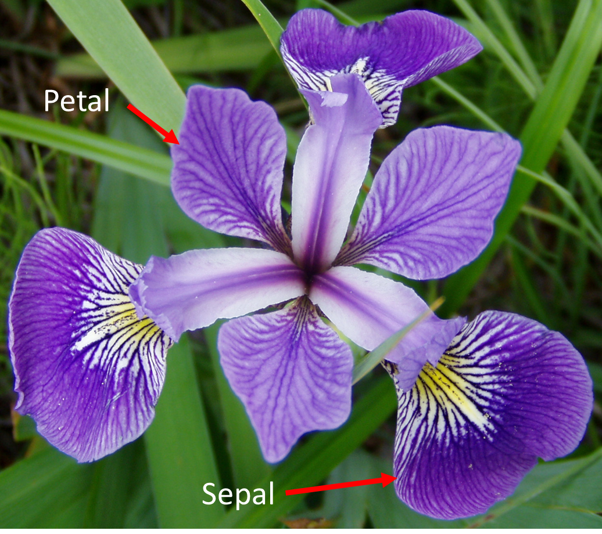
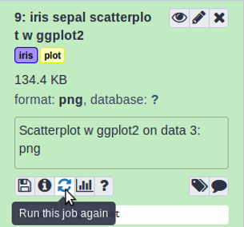
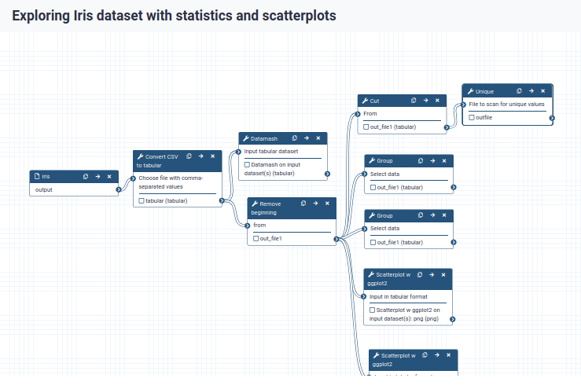
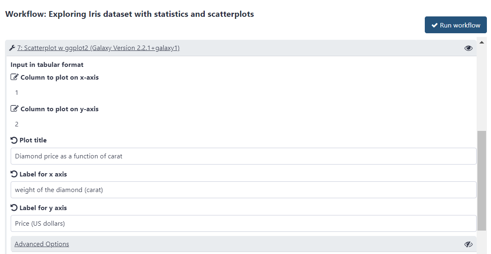
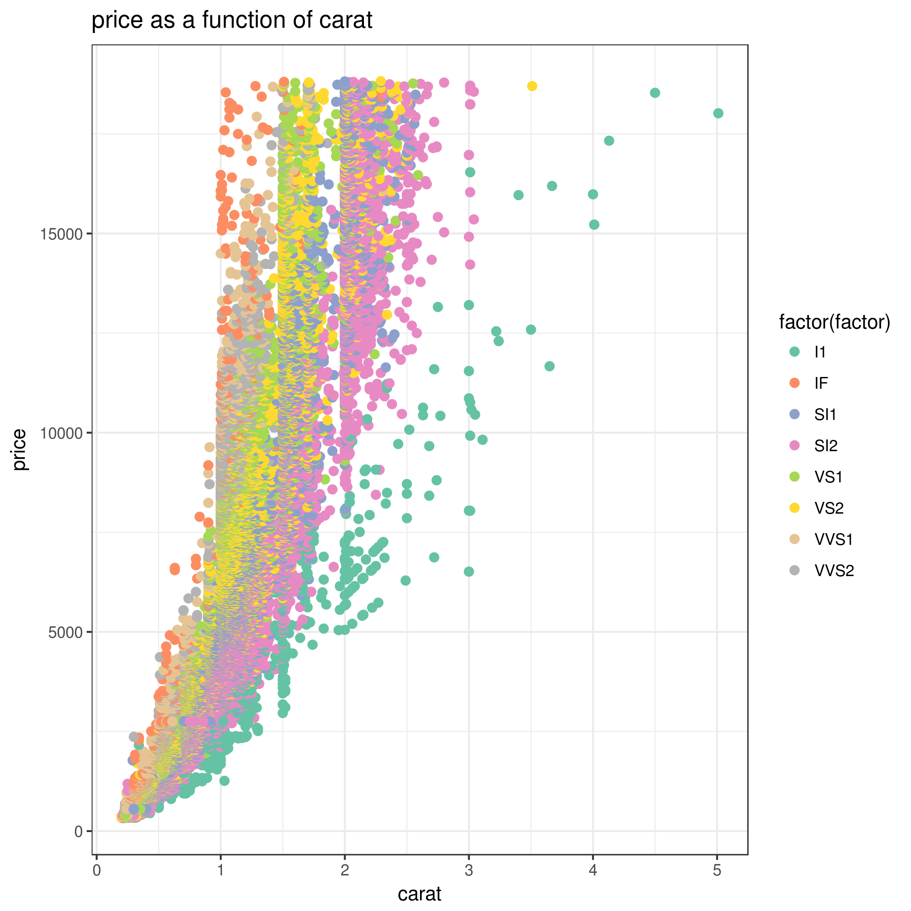

# Introduction
{:.no_toc}

This practical aims at familiarizing you with the Galaxy user interface.
It will teach you how to perform basic tasks such as importing data, running tools, working with histories, creating workflows and sharing your work.
Not everyone has the same background and that's ok!



> ### Agenda
>
> In this tutorial, we will cover:
>
> 1. TOC
> {:toc}
>
{: .agenda}

> ###  Background
> The Iris flower data set, also known as Fisher’s or Anderson's Iris data set, is a multivariate dataset introduced by the British statistician and biologist Ronald Fisher in his 1936 paper ().
> Each row of the table represents an iris flower sample, describing its species and the dimensions in centimeters of its botanical parts, the sepals and petals.
> You can find more detailed information about this dataset on its dedicated [Wikipedia page](https://en.wikipedia.org/wiki/Iris_flower_data_set).
{: .comment}

## What does Galaxy look like?

> ###  Hands-on: Log in or register
> 1. Open your favorite browser (Chrome/Chromium, Safari, or Firefox, but not Internet Explorer/Edge!)
> 2. Browse to a [Galaxy instance](https://galaxyproject.org/use/) of your choice
> 3. Choose *Login or Register* from the navigation bar at the top of the page
> 4. If you have previously registered an account with this particular instance of Galaxy (user accounts are *not* shared between public servers!), proceed by logging in with your registered *public name*, or email address, and your password.
>
>    If you need to create a new account, click on *Register here* instead.
>
>   > ###  Different Galaxy servers
>   > The particular Galaxy server that you are using may look slightly different than the one shown in this training.
>   > Galaxy instance administrators can choose the exact version of Galaxy they would like to offer and can customize its look and feel to some extent.
>   > The basic functionality will be rather similar across instances, so don't worry!
>   {: .comment}
>
{: .hands_on}


The Galaxy interface consists of three main parts:

1. The available tools are listed on the left
2. Your analysis history is recorded on the right
3. The central panel will let you run analyses and view outputs


# Create a history

Galaxy allows you to create analysis histories. A **history** can be thought of as an electronic experimental lab book; it keeps track of all the tools and parameters you used in your analysis. From such a history, a **workflow** can be extracted; this workflow can be used to easily repeat the analysis on different data.

Think of a workflow as a cooking recipe with a list of ingredients (datasets) and a set of instructions
(pipeline of operations) that describes how to prepare or make something (such as a plot, or a new dataset).
The order of operations is important as very often the next operation takes as input the result of the previous operations. For instance, when baking
a cake, you would first sift the flour and then mix it with eggs as it would be impossible to sift the flour afterward.
That is what we call a pipeline. To make a full meal, we may need to combine multiple recipes (pipelines) together.

The finalized pipelines can be generalized as a workflow. If we use cooking as an analogy, a workflow could represent an entire menu with all the recipes for each meal.
In other words, using a workflow makes it possible to apply the same procedure to a different dataset, just by changing the input.

> ###  Hands-on: Create history
>
> 1. Make sure you start from an empty analysis history.
>
>    
>
> 2. **Rename your history** to be meaningful and easy to find. For instance, you can choose **Galaxy 101 for everyone** as the name of your new history.
>
>    
>
{: .hands_on}

## Upload the Iris dataset

> ###  Hands-on: Data upload
>
> 1.  the file `iris.csv` from [Zenodo](https://zenodo.org/record/1319069/files/iris.csv) or from the data library (ask your instructor)
>
>    ```
>    https://zenodo.org/record/1319069/files/iris.csv
>    ```
>
>    
>    
>
>
> 2. **Rename**  the dataset to `iris`
>
>    
>
> 3. Check the **datatype**
>    - Click on the history item to expand it to get more information.
>    - The datatype of the iris dataset should be `csv`.
>    - **Change**  the datatype *if* it is different than `csv`.
>      - Option 1: Datatypes can be **autodetected**
>      - Option 2: Datatypes can be **manually set**
>
>    
>    
>
> 4. Add an `#iris` tag  to the dataset
>
>    
>
>    Make sure the tag starts with a hash symbol (`#`), which will make the tag stick not only to this dataset, but also to any results derived from it.
>    This will help you make sense of your history.
>
{: .hands_on}

# Pre-processing

Often, one or more data pre-processing step(s) may be required to proceed with the analysis.
In our case, the tools we will use require tab-separated input data and assume there is no header line. Since our data is comma-separated and has a header line, we will have to perform the following pre-processing steps to prepare it for the actual analysis:

- Format conversion
- Header removal


## Convert format

First, we will convert the file from comma-separated to tab-separated format. Galaxy has built-in format converters we can use for this.


> ###  Hands-on: Converting dataset format
>
> 1. **Convert**  the CSV file (comma-separated values) to tabular format (tsv; tab-separated values)
>
>    
>
> 2. **Rename**  the resulting dataset to `iris tabular`
>
>    
>
> 3. **View** the generated file by clicking on the  (eye) icon
>
>    > ###  Question
>    >
>    > How many header lines does our file have?
>    >
>    > > ###  Solution
>    > >
>    > > The file has one header line, it contains the column names.
>    > {: .solution}
>    {: .question}
>
{: .hands_on}


## Remove header

Now it is time to run your first tool! We saw in the previous step that our file has 1 header line. This line does not contain any data, but the names of each column. We will now remove that line from our file before moving on to our analysis.

> ###  Tip: Finding your tool
>
> Different Galaxy servers may have tools available under different sections, therefore it is often useful to use the **search bar** at the top of the tool panel to find your tool.
>
> Additionally different servers may have multiple, similarly named tools which accomplish similar functions. When following tutorials, you should use precisely the tools that they describe. For real analyses, however, you will need to search among the various options to find the one that works for you.
>
{: .comment}

> ###  Hands-on: Removing header
>
> 1.  with the following parameters:
>    - *Remove first*: `1` (to remove the first line only)
>    -  *"from"*: select the **iris tabular** file from your history
>    - Click **Execute**
>
>    > ###  Tip: search for the tool
>    >
>    > Use the **tools search box** at the top of the tool panel to find **Remove beginning** .
>    {: .tip}
>
>    
>
> 2. **Rename**  the dataset to `iris clean`
>
>    
>
> 3. Click on the new history item to expand it
>
>    > ###  Questions
>    >
>    > 1. Which tags are present on this resulting dataset? (You may have to refresh the history panel to see the tags)
>    > 2. How many samples (lines) does our dataset contain?
>    >
>    > > ###  Solution
>    > >
>    > > 1. The output of **Remove beginning**  is also tagged with the label `iris`. Tags beginning with a hashtag (`#`) will propagate; they will appear on any datasets derived from your original tagged file.
>    > >
>    > > 2. There are 150 lines in our file (we can see this under the file name when we have expanded the history item). This means we have 150 samples.
>    > {: .solution}
>    {: .question}
>
> 4. **View**  the contents of the resulting file.
>    - You should see that the header line is now no longer present.
>
{: .hands_on}


# Data Analysis: What does the dataset contain?

Now we are going to inspect the dataset using simple tools in order to get used to the Galaxy interface and answer basic questions.

## How many different species are in the dataset?

In order to answer this question, we will have to look at column 5 of our file, and count how many different values (species) appear there. There are several ways we could do this in Galaxy. One approach might be to first extract this column from the file, and then count how many unique lines the file contains. Let's do it!

> ###  Hands-on: Extract species
>
> 1.  columns from a table with the following parameters:
>      - *"Cut columns"*: `c5`
>      - *"Delimited by"*: `Tab`
>      -  *"From"*: `iris clean` dataset
>
> 2. **Rename**  the dataset to `iris species column`
>
>    
>
> 3. **View**  the resulting file
>
> 4.  occurrences of each record  with the following parameters:
>      -  *"File to scan for unique values"*: `iris species column` (the output from **Cut** )
>
> 5. **Rename**  the dataset to `iris species`
>
> 6. **View**  the resulting file
>
>    > ###  Questions
>    >
>    > 1. How many different species are in the dataset?
>    > 2. What are the different Iris species?
>    >
>    > > ###  Solution
>    > >
>    > > 1. There are 3 species.
>    > > 2. The 3 different Iris species are:
>    > >     - setosa
>    > >     - versicolor
>    > >     - virginica
>    > {: .solution}
>    {: .question}
{: .hands_on}

Now we have our answer! There are 3 different Iris species in our file.

Like we mentioned before, there are often multiple ways to reach your answer in Galaxy. For example, we could have done this with just a single tool, **Group**  as well.
(This tool also can be searched for by the term "grouping" )


> ###  Exercise: Grouping dataset
>
> 1. Try answering this question (how many Iris species are in the file?) again, using a different approach:
>    - Tool: **Group** data by a column and perform aggregate operation on other columns 
>    - Input dataset: `iris clean` dataset to answer the same question.
>
> 2. Did you get the same answer as before?
>
> 3. **Rename**  the dataset to `iris species group`
>
> > ###  Solution
> > 1.    with the following parameters:
> >   - *"Select data"* select `iris clean` dataset
> >   - *"Group by column"*: `Column: 5`
> >
> > 2. This approach should give the same answer. There are often multiple ways to do a task in Galaxy, which way you choose is up to you!
> {: .solution}
>
{: .question}


## How many samples by species are in the dataset?

Now that we know that there are 3 different species in our dataset, our next objective is determining how many samples of each species we have. To answer this, we need to look at column 5 again, but instead of just determining how many unique values there are, we need to count how many times each of them occurs.

You may have noticed there were more parameters in the **Group**  tool that we did not use. Let's have a closer look and see if any of them might help us answer this question.

> ###  Tool Help
> To find out more about how a tool works, look at the help text (below the **Execute** button).
>
> Look at the tool help for the **Group** . Do you see any parameters that could help answer this question?
{: .comment}

Looking at the tool help for **Group** , we see that we can also perform aggregate operations such as mean, median, sum, max, min, count (and more). Counting sounds just like what we need, let's try it!

> ###  Hands-on: Grouping dataset and adding information
>
> 1. **Re-run**  the **Group**  with the following parameters:
>    -  *"Select data"*: `iris clean`
>    -  *"Group by column"*: `Column: 5`
>    -  *"Insert operation"*
>      - *"Type"*: `Count`
>      - *"On column"*: `Column: 1`
>
>    
>
> 2. **Rename**  the dataset to `iris samples per species group`
>
> 3. **View**  the resulting file.
>
>    > ###  Question
>    > How many samples per species are in the dataset?
>    >
>    > > ###  Solution
>    > >
>    > > We have 50 samples per species:
>    > >
>    > > | 1         | 2   |
>    > > |---------- | --- |
>    > > |setosa     | 50  |
>    > > |versicolor | 50  |
>    > > |virginica  | 50  |
>    > {: .solution}
>    {: .question}
{: .hands_on}


# Analysis: How to differentiate the different Iris species?

Our objective is to find what distinguishes the different Iris species (Figure 1). We know that we have **3** species of iris flowers, with
**50** samples for each:
- setosa
- versicolor
- virginica

These species look very much alike as shown on the figure below.

")

And our objective is to find out whether the features we have been given for each species can help us to highlight the differences between the 3 species.

In our dataset, we have the following features measured for each sample:
- Petal length
- Petal width
- Sepal length
- Sepal width

> ###  petal and sepal
> The image below shows you what the terms sepal and petal mean.
> 
{: .comment}

## Generate summary and descriptive statistics with

> ###  Hands-on: Get the mean and sample standard deviation of Iris flower features
>
> 1.  with the following parameters:
>    -  *"Input tabular dataset"*: `iris tabular`
>    - *"Group by fields"*: `5`
>    - *"Input file has a header line"*: `Yes`
>    - *"Print header line"*: `Yes`
>    - *"Sort input"*: `Yes`
>    - "Print all fields from input file": `No`
>    - *"Ignore case when grouping"*: `Yes`
>    - In *"Operation to perform on each group"*:
>        -  *"Insert Operation to perform on each group"*
>            - *"Type"*: `Mean`
>            - *"On column"*: `c1`
>        -  *"Insert Operation to perform on each group"*
>            - *"Type"*: `Sample Standard deviation`
>            - *"On column"*: `c1`
>        -  *"Insert Operation to perform on each group"*
>            - *"Type"*: `Mean`
>            - *"On column"*: `c2`
>        -  *"Insert Operation to perform on each group"*
>            - *"Type"*: `Sample Standard deviation`
>            - *"On column"*: `c2`
>        -  *"Insert Operation to perform on each group"*
>            - *"Type"*: `Mean`
>            - *"On column"*: `c3`
>        -  *"Insert Operation to perform on each group"*
>            - *"Type"*: `Sample Standard deviation`
>            - *"On column"*: `c3`
>        -  *"Insert Operation to perform on each group"*
>            - *"Type"*: `Mean`
>            - *"On column"*: `c4`
>        -  *"Insert Operation to perform on each group"*
>            - *"Type"*: `Sample Standard deviation`
>            - *"On column"*: `c4`
>
> 2. Rename the dataset to `iris summary and statistics`
>
>    
>
> 3. **View**  the generated file
>
>
>   > ###  Questions
>   >
>   > 1. Can we differentiate the different Iris flower species?
>   >
>   > > ###  Solution
>   > >
>   > > 1. From the results, we can see that the average *Iris setosa* petal length is lower than 1.5 with a relatively small standard deviation (<0.2).
>   > > The same can be observed for *Iris setosa* petal widths. These numbers are much smaller (width and length) than *Iris versicolor* and *Iris virginica* petals.
>   > > We can then use these characteristics to differentiate *Iris setosa* from the two other species (*I. versicolor* and *I. virginica*). On the other hand,
>   > > we cannot easily differentiate *Iris Versicolor* from *Iris Virginica*. Further analysis is necessary.
>   > >
>   > {: .solution}
>   >
>   {: .question}
>
{: .hands_on}

## Visualize Iris dataset features with two-dimensional scatterplots

Let's visualize the Iris dataset to see how the features depend on each other, and
check whether we can spot any immediate patterns.

> ###  Hands-on: Plot iris feature pairs in two dimensions
>
> 1.    with the following parameters:
>    -  *"Input tabular dataset"*: **iris clean**
>    - *"Column to plot on x-axis"*: `1`
>    - *"Column to plot on y-axis"*: `2`
>    - *"Plot title"*: `Sepal length as a function of sepal width`
>    - *"Label for x axis"*: `Sepal length`
>    - *"Label for y axis"*: `Sepal width`
>    - In *"Advanced Options"*:
>        - *"Data point options"*: `User defined point options`
>            - *"relative size of points"*: `2.0`
>        - *"Plotting multiple groups"*: `Plot multiple groups of data on one plot`
>            - *"column differentiating the different groups"*: `5`
>            - *"Color schemes to differentiate your groups"*: `Set 2 - predefined color pallete`
>    - In *"Output Options"*:
>        - *Additional output format*: `PDF`
>
> 2. **View**  the resulting plot:
>
>    
>
> 3. Rename the dataset to `iris sepal scatterplot`
>
> > ###  Questions
>  >
>  > 1. What does this scatter plot tell us about Iris species?
>  > 2. Make a new scatter plot, this time with *Petal* length versus *Petal* width.
>  > 3. Can we differentiate between the three Iris species?
>  >
>  >    > ###  Tip: Re-running the ggplot tool
>  >    > Instead of clicking on **Scatterplot w ggplot2**  again, it is possible to recall the previous scatterplot parameters by clicking on re-run button and updating the parameters we wish to modify.
>  >    >    > ###  Hands-on: Re-run the tool
>  >    >    > 1. Click on the  icon (**Run this job again**) for the output dataset of **Scatterplot w ggplot2** 
>  >    >    > 
>  >    >    >
>  >    >    > This brings up the tool interface in the central panel with the parameters set to the values used previously to generate this dataset.
>  >    >    {: .hands_on}
>  >    {: .tip}
>  >
>  > > ###  Solution
>  > >
>  > > 1. We get similar results than with Summary and statistics: *Iris setosa* can clearly be distinguished from *Iris versicolor* and
>  > > *Iris virginica*. We can also see that sepal width and length are not sufficient features to differentiate *Iris versicolor* from *Iris
>    > > virginica*.
>  > > 2.  with the following parameters:
>  > >     -  *"Input tabular dataset"*: `iris clean`
>  > >     - *"Column to plot on x-axis"*: `3`
>  > >     - *"Column to plot on y-axis"*: `4`
>  > >     - *"Plot title"*: `Petal length as a function of petal width`
>  > >     - *"Label for x axis"*: `Petal length`
>  > >     - *"Label for y axis"*: `Petal width`
>  > >     - In *"Advanced Options"*:
>  > >         - *"Data point options"*: `User defined point options`
>  > >             - *"relative size of points"*: `2.0`
>  > >         - *"Plotting multiple groups"*: `Plot multiple groups of data on one plot`
>  > >             - *"column differentiating the different groups"*: `5`
>  > >             - *"Color schemes to differentiate your groups"*: `Set 2 - predefined color pallete`
>  > >
>  > > 3. Your new output dataset will look something like this:
>  > >
>  > >   
>  > >
>  > > We can better differentiate between the 3 Iris species but for some samples the petal length versus width is still insufficient
>  > > to differentiate *Iris versicolor* from *Iris virginica*. And as before, *Iris setosa* can easily be distinguished from the two other species.
>  > {: .solution}
>  {: .question}
{: .hands_on}

# Galaxy management

## Convert your analysis history into a workflow

When you look carefully at your history, you can see that it contains all the steps of our analysis, from the beginning to the end. By building this history we have actually built a complete record of our analysis with Galaxy preserving all parameter settings applied at every step. But when you receive new data, or a new report is requested, it would be tedious to do each step over again. Wouldn't it be nice to just convert this history into a workflow that we will be able to execute again and again?

Galaxy makes this very easy with the `Extract workflow` option. This means any time you want to build a workflow, you can just perform the steps once manually, and then convert it to a workflow, so that next time it will be a lot less work to do the same analysis.

> ###  Hands-on: Extract workflow
>
> 1. **Clean up** your history: remove any failed (red) jobs from your history by clicking on the  button.
>
>    This will make the creation of the workflow easier.
>
> 2. Click on  (**History options**) at the top of your history panel and select **Extract workflow**.
>
>    
>
>    The central panel will show the content of the history in reverse order (oldest on top), and you will be able to choose which steps to include in the workflow.
>
>    
>
> 3. Replace the **Workflow name** to something more descriptive, for example: `Exploring Iris dataset with statistics and scatterplots`.
>
> 4. If there are any steps that shouldn't be included in the workflow, you can **uncheck** them in the first column of boxes.
>
> 5. Click on the **Create Workflow** button near the top.
>
>    You will get a message that the workflow was created. But where did it go?
>
>    
>
> 6. Click on **Workflow** in the top menu of Galaxy.
>    - Here you have a list of all your workflows.
>    - Your newly created workflow should be listed at the top:
>
>    
{: .hands_on}

## The workflow editor


> ###  Tip: Problems creating your workflow?
> If you had problems extracting your workflow in the previous step, we provide a working copy for you [here](),
> which you can import to Galaxy and use for the next sections (see below how to import a workflow to Galaxy).
>
> 
>
{: .comment}


We can examine the workflow in Galaxy's workflow editor. Here you can view/change the parameter settings of each step, add and remove tools, and connect an output from one tool to the input of another, all in an easy and graphical manner. You can also use this editor to build workflows from scratch.

> ###  Hands-on: Editing our workflow
>
> 1. Open the **workflow editor**
>    - Click on the dropdown menu  (triangle icon) to the right of your workflow name.
>
> 2. Select **Edit** to launch the workflow editor.
>    - You should see something like this:
>
>    
>
>    - When you click on a workflow step, you will get a view of all the parameter settings for that tool on the right-hand side of your screen (the **Details** section)
>    - You can also change the parameter settings of your workflow here, and also do more advanced configuration.
>
> 3. **Hiding intermediate outputs**
>    - We can tell Galaxy which outputs of a workflow are important and should be shown in our history when we run it, and which can be hidden.
>    - By default, all outputs will be shown
>    - Click the **checkbox** next to the outputs to mark them as important:
>        - `outfile` in  **Unique** 
>        - `out_file1` in **Group**  step
>            - This should be the Group tool where we performed the counting, you can check which one that is by clicking on it and looking at the parameter settings in the **Details** box on the right.
>        - `png` in both **Scatterplot w ggplot2**  steps
>    - Now, when we run the workflow, we will only see these final outputs
>        - i.e. the two dataset with species, the dataset with number of samples by species and the two scatterplots.
>
>    
>
> 4. **Renaming output datasets**
>    - When we performed the analysis manually, we often renamed output datasets to something more meaningful
>    - We can do the same in a workflow (see the tip box below)
>    - Let's rename the outputs we marked as important with the checkbox (and thus do not hide) to more meaningful names:
>        - **Unique** , output `outfile`: rename to `categories` tool
>        - **Group** , output `out_file1`: rename to `samples per category`
>        - Rename the scatterplot outputs as well, remember to choose a generic name, since we can now also run this on data other than iris plants.
>
>    
>
> 5. **Save your workflow** (important!) by clicking on the  icon at the top right of the screen.
>
>
> 6. **Return** to the analysis view by clicking on the Home icon  (or **Analyze Data** on older Galaxy versions) at the top menu bar.
>
{: .hands_on}

> ###  Comments
> We could **validate** our newly built workflow by running it on the same input datasets that we used at the start of this tutorial, in order to make sure we do obtain the same results.
{: .comment}


## Run workflow on different data

Now that we have built our workflow, let's use it on some different data. For example, let us explore the `diamonds` R dataset with it.

> ###  Hands-on: Create a new history and upload a new data
>
> 1. Create a **new history** and give it a name.
>
>    
>
> 2.  the file `diamonds.csv` from [Zenodo](https://zenodo.org/record/3540705/files/diamonds.csv) or from the data library (ask your instructor)
>
>    ```
>    https://zenodo.org/record/3540705/files/diamonds.csv
>    ```
>
>    
>    
>
> 3. **Rename**  the dataset to `diamonds`
>
>    
>
> 4. Add a propagating tag  (e.g. `#diamonds`)
>
>    
{: .hands_on}

The `diamonds` dataset comes from the well-known [ggplot2](https://ggplot2.tidyverse.org/reference/diamonds.html) package developed by Hadley Wickham and was initially collected from the Diamond Search Engine in 2008.
The original dataset consists of 53940 specimen of diamonds, for which it lists the prices and various properties.
For this training, we have created a simpler dataset from the original, in which only the five columns relating to the price and the so-called 4 Cs (carat, cut, color and clarity) of diamond characteristics have been retained.

> ###  The 4 Cs of diamond grading
> According to the [GIA's (Gemological Institute of America) diamond grading system](https://4cs.gia.edu/wp-content/uploads/2013/03/All-Scales.jpg)
> - **Carat** refers to the weight of the diamond when measured on a scale
> - **Cut** refers to the quality of the cut and can take the grades *Fair*, *Good*, *Very Good*, *Premium* and *Ideal*
> - **Color** describes the overall tint, or lack thereof, of the diamond from colorless/white to yellow and is given on a letter scale ranging from D to Z (D being the best, known as colorless).
> - **Clarity** describes the amount and location of naturally occuring "inclusions" found in nearly all diamonds on a scale of eleven grades ranging from *Flawless* (the ideal situation) to *I3* (Included level 3, the worst quality).
{:.comment}

As a further simplification, our training dataset has the qualities in the *color* and *clarity* columns re-encoded as integer values (1-23 for color qualities D-Z, and 1-11 for the clarity levels from *Flawless* to *I3*).
With this adjustment, we can reuse our workflow on the data, and analyze and visualize it following the same steps as we took for the Iris dataset.

> ###  Hands-on: Run workflow
>
> To analyze the diamonds price/4 Cs dataset by reusing our workflow:
>
> 1. Open the **workflow menu** (top menu bar).
>    - Find the workflow you made in the previous section,
>    - Select the option `Run`.
>    - The central panel will change to allow you to configure and launch the workflow.
>
> 2. Select the `diamonds` dataset as the input dataset.
>
> 3. Customize the first scatter plot:
>
>    This step is preconfigured to plot column 1 along the x and column 2 along the y axis, while grouping by column 5.
>    This is fine and will result in *price* getting plotted against *carat* with grouping by *cut*, but you would want to adjust the plot title and axis labels accordingly:
>
>    - Change *"Plot title"* to `Diamond price as a function of carat with cut as a factor`
>    - Change *"Label for x axis"* to `Weight of the diamond (carat)`
>    - Change *"Label for y axis"* to `Price (US dollars)`
>
>    
>
> 4. Customize the second scatter plot.
>
>    This one is preconfigured to plot column 3 along the x and column 4 along the y axis, which, for our new data, would plot *color* as a function of *clarity*. However, we would rather want to stick to plotting *price* against weight in *carat* as in the first plot, but group by *clarity* instead of by *cut* this time, so:
>
>    - Change *"Column to plot on x-axis"* to `1`
>    - Change *"Column to plot on y-axis"* to `2`
>    - Change *"Plot title"* to `Diamond price as a function of carat with clarity as a factor`
>    - Change *"Label for x axis"* to `Weight of the diamond (carat)`
>    - Change *"Label for y axis"* to `Price (US dollars)`
>    - And finally in *"Advanced Options"* change *"column differentiating the different groups"* to `4` (clarity).
>
> 6. Click `Run workflow`.
>
> 7. Once the workflow has started, you will initially be able to see all its steps, but the unimportant intermediates will disappear after they complete successfully:
>
>    > ###  Questions
>    > 1. How many cut category are there in the Diamond dataset ?
>    > 2. How many samples are there in each cut category ?
>    > 3. What do you notice about the relationship between price and carat ?
>    > 4. Based on the plot showing Price vs. Carat with Clarity as a factor, do you think clarity accounts for some of the variance in price? Why ?
>    >
>    > > ###  Solution
>    > >
>    > > 1. There are 5 different cut categories:
>    > > - Fair
>    > > - Good
>    > > - Ideal
>    > > - Premium
>    > > - Very Good
>    > >
>    > > 2. We have the following number of samples in each cut category:
>    > >
>    > >    | 1         | 2      |
>    > >    |---------- | ------ |
>    > >    | Fair      |	1610  |
>    > >    | Good	     |  4906  |
>    > >    | Ideal     |	21551 |
>    > >    | Premium   |	13791 |
>    > >    | Very Good |	12082 |
>    > >
>    > > 3. Using any of the scatter plots we made, we can see an obvious positive (non-linear) relationship between both variables: as carat size increases, price also increases. There is also very clear discrete values that carat size takes on, which are those vertical strips on the graph.
>    > >
>    > >    
>    > >
>    > > 4. Holding carat weight constant, we see on the scatter plot shown above that diamonds with lower clarity are almost always cheaper than diamonds with better clarity: diamonds that are “Internally Flawless” are the most expensive whereas “I1” are the least expensive clarity types. So clarity explains a lot of the variance found in price!
>    > >
>    > {: .solution}
>    {: .question}
{: .hands_on}


## Share your work

One of the most important features of Galaxy comes at the end of an analysis. When you have published striking findings, it is important that other researchers are able to reproduce your in-silico experiment. Galaxy enables users to easily share their workflows and histories with others.

To share a history, click on the  icon in the history panel and select `Share or Publish`. On this page you can do 3 things:

1. **Make History Accessible via Link**. This generates a link that you can give out to others. Anybody with this link will be able to view your history.
2. **Make History Accessible and Publish**. This will not only create a link, but will also publish your history. This means your history will be listed under `Shared Data → Histories` in the top menu.
3. **Share with a user**. This will share the history only with specific users on the Galaxy instance.

> ###  Permissions
> Different servers have different default permission settings. Some servers create all of your datasets completely private to you, while others make them accessible if you know the secret ID.
>
> Be sure to select **Also make all objects within the History accessible** whenever you make a history accessible via link, otherwise whomever you send your link to might not be able to see your history.
{: .comment}

> ###  Hands-on: Share history
>
> 1. Share your history with your neighbour.
> 2. Find the history shared by your neighbour. Histories shared with specific users can be accessed by those users under their top masthead "User" menu under `Histories shared with me`.
{: .hands_on}

# Conclusion
{:.no_toc}

 Well done! You have just performed your first analysis in Galaxy. Additionally you can share your results and methods with others.

